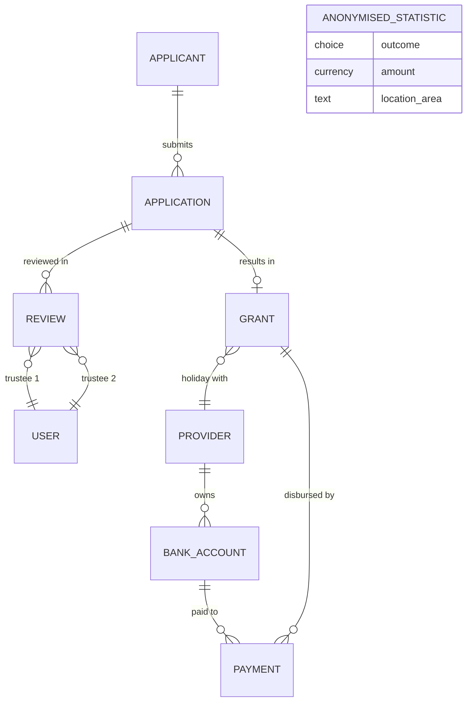
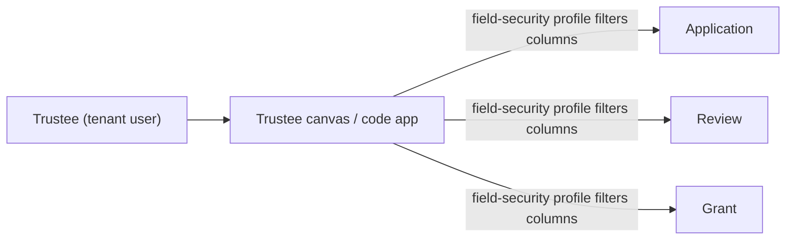

# Grant Application Process — Dataverse data model

Version 0.2 (rev 15 Jul 2026: added the operational Error Log table), draft for review. This is the lean model: v0.1's sixteen entities collapsed to the smallest table set that still holds the process, the security boundaries, and the retention rules. Seven Dataverse tables for the personal and financial data, one SharePoint library for the single signed document, and a non-personal statistics view inside Dataverse. Trustees are tenant users, not a table, and review eligible applications through a canvas or code app rather than a hand-maintained anonymised list.

Read this against v0.1, which carries the full field-by-field disposition of the 163 export columns and the reasoning behind each entity. This version keeps that disposition but folds the one-to-one and single-child entities into their parent so the built solution has fewer tables to secure, fewer relationships to maintain, and fewer places the same person's data can land.

Assumes Dataverse is the chosen platform and that Provider and Payment stay in Dataverse (confirmed 14 July). Sign this off before the solution architecture maps tables to security roles and flows.

## What changed from v0.1, and why

Five folds take v0.1's sixteen entities down to six, and one table is added back on purpose: a Bank Account table so every account the charity pays into lives in one governed place. Seven tables in all.

Support Recipient and Helper fold into Application. Each is at most one person per submission, never reused across applications, and never queried on its own. They become field groups on the Application record, kept under their own field-security profile because they are a second and third person's data. A table bought nothing here except a join.

Panel Round, Application Review and Trustee Decision merge into one Review table. A review is one application considered in one monthly round by the two assigned trustees. One row now holds the round month, the attempt number, both trustees, both verdicts, and the outcome. This keeps the full audit of who decided what and when, and enforces the three-attempts rule as a count of related rows, without three tables to join for a single panel decision.

Grant absorbs Acceptance Agreement and Impact Report. Both are strictly one-to-one with the grant and have no life of their own: the DocuSign acceptance and the post-holiday impact report are stages of the same grant, so they become field groups on it.

Payment stays separate, because that is the finance boundary, and a Bank Account table sits beside it. Every account the charity pays into is a Bank Account row, whether it belongs to a provider or to an applicant being reimbursed. A payment then names one payee and holds no bank fields of its own, so there is a single, unconditional way to record who was paid, and no account is copied across rows. This is the one place the model spends a table to buy neatness rather than save one.

Trustee stops being a table. Trustees are internal tenant accounts (confirmed in-session, still to be re-checked against the tenant), so they are Dataverse users carrying a Trustee security role. The two trustee slots on a Review are User lookups. No custom table shadows the directory.

Group stops being a table. It becomes a Group Reference field on Application. Emily assigns it by hand to link the applications that belong to one holiday; the combined-amount check groups by that field. A table would only earn its place if the combined amount had to be validated against a stored holiday value, which today it does not.

Document and Anonymised Statistic are not tables of their own, and are listed here so the model is complete. The only documents in SharePoint are the signed DocuSign acceptance agreements, each referenced by a link field on its Grant. Everything else stays in Dataverse. The anonymised statistics live in Dataverse too, as a saved view that exposes only the non-identifying columns of the outcome data (age range, location area, condition areas, outcome, amount). Because those figures must outlive the retention purge, the view reads from a small non-personal snapshot table written at outcome, so the statistics survive after the source application is erased.

## The seven tables

**Applicant** — the person, stored once across every application they ever make. Identity and contact (title, first name, last name, address, one email, one phone), age range, applicant type, the equality-monitoring fields (gender, ethnic group), and the applicant's own disability and condition profile. Holds the pseudonymised ID that trustees see instead of a name. Highest sensitivity: PII plus special-category health and ethnicity data. One applicant, many applications.

**Application** — one form submission, and the spine of the process. Carries the submission date and reference, the current status, the break request (type, location, start and end dates, accommodation, travel and other costs, total, amount requested), the financial-circumstances answers, the eleven wellbeing answers, the care-provided profile, the benefit statement, any exceptional-funding request, how they heard about Revitalise, and the per-block consents. The Overall Circumstance Score out of 60 is a calculated field here. Folded in: the Support Recipient field group (the cared-for person's condition profile), the Helper field group (name, email, phone, organisation, relationship), and the Group Reference. Links to one Applicant.

**Review** — one application put in front of one monthly panel. Round month, attempt number (first, second or third), the two assigned trustees as User lookups, each trustee's verdict (approve, defer, reject) with notes and timestamp, and the resulting outcome. Two verdicts recorded, both approvals needed to move the application to approved. This is the panel audit trail. Many reviews per application across attempts; the third rejection closes it.

**Grant** — created when an application succeeds, one-to-one with its Application. Amount granted, decision date, the round it was granted in, and grant status (granted, issued, cancelled, withdrawn). Folded in: the acceptance-agreement fields (DocuSign status, signed date, signed-PDF link) and the impact-report fields (due date auto-set to one month after the holiday end, status, returned content). Anchors Payment. Kept six years.

**Provider** — a holiday provider or partner such as Havens. Name and contact only. Reusable across grants so recurring providers auto-populate. Its bank account lives in the Bank Account table, not here, so the Provider record itself holds no finance data.

**Bank Account** — every account the charity pays into, held once. A provider's account, linked to its Provider and reused across payments; or an applicant's reimbursement account, added when a provider will not take a charity payment. Account name, sort code, account number, payee type, and the owning provider when there is one. Finance role only. This is the single home for bank data, so it is never duplicated onto payment rows or left standing on the Applicant.

**Payment** — a disbursement against a Grant. Amount, date, status, QuickBooks reference, and one Payee lookup to the Bank Account that was paid. No bank fields on the row itself, and one way to name the payee whether it is a provider or an applicant. Finance role only. Held apart so the duplicate-payment check has a clean set of disbursement rows to match against.

## Relationships

Anonymised Statistic sits on its own with no relationship, on purpose: it holds no personal data and must survive the purge of the records it was drawn from, so it is never linked back to them. Trustee 1 and Trustee 2 are Dataverse User lookups, not a custom table. Support Recipient, Helper and Group are field groups on Application. Acceptance Agreement and Impact Report are field groups on Grant. The signed DocuSign agreement is the only SharePoint document, referenced by a link field on Grant.

The trustees never touch the tables directly. They read eligible applications through a canvas or code app, and the field-security profile on the Trustee role decides what that app is allowed to load.

## Where the 163 export columns land

The disposition is unchanged from v0.1; only the destination table changes for the folded groups.

Applicant: identity and contact (cols 15–16, 18, 20–27), age range, applicant type, equality-monitoring (gender, ethnic group), and the applicant's disability and condition profile (the ten condition checkboxes, 54–64, become one multi-select field). The pseudonymised ID replaces the raw ID Number (col 4) on the trustee-facing view.

Application: submission reference and date, status (col 1), grant-round history now derived from Review rows (replacing the three Grant Round booleans, cols 2 and their pair), amount granted moves to Grant, the break request, the financial-circumstances answers (106–113, eligibility not score), the eleven wellbeing answers (95–105) that sum to the score, the care-type checkboxes (81–91) as one multi-select, the "how did you hear" set (138–147) as one multi-select, the benefit statement, exceptional-funding request, and the consent blocks (12–14, 31–33, 46–48, 50–52) each collapsed to a boolean plus a timestamp. Folded field groups: Support Recipient condition profile (68–80, the second ten-condition checkbox set as one multi-select) and Helper (36–45). Group Reference replaces the Group column.

Review: replaces the three Grant Round booleans with attempt-numbered rows; holds the two trustee verdicts. No new export columns — this is process state Emily kept in her admin columns and in her head.

Grant: amount granted, decision date, grant status, and the impact-report due date (from the admin "Impact Report Due" column). Acceptance and impact-report status were tracked outside the form.

Provider, Bank Account and Payment: not in the export. The form's own Payment Amount, Date and Status columns (156–159) are the website plugin's empty fields and are dropped. Real bank details (a provider's, or an applicant's for a reimbursement) live in Bank Account, and disbursements in Payment, both captured after approval.

Dropped: Name Middle and Suffix (17, 19), the duplicated Email and Phone (28–30 against 26–27), and the website telemetry (Created By, Transaction Id, Post Id, User Agent, User IP, Submission Speed, Date Updated, Source Url — 151, 156–163). The static Text and Description copies are form furniture, not data.

## Build specification: entities, columns, relationships

Every table below is a custom Dataverse table except User, which is the standard system user. Column types use Dataverse names. "PII" marks personal data hidden from the Trustee role; "SC" marks special-category data (health, ethnicity); "Finance" marks columns behind the finance role only. The primary name column of each table is listed first. Choice option sets are named where the values are known and flagged "to confirm" where they are not.

### Applicant

Holds each person once. Highest-sensitivity table.

| Column | Type | Notes |
| --- | --- | --- |
| Pseudonymised ID | Autonumber (e.g. REV-A-00001) | Primary column. The reference trustees see instead of a name. |
| Title | Choice | Mr, Mrs, Ms, Mx, Dr, other. |
| First name | Text | PII |
| Last name | Text | PII |
| Address line 1 | Text | PII |
| Address line 2 | Text | PII |
| Town or city | Text | PII |
| Postcode | Text | PII |
| Location area | Text | Trustee-visible. Derived from postcode (outward code or region), no full address. |
| Email | Text (email format) | PII |
| Phone | Text | PII |
| Age range | Choice | Under 18, 18–24, 25–34, 35–49, 50–64, 65+. |
| Applicant type | Choice | Values behind "Are you…" to confirm. |
| Gender | Choice | Equality monitoring. SC-adjacent. |
| Ethnic group | Choice | Equality monitoring. SC. |
| Applicant condition profile | Choice (multi-select) | SC. The ten condition checkboxes as one multi-select. |
| Condition (other) | Text | SC. Free-text "other" condition. |

Relationships: one Applicant has many Applications (1:N to Application).

### Application

The spine. One row per submission. Carries the folded Support Recipient, Helper and Group fields.

| Column | Type | Notes |
| --- | --- | --- |
| Application reference | Autonumber (e.g. GA-2026-00001) | Primary column. |
| Applicant | Lookup → Applicant | Required. |
| Submission date | Date and time | |
| Status | Choice | Incomplete, Submitted, In review, Approved, Rejected, Withdrawn. Drives retention. |
| Group reference | Text | Emily's manual holiday grouping. Replaces the Group table. |
| Break type | Choice | To confirm from the form. |
| Break location | Text | Trustee-visible. |
| Break start date | Date only | |
| Break end date | Date only | |
| Accommodation cost | Currency | |
| Travel cost | Currency | |
| Other cost | Currency | |
| Total cost | Currency (calculated) | Accommodation + travel + other. |
| Amount requested | Currency | |
| Financial circumstances 1–n | Choice / Currency | Eligibility answers (cols 106–113). One column per question; types set once the form is mapped. |
| Wellbeing — life satisfaction | Whole number | 0–10. Part of the /60 score. |
| Wellbeing — statement 1–7 | Choice (1–5 scale) | SWEMWBS-style block. Seven columns. Part of the /60 score. |
| Wellbeing — over the last year 1–3 | Choice | Three columns. Part of the /60 score. |
| Overall circumstance score | Whole number (calculated / flow-set) | Out of 60. Weights from Emily's scoring file, still to confirm. |
| Care-provided profile | Choice (multi-select) | The care-type checkboxes (cols 81–91) as one multi-select. |
| Benefit statement | Text area | |
| Exceptional funding requested | Yes/No | |
| Exceptional funding detail | Text area | |
| How did you hear | Choice (multi-select) | Marketing set (cols 138–147). |
| Consent — privacy | Yes/No | |
| Consent — privacy timestamp | Date and time | |
| Consent — data sharing | Yes/No | |
| Consent — data sharing timestamp | Date and time | |
| Consent — terms | Yes/No | |
| Consent — terms timestamp | Date and time | |
| Consent — marketing | Yes/No | |
| Consent — marketing timestamp | Date and time | |
| Support recipient present | Yes/No | Folded field group. |
| Support recipient condition profile | Choice (multi-select) | SC. Cared-for person's ten conditions (cols 68–80). |
| Support recipient condition (other) | Text | SC. |
| Helper name | Text | PII. Folded field group. |
| Helper email | Text (email format) | PII |
| Helper phone | Text | PII |
| Helper organisation | Text | |
| Helper relationship | Choice | To confirm. |

Relationships: Application is N:1 to Applicant; 1:N to Review; 1:1 to Grant (via a unique Grant → Application lookup).

### Review

One row per application per monthly panel attempt. Merges Panel Round, Application Review and Trustee Decision.

| Column | Type | Notes |
| --- | --- | --- |
| Review reference | Autonumber | Primary column. |
| Application | Lookup → Application | Required. |
| Round month | Date only | First of the panel month, or a month text. |
| Attempt number | Choice | First, Second, Third. Third rejection closes the application. |
| Trustee 1 | Lookup → User | Assigned reviewer. |
| Trustee 1 verdict | Choice | Approve, Defer, Reject. |
| Trustee 1 notes | Text area | |
| Trustee 1 decision date | Date and time | |
| Trustee 2 | Lookup → User | Assigned reviewer. |
| Trustee 2 verdict | Choice | Approve, Defer, Reject. |
| Trustee 2 notes | Text area | |
| Trustee 2 decision date | Date and time | |
| Outcome | Choice (calculated / flow-set) | Approved (both approve), Deferred, Rejected. |

Relationships: Review is N:1 to Application; N:1 to User twice (Trustee 1 and Trustee 2 are two separate lookups to the same User table).

### Grant

Created on success, one per Application. Carries the folded acceptance-agreement and impact-report fields. Kept six years.

| Column | Type | Notes |
| --- | --- | --- |
| Grant reference | Autonumber | Primary column. |
| Application | Lookup → Application (unique) | Enforces 1:1. Required. |
| Amount granted | Currency | Agreed by the panel. |
| Decision date | Date only | |
| Grant status | Choice | Granted, Issued, Cancelled, Withdrawn. |
| Provider | Lookup → Provider | The paying provider. |
| Acceptance status | Choice | Sent, Signed, Declined. |
| Acceptance signed date | Date only | |
| Signed agreement link | URL | Link to the signed DocuSign PDF in SharePoint. |
| Impact report due date | Date only (calculated) | Break end date + one month. |
| Impact report status | Choice | Not due, Due, Received, Overdue. |
| Impact report content | Text area | Returned narrative. |

Relationships: Grant is N:1 to Application (unique, so effectively 1:1); N:1 to Provider; 1:N to Payment.

### Provider

Reusable holiday provider or partner. Identity and contact only; bank details live in Bank Account.

| Column | Type | Notes |
| --- | --- | --- |
| Provider name | Text | Primary column. |
| Contact name | Text | |
| Contact email | Text (email format) | |
| Contact phone | Text | |
| Provider status | Choice | Active, Inactive. |

Relationships: Provider is 1:N to Grant; 1:N to Bank Account.

### Bank Account

Every account the charity pays into, held once. Finance role only. A provider account links to its Provider and is reused; an applicant reimbursement account has no owning provider.

| Column | Type | Notes |
| --- | --- | --- |
| Account name | Text | Primary column. Name on the account. Finance. PII when the account is an applicant's. |
| Payee type | Choice | Provider, Applicant. Finance. |
| Provider | Lookup → Provider | The owning provider; set for provider accounts, blank for applicant reimbursements. Finance. |
| Sort code | Text | Finance. |
| Account number | Text | Finance. |
| Status | Choice | Active, Inactive. Finance. |

Relationships: Bank Account is N:1 to Provider (optional owner); 1:N to Payment.

### Payment

One disbursement against a Grant. Finance role only. Names one payee and carries no bank fields.

| Column | Type | Notes |
| --- | --- | --- |
| Payment reference | Autonumber | Primary column. Finance. |
| Grant | Lookup → Grant | Required. Finance. |
| Payee | Lookup → Bank Account | Required. The account paid. Finance. |
| Amount | Currency | Finance |
| Payment date | Date only | Finance |
| Payment status | Choice | Pending, Issued, Cleared, Cancelled. Finance. |
| QuickBooks reference | Text | Ties to the accounting record. Finance. |

Relationships: Payment is N:1 to Grant; N:1 to Bank Account (Payee).

Every payment names exactly one Payee, a row in Bank Account. When the provider is paid, the Payee is the provider's account. When the provider will not take a charity payment and the applicant pays the provider directly, the charity reimburses the applicant: the Payee is an applicant account in Bank Account, typed Applicant, with no owning provider. Either way the Payment row records who was paid the same way, with no conditional fields. The holiday provider is still known through the Grant, so reporting and the duplicate-payment check keep the provider even on reimbursements. An applicant reimbursement account is erased with the payment it served; it never sits on the Applicant table.

### Anonymised Statistic

Non-personal snapshot, written at outcome, surfaced through a Dataverse view, kept indefinitely. No relationships by design.

| Column | Type | Notes |
| --- | --- | --- |
| Statistic reference | Autonumber | Primary column. |
| Age range | Choice | Copied from Applicant at outcome. |
| Location area | Text | Region only, no address. |
| Condition areas | Choice (multi-select) | Grouped condition categories, not the raw profile. |
| Outcome | Choice | Granted, Not granted. |
| Amount | Currency | Amount granted, or blank. |
| Outcome date | Date only | |

Relationships: none. Deliberately unlinked so it survives the purge of the source records.

### Error Log (operational, non-personal)

Operational table for the build. Each cloud flow wraps its actions in an error-handling scope that writes a row here on failure and calls the REV | Ops | Failure Alert flow. The table records what failed, where and when, so failures across every flow have one place to land and a run status to work through. It holds no personal data: references and technical detail only. Like the Anonymised Statistic, it stands on its own with no relationships.

| Column | Type | Notes |
| --- | --- | --- |
| Log reference | Autonumber | Primary column. |
| Flow name | Text | The flow that raised the entry. |
| Run ID | Text | The Power Automate run, for tracing in run history. |
| Timestamp | Date and time | When the failure was logged. |
| Severity | Choice | Information, Warning, Error. |
| Stage | Text | The step or scope that failed. |
| Message | Text area | Exception text. No personal data. |
| Related reference | Text | A reference only, e.g. GA-2026-00001. Not a lookup. |
| Status | Choice | New, Acknowledged, Resolved. |

Relationships: none. It stands alone, holds no personal data, and is kept on a short operational retention (about 12 months) [TBC — confirm with the DPO], separate from the personal-data schedule and excluded from the personal-data retention sweep.

### Relationship summary

The relationships to create, all one-to-many except where noted:

Applicant → Application. Application → Review. Application → Grant (one-to-one, unique lookup). Grant → Payment. Provider → Grant. Provider → Bank Account (optional owner, blank for applicant reimbursements). Bank Account → Payment. User → Review as Trustee 1. User → Review as Trustee 2. Anonymised Statistic stands alone. Error Log stands alone with no relationships, like the Anonymised Statistic. Documents are a SharePoint link on Grant, not a relationship.

## Field-level security and trustee visibility

Trustees review the Application and its Grant but must not see identity. The trustees work through a canvas or code app that surfaces the eligible applications and shows only the permitted fields; the field-security profile on the Trustee role is what guarantees the hidden fields never reach that app. This replaces the separate anonymised list Emily maintains by hand.

Hidden from the Trustee role: applicant name, address, email and phone, the helper's identity, the support recipient's identity, and anything else that re-identifies. Visible: the pseudonymised ID, age range, location area, the break's start and end dates, costs and amount requested, the wellbeing and financial answers, the circumstance score, and the group linkage. The Bank Account and Payment tables are hidden from everyone except the finance role.

Folding Support Recipient and Helper into Application does not weaken this. Both field groups sit under the same field-security profile that hides the applicant's identity, so a trustee sees the cared-for person's condition profile (which is relevant to the case) but not their name (which is not).

This removes Emily's manual anonymisation and the single-key-holder control, and replaces them with an automated, audited platform control. It is a stronger control but a different one, so the DPO (Rebecca Young) reviews and signs off before build. Fallback if he requires physical separation: feed the trustee app from a real, separate trustee-facing table populated only with the permitted fields, and sync it — more maintenance, but on the table.

## Retention

Retention keys off status on one record, not four copies.

Granted applications and their grants, reviews and payments: six years, aligned to the QuickBooks financial record. Unsuccessful applications: twelve months. Incomplete applications: six months. Because the Review rows and the Grant now hang off the Application, the sweep purges or keeps a whole case by following the Application's status, rather than reconciling separate lists.

Bank accounts follow their type. A provider account persists while the provider is active, since it is reused across grants. An applicant reimbursement account is purged with the payment it served, so an applicant's bank details never outlive the disbursement.

Anonymised statistics: written at outcome to a small non-personal snapshot table (age range, location area, condition areas, outcome, amount — no name, no pseudonymised ID, nothing that re-identifies), surfaced through a Dataverse view, and kept indefinitely. Because the snapshot is written before the source record is purged and holds no personal data, the statistics survive the six-year and twelve-month sweeps. A view on its own would not: it disappears with the records it reads.

The Error Log follows a short operational retention (about 12 months) [TBC], set separately from the personal-data schedule. Because it holds no personal data, it sits outside the personal-data retention sweep.

## Duplicate-payment check

The check Emily raised runs at the payment stage. Match a proposed Payment against QuickBooks on the holiday provider (from the Grant), holiday dates and grant reference, and flag a possible double-pay before issue. Keeping Payment as its own table gives the check a clean set of disbursement rows to match on, rather than a scan of a flat sheet.

## Open questions before architecture

These carry over from v0.1 and gate the build.

Confirm the exact scoring weights and scale behind the score out of 60 (the separate scoring file, still to be seen from Emily). Confirm the pseudonymised ID is per person, not per application, so re-applications link to one Applicant. Confirm the values behind applicant type and whether age under 18 is auto-non-qualification. Get the DPO's decision on field-level security versus a separate trustee store, since it is the one call that could turn Support Recipient and the trustee view back into their own tables. Confirm whether Jan also processes applications, which affects the admin role and licensing.

One decision is specific to this lean cut: folding Grant's acceptance and impact-report stages into the Grant record assumes they never need their own list or lifecycle. If either has to be reported on or worked as a queue in its own right, split it back out. Nothing else in the model changes if you do.

## Next step

On sign-off, the solution architecture maps these seven tables to Dataverse, defines the three security roles (admin, finance, trustee) and the field-security profiles, specifies the flows (scoring, round routing, daily summary, acceptance-to-payment, retention sweep), and settles the trustee portal. None of that starts until the seven tables and the trustee-visibility decision here are agreed.
