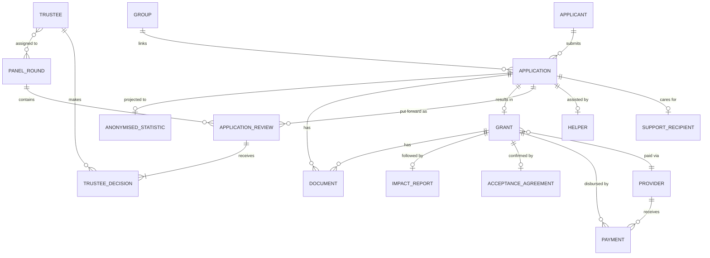

# Grant Application Process — logical data model

Version 0.1, draft for review. Pre-architecture: this defines the entities, relationships and data rules before anything is built in the solution design. Grounded in the website export (`Application Data Export.xlsx`, 163 columns) cross-checked against the July 13 catch-up with Emily.

Sign off this model before the solution architecture is drawn. Everything downstream (Dataverse tables, security roles, portal, automation, retention jobs) keys off these decisions.

## What the export told us

The 163 columns fall into four groups, and the split matters for the model.

Admin columns Emily added (1–11): Status, Grant Round 1/2/3, ID Number, Amount Granted, Group, Reason for Non-Qual, Notes, Overall Circumstance Score, Impact Report Due. These are process state, not form data. In a relational model most of them stop being columns and become their own entities or status fields.

The scoring inputs are now known exactly. The eleven green-highlighted questions (columns 95–105) are the ones that sum to the Overall Circumstance Score out of 60: one life-satisfaction question, seven wellbeing statements (a SWEMWBS-style block), and three "over the last year" questions. The financial questions (106–113) sit next to them but are eligibility, not score. The exact per-question weighting lives in Emily's separate scoring file and still needs to be confirmed.

Payment details are not in the form. The form's own "Payment Amount / Date / Status" columns (156–159) are the website plugin's fields and are empty and unused. The real bank details (the provider's, occasionally the applicant's) are collected by Emily after approval. So payment is a downstream entity, not an application field. This is the single biggest reason the flat sheet strains.

Junk and duplicates to drop: Name Middle and Suffix (17, 19), the duplicated Email/Phone (28–30 against 26–27), and the website telemetry (Created By, Transaction Id, Post Id, User Agent, User IP, Submission Speed, Date Updated, Source Url — 151, 156–163). The consent blocks (12–14, 31–33, 46–48, 50–52) collapse to a boolean plus a timestamp each; the static "Text/Description" copies are not data.

Repeating checkbox blocks become multi-select fields: the ten disability conditions for the applicant (54–64) and the ten for the person they support (69–79), the ten care-type checkboxes (81–91), and the marketing "how did you hear" set (138–147). Forty-odd columns become four choice fields.

## Design principles

One record per real thing. An applicant, a submission, a decision, a payment and a provider are five different things and get five tables, linked by ID. The sheet copies a person across four lists; the model stores each once.

Security by role, not by copy. Trustees see a trimmed view of the same record through field-level security, not a separately anonymised list Emily maintains by hand. The pseudonymised ID stays as their reference. This needs the data protection officer's sign-off, because it replaces the current "separate store plus key" control with a platform one (see the challenge note).

Documents stay in SharePoint. Signed agreements and generated application PDFs live in a document library linked to the record, not in the database.

Derive, don't duplicate. The anonymised statistics kept indefinitely are a non-identifying projection, generated at outcome, not a hand-copied sheet.

## Entities

**Applicant** — the person, stored once across all their applications. Identity and contact: title, first, last, address, one email, one phone, age range, applicant type ("Are you…"), plus the equality-monitoring fields (gender, ethnic group) and their own disability/condition profile. Holds the pseudonymised ID that trustees see. Highest sensitivity: PII plus special-category health and ethnicity data. One applicant has many applications (re-applications, and the every-round history Emily wants to keep).

**Application** — one form submission. The spine of the process. Carries submission date and reference, current Status, the break request (type, location, start/end dates, accommodation/travel/other cost, total, amount requested), the financial-circumstances answers, the eleven wellbeing answers, the care-provided profile, the benefit statement, any exceptional-funding request, how they heard about Revitalise, and consents. Links to one Applicant, optionally to one Group, one Helper and one Support Recipient. The Overall Circumstance Score is a calculated field on this record.

**Support Recipient** — the person the applicant cares for, when there is one. Their disability/condition profile (columns 68–80). Optional, one per application. Modelled separately because it is a second person's special-category data and shouldn't sit inline with the applicant's.

**Helper** — someone assisting with the application (36–45): name, email, phone, organisation, relationship. Optional, one per application.

**Group** — links applications that belong to one holiday so the combined amount can be checked against the holiday value. Group number, notes. Assigned manually by Emily. One group, many applications.

**Panel Round** — a monthly review session. Month/date, the two assigned trustees, status (open, in review, closed). This is where the two-trustee, rotating-monthly pattern lives.

**Application Review** — the junction recording that an application was put forward to a specific Panel Round, and which attempt it was (first, second or third). This replaces the three "Grant Round" boolean columns and enforces the three-attempts-then-rejected rule as a count of related rows rather than three flags.

**Trustee Decision** — one trustee's verdict on one Application Review: approve / defer / reject, plus notes and timestamp. Two per application per round (one each). Both approvals required for the application to move to approved. This is the audit trail of who decided what and when.

**Trustee** — the reviewer, mapped to a security role. Six or seven exist; two are active per round. Drives both the decisions and what data the role can see.

**Grant** — created when an application succeeds. Amount granted (agreed by trustees), decision date, the round it was granted in, and grant status (granted, issued, cancelled, withdrawn). One-to-one with its Application. Kept six years.

**Provider** — a holiday provider or partner (for example Havens). Name, contact, and bank/payment details. Reusable across grants so recurring providers auto-populate. Bank details make this finance-sensitive.

**Payment** — a disbursement against a Grant. Amount, date, status, QuickBooks reference, and the account paid (normally the Provider's, occasionally the applicant's for a specific case). Finance role only. Separated precisely so payment data is governed apart from application data.

**Acceptance Agreement** — the DocuSign acceptance. Status (sent, signed), signed date, link to the signed PDF in SharePoint. Signing is what triggers the provider-payment step. One per grant.

**Impact Report** — due one month after the holiday end date (auto-calculated), status, and content when returned. One per grant.

**Document** — files in the SharePoint library linked to an application or grant: the generated application PDF, the signed agreement. Metadata in Dataverse, file in SharePoint.

**Anonymised Statistic** — a non-identifying projection generated at outcome for fundraising and reporting: age range, location area, condition areas, outcome, amount. No name, no pseudonymised ID, nothing that re-identifies. Retained indefinitely because it carries no personal data.

## Relationships

## Field-level security and trustee visibility

Trustees review the Application and its Grant, but must not see identity. Under this model that is a field-security profile on the Trustee role, not a separate table.

Hidden from the Trustee role: applicant name, address, email, phone, helper identity, support-recipient identity, and anything else that re-identifies. Visible: pseudonymised ID, age range, location area, start/end dates, costs and amount requested, the wellbeing and financial answers, the circumstance score, and group linkage. Payment and bank details are hidden from everyone except the finance role.

This removes Emily's manual anonymisation (the find-and-replace of pronouns and the separately maintained list) and the single-key-holder control. It is a stronger control, automated and audited, but it is a different control, so the DPO reviews and signs off the new model before build. Fallback if he insists on physical separation: keep the Anonymised Statistic-style projection as a real, separate trustee table and sync it — more maintenance, but available.

## Retention

Retention keys off status on a single record, not four copies.

Successful grants and their payments: six years, aligned to the QuickBooks financial record. Unsuccessful applications: twelve months. Incomplete applications: six months. Anonymised statistics: indefinite, because they hold no personal data. Trustee decisions and panel records follow their grant: kept six years if granted, purged with the application otherwise.

## Duplicate-payment check

The check Emily raised runs at the payment stage: match a proposed payment against QuickBooks on provider plus holiday dates plus applicant/grant reference, and flag a possible double-pay before issue. The relational model makes this a lookup across Grant, Provider and Payment rather than a scan of a flat sheet.

## Open questions before architecture

Confirm the exact scoring weights and scale behind the score out of 60 (the separate scoring file). Confirm the pseudonymised ID is per person, not per application, so re-applications link to one applicant. Confirm the values behind "Are you…" (applicant type) and whether age under 18 is auto-non-qualification. Decide whether provider bank details are stored on the Provider record or captured per payment. Get the DPO's decision on field-level security versus a separate trustee store, since it changes whether Support Recipient and the trustee view are one model or two. Confirm whether Jan also processes applications, which affects both licensing and who holds the admin role.

## Next step

On sign-off of this model, the solution architecture maps each entity to a Dataverse table, defines the security roles (admin, finance, trustee) and field-security profiles, specifies the Power Automate flows (scoring, round routing, daily summary, acceptance-to-payment, retention), and settles the trustee portal (model-driven app or Power Pages). None of that should start until the entities and the trustee-visibility decision here are agreed.
