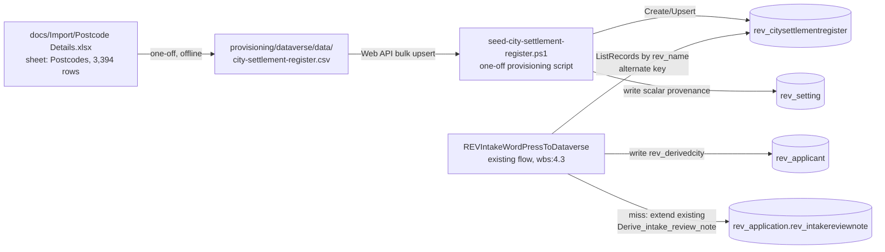
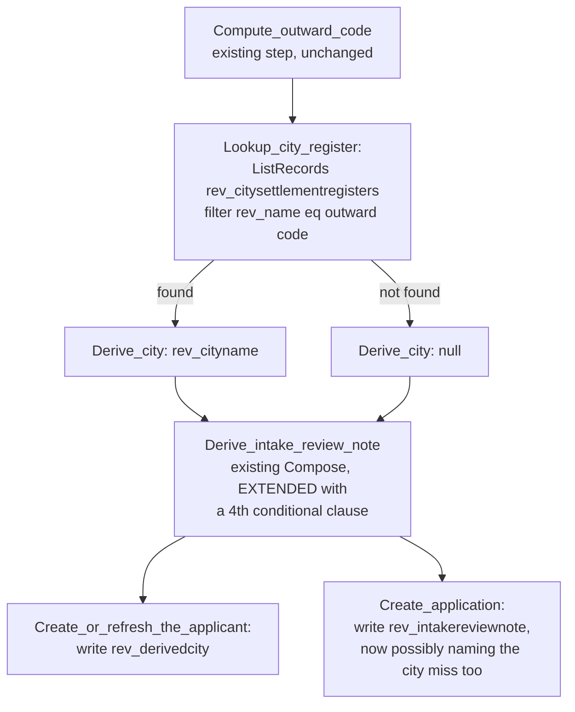

# Technical Architecture Document — Postcode → City Reference Lookup

**Feature Slug:** city-derivation
**SDD Reference:** `docs/plans/city-derivation-plan.md` (reviewer `APPROVED`)
**Date:** 2026-09-23
**Status:** DRAFT
**WBS task:** `4.7` (`contract/change-orders/CO-007.md`, APPROVED 2026-09-22)

**Sibling document:** `docs/architecture/postcode-lookup-architecture.md` (`feature:postcode-lookup`,
`wbs:4.6`) just went through the same "same shape as `PostcodeRegionMap`" exercise for the
local-authority register (`IMP-0830`). This document reads that TAD before designing, per the
lead-agent's own dispatch instruction, and reaches the same row-count conclusion for a different
reason (§1). The two registers remain independent siblings per the SDD's §3/§8 — neither authorises
or blocks the other.

**Author-new decision (activation step 1a):** grepped every approved architecture document
(`docs/architecture/*.md`) for `city`, `towncity`, `wbs:4.7`, `CO-007`, `rev_derivedcity`,
`PostcodeTown` — the only hits are unrelated (`revitalise-grant-automation-architecture.md`'s
DocuSign Grant Referee Title/Address/Town-City/Postcode tabs, ADR-043, a different document's
concept entirely). No conflict or decision row in any approved document names this feature.
**AUTHOR-NEW**, per `IMP-0685` — matching the `postcode-lookup`/`revitalise-grant-record`/
`trustee-portal-visual-refresh` precedent for a genuinely new entity. §11 states the one place this
choice leaves a coverage gap on an *existing* table's TAD row, which the sibling document also
flagged for its own new table.

---

## 1. Architecture Overview

CO-007 and SDD FR-221 ask for the city register in "the same lookup shape" as `PostcodeRegionMap`.
The sibling TAD (`postcode-lookup-architecture.md` §1) already read that mechanism from source
rather than from the requirement's paraphrase of it: `PostcodeRegionMap` is one `rev_setting` row
(`rev_name = 'PostcodeRegionMap'`) whose `rev_value` JSON array is read once per flow run
([`REVIntakeWordPressToDataverse-....json:720-878`](../../src/solutions/RevitaliseGrantAutomation/Workflows/REVIntakeWordPressToDataverse-8F1C2A44-1001-4B7A-9E21-0A1B2C3D4E01.json#L720-L878)),
keyed on a one-/two-letter postcode **area** (~124 values), and bounded by `rev_setting.rev_value`'s
own `MaxLength=4000`
([`Entities/rev_setting/Entity.xml:52-59`](../../src/solutions/RevitaliseGrantAutomation/Entities/rev_setting/Entity.xml#L52-L59)).

**The same ceiling applies here, for the same reason the sibling TAD found it, and it has now been
measured directly against this feature's own source file rather than assumed by analogy.** CO-007's
source, `docs/Import/Postcode Details.xlsx`, sheet `Postcodes`, holds **3,394 data rows**, one per
postcode outward code (verified by opening the workbook: header row
`Postcode District | Main Postal Town / City | Postcode Area | County / Broad Area | Region |
Country`, 3,394 rows below it, zero blank *Main Postal Town / City* values, zero duplicate
*Postcode District* values, outward code max length 4, city name max length 20). A JSON array of
3,394 `{outward code, city}` pairs is tens of kilobytes — the same order of magnitude the sibling
TAD computed for its own ~2,900-row register, and equally unable to fit in a 4000-character column.
**The literal `rev_setting`-row-of-JSON mechanism `PostcodeRegionMap` uses is therefore not available
at this granularity, exactly as ADR-001 of the sibling TAD found for local authority.**

This design keeps FR-221's *intent* — a single outward-code-keyed lookup, read by the intake flow
the same way `PostcodeRegionMap` already is — while changing the *storage* mechanism to a proper
Dataverse table, one row per outward code (**ADR-001**, below). Two respects in which this register
is **simpler** than the sibling's local-authority register, both because the source data itself is
simpler:

1. **No resolution-status option set is needed.** The client's file has no ambiguity to flag — every
   outward code maps to exactly one city, with no blank and no multi-value row (measured above). A
   miss here is not "ambiguous", it is "the outward code has no row in the register at all" (FR-222).
2. **No refresh mechanism, and therefore no Cloud Flow, generates this register.** CO-007 prices no
   refresh (Out of Scope, §3) and OQ-221's architecturally-derived default is "no refresh job, since
   the source is a one-off delivered file with no stable endpoint to re-pull from" — carried forward
   as this document's design, not re-opened (**ADR-003**, below).

**Alternatives rejected:**
- *Keep using `rev_setting` and accept truncation.* Rejected for the same reason the sibling TAD
  rejected it for local authority — a silently-truncated lookup table is a worse defect than the one
  FR-222 exists to prevent.
- *One `rev_setting` row per outward code (3,394 rows).* Technically avoids the 4000-character cap
  but turns a reference table into thousands of individually-keyed settings rows with no `$filter`
  on the value itself — the same rejection the sibling TAD gave its analogous alternative.
- *Reuse `rev_localauthorityregister`'s table shape by adding a city column to it.* Rejected: FR-227
  requires this feature's scope to stay disjoint from CO-004's register (different source file,
  different consumer, independently priced), and the two tables have different population logic (one
  flags multi-authority ambiguity, the other never does) — folding them together would make a future
  change to either register's refresh behaviour (or absence of one) a change to both.

## 2. Component Diagram





## 3. Data Model

### Entities

| Entity | Purpose | Classification |
|---|---|---|
| `rev_citysettlementregister` (**new**) | One row per UK postcode outward code present in the client's delivered file, holding the *Main Postal Town / City* value (FR-220–FR-222). Organization-owned reference data, seeded once, never refreshed (§1, ADR-003) | **Not personal data** (NFR-220) — public geographic reference data, same tier as `rev_setting` and the sibling `rev_localauthorityregister` |
| `rev_applicant` (existing, **new column**) | Gains `rev_derivedcity` (FR-224) | **Tier 4** (existing table classification, `knowledge/domain/data-entities.md`) — see §6 for why this specific column is secured |
| `rev_setting` (existing, no schema change) | Carries two new scalar rows: `CitySourceFile`, `CitySourceCapturedOn` (FR-229, NFR-221) | Configuration (unchanged tier) |

### `rev_citysettlementregister` — columns

| Column | Type | Notes |
|---|---|---|
| `rev_name` | Single line of text, max 4, **primary name**, **alternate key** | The outward code (`SW1A`, `AB10`), upper-cased, no space — computed the same way the intake flow's existing `Compute_outward_code` step already computes it ([`...json:833-842`](../../src/solutions/RevitaliseGrantAutomation/Workflows/REVIntakeWordPressToDataverse-8F1C2A44-1001-4B7A-9E21-0A1B2C3D4E01.json#L833-L842)), so the intake lookup never re-derives outward-code logic a second way |
| `rev_cityname` | Single line of text, max 100 (source values measured at ≤20 characters; 100 matches the existing `rev_applicant.rev_towncity` column width rather than the measured minimum, so a future longer settlement name is not a schema change) | The client file's *Main Postal Town / City* value. **Always populated for every row that exists** — the source file has no blank city values (§1) — so, unlike the sibling register's `rev_localauthorityname`, there is no in-register null state to design for. A miss is the *absence of a row*, not a populated-but-empty one |
| `statecode` / `statuscode` | State/Status | Standard |

**No `rev_resolutionstatus` column, and no new global option set.** This is a deliberate reduction
from the sibling register's shape (§1 point 1), not an oversight — see **ADR-002**.

**No `rev_lastseeninsource` column.** The sibling register's equivalent column exists to distinguish
"confirmed current" from "carried forward across refreshes" — a distinction that does not exist for
a table that is never refreshed (**ADR-003**).

**Alternate key:** `rev_name` (outward code) — the same alternate-key pattern the sibling register
uses and `knowledge/technology/dataverse.md` documents as proven (`rev_grant.rev_applicationid`,
`IMP-0044`). Built **after** the table exists and its index awaited to `Active`
(`EntityKeyIndexStatus`) before the seed script's first upsert or the intake flow's first lookup
relies on it (`C-TECH-053`) — the same discipline the sibling TAD applies, restated here because it
binds this document's own §12.1, not inherited by reference.

### `rev_applicant.rev_derivedcity` — the new column

| Property | Value |
|---|---|
| Type | Single line of text, max 100 (matches `rev_cityname` above) |
| `IsSecured` | **1** — see §6 for why |
| Populated by | The intake flow only (§5). Never typed by a person |
| Default when the outward code has no register row (FR-222) | **`null`** — never a guess, never the register's own `rev_towncity`-style free text |

**Consequence trace (FR-222/US-220, the default-is-what-the-reader-sees rule, `IMP-0511`):** when an
applicant's outward code is not in the register, `rev_derivedcity` reads **blank** on the Applicant
record to anyone permitted to see the column at all (§6) — never a placeholder string, never the
London-area outward code itself echoed back. The honest, visible answer is "we do not have a
controlled city for this applicant", exactly the FR-222 requirement's own wording, traced through to
what a grant administrator sees on the record, not merely to the flow's internal branch.

### Relationships

None. `rev_citysettlementregister` has no lookup to or from any entity — a standalone reference
table, read by outward-code value, never joined. Same reasoning as the sibling register: a
relationship would imply a referential-integrity obligation this register does not need.

### Retention (`C-DOM-003`)

`rev_citysettlementregister` is non-personal, indefinite reference data — same retention posture as
`rev_setting` and the sibling `rev_localauthorityregister` (`knowledge/domain/data-entities.md`:
"Indefinite, by design" is the closest documented analogue, `rev_anonymisedstatistic`). No data
subject, no retention clock. `rev_derivedcity` on Applicant follows the **existing** Applicant
retention schedule (`knowledge/domain/data-entities.md`: "Cascade from Application") — it is a new
column on an existing Tier 4 table, not a new entity, so no new retention decision is introduced.

### Migration Strategy

New table, no new global option set (contrast with the sibling register — ADR-002), one new column
on the existing `rev_applicant` table, and two new configuration rows on `rev_setting`'s data (not
schema). No existing table's schema changes beyond the one addition.
`provisioning/dataverse/ensure-schema.ps1` gains: the new table and its columns, the new
`rev_derivedcity` attribute on `rev_applicant`, and — because `rev_derivedcity` is secured — a new
`FieldPermission` row added to the **already-existing** `REV_TrusteeRestricted` profile. That last
item is the one this document flags loudest in §12.1: `C-TECH-050` was widened specifically because
adding a new `FieldPermission` to an already-existing profile has failed live twice via ordinary
solution import, and the only route that has worked is the Web API `POST` `ensure-schema.ps1` already
uses (`knowledge/technology/dataverse.md` → *Solution Import*).

## 4. Integration Design

| Integration | Direction | Protocol | Auth Method |
|---|---|---|---|
| `docs/Import/Postcode Details.xlsx` → `provisioning/dataverse/data/city-settlement-register.csv` | One-off, offline, outside any environment | File conversion (checked-in CSV, not parsed at runtime) | n/a — no live connection, no DLP surface, no new connector |
| `rev_citysettlementregister` (Dataverse) | Write (upsert, seed script only) + Read (intake flow) | Dataverse Web API (seed script) / Dataverse connector (intake flow) | Service principal / provisioning credential, same as `ensure-schema.ps1`'s existing pattern |
| `rev_setting` (Dataverse) | Write (seed script, once) | Dataverse Web API | Same provisioning credential |

**Why a checked-in CSV rather than parsing the `.xlsx` at deploy time.** The workbook has already
been opened and its exact shape ground-truthed for this document (§1) — sheet `Postcodes`, six
columns, 3,394 rows, no blanks, no duplicates. Converting it once, offline, into a plain CSV that the
provisioning script reads is strictly less work than teaching a PowerShell script to parse an Office
Open XML workbook, and it removes an entire class of "does the parsing library exist in the pipeline
agent's runtime" risk that a live `.xlsx` read would introduce. This is not an unvalidated platform
contract (`C-TECH-052`) — the source has been read directly, not guessed at — so no assumption
register row is opened for it.

**Request/response contract — the four-point checklist:**
- **Every output is named.** The CSV's two columns are named `OutwardCode`/`CityName`, matching
  `rev_name`/`rev_cityname` one for one — no invented intermediate field.
- **Every enumerated value has its wording.** There are none — this register has no Choice column
  (ADR-002), so there is no enumerated-value wording to specify.
- **Where two fields name the same fact:** none — `rev_cityname` is the only descriptive column, with
  no provenance duplicate on the row itself (provenance lives on `rev_setting`, §3, not per-row).
- **Single source:** the register is the only place a derived city value lives; `rev_towncity`
  remains the applicant's own separate, unrelated typed value (FR-228).

No unvalidated platform contract is flagged for this integration (contrast with the sibling TAD's
`A-LAR-01`) — there is no live external endpoint in this design at all.

## 5. Automation / Workflow Design

### 5.1 Register generation — a one-off provisioning script, not a Cloud Flow

**`seed-city-settlement-register.ps1`** (new script, `provisioning/dataverse/`) — run once per
environment, after §12.1's schema step and after the alternate key reaches `Active`. It reads
`provisioning/dataverse/data/city-settlement-register.csv` and upserts each row into
`rev_citysettlementregister` by the `rev_name` alternate key (idempotent — safe to re-run), then
writes the two `rev_setting` provenance rows (`CitySourceFile = 'Postcode Details.xlsx'`,
`CitySourceCapturedOn = '2026-09-16'`, the date the file was delivered per
`docs/plans/emily-review-feedback-2026-09-plan.md` line 1321 — FR-229, NFR-221).

**This is not a Cloud Flow, and that is a design decision, not an omission (ADR-003).** The sibling
register's generator is a Recurrence-triggered flow because that register is refreshed quarterly from
a live endpoint. This register has neither a live endpoint nor a refresh requirement (SDD §3 Out of
Scope, OQ-221's carried-forward default) — a Cloud Flow with no trigger that ever legitimately fires
again is a mechanism built for a job that does not exist. A provisioning script matches the actual
shape of the work: run once, per environment, as part of deployment, exactly like
`ensure-schema.ps1` itself.

### 5.2 Intake derivation — resolving OQ-223

**OQ-223 asked whether miss-handling (FR-222/FR-225) ends up as a separate build step or stays inline
in the lookup, because `CO-007`'s 4–6h ROM assumed the latter.** Reading the existing mechanism from
source settles this rather than leaving it a judgement call:

`Derive_intake_review_note` ([`...json:982-991`](../../src/solutions/RevitaliseGrantAutomation/Workflows/REVIntakeWordPressToDataverse-8F1C2A44-1001-4B7A-9E21-0A1B2C3D4E01.json#L982-L991))
is a **single Compose action** whose `inputs` expression is one `concat()` of three conditional
clauses — one per re-mapped Choice field (`exceptional_circumstance`, `employment_status`,
`care_hours_per_week`) that might fail to match a configured option. Each clause is an
`if(and(...), concat('field: "value" not in the option list. '), '')` term.

**Resolution: miss-handling for city is a FOURTH clause added to that SAME `concat()` expression —
not a new flow action, not a new Compose step, not a new branch.** Concretely:

```
if(and(not(empty(outputs('Compute_outward_code'))), equals(outputs('Derive_city'), null)),
   concat('city: outward code "', outputs('Compute_outward_code'), '" not found in the city register. '),
   '')
```

appended as the `concat()`'s fourth argument. This is **inline** in exactly the sense OQ-223 asks
about: the existing single-action mechanism grows one more conditional term, the same shape its three
existing terms already have, rather than gaining a sibling action, an `If` branch, or a second write
to `rev_intakereviewnote`. **This confirms CO-007's own 4–6h ROM does not need re-confirmation on
miss-handling-shape grounds** — see §10 for the size-check this closes out.

**Sequencing.** `Lookup_city_register` and `Derive_city` (below) must run **before**
`Derive_intake_review_note`, so its concat expression can reference `outputs('Derive_city')`. They
are inserted immediately after the existing `Derive_location_area` step (the same point in the
sequence the sibling register's own consumer would read from), and `Derive_intake_review_note`'s
`runAfter` gains `Derive_city` alongside its existing `Derive_preferred_contact_method` dependency.

**New steps, in order (inserted into the existing flow, not a new flow):**

1. **`Lookup_city_register`** (`ListRecords`, Dataverse connector) — `rev_citysettlementregisters`,
   `$filter: rev_name eq '<outward code>'` (using `outputs('Compute_outward_code')`, already computed
   by the existing step), `$select: rev_cityname`, `$top: 1`.
2. **`Derive_city`** (Compose) —
   `@if(greater(length(body('Lookup_city_register')?['value']), 0), first(body('Lookup_city_register')?['value'])?['rev_cityname'], null)`.
   Never guesses; a miss resolves to `null`, exactly as `Derive_location_area`'s own established
   house style never guesses a region.
3. **`Derive_intake_review_note`** (existing action, **extended**) — fourth `concat()` clause, above.
4. **`Create_or_refresh_the_applicant`** (existing action, **extended**) — `rev_derivedcity:
   @outputs('Derive_city')` added to both the `Refresh_existing_applicant` and `Create_new_applicant`
   parameter sets ([`...json:1052-1064`](../../src/solutions/RevitaliseGrantAutomation/Workflows/REVIntakeWordPressToDataverse-8F1C2A44-1001-4B7A-9E21-0A1B2C3D4E01.json#L1052-L1064),
   [`...json:1088-1108`](../../src/solutions/RevitaliseGrantAutomation/Workflows/REVIntakeWordPressToDataverse-8F1C2A44-1001-4B7A-9E21-0A1B2C3D4E01.json#L1088-L1108)).
   `rev_towncity` is **not touched** in either block — FR-228's consequence trace: the applicant's
   typed value is written from `triggerBody()?['town_city']` exactly as it already is, on the same
   two lines it already occupies, before and after this change.

**Consequence trace for the miss-handling Decision (numbered, per `IMP-0704`'s house rule — the
Decision above names exactly TWO interventions, traced here in the same order):**

1. **`rev_derivedcity` resolves to `null`.** A grant administrator opening the Applicant record sees
   the city field blank (§3) — never the outward code, never a guessed name.
2. **`rev_intakereviewnote` names the miss.** The Application record's existing review-note field
   gains a fourth possible clause, in the same shape its three existing clauses already have — a
   process owner reading that field sees `city: outward code "EC1A" not found in the city register.`
   alongside whatever else the same application's note already contains.

Both interventions fire together on every miss; neither is optional or conditional on the other —
that is the whole of the intervention, matching the count the Decision states.

## 6. Security Design

| Concern | Control | Where Applied |
|---|---|---|
| Authentication | Service principal (Dataverse connector / Web API), no external auth surface (§4) | Flow connections, provisioning script |
| Authorisation | `REV Base User` gains Read on the new table; `REV Service Automation` gains Create/Read/Write | §6.1 |
| Data at rest | `rev_citysettlementregister` holds no personal data (NFR-220) — no column security. `rev_applicant.rev_derivedcity` **is** secured — see below | Both tables |
| Data in transit | Dataverse connector TLS 1.2+ (`C-TECH-003`); no external HTTP call exists in this design (contrast with the sibling register) | — |
| Audit logging | `IsAuditEnabled=1` on `rev_citysettlementregister` at table level, consistent with the sibling register. `rev_derivedcity` inherits `rev_applicant`'s existing table-level and field-level audit posture — no new audit decision needed for one additional secured column on an already-audited table | Both |
| App registrations / API permissions | None new | — |

### `rev_derivedcity` is secured under `REV_TrusteeRestricted` — ADR-005

`rev_applicant.rev_towncity` and `rev_applicant.rev_locationarea` are **both already secured** under
`REV_TrusteeRestricted`
([`FieldSecurityProfiles.xml:179-187`](../../src/solutions/RevitaliseGrantAutomation/Other/FieldSecurityProfiles.xml#L179-L187),
[`FieldSecurityProfiles.xml:497-509`](../../src/solutions/RevitaliseGrantAutomation/Other/FieldSecurityProfiles.xml#L497-L509)) —
the latter's own comment records a **dated, explicit** reviewer decision: *"EF-02, 2026-09-17 …
Confirmed 2026-09-17: trustees see no location at all — this column and the region column on the
trustee list are removed together."* `rev_derivedcity` is a third location attribute on the same
table, more specific than the region `rev_locationarea` already carries and no less identifying than
the free-text `rev_towncity` it is derived alongside. Treating it differently from its two
neighbours — leaving it unsecured while they are secured — would silently reopen the EF-02 decision
for one column without a reviewer ever being asked. **Decision:** `rev_derivedcity` is `IsSecured=1`,
added to the `REV_TrusteeRestricted` profile definition alongside `rev_towncity`/`rev_locationarea`.
**This is a solution-source change** (the profile's *definition* — which columns it releases — ships
in the solution); membership of the profile (who belongs to it) remains per-environment configuration
in `provisioning/deploymentSettings/`, unchanged by this decision
(`knowledge/technology/dataverse.md` → *Profile MEMBERSHIP is per-environment config*).

### 6.1 Security Role & Group Mapping

| Persona | Entra Security Group | Dataverse Group Team | Security Role(s) | App Access |
|---|---|---|---|---|
| Grant Administrator | `REV-GrantAdmins-<Env>` (existing) | `REV Grant Administrators` (existing) | `REV Base User` **+ Read on `rev_citysettlementregister`** (additive — no new role) | MDA, unchanged |
| Service Automation | n/a (service principal) | n/a | `REV Service Automation` **+ Create/Read/Write on `rev_citysettlementregister`, Read/Write on the two new `rev_setting` rows** | Flow + provisioning script owner |
| Trustee | `REV-Trustees-<Env>` (existing) | `REV Trustees` (existing) | **No access** to `rev_citysettlementregister` (operational reference data, not trustee-facing) **and no `REV_TrusteeRestricted` membership** (so `rev_derivedcity` reads as no value to a trustee, per ADR-005) | — |

No new persona. `rev_citysettlementregister` is added to `REV Base User`/`REV Service Automation` as
an additional table-privilege grant, same pattern the sibling register uses and the "every custom
table appears in at least one persona role" rule requires.

## 7. Non-Functional Decisions

| NFR ID | Decision | Rationale |
|---|---|---|
| NFR-220 | No personal data anywhere in `rev_citysettlementregister`'s schema (§3) | Confirmed by column list — outward code (public geographic unit) to city name only |
| NFR-221 | Provenance recorded via the two `rev_setting` rows (`CitySourceFile`, `CitySourceCapturedOn`), seeded once by the provisioning script (§5.1), never updated thereafter | Distinguishes this register's static, one-off provenance from the sibling's quarterly-refreshed `SourceEdition`, satisfying FR-229's "verifiable without re-researching" requirement without inventing a refresh-shaped field this register does not need |

## 8. Accessibility

No UI is introduced. `rev_citysettlementregister` is consumed by the intake flow only, never
rendered to a person directly. `rev_derivedcity` on the Applicant form is a read-only, flow-populated
value (see §12.1's C-TECH-077 note) — no new interactive control, so no new accessibility surface.

## 9. Deployment Topology

| Environment | Method | Notes |
|---|---|---|
| Dev | Unmanaged solution, `ensure-schema.ps1 -Env dev` first (§12.1), then `seed-city-settlement-register.ps1 -Env dev` | One-off seed; no recurring job to schedule |
| Test / Acceptance | Managed solution import, `ensure-schema.ps1 -Env test` first, then the seed script | Seed run repeated — DEV's seeded rows do not travel with the solution import (data, not schema) |
| Production | Managed solution import, `ensure-schema.ps1 -Env prd` first, gated `APPROVE PRD`, then the seed script | Same one-off seed requirement. No sequencing dependency on the sibling register (SDD §8: independent siblings) |

**MDA navigation.** Unlike the sibling register, this table is not itself a candidate for a grant
administrator to browse routinely — its only consumer is the intake flow, and its value surfaces to
a person via `rev_derivedcity` on the Applicant record, which the existing Applicant main form
already exposes for `rev_towncity`/`rev_locationarea` in the same `sec_identity`-style block. A
minimal `AllCitySettlementRegisters` view and `SubArea` under the existing **Operations** group are
still added, at the same low cost the sibling TAD paid, so the register is reachable for
troubleshooting a miss rather than shipping unreachable the way `rev_grant` once did
(`knowledge/technology/platform.md`).

## 10. Architecture Decision Records

### ADR-001: A new Dataverse table replaces the `rev_setting`-JSON-row mechanism for this register
**Context:** FR-221 asks for "the same lookup shape as `PostcodeRegionMap`". Reading
`PostcodeRegionMap` from source (§1, and independently confirmed by the sibling TAD's own ADR-001)
shows a 4000-character cap sized for ~124 area prefixes; this feature's own source file measures at
3,394 outward-code rows.
**Decision:** build `rev_citysettlementregister` as a proper Organization-owned reference table, one
row per outward code, keyed by an alternate key on `rev_name` — preserving FR-221's *intent* (a
single outward-code-keyed lookup) without inheriting a platform limit neither the SDD's nor CO-007's
author could have seen from the requirement text alone.
**Consequences:** a consumer does a `ListRecords`/`Retrieve` by alternate key rather than a
`Query`/`contains()` over a JSON blob — a marginally different but equally simple action, recorded
here rather than silently, per `IMP-0790`'s discipline on claims this desk cannot verify from the SDD
text alone.

### ADR-002: No resolution-status option set — a miss is an absent row, not a flagged value
**Context:** the sibling local-authority register needs `Multi-Authority`/`NI Pending Licence` states
because ONSPD genuinely has ambiguous and licence-gated outward codes. This feature's source file
(§1) has zero blank city values and zero duplicate outward codes across all 3,394 rows measured.
**Decision:** `rev_citysettlementregister` carries only `rev_name` and `rev_cityname` — no
`rev_resolutionstatus` column, no new global option set. FR-222's miss case is represented by the
outward code simply having no row in the table, checked by the intake flow's `ListRecords` returning
zero results (§5.2).
**Consequences:** a smaller schema and no new global option set to create under `C-TECH-050` — a real
simplification, not a shortcut, because the source data measured has no ambiguity for a status column
to record. If a future revision of the source file introduces a genuine ambiguity (two towns per
outward code, for instance), this decision would need reopening; nothing in the current 3,394-row
file requires that today.

### ADR-003: The register is seeded by a one-off provisioning script, not a Cloud Flow
**Context:** CO-007 prices no refresh mechanism (SDD §3 Out of Scope), and OQ-221's
architecturally-derived default is "no refresh job, since the source is a one-off delivered file with
no stable endpoint to re-pull from" — carried forward, not re-opened, per the SDD's own instruction
to architect-agent.
**Decision:** `seed-city-settlement-register.ps1`, a new script in `provisioning/dataverse/`,
upserts the register once per environment from a checked-in CSV (§4, §5.1). No Cloud Flow, no
Recurrence trigger, no manual-trigger flow standing by for a refresh that is out of scope.
**Consequences:** *Positive* — no DLP surface, no live external HTTP integration risk (contrast with
the sibling register's `A-LAR-01`), and no maintenance burden for a mechanism nothing in this scope
ever calls again. *Negative* — if OQ-221 is later reversed (a refresh is wanted after all), this
design is replaced rather than extended: a provisioning script has no trigger to add a Recurrence to,
so a future refresh would need its own automation, sized as new work at that time.

### ADR-004: City miss-handling extends the existing `Derive_intake_review_note` Compose action inline
**Context:** SDD OQ-223 — whether miss-handling (FR-222/FR-225) is itemised as a separate build step,
which would trigger a re-confirmation of CO-007's 4–6h ROM.
**Decision:** add a fourth conditional clause to the existing single-action `concat()` expression in
`Derive_intake_review_note` (§5.2), rather than a new flow action, branch, or write.
**Consequences:** OQ-223 is resolved — miss-handling stays inline, in the same shape as the three
existing Choice-field-mismatch clauses, so CO-007's ROM does not need re-confirmation on
miss-handling-shape grounds (§section closing the size-check, cited in §10 footer below). The
`rev_intakereviewnote` column's existing 2000-character `ntext` capacity
([`Entities/rev_application/Entity.xml:96-102`](../../src/solutions/RevitaliseGrantAutomation/Entities/rev_application/Entity.xml#L96-L102))
comfortably absorbs one more short clause alongside its existing three — no schema change to that
column is needed, closing the SDD's own flagged assumption ("EF-20's existing mechanism can carry a
lookup-miss reason without a schema change of its own") as confirmed rather than left open.

### ADR-005: `rev_derivedcity` is secured under `REV_TrusteeRestricted`
**Context:** `rev_towncity` and `rev_locationarea` — the two existing location attributes on
Applicant — are both secured under `REV_TrusteeRestricted`, the latter by an explicit, dated EF-02
reviewer decision that trustees see no location data at all.
**Decision:** `rev_derivedcity` joins the same profile, added to `FieldSecurityProfiles.xml`'s
existing `REV_TrusteeRestricted` block (§6).
**Consequences:** consistent trustee-visibility posture across all three location columns without
reopening EF-02 for a fourth time. Because this adds a `FieldPermission` to an **already-existing**
profile, `C-TECH-050`'s widened rule applies in full — the Web API route in `ensure-schema.ps1` is
the only proven path for this specific class of change (§12.1), and ordinary solution import must not
be relied on to carry it. **`C-DOM-033` obligation, carried to development-agent:** `rev_towncity`
and `rev_locationarea` — the two existing columns `rev_derivedcity` mirrors — are both entered in
`constraints/domain/special-category-register.yml` under `pending_adjudication:`
([lines 323](../../constraints/domain/special-category-register.yml#L323),
[383](../../constraints/domain/special-category-register.yml#L383)), never in `columns:` — they are
secured quasi-identifiers, not Article 9 data. `rev_derivedcity` must be added to
`pending_adjudication:` alongside them **in the same change that creates the column**, or the
`domain-invariants` build gate fails it as an undeclared secured column (`IMP-0598`'s own class).
This is a build-time action, not something this TAD can perform ahead of the column existing, so it
is recorded here as the instruction development-agent must follow, per `C-DOM-033`'s scope including
architect-agent.

## 11. Risks & Mitigations

| Risk | Likelihood | Impact | Mitigation |
|---|---|---|---|
| `scripts/verify-tad-coverage.py`'s `C-TECH-066` schema-coverage gate reads its `--tad` argument from **one primary document** by default and does not scan this sibling document. `rev_citysettlementregister` is **not yet mechanically checked** against source the way the primary TAD's own §3.1 columns are — the same gap the sibling `postcode-lookup-architecture.md` §11 already flags for its own new table | Low | Low-Medium | Not resolved in this dispatch, matching the sibling's own precedent decision. A future revision naming both sibling documents in the build config's `--tad` arguments (or folding both new entities into the primary TAD's §3) would close this for both registers at once |
| **`rev_derivedcity` is a NEW column on `rev_applicant`, a table the PRIMARY TAD's own §3.1 already describes** — a sharper version of the row above, because the primary TAD's `rev_applicant` row exists today and simply does not mention this column, rather than the table being wholly new. `C-TECH-066` will not fail on this (it checks source against what the TAD *claims*, not that the TAD is exhaustive), but a reader of the primary TAD alone would not learn `rev_derivedcity` exists | Low | Low | Flagged here rather than silently assumed covered, per `IMP-0790`'s claims discipline. A future primary-TAD revision touching `rev_applicant` should fold this row in; not blocking for `wbs:4.7`'s own build |
| The client's file has no alphanumeric London outward codes (§1, confirmed directly by inspection — 65 `EC`/`WC`/`SW`/`SE`/`NW`-prefixed numeric codes present, e.g. `EC1`, `NW1`, but no `EC1A`/`SW1A`-style suffixed code found), so every alphanumeric London applicant resolves to a miss under FR-222 at a volume not yet quantified (SDD OQ-220) | Medium (known, not new) | Low — the fail-safe path (§5.2, §10 ADR-004) is the approved behaviour, not a defect | Carried forward from the SDD's own architecturally-derived default: treat every miss identically regardless of volume; OQ-220 remains owned by the reviewer, due before the register is first relied on for a funder report |
| No backfill for applications already on file (SDD OQ-222, out of scope for `wbs:4.7`) | Low (not blocking) | Low | Explicit SDD carve-out; re-open as its own WBS item if a backfill is wanted |

## 12. Provisioning & External Dependencies

| Item | Type | Tool / Script | Scope | Gate |
|---|---|---|---|---|
| `rev_citysettlementregister` table + columns | Entity/Attributes | `provisioning/dataverse/ensure-schema.ps1` | per-env | `environment_prerequisites` |
| `rev_applicant.rev_derivedcity` attribute | Attribute | `ensure-schema.ps1` | per-env | `environment_prerequisites` |
| `rev_derivedcity`'s `FieldPermission` on `REV_TrusteeRestricted` | FieldPermission on an **existing** profile | `ensure-schema.ps1` (Web API `POST` — see §12.1) | per-env | `environment_prerequisites` |
| Two new `rev_setting` rows (`CitySourceFile`, `CitySourceCapturedOn`) | Data seed, not schema | `seed-city-settlement-register.ps1` | per-env | `post_deploy` |
| `rev_citysettlementregister`'s 3,394 data rows | Data seed, not schema | `seed-city-settlement-register.ps1`, reading `provisioning/dataverse/data/city-settlement-register.csv` | per-env | `post_deploy` |
| MDA SubArea/view for the new table under **Operations** | Solution component | Ships in solution (AppModuleSiteMap) | — | Included in ordinary solution import |

### 12.1 Environment Prerequisites — before the FIRST deploy into any environment

| Item | Why a deploy cannot create it | Script | Runs before | Re-run per environment? |
|---|---|---|---|---|
| `rev_citysettlementregister` entity + attributes | `C-TECH-050`: Entities/Attributes unsupported to create from scratch via solution import | `ensure-schema.ps1 -Env <env>` | First solution import into that environment | Yes — DEV, TST/ACC, PRD |
| `rev_applicant.rev_derivedcity` attribute | Same rule | `ensure-schema.ps1 -Env <env>` | First solution import into that environment | Yes |
| `rev_derivedcity`'s new `FieldPermission` on `REV_TrusteeRestricted` | **This is the sharpest item in this table.** `C-TECH-050` was widened specifically because adding a NEW `FieldPermission` to an ALREADY-EXISTING Field Security Profile has failed live twice via ordinary solution import with an identical generic null-reference error, regardless of whether the secured column itself was new or already live — the Web API `POST` route `ensure-schema.ps1` already uses is the only route confirmed to work | `ensure-schema.ps1 -Env <env>` (Web API `POST api/data/v9.2/fieldpermissions`) | First solution import into that environment, **after** the `rev_derivedcity` attribute exists | Yes — every environment; do not assume the ordinary solution import path will carry this one |
| Alternate key on `rev_citysettlementregister.rev_name` | Must be created after the table exists; its index builds asynchronously and does not enforce until `Active` (`C-TECH-053`) | `ensure-schema.ps1` §4 (relationships/keys section) | First seed-script upsert or intake-flow lookup relying on it | Yes — verify `EntityKeyIndexStatus=Active` per environment before the first seed run |
| No global option set to create (contrast with the sibling register) | N/A — ADR-002 | N/A | N/A | N/A |

**C-TECH-077 note (secured-capture columns need a form control):** `rev_derivedcity` is populated
exclusively by the intake flow — no person ever types into it — so it is not a "column secured for
capture" in the sense C-TECH-077 targets. A read-only display control on the Applicant main form (in
the same location block as `rev_towncity`/`rev_locationarea`) is a reasonable addition for a grant
administrator's visibility but is not itself a gate obligation for this system-computed column, and
is left to development-agent's judgement rather than mandated here.

### 12.2 Platform Contract Verification Plan

| Component | Hand-authored? | Ground-truth method | Platform-assigned values | Verified at |
|---|---|---|---|---|
| Source file shape (`Postcode Details.xlsx`, sheet `Postcodes`) | No — read directly for this document (§1): header row, 3,394 rows, zero blanks, zero duplicate outward codes, max field lengths measured | Already done, by this dispatch, by opening the workbook | None — this is a static file this project already holds, not a live platform response | Confirmed in this TAD; no further verification step needed before `development-agent` builds against it |
| `rev_citysettlementregister`'s alternate key behaviour | No — proven pattern (`rev_grant.rev_applicationid`, `IMP-0044`) | N/A — reuse the proven procedure | Index build is asynchronous; wait for `Active` | Standard per-environment check |
| `rev_derivedcity`'s `FieldPermission` reaching the live profile | No, but the **outcome** is unproven until run — `C-TECH-050`'s own history shows this exact class of change (new permission on an existing profile) has failed live before, independent of any guess this document makes | `ensure-schema.ps1`'s existing idempotent `Test-RevResourceExists`/create pattern, then confirm the permission count on `REV_TrusteeRestricted` rose by exactly one, per environment | Whether the platform accepts the Web API `POST` on the first attempt in a given environment is not guaranteed by a prior success elsewhere | First environment sweep, before this feature is considered deployed to that environment |

No `A-nnn` Unvalidated Assumptions Register row is opened for this feature — every hand-authored
contract in this design (the source file's shape, the alternate-key procedure, the field-permission
route) has either been directly ground-truthed in this document or is a previously-proven pattern
cited rather than re-guessed. This contrasts with the sibling register's `A-LAR-01`, which flags a
genuinely unconfirmed live ONS endpoint capability — no equivalent live, unconfirmed contract exists
in this design.

---

## Approval
**Reviewed by:** ___________  **Date:** ___________  **Response:** `APPROVED`
