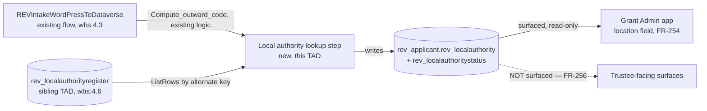
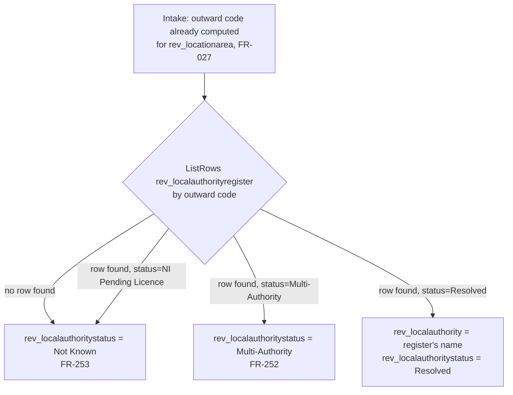

# Technical Architecture Document — Location Column for the Grant Admin

**Feature Slug:** grant-admin-app
**SDD Reference:** `docs/plans/grant-admin-app-plan.md` (reviewer `APPROVED`, `rev_localauthority`
confirmed as the column name for OQ-250)
**Date:** 2026-09-22
**Status:** DRAFT
**WBS task:** `0.11` (`contract/change-orders/CO-003.md`, APPROVED 2026-09-18)

**Sibling document:** `docs/architecture/postcode-lookup-architecture.md` (`feature:postcode-lookup`,
`wbs:4.6`) designs the `rev_localauthorityregister` table this column reads from. Neither document
authorises the other's WBS task. This document's §8 states the sequencing dependency in full.

**Author-new decision (activation step 1a):** grepped all four approved TADs for `0.11`, `rev_county`,
`rev_localauthority`, `CO-003` — the only hits are `§0.11` used as a **revision section number** in
`trustee-portal-visual-refresh-architecture.md`, unrelated to WBS task `0.11`. No approved document
names this column or this WBS task. **AUTHOR-NEW**, per `IMP-0685`.

---

## 1. Architecture Overview

This column sits on `rev_applicant` — confirmed as the correct table by reading its sibling column
`rev_locationarea`'s own placement in source
([`Entities/rev_applicant/Entity.xml:288-300`](../../src/solutions/RevitaliseGrantAutomation/Entities/rev_applicant/Entity.xml#L288-L300)),
not inferred from the SDD's looser "the Applicant entity" wording. `rev_localauthority` is designed
as `rev_locationarea`'s direct sibling: same table, same "derive once at intake, never re-derive"
pattern (FR-027/BR-A04), same security posture (secured, released only to the process owner and
service identity, **never** to trustees), differing only in what it holds and in the three states
FR-252/FR-253 require that `rev_locationarea` never needed.

**The column's value is sourced from `rev_localauthorityregister`** (the sibling TAD's table), not
computed independently — there is no reason to run a second postcode-resolution mechanism when one
already exists and is purpose-built for exactly this lookup. This is an *architectural* choice, not
a contractual one: SDD §8 states plainly that CO-003 does not itemise the register as part of its own
priced scope, and this TAD does not fold `wbs:4.6`'s work into `wbs:0.11` — it only says what
`wbs:0.11`'s intake step reads from once both exist.

**Alternatives rejected:**
- *A second, independent local-authority derivation inside the intake flow.* Rejected — this would
  duplicate the ONS-sourced resolution logic the sibling TAD already builds, and the two copies would
  drift the moment either is refreshed independently.
- *Redefining `rev_locationarea` to carry local authority instead of region.* Explicitly rejected by
  the reviewer on 2026-09-18 (SDD §1) — a live, shared 13-value Choice cannot be silently redefined.

## 2. Component Diagram

## 3. Data Model

### Entities

| Entity | Purpose | Classification |
|---|---|---|
| `rev_applicant` (existing — **schema change**) | Gains two new columns: `rev_localauthority`, `rev_localauthoritystatus` | **Pseudonymised** — see the classification note below; narrower audience than `rev_locationarea`'s existing row (FR-256) |

### `rev_applicant` — new columns

| Column | Type | Notes |
|---|---|---|
| `rev_localauthority` | Single line of text, max 100 | The resolved local authority name, copied from `rev_localauthorityregister.rev_localauthorityname` at intake. **Null unless `rev_localauthoritystatus = Resolved`** (same default-traced-to-what-the-reader-sees rule as the sibling TAD's ADR-003) |
| `rev_localauthoritystatus` | Choice (global option set `rev_localauthoritystatus`, new) | `Resolved` (100001) / `Multi-Authority` (100002) / `Not Known` (100003) — FR-252, FR-253, NFR-251 |

**Why a separate option set from the sibling register's `rev_localauthorityresolutionstatus`,** rather
than reusing it: the register's status has a `NI Pending Licence` value meaningful only to the
register itself; from the Applicant's point of view an `NI Pending Licence` register row and a
register **miss** (no row at all) are the *same* observable fact — "not known" (FR-253's own wording
covers both: "cannot be resolved... e.g. an outward code the register does not cover"). Collapsing
both register outcomes into one Applicant-facing `Not Known` value, rather than exposing the
register's internal reason, is what keeps NFR-251's three states clean and mutually exclusive at the
point the grant admin reads them.

**Consequence trace (FR-252/FR-253, per the house style on defaults):** an applicant whose intake
flow finds no register row, or a `NI Pending Licence` row, or a genuine HTTP/lookup failure against
the register, reaches the **same** `Not Known` return value and the **same** null `rev_localauthority` —
there is no code path in this design that leaves the column silently blank with `rev_localauthoritystatus`
unset. A blank status is therefore always "not yet processed" (pre-intake), never "processed but
unresolved", so NFR-251's distinguishability requirement is satisfiable by inspecting one column
rather than by inferring intent from an absence.

### Data classification (`C-DOM-001`, and the SDD's own recommendation at §7)

The SDD explicitly declines to assume `rev_localauthority` inherits `rev_locationarea`'s classification
row wholesale, because FR-256 narrows its audience. This TAD adds the distinct row the SDD asked for:

| Column | Tier | Lawful basis | Visible to | Hidden from |
|---|---|---|---|---|
| `rev_localauthority` | **Pseudonymised**, narrower audience than `rev_locationarea` | Same existing Art. 6 basis as the postcode it derives from (SDD §7.2) — no new collection | Grant Administrator role, Service Automation | **Trustee (FR-256)** — not merely "not yet extended", explicitly excluded by design |
| `rev_localauthoritystatus` | Same tier as its sibling column — the ambiguity/not-known state is itself derived from the same postcode and reveals nothing additional about the applicant | Same | Same | Same |

### Retention, SAR and erasure (`C-DOM-003`, `C-DOM-005`, `C-DOM-006`)

Both new columns live on `rev_applicant` and follow that table's **existing** retention, SAR and
erasure posture unchanged — they are two more columns on an already-governed table, not a new data
subject or a new retention clock. Concretely: retention is "cascade from Application"
(`knowledge/domain/data-entities.md`), unchanged by this addition; the SAR mechanism is the
solution-wide **known, open gap** already recorded at `knowledge/domain/compliance-requirements.md`
§2 ("No SAR extract mechanism", FR-053, TAD risk A-R22) — these two columns inherit that same open
gap rather than introducing a new one, and are not a reason to treat it as newly discovered; erasure
follows the existing cascade-delete-from-Application mechanism (BR-D02) with no new erasure logic
required, since deleting the Applicant record removes these columns with everything else on it.

### `rev_localauthority`/`rev_localauthoritystatus` and the special-category register (`C-DOM-033`, resolving OQ-252)

**OQ-252, answered:** local authority is a geographic administrative fact derived from postcode, not
health, disability or another Article 9 category — the SDD's own architecturally-derived default
("no, it is not [special-category]") is adopted as this TAD's answer, and nothing in
`knowledge/domain/business-rules.md` or the special-category register's own admission criteria
suggests otherwise. **This resolves OQ-252.**

**That answer does not exempt either column from `C-DOM-033`.** Both columns are `IsSecured=1`
(§6), and C-DOM-033 requires **every** column-secured attribute — special-category or not — to be
adjudicated in `constraints/domain/special-category-register.yml`, in `pending_adjudication:` for a
secured-but-not-Article-9 column exactly like this one. `.claude/hooks/protect-system-rules.py`
refuses this document's own agent from writing that file directly, so this TAD **proposes** the
addition rather than making it: once `development-agent` builds these columns, its own gate output
should propose adding
`{ entity: rev_applicant, name: rev_localauthority }` and
`{ entity: rev_applicant, name: rev_localauthoritystatus }`
to `pending_adjudication:`, for `improvement-agent`/the reviewer to apply — the same route
`rev_locationarea` itself already went through. **This is not evaluable against live source at TAD
stage** (the columns do not exist in `Entity.xml` yet), so it is carried forward as an explicit
build-time obligation rather than silently assumed — the exact gap `IMP-0598` cost eight days to
notice.

### Relationships

None new. `rev_localauthority`/`rev_localauthoritystatus` are plain columns on the existing
`rev_applicant` table — no lookup to `rev_localauthorityregister` is created. The register is read by
value at intake time and the result is copied onto the Applicant record (the same "derive once, store
the derived value" pattern FR-027/BR-A04 already establishes for `rev_agerange`/`rev_locationarea|`),
**not** referenced live. This avoids creating a relationship whose only purpose would be a one-time
read, and it means a later change to the register's own row does not retroactively alter a
already-processed applicant's stored value — consistent with FR-251's "never re-derive downstream"
intent.

### Migration Strategy

Two new columns on an existing table. `Entity.xml` gains both attributes; the new global option set
`rev_localauthoritystatus` ships alongside. **This is the "add a `FieldPermission` to an
already-existing Field Security Profile" case `knowledge/technology/dataverse.md` names as an
intermittent live-import failure** (`IMP-0637`/`IMP-0649`) — `REV_TrusteeRestricted` already exists
and already has permissions; adding two more to it is exactly the shape that has failed twice live.
**Mitigation, stated in §12.1:** the two new `FieldPermission` rows are created via
`ensure-schema.ps1`'s direct `POST` to `api/data/v9.2/fieldpermissions`, not left to solution import
to carry, per `C-TECH-050`'s widened scope.

## 4. Integration Design

| Integration | Direction | Protocol | Auth Method |
|---|---|---|---|
| `rev_localauthorityregister` (sibling TAD's table) | Read (at intake, per applicant) | Dataverse connector, `ListRows` filtered by alternate key | Service principal (flow's existing Dataverse connection — `REVIntakeWordPressToDataverse` already holds one) |
| `rev_applicant` | Write | Dataverse connector | Service principal (existing) |

### Request/response contract — the four-point checklist

- **Every output is named.** The lookup step's output is `rev_localauthorityname` (string, nullable)
  and `rev_resolutionstatus` (choice) — read directly off the sibling table's own named columns (TAD
  `postcode-lookup-architecture.md` §3), not a new contract invented here.
- **Every enumerated value has its wording.** `rev_localauthoritystatus`'s three labels are given
  above; no fourth value exists on this table.
- **Same-fact fields:** `rev_localauthority` (this table) and `rev_localauthorityname` (the register)
  name the same fact at two points in time — the register's value is authoritative **at the moment of
  intake only**; `rev_localauthority` is a frozen copy and is never re-synced if the register later
  changes (§3, Relationships).
- **Two-source question:** could not be obtained two ways — the register is the sole source, and the
  raw postcode is deliberately never re-queried after intake (NFR-250).

## 5. Automation / Workflow Design

**No new flow.** This is an addition to the existing `REVIntakeWordPressToDataverse` flow
(`wbs:4.3`), inserted immediately after the existing `Compute_outward_code` step (the same outward
code already computed for `rev_locationarea`'s own derivation — no second outward-code computation is
introduced).

**New step sequence, inserted into the existing `Create_the_application` scope:**

1. **`ListRows` against `rev_localauthorityregister`**, filtered on the alternate key = the outward
   code already computed by `Compute_outward_code` — the *identical* variable `rev_locationarea`'s
   derivation already reads, so no new postcode-parsing logic is introduced.
2. **Resolve, per §3's decision table:**
   - No row found → `rev_localauthoritystatus = Not Known`, `rev_localauthority = null`.
   - Row found, `rev_resolutionstatus = NI Pending Licence` → same as above.
   - Row found, `rev_resolutionstatus = Multi-Authority` → `rev_localauthoritystatus = Multi-Authority`,
     `rev_localauthority = null`.
   - Row found, `rev_resolutionstatus = Resolved` → `rev_localauthoritystatus = Resolved`,
     `rev_localauthority = <the register row's rev_localauthorityname>`.
3. **Write both new columns** on the same `Create a row` / `Update a row` action that already writes
   `rev_agerange` and `rev_locationarea` — no new Dataverse write action, extending the existing one.

**This step must run whether or not `rev_localauthorityregister` yet holds any rows** — the design
does not assume the sibling TAD's register is populated before this flow next runs. An empty or
not-yet-seeded register is indistinguishable, from this flow's point of view, from "no row found",
so every applicant intake before the register is seeded correctly reaches `Not Known` rather than a
flow error. This is the mechanism that makes the sequencing note in §8 an operational recommendation
rather than a hard build dependency — the column can ship before the register does, and simply
reads `Not Known` for everyone until the register catches up (see §8's own caveat on why this is
still not the recommended order).

## 6. Security Design

| Concern | Control | Where Applied |
|---|---|---|
| Authentication | Existing intake flow's service principal — no new identity | `REVIntakeWordPressToDataverse` |
| Authorisation | `REV_TrusteeRestricted` field security profile releases both new columns to the Grant Administrator role and `REV Service Automation` only — trustees excluded by **non-membership**, the same control already governing `rev_locationarea` (`ADR-G03`) | `Other/FieldSecurityProfiles.xml` |
| Data at rest | `IsSecured=1` on both new columns, `IsAuditEnabled=1` | `rev_applicant.Entity.xml` |
| Data in transit | TLS 1.2+, existing Dataverse connector | Unchanged |
| Audit logging | Both columns audited (`C-DOM-010`) — a change to an applicant's local-authority status is a change to their record | `rev_applicant.Entity.xml` |
| App registrations / API permissions | None new | — |

### 6.1 Security Role & Group Mapping

| Persona | Entra Security Group | Dataverse Group Team | Security Role(s) | App Access |
|---|---|---|---|---|
| Grant Administrator | `REV-GrantAdmins-<Env>` (existing) | `REV Grant Administrators` (existing) | `REV Base User` + member of `REV_TrusteeRestricted` field security profile (existing membership — no change; the profile already releases to this persona) | MDA — existing form gains two new controls, §9 |
| Service Automation | n/a | n/a | `REV Service Automation`, member of `REV_TrusteeRestricted` (existing) | Flow owner only |
| Trustee | `REV-Trustees-<Env>` (existing) | `REV Trustees` (existing) | **Explicitly not** a member of `REV_TrusteeRestricted` (unchanged — FR-256 requires this stay true) | No visibility to either new column |

No new persona, no new group, no new role. Both new columns join an **existing** security surface
rather than creating one — this is the correct outcome of "additive, does not regress an existing
deliverable" (FR-255) applied to security design specifically.

## 7. Non-Functional Decisions

| NFR ID | Decision | Rationale |
|---|---|---|
| NFR-250 | The raw postcode is read once (already-existing `rev_postcode` read, unchanged) and never written to either new column; only the register's already-derived name is copied | No new raw personal-data exposure — mirrors NFR-013's existing minimisation design |
| NFR-251 | Single `rev_localauthoritystatus` choice column, three mutually exclusive values, checked before `rev_localauthority` is ever read for display (§9) | One column to inspect, not an inferred combination of nullability and a second flag |

## 8. Accessibility

The grant admin's existing Main Form gains two new read-only-by-default controls (the values are
system-derived, mirroring `rev_locationarea`'s own read-only treatment) in the same tab
`rev_locationarea` already sits in. No new form, no new tab. WCAG 2.1 AA is inherited from the MDA
shell per `knowledge/technology/platform.md`; the two new controls carry the same labelling
convention (tooltip explaining "system-derived, from the ONS local authority register") as other
derived fields on this form.

## 9. Deployment Topology

| Environment | Method | Notes |
|---|---|---|
| Dev | Unmanaged solution, `ensure-schema.ps1 -Env dev` first (§12.1) — new columns AND the two `FieldPermission` rows | Verify the intake flow's new step against a **seeded** `rev_localauthorityregister` if the sibling feature has already run its first refresh in DEV; otherwise every DEV applicant legitimately reads `Not Known` until it has |
| Test / Acceptance | Managed solution import, `ensure-schema.ps1 -Env test` first | Same column + FieldPermission creation via Web API before import |
| Production | Managed solution import, `ensure-schema.ps1 -Env prd` first, gated `APPROVE PRD` | §8's sequencing recommendation matters most here — a live applicant reaching `Not Known` for weeks because the register was not yet seeded is avoidable, not merely tolerated |

**Sequencing (§8, restated for the deployment topology specifically):** deploy `wbs:4.6`'s register
and run its first seed **before** `wbs:0.11`'s flow change goes live in the same environment, in each
environment independently — DEV, TST/ACC and PRD each need their own seeded register, since data does
not travel with a managed solution import. Neither task's build is blocked on the other; only the
**order of go-live per environment** is a recommendation, not a gate.

## 10. Architecture Decision Records

### ADR-001: `rev_localauthority` reads from the register at intake and freezes the value; no live relationship is created
**Context:** the register (`wbs:4.6`) may itself be refreshed quarterly and its rows updated. A
lookup relationship would make every historic applicant's local authority silently follow the
register's most recent state.
**Decision:** copy the resolved value at intake time only, as a plain column, never a lookup.
**Consequences:** an applicant's `rev_localauthority` reflects the register **as it stood at their
intake date**, not today's register — consistent with FR-251's "derive once, store the derived value"
pattern and with how `rev_agerange`/`rev_locationarea` already behave. A boundary-change correction
in a later ONS edition does not retroactively alter historic applicant records; if Revitalise ever
wants that, it is a distinct, unpriced backfill decision (SDD §9 OQ-253), not something this design
does silently.

### ADR-002: A dedicated Applicant-facing status option set, not a reuse of the register's own status values
**Context:** §3 above. The register's `NI Pending Licence` and "no row found" are two different
register-side facts that collapse to one Applicant-facing fact.
**Decision:** `rev_localauthoritystatus` is its own global option set with three values (`Resolved` /
`Multi-Authority` / `Not Known`), not a reuse of `rev_localauthorityresolutionstatus`.
**Consequences:** the grant admin app never needs to know the register's internal reasons for a miss —
only the two facts FR-252/FR-253 actually require it to distinguish. If the register later grows a
fourth internal status, this Applicant-facing set is unaffected unless a **new** FR requires it.

## 11. Risks & Mitigations

| Risk | Likelihood | Impact | Mitigation |
|---|---|---|---|
| Adding `FieldPermission` rows to the already-existing `REV_TrusteeRestricted` profile has failed live twice before (`IMP-0637`/`IMP-0649`) | Medium — documented as intermittent, not absolute | High — a failed import blocks this column and everything else in the same solution version | Create both `FieldPermission` rows via `ensure-schema.ps1`'s direct Web API `POST` in every environment before the managed import, per `C-TECH-050`'s widened scope (§3, §12.1) — the proven working route |
| The register (`wbs:4.6`) may not yet be seeded in a given environment when this flow change first goes live there | Low-Medium, environment-dependent | Low — the design degrades to `Not Known` for every applicant, which is honest, not silently wrong, but is a poor first impression for the grant admin | §9's sequencing recommendation; if seeding cannot be guaranteed first, communicate the expected `Not Known` period to Emily rather than treat it as a defect |
| OQ-251 (re-price question) is unresolved at TAD stage | N/A — commercial, not technical | N/A | Carried forward unresolved to `commercial-agent`, per the handoff's own instruction; this TAD does not attempt to answer a pricing question |
| `scripts/verify-tad-coverage.py`'s `C-TECH-066` schema-coverage gate reads `--tad` from **one primary document** by default (`revitalise-grant-automation-architecture.md`) and does not scan this sibling document — `rev_applicant.rev_localauthority`/`rev_localauthoritystatus` are not yet mechanically checked against source the way the primary TAD's own §3.1 columns are | Low | Low-Medium | Same open item as the sibling `postcode-lookup-architecture.md` §11 row — not resolved in this dispatch, flagged rather than silently assumed covered |

## 12. Provisioning & External Dependencies

| Item | Type | Tool / Script | Scope | Gate |
|---|---|---|---|---|
| `rev_applicant.rev_localauthority`, `rev_applicant.rev_localauthoritystatus` | Attributes | `ensure-schema.ps1` | per-env | `environment_prerequisites` |
| `rev_localauthoritystatus` global option set | Global OptionSet | `ensure-schema.ps1` | per-env | `environment_prerequisites` |
| Two `FieldPermission` rows in `REV_TrusteeRestricted` | Field permissions on an **already-existing** profile | `ensure-schema.ps1` direct Web API `POST` (§11) | per-env | `environment_prerequisites` — **not** left to solution import |
| New Main Form controls | Solution component | Ships in solution (`FormXml`) | — | Ordinary solution import — verify per `C-TECH-077`: a secured column with no form control is a data-entry dead end even though nothing here is hand-typed by an applicant (these are system-derived, but the grant admin still needs to **see** them, which is what a control is for even when `disabled="true"`) |

### 12.1 Environment Prerequisites — before the FIRST deploy into any environment

| Item | Why a deploy cannot create it | Script | Runs before | Re-run per environment? |
|---|---|---|---|---|
| `rev_applicant.rev_localauthority` / `rev_localauthoritystatus` attributes | `C-TECH-050`: Attributes unsupported to create from scratch via solution import | `ensure-schema.ps1 -Env <env>` | First solution import carrying the schema change | Yes — DEV, TST/ACC, PRD |
| `rev_localauthoritystatus` global option set | Same rule | `ensure-schema.ps1 -Env <env>` | Same | Yes |
| `FieldPermission` rows on `REV_TrusteeRestricted` for both new columns | `C-TECH-050`'s **widened** scope — adding a permission to an already-existing profile has failed via solution import twice live | `ensure-schema.ps1 -Env <env>` direct `POST api/data/v9.2/fieldpermissions` | First solution import carrying the schema change | Yes — this is the specific failure mode the widened rule exists for; do not assume it is safe because the profile itself already exists |

### 12.2 Platform Contract Verification Plan

| Component | Hand-authored? | Ground-truth method | Platform-assigned values | Verified at |
|---|---|---|---|---|
| `IsSecured=1` reaching the live column reliably | No — this is a **known-risk** path per `knowledge/technology/dataverse.md` → *"A column reaches `IsSecured=1` live by one of three paths"* (`IMP-0782`/`IMP-0783`): both new attributes are non-lookup columns created fresh, which is the **proven** path, but the field-permission-on-existing-profile step is the unproven one | Read back `fieldpermissions` count on `REV_TrusteeRestricted` after the Web API step and confirm it rose by exactly 2, one per column, before relying on the import succeeding | First environment sweep, before the managed import — §12.1 |
| Grant admin form control reachability for both new columns | No — solution-component authoring, standard | `verify-forms-and-views-reachable.py` (build gate, `C-TECH-077`) | Build time |

---

## Approval
**Reviewed by:** ___________  **Date:** ___________  **Response:** `APPROVED`
