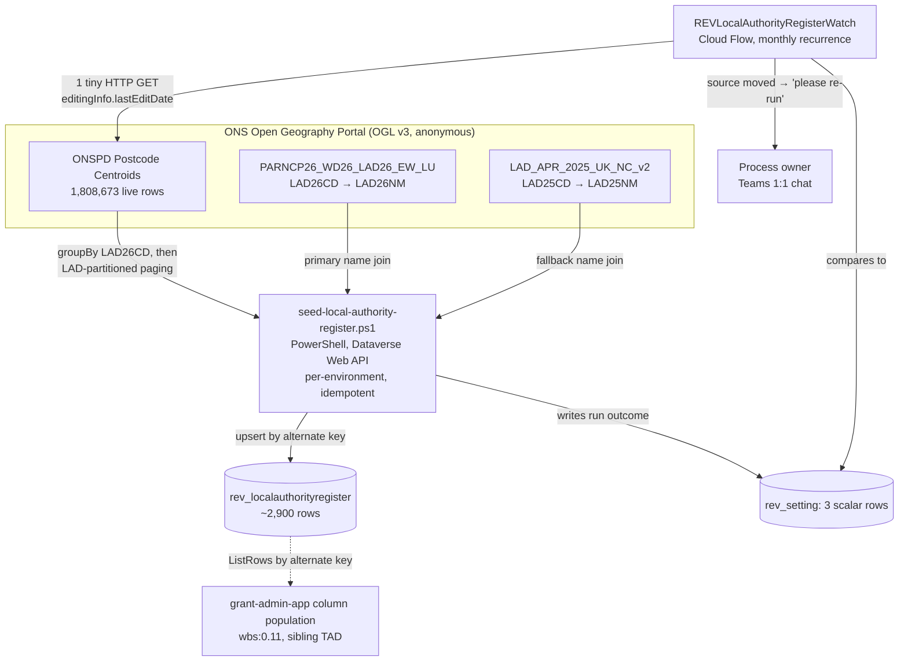

# Technical Architecture Document — Postcode → Local Authority Reference Table

**Feature Slug:** postcode-lookup
**SDD Reference:** `docs/plans/postcode-lookup-plan.md` (reviewer `APPROVED`)
**Date:** 2026-09-22 · **Revision 2:** 2026-09-23
**Status:** DRAFT (Revision 2 — awaiting review)
**WBS task:** `4.6` (`contract/change-orders/CO-004.md`, APPROVED 2026-09-18) — increments 1 and 3 only.

**Sibling document:** `docs/architecture/grant-admin-app-architecture.md` (`feature:grant-admin-app`,
`wbs:0.11`) is the consumer of this register's output. Neither document authorises the other's WBS
task; §8 states the sequencing dependency this document owes the sibling.

**Author-new decision (activation step 1a):** unchanged from Revision 1 — grepped
`docs/architecture/revitalise-grant-automation-architecture.md` and the other three approved TADs for
`PostcodeRegionMap`, `rev_locationarea`, `LAD26`, `ONSPD`, `wbs:4.6`, `CO-004`, `rev_localauthority`;
zero hits for any local-authority-register concept in an approved architecture document. **AUTHOR-NEW**,
per `IMP-0685`. Revision 2 **amends this same document in place**, which is the correct action for a
`CASCADE:ARCH_GAP` against a document this desk already owns.

---

## Revision 2 — what changed and why

Revision 1 was written against an **assumed** ONS query shape and was refuted by
`development-agent` at build time (`CASCADE:ARCH_GAP`, `IMP-0831`), then escalated to the strategic
tier (`IMP-0835`). Revision 2 is written against **the live endpoint, measured in this dispatch**.

| Section | Change |
|---|---|
| §1, §2 | Rewritten — the register is harvested by a provisioning script, not by a Cloud Flow |
| §3 | Fourth `rev_resolutionstatus` value added (`Out of UK LA Scope`); `rev_ladnamesource` column added for NFR-200 provenance |
| §4 | Rewritten against three measured ONS endpoints; `A-LAR-01` **resolved** |
| §5 | Rewritten — harvester (PowerShell) + watcher (Cloud Flow) replace the single flow |
| §10 | **ADR-002 SUPERSEDED**; ADR-004, ADR-005, ADR-006, ADR-007 added |
| §11, §12 | Rewritten; §12.2 now records measured results, not a plan to measure |
| §13 | **New** — OQ-200 re-opened with measured evidence; this is the one decision this document asks for |

**What did NOT change, deliberately:** the table name, its alternate key, its column names, and the
`Resolved` / `Multi-Authority` option values the sibling TAD reads. §8 states the one interface
obligation Revision 2 does add.

---

## 1. Architecture Overview

CO-004 asks for a local-authority name per postcode outward code, in "the same lookup shape" as the
existing `PostcodeRegionMap` mechanism (SDD FR-201). Two facts — one carried from Revision 1, one
measured in Revision 2 — determine the whole design.

**Fact 1: `PostcodeRegionMap` is not a table.** It is one row of `rev_setting`
(`rev_name = 'PostcodeRegionMap'`), whose `rev_value` holds a JSON array of
`{prefixes: [...], option: <choice value>}` objects, read once per flow run by a `ListRecords` filter
and indexed with a `Query`/`contains()` expression —
[`REVIntakeWordPressToDataverse-….json:720-878`](../../src/solutions/RevitaliseGrantAutomation/Workflows/REVIntakeWordPressToDataverse-8F1C2A44-1001-4B7A-9E21-0A1B2C3D4E01.json#L720-L878).
Its lookup key is a postcode **AREA** (`BT`, `SW`, `B`), not a full outward code, and
`rev_setting.rev_value` is capped at **`MaxLength=4000`**
([`Entities/rev_setting/Entity.xml:52-59`](../../src/solutions/RevitaliseGrantAutomation/Entities/rev_setting/Entity.xml#L52-L59)).
Local authority cannot be resolved at area granularity, so FR-200 correctly needs outward-code
granularity — and ~2,900 outward-code rows cannot fit in 4,000 characters. Hence a real table
(**ADR-001**, unchanged).

**Fact 2 (measured, Revision 2): the resolution work is a bulk ETL that this platform's automation
tooling cannot perform.** Producing one row per outward code requires reducing **1,808,673 live unit
postcodes** to ~2,900 groups. Power Automate has no aggregation capability at all: `List rows` does
not support aggregate FetchXML ([`knowledge/technology/power-automate.md:74`](../../knowledge/technology/power-automate.md#L74),
`IMP-0306`) and the flow expression language has no `sum()`/`groupBy()`
([`knowledge/technology/power-automate.md:86-105`](../../knowledge/technology/power-automate.md#L86-L105), `IMP-0463`).
Server-side grouping by outward code is not available as a *grouping expression* either — the layer
exposes only unit-postcode fields (`PCD7`/`PCD8`/`PCDS`) and `LAD26CD`, and both a SQL substring and
an Arcade `valueExpression` in `groupByFieldsForStatistics` are rejected (`IMP-0831`).

**The design therefore moves the harvest out of Power Automate and into the mechanism this project
already uses for work the platform's own tooling cannot do: an idempotent PowerShell provisioning
script against the Dataverse Web API** (**ADR-002-R2**). That is not a new pattern here — it is the
pattern. [`provisioning/dataverse/ensure-schema.ps1`](../../provisioning/dataverse/ensure-schema.ps1)
exists precisely because solution import cannot create entities, and
[`provisioning/dataverse/seed-settings.ps1`](../../provisioning/dataverse/seed-settings.ps1) already
does keyed upsert-by-alternate-key, validate-everything-before-writing-anything, per-environment,
with `CREATED | EXISTS | FAILED` reporting. The register harvester is the same shape of script doing
the same kind of job.

**Alternatives rejected:**

- *An Azure Function.* This would introduce a hosting surface that **does not exist anywhere in this
  repository** — grepped: no Azure Function, no `azurewebsites`, no function host, no deployment path
  for one. It would need its own app registration, its own secret rotation, its own CI target and its
  own runbook, all to run a job roughly twenty minutes per quarter. Rejected as disproportionate: the
  in-platform-adjacent alternative (a provisioning script) is already built, already authenticated,
  already gated and already understood.
- *Chunked paging with in-memory aggregation inside a Cloud Flow.* The harvest is **1,094 paged
  requests returning 1,808,673 rows** (§4). Reducing those to ~2,900 groups inside a flow requires an
  `Apply to each` over 1.8M items with no aggregation primitive — every group operation would be a
  variable mutation per row. This exceeds Power Automate's practical action budget by orders of
  magnitude and has no partial-progress recovery. Rejected on measured volume, not on taste.
- *A scheduled GitHub Actions job.* Technically available, but this repository's CI holds **no
  `schedule:`/cron trigger of any kind** (grepped) and, per
  [`.github/workflows/ci.yml`](../../.github/workflows/ci.yml#L20-L45), GitHub Actions deliberately
  stops at `stage-dev` — promotion beyond DEV is Power Platform Pipelines' job. Putting a recurring
  PRD data-write into Actions would cross that boundary for one job. Rejected; see **ADR-003-R2** for
  what carries the recurrence instead.

## 2. Component Diagram



**The split is the point.** The watcher answers *"has the source changed?"* — one HTTP GET, a string
compare, and a Teams post, all of which Power Automate does well and already does elsewhere in this
solution. The harvester answers *"what does the register say?"* — 1,094 requests and a 1.8M-row
reduction, which Power Automate cannot do at all. Neither component is asked to do the other's job.

## 3. Data Model

### Entities

| Entity | Purpose | Classification |
|---|---|---|
| `rev_localauthorityregister` (**new**) | One row per UK postcode outward code, holding the resolved local authority name or a flagged non-resolution state (FR-200–FR-203). Organization-owned reference data | **Not personal data** (NFR-202) — public geographic reference data, same tier as `rev_setting` |
| `rev_setting` (existing, no schema change) | Carries three new scalar rows: `LocalAuthorityRegisterLastRefreshedOn`, `LocalAuthorityRegisterLastRefreshStatus`, `LocalAuthorityRegisterSourceEdition` (FR-207) | Configuration (unchanged tier) |

### `rev_localauthorityregister` — columns

| Column | Type | Notes |
|---|---|---|
| `rev_name` | Single line of text, max 4, **primary name** | The outward code (`SW1A`, `BT1`), upper-cased, no space. **Derived from `PCDS`, never from `PCD7`/`PCD8`** — see the measured note below |
| `rev_localauthorityname` | Single line of text, max 100 | `LAD26NM`. **Populated only when `rev_resolutionstatus = Resolved`** — null on every other status (ADR-003) |
| `rev_ladcode` | Single line of text, max 20 | `LAD26CD`, retained for provenance/traceability (NFR-200) |
| `rev_ladnamesource` | Single line of text, max 20 | **New in Revision 2.** Which source supplied the name: `LAD26_EW` or `LAD25_UK`. Makes the vintage fallback of **ADR-004** auditable rather than invisible (NFR-200) |
| `rev_resolutionstatus` | Choice (global option set `rev_localauthorityresolutionstatus`, new) | `Resolved` (100001) / `Multi-Authority` (100002) / `NI Pending Licence` (100003) / `Out of UK LA Scope` (100004, **new in Revision 2**) |
| `rev_lastseeninsource` | Date only | The refresh run in which this row was last confirmed against ONS |
| `statecode` / `statuscode` | State/Status | Standard |

**`rev_name` is derived from `PCDS` and from no other field — measured, not assumed.** `PCDS` uses
exactly one space between outward and inward code, so the outward code is the text before that space.
`PCD7` and `PCD8` pad the gap to a fixed width and are **wrong** for this purpose. Measured on the
live layer this dispatch:

| `PCDS` | `PCD7` | `PCD8` | Correct outward code |
|---|---|---|---|
| `B1 1AY` | `B1  1AY` | `B1   1AY` | `B1` |
| `TS22 5BF` | `TS225BF` | `TS22 5BF` | `TS22` |

A build that split `PCD7` on a space would yield `B1` correctly but `TS225BF` catastrophically. This
is written down because it is exactly the class of detail that is invisible from a field list.

**The fourth status value, `Out of UK LA Scope` (100004).** ONSPD's live extract contains two
**pseudo-codes** that are not local authorities at all: `M99999999` (Isle of Man, 4,591 live
postcodes) and `L99999999` (Channel Islands, 6,515 live postcodes) — **11,106 live postcodes**,
measured this dispatch. They are Crown Dependencies, outside every UK local-authority naming source.
Revision 1 had no state for them; they would have fallen into whatever the name-join fallback did
last, which is precisely the silent-wrong-answer failure FR-202 exists to prevent. They now get an
explicit, honest state. **Consequence trace:** an Isle of Man applicant's outward code returns a row
with a null `rev_localauthorityname` and `Out of UK LA Scope`; the sibling flow maps that to
`Not Known` (FR-253) and the grant administrator reads "Not Known" on the record — not a blank, and
not "Hartlepool".

**Alternate key:** `rev_name` (outward code), mirroring the alternate-key pattern already proven on
this project (`knowledge/technology/dataverse.md` → *Alternate Keys*). Built **after** the table
exists, and its index awaited to `Active` before any consumer upsert or lookup relies on it
(`C-TECH-053`).

**Northern Ireland (FR-203):** every `BT`-prefixed outward code is written with
`rev_resolutionstatus = NI Pending Licence` and `rev_localauthorityname = null`. Revision 2 adds a
measured clarification: the NI names **are** available — all 11 `N09…` districts resolve through the
LAD25 fallback (`N09000003` → `Belfast`, confirmed live). So this is a **deliberate withholding on a
licence ground, not a data gap.** The harvester must therefore *actively skip* the name join for `BT`
outcodes; it is not enough for the data to be missing, because it is not missing. **Consequence
trace:** a BT applicant sees "Not Known" (FR-253) on their record — not a blank field, not a guessed
authority, and not the Belfast name the source would happily have supplied.

### Relationships

None. This table has no lookup to or from any entity in the parent solution — it is a standalone
reference table, read by outward-code value, never joined. A relationship would imply a
referential-integrity obligation this register does not need.

### Retention (`C-DOM-003`)

Non-personal, indefinite reference data — same posture as `rev_anonymisedstatistic`
(`knowledge/domain/data-entities.md`: "Indefinite, by design") and `rev_setting`. No data subject, no
retention clock. A row is superseded by the next successful harvest, never purged on a timer.

### Migration Strategy

New table, new global option set, three new `rev_setting` **rows** (not schema).
`provisioning/dataverse/ensure-schema.ps1` gains the table, its columns and the global option set
under `C-TECH-050`, created via the Web API before the first solution import into every environment —
see **§12.1**.

## 4. Integration Design

All three ONS endpoints were queried live during this dispatch. Every figure in this section is
measured, not inferred.

| Integration | Direction | Protocol | Auth |
|---|---|---|---|
| ONS ONSPD Postcode Centroids (`ONSPD_Online_latest_Postcode_Centroids/FeatureServer/0`) | Inbound (pull) | HTTPS GET, ArcGIS FeatureServer REST/JSON | None — OGL v3 open data (NFR-200) |
| ONS `PARNCP26_WD26_LAD26_EW_LU/FeatureServer/0` | Inbound (pull) | Same | None |
| ONS `LAD_APR_2025_UK_NC_v2/FeatureServer/0` | Inbound (pull) | Same | None |
| `rev_localauthorityregister`, `rev_setting` | Write / read-write | Dataverse Web API | App-only token, `PROVISION_APP_ID` + certificate (MSAL.PS), as every other provisioning script |
| Teams 1:1 chat (watcher alert) | Outbound | `shared_teams` connector | Service principal, ADR-015 pattern |

### Measured layer facts (ONSPD)

| Fact | Measured value |
|---|---|
| `maxRecordCount` | **2000** |
| `supportsPagination` / `supportsDistinct` / `supportsStatistics` | true / true / true |
| Live unit postcodes (`DOTERM IS NULL`) | **1,808,673** |
| Total rows including terminated postcodes | 2,717,998 |
| Distinct live `LAD26CD` values | **364** (363 real + 1 null group of count 0) |
| Edition marker (`editingInfo.lastEditDate`) | present on the layer root, one tiny request |

**`DOTERM IS NULL` is mandatory, not an optimisation.** Without it the layer returns 2,717,998 rows
— 909,325 of them terminated postcodes — and a terminated postcode carries a historic LAD that would
corrupt the multi-authority determination for its outward code.

### The harvest query shape (verified end-to-end)

1. **Bootstrap — one request.** `where=DOTERM IS NULL`,
   `groupByFieldsForStatistics=LAD26CD`, `outStatistics=[{count}]`. Returns 364 rows: the LAD
   universe **and an authoritative expected row count per LAD**. Measured: `E06000001` → 2,706.
2. **Harvest — 1,094 paged requests.** For each of the 363 real LADs:
   `where=LAD26CD='<code>' AND DOTERM IS NULL`, `outFields=PCDS`, `returnGeometry=false`,
   `orderByFields=PCDS`, `resultRecordCount=2000`, `resultOffset=<n>`. Page count is
   `ceil(count/2000)` per LAD, summing to **1,094**; largest single LAD is 23,966 rows / 12 pages.
3. **Name join — two requests.** `returnDistinctValues=true` against the two name services.

**`orderByFields=PCDS`, never `orderByFields=OBJECTID`.** Measured this dispatch: `OBJECTID` ordering
on this hosted layer either 400s or hangs past 120 s, while `PCDS` ordering pages cleanly. `PCDS` is
also unique, so paging is deterministic and stable across pages.

**End-to-end reconciliation proof (measured).** The `E06000001` partition was harvested in full:
page 1 returned 2,000 rows (`exceededTransferLimit: true`), page 2 returned 706
(`exceededTransferLimit` absent), total **2,706 — exactly the bootstrap count — with zero duplicates
across the page boundary**, resolving to 6 outward codes. That is the integrity control of **ADR-006**
demonstrated on real data, not a proposed one.

### An independent second computation path exists — and Revision 1 was wrong to say it did not

`IMP-0831` concluded that no server-side grouping by outward code is possible. That is true for a
grouping **expression**, and false for the result. Measured live:

```
where = PCDS LIKE 'TS23 %' AND DOTERM IS NULL
groupByFieldsForStatistics = LAD26CD
outStatistics = [{"statisticType":"count","onStatisticField":"LAD26CD","outStatisticFieldName":"cnt"}]
→ E06000004: 766 (99.87%) | E06000001: 1 (0.13%)
```

The `LIKE 'TS23 %'` predicate does the outward-code partitioning that the groupBy expression could
not, and the server does the aggregation. The trailing space makes it exact — `'TS2 %'` cannot match
`TS22 1AA`, so there is no shorter-prefix collision of the kind that caused `EF-49` on
`PostcodeRegionMap` ([`scripts/verify-postcode-region-map.py:18-22`](../../scripts/verify-postcode-region-map.py#L18-L22)).

This is **not** adopted as the primary harvest — it needs the ~2,900-outcode universe in advance,
which only the full harvest produces. It is adopted as the **independent verification instrument** of
ADR-006: a sampled set of outcodes is recomputed server-side and must agree with the harvester's
in-memory result. Two different computation paths agreeing is a materially stronger control than one
path plus a row-count heuristic.

### ⚠️ The endpoint returns HTTP 400 under burst load — a transient, not a verdict

Measured this dispatch, and the most operationally important finding in it. Identical queries issued
back-to-back returned `{"error":{"code":400,"message":"Cannot perform query. Invalid query
parameters."}}`; the **same query, unchanged, succeeded 8 times out of 8 when paced 2 seconds apart.**

Two consequences, both binding on the build:

1. **A 400 from this endpoint does not mean "unsupported parameter".** It may mean "too fast". Any
   conclusion of the form *"the layer does not support X"* must be drawn from a **paced retry**, never
   from a single 400. This is recorded as `IMP-0841`, because Revision 1's refuted design and part of
   `IMP-0831`'s reasoning both rest on single-400 observations.
2. **The harvester must pace and retry with backoff.** Across 1,097 requests an unretried transient
   400 is near-certain. A 400 is retried (bounded, with backoff) and only a *persistent* 400 after
   exhausted retries is a failure. See **ADR-005**.

### Request/response contract — the four-point checklist

- **Every output is named.** Bootstrap returns `LAD26CD` + `cnt`. Harvest pages return `PCDS`. Name
  services return `LAD26CD`/`LAD26NM` and `LAD25CD`/`LAD25NM`. All four field sets were read from the
  live layer metadata and exercised in a live query this dispatch.
- **Every enumerated value has its wording.** `rev_resolutionstatus`'s four labels are given in §3; no
  fifth value exists.
- **Where two fields name the same fact:** `rev_ladcode` and `rev_localauthorityname` both describe
  "which authority" — the name is authoritative for display, the code is provenance, and
  `rev_ladnamesource` says which vintage supplied the name.
- **Single source:** the register is the only place local-authority names live in this solution.

## 5. Automation / Workflow Design

Two components, deliberately split (§2). Increment 1 (generator) and increment 3 (refresh) are the
**same harvester script**, per ADR-002-R2 — what recurs is the *prompt to run it*, not a second
implementation.

### 5.1 `provisioning/dataverse/seed-local-authority-register.ps1` — the harvester

Modelled directly on [`seed-settings.ps1`](../../provisioning/dataverse/seed-settings.ps1): app-only
cert auth, `-Env dev|test|prd`, fail-fast-before-any-write, one `CREATED | EXISTS | FAILED` line per
outcome, non-zero exit on any failure.

1. **Read the edition marker.** GET the ONSPD layer root; capture `editingInfo.lastEditDate`.
2. **Bootstrap.** One grouped request → 363 LAD codes with expected live counts (§4).
3. **Harvest.** For each LAD, page by `PCDS` until retrieved = expected. **A partition whose
   retrieved count does not equal its bootstrap count fails the run** — it is not carried forward
   partially. Paced, with bounded retry on 400 (ADR-005).
4. **Reduce in memory.** Group `PCDS → outward code → {LAD26CD: count}`. This is a hashtable over
   1.8M strings — trivial for PowerShell, impossible in a flow.
5. **Resolve each outward code** per the flagging rule (§13 — this is the open decision):
   - `BT…` → `NI Pending Licence`, name null, **name join skipped entirely** (§3).
   - Only pseudo-codes (`M99999999`/`L99999999`) present → `Out of UK LA Scope`, name null.
   - One LAD → `Resolved`, name from the join (ADR-004).
   - More than one LAD → per the §13 rule → `Multi-Authority`, name null.
6. **Join names.** `LAD26CD` → `LAD26NM` from the LAD26 EW service; on miss, `LAD25NM` from the LAD25
   UK service, recording `rev_ladnamesource` (ADR-004). A code in neither → the run **fails**; it is
   never written with a null name dressed as `Resolved`.
7. **Validate before writing anything (FR-206).** Non-empty; every partition reconciled; every
   `Resolved` row has a non-null name and every non-`Resolved` row has a null one; and — where a
   register already exists — the new row count is within tolerance of the live count. Any failure:
   **nothing is written**, `LastRefreshStatus = Failed` with a reason, non-zero exit.
8. **Verify independently (ADR-006).** Recompute a sampled set of outward codes through the
   `LIKE`+groupBy path (§4) and require agreement.
9. **Upsert** by the `rev_name` alternate key — a keyed `PATCH` is an upsert, exactly as
   `seed-settings.ps1` documents. An outward code the new pull no longer mentions is **left as-is**;
   a disappearing outcode is far more likely a partial response than a genuine removal.
10. **On success** write `LocalAuthorityRegisterLastRefreshedOn`, `…LastRefreshStatus = Success`, and
    `…SourceEdition = <lastEditDate>` (FR-207).

**Runtime (measured basis):** 1,097 requests. At ~3 req/s ≈ **6 minutes**; at a conservative 1 req/s
≈ **18 minutes**. Either is unremarkable for a gated provisioning step and impossible for a flow.

### 5.2 `REVLocalAuthorityRegisterWatch` — the watcher Cloud Flow

Does the cheap part, and only the cheap part.

1. **Recurrence, monthly** (resolving OQ-202 — see below).
2. **One HTTP GET** of the ONSPD layer root.
3. **Compare** `editingInfo.lastEditDate` to `rev_setting`'s `LocalAuthorityRegisterSourceEdition`.
4. **Unchanged → no-op.** Not a failure, not alerted (NFR-201 concerns a *failed* refresh).
5. **Changed → post a Teams 1:1 chat** to the process owner: the source has been republished, the
   register is now stale, and the harvester should be run. Mirrors
   [`REVAcceptanceRemindersEscalation`](../../src/solutions/RevitaliseGrantAutomation/Workflows/REVAcceptanceRemindersEscalation-8F1C2A44-1007-4B7A-9E21-0A1B2C3D4E07.json#L237-L254)
   (ADR-015: 1:1 chat only). No personal data is carried; the register holds none.
6. **HTTP call itself fails** → also alert, with the failure reason (NFR-201).

**Why monthly, not quarterly (resolves OQ-202).** A fixed quarterly timer cannot react to ONSPD's
actual publication date, which the SDD's own OQ-202 flags as not necessarily calendar-aligned. A
monthly check against a single small edition marker converges on the real cadence within one month of
any publication and costs one HTTP request a month. This is the architecturally-derived answer to
OQ-202, carried forward as a decision.

**Consequence trace for FR-207's "staleness is observable" default.** `LocalAuthorityRegisterLastRefreshedOn`
holds whatever the last successful harvest wrote — never blank, never a placeholder — so a process
owner opening the existing `rev_setting` `AllSettings` view sees a real date to compare against today.
The only null-date state is genuinely "never run", which is itself an honest, visible answer. **And
the watcher closes the gap that a date alone leaves:** a date only tells you when you last refreshed,
not whether that is still current. The watcher is what turns "stale" from something you must
remember to check into something that messages you.

**Consequence trace for the ADR-002-R2 split — what a person actually experiences.** Revision 1
promised a job that refreshed itself with nobody involved. Revision 2 does not: **when ONS republishes,
the process owner receives a Teams message and a person must run the harvester.** That is a real
reduction against SDD objective 3 ("without a person re-running or re-loading it by hand each
quarter"), it is roughly four times a year, and §13 asks the reviewer to accept it explicitly rather
than letting it arrive as a surprise after build. It is not a silent degradation: the alternative was
a design that cannot execute.

## 6. Security Design

| Concern | Control | Where |
|---|---|---|
| Authentication | App-only cert auth for Dataverse (harvester); service principal for the watcher's connectors; no auth on ONS's public OGL endpoints | Script + flow connections |
| Authorisation | `REV Service Automation` holds Create/Read/Write on the new table; no other role does by default | §6.1 |
| Secrets (`C-TECH-002`) | No new secret. The harvester reuses `PROVISION_APP_ID` + certificate via [`provisioning/common/provisioning-cert.psm1`](../../provisioning/common/provisioning-cert.psm1); ONS needs no key | — |
| Data at rest | No personal data (NFR-202) — no column security on the register | `rev_localauthorityregister` |
| Data in transit (`C-TECH-003`) | TLS 1.2+ on all three ONS HTTPS endpoints and the Dataverse Web API | Both integrations |
| Audit logging | `IsAuditEnabled=1` at table level — a reference table driving every applicant's record is worth the trail | `rev_localauthorityregister` |
| App registrations (`C-TECH-043`) | **None new.** No new API permission is requested; ONS is anonymous | — |

No new column security profile: no personal or Tier 3/4 data, so `C-DOM-030`–`033` do not apply and
no `FieldPermission` is authored.

### 6.1 Security Role & Group Mapping

| Persona | Entra Security Group | Dataverse Group Team | Security Role(s) | App Access |
|---|---|---|---|---|
| Grant Administrator | `REV-GrantAdmins-<Env>` (existing) | `REV Grant Administrators` (existing) | `REV Base User` **+ Read on `rev_localauthorityregister`** (additive; no new role) | MDA: `REV Grant Administration` — new SubArea, §9 |
| Service Automation | n/a (service principal) | n/a | `REV Service Automation` **+ Create/Read/Write on `rev_localauthorityregister`**, Read/Write on the three `rev_setting` rows | Harvester + watcher |
| Trustee | `REV-Trustees-<Env>` (existing) | `REV Trustees` (existing) | **No access** — operational reference data, never trustee-facing | — |

No new persona. Role assignment remains group-team-backed in TST/ACC and PRD (`C-TECH-040`); the
harvester authenticates as an application user, not as a named individual.

## 7. Non-Functional Decisions

| NFR | Decision | Rationale |
|---|---|---|
| NFR-200 | Provenance via `rev_ladcode`, **`rev_ladnamesource`** and the three `rev_setting` rows (edition, refresh date, status) | Revision 2 adds `rev_ladnamesource` so the ADR-004 vintage fallback is auditable per row, not merely described in this document |
| NFR-201 | Monthly watcher; same-day Teams alert when the source moves or the check fails; harvester fails loudly and writes nothing on validation failure | §5.1 step 7, §5.2 |
| NFR-202 | No personal data in the schema (§3) | Outward code → authority name; both public geographic reference data |

## 8. Sequencing and the Sibling Interface

**Sequencing (reviewer decision, 2026-09-23).** The register must be **seeded in each environment
before `wbs:0.11`'s columns go live there**. Revision 2 satisfies this more naturally than Revision 1
could: the harvester is a gated pipeline step, so "seed before the columns go live" is expressible as
step ordering in `config/<slug>-pipeline.yml` (§12). A Cloud Flow could not have been sequenced this
way — a flow's first run is not a deployment step.

**What Revision 2 changes in the interface the sibling reads — one thing.** The sibling TAD reads
this table by alternate key and branches on `rev_resolutionstatus`
([`grant-admin-app-architecture.md:59-63`](./grant-admin-app-architecture.md#L59-L63)). Revision 2 adds
a **fourth** status value, `Out of UK LA Scope` (100004).

- **Table name, alternate key, column names, and the `Resolved` (100001) / `Multi-Authority` (100002)
  values are unchanged.** The sibling's lookup action, its filter and its two mapped branches all
  still work exactly as approved.
- **The obligation this adds:** the sibling's status mapping must treat *any* status that is not
  `Resolved` or `Multi-Authority` as `Not Known` via a **default/else branch**, not by enumerating
  `NI Pending Licence` explicitly. The sibling TAD's own reasoning already requires this — it collapses
  register misses and `NI Pending Licence` into one Applicant-facing `Not Known`
  ([`grant-admin-app-architecture.md:82-93`](./grant-admin-app-architecture.md#L82-L93)) — so this is a
  confirmation of its stated design, not a change to it. It is called out because an implementation
  that switched on three literal values would silently mis-handle the fourth.
- **`rev_ladnamesource` is additive** and no consumer is required to read it.

This does not alter `wbs:0.11`'s scope and requires no change to its approved TAD text. It is flagged
here so `development-agent` builds the sibling's branch as a default, not an enumeration.

## 9. Deployment Topology

| Environment | Method | Notes |
|---|---|---|
| Dev | Unmanaged import; `ensure-schema.ps1 -Env dev` first (§12.1) | Then `seed-local-authority-register.ps1 -Env dev` |
| Test / Acceptance | Managed import; `ensure-schema.ps1 -Env test` first | Harvest repeated — rows are data, not schema, and do not travel with the solution |
| Production | Managed import; `ensure-schema.ps1 -Env prd` first, gated `APPROVE PRD` | Harvest repeated, and **sequenced before `wbs:0.11`'s columns go live** (§8) |

Promotion beyond DEV remains Power Platform Pipelines' (ADR-007, Adopted); the harvester is a
per-environment provisioning step, exactly like `seed-settings.ps1`, and does not change that
topology.

**MDA navigation** (the `rev_grant` precedent, `knowledge/technology/platform.md`): a `SubArea`
referencing `rev_localauthorityregister`'s `AllLocalAuthorityRegisters` view must be added under the
existing **Operations** group, alongside `Error Log`, or the table ships unreachable.

## 10. Architecture Decision Records

### ADR-001: A new Dataverse table replaces the `rev_setting`-JSON-row mechanism — `Accepted` (unchanged)
**Context:** FR-201 asks for "the same lookup shape as `PostcodeRegionMap`", whose real mechanism is
one `rev_setting` row capped at 4,000 characters, sized for ~124 area prefixes.
**Decision:** build `rev_localauthorityregister` as an Organization-owned reference table, one row per
outward code, keyed by an alternate key on `rev_name`.
**Consequences:** a consumer does a `ListRows`/`Retrieve` by alternate key rather than the intake
flow's `Query`/`contains()` pattern — a one-sentence divergence from a literal reading of FR-201,
recorded rather than left silent.

### ADR-002-R2: The harvest is a PowerShell provisioning script; a Cloud Flow only watches — **SUPERSEDES ADR-002**
**Context:** ADR-002 decided the generator and refresh were one Cloud Flow. Revision 2 measured the
work: 1,808,673 live unit postcodes reduced to ~2,900 outward codes, with no aggregation primitive
anywhere in Power Platform (`IMP-0306`, `IMP-0463`) and no server-side grouping **expression** on the
layer (`IMP-0831`). ADR-002 was not merely inefficient; it specified a component that cannot execute.
**This supersession is driven by a DECISION-class artefact, not a CHECK.** Per `IMP-0692`, the
artefact that disagrees with ADR-002 is the live platform's measured behaviour — reality, not a gate's
opinion about how to detect the design. Superseding is the correct response.
**Decision:** the harvest runs in `provisioning/dataverse/seed-local-authority-register.ps1`, following
`seed-settings.ps1`'s established shape; a small Recurrence flow watches the edition marker and alerts.
No Azure Function and no new hosting surface (§1).
**Consequences, traced in the order the Decision names them:**
1. *The harvest as a script.* The register is populated by a gated, per-environment provisioning step —
   which is what makes the reviewer's "seed before `wbs:0.11` goes live" sequencing expressible at all
   (§8). It also means the harvest is covered by the provisioning-report and step-convergence gates
   that already exist for this class of script, rather than by flow gates that do not fit it.
2. *The watcher as a flow.* **A person must run the harvester when the watcher alerts** — roughly four
   times a year. SDD objective 3 wanted no manual re-run; this design does not deliver that, and §13
   asks the reviewer to accept the reduction explicitly (§5.2 traces what the person experiences).
3. *No new hosting surface.* No Azure Function, no app registration, no secret, no CI target, no
   runbook — and the corresponding cost is that the recurrence is a human prompt rather than a timer.

### ADR-003: `rev_localauthorityname` is null on every non-`Resolved` status — `Accepted` (extended)
**Context:** `IMP-0511`'s house rule — a default is specified by what the user sees.
**Decision:** the name is populated **only** when `rev_resolutionstatus = Resolved`. Revision 2 extends
this unchanged to the new fourth value.
**Consequences trace:** a `Multi-Authority`, `NI Pending Licence` or `Out of UK LA Scope` row returns a
**null** name to any consumer. The sibling flow maps all three to `Not Known` and the grant
administrator reads "Not Known" on the record. A consumer reading only the name and ignoring the status
sees an honest blank, never a wrong authority — the fail-safe direction FR-202 requires.

### ADR-004: Local-authority names resolve LAD26-first, LAD25-fallback, and a miss in both FAILS the run
**Context:** ONSPD carries `LAD26CD`. Revision 1 assumed the name had to come from a LAD25-vintage
service, making vintage mismatch permanent. Measured this dispatch, that is **partly** wrong: a
same-vintage service exists — `PARNCP26_WD26_LAD26_EW_LU` carries `LAD26CD` **and** `LAD26NM`, but
covers England and Wales only.

| Source | Covers | Of ONSPD's 363 live LAD codes |
|---|---|---|
| `PARNCP26_WD26_LAD26_EW_LU` (LAD26, E+W) | England & Wales | **318** |
| `LAD_APR_2025_UK_NC_v2` (LAD25, UK) | + Scotland (32), Northern Ireland (11) | **43** more |
| Neither | `M99999999`, `L99999999` (pseudo-codes) | **2** |

**Vintage matters, measurably.** Of the codes both services carry, exactly one name disagrees:
`E07000083` is **"North Gloucestershire"** in LAD26 and **"Tewkesbury"** in LAD25. Using LAD25 alone
would ship one authority under a superseded name.
**Decision:** join `LAD26NM` first; fall back to `LAD25NM` only on a miss, recording which was used in
`rev_ladnamesource`; classify the two pseudo-codes as `Out of UK LA Scope`; and **fail the run** if any
other code resolves in neither source.
**Consequences trace:**
1. *LAD26 first.* 318 codes get the current-vintage name, including `E07000083` as "North Gloucestershire".
2. *LAD25 fallback.* 43 Scottish and NI codes get a one-vintage-old name, visibly marked `LAD25_UK` in
   `rev_ladnamesource` — so a name that is a vintage behind is **auditable per row**, not silent. (Of the
   11 NI codes, none reaches the register as a name anyway: FR-203 withholds them — §3.)
3. *Pseudo-codes.* 11,106 live postcodes across Isle of Man and the Channel Islands read "Not Known"
   to the grant administrator, rather than inheriting whatever the last join returned.
4. *A miss in both fails the run.* When ONS next re-vintages, a new code absent from both services stops
   the harvest with a named reason instead of quietly writing `Resolved` with a null name. The
   fallback is explicit and non-silent in both directions — which is exactly what the dispatch asked
   for, given that vintage skew is a permanent feature of this integration.

### ADR-005: HTTP 400 from the ONS endpoint is retried, not believed
**Context:** measured this dispatch — identical queries 400 under burst and succeed 8/8 when paced 2 s
apart (§4). The service signals overload with 400, not 429.
**Decision:** the harvester paces requests and retries a 400 with bounded exponential backoff. Only a
**persistent** 400 after exhausted retries is a failure. No design conclusion of the form "the layer
does not support X" may rest on a single 400.
**Consequences:** across 1,097 requests a transient 400 is near-certain, so without this the harvest
would fail spuriously and — worse — a partition would appear short. This interacts directly with the
ADR-006 reconciliation: a retried-away 400 is invisible, while an unretried one shows up as a count
mismatch and fails the run. Neither path can silently produce a truncated register.

### ADR-006: Integrity is proven by exact reconciliation plus an independent second computation
**Context:** FR-206 asks that a truncated or malformed response be caught before it takes effect.
Revision 1 offered a ≥90% row-count heuristic — which cannot distinguish a genuine boundary revision
from a partial harvest.
**Decision:** three controls, in order. (a) **Per-partition exact reconciliation** — each LAD's
retrieved row count must equal the bootstrap grouped count, or the run fails. (b) **An independent
recomputation** of a sampled set of outward codes through the `LIKE`+groupBy server-side path (§4),
which must agree with the in-memory reduction. (c) The **aggregate row-count tolerance** against the
existing register, retained but demoted to a backstop.
**Consequences trace:**
1. *Exact reconciliation* is measured working: `E06000001` retrieved 2,706 against an expected 2,706
   with zero duplicates across the page boundary. Truncation is now caught **per partition**, not
   averaged away across 363 of them — which a 90% aggregate threshold would have done.
2. *Independent recomputation* means a systematic error in the harvester's own grouping logic is
   caught by a computation that does not share that logic. A single path plus a threshold cannot do this.
3. *The tolerance backstop* still fires on a whole-register collapse, and no longer carries weight it
   cannot bear.

### ADR-007: The outward code is derived from `PCDS`, and the register's key must match the intake flow's
**Context:** `PCD7`/`PCD8` pad the outward/inward gap to fixed width; `PCDS` uses exactly one space
(§3, measured). Separately, the intake flow already computes an outward code at
[`Compute_outward_code`](../../src/solutions/RevitaliseGrantAutomation/Workflows/REVIntakeWordPressToDataverse-8F1C2A44-1001-4B7A-9E21-0A1B2C3D4E01.json#L833-L842).
**Decision:** derive `rev_name` from `PCDS` only, upper-cased and trimmed; and verify before build that
this yields byte-identical keys to the intake flow's own derivation (`A-LAR-04`, §12.2).
**Consequences:** if the two derivations disagree for any postcode shape, every such applicant silently
misses the register and reads "Not Known" — the `EF-49` failure mode (a lookup that fails
plausibly rather than loudly) re-created on a new table. The register is the side that must conform,
because the intake flow's derivation is already shipped and already consumed by `rev_locationarea`.

## 11. Risks & Mitigations

| Risk | Likelihood | Impact | Mitigation |
|---|---|---|---|
| **The refresh depends on a person acting on a Teams alert** (ADR-002-R2) | Medium | Medium — a missed alert means a stale register, which fails no gate and shows as an old date | The watcher re-alerts monthly while the edition differs, so a missed message repeats rather than disappearing. §13 asks for explicit acceptance |
| Transient 400s truncate a partition | High (without ADR-005) → Low (with) | High — a silently short partition mis-flags outcodes as single-authority | ADR-005 retry **and** ADR-006 exact per-partition reconciliation. Both would have to fail together |
| ONS re-vintages LAD codes and a code resolves in neither name service | Medium (happens at each vintage) | Medium | ADR-004 fails the run with a named reason; the previous register stays in force (FR-205). The failure is loud and dated |
| Harvester runtime (~6–18 min) exceeds a CI step timeout | Low | Low | It is a gated provisioning step, not a CI job; `scripts/run-with-timeout.sh` conventions apply. Resumable by LAD partition |
| Dataverse throughput for ~2,900 keyed upserts | Low | Low-Medium | `A-LAR-02` (§12.2) — batch via `$batch` if per-row upsert is slow; `seed-settings.ps1`'s keyed-PATCH pattern is proven but at ~20 rows, not ~2,900 |
| **OQ-200's "any disagreement" rule withholds a name from most urban outward codes** | High | **High** — see §13 | Not mitigated in this document. It is a reviewer decision, raised with measured evidence in §13 |
| `verify-tad-coverage.py`'s `C-TECH-066` reads its `--tad` from one primary document and does not scan this sibling by default | Low | Low-Medium | Unresolved, carried from Revision 1. `rev_localauthorityregister` is not yet mechanically schema-checked; a future revision to the primary TAD's §3.1, or an explicit `--tad` argument in the build config, is needed |

## 12. Provisioning & External Dependencies

| Item | Type | Tool / Script | Scope | Gate | WBS |
|---|---|---|---|---|---|
| `rev_localauthorityregister` table + columns | Entity/Attributes | `provisioning/dataverse/ensure-schema.ps1` | per-env | `environment_prerequisites` | 4.6 |
| `rev_localauthorityresolutionstatus` global option set (4 values) | Global OptionSet | `ensure-schema.ps1` | per-env | `environment_prerequisites` | 4.6 |
| Alternate key on `rev_name` | Entity Key | `ensure-schema.ps1` | per-env | `environment_prerequisites` | 4.6 |
| **Register harvest (~2,900 rows)** | Data seed | **`provisioning/dataverse/seed-local-authority-register.ps1 -Env <env>`** | per-env | `post_deploy`, **before `wbs:0.11`'s columns go live** (§8) | 4.6 |
| Three `rev_setting` rows | Data seed | `deploymentSettings/<env>-settings.json` | per-env | `post_deploy` | 4.6 |
| `REVLocalAuthorityRegisterWatch` flow | Solution component | Ships in solution | — | ordinary import | 4.6 |
| MDA SubArea under **Operations** | Solution component | Ships in solution (AppModuleSiteMap) | — | ordinary import | 4.6 |
| DLP admission for the watcher's HTTP connector | Tenant config | Admin centre, manual | tenant | `tenant_prerequisites` (`APPROVE TENANT`) | 4.6 |

**Note on DLP:** Revision 2 *narrows* this dependency. Only the watcher needs the HTTP connector inside
Power Platform; the harvester's ONS calls are made by PowerShell outside the platform's connector DLP
scope entirely. The tenant prerequisite is now one small monthly GET, not a bulk data pull.

### 12.1 Environment Prerequisites — before the FIRST deploy into any environment

| Item | Why a deploy cannot create it | Script | Runs before | Re-run per env? |
|---|---|---|---|---|
| `rev_localauthorityregister` entity + attributes | `C-TECH-050`: Entities/Attributes cannot be created from scratch via solution import | `ensure-schema.ps1 -Env <env>` | First solution import into that env | Yes — DEV, TST/ACC, PRD |
| `rev_localauthorityresolutionstatus` global option set | Same rule, Global OptionSets | `ensure-schema.ps1 -Env <env>` | First solution import | Yes |
| Alternate key on `rev_name` | Must follow entity creation; index builds asynchronously and is not enforcing until `Active` (`C-TECH-053`) | `ensure-schema.ps1` | First upsert relying on the key | Yes — verify `EntityKeyIndexStatus=Active` before the first harvest in that env |
| **Register harvest** | Rows are data; they do not travel with a solution import | `seed-local-authority-register.ps1 -Env <env>` | **Before `wbs:0.11`'s columns go live in that env** (§8) | Yes |

### 12.2 Platform Contract Verification Plan

| ID | Component | Ground-truth method | Status |
|---|---|---|---|
| `A-LAR-01` | ONS query shape, field names, pagination, edition marker (§4) | Queried live this dispatch: `maxRecordCount=2000`, `DOTERM IS NULL` → 1,808,673, 364 `LAD26CD` groups, `orderByFields=PCDS` pages cleanly (`OBJECTID` does not), `E06000001` reconciled 2,706/2,706 with zero duplicates | **RESOLVED — verified live 2026-09-23** |
| `A-LAR-02` | Dataverse throughput for ~2,900 keyed upserts in one run | Time a 2,900-row keyed-PATCH run in DEV; if unacceptable, switch to `$batch`. `seed-settings.ps1`'s pattern is proven at ~20 rows only | **OPEN** — resolve in DEV before the first TST/ACC harvest |
| `A-LAR-03` | `editingInfo.lastEditDate` is a **stable** edition marker that moves only on republication | Present and read live this dispatch. Not yet observed *across* a republication — it may also move on incidental edits, which would cause a spurious "please re-run" alert (annoying, never wrong) | **OPEN** — observe across one ONS publication cycle |
| `A-LAR-04` | The register's `PCDS`-derived outward code is byte-identical to the intake flow's `Compute_outward_code` (ADR-007) | Run both derivations over a sample spanning 2-, 3- and 4-character outward codes and compare | **RESOLVED — verified from source, 2026-09-24 (development-agent)** |
| — | Alternate-key behaviour | Proven pattern (`rev_grant.rev_applicationid`, `IMP-0044`); index build asynchronous, wait for `Active` | Standard per-env check |

`A-LAR-02`/`03`/`04` are allocated from the next values free across **both** this document and
`docs/development/revitalise-grant-automation-dev-summary.md` (grepped per `IMP-0792`; `A-LAR-01` was
the only `A-LAR-*` in either).

**`A-LAR-04` closed 2026-09-24, source-only, no environment needed** (test-agent's own "cheapest
verification" step — `docs/tests/postcode-lookup-test-report.md` §7.1 — narrowed this from a
rule-level trace to a sampled-execution comparison; that comparison is what this closes). Both
derivations were run, standalone, over 12 real UK postcode strings spanning 2-, 3- and
4-character outward codes plus BT (Northern Ireland, FR-203) and three formatting edge cases
(lowercase entry, double space, leading/trailing whitespace):

`M1 1AE`, `E1 6AN` (2-char) · `W1A 1AA`, `CR2 6XH`, `PE1 1NS`, `BT1 1AA` (3-char) · `SW1A 1AA`,
`EC1A 1BB`, `DN55 1PT` (4-char) · `sw1a 1aa`, `SW1A  1AA`, ` M1 1AE ` (formatting variants)

Harvester (`Get-OutwardCode`, `provisioning/dataverse/seed-local-authority-register.ps1:212-219`):
trim, take the substring before the first space (or the whole trimmed string if there is none),
upper-case. Intake flow (`Compute_outward_code`,
[`REVIntakeWordPressToDataverse-…json:833-842`](../../src/solutions/RevitaliseGrantAutomation/Workflows/REVIntakeWordPressToDataverse-8F1C2A44-1001-4B7A-9E21-0A1B2C3D4E01.json#L833-L842)):
trim, `split` on a single space and take the first element, trim again, upper-case. **All 12
samples produced identical outward codes; zero divergence.** The two implementations are the same
rule expressed two ways — "upper-case the text before the first space" — and neither the
multi-space nor the no-space edge case distinguishes them, because `IndexOf`/substring and
`split`/first agree on where the first space falls. No `EF-49`-shaped defect exists here.

## 13. The one decision this document asks for — OQ-200, re-opened with measured evidence

The SDD's architecturally-derived default for OQ-200 is that **any** unit postcode disagreeing with the
outward code's modal authority flags the whole outward code `Multi-Authority`. Revision 1 adopted it
untested. Measured against the live source, that rule is far more destructive than it reads.

**Measured, 14 outward codes** (`TS2x` and central London), via the server-side path of §4:

| Outward code | LADs | Minority share | Under "any" | Under "≥5%" |
|---|---|---|---|---|
| `SW1E` | 2 | **1.15%** | Multi-Authority | Resolved |
| `SW1V` | 2 | **1.22%** | Multi-Authority | Resolved |
| `EC4Y` | 3 | **3.25%** | Multi-Authority | Resolved |
| `SW1H` | 2 | **3.30%** | Multi-Authority | Resolved |
| `EC4A` | 3 | **3.64%** | Multi-Authority | Resolved |
| `TS23` | 2 | **0.13%** (1 postcode of 767) | Multi-Authority | Resolved |
| `NW8` | 3 | 15.21% | Multi-Authority | Multi-Authority |
| `NW1` | 2 | 20.13% | Multi-Authority | Multi-Authority |
| `TS22` | 3 | 22.81% | Multi-Authority | Multi-Authority |
| `SW1P` | 2 | 37.23% | Multi-Authority | Multi-Authority |
| `TS27` | 2 | 40.26% | Multi-Authority | Multi-Authority |
| `NW6` | 3 | 46.08% | Multi-Authority | Multi-Authority |
| `TS24`, `TS25`, `TS26` | 1 | — | Resolved | Resolved |

In this sample the "any" rule flags **11 of 14** outward codes; a ≥5% rule flags **6 of 14**. The
sample is deliberately urban and is **not** nationally representative — rural outward codes are far
cleaner, so the national rate under "any" will be lower than 79%. The direction, though, is not in
doubt, and applicants concentrate in exactly the dense areas where the rule bites hardest.

**Consequence trace, in the terms a person experiences.** `SW1A` — Westminster, 98.62% of its
postcodes, with 2 postcodes falling in the City of London — returns **no local authority name at all**
under the "any" rule. A grant administrator opening that applicant's record reads "Not Known" for an
address that is unambiguously in Westminster on any practical reading. `TS23` is worse: **one postcode
out of 767** withholds the name from the other 766.

**What this document recommends, and why it is still conservative.** Adopt a **≥5% minority-share
threshold**: an outward code is `Multi-Authority` when a second authority holds at least 5% of its live
unit postcodes; otherwise it resolves to the modal authority. This keeps FR-202's "never silently pick
one" intact where the split is real, and stops a single stray postcode blanking an entire district. The
register keeps `rev_ladcode` and the full counts remain reproducible from the source, so the decision is
revisable without re-architecting anything.

**This is the reviewer's call, not this desk's.** It is a business judgement about what "spans more than
one local authority" means for grant administration — the SDD assigned OQ-200 to the reviewer, and the
evidence above is offered so it can be answered with numbers rather than intuition. The harvester reads
the threshold from a `rev_setting` row (`LocalAuthorityRegisterMultiAuthorityThresholdPercent`) so the
answer is a configuration value, not a rebuild. **Default if that row is unseeded: the harvester fails
the run with a named reason and writes nothing** — it does not silently pick a threshold, because either
choice would be a business rule invented by a script.

---

## Approval
**Reviewed by:** ___________  **Date:** ___________  **Response:** `APPROVED`
