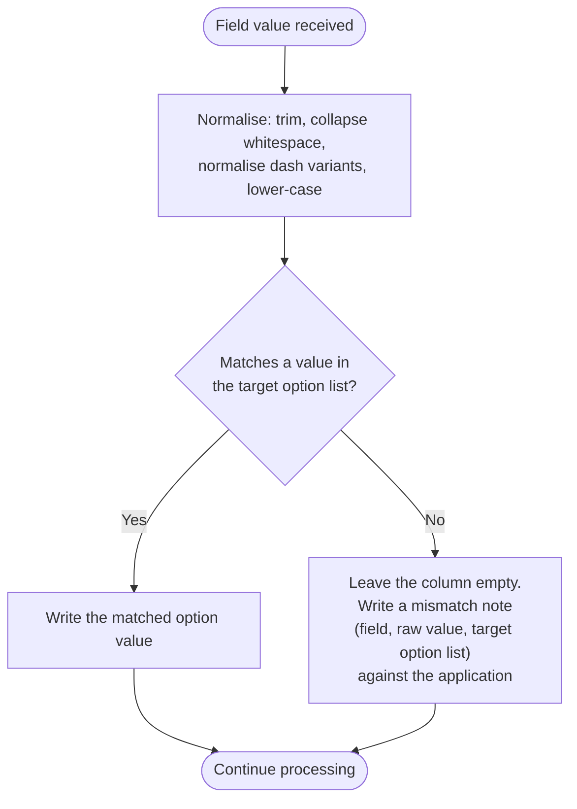

# Technical Architecture Document — Application Form Field Corrections

**Feature Slug:** `revitalise-form-field-corrections`
**SDD Reference:** `docs/plans/revitalise-form-field-corrections-plan.md` (revision 1.4, APPROVED 2026-08-16)
**Parent TAD:** `docs/architecture/revitalise-grant-automation-architecture.md` (APPROVED 2026-08-10,
amended since). This document is a **delta** — it extends the parent TAD's data model, security
design and provisioning plan for seven work items and does not re-derive anything the parent TAD
already settled. Every section below states explicitly whether it changes, extends, or leaves
unchanged the corresponding parent-TAD section.
**Date:** 2026-08-16
**Status:** DRAFT

**Model tier:** `strategic` — escalated from `standard` under `config/models.yml` →
`agents.architect-agent.escalate_to_strategic_when`, first condition ("feature touches regulated
data"), same trigger as the SDD. Two columns cross a UK GDPR Art. 6 → Art. 9 boundary and one of
them is deliberately released to a role the parent TAD's own anonymisation control (ADR-002) exists
to restrict from everything else at that tier.

---

## 1. Architecture Overview

**No new component, integration, persona, or automation is introduced by this pass.** All seven
work items are changes to two existing tables (`rev_application`, `rev_applicant`), one existing
column security profile (`REV_TrusteeRestricted`), and one existing flow
(`REV | Intake | WordPress to Dataverse`). The parent TAD's component diagram (§2.2), integration
list (§4), automation inventory (§5) and security role/group mapping (§6.1) are **unchanged and not
reproduced here**.

**Why this is architecture-significant despite the small footprint:**

1. Three attribute type conversions (Boolean/int → Choice) require **delete-and-recreate**, not an
   in-place alter — Dataverse has no in-place conversion between these shapes. This is a **declared
   deviation from the parent TAD's Migration Strategy** (§3, "Columns are never renamed in place:
   add → copy → deprecate → drop across two releases"). See ADR-022.
2. Two columns move across the Art. 6/Art. 9 boundary the parent TAD's data classification (§3.1)
   and security design (§6, ADR-002) govern, and they move in **opposite directions** — one becomes
   secured, one deliberately does not. See ADR-023.
3. One work item (FR-064) is a new *rule*, not just new data — the intake flow gains a standing
   defence against exactly the kind of silent drift that produced this whole pass. See §5 and ADR-024.

**What this pass deliberately does not do:** redesign the intake flow's trigger, change any
persona, role, or group-team binding, or touch any table besides `rev_application` and
`rev_applicant`. Every change is additive-or-corrective within the parent TAD's existing
boundaries.

---

## 2. Component Diagram

**Unchanged from parent TAD §2.1–§2.2.** The context diagram (WordPress → Intake flow → Dataverse)
and component diagram (ten tables, thirteen flows, Code App, MDA) are not reproduced here — nothing
in this pass adds, removes, or relocates a component. The only touched node in the parent's C4 L2
diagram is `REV | Intake | WordPress to Dataverse` (flow #1) and the `rev_application` /
`rev_applicant` tables it writes to.

---

## 3. Data Model

**Extends parent TAD §3 and §3.1.** The entity list, retention schedule, and every table not named
below are unchanged. This section states, per column, the target shape referenced by the SDD's
Appendix B, using the parent TAD's own classification and control vocabulary.

### 3.1 Column changes on `rev_application`

| Column | Before | After | Type change | Classification (parent §3.1 vocabulary) | Column security |
|---|---|---|---|---|---|
| `rev_exceptionalcircumstance` | `bit` (regressed 2026-08-16, this morning) | `picklist`, 4 values | Boolean → Choice | Tier 2 → **Tier 4 (Art. 9)** | **Not added to `REV_TrusteeRestricted`** — SDD D-6, §7.4. Extends ADR-002; see ADR-023 |
| `rev_currentlyworking` | `bit` | **renamed** `rev_employmentstatus`, `picklist`, 5 values | Boolean → Choice + rename | Tier 2 → **Tier 4 (Art. 9)** | **Added to `REV_TrusteeRestricted`** — SDD D-1 |
| `rev_carehoursperweek` | `int`, `MaxValue 168` | `picklist`, 5 values (new global option set `rev_carehoursband`) | int → Choice | Tier 3 (unchanged — a circumstance fact, not identity or free text) | Not secured, unchanged |
| `rev_consentexplanation` | — (new) | `ntext`, textarea, 2000 | New | **Tier 4 (Art. 9)** — reasoning identical to `rev_caresupportdescription`/`rev_otherconditionraw` (parent §3.1) | **Added to `REV_TrusteeRestricted`** from creation |
| `rev_travellingwithcarer` | `bit` | **removed** | Removal | n/a | Removed (was not secured) |
| `rev_carername` | `nvarchar(100)` | **removed** | Removal | n/a | **Removed from `REV_TrusteeRestricted`** |
| `rev_carersupport` | `ntext(2000)` | **removed** | Removal | n/a | **Removed from `REV_TrusteeRestricted`** |

### 3.2 Column changes on `rev_applicant`

| Column | Before | After | Type change | Classification | Column security |
|---|---|---|---|---|---|
| `rev_preferredcontactmethod` | — (new) | `multiselectpicklist`, new global option set `rev_contactmethod`, 3 values (Email/Phone/Post) | New | Tier 3 (personal, not special category — a contact-routing preference, not identity or health data) | Not secured — the people who correspond with an applicant are exactly the people who need this |

### 3.3 Why the two Art. 9 columns land on opposite sides of `REV_TrusteeRestricted`

**This is the parent TAD's own existing rule, applied — not a new rule invented here.** ADR-002
(parent §10) states: *"condition profiles remain trustee-visible by design — the case is what
trustees weigh, the person is not."* Parent §3.1 applies this concretely to `rev_conditionprofile`
and `rev_supportrecipientconditionprofile`: both Art. 9, both **not** in `REV_TrusteeRestricted`,
with their free-text elaborations (`rev_otherconditionraw`, etc.) secured behind them.

`rev_exceptionalcircumstance` is the same shape of column — an Art. 9 category a trustee needs in
order to weigh the specific request in front of them — and D-6 places it accordingly. Its free-text
elaborations, `rev_otherexceptionalcircumstance` and `rev_exceptionalfundingdetail`, **stay
secured**; the rule only holds because both halves do (SDD §7.4, NFR-027).

`rev_employmentstatus` is the asymmetric case. Under ADR-002's rule a category would be visible —
its financial neighbours `rev_incomeband`, `rev_savingsover6000` and `rev_significantcarecosts` all
are. It differs because one of its five values (*"No, unable to work due to
disability/health/caring responsibilities"*) is a direct disability disclosure with no financial
content a trustee's task requires. Nearest precedent: `rev_receivesbenefits`, secured for the same
kind of reason. **This asymmetry must be recorded in the column's own schema description**, per the
established convention in this solution (every non-obvious classification decision in `Entity.xml`
carries its own rationale comment) — so the next person reading the schema does not "fix" it by
matching it to its neighbours.

### 3.4 Migration Strategy — deviation from parent TAD §3, recorded per ADR-022

Parent §3 states additive-only, never-rename-in-place migration. Three columns in this pass need a
type conversion Dataverse cannot do in place (Boolean/int ↔ Choice), and one of those three is also
renamed. The parent's `add → copy → deprecate → drop` pattern exists to protect **data already
collected under the old shape**. SDD **D-2** establishes that no environment holds any data in any
of these five columns — the protection has nothing to protect yet. **Delete-and-recreate is used
instead, once, in this window only** (ADR-022). This is not a general exception to the parent's
migration strategy; it is a normal one **the moment any environment holds a real application record
in any of these columns.**

### 3.5 Ground truth for the delete-and-recreate pattern — already verified today, not a fresh guess

Per `skills/how-to-verify-a-platform-contract.md` §2, the evidence level for this contract is
**E1 — VERIFIED**, not a guess: this exact procedure (delete a live `picklist`/`bit` attribute via
the Web API, recreate it under the new shape, reconcile the RootComponent declaration) was executed
for real earlier today, for `rev_exceptionalcircumstance` and `rev_helperrelationship`
(`logs/routing.log`, 20:31; `Entity.xml` lines 1508–1519). This pass reuses a contract this
solution has already proven, four more times. No entry is needed in the Unvalidated Assumptions
Register for the conversion mechanism itself — only for anything in this pass that is genuinely new
(§12.2).

### Relationships

Unchanged. No new relationship, no cardinality change, no cascade-behaviour change. `rev_applicant`
gains a column; no foreign key is affected.

---

## 4. Integration Design

**Unchanged from parent TAD §4.** No integration is added, removed, or reconfigured. The intake
integration's protocol, trigger, and auth method are exactly as documented there.

---

## 5. Automation / Workflow Design

**Extends `REV | Intake | WordPress to Dataverse` only** (parent §5.1; flow #1 of thirteen). No
other flow in the parent's inventory is touched.

### 5.1 Trigger schema and field-mapping changes

| Field | Change |
|---|---|
| `exceptional_circumstance` | Type `boolean` → `string`; mapped through the restored 4-value option list |
| `currently_working` | Renamed **`employment_status`**; type `boolean` → `string`; mapped through the new 5-value option list |
| `care_hours_per_week` | Type `integer` → `string`; mapped through the new 5-band option list |
| `preferred_contact_method` (new) | `array` of strings (Email/Phone/Post — the export's three separate checkbox columns, cols 26–28, combined into one field) → `rev_applicant.rev_preferredcontactmethod` |
| `consent_explanation` (new) | `string` (export col 49) → `rev_application.rev_consentexplanation` |
| `travelling_with_carer`, `carer_name`, `carer_support` | **Removed** from the trigger schema and the mapping. The intake already wrote nothing for these (M-10 — no live-form source ever populated them); this removes the dead schema entries, not a live data path |

Every `C-TECH-049` (256-character flow-field description limit) and `C-TECH-042` (idempotency)
constraint the parent flow already satisfies continues to apply unchanged — this pass edits
existing trigger-schema properties and mapping expressions, it does not add a new flow or a new
error path.

### 5.2 FR-064 — option-list drift detection, as a rule within the existing validation step

Parent §5.1 already states: *"[the flow] validates the payload against the agreed field map before
any write."* FR-064 is not a new mechanism bolted onto the flow — it is what that existing
validation step is required to do for every Choice-typed field this pass touches (and, as a
standing pattern, every Choice-typed field the intake maps at all):

**Normalisation is deliberately narrow** (SDD §4G): trim, collapse internal whitespace, treat
hyphen/en-dash/em-dash as equivalent, and match case-insensitively. Nothing else. This is the exact
gap the D-4 correction exposed — an unnormalised comparison would have rejected every submission of
the correct band label over a dash-character difference between two sources describing the same
form. It is not the gap that let the original schema drift go undetected for weeks; that gap has no
technical fix, only FR-064's standing existence going forward.

**Failure mode is "leave empty and flag", never "guess the nearest value" and never "reject the
submission".** This is consistent with the parent flow's existing philosophy at §5.1 and with
D-003's resolution recorded in `docs/development/revitalise-grant-automation-form-validation-spec.md`
§8: an application with one unmapped field is a recoverable, reviewable gap; a rejected submission
is a lost applicant.

**Where the mismatch note is recorded:** as a row appended to the existing free-text mechanism the
flow already uses for non-fatal, application-specific issues — not a new table, not `rev_errorlog`
(reserved for flow-execution failures per parent §5, NFR-012, "no personal data in any log"; a
mismatch note about *an applicant's own submitted value* is not an operational log entry and must
not be routed there).

### 5.3 What is not required

No retry, no dead-letter, no timeout change. Nothing here is an external call — every check in §5.2
is in-memory comparison against a solution-shipped option set. The workflow design checklist
(`skills/how-to-design-a-workflow.md`) items on external-call failure, retry back-off and timeout do
not apply to this addition.

---

## 6. Security Design

**Unchanged from parent TAD §6 except the `REV_TrusteeRestricted` membership list** (§6, row
"Authorisation — column level") and the two classification decisions in §3.3 above, both of which
are *applications* of ADR-002, not changes to it.

| Concern | Control | Where applied |
|---|---|---|
| Column-level authorisation | `REV_TrusteeRestricted` profile membership changes: **+2** (`rev_employmentstatus`, `rev_consentexplanation`), **−2** (`rev_carername`, `rev_carersupport` — removed with their columns). `rev_exceptionalcircumstance` is deliberately **not** added — see §3.3, ADR-023 | Solution component (profile definition unchanged in mechanism); membership list updated in `Other/FieldSecurityProfiles.xml` |
| Verification | `scripts/verify-field-security-coverage.py` (parent's existing coverage script, referenced throughout `FieldSecurityProfiles.xml`'s own header) must pass in **both directions** after this change: every `IsSecured=1` column present in the profile, and — the direction this pass specifically exercises — `rev_exceptionalcircumstance` confirmed **absent** despite being Art. 9, as a deliberate assertion, not an omission | Build gate, `config/<slug>-build.yml` |

### 6.1 Security Role & Group Mapping

**Unchanged from parent TAD §6.1.** No persona is added, removed, or reassigned. The four roles,
five Entra groups, and group-team bindings the parent TAD defines are exactly as they are; this
pass changes what two existing roles can see through field-level security, not who holds a role.

**Testable consequence, both directions, for test-agent:**
- A `REV Trustee`-role read of an application **must** return a value for `rev_exceptionalcircumstance`
  and **must not** return a value for `rev_employmentstatus`, `rev_otherexceptionalcircumstance`, or
  `rev_exceptionalfundingdetail`.
- A `REV Admin`-role read must return values for all of the above (parent §6, "Separation of duties"
  does not restrict Admin from Application-table Tier 4 columns — only Bank Account/Payment,
  `REV_FinanceOnly`, is excluded from Admin).

---

## 7. Non-Functional Decisions

| NFR ID | Decision | Rationale |
|---|---|---|
| NFR-026 | Classification is recorded in §3.1/§3.2 above, before any column is built (SDD NFR-026) | Satisfies C-DOM-001 at TAD level; matches the parent TAD's own §3.1 format |
| NFR-027 | `REV_TrusteeRestricted` membership changes exactly as §6 states; the DPIA/RoPA amendment (OQ-039) is a documentation action, not an architectural one, and is carried to the Dev Summary as an open item rather than blocking this TAD | The architecture is buildable now; the DPIA/RoPA text update does not gate a schema change that reuses an already-accepted control (ADR-002) |
| NFR-028 | No public-form change is required by any of the seven work items (SDD §8) — withdrawn as having no subject, same as at SDD revision 1.2 | D-3 and D-4 (corrected) both confirm the schema now matches what the form already sends |

---

## 8. Accessibility

**Not applicable to this pass.** No UI is added or changed — the Application main form loses three
controls (W6) and gains type changes to three existing controls' underlying data type (W1, W2, W5),
which is a form-designer configuration change, not new UI. `skills/accessibility-checklist.md` has
no new surface to check. Parent TAD ADR-020 (WCAG 2.1 AA baseline) is unaffected.

The one live-form consequence — **V-10, the care-hours band overlap, reopened by D-4** — is a
WordPress form-copy question for Alex, outside this repository's build surface, and is tracked in
the V-01…V-11 change request, not here.

---

## 9. Deployment Topology

**Unchanged from parent TAD §9/§9.1.** Three environments, `DEV → TST/ACC → PRD`, two promotion
hops, `APPROVE PRD` the sole remaining human deployment gate after Stage 0 tenant prerequisites.
This pass introduces no new environment, no new pipeline stage, and no change to
`config/revitalise-grant-automation-pipeline.yml`'s gate structure.

| Environment | This pass's activity | Notes |
|---|---|---|
| **DEV** | 3 attribute delete-and-recreates, 3 attribute removals, 2 new attributes, 4 option-set changes (1 restored, 3 new), field security profile membership update, intake flow trigger/mapping update, form updates | **Confirmed empty (D-2)** — every destructive step is safe here and only here without a preservation step |
| **TST/ACC** | Receives the managed solution on the next promotion; `ensure-schema.ps1` must run again first (C-TECH-050, this is per-environment state) | Synthetic/anonymised data only (parent §9, C-TECH-007) — confirm no test data occupies these columns before promoting, though the schema change itself does not depend on it |
| **PRD** | Same as TST/ACC: `ensure-schema.ps1` first, then the managed import | **This is the environment D-2's safety argument does not cover indefinitely** — the empty window is DEV-and-pre-go-live only; once PRD holds a real application, this exact class of change (delete-and-recreate) is no longer available without a data-preservation step first |

---

## 10. Architecture Decision Records

Continuing the parent TAD's numbering from ADR-021.

### ADR-022: Delete-and-recreate instead of add→copy→deprecate→drop, for this pass only
**Status:** `Adopted` · **Date:** 2026-08-16
**Context:** Parent TAD §3 Migration Strategy requires additive, never-rename-in-place schema
changes, specifically to protect data already collected under a column's old shape. Three columns
in this pass need a type conversion (Boolean/int → Choice) Dataverse does not support in place, and
one is also renamed.
**Decision:** Use delete-and-recreate directly, once, for `rev_exceptionalcircumstance`,
`rev_currentlyworking` → `rev_employmentstatus`, and `rev_carehoursperweek`. Justified solely by
SDD **D-2**: no environment holds any application record referencing any of these columns. The
Web API delete-recreate-reconcile pattern is already proven today for two of the five conversions
performed this session (`rev_exceptionalcircumstance`'s Boolean regression, `rev_helperrelationship`).
**Consequences:** *Positive* — no interim dual-column state, no backfill flow, no two-release
deprecation window; the change is simpler than the general-case pattern because there is nothing to
protect. *Negative* — this is a one-time exception, not a new precedent: the general
add→copy→deprecate→drop rule resumes the moment any environment holds real data in these columns,
and this ADR must not be cited to justify a future in-place rename against populated data. *Neutral*
— the form main-form controls are removed and re-added rather than relabelled, which is the correct
consequence of a genuine attribute delete, not a shortcut.

### ADR-023: `rev_exceptionalcircumstance` extends ADR-002 rather than exempting itself from it
**Status:** `Adopted` · **Date:** 2026-08-16
**Context:** ADR-002 established column-level security as the trustee anonymisation control and
recorded, as a stated consequence, that "condition profiles remain trustee-visible by design — the
case is what trustees weigh, the person is not" (parent §3.1, §10). This pass's SDD initially
(revision 1.1–1.3) treated `rev_exceptionalcircumstance` as requiring the same secured treatment as
the newly-Art.-9 employment column, then reversed that at D-6 on the reviewer's stated reason:
trustees cannot judge an exceptional funding request without knowing the circumstance.
**Decision:** `rev_exceptionalcircumstance` is Art. 9, categorical, and **not** placed in
`REV_TrusteeRestricted` — the same treatment `rev_conditionprofile` and
`rev_supportrecipientconditionprofile` already receive. Its free-text elaborations stay secured.
`rev_employmentstatus` is the deliberate asymmetric case (§3.3) and remains secured, because nothing
in a trustee's task requires the disability disclosure one of its five values carries.
**Consequences:** *Positive* — the solution now has one legible rule across every Art. 9 categorical
column instead of two different unstated ones; the next column of this shape has a precedent to
follow without re-litigating the question. *Negative* — the trustee still receives no reason for
the *employment* status, which is an intentional gap, not an oversight (§3.3). *Neutral* — this ADR
changes no code path and no role; it only settles which of two already-existing patterns
(ADR-002's "categories visible" vs. the Finance-style "this column is off-limits") a new column
follows, and records the reasoning so the choice is not re-derived from scratch next time.

### ADR-024: Intake validation records drift and continues; it never rejects or guesses
**Status:** `Adopted` · **Date:** 2026-08-16
**Context:** Every finding that produced this SDD/TAD pair existed silently for an unknown period
because nothing compared the live form's actual option values against the schema's. FR-064
requires the intake to catch the next such drift as it happens, not months later by inspection.
**Decision:** Every Choice-typed field mapping in `REV | Intake | WordPress to Dataverse` compares
the incoming value against its target option list using the normalisation in §5.2. A match writes
the value; a non-match leaves the column empty and records a mismatch note against the application.
The flow never fails the submission and never maps to an approximate value.
**Consequences:** *Positive* — schema/form drift becomes a visible, per-application signal instead
of a silent, cumulative one; a charity Notes-style review process (the same shape already used for
column 9 in the raw export, per the validation spec) can absorb it without a code change.
*Negative* — an application with a drifted field arrives with a gap the process owner must
manually resolve, rather than a best-guess value; this is accepted as strictly better than either
alternative (SDD §4G). *Neutral* — this is a validation pattern, not a new component; it applies
equally to every Choice-typed field the intake maps, not only the five touched by this pass.

---

## 11. Risks & Mitigations

Continuing the parent TAD's risk register style (R1–R9 adopted, A-R10 onward architecture-derived).
These are additive to the parent register, not a replacement.

| Risk | Likelihood | Impact | Mitigation |
|---|---|---|---|
| **A-R23** Six attribute-level changes (3 delete-recreate, 3 removal) land in one deployment window; a partial failure mid-sequence could leave the schema in a mixed state (e.g. old `rev_currentlyworking` deleted, new `rev_employmentstatus` creation fails) | Low — the identical pattern succeeded twice today | Medium | Sequence all six through `ensure-schema.ps1`'s existing idempotent, per-resource `CREATED`/`EXISTS`/`FAILED` reporting (parent `build-and-deploy.md`); re-run is safe by construction; do not proceed to option-set/field-security/form/intake changes until all six report clean |
| **A-R24** `rev_carehoursband`'s stored value for an applicant reporting 50–59 hours is not fully reliable — the live form's own two bands overlap at that range (V-10, reopened) | Medium (any applicant in that 10-hour range) | Low — a banding ambiguity, not a data-loss or security issue | None at the schema level; the schema faithfully stores what the form sends (ADR-024's own philosophy). Resolution is on the WordPress side (V-10, Alex) |
| **A-R25** `rev_exceptionalcircumstance` being trustee-visible (ADR-023) is a narrower DPO exposure than the reversed revision 1.1–1.3 draft assumed, but it is still a **new** disclosure to the trustee persona pending DPIA/RoPA amendment (OQ-039) | Low | Medium | Same posture as A-R21 in the parent register (DPIA/RoPA not yet signed off): build may proceed on approved requirements, but the DPO amendment is a go-live gate item, not a build blocker, consistent with how ADR-002's own conditional status is already handled |

---

## 12. Provisioning & External Dependencies

No new tenant-level or per-environment provisioning item is introduced by this pass — no new Entra
group, no new app registration, no new connector, no new external system. Everything in this
section is the **existing** `provisioning/dataverse/ensure-schema.ps1` and
`provisioning/dataverse/` field-security scripts, exercised again for this pass's seven work items.

| Item | Type | Tool / Script | Scope | Gate |
|---|---|---|---|---|
| 3 attribute delete-and-recreate operations, 3 attribute removals, 2 new attributes, 4 option-set changes | Entities/Attributes, Global OptionSets (`C-TECH-050`) | `provisioning/dataverse/ensure-schema.ps1` (existing script, extended with this pass's resources) | per-env | destructive steps require explicit human go-ahead per this session's established practice (WORKFLOW.md risk posture); non-destructive steps (new attributes, new option sets) proceed on the standard per-environment schedule |
| `REV_TrusteeRestricted` membership update (+2, −2) | Field Security Profile membership (`C-TECH-050`) | `provisioning/dataverse/` (existing) | per-env | `post_deploy`, same as parent §12 |

### 12.1 Environment Prerequisites — before the next deploy into each environment

| Item | Why a deploy cannot create it | Script | Runs before | Re-run per environment? |
|---|---|---|---|---|
| `rev_exceptionalcircumstance`, `rev_employmentstatus`, `rev_carehoursperweek` (recreated) | Entities/Attributes are documented as unsupported to create from scratch via solution import (`C-TECH-050`) | `ensure-schema.ps1` | The next solution import into that environment | **Yes** — DEV first (already the pattern established today), then TST/ACC, then PRD, each before its own first import carrying this change |
| `rev_preferredcontactmethod`, `rev_consentexplanation` (new attributes) | Same — new Entities/Attributes | `ensure-schema.ps1` | Same | Yes, same three environments |
| `rev_exceptionalcircumstance` (restored 4-value), `rev_employmentstatus` (5-value), `rev_carehoursband` (5-value), `rev_contactmethod` (3-value) | Global OptionSets — same unsupported-from-import category | `ensure-schema.ps1` | Same | Yes |
| `REV_TrusteeRestricted` membership (+2/−2) | Field Security Profiles are the same unsupported-from-import category | `ensure-schema.ps1` | Same | Yes |

### 12.2 Platform Contract Verification Plan

| Component | Hand-authored? | Ground-truth method | Platform-assigned values | Verified at |
|---|---|---|---|---|
| Delete-and-recreate of a `bit`/`int` attribute into a `picklist` | Yes | **E1 — already verified**: performed for real today for `rev_exceptionalcircumstance`'s regression and `rev_helperrelationship` (§3.5). This pass reuses the proven procedure, not a new one | The attribute's `MetadataId` (platform-assigned; read back and reconciled per `C-TECH-051`, exactly as done today) | DEV, on this pass's first deploy |
| New global option set value numbering (`rev_carehoursband`, `rev_contactmethod`) | Yes | **E2 → to become E1 on first deploy.** Option set integer values are author-chosen, not platform-assigned (unlike Role/Field-Security-Profile ids), so `C-TECH-051` does not apply — but the *numbering convention itself* (the value range this solution's existing global option sets use, e.g. `rev_careprovidedtype`, `rev_hearaboutus`, both added today) should be followed rather than picked arbitrarily. development-agent: read the existing option-set XML files' value ranges before assigning new ones | None — these are author-chosen | Confirmed against the existing option-set files at development time, no environment step required |
| Whether `verify-field-security-coverage.py` correctly asserts a column's **deliberate absence** from `REV_TrusteeRestricted` (not just presence-when-secured) | Yes — this is a new assertion direction for an existing script | **E1 available immediately** — the script already exists and this pass only needs a new test case, not new script logic; run it against DEV after the profile update | None | DEV, on this pass's first deploy |

No `A-nnn` Unvalidated Assumptions Register row is required for this pass: every hand-authored
contract above is either already E1-verified from today's session or resolves to author-chosen
values with no platform-assignment step.

---

## Appendix A — Requirement Traceability (SDD → TAD)

| SDD ID | TAD Element |
|---|---|
| FR-056, FR-057 | §3.1 `rev_exceptionalcircumstance`; §3.3, ADR-023 |
| FR-058 | §3.1 `rev_employmentstatus`; §3.3, ADR-023 |
| FR-060 | §3.2 `rev_preferredcontactmethod` |
| FR-061 | §3.1 `rev_consentexplanation` |
| FR-062 | §3.1 `rev_carehoursperweek` / `rev_carehoursband` option set |
| FR-063 | §3.1 removal of `rev_travellingwithcarer`, `rev_carername`, `rev_carersupport` |
| FR-064 | §5.2, ADR-024 |
| NFR-026 | §7, §3.1/§3.2 |
| NFR-027 | §7, §6, ADR-023 |
| NFR-028 | §7, §8 |
| D-2 (no data in DEV) | §3.4, ADR-022, §9 |
| D-6 (trustee-visible exceptional circumstance) | §3.3, ADR-023 |
| D-7 (rename) | §3.1 |
| OQ-039 (DPIA/RoPA amendment) | §7 NFR-027, §11 A-R25 — carried as an open item, not a build blocker |

---

## Approval
**Reviewed by:** ___________  **Date:** ___________  **Response:** `APPROVED`
