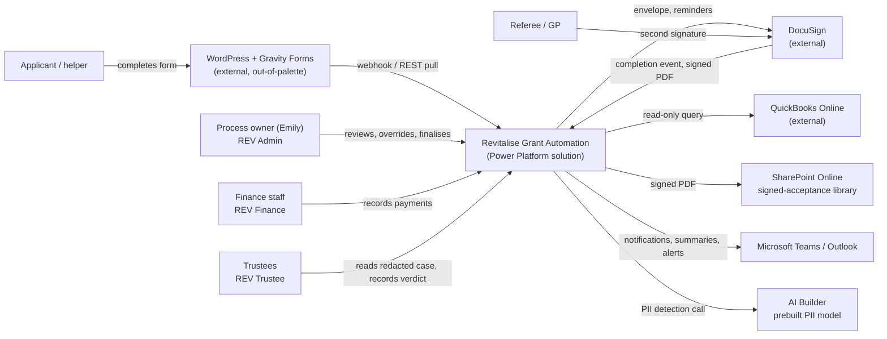
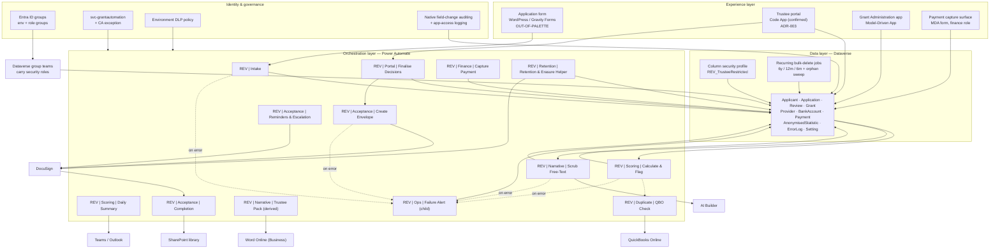
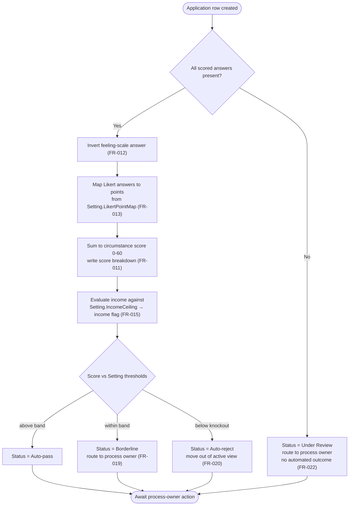
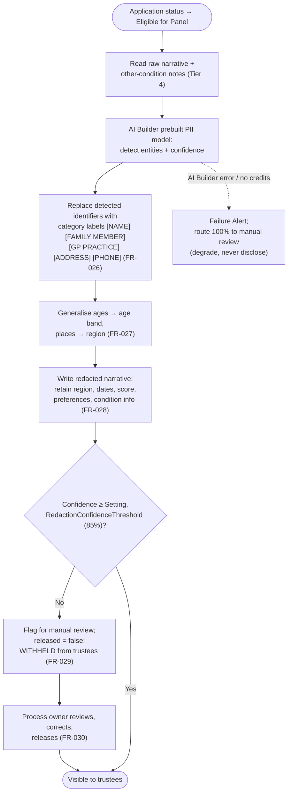

# Technical Architecture Document — Revitalise Grant Application Automation

**Feature Slug:** revitalise-grant-automation
**SDD Reference:** docs/plans/revitalise-grant-automation-plan.md (APPROVED 2026-08-10)
**Date:** 2026-08-10
**Status:** APPROVED
**Revision:** rev 1 — 2026-08-10. Reviewer decisions applied to ADR-003 (Code App confirmed), ADR-006
(three environments: DEV, TST/ACC, PRD), §6.1 (group-team pattern confirmed), §6.5 (audit retention
confirmed at 6 years), role-membership review cadence (confirmed at 6 months), and §4.2 (SAR mechanism
reframed as a proposal and carried forward as an accepted open item).
**Revision:** rev 2 — 2026-08-12. **ADR-007 closed to Power Platform Pipelines** by explicit reviewer
decision, superseding this TAD's own recommendation of pac CLI + GitHub Actions; §9.2 rewritten as the
GitHub-Actions/Pipelines responsibility boundary; **ADR-021 added**, resolving C-TECH-044 to a GitHub OIDC
federated credential with **one deploy identity per environment** (three app registrations, one federated
credential each); §6.7 and the §6 security table corrected (the deploy registrations are required either
way); **§12 gains four tenant prerequisites** — a custom pipelines host, pipeline/stage configuration,
Managed Environment status on TST/ACC and PRD (a licence cost), and pipelines access assignment. §9.1 and
ADR-006 are unaffected: the topology is unchanged and there are still two promotion hops.

---

> **Source:** adopted from `docs/Import/Revitalise-Solution-Architecture-v0.4.docx` on 2026-08-10 by architect-agent (intake mode).
> Original author: Xander Lykopoulos — Argelis Consultancy (v0.4 Draft for review, 14 July 2026, revised 15 July 2026).
> Read via a plain-text extraction of the same content. See Adoption Report in gate log.
>
> **Supporting source — authoritative for §6 Security Design and §6.1** (received 2026-08-10):
> - `docs/Import/Revitalise-Security-Model-v0.1.docx` — Security Model v0.1, 15 July 2026 (Draft, WBS 0.5).
>   This is the deliverable the Solution Architecture named but left to be written; §6 adopts it in preference
>   to the architecture's summary treatment wherever the two differ in detail.
>
> **Cited for context only** (not adopted as TAD content — see the user's scope decision recorded in the Adoption Report):
> - `docs/Import/Revitalise-ALM-Runbook-v0.1.docx` — cited in §9 for the promotion procedure and connection-reference / environment-variable inventory.
> - `docs/Import/Revitalise-Data-Governance-Framework-v0.2.docx` — cited in §3 for cascade-delete behaviour and the classification tiers, cross-checked against SDD §7.1/§7.6.
> - `docs/Import/Revitalise-DPIA-v0.1.docx`, `docs/Import/Revitalise-RoPA-v0.1.docx` — already adopted into SDD §7; cited in §11 only.
> - `docs/Import/Revitalise-Governance-Runbook-v0.1.docx` — day-2 operations; not TAD content.
>
> ⚠️ **Reader's note — three gates sit above this document.**
> 1. **DPO sign-off (SDD OQ-004/005/006)** gates build on the field-level-security basis this TAD adopts.
>    ADR-002 is `Adopted (conditional)` for that reason.
> 2. **WBS 0.3 — the service account `svc-grantautomation` and its scoped Conditional Access exception — is
>    outstanding with Wanstor** (SDD OQ-018). Every unattended automation in §5 depends on it. It is carried
>    forward as a blocking dependency in §12.
> 3. **Resolved at the architecture gate on 2026-08-10 (Xander Lykopoulos):** the trustee portal is a
>    **Code App** and Canvas App is descoped (ADR-003, now `Adopted`); the environment topology is
>    **three environments — DEV, TST/ACC, PRD** (ADR-006, now `Adopted`); the §6.1 group-team binding
>    pattern is confirmed as derived. Audit retention is confirmed at 6 years and the role-membership
>    review cadence at 6 months.
> 4. ~~**Two decisions remain open and are not blocking this gate:** the ALM tooling (ADR-007) and the
>    intake channel / endpoint-trust route (ADR-011).~~ → **ADR-007 IS NOW CLOSED (2026-08-12):
>    Power Platform Pipelines, by explicit reviewer decision, superseding this TAD's own recommendation
>    of pac CLI + GitHub Actions.** See §9.2 and ADR-007. It brings **two new tenant prerequisites**
>    (a custom pipelines host; Managed Environment status on TST/ACC and PRD, which carries a licence
>    cost) — both added to §12. **ADR-011 remains open.** ADR-021 was added at the same time, resolving
>    C-TECH-044 to a GitHub OIDC federated credential with one deploy identity per environment.
> 5. **One accepted open item** carried forward to development-agent: no SAR extract mechanism is built or
>    agreed. §4.2 records a *proposed* approach only. Accepted as a known gap by the reviewer on
>    2026-08-10 (C-DOM-005, SOFT).
>
> ⚠️ **Knowledge-base gap.** `knowledge/domain/data-entities.md`, `knowledge/domain/compliance-requirements.md`,
> `knowledge/technology/stack-overview.md` (Publisher Convention), `platform.md`, `dataverse.md` (column-security
> profile table), `build-and-deploy.md`, `entra-id.md`, `sharepoint.md` and `teams.md` are unpopulated template
> placeholders in this repository. No project-specific technology decision was taken from them. The one exception
> is **`knowledge/technology/security-model.md`, which IS populated** — its Group Teams pattern and Canonical
> Persona Mapping are real platform decisions and §6.1 is built on them. Where a placeholder file left a gap,
> this TAD relies on the source documents plus general Power Platform practice and says so at the point of use.
> Carried forward from SDD OQ-029.

---

## 1. Architecture Overview

The solution automates the grant journey from application submission to trustee decision and signed
acceptance on the Microsoft 365 / Power Platform stack Revitalise already owns. It automates the **data
handling, not the decision-making**: scoring is automatic with the process owner's oversight and override,
and trustees make the funding decision.

**Dataverse is the system of record and the integration hub.** Applications land in Dataverse, every
automation reads from and writes to it, and external systems never talk to each other directly. One
document — the signed DocuSign PDF — lives outside Dataverse, in a SharePoint library, linked by URL from
the Grant record.

### 1.1 Architecture principles (adopted from source §2)

| Principle | What it means here |
|---|---|
| Low-code, no custom code | Power Automate cloud flows, Power Apps and Dataverse configuration only. No macros, no scripts on anyone's laptop. |
| Maintainable by non-developers | Thresholds, templates and mappings live in configuration — a Dataverse `Setting` table plus environment variables — so the process owner can adjust them without editing a flow (NFR-019). |
| Cloud-native and portable | Data lives in Dataverse. No local file dependency, no "single source of truth on one laptop". |
| AI only where it earns its place | AI Builder redacts only the free-text narratives a trustee must read. Structured identifiers are hidden by column security, not by AI. |
| Governed foundation first | Environments, DLP, service identity, the data model and its security roles, naming and ALM are established before any automation is built, so every later component inherits a controlled structure. |

### 1.2 Why this design — and what was rejected

| Chosen | Rejected alternative | Why |
|---|---|---|
| Dataverse as system of record | SharePoint lists (the v0.3 baseline) | Relational integrity, cascade delete, native status-aware bulk-delete retention, column-level security and native field-change auditing. SharePoint could not enforce the retention schedule or the trustee control. Cost: Dataverse is a premium data source, so per-user premium entitlements are needed (ADR-001). |
| Field-level (column) security for trustee anonymisation | Manual anonymisation by one person per board cycle | Removes 3–4 hours per cycle and removes the single-missed-name breach risk. It is a *stronger but different* control, so it is gated on DPO sign-off (ADR-002). |
| Native Dataverse bulk delete + cascade | Custom retention sweep flow; Purview Suite event-based retention | Native, status-aware, configured once, logged as a system job, no extra licence. A light helper flow covers only what the native job cannot reach (ADR-004, ADR-005). |
| **Code App** for the trustee portal | Canvas App (out-of-palette, **rejected**); Model-Driven App; Power BI report; static mail-merged Word pack | Live secured data, decision capture written back to the Review table, no Power BI Pro licence. **Application type confirmed as a Code App by the reviewer on 2026-08-10 — ADR-003.** |
| Single solution, DEV → PROD as managed | Editing in production | One version number describes the live system; rollback is re-importing the prior managed package (§9). |

### 1.3 Solution boundary

Everything inside the Microsoft 365 tenant ships in **one Power Platform solution**,
`RevitaliseGrantAutomation`, publisher prefix `rev`. Four systems sit outside that boundary and are reached
through connectors: the **WordPress / Gravity Forms website** (application intake), **DocuSign** (acceptance
signatures), **QuickBooks Online** (duplicate-grant checks), and **SharePoint Online** (the signed-PDF
library, inside the tenant but outside the Dataverse store).

> **Naming conventions are adopted from source §4 unchanged**: publisher prefix `rev`; solution
> `RevitaliseGrantAutomation`; environments `Revitalise – Grant Automation (DEV)` / `(PROD)`; flows
> `REV | <Automation> | <Action>`; tables singular PascalCase; connection references `rev-<Service>`;
> environment variables `rev_<Purpose>`; service account `svc-grantautomation@revitalise.org`.
> `knowledge/technology/stack-overview.md` → Publisher Convention is an unpopulated placeholder; it should be
> populated with `rev` / `RevitaliseGrantAutomation` so downstream agents derive schema names consistently.

---

## 2. Component Diagram

### 2.1 Context diagram (C4 L1)



### 2.2 Component diagram (C4 L2)



### 2.3 Sequence — happy path, submission to signed acceptance

```mermaid
sequenceDiagram
  participant A as Applicant
  participant W as WordPress form
  participant I as REV Intake flow
  participant D as Dataverse
  participant S as REV Scoring flow
  participant E as Process owner
  participant N as REV Narrative flow
  participant AI as AI Builder
  participant T as Trustee portal
  participant P as REV Finalise Decisions
  participant DS as DocuSign
  participant SP as SharePoint

  A->>W: Completes validated form (FR-001..FR-006)
  W->>I: Webhook POST (fallback: scheduled REST pull)
  I->>D: Create Application + Applicant, assign reference (FR-007, FR-008)
  I->>E: Teams notification, name + reference (FR-009)
  D-->>S: Row created trigger
  S->>D: Score 0-60, status, income flag (FR-011..FR-016)
  S->>E: Borderline routed for review (FR-019, FR-022)
  E->>D: Reviews / overrides, marks eligible for panel (FR-018)
  D-->>N: Row updated trigger
  N->>AI: Detect PII in free-text narrative
  AI-->>N: Entities + confidence
  N->>D: Write redacted narrative; flag if below threshold (FR-026..FR-029)
  E->>D: Reviews and releases flagged redactions (FR-030)
  T->>D: Trustee reads redacted case, column security filters identity (FR-034..FR-038)
  T->>D: Records Approve / Defer / Reject (FR-037)
  E->>P: "Finalise decisions"
  P->>D: Apply verdicts, create Grant rows, write anonymised snapshot (FR-040, FR-055)
  P->>DS: Create envelope, dual signature in sequence (FR-041, FR-042)
  DS->>DS: Reminders day 3 and 7; escalate day 14 (FR-043, FR-044)
  DS-->>SP: Signed PDF stored, URL written to Grant (FR-045)
```

---

## 3. Data Model

Ten Dataverse tables (the source's seven personal/process tables, plus the Anonymised Statistic snapshot,
the Error Log, and the Setting configuration table), one SharePoint document library, and no other store.
Classification uses the four-tier scale in `skills/data-classification.md`, cross-referenced to the
UK GDPR tier used by SDD §7.1, the Security Model §3 and the Data Governance Framework §3 (all three agree).

### Entities

| Entity | Table | Purpose | UK GDPR tier (source) | Classification (`skills/data-classification.md`) | Retention (C-DOM-003) |
|---|---|---|---|---|---|
| Applicant | `rev_applicant` | The person, stored once; carries the pseudonymised ID | Special category + personal | **Tier 4 — Restricted** | Deleted with its last Application (derived orphan sweep — see §3.4) |
| Application | `rev_application` | The spine: one row per submission; folds support recipient, helper, group, referee, emergency contact | Special category + personal | **Tier 4 — Restricted** | 6 years from final payment (Grant Paid) / 12 months from decision (Rejected) / 6 months from last contact (Withdrawn, Incomplete) |
| Review | `rev_review` | One row per monthly panel attempt; trustee verdicts | Pseudonymised + staff identity | **Tier 3 — Confidential** | Cascade with Application |
| Grant | `rev_grant` | Created on success; folds acceptance and impact report; links the signed PDF | Personal + financial | **Tier 4 — Restricted** | Cascade with Application (6 years) |
| Provider | `rev_provider` | Reusable holiday providers | **Not classified in any source** | **Tier 2 — Internal (DERIVED — see §3.2)** | Reference data; retained while active, reviewed annually. No personal-data clock. |
| Bank Account | `rev_bankaccount` | Every account paid into, held once; finance role only | Personal — financial | **Tier 4 — Restricted** | Cascade with Applicant. Earlier purge after payment reconciliation is an open decision (§3.4) |
| Payment | `rev_payment` | Disbursements; the duplicate check matches these rows | Personal — financial | **Tier 4 — Restricted** | Cascade with Grant. The QuickBooks financial record is retained separately under the finance policy (FR-050) |
| Anonymised Statistic | `rev_anonymisedstatistic` | Non-personal outcome snapshot, no identifiers, never linked back | Anonymised — not personal data | **Tier 2 — Internal** | Indefinite (FR-055) |
| Error Log | `rev_errorlog` | Operational failure capture across all flows | Operational — non-personal | **Tier 2 — Internal** | 90 days (DERIVED — source says only "short operational retention") |
| Setting | `rev_setting` | Thresholds, Likert point map, redaction threshold, income ceiling — editable by the process owner | Non-personal configuration | **Tier 2 — Internal** | Indefinite; changes audited |
| Round Finance | `rev_roundfinance` | Trustee Portal Visual Refresh (delta TAD, ADR-028, WBS 6.9): one row per review round — the round's open/close calendar and its charity-level finance figures, entered by hand. No relationship to any other table; scopes no application visibility | Non-personal, no data subject | **Tier 2 — Internal** | Indefinite. Not personal data — out of scope of erasure (FR-051) and subject access (FR-053) |
| Grant History *(conditional)* | `rev_granthistory` | QuickBooks cross-reference fallback only — see ADR-017 | Personal | **Tier 3 — Confidential** | 6 years, aligned to the QBO financial record |

### 3.1 Key attributes and the controls each carries

Only attributes that drive a control, a requirement or a relationship are listed. Every table additionally
carries the platform columns required by `knowledge/technology/dataverse.md`: `rev_name` (primary),
`createdon`, `createdby`, `modifiedon`, `modifiedby`, `statecode`, `statuscode`.

**`rev_applicant` — Tier 4**

| Attribute | Type | Classification | Control |
|---|---|---|---|
| `rev_name` | Autonumber `REV-A-00001` | Tier 2 | **Primary name column is the pseudonymised ID, never the person's name** (ADR-013) |
| `rev_fullname` | Text | Tier 4 | Column security: `REV_TrusteeRestricted` — Admin + Service only |
| `rev_email`, `rev_phone` | Text | Tier 4 | Column security — Admin + Service only |
| `rev_addressline`, `rev_postcode` | Text | Tier 4 | Column security — Admin + Service only |
| `rev_dateofbirth` | Date | Tier 4 | Column security — Admin + Service only |
| `rev_agerange` | Choice | Tier 3 | Derived from DOB at intake; trustee-visible (FR-027) |
| `rev_locationarea` | Choice | Tier 3 | Derived from postcode at intake; trustee-visible (FR-027) |
| `rev_ethnicgroup` | Choice | Tier 4 (Art. 9) | Column security. **Only if actually captured — SDD OQ-027 open** |
| `rev_lastcontactdate` | Date | Tier 2 | Drives the 6-month withdrawn/incomplete retention clock |

**`rev_application` — Tier 4**

| Attribute | Type | Classification | Control |
|---|---|---|---|
| `rev_name` | Autonumber, reference | Tier 2 | **Format conflict — see §3.5.** SDD FR-008 requires `REV-YYYY-NNN`; source §4 specifies `GA-2026-00001` |
| `rev_applicantid` | Lookup → Applicant | — | Parental, cascade delete |
| `rev_submittedon` | DateTime (UTC) | Tier 2 | FR-008 |
| `rev_status` | Choice | Tier 2 | Submitted · Auto-pass · Borderline · Auto-reject · Under Review · Eligible for Panel · Approved · Rejected · Withdrawn · Incomplete · Grant Paid. Drives every retention clock (FR-048) |
| `rev_circumstancescore` | Whole number 0–60 | Tier 3 | Written by the scoring flow only; trustee-visible (FR-011) |
| `rev_scorebreakdown` | Multiline text | Tier 3 | Trustee-visible; evidences the score (FR-035) |
| `rev_incomeflag` | Choice | Tier 3 | Separate from the circumstance score (FR-015) |
| `rev_statusoverridden`, `rev_overriddenby`, `rev_overriddenon`, `rev_overridereason` | Bool / Lookup / DateTime / Text | Tier 2 | Named human accountability for every outcome (FR-018) |
| `rev_wellbeinganswer1..n`, `rev_incomeband`, `rev_financialanswers` | Choice / Text | Tier 3 | Trustee-visible; the only inputs to the score (FR-013, FR-016) |
| `rev_narrativeraw`, `rev_otherconditionraw` | Multiline text | **Tier 4 (Art. 9)** | Column security — **Admin + Service only. Never reaches a trustee** (FR-031, NFR-001) |
| `rev_narrativeredacted` | Multiline text | Tier 3 | Written by the narrative flow; trustee-visible (FR-026) |
| `rev_redactionconfidence` | Decimal | Tier 2 | Compared against the `Setting` threshold, initially 85% (FR-029, NFR-017) |
| `rev_redactionreviewrequired`, `rev_redactionreleased` | Bool | Tier 2 | Human-in-the-loop gate; trustee visibility requires `released = true` (FR-029, FR-030) |
| `rev_conditionprofile` | Multi-select choice | Tier 4 (Art. 9) | **Trustee-visible by design** — condition is relevant, identity is not (Security Model §5) |
| `rev_supportrecipientname`, `rev_helpername/email/phone`, `rev_refereename/email/phone`, `rev_emergencycontactname/phone` | Text | Tier 4 | Column security — Admin + Service only. Referee and emergency contact are **DERIVED** into the profile; the source names only helper and support-recipient identity |
| `rev_supportrecipientconditionprofile` | Multi-select choice | Tier 4 (Art. 9) | Trustee-visible, identity hidden (Security Model §5) |
| `rev_grouplinkage` | Text / Lookup | Tier 3 | Trustee-visible |
| `rev_breakstart`, `rev_breakend`, `rev_amountrequested`, `rev_costs` | Date / Currency | Tier 3 | Trustee-visible (FR-028, FR-034) |
| `rev_duplicateflag`, `rev_priorgrantref`, `rev_priorgrantdate`, `rev_priorgrantamount`, `rev_duplicatecheckedon` | Bool / Text / Date / Currency / DateTime | Tier 3 | FR-023, FR-024, FR-025. Visible to Finance on the record (US-015 AC-3) |
| `rev_decisiondate` | Date | Tier 2 | Drives the 12-month rejected clock |
| `rev_eligibleforround`, `rev_reviewround` | Bool / Text | Tier 2 | Scopes trustee visibility to the current round (FR-038) |
| `rev_sourcesubmissionid` | Text, alternate key | Tier 2 | **Idempotency guard on intake** — a replayed webhook cannot create a second row (§5.1) |
| `rev_caresupportdescriptionredacted`, `rev_careprovidedexampleredacted`, `rev_othercareprovidedtyperedacted` | Multiline text | Tier 3 | **Trustee Portal Visual Refresh (delta TAD, ADR-027 amended, WBS 6.3).** Redacted counterparts of the three secured columns immediately below; trustee-visible once `rev_redactionreleased` is true. `IsSecured=0` — same class as `rev_narrativeredacted`. Written by `REV \| Narrative \| Scrub Free-Text` once extended (Automation #5, deferred); empty on every row until then |
| `rev_careprovidedexample`, `rev_caresupportdescription`, `rev_othercareprovidedtype` | Multiline text | **Tier 4** | Column security: `REV_TrusteeRestricted` — Admin + Service only. Unchanged by the redacted counterparts above — the source free text stays secured (ADR-027) |

**`rev_review` — Tier 3:** `rev_name` (`REV-R-00001`), `rev_applicationid` (parental), `rev_paneldate`,
`rev_round`, `rev_trustee1`/`rev_trustee2` (lookup → systemuser), `rev_verdict1`/`rev_verdict2`
(Approve · Defer · Reject), `rev_notes1`/`rev_notes2`, `rev_staffrecommendation`, `rev_outcome`,
`rev_nonqualificationreason` (Choice: Circumstance score below threshold · Applicant under 18 ·
Applicant not UK-based · Other — see note below), `rev_finalisedon`. Trustees write verdict and
notes only (FR-037); all other columns are read-only to them.

> **AMENDMENT (PROPOSED), 2026-08-16 — `rev_nonqualificationreason` added.** Not part of the
> originally approved TAD; added from the Dev Summary's Task 2 raw-export audit
> (`revitalise-grant-automation-dev-summary.md`, "Finding 2"). The charity's own back-office
> export (raw column 8, "Reason for Non-Qual") has no home anywhere in the approved design — not
> in the already-built Phase 1 scoring engine, and not in `rev_review` as originally specified.
> Placed here on the reviewer's explicit instruction ("keep that together") rather than as a new
> column on `rev_application`, alongside the *staff-facing* `rev_outcome`/`rev_notes1`/`rev_notes2`
> this table already carries. **Two things this does NOT do, flagged for whoever builds Automation
> #6 / Phase 3:** (1) it does not build an automated capture path — nothing in the Phase-1 scoring
> flow writes this column yet, so age- and UK-residency-based non-qualification still has no
> automated check at all (only the score-threshold case is inferable from
> `rev_circumstancescore`/`rev_scorebreakdown`); (2) the three option values given are a
> reasonable first cut from the charity's own annotation ("too low overall circumstance score, age
> being under 18, location of applicant not in the UK") and are a PLACEHOLDER in the same sense as
> `rev_title`/`rev_breaktype`/etc. — confirm with the process owner before Phase 3 build.

**`rev_grant` — Tier 4:** `rev_name` (`GR-2026-00001`), `rev_applicationid` (parental),
`rev_providerid` (referential), `rev_amountawarded`, `rev_status` (Awarded · Acceptance Issued ·
Acceptance Signed · Paid), `rev_holidaystart`/`rev_holidayend`, `rev_conditions`,
`rev_docusignenvelopeid`, `rev_acceptanceissuedon`, `rev_acceptancesignedon`, `rev_signedpdfurl`,
`rev_manualacceptancerecorded` + `rev_manualacceptancenote` (FR-046), `rev_impactreport`,
`rev_finalpaymentdate` (starts the 6-year clock).

**`rev_provider` — Tier 2 (derived):** `rev_name` (provider organisation name), `rev_contactemail`
and `rev_contactphone` (**role-based mailbox / switchboard only — see §3.2**), `rev_addressline`,
`rev_region`, `rev_active`.

**`rev_bankaccount` — Tier 4:** `rev_name` (account nickname / masked last four — **never the full
account number**), `rev_applicantid` (parental), `rev_accountholdername`, `rev_sortcode`,
`rev_accountnumber`, `rev_active`. **Every column except `rev_name` sits in the `REV_FinanceOnly`
column security profile** — `rev_name` is this table's primary name attribute, and Dataverse does not
permit field-level security on a primary name under any circumstances (0x8004f501, ground-truthed
2026-08-23 against a live create call; see §6's note below the security table). This is a platform
limit with no privacy consequence: the value is never the full account number. The Admin role has no
table privilege at all on this table regardless, so this remains defence in depth (NFR-002).

**`rev_payment` — Tier 4:** `rev_name` (`PAY-2026-00001`), `rev_grantid` (parental),
`rev_bankaccountid` (referential), `rev_providerid` (referential), `rev_amount`, `rev_paymentdate`,
`rev_method`, `rev_qboreference`, `rev_isfinalpayment`.

**`rev_anonymisedstatistic` — Tier 2:** `rev_name` (`STAT-2026-00001`), `rev_agerange`,
`rev_locationarea`, `rev_conditionareas`, `rev_outcome`, `rev_amountawarded`, `rev_decisionmonth`,
`rev_snapshotdate`. **Deliberately carries no lookup and no reference to Applicant or Application** — a
foreign key or a stored reference number would make it pseudonymised rather than anonymised, and it would
then inherit the parent's retention clock instead of being retained indefinitely (Data Governance
Framework §3; SDD §7.1).

**`rev_errorlog` — Tier 2:** `rev_name` (`ERR-...`), `rev_flowname`, `rev_runid`, `rev_errormessage`,
`rev_recordreference` (text, **not a lookup**), `rev_occurredon`, `rev_severity`, `rev_resolved`,
`rev_resolvednote`. Holds run status, error message and record reference only — no personal data
(NFR-012, FR-010, FR-054).

**`rev_setting` — Tier 2:** `rev_name` (setting key), `rev_value`, `rev_datatype`, `rev_description`,
`rev_effectivefrom`. Seeded keys: `KnockoutThreshold`, `BorderlineBandLower`, `BorderlineBandUpper`,
`IncomeCeiling`, `RedactionConfidenceThreshold`, `LikertPointMap`, `FeelingScaleInversion`,
`ReminderDays`, `EscalationDays`, `PackScheduleDay`. Auditing is enabled on this table because a
threshold change is decision-relevant evidence (FR-017, NFR-019).

**`rev_roundfinance` — Tier 2 (Trustee Portal Visual Refresh, delta TAD, ADR-028, WBS 6.9):**
`rev_name` (the round key, alternate key so a round cannot be entered twice), `rev_isopen`
(FR-057 — which round the landing screen shows), `rev_roundopenedon` (FR-058's "date the round
opened" — entered, not derived), `rev_roundclosedon` (nullable, for the per-day average once a
round closes), `rev_amountcommitted`, `rev_peoplesupported`, `rev_individualssupported`,
`rev_peoplereachedbygroupgrants`, `rev_grantgivingcapacity` (charity-level, not round-scoped),
`rev_suggestedmaximumspend`, `rev_monthlydisbursement`, `rev_remaininglegacyfund` (charity-level,
not round-scoped) — all seven measures FR-063 — and `rev_figuresasat` (the date those seven
measures are current as of). No column secured: charity-level aggregate figures with no data
subject. Not personal data; out of scope of erasure (FR-051) and subject access (FR-053). No
relationship to any other table — this is not a `Round` entity and scopes no application
visibility (delta TAD §3.5). **Trustee-visible (FR-057, FR-063)** — read directly by the
`REV Trustee` role, which holds `prvReadrev_roundfinance` at Global (Roles/REV Trustee/
REV Trustee.xml).

### 3.2 Provider classification — DERIVED, reviewer confirmation required

**No source document classifies the Provider entity.** The Solution Architecture describes it only as
"reusable holiday providers"; the Security Model §3 tier table, the Data Governance Framework §3 inventory
and SDD §7.2 all omit it (SDD OQ-026 records the gap and assigns it to the TAD stage).

**Derived classification: Tier 2 — Internal. Not personal data. No Art. 6 basis required.**

Reasoning, stated so a reviewer can overturn it:
1. The entity's described purpose is organisational — the holiday provider a grant is spent with. It holds
   no data subject: no applicant, helper, referee or trustee attribute appears in it.
2. The access matrix supports this reading: Provider is the only table a trustee has **no** access to while
   Finance has read access — the pattern of commercial reference data, not personal data.
3. It is not in the erasure sweep in the Data Governance Framework §Right to erasure, which lists
   Applicant, Application, Review, Grant and Payment. A table holding personal data would have to be.

**The derivation carries one binding design condition:** `rev_provider` must hold **no named individual**.
Contact details are captured as a role-based mailbox and switchboard number (`bookings@provider.example`),
never a person. If the reviewer or DPO confirms that named provider contacts are required, Provider
**reclassifies to Tier 3 — Confidential**, needs an Art. 6 basis (6(1)(b) contract performance, or 6(1)(f)
legitimate interests) added to SDD §7.2, and must be added to the erasure locate-step in §5.12.

> **Flagged for reviewer confirmation. SDD OQ-026 remains open until answered.**

### 3.3 Relationships and cascade behaviour

Cascade behaviour is load-bearing here: the retention design (ADR-004) depends on deleting one parent row
and having the whole case follow. Adopted from the Data Governance Framework §4 and Solution Architecture §8.

| Parent | Child | Cardinality | Type | Delete behaviour | Why |
|---|---|---|---|---|---|
| Applicant | Application | 1:N | **Parental** | Cascade delete | Erasure runs from a single applicant reference and must remove the whole case (DGF §Right to erasure) |
| Applicant | Bank Account | 1:N | **Parental** | Cascade delete | *DERIVED* — no source states it; without it, Tier 4 bank details survive erasure |
| Application | Review | 1:N | **Parental** | Cascade delete | "Review, Grant and Payment rows hang off the Application through cascade-delete relationships" (DGF §4) |
| Application | Grant | 1:N | **Parental** | Cascade delete | As above |
| Grant | Payment | 1:N | **Parental** | Cascade delete | *DERIVED* — the source says Payment hangs off the Application; parenting it to Grant is the normalised form and the cascade still reaches it transitively via Application → Grant → Payment |
| Provider | Grant | 1:N | **Referential, Restrict Delete** | Provider survives; cannot be deleted while grants reference it | Reference data must not disappear from historical records |
| Provider | Payment | 1:N | **Referential, Restrict Delete** | As above | As above |
| Bank Account | Payment | 1:N | **Referential** | Payment survives a bank-account purge | Supports the "purge bank details early" option in §3.4 without destroying the payment record |
| Review | systemuser (trustee) | N:1 | **Referential** | Verdict survives the trustee's account being disabled | A leaver must not erase the board's decision record |
| Anonymised Statistic | — | — | **None, by design** | Never deleted | A relationship would make it linkable and therefore personal data |
| Error Log | — | — | **None, by design** | Deleted on its own 90-day clock | Reference held as text, so no dangling lookup after the parent is deleted |

> ⚠️ **Documented deviation from `knowledge/technology/dataverse.md`.** That file states "Enable **Restrict
> Delete** on all tables with a regulatory retention period" and "Referential: preserve child on parent
> delete — use for records with compliance retention". Applied literally, that rule would **block the entire
> retention design**, because here the regulatory obligation is to *delete* at the end of the period, not to
> preserve. Parental cascade is therefore used on the Applicant/Application spine, and the guardrails against
> accidental deletion are: (a) the bulk-delete jobs run against an explicit status-plus-date query, never an
> unfiltered one; (b) Purview basic labels as a time-based backstop; (c) the pre-delete Anonymised Statistic
> check in §5.12; (d) Restrict Delete retained on Provider, where preservation genuinely is the requirement.
> Recorded for reviewer acknowledgement.

### 3.4 Two retention gaps found in the source design — DERIVED remediation

**Gap 1 — orphaned Applicant rows survive retention.** The retention bulk-delete jobs query
**Application** by status and date. Deleting an Application cascades to Review, Grant and Payment, but
**the Applicant row is the parent, so it is not deleted**. An applicant whose only application is deleted
would leave a `rev_applicant` row holding full name, address, date of birth and — where captured — ethnic
group, indefinitely. That breaches FR-048 ("delete the full application record"), NFR-010 and
Art. 5(1)(e).
**Remediation (DERIVED):** a fourth recurring bulk-delete job, or a step in the Retention & Erasure helper
flow, deletes `rev_applicant` rows that have **no remaining child Application**. Listed in §12 as a
provisioning item. Flagged for reviewer confirmation — no source document covers it.

**Gap 2 — Bank Account has no retention rule.** No source document states a retention period or a delete
trigger for `rev_bankaccount`, and the DGF erasure sweep names Applicant, Application, Review, Grant and
Payment but not Bank Account. Sort code and account number are Tier 4.
**Remediation (DERIVED):** parent Bank Account to Applicant with cascade delete, so it is removed by both
the retention cascade and erasure. **Open decision for the DPO and finance:** whether bank details should be
purged earlier — as soon as the final payment is reconciled — which would be materially better data
minimisation (Art. 5(1)(c)) than holding them for six years. The Referential relationship from Bank Account
to Payment is chosen specifically so that this option stays open without a schema change.

### 3.5 Conflicts between the SDD and the architecture source — reviewer decision needed

| # | SDD (approved, upstream) | Architecture source | Recommendation |
|---|---|---|---|
| 1 | FR-008: reference format `REV-YYYY-NNN` | §4: Application autonumber `GA-2026-00001`; Applicant `REV-A-00001` | **Adopt the SDD** — `rev_application.rev_name` = `REV-2026-001`. Keep `REV-A-00001` for the Applicant pseudonymised ID; the two serve different purposes and both are needed. Reviewer to confirm. |
| 2 | §3 Out of scope: "Payment process automation"; seven automations only | Component map and §4 include **automation #8 Finance** — `REV | Finance | Capture Payment` flow and a payment capture form | The Bank Account and Payment tables, the Finance role and a minimal finance surface **are** required by US-015 AC-1 and NFR-002, so they are retained in this TAD. The `REV | Finance | Capture Payment` flow has **no FR behind it**. Reviewer decision: authorise it as an SDD scope addition, or descope the flow and keep manual entry on the MDA form. |
| 3 | FR-023: duplicate check runs "WHEN the application record is created" | §4: `REV | Duplicate | QBO Check` triggered by "Payment row created (child flow)" | **Adopt the SDD trigger** (check at intake, so the flag is available before assessment) **and** retain a second invocation before payment issue, which is what the source's end-to-end flow describes. One child flow, two call sites. |
| 4 | §3 Out of scope: "Full QuickBooks API integration… the fallback cross-reference approach is in scope" | §6: QBO connector query is primary; quarterly export to a Grant History table is the fallback | A single read-only query is not "full API integration". **Adopt the source's primary** (connector query) with the Grant History table as the documented fallback (ADR-017). `rev_granthistory` is built only if the fallback is adopted — SDD OQ-015/OQ-016. |

### Migration Strategy

- **Schema is a solution component.** Every table, column, choice, relationship, security role and column
  security profile ships inside `RevitaliseGrantAutomation`. No schema change is ever made directly in a
  non-DEV environment (§9).
- **Source of truth:** the solution is exported from DEV, unpacked with `pac solution unpack` and committed
  to `src/solutions/RevitaliseGrantAutomation/` so every schema change is diffable and recoverable.
- **Forward-only, additive changes.** New columns are added nullable first, backfilled by a one-off flow or
  data import, then made business-required. Choice options are added, never renumbered or removed while rows
  reference them. Columns are never renamed in place: add → copy → deprecate → drop across two releases.
- **Data migration is limited to the current application round** (SDD scope; delivered inside Automation #4
  setup, SDD OQ-028). Historical grants are not migrated; prior-grant history is reached through QuickBooks
  (ADR-017).
- **Non-production data.** DEV holds synthetic and anonymised test data only — no real applicant PII
  (source §3). Tier 3 and Tier 4 columns must never hold real values outside PROD (C-TECH-007,
  development-agent / pipeline-agent scope).
- **Retention configuration is not a solution component.** The recurring bulk-delete jobs, the column
  security profile *membership*, group teams and the audit retention setting are per-environment
  configuration applied by `post_deploy` provisioning (§12).

---

## 4. Integration Design

Six external touchpoints plus three in-tenant Microsoft services. **Dataverse is the hub — external systems
never talk to each other directly, only through it** — so each integration is independently replaceable, and
every one has a documented fallback so no single external dependency can stop the pipeline (source §6).

| Integration | Direction | Protocol / Connector | Tier | Trigger / method | Auth method | Fallback |
|---|---|---|---|---|---|---|
| **WordPress / Gravity Forms → Dataverse** | Inbound | Request (HTTP) trigger; or Gravity Forms REST API v2; or parsed structured email | **Premium** | Webhook POST on form submit | **Bearer token / shared secret held in a Key Vault-backed secret environment variable — see §6.3.** Caller restricted to the charity website (NFR-008) | Scheduled REST pull (service-account-initiated, reverses the trust direction) or structured-email trigger — no downstream component changes |
| **DocuSign** | Bi-directional | DocuSign connector | Premium | Outbound: create envelope on approval. Inbound: envelope-completed event | OAuth 2.0, service account owns the connection | Manual print-sign-scan route recorded on the Grant record (FR-046) |
| **QuickBooks Online** | Inbound (read only) | QuickBooks Online connector | Premium | Query by applicant name / email at intake, re-checked before payment issue | OAuth 2.0, **read-only scope** | Quarterly export into `rev_granthistory` + Power Automate cross-reference (ADR-017) |
| **AI Builder (prebuilt PII detection model)** | Internal | AI Builder connector, invoked from `REV \| Narrative \| Scrub Free-Text` | Premium | Synchronous call within the redaction flow | Environment AI Builder credits; runs as the service account | Human-only redaction: every narrative routes to the process owner for manual review (degraded, not broken) |
| **SharePoint Online — signed-acceptance library** | Outbound (write) + read | SharePoint connector | Standard | Store signed PDF on envelope completion; URL written to `rev_grant.rev_signedpdfurl` | Service account connection | Attach the PDF as a Dataverse note/annotation on the Grant row |
| **Microsoft Teams** | Outbound | Microsoft Teams connector | Standard | New-application notification, daily summary, escalation, failure alert | Service account, posts as Flow bot | Outlook email to the service mailbox recipient |
| **Microsoft 365 Outlook** | Outbound | Office 365 Outlook connector | Standard | Applicant and referee correspondence, summaries, escalations | Service account (`rev_ServiceMailbox`) | — |
| **Word Online (Business)** | Internal | Word Online (Business) connector | Standard | Populate the anonymised trustee-pack template → PDF (FR-032) | Service account | Print/export from the trustee portal (FR-039) |
| **Approvals** | Internal | Approvals connector | Standard | Optional: route flagged redactions (FR-030) and Borderline reviews (FR-019) as approvals rather than Teams messages | Service account | Teams message + a Dataverse view |

### 4.1 Integration controls

- **TLS 1.2 or higher on every hop** (C-TECH-003). All connectors and the HTTP trigger are HTTPS-only;
  the Power Platform enforces this and it is not configurable downward.
- **Every external connection is owned by the service account**, never a personal login, so access survives
  staff changes and is governed centrally (NFR-006, Security Model §2). Connections are bound through the
  four connection references `rev-dataverse`, `rev-docusign`, `rev-qbo`, `rev-outlook` (ALM Runbook §3), so
  no flow is edited at deployment time.
- **DLP connector policy** (C-TECH-045) — see §6.4 for the complete classified list, including two
  connectors the source's business group omits.
- **Error handling on every inbound flow**: malformed or duplicate payloads are caught, written to
  `rev_errorlog` and surfaced to the process owner via Teams rather than failing silently (FR-010).
- **UK residency** must be verified per integration at setup, not assumed: the Power Platform environments,
  AI Builder, DocuSign and QuickBooks Online (NFR-009, DPIA action A5, SDD OQ-018/OQ-019). Recorded as a
  §12 gate item and a §11 risk — no source document evidences it as verified.
- **Idempotency at the boundary**: `rev_application.rev_sourcesubmissionid` is an alternate key, so a
  replayed webhook or a re-run REST pull updates rather than duplicates.

### 4.2 Subject access request path — ⚠️ NO AGREED MECHANISM (C-DOM-005, open item)

> ⚠️ **This section describes a *proposal*, not a design decision. There is no built or agreed SAR
> mechanism.** The reviewer confirmed this on 2026-08-10 and accepted it as a known gap to close during or
> before development (SOFT warning C-DOM-005, accepted-risk path). **Carried forward to development-agent as
> an open item.** Nothing downstream should treat the approach below as settled.

**What the sources contain.** The Data Governance Framework and the architecture source both design the
*erasure* locate-step — across Applicant, Application, Review, Grant, Payment, the signed-PDF library,
DocuSign and QuickBooks — and SDD FR-053 requires "a complete extract of the data held about a named
individual". **No source document describes a SAR mechanism, and no component is assigned to produce the
extract.**

**Proposed approach, for agreement before development completes.** The `REV | Retention | Retention & Erasure
Helper` flow could gain a third, manually triggered mode — *SAR extract* — reusing the same locate-step and
writing the located rows to a protected file delivered to the process owner rather than deleting them:
generated by the service account, the run written to the retention/erasure evidence log with actor and
timestamp (FR-054), and the working extract deleted once delivered. This is the lowest-cost route because the
locate logic already has to exist for erasure (FR-051), but it is **one option among several** — a
purpose-built export, a Dataverse advanced-find plus documented manual procedure, or an MDA-driven extract
would all satisfy FR-053.

**What must be settled to close this item:**
1. Which mechanism is built, and whether it is automated or a documented manual procedure.
2. The delivery and protection route for the extract file — no source addresses it.
3. Whether the extract must cover the copies outside Dataverse (signed-PDF library, DocuSign, QuickBooks) as
   the erasure locate-step does. FR-053 says "all data held about a named individual", which implies yes.
4. The internal turnaround target — **there is no SAR SLA in any source** (SDD OQ-023, NFR-025), so the
   test-agent has no measurable threshold to test against even once a mechanism exists.

Recorded as risk **A-R22** and referenced in §5.12 mode 3, which is likewise marked as proposed.

---

## 5. Automation / Workflow Design

**Thirteen cloud flows**: the ten the source's naming table and component map define, the light retention and
erasure helper the source demotes the custom sweep to, the `REV | Ops | Failure Alert` child flow, and one
**derived** flow the source's own inventory cannot accommodate (§5.6). Plus **four native Dataverse recurring
bulk-delete jobs**, which are environment configuration and not flows at all (§12).

Every flow: runs as the service account; validates its input before processing; calls
`REV | Ops | Failure Alert` from its configured error path; retries transient external failures with
exponential back-off to a capped retry count; and writes no personal data to any log (NFR-012).

| # | Flow | Automation | Trigger | Requirements served |
|---|---|---|---|---|
| 1 | `REV \| Intake \| WordPress to Dataverse` | #4 | HTTP webhook (fallback: scheduled REST pull / email) | FR-007, FR-008, FR-009, FR-010 |
| 2 | `REV \| Scoring \| Calculate & Flag` | #2 | Dataverse row created — Application | FR-011–FR-016, FR-019, FR-020, FR-022 |
| 3 | `REV \| Scoring \| Daily Summary` | #2 | Scheduled, daily | FR-021 |
| 4 | `REV \| Duplicate \| QBO Check` | #7 | Child flow — called from #1 and from #11 | FR-023, FR-024, FR-025 |
| 5 | `REV \| Narrative \| Scrub Free-Text` | #5 | Dataverse row updated — status becomes Eligible for Panel | FR-026–FR-031 |
| 6 | `REV \| Narrative \| Trustee Pack` **(DERIVED)** | #5 | Scheduled ahead of the board meeting **+** manual | FR-032, FR-033 |
| 7 | `REV \| Portal \| Finalise Decisions` | #6 | Manual, process owner, after the board meeting | FR-037, FR-040, FR-047, FR-055 |
| 8 | `REV \| Acceptance \| Create Envelope` | #3 | Application/Grant status becomes Approved | FR-041, FR-042 |
| 9 | `REV \| Acceptance \| Reminders & Escalation` | #3 | Scheduled daily + DocuSign event | FR-043, FR-044 |
| 10 | `REV \| Acceptance \| Completion` | #3 | DocuSign envelope completed | FR-045 |
| 11 | `REV \| Finance \| Capture Payment` | #8 ⚠️ | Manual, finance role | NFR-002, US-015 — **no FR; see §3.5 conflict 2** |
| 12 | `REV \| Retention \| Retention & Erasure Helper` | cross-cutting | Scheduled monthly (after the bulk-delete jobs) + manual on demand | FR-049–FR-055 |
| 13 | `REV \| Ops \| Failure Alert` | cross-cutting | Child flow — called from the error path of flows 1–12 | FR-010, NFR-012, NFR-016 |

### 5.1 `REV | Intake | WordPress to Dataverse`

Event-driven. Validates the payload against the agreed field map before any write. **Idempotency guard:**
the Gravity Forms submission ID is written to `rev_application.rev_sourcesubmissionid`, an alternate key, so
a replayed or duplicated webhook updates the existing row instead of creating a second application.
Matches or creates the Applicant on email plus name (so a repeat applicant is one Applicant row with two
Applications), derives `rev_agerange` from date of birth and `rev_locationarea` from postcode at write time
(FR-027), assigns the reference (FR-008), posts the Teams notification (FR-009), and calls the duplicate
check child flow (FR-023). Any failure writes `rev_errorlog` and alerts the process owner (FR-010) — no
submission is silently lost.

### 5.2 `REV | Scoring | Calculate & Flag`



Health-condition data, disability data and the free-text narrative are **not read** by this flow — enforced
by the flow reading a named column list, not the whole row (FR-016, DUAA 2025 position). Thresholds come
from `rev_setting`, never from flow logic (FR-017, NFR-019). Idempotent: re-running recalculates the same
score from the same answers and does not overwrite a status the process owner has overridden
(`rev_statusoverridden = true` short-circuits the write, FR-018).

### 5.3 `REV | Scoring | Daily Summary`

Scheduled daily. Counts applications scored, auto-rejected and Borderline-awaiting-review in the period and
sends one Teams message to the process owner (FR-021). Carries **counts only, no applicant identifiers** —
a deliberate narrowing, because a summary posted to a chat is the easiest place for personal data to leak.
Safe to run twice: it reads and reports, it does not write.

### 5.4 `REV | Duplicate | QBO Check`

Child flow, two call sites: at intake (FR-023, per the SDD) and before payment issue (per the source's
end-to-end flow). Queries QuickBooks Online read-only by applicant name and email. On a match, writes
`rev_duplicateflag`, `rev_priorgrantref`, `rev_priorgrantdate`, `rev_priorgrantamount` (FR-024); on no
match, records "no prior grants found" with `rev_duplicatecheckedon` so the check is evidenced as having run
(FR-025). If QuickBooks is unreachable, the flow records the failure and flags the application as
*check pending* — it never reports a false "no prior grants found".

### 5.5 `REV | Narrative | Scrub Free-Text` — the human-in-the-loop control



The raw narrative is read by this flow and by the Admin role only; it is never written to a log, never
passed to a notification, and never reaches a trustee column (FR-031, NFR-001). Trustee visibility is a
conjunction of two conditions — `rev_eligibleforround = true` **and** `rev_redactionreleased = true` — so
the default state of a new narrative is *withheld*, and a flow failure fails closed (NFR-018).

### 5.6 `REV | Narrative | Trustee Pack` — DERIVED, +1 to the source's inventory

The source's ten-flow inventory has no component for FR-032 (per-application anonymised document) or FR-033
(pack preparation runs **on demand by the process owner and on a schedule**), yet the integration register
does list Word Online (Business) for exactly that purpose. A single Power Automate flow can carry only one
trigger, and flow #5 already uses a Dataverse row-updated trigger, so the on-demand and scheduled paths
cannot live inside it.

**Derived: an eleventh business flow** with a scheduled trigger ahead of each board meeting plus a manual
trigger, which generates the per-application anonymised Word/PDF document — redacted narrative, score
breakdown, holiday details, staff recommendation — for the trustees who cannot or will not use the portal
(FR-032, FR-039, US-014). It reads only released, trustee-permitted columns, so the offline pack cannot
contain more than the portal does.

> **Flagged as an interpretation:** it takes the source's flow count from ten to eleven business flows
> (thirteen including the helper and the failure-alert child flow). Reviewer confirmation requested.

### 5.7 `REV | Portal | Finalise Decisions`

Manual, process owner, after the board meeting — one controlled, auditable step (FR-040). Reads the verdicts
from `rev_review`, applies them to the Application and Grant records, creates Grant rows for approvals, and
triggers flow #8 for the whole approved batch in a single run (FR-047). **Also writes the Anonymised
Statistic snapshot** (FR-055 — see §5.13). Guarded against double-execution by a `rev_finalisedon` stamp on
the Review row: a second run over an already-finalised round is a no-op.

### 5.8–5.10 Acceptance flows (#3)

**Create Envelope** — on status Approved, builds the DocuSign envelope from the template, pre-populated with
applicant name, grant amount, provider, dates and conditions, and routes it for **two signatures in
sequence**: applicant first, then referee or GP (FR-041, FR-042). Writes `rev_docusignenvelopeid` and
`rev_acceptanceissuedon`.
**Reminders & Escalation** — scheduled daily, plus DocuSign events. Reminders at **3 and 7 days**
(`Setting.ReminderDays`), escalation to the process owner with the applicant's details at **14 days**
(`Setting.EscalationDays`) (FR-043, FR-044). Idempotent: a reminder-sent stamp prevents a duplicate on a
re-run.
**Completion** — on envelope completed, sets Grant status to *Acceptance Signed*, stores the signed PDF in
the SharePoint library and writes its URL to `rev_grant.rev_signedpdfurl` (FR-045). The manual
print-sign-scan route (FR-046) is recorded directly on the Grant record through the Model-Driven App — no
flow, by design, because it is a human-attested exception.

### 5.11 `REV | Finance | Capture Payment`

Manual, finance role. Records the Provider, Bank Account and Payment rows, re-invokes the duplicate check
before issue, and sets `rev_grant.rev_finalpaymentdate` on the final payment — **which starts the six-year
retention clock**, so this flow is on the compliance path even though it is the least-specified automation in
the source. ⚠️ **It has no FR behind it** (§3.5 conflict 2): reviewer decision required.

### 5.12 `REV | Retention | Retention & Erasure Helper`

Two confirmed modes plus one proposed mode. The **native recurring bulk-delete jobs are the primary retention
control** (ADR-004); this flow is the residual that covers only what the native job cannot reach.
⚠️ **Mode 3 (SAR extract) is a proposal, not an agreed design — see §4.2. It is an accepted open item carried
to development-agent, not a committed component of this flow.**

```mermaid
flowchart TD
  subgraph M1["Mode 1 — monthly, scheduled after the bulk-delete jobs"]
    A1([Monthly schedule]) --> A2["Verify an Anonymised Statistic snapshot<br/>exists for each row about to be deleted (FR-055)"]
    A2 --> A3["Delete orphaned Applicant rows<br/>with no remaining Application (DERIVED — §3.4 gap 1)"]
    A3 --> A4["Purge matching DocuSign envelopes (FR-049)"]
    A4 --> A5["Apply the QuickBooks finance-retention<br/>carve-out — retain, do not delete (FR-050)"]
    A5 --> A6["Write the retention evidence log:<br/>record ref, data type, date, rule — no personal data (FR-054)"]
  end
  subgraph M2["Mode 2 — on demand, erasure request"]
    B1([Process owner triggers with applicant reference]) --> B2["Locate across Applicant, Application, Review,<br/>Grant, Payment, Bank Account, signed-PDF library,<br/>DocuSign, QuickBooks — incl. referee, helper,<br/>group member, emergency contact (FR-051)"]
    B2 --> B3{Legal hold applies?}
    B3 -- Yes --> B4["Retain the carve-out; report to the requester<br/>what cannot be deleted and why (FR-052)"]
    B3 -- No --> B5["On-demand bulk delete by applicant reference;<br/>cascade removes the case (FR-051)"]
    B4 --> B6["Log request + action taken (FR-054)"]
    B5 --> B6
  end
  subgraph M3["Mode 3 — SAR extract — PROPOSED ONLY, not agreed (§4.2)"]
    C1([SAR received]) --> C2["Reuse the locate step; produce a complete<br/>extract for the named individual (FR-053)"]
    C2 --> C3["Deliver to the process owner; log the run;<br/>delete the working extract"]
  end
```



### 5.13 Who writes the Anonymised Statistic snapshot — DERIVED

The source's access matrix says the service account "Writes" the Anonymised Statistic table, but **no flow in
the source's inventory writes it**, and FR-055 requires the statistics to survive deletion of the underlying
personal data. Derived assignment:
1. `REV | Portal | Finalise Decisions` writes the snapshot at decision (outcome = Approved / Deferred /
   Rejected), so reporting is current rather than end-of-life.
2. `REV | Finance | Capture Payment` updates the amount on final payment.
3. `REV | Retention | Retention & Erasure Helper` **verifies a snapshot exists before any record is
   deleted** — the safety net that makes FR-055 true even if step 1 failed.
The snapshot carries no lookup and no reference number (§3.1), so it is genuinely anonymised and is not
touched by erasure.

### 5.14 `REV | Ops | Failure Alert`

Child flow called from the configured `run after has failed / timed out` path of every other flow. Writes one
`rev_errorlog` row — flow name, run ID, error message, record reference, timestamp, severity — and posts a
Teams alert to the process owner. **Holds no personal data** (NFR-012, NFR-016). Native Power Automate run
history and Dataverse field-change auditing back it up (source §5, Security Model §8).

> ⚠️ **Compliance note on `rev_recordreference`.** The Security Model §3 and the Data Governance Framework §3
> both classify the Error Log as non-personal because it holds "record references only". A reference that
> resolves to a living person is strictly **pseudonymised personal data**, not anonymous. The mitigations
> designed in are: a short 90-day operational retention (derived — the sources say only "short"), Tier 2
> handling with no trustee access, and no name, contact detail or narrative fragment ever written to the
> message. Flagged for DPO confirmation; recorded as risk A-R12.

---

## 6. Security Design

**Authoritative source: `Revitalise-Security-Model-v0.1.docx` (WBS 0.5).** Where it and the Solution
Architecture differ in detail, the Security Model is adopted. Checked against
`skills/compliance-checklist.md` §1.2 (Audit Logging) and §1.3 (Access Control).

| Concern | Control | Where applied |
|---|---|---|
| **Authentication** | Entra ID sign-in with **MFA for every staff, trustee and service-identity sign-in** (NFR-004). Staff and trustees use their own tenant accounts. The service account `svc-grantautomation` signs in with MFA and holds a **documented, scoped Conditional Access exception** so unattended flows are not blocked by an interactive-sign-in policy (Security Model §7) | Entra ID / Conditional Access (tenant). Provisioned in WBS 0.3 — **outstanding with Wanstor** |
| | The one public endpoint is the intake HTTP trigger. It accepts submissions **only from the authenticated charity website** (NFR-008, C-TECH-006) — bearer token / shared secret validated in the first flow action, request rejected before any Dataverse write | `REV \| Intake` flow; secret held per §6.3 |
| **Authorisation — outer gate** | Membership of a per-environment **Entra ID security group** is required to reach the environment at all, before any role permission applies (NFR-005). Group membership is the outer gate; the security role is the inner one (Security Model §7) | Power Platform admin centre, per environment |
| **Authorisation — inner gate** | Dataverse security roles, assigned **only through Entra-group-backed group teams** in PROD (C-TECH-040). Four roles — see §6.1 and §6.2 | Solution component (roles) + `post_deploy` config (group teams) |
| **Authorisation — column level** | Two column security profiles: `REV_TrusteeRestricted` hides every identifying column from the Trustee role so identity **never reaches the trustee app**; `REV_FinanceOnly` restricts all Bank Account and Payment columns to the Finance role, with one platform-forced exception — see the note directly below. This is the control that replaces manual anonymisation (ADR-002) | Solution component; profile *membership* applied per environment |

> **Exception to "all", ground-truthed 2026-08-23, not a design gap.** `rev_bankaccount.rev_name` and
> `rev_payment.rev_name` — each table's primary name attribute — are **not** in `REV_FinanceOnly`.
> Dataverse rejects `IsSecured=1` on any table's primary name attribute outright (`0x8004f501`, "The
> field 'rev_name' is not securable"), confirmed by a live `ensure-schema.ps1 -Env dev` run against
> DEV; this is a hard platform limit, not a configuration choice, and it holds regardless of what this
> section's prose says elsewhere. It carries no privacy consequence: both values are a plain reference
> (an account nickname/masked last four, or an autonumber payment reference), never the account
> number, sort code, amount or any other sensitive value — those stay on separate columns, still
> `IsSecured=1` and released only through `REV_FinanceOnly`. See
> `src/solutions/RevitaliseGrantAutomation/Entities/rev_bankaccount/Entity.xml` and the sibling
> `rev_payment/Entity.xml` for the full ground-truth record.
| **Separation of duties** | The Admin role holds **no Bank Account or Payment table privilege at all** — bank details sit behind one role and one role only (NFR-002, Security Model §4). Conversely the Finance role holds no Applicant or Application privilege, so finance staff never handle health data (US-015 AC-2) | Security role definitions |
| **Data at rest** | Dataverse platform encryption at rest (Microsoft-managed keys), **UK region** environments. SharePoint Online encryption at rest for the signed PDFs, same region. Tier 4 columns additionally protected by column security profiles (`skills/data-classification.md` — encryption at rest mandatory for Tier 3+) | Dataverse + SharePoint Online, UK region (NFR-009) |
| **Data in transit** | **TLS 1.2 or higher on every hop** (C-TECH-003) — all connectors, the HTTP trigger, DocuSign, QuickBooks and AI Builder calls are HTTPS-only and not configurable downward | Platform-enforced |
| **Data residency** | 100% of processing, storage and backup in the UK across every component including AI Builder, DocuSign and QuickBooks. Zero transfers outside the UK. **Verified at environment setup, not assumed** (NFR-009, DPIA A5) | §12 gate item; risk A-R19 |
| **Audit logging** | Native Dataverse **field-change auditing** enabled at environment and table level on all ten tables: every create, update and delete with timestamp (UTC), actor, action, record identifier and before/after values (NFR-014, C-DOM-010, C-DOM-011). **App-access logging** records which user opened the trustee app and when (NFR-015). Native Power Automate run history for flow execution | Dataverse (env + table setting, `post_deploy`) |
| **Audit integrity** | See §6.5 — the platform audit store is append-only and the application Admin role is deliberately separated from audit administration (C-DOM-012) | Role design + tenant admin separation |
| **Retention / erasure evidence log** | Bulk-delete runs are recorded as Dataverse system jobs; the consolidated evidence log (record reference, data type, date, rule applied) holds **no personal data** (FR-054, NFR-016) | System jobs + `REV \| Retention` helper flow |
| **Operational logging** | `rev_errorlog` + `REV \| Ops \| Failure Alert`: run status, error message, record reference only. **No personal data in any log** (NFR-012, C-DOM-004 — development-agent scope) | `rev_errorlog` table |
| **Privileged actions** | See §6.6 (C-DOM-021) | Tenant admin separation + logged, evidenced runs |
| **Secrets** | See §6.3 (C-TECH-002) | Key Vault-backed secret environment variable |
| **App registrations / API permissions** | The **solution runtime uses no app registration** — every connection is an OAuth connection owned by the `svc-grantautomation` user account (NFR-006). App registrations are needed only for **CI/CD and provisioning**, and are required regardless of ADR-007's outcome: `rev-grantautomation-deploy-dev` / `-tstacc` / `-prd` (one per environment, Dataverse application user in its own environment only, one OIDC federated credential each, no client secret) and `REV-MS-Provisioning` (Graph + PnP, certificate-based). Permissions and justification in §6.7 (C-TECH-043, C-TECH-044) | Entra ID; §12 tenant prerequisites |
| **Connector governance** | Environment-level DLP policy on **both** environments (NFR-007, C-TECH-045) — see §6.4 | Power Platform admin centre |
| **Session management** | **Not specified in any source.** Derived: rely on Entra ID token lifetime with a Conditional Access **sign-in frequency** control for the Admin and Finance personas, and disable persistent browser sessions on unmanaged devices. Value proposed: 8 hours. **Flagged for reviewer — SDD §7.9 records session timeout as an unaddressed architecture-level item** | Conditional Access (tenant) |

### 6.1 Security Role & Group Mapping

**This table is gate-blocking (TAD Intake Checklist; C-TECH-040 has nothing to bind without it).**

✅ **Status: DERIVED — confirmed by the reviewer (Xander Lykopoulos) on 2026-08-10.** The binding pattern
below is accepted as-is; no change to the mapping table was required.

**The Dataverse *group team* layer is DERIVED, not stated in the source.** The Security Model §7 describes
Entra ID security groups **gating each environment**, and §4 describes three Dataverse security roles, but it
never names the construct that connects the two — it implies trustees hold the role as individual tenant
users ("Trustees… are internal tenant users (Dataverse User lookups)"), which in PROD would be a **direct
user-to-role assignment and a HARD violation of C-TECH-040**.

The derivation is **not** invented: `knowledge/technology/security-model.md` **is populated** in this
repository and states the pattern explicitly — *"The **only** approved role-assignment mechanism in
Test/Acc/Prd (C-TECH-040): Entra security group → Dataverse **group team** (type AAD Security Group) →
security role. Direct user-to-role assignments are permitted in Dev only."* It also supplies the idempotent
Web API creation pattern and the canonical persona-mapping table format used below. Two Entra group *sets* are
therefore required and are different things: **environment groups** (the outer gate the source describes) and
**role groups** (the role binding this TAD derives).

| Persona | Entra Security Group | Dataverse Group Team | Security Role(s) | App Access |
|---|---|---|---|---|
| **Process owner** (Emily) | `REV-PP-GrantApplications-Admins-PRD` | `REV Admins` | `REV Admin` | MDA `REV Grant Administration`; trustee portal (read) |
| **Finance staff** | `REV-PP-GrantApplications-Finance-PRD` (not created — no Phase 1 table is reachable by this persona) | `REV Finance` | `REV Finance` | MDA `REV Grant Administration` — payment capture area only |
| **Trustee** | `REV-PP-GrantApplications-Trustees-PRD` (not created — no Phase 1 table is reachable by this persona) | `REV Trustees` | `REV Trustee` | Trustee portal **only** (Code App per ADR-003). No direct table access |
| **Service identity** (`svc-grantautomation`) | `REV-PP-GrantApplications-Service-PRD` | `REV Service Accounts` | `REV Service Automation` (DERIVED — see §6.2) | Owns and runs all flows and connections; publishes the trustee app |
| **Maker** (Xander, build only) | `REV-GrantApplications-DEV` | *(none — direct assignment permitted in DEV)* | System Customizer in DEV only | DEV maker portal |
| **Platform / audit admin** (tenant admin, Wanstor or Xander) | existing tenant admin group | *(none)* | Power Platform Administrator / Dataverse System Administrator — **held by nobody in the application personas** (§6.5) | Admin centres only |
| *Environment gate — not a role* | `REV-GrantApplications-DEV`, `REV-GrantApplications-PRD` | — | — | Controls who can reach the environment at all (NFR-005) |

Five Entra security groups plus the existing tenant admin group. Group teams are **not solution components** —
they are created per environment by an idempotent `post_deploy` script (§12, C-TECH-042), looking the role up
**by name in the target environment** because role GUIDs differ per environment.

> ✅ **Confirmed by the reviewer on 2026-08-10.** The group-team layer, the four role groups and the
> `REV Service Automation` role are architect derivations, accepted as-is. They do not change the *effective
> access* the Security Model's §6 access matrix defines — which is what the DPO signs off — they make it
> expressible and compliant with C-TECH-040. The DPO sign-off on ADR-002 is unaffected and still outstanding.

### 6.2 Security roles — why four, when the source says three

The Security Model §4 states "Three Dataverse security roles carry all access. There is no fourth role and no
personal exception." **Its own access matrix in §6 cannot be expressed with three roles.** The matrix gives
the Bank Account and Payment tables as `Admin: None` / `Service account: Runs`, and Admin is held by
**both** Emily and the service account. A single shared role cannot simultaneously deny bank access to Emily
and grant it to the service account.

| Role | Holder | Table privileges | Notes |
|---|---|---|---|
| `REV Admin` | Emily (process owner) | Full CRUD on Applicant, Application, Review, Grant, Provider, Anonymised Statistic, Setting, Error Log (read). **No Bank Account, no Payment.** Reads Tier 4 columns including the raw narrative | Owns views and configuration. **Not** a Dataverse System Administrator (§6.5) |
| `REV Finance` | Finance staff | Bank Account and Payment: create, read, update. Provider: read. Anonymised Statistic: read. Signed-PDF library: read | The only role that sees bank details (NFR-002). No Applicant or Application privilege |
| `REV Trustee` | Trustees (tenant users) | Read on Application, Review, Grant — **filtered by `REV_TrusteeRestricted`**. Write verdict + notes on Review. Read Anonymised Statistic | No direct table access; reaches data through the app only. No export-to-Excel privilege — the offline route is the anonymised pack (FR-032/FR-039) |
| `REV Service Automation` **(DERIVED)** | `svc-grantautomation` only | Everything `REV Admin` has, **plus** Bank Account and Payment (flow runtime), plus write on Anonymised Statistic and Error Log | Exists so the source's own access matrix is expressible. Assigned only to the service account, via group team |

Roles are **copies, never modified out-of-box roles** (C-TECH-046, development-agent scope) and ship as
solution components. **Documented deviation from `knowledge/technology/security-model.md`:** that file
prescribes a base-plus-additive pattern with a shared `[PREFIX] Base User` role. It is **not** applied here,
because the source's access matrix deliberately gives the Trustee role *no* access to Provider or Setting —
so a shared base role would either grant trustees more than the DPO signed off, or be empty. With four narrow
persona roles the guidance's actual purpose (no monolithic role) is already met. Recorded for reviewer
acknowledgement.

### 6.3 Secrets — the source's pattern does not satisfy C-TECH-002

The source specifies the intake endpoint's trust as **"Shared secret / service mailbox"** and names no store
for it. C-TECH-002 (HARD, architect scope) requires all secrets to come from the approved secrets manager.
**Flagged rather than silently fixed**, per the intake rule; the compliant pattern this TAD documents is:

- The intake bearer token / shared secret (and the Gravity Forms REST credential, if the REST-pull fallback is
  adopted) is held in a **Dataverse secret-type environment variable backed by Azure Key Vault** — the only
  platform-approved secret mechanism for Power Platform. It is never a plain environment variable (readable by
  any maker), never in flow definition JSON, and never in the committed solution (C-TECH-001, C-TECH-031).
- **Azure Key Vault is OUT-OF-PALETTE** (an Azure service beyond Entra ID) and no source document evidences
  that Revitalise has an Azure subscription. It is recorded as an out-of-palette dependency in the Adoption
  Report and as a §12 provisioning item needing a reviewer decision.
- **Preferred alternative that removes the secret entirely:** adopt the **scheduled REST pull** as the primary
  intake instead of the inbound webhook (ADR-011). This reverses the trust direction — the service account
  calls out, so there is no public endpoint to protect — but it reintroduces batch latency, which is one of
  the problems the programme exists to remove. A third option is Entra ID OAuth on the request trigger, which
  requires Alex to implement a client-credentials token call in WordPress.
- All other integrations use **OAuth connections owned by the service account** through connection
  references, so no credential material is handled by the solution at all.

### 6.4 DLP connector policy (C-TECH-045)

Applied at environment level to **all three** environments — DEV, TST/ACC and PRD (NFR-007, ADR-006). The source's business group **omits two
connectors the design actually uses** — flagged, because a DLP policy that omits a used connector silently
disables the flow on import.

| Group | Connectors |
|---|---|
| **Business** (may share data) | Microsoft Dataverse, SharePoint, Office 365 Outlook, Microsoft Teams, Approvals, AI Builder, DocuSign, QuickBooks Online, **Request/HTTP** ⚠️ *added — the intake trigger; the source flags it as premium with DLP implications but leaves it out of the group*, **Word Online (Business)** ⚠️ *added — trustee-pack generation, in the integration register but not the DLP group* |
| **Blocked** | Consumer social, personal storage, and every connector not listed above — blocked in all three environments |

### 6.5 Audit integrity and audit administration (C-DOM-012 — DERIVED)

No source document addresses audit-log integrity; SDD §7.9 marks it architecture-level and unresolved.

- The Dataverse audit store is **written by the platform and is not an application table**. No security role
  can update or delete an individual audit record through the app, the API or a flow — it is append-only by
  construction.
- **Audit administration is separated from application administration.** The `REV Admin` role is a custom
  role that **must not** carry the audit-deletion privilege (`prvDeleteAuditPartition` / bulk audit delete),
  and neither Emily nor the service account holds the Dataverse **System Administrator** or Power Platform
  Administrator role. Those sit with the tenant admin (Wanstor / the maker), who has no application role and
  no business reason to read grant data. Deleting audit history therefore requires a different person with a
  different role — the separation that makes the trail tamper-evident.
- **Audit retention: 6 years — ✅ CONFIRMED by the reviewer (Xander Lykopoulos) on 2026-08-10** (C-DOM-013).
  No source document stated a period; the value was derived to match the longest personal-data retention
  period so the trail covers the full life of every record class, and is now a confirmed architectural
  decision rather than a proposal. Dataverse audit retention is therefore set to **6 years** on all three
  environments (DEV, TST/ACC, PRD) as a `post_deploy` configuration item (§12).
  The tension this resolves, recorded for the record: audit rows contain before/after values of Tier 4
  columns, so a retention period **longer** than 6 years would keep personal data beyond the deletion of the
  record it describes and undercut Art. 5(1)(e); a **shorter** one would leave part of a granted record's life
  unevidenced. Six years is the only value that satisfies both. Risk A-R11 is closed by this decision.

### 6.6 Privileged actions require elevated authorisation (C-DOM-021 — DERIVED)

Also unresolved in every source; SDD §7.9 assigns it here.

| Privileged action | Elevated control |
|---|---|
| Create / modify the recurring **bulk-delete jobs** | Environment System Administrator (tenant admin) only. Not available to `REV Admin`. Applied as a reviewed `post_deploy` provisioning step, never ad hoc |
| **On-demand erasure** run | Triggered by `REV Admin`, but every run writes the evidence log with actor, record reference, rule applied and legal-hold outcome (FR-054), and the DPO is notified of the action. The legal-hold carve-out is evaluated by the flow, not by the operator (FR-052) |
| **Bulk export** | The `REV Trustee` role carries **no export-to-Excel privilege** — the sanctioned offline route is the anonymised pack. Export from the Admin/Finance roles is audited by app-access and field-change auditing |
| **Admin configuration** — thresholds, Likert map, redaction threshold | `REV Admin` only, through the `rev_setting` table, **with auditing enabled on that table** so every threshold change is evidenced against the decisions it affected (FR-017, FR-018) |
| **Role membership change** | An Entra group membership change, governed by the tenant joiner-and-leaver process run with Wanstor; the DPO is notified of any change to who can read special-category or finance data (Security Model §8). **Review cadence: every 6 months — ✅ CONFIRMED by the reviewer on 2026-08-10.** This **supersedes** the Security Model §8 and SDD §7.9 working assumption of "quarterly, or at the start of each panel round", and closes SDD OQ-008 (C-DOM-022) |
| **Solution import to PROD** | Managed solution only, behind the pipeline's approval gate (§9). No direct edit in PROD |
| **Audit deletion** | Separated to the tenant admin (§6.5) |

### 6.7 App registrations and API permissions (C-TECH-043)

**REQUIRED — ADR-007 is settled (Power Platform Pipelines), and these registrations are still needed.** The
earlier text made them conditional on the pac-CLI route; that was wrong even under Pipelines. GitHub Actions
still authenticates to DEV to run the build gates and to stage the unmanaged solution, and the CI jobs still
verify the promoted version and run the per-environment provisioning scripts. What Pipelines removes is the
*import into TST/ACC and PRD*, not the need for a CI identity.

**Updated 2026-08-12 — the single deploy registration is now three, one per target environment (ADR-007,
ADR-021).** Least privilege, with justification for anything broad:

| Registration | Permissions | Justification |
|---|---|---|
| `rev-grantautomation-deploy-dev`<br>`rev-grantautomation-deploy-tstacc`<br>`rev-grantautomation-deploy-prd` | Each: Dataverse `user_impersonation`; a Dataverse **application user in its own environment only**, holding a `REV Deployment` role (solution import + customisation privileges) — **not** System Administrator. Each holds **exactly one** federated credential, subject `repo:<org>/<repo>:environment:<dev\|tst_acc\|prd>`, and **no client secret** | Solution import/export and pipeline promotion, scoped per environment. **C-TECH-044 is satisfied, not merely preferred** (ADR-021): the credential is a GitHub OIDC federated credential consumed by `pac auth create --githubFederated`. **Three registrations rather than three credentials on one** because credential-only scoping gates token *issuance* but not *authority* — every subject would resolve to one service principal that is an application user in all three environments, so a token minted by the TST/ACC job could import into PRD. Splitting the registration makes the boundary "this identity does not exist in PRD", which is what C-TECH-043 asks for. Cost: three registrations, and the `entra.appRegistrations` block in `test-settings.json` and `prd-settings.json` is no longer identical. No extra consent surface: all three request only Dataverse `user_impersonation` |
| `REV-MS-Provisioning` | Microsoft Graph `Group.Create` + `GroupMember.ReadWrite.All` (application); SharePoint `Sites.Selected` scoped to `/sites/grants` | Creates the five Entra security groups and the signed-PDF library. **`Sites.Selected` is chosen specifically to avoid `Sites.FullControl.All`.** `GroupMember.ReadWrite.All` is tenant-wide and is the narrowest permission that can manage group membership — justified here and recorded in **ADR-018**; scoped by the `APPROVE TENANT` gate and the Deployment Summary record (C-TECH-041) |

No app registration is used by the running solution. The trustee portal is a **Code App** (ADR-003,
confirmed), so its data access goes **only** through managed connector data sources
(`pac code add-data-source`) — no hand-rolled token acquisition or credential handling
(C-TECH-048, development-agent scope).

---

## 7. Non-Functional Decisions

Every NFR in SDD §5 is answered with an architectural decision. Four (NFR-022 to NFR-025) are recorded gaps
in the SDD — no threshold exists to design against, so the decision states what the architecture *enables*
and what input is still needed.

| NFR ID | Decision | Rationale |
|---|---|---|
| NFR-001 | Raw narrative, "other condition" notes, condition profiles and ethnic group are Tier 4 columns in the `REV_TrusteeRestricted` column security profile, readable by `REV Admin` and `REV Service Automation` only | Column security is enforced by the platform below the app layer, so no app, view, export or flow can bypass it (ADR-002) |
| NFR-002 | Bank Account and Payment tables are excluded from `REV Admin` **at table level**, and every column additionally sits in `REV_FinanceOnly` | Table-level denial plus column security is defence in depth; separation of duties survives a role misconfiguration |
| NFR-003 | Identity never reaches a trustee-facing view because the columns are filtered by profile **before the app loads them** — not hidden in the UI | A UI-level control can be bypassed by export, API or a shared link; a platform control cannot |
| NFR-004 | MFA for all staff, trustee and service-identity sign-ins; the service account's Conditional Access exception is **scoped**, not a blanket MFA exemption | Unattended flows must not be blocked by interactive-sign-in policy, but the account stays governed (Security Model §7) |
| NFR-005 | Per-environment Entra security groups (`REV-GrantApplications-DEV/PROD`) gate environment access ahead of any role | Outer gate / inner gate model; membership managed in one place (§6.1) |
| NFR-006 | All external connections are OAuth connections owned by `svc-grantautomation`, bound via the four connection references | Survives staff changes; governed centrally; no personal login in the runtime path |
| NFR-007 | Environment-level DLP policy on all three environments (DEV, TST/ACC, PRD), business group as §6.4 — **with Request/HTTP and Word Online (Business) added** | The source's group omits two used connectors; a DLP gap silently disables flows on import |
| NFR-008 | Bearer token / shared secret validated as the first action of the intake flow, before any Dataverse write; secret held per §6.3 | Rejects unauthenticated callers at the boundary (C-TECH-006) |
| NFR-009 | UK region for all three environments; UK residency configured for AI Builder, DocuSign and QuickBooks; **verified at setup and recorded as evidence**, not assumed | No source evidences verification; DPIA action A5 is open (risk A-R19) |
| NFR-010 | Four native recurring Dataverse bulk-delete jobs — 6-year, 12-month, 6-month, **plus the derived orphaned-Applicant sweep** — running monthly against status-plus-date queries; cascade removes the case | Native, status-aware, no licence beyond Dataverse, logged as system jobs (ADR-004). No deletion depends on a person remembering |
| NFR-011 | Dataverse point-in-time restore window (7 days by default) sits far inside every retention period; backups remain in the UK region. Third-party backup tooling, if any, must be confirmed | A backup that outlives the retention period is an ungoverned copy. SDD OQ-019 open |
| NFR-012 | `rev_errorlog` schema physically cannot hold personal data — flow name, run ID, error message, record reference, timestamp, severity only. Notification payloads carry references, not narratives | Constraining the schema is stronger than instructing the developer (see the §5.14 pseudonymity caveat) |
| NFR-013 | The data model carries only the columns needed to assess, decide, pay and report; `rev_agerange` and `rev_locationarea` are derived at intake so trustees never need the precise values | Minimisation designed into the schema (Art. 5(1)(c)) |
| NFR-014 | Native Dataverse field-change auditing at environment and table level on all ten tables — timestamp (UTC), actor, action, record ID, before/after | Platform-native, not bolt-on; satisfies C-DOM-010/011 without custom code |
| NFR-015 | App-access logging enabled; trustee portal opens are recorded with user and timestamp | Security Model §8 |
| NFR-016 | Retention/erasure evidence log holds record reference, data type, date and rule only; bulk-delete runs additionally recorded as Dataverse system jobs | Durable evidence with no second copy of personal data (FR-054) |
| NFR-017 | Redaction confidence threshold is a `rev_setting` row (`RedactionConfidenceThreshold`, initial 85%), read at run time | Adjustable after launch with no redesign and no solution import (NFR-019) |
| NFR-018 | Trustee visibility requires `rev_eligibleforround = true` **and** `rev_redactionreleased = true`; both default false, so the flow **fails closed** | 100% of low-confidence redactions and Borderline outcomes reach a human because the default state is *withheld*, not *shown* |
| NFR-019 | All tunables in the `rev_setting` table (process-owner editable through the MDA); only per-environment values in environment variables (`rev_SignedDocLibrary`, `rev_ServiceMailbox`, `rev_DefaultThreshold`) | Environment variables need maker-portal access and a solution context; a Dataverse table row does not. ADR-010 |
| NFR-020 | Reading-age ~12 applies to the WordPress form (built by Alex to the supplied specification) and to every applicant-facing message a flow sends. The specification handed to Alex must carry it as an acceptance criterion | The applicant-facing surface is out-of-palette, so the requirement travels as a specification obligation, not a build task (§8) |
| NFR-021 | ~200 applications/year with headroom to 250 and 300+ cumulative grants is **far** inside Dataverse limits; the constraint is licence seats and AI Builder credits, not platform capacity | Scale risk here is commercial, not technical (SDD OQ-017) |
| NFR-022 | **No performance threshold exists in any source (SDD OQ-020).** Architecture position: intake is event-driven so an application exists within seconds of submission; scoring is a single-row flow; the only long-running operations are the narrative flow (AI Builder call per record) and the batch envelope run, both asynchronous with no user waiting. **No measurable target is committed — a threshold is needed before the test-agent can test it** | Recording the gap rather than inventing a number |
| NFR-023 | **No availability target exists (SDD OQ-021).** Architecture position: availability is the Power Platform SLA; the design's own resilience is the documented fallback per integration (§4) and the fail-closed narrative flow. The reviewer should confirm whether the board-cycle week and the application round are periods where downtime is unacceptable | Recording the gap |
| NFR-024 | **No accessibility standard is named in any source (SDD OQ-022).** Derived: **WCAG 2.1 AA** as the baseline (`skills/accessibility-checklist.md`), with **WCAG 2.2 AA recommended** for the applicant-facing form. See §8 and ADR-020 | The applicant population is disabled people and unpaid carers with ~age-12 average reading level; this is the least defensible gap in the source set |
| NFR-025 | **No SAR/erasure turnaround SLA exists (SDD OQ-023).** The capability is designed (§4.2, §5.12) but the statutory one-month Art. 15 period is the only benchmark available | Recording the gap; the DPO must set the internal target |

---

## 8. Accessibility

**No source document names an accessibility standard.** This is recorded in SDD NFR-024 / OQ-022 and is the
gap with the largest human consequence in the set, because the applicant population is disabled people and
unpaid carers applying while under strain, with an average reading level around age 12.

**Derived standard: WCAG 2.1 Level AA** as the project baseline — the standard `skills/accessibility-checklist.md`
mandates for every new or modified UI. **WCAG 2.2 AA is recommended** for the applicant-facing form
specifically: its additions (2.4.11 focus not obscured, 2.5.7 dragging movements, 2.5.8 target size minimum,
3.2.6 consistent help, 3.3.7 redundant entry, 3.3.8 accessible authentication) map directly onto the
difficulties this population has with long forms. **Reviewer decision — ADR-020.**

| Surface | Palette status | Accessibility obligation |
|---|---|---|
| **Application form** — WordPress / Gravity Forms | **OUT-OF-PALETTE** — built by Alex | The highest-stakes surface and the one this system does not build. WCAG 2.1 AA (2.2 AA recommended) must be an **acceptance criterion in the field-by-field specification handed to Alex**, along with NFR-020's reading age, visible labels not placeholder-only (3.3.2), errors identified in text and not by colour (1.4.1, 3.3.1), a progress indicator that is announced not just drawn (FR-004), save-and-resume without a time limit (FR-005, 2.2.1), and a pre-submission summary with per-section edit (FR-006, 3.3.4) |
| **Trustee portal** — Code App (ADR-003, confirmed) | In-palette | Fluent UI React components with semantic landmarks; full keyboard operability of the sortable/filterable list (FR-034) including sort controls as real buttons; visible focus; unique page titles; status messages via `aria-live` when a verdict saves; 44×44px targets; contrast ≥ 4.5:1; **no information conveyed by colour alone** — status and verdict carry text labels. Verified by axe-core in CI plus manual keyboard and screen-reader passes (automated tools catch only 30–40%) |
| **Print / offline export** (FR-039) | In-palette | The print stylesheet must preserve heading hierarchy and reading order, and must render the same anonymised content — an export that leaks a column the screen hides would be a disclosure, not an accessibility defect |
| **Anonymised document pack** (FR-032) | In-palette | Tagged PDF from the Word template with real heading styles and a document language, so a trustee using a screen reader can navigate it. This is the fallback that exists so no trustee is excluded (US-014) — an untagged PDF would defeat its purpose |
| **Grant Administration MDA** | In-palette | Inherits Model-Driven App platform accessibility; custom columns need meaningful display names, and the `rev_setting` editing surface must not rely on colour to convey which threshold is active |

Trustees are themselves an older cohort in many charities; the offline pack and the print route are
accessibility features, not just adoption features.

---

## 9. Deployment Topology

✅ **CONFIRMED by the reviewer (Xander Lykopoulos) on 2026-08-10 — three environments: DEV, TST/ACC, PRD.**
This is the three-environment middle option this TAD proposed (ADR-006, now `Adopted`). It supersedes both the
source's two-environment topology (DEV/PROD) and this system's four-environment default
(Dev → Test → Acc → Prd). **Test and Acceptance are combined into a single environment, `TST/ACC`.**

**Promotion path: DEV → TST/ACC → PRD.**

| Environment | Method | Notes |
|---|---|---|
| **DEV** | `Revitalise – Grant Automation (DEV)`. Managed Power Platform environment, Dataverse enabled, **UK region**. Holds the **unmanaged** (editable) solution. Access gated by `REV-GrantApplications-DEV`. Xander (maker) + service account | **Synthetic / anonymised test data only — no real applicant PII** (source §3; C-TECH-007). All building and iteration happens here. Code App published with `pac code push` during build |
| **TST/ACC** *(Test and Acceptance combined — the confirmed topology)* | `Revitalise – Grant Automation (TSTACC)`. Managed environment, Dataverse enabled, **UK region**. Receives the **managed** solution as the first managed import. Access gated by a third environment security group, `REV-GrantApplications-ACC` (§12). Service account + maker + Emily and at least one trustee for acceptance | **Serves both functions on one environment:** (a) the **test-agent gate** — managed-import behaviour, connection-reference re-binding, environment-variable substitution, EasyRepro for the MDA, Playwright for the Code App; (b) **UAT** — Emily's walkthrough per automation and the trustee portal demo round. **Synthetic / anonymised data only** — it is not a production-data environment (C-TECH-007) |
| **PRD** | `Revitalise – Grant Automation (PROD)`. Managed environment, Dataverse enabled, **UK region**. Receives the **managed** (locked) solution; **no direct edits**. Access gated by `REV-GrantApplications-PRD`. Service account owns and runs all flows and connections | Real applicant data under the Data Governance Framework. Promotion: increment version → export managed → import → map the four connection references to service-account connections → set the three environment variables → smoke-test one controlled application end to end, including a deliberate failure to confirm the Error Log and Failure Alert fire → enable live triggers (ALM Runbook §4) |

### 9.1 ⚠️ Pipeline gate structure changes — pipeline-agent must apply this

**This is a deliberate, recorded deviation from `agents/WORKFLOW.md`, not a silent one.** The three-environment
topology changes the gate chain, and `config/revitalise-grant-automation-pipeline.yml` must be built to the
right-hand column:

| | WORKFLOW.md default (four environments) | **Confirmed for this feature (three environments)** |
|---|---|---|
| Stage 0 | Tenant prerequisites `[APPROVE TENANT]` | Tenant prerequisites `[APPROVE TENANT]` — **unchanged** |
| Stage 1 | `Dev → Test` (auto) | **`Dev → TST/ACC`** (auto) — carries the test-agent gate |
| Stage 2 | `Test → Acc` `[APPROVE ACC]` | **removed — no separate Acc hop exists.** `APPROVE ACC` is **no longer applicable as its own gate step** |
| Stage 3 | `Acc → Prd` `[APPROVE PRD]` | **`TST/ACC → Prd`** `[APPROVE PRD]` — unchanged keyword, different source environment |

Consequences pipeline-agent and test-agent must account for:
- **Two hops, not three.** The promotion chain is `Dev → TST/ACC → Prd`.
- **`APPROVE ACC` is not a step.** Acceptance sign-off happens **inside** the TST/ACC stage, alongside the
  test-agent gate, rather than as a separate environment promotion. If the reviewer wants acceptance recorded
  as an explicit human keyword, the practical option is to require **both** the test-agent `APPROVED` gate and
  an acceptance confirmation before `APPROVE PRD` — that is a pipeline-config choice, and the default
  behaviour is that `APPROVE PRD` is the single remaining human deployment gate after Stage 0.
- **`ENV_URL_TEST` and `ENV_URL_ACC` collapse to one value.** `knowledge/technology/build-and-deploy.md`
  defines both; this feature uses a single TST/ACC environment URL. The pipeline config must not assume two
  distinct downstream non-production environments.
- **Deployment Summary** (C-TECH-032) records two promotions per release, not three.
- **A third environment security group is required** — `REV-GrantApplications-ACC` — added to §12.

### 9.1.1 What this decision buys, and what it gives up

- **Buys:** a real managed-import test gate. The first managed solution import in the project's life now lands
  in TST/ACC, not PROD, so connection-reference re-binding and environment-variable substitution — the things
  that break first and do not exist in an unmanaged Dev environment — are exercised before production. **Risk
  A-R15 is closed by this decision.**
- **Gives up:** a separate acceptance environment. UAT runs on the same environment as testing, so an
  acceptance session can be affected by test data or an in-flight test run. Mitigation: reset or segregate
  test data before each acceptance session, and treat the PROD smoke test with one controlled application
  (ALM Runbook §4) as the final acceptance evidence.
- **Costs:** one additional Dataverse-enabled environment beyond the source's two, consuming chargeable
  database capacity (risk A-R18). Capacity should be confirmed at WBS 0.2 before provisioning.

### 9.2 ALM tooling — ✅ **RESOLVED: Power Platform Pipelines (ADR-007, `Adopted` 2026-08-12)**

**Confirmed by the reviewer (Xander Lykopoulos) on 2026-08-12.** This supersedes this TAD's own earlier
recommendation of pac CLI + GitHub Actions. Both tools are retained; what was decided is the **boundary**
between them. ADR-007 carries the full decision, the citations, and an honest account of why the earlier
recommendation lost. The short version:

| Aspect | **GitHub Actions** (`.github/workflows/ci.yml`) | **Power Platform Pipelines** |
|---|---|---|
| Scope | `validate` → `build` → `stage-dev` | `DEV → TST/ACC → PRD` (two hops, §9.1) |
| Source of truth | Unpacked solution at `src/solutions/RevitaliseGrantAutomation/` in **this** repo | — consumes DEV's unmanaged solution |
| Validation | The 15 build gates in `config/…-build.yml` | Pre-flight against each target: dependencies, connection references, environment variables |
| Artefact | `build/artifacts/` — build/audit record, **no longer the deployed bits** | Exports from DEV itself; stores managed + unmanaged immutably in the host; promotes the *same* artefact to each stage |
| Environment values | Settings files retained as the reviewed record only | Collected in its own deployment pane; **no settings file accepted** |
| Rollback | — | Redeploy a previous version from run history (pipeline setting must be enabled) |

**The hand-off point is `stage-dev`: import the UNMANAGED solution into DEV, with `--publish-changes`.**
It could not have been anything else. Pipelines cannot be handed a pre-built artefact — it exports from the
development environment when a deployment is requested — so the only way this repository's source reaches a
Pipelines deployment is for DEV's unmanaged solution to match the repository. `--publish-changes` is
load-bearing because Pipelines does not publish unmanaged customisations before exporting.

**Promotion is manual for the first release, by design.** `pac pipeline deploy` is a real, documented,
locally-verified command, but two things about invoking it from CI could not be verified — whether a *service
principal* may **request** a promotion, and the semantics of `--currentVersion` / `--newVersion`. The `cli`
path is implemented and switchable per environment; `promote_mode: manual` is the default until one UI-driven
promotion settles both. Detail in `config/revitalise-grant-automation-pipeline.yml` → `alm.promotion_mechanism`.

**What this costs, recorded here so §12 is not read as unchanged:** a custom **pipelines host** environment
that does not exist yet, and **Managed Environment status on TST/ACC and PRD**, which requires premium use
rights. Both are new §12 tenant prerequisites. `major.minor.build` versioning and the ALM Runbook's
pre-deployment checklist are adopted unchanged, as they would have been either way.

### 9.3 Code App deployment

The trustee portal is a Code App (ADR-003, confirmed), so this section applies. The Code App is added to the
feature solution in Dev so TST/ACC and PRD receive it inside the managed import. `dist/` and `node_modules/`
are gitignored; `power.config.json`, `src/**` and the generated data-source services are committed.

**The open deviation recorded here is now CLOSED, and the answer is the preferred route.** This section
previously carried a conditional — *"if the tenant does not yet support solution-packaged code apps,
`pac code push` runs per environment as a `post_deploy` step"* — because nobody had pushed a code app in this
tenant and the behaviour was genuinely unknown. It was settled by observation on **2026-08-23** (`IMP-0223`),
not by reading documentation:

> After `pac code push --solutionName RevitaliseGrantAutomation` succeeded against DEV,
> `solutioncomponents?$filter=_solutionid_value eq <id>` returned **componenttype 300** with exactly one row
> whose `objectid` (`70869c95-92e5-442f-b5b9-44b3d3e549f6`) is the Code App's own `appId` — identical to
> `pac code list` and to `power.config.json`. Componenttype 300 is the same code documented for Canvas Apps.

A pushed Code App therefore **is** a solution component and travels with the managed export like any other.
The per-environment-push alternative is not needed on this project's ALM path (Power Platform Pipelines,
ADR-007), and `config/revitalise-grant-automation-pipeline.yml` no longer declares a second push for TST/ACC
or PRD.

**Scope of the evidence, per `C-TECH-053`:** verified in DEV only. That the component *survives the managed
export* into TST/ACC has not been observed by anyone yet. Read the same query in the target environment after
the first promotion and record the result there — do not infer it from this paragraph.

---

## 10. Architecture Decision Records

`Adopted` = the source made this decision and it is carried over unchanged. `Derived` = the architect made it
because the source left a gap this system's constraints do not allow to stay open. `Decision required` = two
defensible positions exist and the reviewer chooses.

### ADR-001: Dataverse as the system of record, replacing the SharePoint baseline
**Status:** `Adopted` (source v0.4, superseding v0.3) · **Date:** 2026-08-10
**Context:** v0.3 based the solution on SharePoint lists. The retention schedule requires status-aware
scheduled deletion; the trustee control requires column-level security; the audit obligation requires
field-change auditing. SharePoint provides none of the three.
**Decision:** Dataverse is the system of record and the integration hub. Ten custom tables. One SharePoint
library retained for the signed PDF only.
**Consequences:** *Positive* — relational integrity, cascade delete, native bulk-delete retention, column
security, native auditing, no "single source of truth on a laptop". *Negative* — Dataverse is a premium data
source: every app user needs a per-user Power Apps Premium entitlement, moving the recurring licence bill from
~£150–180/yr to ~£750–1,000/yr at list (~£370–500 at nonprofit). *Neutral* — build cost is neutral to slightly
faster; the change raises the licence bill, not the build hours.

### ADR-002: Field-level (column) security as the trustee anonymisation control
**Status:** `Adopted (conditional — DPO sign-off, SDD OQ-004)` · **Date:** 2026-08-10
**Context:** The documented process mandates manual anonymisation by a single key holder — 3–4 hours per board
cycle, twelve cycles a year, where one missed indirect reference ("my husband John") is a personal-data breach.
**Decision:** A Dataverse column security profile (`REV_TrusteeRestricted`) hides identifying columns from the
Trustee role so they never reach the trustee app. AI Builder redacts only the free-text narratives. Structured
identifiers are hidden, not scrubbed.
**Consequences:** *Positive* — platform-enforced rather than person-enforced; cannot be bypassed by export, API
or view; removes 36–48 hours a year. *Negative* — it is a **stronger but different** control from the one the
DPO's documented process describes, so build must not start on this basis until OQ-004 is answered. If physical
separation is required instead, the fallback is a separate trustee-facing table kept in sync — a design change
the architect must size, not a configuration change. *Neutral* — condition profiles remain trustee-visible by
design; the case is what trustees weigh, the person is not.

### ADR-003: Trustee portal application type — Code App
**Status:** ✅ `Adopted` — **confirmed by the reviewer (Xander Lykopoulos) on 2026-08-10** · **Date:** 2026-08-10
**Context:** The source was deliberately open: the component map says "Dataverse canvas / model-driven app", and
the Solution Design says twice that "the recommended approach is a Dataverse app (a **Code App or Canvas
App**)". Against this system's palette, **Code App and Model-Driven App are in-palette; Canvas App is
explicitly OUT-OF-PALETTE.**
**Decision:** the trustee portal is built as a **Power Apps Code App** (React / Vite / TypeScript).
**Canvas App is descoped and rejected** as an alternative; the out-of-palette question it raised is closed.
A Model-Driven App was available as a second in-palette option and was not selected.
**Consequences:** *Positive* — in-palette, so this system builds, tests (Playwright) and ships it inside the
managed solution; `knowledge/technology/stack-overview.md` marks Code Apps "preferred over Canvas Apps"; the
sortable/filterable summary list (FR-034, Kevin's data-only view) and the print/offline export (FR-039) are
straightforward in React. *Negative* — a Code App is developer-maintained, which sits slightly against the
"maintainable by non-developers" principle, and the source's own 14–20 hour estimate assumed a low-code app,
so effort should be re-confirmed at development. Node/Vite/React toolchain and Playwright coverage are now
required (§9.3). *Neutral* — the choice does not affect the anonymisation control: the app reads the same
secured Dataverse columns whichever type is used. **C-TECH-048 now applies** — Code App data access only
through managed connector data sources (§6.7). **Risk A-R17 is closed by this decision.**

### ADR-004: Native Dataverse bulk delete + cascade, not a custom retention sweep flow
**Status:** `Adopted` · **Date:** 2026-08-10
**Context:** Retention must be status-aware, scheduled, automatic, and reconciled across four systems.
**Decision:** Recurring Dataverse bulk-delete jobs run monthly against status-plus-date queries; parental
cascade removes Review, Grant and Payment with the Application. A light Power Automate helper flow covers only
what the native job cannot reach: DocuSign envelope purge, the QuickBooks finance carve-out, on-demand erasure
and (derived) the SAR extract and orphaned-Applicant sweep.
**Consequences:** *Positive* — native, no custom sweep, no licence beyond Dataverse, each run logged as a
system job. *Negative* — bulk-delete jobs are **environment configuration, not solution components**, so they
must be provisioned per environment and cannot be version-controlled in the solution (§12). *Neutral* — this
inverts `knowledge/technology/dataverse.md`'s Restrict Delete guidance; see the §3.3 documented deviation.

### ADR-005: Purview basic retention labels as a backstop only
**Status:** `Adopted` · **Date:** 2026-08-10
**Context:** Business Premium includes basic (time-based) Purview labels; event-based retention needs E5 or the
Purview Suite add-on, priced per user across the whole tenant to serve one automation's need.
**Decision:** Basic time-based labels on the Application table and the signed-PDF library as a safety net, so
nothing survives well past its period if a job is paused. Status-aware enforcement stays with the bulk-delete
jobs. The Purview Suite add-on is not licensed.
**Consequences:** *Positive* — a second, independent line of defence at no extra cost. *Negative* — Purview is
**out-of-palette** (an M365 compliance service, not a buildable component), so label configuration is a manual
tenant task recorded in §12. *Neutral* — remains available later for tenant-wide records management.

### ADR-006: Environment topology — three environments: DEV, TST/ACC, PRD
**Status:** ✅ `Adopted` — **confirmed by the reviewer (Xander Lykopoulos) on 2026-08-10** · **Date:** 2026-08-10
**Context:** Source: DEV + PROD, "the minimum responsible separation". This system's default: Dev → Test →
Acc → Prd, with the test-agent gate at Test and an `APPROVE ACC` gate. Options presented were (a) the source's
two, (b) this system's four, (c) a three-environment middle position.
**Decision:** **option (c) — three environments: DEV, TST/ACC, PRD**, with Test and Acceptance combined into a
single `TST/ACC` environment. Promotion path `DEV → TST/ACC → PRD`.
**Consequences:** *Positive* — restores a real managed-import test gate at the lowest incremental capacity cost;
the first managed import lands in TST/ACC rather than PROD, closing risk A-R15. *Negative* — **the pipeline gate
chain deviates from `agents/WORKFLOW.md`: two hops instead of three, and `APPROVE ACC` no longer exists as its
own gate step** (see §9.1 — pipeline-agent must build `config/revitalise-grant-automation-pipeline.yml` to that
structure, and `ENV_URL_TEST` / `ENV_URL_ACC` collapse to one value). UAT shares an environment with testing, so
test data must be reset or segregated before each acceptance session. One additional Dataverse-enabled
environment beyond the source's two consumes chargeable capacity (risk A-R18), to be confirmed at WBS 0.2.
*Neutral* — a third environment security group, `REV-GrantApplications-ACC`, is added to §12.

### ADR-007: ALM tooling — **Power Platform Pipelines. `Adopted`.**
**Status:** ✅ `Adopted` — **decided by the reviewer (Xander Lykopoulos) on 2026-08-12.** Supersedes this
TAD's own earlier recommendation, which is retained below for the record. · **Date:** 2026-08-10, resolved
2026-08-12

**Context:** The source recommends Power Platform Pipelines with Azure DevOps Git as source of truth; this
system's build-agent and pipeline-agent assume pac CLI + GitHub Actions with the solution unpacked into this
repository. Both are defensible; they are not compatible without a choice. This ADR previously **recommended
the pac-CLI route** on the grounds that C-TECH-030/032/041 depend on it and that Power Platform Pipelines
"leaves the pipeline-agent with nothing to drive". **The reviewer chose Power Platform Pipelines anyway.**
That recommendation was wrong on one point of fact and overstated on another — recorded here because a
superseded recommendation is only useful if it says why it lost:

- **Wrong on fact:** Pipelines is not un-automatable from outside its own UI. `pac pipeline deploy` and
  `pac pipeline list` are a documented, supported CLI surface
  ([reference](https://learn.microsoft.com/en-us/power-platform/developer/cli/reference/pipeline)), and
  Pipelines exposes Dataverse business events (`OnDeploymentRequested`, `OnApprovalStarted`, …) for
  extensibility ([extend pipelines](https://learn.microsoft.com/en-us/power-platform/alm/extend-pipelines)).
  The pipeline-agent has plenty to drive.
- **Overstated on C-TECH-030:** the constraint's *purpose* — an immutable artefact, no ad-hoc deploys, and no
  bypassing of QA — is met **more strongly** by Pipelines than by the pac route, because the platform
  physically prevents it: "the system stores them in the pipelines host and prohibits any tampering or
  modification… the same managed artifact, per version, will be deployed to all subsequent stages in the
  pipeline in sequential order. This ensures no solution can bypass QA environments or approval processes."
  What changes is *who produces* the artefact — see Consequences.

**Decision:** **Power Platform Pipelines** is the promotion mechanism for DEV → TST/ACC → PRD. GitHub Actions
is retained for everything up to and including staging DEV. Neither tool is discarded; the boundary between
them is explicit and is the substance of this decision:

| | **GitHub Actions owns** | **Power Platform Pipelines owns** |
|---|---|---|
| Scope | `validate` → `build` → `stage-dev` | `DEV → TST/ACC → PRD` |
| Source of truth | Unpacked solution at `src/solutions/RevitaliseGrantAutomation/` | — (consumes DEV's unmanaged solution) |
| Validation | All 15 build gates: secret scan, XML/JSON parse, root-component resolution, field-security coverage, the FR-016 special-category grep, `pac solution check`, both `pac solution pack` runs | Pre-flight validation against each target: missing dependencies, connection references, environment variables |
| Artefact | Build/audit artefact in `build/artifacts/` — **no longer the deployed bits** | Exports managed + unmanaged from DEV itself, stores them immutably in the host, deploys the same artefact to every subsequent stage |
| Environment values | — (settings files retained as the reviewed record only) | Collected in its own deployment pane; **does not accept a settings file** |
| Gates | `APPROVE TENANT` (Stage 0); `APPROVE PRD` via GitHub Environment required reviewers | Stage order and version order enforced by the platform; optional delegated-deployment approvals |
| Rollback | — | Redeploy a previous version from run history (requires the pipeline setting) |
| Auth | GitHub OIDC federated credential, one identity per target environment | The requesting or delegated identity |

**The hand-off point is "import the unmanaged solution into DEV", and it could not have been anything else.**
Pipelines cannot be given a pre-built artefact: it exports the solution from the development environment the
moment a deployment is requested. So the only way this repository's source reaches a Pipelines deployment is
for DEV's unmanaged solution to match the repository, which is what the `stage-dev` job does. `--publish-changes`
on that import is load-bearing, because Pipelines does not publish unmanaged customisations before exporting.

**Promotion is triggered manually for the first release, deliberately.** The CLI surface is real and its
parameter shape was verified both in the Learn reference and against the locally installed `pac` 2.4.1. Two
things could **not** be verified and are recorded as open rather than guessed: (a) whether a **service
principal** may *request* a promotion — every Microsoft example has a maker requesting, with service
principals appearing only as the *delegated* identity that performs the import, or as the identity that calls
`UpdateApprovalStatus`; and (b) the semantics of `--currentVersion` / `--newVersion`. `promote_mode` is
therefore `manual` in the pipeline config, with the `cli` path fully implemented and switchable per
environment once one UI-driven promotion settles both. See
`config/revitalise-grant-automation-pipeline.yml` → `alm.promotion_mechanism`.

**Consequences:**

*Positive* — the platform, not a shell script, guarantees that the artefact promoted to PRD is byte-identical
to the one TST/ACC accepted, and that no version can skip a stage. Deployment history, artefact retention and
audit live in the host with out-of-box reporting. Connection references and environment variables are
validated *before* the import rather than discovered broken after it. The client's own ALM runbook is
satisfied without translation. One-click promotion for a charity with one maker is a real operational win.

*Negative, and none of it is cosmetic* —
1. **New tenant infrastructure that does not exist:** a **custom pipelines host** environment with the Power
   Platform Pipelines application installed, plus Environment records and a two-stage pipeline. Added to §12.
   A custom host is required rather than the auto-provisioned platform host, because platform-host pipelines
   are *personal* pipelines and "can't be extended", can't be shared, and cap at three environments.
2. **TST/ACC and PRD must be Managed Environments**, which requires licences granting premium use rights.
   This is a **licence cost the pac-CLI route did not carry**, and from February 2026 Microsoft enables it on
   pipeline targets automatically. Added to §12 and to the capacity check already required by risk A-R18.
3. **`pac-import-tstacc.json` and `pac-import-prd.json` are no longer consumed.** Pipelines does not accept a
   deployment settings file. Both files are retained as the reviewed, code-reviewed record of the values an
   operator types into the deployment pane — which keeps C-TECH-047 satisfied but moves its enforcement from
   a tool to a human reading a file.
4. **C-TECH-030's satisfaction mechanism changes.** The deployed artefact is produced by the platform, not by
   the build-agent. The constraint's intent is met (immutable, traceable, no ad-hoc deploys, no stage
   bypass), but its literal wording — "the managed/immutable artifact **produced by the build-agent**" — no
   longer describes what happens. Flagged for the Tech Lead who owns `constraints/technology/`: the
   constraint text should name the pipelines host as an acceptable artefact store. Not amended here, because
   agents do not edit constraints.
5. **Import behaviour is fixed:** "Upgrade without Overwrite customizations". `--force-overwrite` and
   `--activate-plugins` no longer apply beyond DEV.
6. **Cross-tenant deployment is ruled out** ("Can pipelines deploy to a different tenant? No."). Not a Phase 1
   need, but it closes a door.

*Neutral* — the `major.minor.build` versioning scheme and the ALM Runbook's pre-deployment checklist are
adopted unchanged, as they would have been either way. `APPROVE TENANT` and `APPROVE PRD` survive intact:
Stage 0 is unaffected, and `APPROVE PRD` is now enforced by required reviewers on the `prd` GitHub
Environment, which gates the job that performs (or hands over) the promotion.

**Related decision, recorded here because it is a direct consequence — one deploy identity per environment.**
The previous design used a single `APP_ID` + `CLIENT_SECRET` for every target. C-TECH-044's resolution to a
federated credential (below, and ADR-021) created the opportunity to scope per environment, and the reviewer
asked for that scoping to be visible rather than assumed. **Three app registrations** —
`rev-grantautomation-deploy-dev` / `-tstacc` / `-prd` — each hold **exactly one** federated credential bound
to their own GitHub Environment OIDC subject, and each is a Dataverse application user **in their own
environment only**. Separate registrations rather than several credentials on one registration, because
credential-only scoping gates token *issuance* but not *authority*: every subject would still resolve to one
service principal that is an application user everywhere, so a token minted by the TST/ACC job could import
into PRD. The boundary would have been convention. §6.7 and §12 updated.

### ADR-021: CI/CD authentication — GitHub OIDC federated credential, not a client secret
**Status:** `Adopted` — resolves C-TECH-044, which had been carried as an open SOFT warning through three Dev
Summary revisions · **Date:** 2026-08-12
**Context:** C-TECH-044 prefers federated credentials or certificates over client secrets. `.github/workflows/ci.yml`
authenticated with `APP_ID` + `CLIENT_SECRET`; both deployment settings files already declared a
`federatedCredentials` block anticipating the switch, but nothing consumed it, and the declared subject
(`ref:refs/heads/main`) would never have matched a workflow that triggers on `feature/**`.
**Decision:** Authenticate with `pac auth create --githubFederated --applicationId … --tenant …`, which
exchanges the GitHub OIDC token for an Entra token with no stored secret
([pac auth reference](https://learn.microsoft.com/en-us/power-platform/developer/cli/reference/auth);
[OIDC/FIC tutorial](https://learn.microsoft.com/en-us/power-platform/alm/tutorials/github-actions-oidc-fic)).
No `azure/login` step is required — pac performs the exchange itself. Each authenticating job declares
`permissions: id-token: write` and runs under a GitHub Environment, so the OIDC subject is
`repo:<org>/<repo>:environment:<name>`: a small fixed set of exact-matchable subjects instead of one per
branch name.
**Consequences:** *Positive* — no client secret exists to leak, expire or rotate; combined with the
certificate-based provisioning identity, the pipeline holds no shared secret at all. The subject is pinned to
a named environment, so a token cannot be minted from an arbitrary branch. *Negative* — `--githubFederated`
is flagged `(Preview)` in the CLI's own help output (though not in the Learn reference), so the pac version is
pinned in `.github/actions/setup-powerplatform`; and the credential must be re-registered if the repository
or organisation is renamed. *Neutral* — the provisioning identity's certificate auth is unchanged and was
already compliant.

### ADR-008: Entra security group → Dataverse group team → security role
**Status:** `Derived` · **Date:** 2026-08-10
**Context:** The Security Model describes Entra groups gating environments and three Dataverse roles, but never
the construct binding them; it implies trustees hold their role as individual users, which in PROD violates
C-TECH-040 (HARD).
**Decision:** Every persona role is assigned through an Entra-group-backed Dataverse **group team** (type AAD
Security Group) in PROD, per the populated `knowledge/technology/security-model.md` pattern. Direct assignment
is permitted in DEV only. Four role groups plus two environment groups (§6.1).
**Consequences:** *Positive* — access is auditable and centrally governed via Entra membership; joiner/leaver
handling is a group change, not a Dataverse change. *Negative* — group teams are not solution components, so
they need an idempotent `post_deploy` script per environment (C-TECH-042). *Neutral* — effective access is
identical to the Security Model's access matrix.

### ADR-009: A fourth security role for the service identity
**Status:** `Derived` · **Date:** 2026-08-10
**Context:** The Security Model states there is "no fourth role", yet its own access matrix requires the
service account to reach Bank Account and Payment while the Admin role — shared with Emily — must not.
**Decision:** Add `REV Service Automation`, assigned only to `svc-grantautomation` via its group team. Four
roles total (§6.2).
**Consequences:** *Positive* — the access matrix becomes expressible without granting Emily bank access or
giving the service account System Administrator. *Negative* — deviates from a statement the DPO may have read
as a commitment; must be surfaced at DPO sign-off. *Neutral* — no persona gains access the matrix does not
already grant.

### ADR-010: Configuration in a Dataverse `Setting` table, not environment variables
**Status:** `Derived` (source left it as "Env. variables / table") · **Date:** 2026-08-10
**Context:** NFR-019 requires the process owner to change thresholds, mappings and templates without developer
involvement. Environment variables require maker-portal access and a solution context; they are also the
correct home for values that differ per environment (C-TECH-031/047).
**Decision:** Business tunables live in `rev_setting` rows editable by `REV Admin` in the MDA. Environment
variables hold only per-environment values: `rev_SignedDocLibrary`, `rev_ServiceMailbox`,
`rev_DefaultThreshold`.
**Consequences:** *Positive* — NFR-019 is met by a table row, not a deployment; auditing on the table evidences
every threshold change against the decisions it affected. *Negative* — one more table; flows must read settings
at run time rather than binding at import. *Neutral* — the source permitted either.

### ADR-011: Intake channel and endpoint trust
**Status:** `Decision required` — **still open after the 2026-08-10 gate** · **Date:** 2026-08-10
**Context:** The source's primary intake is a WordPress webhook to an HTTP request trigger, trusted by a
"shared secret" with no named store — which does not satisfy C-TECH-002 (HARD).
**Decision:** Webhook remains the recommended primary for latency, with the secret held in a **Key
Vault-backed Dataverse secret environment variable**. Alternatives: scheduled REST pull (no public endpoint,
no inbound secret, but batch latency returns) or Entra OAuth on the trigger (needs a token call implemented in
WordPress by Alex).
**Consequences:** *Positive* — event-driven intake removes the export-import delay the programme exists to
remove. *Negative* — introduces **Azure Key Vault, which is out-of-palette**, and no source evidences that
Revitalise has an Azure subscription (§6.3, §12). *Neutral* — all three options are downstream-invisible; no
other component changes (SDD OQ-014).

**Update 2026-08-12 (development-agent, fix cycle for test-agent defect D-001) — THE ADR STAYS OPEN.**
Test-agent found (TC-401 / D-001) that the endpoint's *primary* authentication control existed nowhere in the
delivery chain, while the flow was already written for one of this ADR's three named alternatives and its
second gate already assumed an OAuth-issued caller identity. That is a narrower problem than the channel
decision, and it has been fixed on its own terms: **the Entra OAuth route is now the fully provisioned,
owned and testable default implementation** —
- the caller identity exists as a provisioned Entra app registration with the API permission it needs
  (`rev-wordpress-intake`, §12, `provisioning/entra/ensure-intake-client.ps1`);
- the control has a **named owner and an exact value** — trigger authentication parameter *"Specific users in
  my tenant"*, Allowed users = that registration's service principal object id — as a per-environment
  `post_deploy` item (§12);
- it is **verified after every deployment** by `provisioning/entra/verify-intake-endpoint-auth.ps1`, which
  asserts 401/403 for an unauthenticated caller *and* that the rejection happened before the workflow
  definition ran, which is the part a bare 401 does not prove.

**This does not close the ADR, deliberately.** The final channel choice is pending a conversation with Alex
(the website developer) and remains the reviewer's to make; what changed is that the *default* is now real
rather than asserted. If that conversation lands on the **shared-secret** route, C-TECH-002 pulls Azure Key
Vault back in (still out-of-palette, still unevidenced) and the flow's second gate compares a secret-type
environment variable instead of a client id. If it lands on the **scheduled REST pull**, the trigger becomes a
Recurrence, there is no public endpoint to authenticate, and the app registration, the `intake` settings block
and both intake scripts are deleted together. Each route's teardown is listed in-place in
`provisioning/deploymentSettings/*-settings.json` so the wrong one cannot be left behind.
**Status remains `Decision required`. SDD OQ-014 remains open.**

### ADR-012: AI Builder treated as in-palette, invoked from a Power Automate flow
**Status:** `Derived` · **Date:** 2026-08-10
**Context:** AI Builder is not one of the seven named palette items, but it is central to Automation #5.
**Decision:** Treat AI Builder's **prebuilt** PII-detection model as an in-palette capability, on the basis
that it is a first-party Power Platform service consumed through the AI Builder connector **from a Power
Automate flow (palette item 4)**, and its model reference ships inside the solution. It is not a Copilot Studio
agent, not an Azure service beyond Entra ID, and requires no custom code or separate runtime. Recorded in the
Adoption Report for reviewer acknowledgement rather than treated as out-of-palette.
**Consequences:** *Positive* — Automation #5, the largest single item (30–46 h), stays inside this system's
build scope. *Negative* — it needs capacity provisioning (credits) that no in-palette component otherwise
needs, and a DLP business-group entry; the 1 Nov 2026 seeded-credit change is an open commercial risk
(SDD OQ-017). *Neutral* — a **custom-trained** AI Builder model would be a different judgement; only the
prebuilt model is in scope.

### ADR-013: Primary name columns hold pseudonymous references, never names
**Status:** `Derived` · **Date:** 2026-08-10
**Context:** A Dataverse primary name column surfaces in lookups, related-record panes, search results and
audit summaries — paths a column security profile secures inconsistently in practice.
**Decision:** `rev_applicant.rev_name` = pseudonymised ID (`REV-A-00001`); `rev_application.rev_name` = the
application reference; `rev_bankaccount.rev_name` = account nickname or masked last four, never the account
number. Real names live in separate column-secured attributes.
**Consequences:** *Positive* — removes a whole class of accidental identity leak into trustee-visible surfaces.
*Negative* — administrative screens show references rather than names, so the MDA needs name columns placed
prominently on forms and views for Emily. *Neutral* — matches the source's own autonumber convention.

### ADR-014: Signed PDFs in a SharePoint library linked by URL, not Dataverse document management
**Status:** `Adopted` · **Date:** 2026-08-10
**Context:** One document type leaves Dataverse: the signed DocuSign acceptance.
**Decision:** One SharePoint library holds signed PDFs only; the URL is stored on the Grant row. Dataverse
server-based SharePoint integration and document locations are **not** configured.
**Consequences:** *Positive* — far less configuration; no per-record document location provisioning; retention
is a URL plus a helper-flow delete. *Negative* — no automatic parent-child document folder structure, and the
PDF is not protected by Dataverse column security, so **library permissions must independently deny the
Trustee role** (§6, access matrix: trustee = "link only"). *Neutral* — an alternative is a Dataverse
annotation, kept as the documented fallback.

### ADR-015: Teams notifications as 1:1 chat to the process owner, not a channel post
**Status:** `Derived` · **Date:** 2026-08-10
**Context:** FR-009 requires the new-application notification to carry the **applicant name** and reference.
The source says only "Teams".
**Decision:** Flows post to the process owner's **1:1 chat** as the Flow bot. No Team and no channel is
provisioned. The daily summary carries counts only (FR-021).
**Consequences:** *Positive* — personal data in a notification reaches one named recipient, not every member of
a channel; nothing to provision, so `knowledge/technology/teams.md`'s (placeholder) team provisioning is not
needed. *Negative* — no shared operational view if a second processor (Jan) is appointed; that would need a
private channel and a re-run of this decision. *Neutral* — Outlook to the service mailbox is the fallback.

### ADR-016: Power BI deferred to a future phase
**Status:** `Adopted` · **Date:** 2026-08-10
**Context:** Earlier versions considered a Power BI trustee dashboard (25–38 h plus Power BI Pro licences).
**Decision:** Out of scope. The trustee portal is a Dataverse app; Power BI Pro is not required. Revisit as a
Phase 5 enhancement if trustees later want an interactive dashboard.
**Consequences:** *Positive* — 14–20 h instead of 25–38 h, no Power BI Pro line, and the anonymisation control
stays enforced by column security rather than by report design. *Negative* — no ad-hoc analytics for trustees.
*Neutral* — Power BI is **out-of-palette** in this system, so a future phase would be built outside it;
recorded as a noted future item, not a current blocker.

### ADR-017: QuickBooks duplicate check — connector read query primary, Grant History table fallback
**Status:** `Adopted` (with the SDD scope conflict in §3.5 noted) · **Date:** 2026-08-10
**Context:** At 68 cumulative grants, full bidirectional QBO integration is premature. The SDD places "full
QuickBooks API integration" out of scope; the architecture makes a read-only connector query primary.
**Decision:** A single **read-only** QBO query by name/email is the primary check — which is not "full API
integration". If the QBO edition or the payment records cannot support it (SDD OQ-015), fall back to a
quarterly export into `rev_granthistory` with a cross-reference flow.
**Consequences:** *Positive* — evidence of the check on every application (FR-025) with no manual step; lower
effort than full integration. *Negative* — depends on grant payments carrying a searchable applicant
identifier, still unconfirmed; TRIP/Donorfy legacy records are not covered (SDD OQ-016). *Neutral* — the
fallback adds an eleventh table only if adopted.

### ADR-018: Least-privilege provisioning permissions
**Status:** `Derived` (required by C-TECH-043) · **Date:** 2026-08-10
**Context:** If this system's pipeline is adopted, provisioning Entra groups and the SharePoint library needs
app-only Graph and SPO permissions. Broad permissions are a tenant-wide attack surface.
**Decision:** `Sites.Selected` scoped to `/sites/grants` instead of `Sites.FullControl.All`; `Group.Create` +
`GroupMember.ReadWrite.All` (the narrowest permission that can manage group membership) instead of
`Directory.ReadWrite.All`. Federated credentials preferred over client secrets. All provisioning runs behind
`APPROVE TENANT` and is recorded in the Deployment Summary.
**Consequences:** *Positive* — no `Directory.*` or `*.FullControl.All` grant in the tenant. *Negative* —
`GroupMember.ReadWrite.All` is still tenant-wide, which is why it is justified here explicitly rather than
assumed. *Neutral* — ~~not needed at all if ADR-007 selects Power Platform Pipelines with manual
provisioning.~~ **Corrected 2026-08-12: ADR-007 selected Power Platform Pipelines and this registration is
still needed.** Pipelines promotes solutions; it does not create Entra security groups or SharePoint sites.
The provisioning identity is unaffected by the ALM choice and its certificate auth already satisfied
C-TECH-044.

### ADR-019: Audit administration separated from application administration
**Status:** `Derived` (required by C-DOM-012) · **Date:** 2026-08-10
**Context:** No source addresses audit-log integrity. If the application admin can delete audit history, the
trail is not tamper-evident.
**Decision:** `REV Admin` carries no audit-deletion privilege and neither Emily nor the service account holds
Dataverse System Administrator or Power Platform Administrator. Those sit with the tenant admin, who holds no
application role. Audit retention set to 6 years (§6.5).
**Consequences:** *Positive* — deleting audit history requires a different person with a different role.
*Negative* — Emily cannot self-serve audit configuration; she depends on Wanstor or the maker. *Neutral* — the
6-year audit retention period is **confirmed by the reviewer on 2026-08-10** (C-DOM-013 closed; §6.5).

### ADR-020: Accessibility standard — WCAG 2.1 AA baseline, 2.2 AA recommended for the applicant form
**Status:** `Derived` (no source names a standard) · **Date:** 2026-08-10
**Context:** No source document names an accessibility standard, despite an applicant population of disabled
people and unpaid carers with ~age-12 average reading level (SDD NFR-024, OQ-022).
**Decision:** WCAG 2.1 AA as the project baseline per `skills/accessibility-checklist.md`; WCAG 2.2 AA
recommended for the WordPress application form, carried into Alex's specification as an acceptance criterion.
**Consequences:** *Positive* — a testable standard exists, so the test-agent can write verifiable cases.
*Negative* — the highest-stakes surface is out-of-palette, so compliance depends on a third party honouring the
specification; this needs a named acceptance step. *Neutral* — reviewer may set 2.2 AA for everything.

---

## 11. Risks & Mitigations

R1–R9 are the risks *to individuals* adopted from SDD §7.7 (DPIA §6–§7). A-R10 onward are
**architecture-level risks identified during this intake** and are new to the document set.

| Risk | Likelihood | Impact | Mitigation |
|---|---|---|---|
| **R1** A trustee identifies an applicant from data that should be redacted | Low (after controls) | High | Column security profile applied below the app layer (§6); redaction fails closed (§5.5); trustee role has no export privilege; print/pack routes render only permitted columns |
| **R2** Special-category health data exposed to someone without a need to see it | Low | High | Tier 4 columns in `REV_TrusteeRestricted`; Finance role has no Application privilege; four narrow persona roles; role changes notified to the DPO |
| **R3** An applicant wrongly rejected by the automated score without meaningful human review | **Medium — pending DPO (OQ-005)** | High | FR-018 override, FR-019 Borderline routing, FR-022 withhold-on-missing-answer; thresholds in `rev_setting` so auto-reject can be routed through the process owner as a **configuration change** if the DPO requires it |
| **R4** Health free-text kept longer than necessary on granted records | **Medium — DPO decision open (OQ-006)** | Medium | `rev_narrativeraw` is a distinct column, so early redaction is a configuration change, not a rebuild |
| **R5** Bank or payment details accessed outside the Finance role | Low | High | Table-level denial to `REV Admin` **plus** `REV_FinanceOnly` column profile — defence in depth |
| **R6** Data processed or stored outside the UK | Low | High | UK region on all three environments; UK residency configured per connector; verified at setup as a §12 gate item |
| **R7** An erasure request not honoured across every system holding a copy | Low | High | Cascade from Applicant; helper flow reaches DocuSign, the PDF library and QuickBooks; carve-out reported to the requester (FR-052) |
| **R8** Service account compromised, exposing the whole dataset | Low | High | MFA; **scoped** CA exception, not a blanket exemption; dedicated `REV Service Automation` role rather than System Administrator; no interactive use |
| **R9** A leaver keeps access after their role ends | Low | Medium | Access is Entra group membership (ADR-008), removed by the tenant joiner-and-leaver process; environment group is a second gate. ✅ **Membership review cadence confirmed at 6 months** (reviewer, 2026-08-10) — supersedes the sources' quarterly assumption and closes OQ-008 |
| **A-R10** **Orphaned Applicant rows survive retention** — the bulk-delete job targets Application, so a `rev_applicant` row holding name, address, DOB and ethnic group persists indefinitely | **High if unmitigated** | High | Derived orphan sweep (§3.4 gap 1, §5.12, §12). **New finding — no source covers it** |
| **A-R11** ~~Audit rows contain before/after values of Tier 4 columns, so audit retention can outlive the record it describes~~ **CLOSED** | — | — | ✅ **Closed 2026-08-10.** Audit retention **confirmed at 6 years** by the reviewer, matching the longest record class — the only value that neither outlives the record nor leaves a granted record's life unevidenced (§6.5, C-DOM-013) |
| **A-R12** `rev_errorlog.rev_recordreference` is pseudonymous, so the "non-personal" classification the sources assert is not strictly true | Medium | Low | 90-day operational retention (derived); no name, contact detail or narrative fragment ever written; Tier 2 handling, no trustee access. Flagged for DPO confirmation |
| **A-R13** **WBS 0.3 — service account + scoped CA exception — outstanding with Wanstor.** Every unattended automation depends on it | **High — already late** | High | Carried as the one blocking §12 dependency. Escalate now; it gates Phase 1, not Phase 3 (SDD OQ-018) |
| **A-R14** Intake endpoint secret has no approved store in the source design | Medium | High | Key Vault-backed secret environment variable, or switch to the REST-pull intake and remove the secret entirely (§6.3, ADR-011). **Azure subscription is unevidenced** |
| **A-R15** ~~With a two-environment topology, the first managed import lands in PROD and the test-agent has no environment for the managed artefact~~ **CLOSED** | — | — | ✅ **Closed 2026-08-10.** ADR-006 confirmed **three environments (DEV, TST/ACC, PRD)**, so the first managed import lands in TST/ACC and the test-agent gates the managed artefact there (§9, §9.1) |
| **A-R16** AI Builder credit coverage unconfirmed ahead of the **1 Nov 2026** seeded-credit change | Medium | Medium | Confirm before Automation #5 goes live (SDD OQ-017); the degraded path is 100% manual redaction, which restores 3–4 h per cycle of manual work but does not breach anything |
| **A-R17** ~~If Canvas App is chosen for the portal, the component leaves this system's build palette~~ **CLOSED** | — | — | ✅ **Closed 2026-08-10.** ADR-003 confirmed **Code App**; Canvas App descoped and rejected. Residual, tracked at development: the Code App is developer-maintained and the source's 14–20 h estimate assumed a low-code app |
| **A-R18** The third environment (TST/ACC) consumes chargeable Dataverse capacity a charity may not have | Medium | Low | Confirm database capacity at WBS 0.2 **before provisioning TST/ACC**; three environments is the lowest-cost topology that still keeps a real managed-import test gate (ADR-006) |
| **A-R19** UK residency of DocuSign and QuickBooks Online is **asserted but not evidenced** in any source | Medium | High | Verification is a §12 `APPROVE TENANT` gate item with written evidence retained; DPIA action A5 |
| **A-R20** Trustee adoption — some trustees may resist moving off email attachments | Medium | Medium | Offline anonymised pack (FR-032) and print route (FR-039) exist so partial adoption excludes no one; one round of trustee feedback budgeted (SDD OQ-013, OQ-024) |
| **A-R21** DPIA and RoPA are **concept drafts, not signed off**, and the DPIA sign-off table is empty | **High** | High | Art. 35 requires completion before go-live (SDD OQ-030). Build may start on approved requirements, but **not** on the field-level-security and 6-year-retention basis until OQ-004/005/006 are recorded |
| **A-R22** **No SAR extract mechanism is built or agreed** — FR-053 has no assigned component; §4.2 records a proposal only | Medium | Medium | ✅ **Accepted as a known gap by the reviewer on 2026-08-10** (C-DOM-005, SOFT, accepted-risk path). **Carried forward to development-agent as an open item**, with the four questions in §4.2 to close it. Note there is also no SAR turnaround SLA in any source (SDD OQ-023), so the test-agent has no threshold to verify against even once a mechanism exists |

---

## 12. Provisioning & External Dependencies

Every component that **cannot ship inside the solution**. Scope `tenant` → `tenant_prerequisites` block in
`config/revitalise-grant-automation-pipeline.yml`, gated `APPROVE TENANT`; scope `per-env` → `post_deploy`.
All scripts must be idempotent, check-before-create, and report `CREATED` / `EXISTS` / `FAILED` per resource
(C-TECH-042, development-agent / pipeline-agent scope).

| Item | Type | Tool / Script | Scope | Gate |
|---|---|---|---|---|
| `REV-GrantApplications-DEV` environment security group | Entra ID security group | `provisioning/entra/` — Microsoft Graph PowerShell | tenant | `APPROVE TENANT` |
| `REV-GrantApplications-ACC` environment security group — **new, required by the three-environment topology (ADR-006)** | Entra ID security group | `provisioning/entra/` — Graph PowerShell | tenant | `APPROVE TENANT` |
| `REV-GrantApplications-PRD` environment security group | Entra ID security group | `provisioning/entra/` — Graph PowerShell | tenant | `APPROVE TENANT` |
| `REV-PP-GrantApplications-Admins-ACC`, `REV-PP-GrantApplications-Service-ACC` (TST/ACC), `REV-PP-GrantApplications-Admins-PRD`, `REV-PP-GrantApplications-Service-PRD` (PRD) role groups — **Phase 1 scope only; `Finance`/`Trustees` role groups are not created in this phase, no Phase 1 table is reachable by either persona.** Already created manually by the reviewer on 2026-08-14 | Entra ID security groups (4) | `provisioning/entra/` — Graph PowerShell | tenant | `APPROVE TENANT` |
| **`svc-grantautomation@revitalise.org` service account: creation, licences, MFA, scoped Conditional Access exception** | Entra ID user + CA policy | **Manual — Wanstor (WBS 0.3)** | tenant | `APPROVE TENANT` — ⚠️ **OUTSTANDING AND BLOCKING (SDD OQ-018, risk A-R13)** |
| **`rev-grantautomation-deploy-dev` / `-tstacc` / `-prd` app registrations (3) + a Dataverse application user for each in ITS OWN environment only** — **CHANGED 2026-08-12 (ADR-007/ADR-021).** Replaces the single shared `rev-grantautomation-deploy`. Each holds **exactly one** federated credential bound to its own GitHub Environment OIDC subject (`repo:<org>/<repo>:environment:<dev\|tst_acc\|prd>`) and **no client secret**. Separate registrations, not several credentials on one: credential-only scoping gates token *issuance* but not *authority* (§6.7) | Entra app registrations ×3 + Dataverse app users | `provisioning/entra/ensure-app-registration.ps1` (per settings file) + `provisioning/dataverse/`; the `-dev` one by hand, as Phase 1 has no `dev-settings.json` | tenant + per-env | `APPROVE TENANT` |
| **Pipelines host environment — NEW, required by ADR-007.** A dedicated Dataverse **production** environment, UK region, with the **Power Platform Pipelines** application installed; holds all pipeline configuration, security and run history. Must be a **custom host**, not the auto-provisioned platform host (platform-host pipelines are *personal* pipelines: cannot be extended, cannot be shared, cap at three environments). Must not double as DEV. ⚠ Deleting it deletes all pipelines and run history | Power Platform environment + first-party application install | PPAC → Deployments → New custom host, **or** Environments → *host* → Resources → Dynamics 365 apps → Install app | tenant | `APPROVE TENANT` |
| **Pipeline + stage configuration — NEW, required by ADR-007.** In the Deployment Pipeline Configuration app: one Environment record per environment (DEV = *Development*, TST/ACC and PRD = *Target*), each validating to Success; then pipeline `REV Grant Automation Standard` with DEV linked and **two** stages in order — *Deploy to TST/ACC*, then *Deploy to PRD* with the former as its Previous Deployment Stage. Two stages, not three (ADR-006). Stage GUIDs read via `pac pipeline list` and stored as `PIPELINE_STAGE_ID` per GitHub Environment. **Enable the redeploy-previous-versions setting**, or rollback by redeployment is unavailable | Dataverse configuration in the host | Manual, Deployment Pipeline Configuration app | tenant | `APPROVE TENANT` |
| **Managed Environment status on TST/ACC and PRD — NEW, required by ADR-007, and a LICENCE COST.** "All other environments used in pipelines must be enabled as managed environments. Licenses granting premium use rights are required for all managed environments." The host and DEV are exempt. From **February 2026** Microsoft enables this on pipeline targets automatically, so it happens whether planned for or not — confirm entitlements **before** provisioning, with the A-R18 capacity check | Managed Environment enablement + licensing | PPAC → Environments → Enable Managed Environments (or the automatic setting per pipelines host) | tenant, applied per-env | `APPROVE TENANT` — ⚠ **cost impact, confirm with Revitalise** |
| **Pipelines access assignment — NEW, required by ADR-007.** `Deployment Pipeline Administrator` in the host for the maker/administrator; the pipeline record shared with whoever runs it (`Deployment Pipeline User` + Read). Requesters also need export rights in DEV and import rights in the target. ⚠ Whether a **service principal** may *request* a promotion is **not documented** — the item to settle before any `promote_mode` moves from `manual` to `cli` | Dataverse security roles + row sharing in the host | Manual, Deployment Pipeline Configuration app | tenant | `APPROVE TENANT` |
| `REV-MS-Provisioning` app registration + admin consent (`Group.Create`, `GroupMember.ReadWrite.All`, `Sites.Selected`) | Entra app registration + admin consent | `provisioning/entra/` — see ADR-018 | tenant | `APPROVE TENANT` |
| Power Platform environments **DEV + TST/ACC + PRD** — **UK region**, Dataverse enabled, bound to their security groups (three environments per ADR-006; confirm database capacity first — risk A-R18) | Power Platform environment | `pac admin create` / Power Platform Admin PowerShell | tenant | `APPROVE TENANT` |
| **UK residency verification** for the environments, AI Builder, DocuSign and QuickBooks — written evidence retained | Compliance verification | Manual, evidenced | tenant | `APPROVE TENANT` (NFR-009, DPIA A5) |
| Environment DLP connector policy (business / blocked groups per §6.4, **including Request/HTTP and Word Online**) | DLP policy | Power Platform Admin PowerShell | tenant, applied per-env | `APPROVE TENANT` |
| AI Builder credit / capacity assignment to the PROD environment | Capacity allocation | Power Platform admin centre | per-env | `APPROVE TENANT` (SDD OQ-017) |
| SharePoint site `/sites/grants` + "Signed Acceptances" document library; **Trustee role denied** | SPO site collection + library | `provisioning/sharepoint/` — PnP.PowerShell | tenant (site collection) | `APPROVE TENANT` |
| **`rev-wordpress-intake` app registration + service principal + `Microsoft Flow Service` `User` permission and admin consent — NEW 2026-08-12, closes test-agent defect D-001 (C-TECH-006 HARD).** The OAuth client-credentials identity Alex's WordPress site presents to the intake endpoint. Two identifiers come out of it and they are **not interchangeable**: the application (client) id → the `rev_IntakeAllowedClientId` environment variable (the flow's *second* gate); the **service principal object id** → the trigger's Allowed users list (the *primary* gate). The permission exists so Entra will issue a token for `https://service.flow.microsoft.com//.default`; without it the endpoint is unreachable, not merely unauthenticated. ⚠ The caller's own certificate/secret is **deliberately outside this pipeline** — issued interactively and handed to Alex out of band, because a pipeline that mints a credential prints one (C-TECH-001). ⚠ ADR-011 remains **open**: this is the default implementation, not the settled channel | Entra app registration + SP + admin consent | `provisioning/entra/ensure-intake-client.ps1` (per settings file) + `grant-admin-consent.ps1` | tenant | `APPROVE TENANT` |
| **Intake trigger authentication parameter on `REV \| Intake \| WordPress to Dataverse` — NEW 2026-08-12, the primary control D-001 found unassigned (NFR-008, C-TECH-006 HARD).** Set the trigger's *"Who can trigger the flow?"* parameter to **"Specific users in my tenant"** with **Allowed users = the `rev-wordpress-intake` service principal object id**. This is a **trigger setting, not a solution component** — Microsoft documents it at [`/power-automate/oauth-authentication`](https://learn.microsoft.com/en-us/power-automate/oauth-authentication) and publishes no workflow-definition property for it, so it cannot ship in the managed solution and cannot be asserted by reading the flow JSON. **Owner: Wanstor (tenant administration); value supplied by the maker from the `ensure-intake-client.ps1` output.** Apply it **before** the flow is turned on. ⚠ A blank Allowed users list silently means *any user in the tenant*; read the field back after saving. ⚠ Whether the setting survives a solution import is **unverified** (no environment exists), so it is configured **and** verified on every deployment rather than assumed | Power Automate trigger setting | Manual in the designer, then **verified** by `provisioning/entra/verify-intake-endpoint-auth.ps1` as a smoke test on TST/ACC and PRD | per-env | `post_deploy` + `smoke_tests` (C-TECH-006 `Verify By`) |
| **Intake endpoint URL as a CI secret (`INTAKE_ENDPOINT_URL_TEST` / `_PRD`) — NEW 2026-08-12.** A Power Automate HTTP trigger URL carries its own SAS signature in `sig=`, so the URL **is** a credential (Microsoft documents regenerating it). Held as a per-environment CI secret, never as a value in a settings file (C-TECH-001/047); consumed only by the auth smoke test | CI secret | Manual, read once from the trigger card | per-env | `post_deploy` |
| Azure Key Vault + secret-type environment variable for the intake secret — **OUT-OF-PALETTE; only if ADR-011 keeps the webhook** | Azure resource | Manual | tenant | `APPROVE TENANT` — reviewer decision first (§6.3) |
| Purview **basic** retention labels on the Application table and the signed-PDF library — **OUT-OF-PALETTE** | Purview configuration | Manual, Purview portal | tenant | `APPROVE TENANT` (ADR-005) |
| Dataverse group teams `REV Admins`, `REV Finance`, `REV Trustees`, `REV Service Accounts` + role bindings (role looked up **by name** per environment) | Dataverse group teams | `provisioning/dataverse/` — Web API, idempotent | per-env | `post_deploy` (C-TECH-040) |
| Column security profile membership — role/team assignment to `REV_TrusteeRestricted` and `REV_FinanceOnly` | Dataverse configuration | `provisioning/dataverse/` | per-env | `post_deploy` |
| Environment + table auditing enabled on all ten tables; **audit retention = 6 years** | Dataverse configuration | `provisioning/dataverse/` | per-env | `post_deploy` (NFR-014, §6.5) |
| Recurring bulk-delete jobs ×3 — 6 years / 12 months / 6 months — **plus the derived orphaned-Applicant sweep** | Dataverse system jobs | `provisioning/dataverse/` | per-env | `post_deploy` (ADR-004, §3.4) |
| App sharing — trustee portal shared to the `REV Trustees` group team; Grant Administration MDA to `REV Admins` / `REV Finance` | App sharing | `provisioning/dataverse/` — `Set-AdminPowerAppRoleAssignment` | per-env | `post_deploy` |
| Connection references bound to service-account connections: `rev-dataverse`, `rev-docusign`, `rev-qbo`, `rev-outlook` | Connections | Manual once per environment (interactive OAuth consent required) | per-env | `post_deploy` |
| Environment variable values + connection reference bindings | Deployment settings | **CHANGED 2026-08-12 (ADR-007): supplied in the Power Platform Pipelines deployment pane, which validates them before the import. Pipelines does not accept a `--settings-file`.** `provisioning/deploymentSettings/pac-import-tstacc.json` and `pac-import-prd.json` are retained as the reviewed record of the values to enter — C-TECH-047 stays satisfied, but its enforcement moves from a tool to a human reading a code-reviewed file | per-env | During promotion (was `post_deploy`) |
| `rev_setting` seed rows — thresholds, Likert map, income ceiling, redaction threshold, reminder/escalation days | Reference data | `provisioning/dataverse/` — idempotent upsert | per-env | `post_deploy` — ⚠️ values await SDD OQ-001, OQ-002, OQ-003, OQ-011 |
| **DocuSign**: account, acceptance template replicating the Canva form, UK residency, envelope purge aligned to the retention schedule | External SaaS | Manual — Revitalise procures | external | Reviewer / before Automation #3 go-live |
| **QuickBooks Online**: read-only OAuth connection; confirm edition and that payments carry a searchable applicant identifier | External SaaS | Manual | external | Reviewer (SDD OQ-015) |
| **WordPress / Gravity Forms**: form built to the field-by-field specification (incl. WCAG + reading-age acceptance criteria), webhook or REST credential issued | External, **OUT-OF-PALETTE** | Alex, website designer | external | Reviewer (SDD OQ-014, ADR-020) |
| Licences: Power Apps Premium ×2 (maker/service + Emily), Power Apps pay-as-you-go (trustees), Power Automate Premium (service account) | Licensing | Manual — Revitalise procures | tenant | Reviewer (SDD OQ-017, OQ-025) |

---

## Appendix A — Requirement Traceability (SDD → TAD)

Every FR and NFR in the approved SDD maps to an architectural element. This is the architect's contract with
the SDD and the baseline the development-agent and test-agent trace from.

| SDD requirement | TAD element |
|---|---|
| FR-001 – FR-006 | WordPress / Gravity Forms application form — **out-of-palette**, §4, §8, §12 (specification obligation, incl. NFR-020 reading age) |
| FR-007, FR-008 | `REV \| Intake` flow §5.1; `rev_application.rev_name` §3.1 (**reference-format conflict §3.5 #1**) |
| FR-009 | `REV \| Intake` → Teams 1:1 chat, ADR-015 |
| FR-010 | `REV \| Ops \| Failure Alert` §5.14; `rev_errorlog` §3.1 |
| FR-011 – FR-016 | `REV \| Scoring \| Calculate & Flag` §5.2; `rev_circumstancescore`, `rev_scorebreakdown`, `rev_incomeflag` §3.1; `rev_setting` §3.1 |
| FR-017 | `rev_setting` table, ADR-010, NFR-019 |
| FR-018 | `rev_statusoverridden` / `rev_overriddenby` / `rev_overriddenon` §3.1; override short-circuit §5.2 |
| FR-019, FR-022 | §5.2 Borderline and missing-answer branches; §6.6 (Approvals option §4) |
| FR-020 | `rev_status` choice + filtered views §3.1 |
| FR-021 | `REV \| Scoring \| Daily Summary` §5.3 (counts only) |
| FR-023 – FR-025 | `REV \| Duplicate \| QBO Check` §5.4; ADR-017; `rev_duplicateflag` and prior-grant columns §3.1 |
| FR-026 – FR-031 | `REV \| Narrative \| Scrub Free-Text` §5.5; `REV_TrusteeRestricted` profile §6; `rev_narrativeraw` / `rev_narrativeredacted` / `rev_redactionconfidence` / `rev_redactionreleased` §3.1; ADR-002 |
| FR-032, FR-033 | `REV \| Narrative \| Trustee Pack` §5.6 — **DERIVED flow**; Word Online (Business) §4; tagged-PDF requirement §8 |
| FR-034 – FR-039 | Trustee portal — **Code App, confirmed (ADR-003)**; `REV_TrusteeRestricted` §6; `rev_eligibleforround` §3.1; §8 accessibility; no export privilege §6.2 |
| FR-037, FR-040, FR-047 | `REV \| Portal \| Finalise Decisions` §5.7; `rev_review` verdict columns §3.1 |
| FR-041 – FR-045 | `REV \| Acceptance \| Create Envelope / Reminders & Escalation / Completion` §5.8–5.10; DocuSign §4; `rev_grant` acceptance columns §3.1 |
| FR-046 | `rev_manualacceptancerecorded` on Grant, recorded via the MDA — no flow, by design §5.10 |
| FR-048 | Native recurring bulk-delete jobs ×3 + status/date columns, ADR-004, §12 |
| FR-049 | `REV \| Retention` helper mode 1 §5.12 — DocuSign envelope purge, signed-PDF delete |
| FR-050 | QuickBooks finance carve-out §5.12; Bank Account / Payment retention §3.4 gap 2 |
| FR-051, FR-052 | Helper mode 2 §5.12; cascade design §3.3; legal-hold carve-out evaluated by the flow §6.6 |
| FR-053 | ⚠️ **NO AGREED MECHANISM** — §4.2 records a proposal only (helper mode 3, §5.12). Accepted open item, carried to development-agent (C-DOM-005, risk A-R22) |
| FR-054 | Retention/erasure evidence log §5.12, §6; Dataverse system jobs |
| FR-055 | `rev_anonymisedstatistic` (no lookups) §3.1; write assignment §5.13 — **DERIVED**; pre-delete verification §5.12 |
| NFR-001 – NFR-025 | §7, row by row |
| SDD OQ-026 (Provider classification) | **Answered provisionally** in §3.2 — Tier 2, conditional on no named contacts; reviewer confirmation required |
| SDD OQ-020 – OQ-023 (performance, availability, accessibility, SAR SLA) | §7 NFR-022 – NFR-025 and §8 — recorded as gaps; ADR-020 proposes the accessibility standard |
| SDD OQ-004 – OQ-006 (DPO decisions) | ADR-002 conditional status; risks R3, R4, A-R21; §6 |
| SDD OQ-008 (role review cadence) | ✅ **Closed** — confirmed at 6 months, §6.6, R9 |

---

## Appendix B — Gate Decision Record (2026-08-10)

Decisions taken by the reviewer at the architecture gate, and what each one closed.

| # | Item | Decision | Status change | Where applied |
|---|---|---|---|---|
| 1 | **C-DOM-005** — SAR mechanism | No mechanism exists or is agreed. §4.2 is a **proposal only**. Accepted as a known gap to close during or before development | SOFT warning → **ACCEPTED (open item carried to development-agent)** | §4.2 rewritten; §5.12 mode 3 marked proposed; risk A-R22 added; Appendix A FR-053 |
| 2 | **C-DOM-013** — audit log retention | **6 years** | DERIVED (unconfirmed) → **CONFIRMED** | §6.5; ADR-019; risk A-R11 closed; §12 |
| 3 | **C-DOM-022** — role membership review cadence | **6 months** — supersedes the sources' "quarterly or per panel round" assumption | TBC → **CONFIRMED**; SDD OQ-008 closed | §6.6; risk R9; Appendix A |
| 4 | **ADR-003** — trustee portal type | **Code App.** Canvas App descoped and rejected | `Decision required` → **`Adopted`** | ADR-003; §1.2; §2.2; §6.1; §6.7; §8; §9.3; risk A-R17 closed; Appendix A |
| 5 | **ADR-006** — environment topology | **Three environments: DEV, TST/ACC, PRD** (Test and Acceptance combined). Promotion `DEV → TST/ACC → PRD` | `Decision required` → **`Adopted`** | §9 rewritten; **§9.1 pipeline gate-structure deviation recorded**; risk A-R15 closed, A-R18 revised; §12 (new `REV-GrantApplications-ACC` group, three environments) |
| 6 | **§6.1** — group-team binding pattern | Derived pattern accepted as-is; no change to the mapping table | DERIVED (flagged) → **DERIVED, confirmed** | §6.1 |

**Still open after this gate** (neither blocks development starting, both must be settled before the pipeline
config is generated): ~~**ADR-007** ALM tooling, and~~ **ADR-011** intake channel / endpoint-trust route
including the out-of-palette Azure Key Vault dependency.
→ **ADR-007 was closed on 2026-08-12 in favour of Power Platform Pipelines** by explicit reviewer decision,
against this TAD's recommendation. See §9.2, ADR-007 and the new ADR-021. **ADR-011 remains the only
architectural decision still open.** **Unchanged and still outstanding externally:** DPO decisions
SDD OQ-004/005/006 (ADR-002 conditional), the WBS 0.3 service account with Wanstor (risk A-R13), and the
performance / availability / SAR-SLA thresholds SDD OQ-020/OQ-021/OQ-023.

---

## Approval
**Reviewed by:** Xander Lykopoulos  **Date:** 2026-08-10  **Response:** `APPROVED`

Approved with one explicitly accepted SOFT constraint warning: **C-DOM-005** — no SAR extract mechanism is
built or agreed (§4.2, risk A-R22), carried forward to development-agent as an open item.
