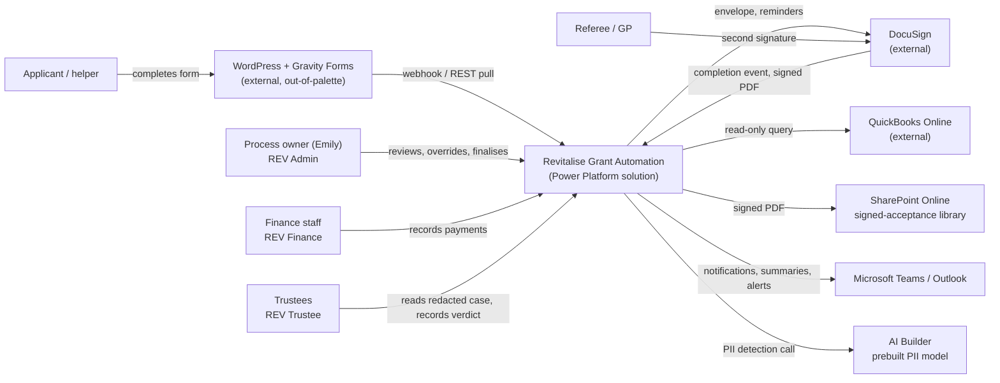
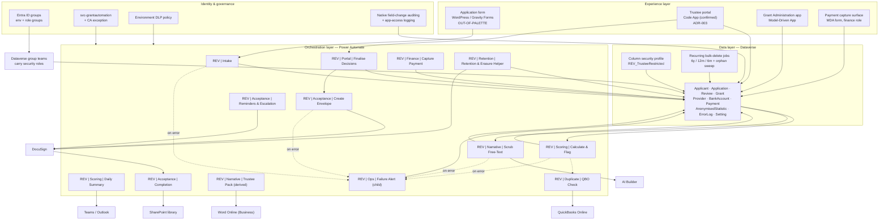
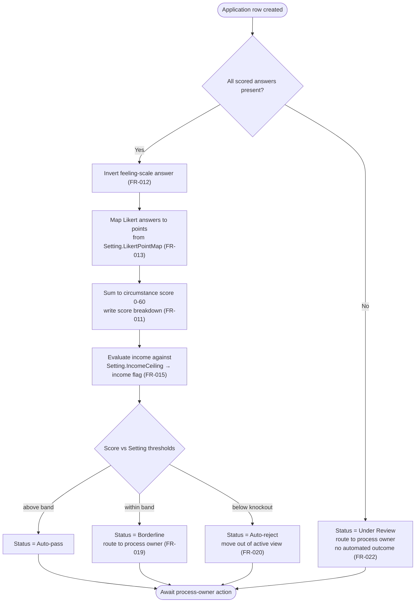
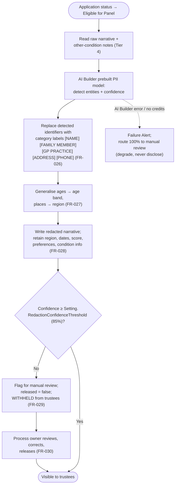

# Technical Architecture Document — Revitalise Grant Application Automation

**Feature Slug:** revitalise-grant-automation
**SDD Reference:** docs/plans/revitalise-grant-automation-plan.md (APPROVED 2026-08-10)
**Date:** 2026-08-10
**Status:** APPROVED — **rev 13 approved 2026-09-27** (Xander Lykopoulos), correcting rev 12's `ADR-053` point 3 (`IMP-0934`). Revisions 9 and 10 were returned for revision and are superseded by rev 11; rev 11 is superseded by rev 12; rev 12 is corrected, not superseded, by rev 13 — same two ADRs, same WBS tasks. See the rev 9, 10, 11, 12 and 13 entries below. **Rev 14 (2026-10-02: `ADR-011` re-decided, §5 Dataverse write-shape rule) is presented for review and not yet approved.** **Rev 15 (2026-10-02: Create Envelope split into draft / fill / send, `ADR-067`; referee signing bound to the named person, `ADR-068`) is presented for review separately from rev 14 and not yet approved.** **Rev 16 (2026-10-05: §5.8 rewritten to the Create Envelope design the 3–4 October DEV hotfixes settled, `ADR-069`; the referee's name and address columns, `ADR-070`, superseding `ADR-043`) was **approved 2026-10-05** (Xander Lykopoulos, verbatim *"Approved for development"*, logged in `logs/routing.log`); the approval amendment below records his answers.**
**Revision:** rev 1 — 2026-08-10. Reviewer decisions applied to ADR-003 (Code App confirmed), ADR-006
(three environments: DEV, TST/ACC, PRD), §6.1 (group-team pattern confirmed), §6.5 (audit retention
confirmed at 6 years), role-membership review cadence (confirmed at 6 months), and §4.2 (SAR mechanism
reframed as a proposal and carried forward as an accepted open item).
**Revision:** rev 2 — 2026-08-12. **ADR-007 closed to Power Platform Pipelines** by explicit reviewer
decision, superseding this TAD's own recommendation of pac CLI + GitHub Actions; §9.2 rewritten as the
GitHub-Actions/Pipelines responsibility boundary; **ADR-021 added**, resolving C-TECH-044 to a GitHub OIDC
federated credential with **one deploy identity per environment** (three app registrations, one federated
credential each); §6.7 and the §6 security table corrected (the deploy registrations are required either
way); **§12 gains four tenant prerequisites** — a custom pipelines host, pipeline/stage configuration,
Managed Environment status on TST/ACC and PRD (a licence cost), and pipelines access assignment. §9.1 and
ADR-006 are unaffected: the topology is unchanged and there are still two promotion hops.
**Revision:** rev 3 — 2026-08-27. **SDD Amendment A-05** (`wbs:6.3`). §3.1 gains the **five new
`…redacted` counterpart columns** on `rev_application` (delta TAD `ADR-031`) and explicit rows for the
financial-eligibility, benefit/employment and helper-context columns FR-035 now surfaces. §7's **NFR-001
row is corrected** — it named the two condition profiles as members of `REV_TrusteeRestricted` and they
are not, and never were (A-05 Finding 3; verified live in DEV 2026-08-27). §7's **NFR-003 row is
strengthened** by `ADR-032`: the trustee portal never selects a secured column at all, so FR-078's
restricted state is rendered rather than queried. **No column's classification, `IsSecured` value or
profile membership changes in this revision** — the five new columns are additions, and the two
corrections describe what was already true. The full design is in the delta TAD,
`docs/architecture/trustee-portal-visual-refresh-architecture.md` **Revision 3**, §3.2.2 and §3.2.3.
**Revision:** rev 4 — 2026-09-06. **CO-002 scope decision** (`wbs:3.2`, no new WBS task): the four
DocuSign Grant Referee (Signer 2) anchor tabs Title/Address/Town-City/Postcode are **not** modelled
in Dataverse — `rev_application` gains no `referee_*` columns, no referee entity is created, and
automation #1's intake form gains no referee-facing step. §5.8–5.10 and **ADR-043** record the
decision and its basis. No column's classification or the data model in §3.1 changes.
**Revision:** rev 5 — 2026-09-09. **§3.5 conflict 2 RESOLVED — the payment capture form is
authorised** (`wbs:8.3`), by reviewer approval of `docs/plans/revitalise-payment-capture-plan.md`
(FR-150–FR-154, NFR-150, US-030). The **form** half of Automation #8 now has requirements behind
it; the **`REV | Finance | Capture Payment` flow** does not, and stays unauthorised and unbuilt —
§3.5 and §5.11 state the split. §3.1's `rev_bankaccount` and `rev_payment` blocks gain the
**lookup-name-projection** consequence of `C-TECH-070`(3) and the previously omitted column
`rev_payment.rev_paymentstatus`. §6.1's **Finance persona App Access changes to a separate
model-driven app** (`ADR-044`); §6.2's Finance role row gains the **Grant and Provider privileges
FR-150/FR-151 require and the approved row omitted**. §9 and §12 gain the new app module and its
two per-environment configuration rows. **`ADR-044`–`ADR-047` added.** **No column is added,
altered or reclassified, no `IsSecured` value changes and no profile membership changes in this
revision** — the surface binds columns WBS 8.1 already delivered. Acceptance of `wbs:8.3` is
gated on `wbs:8.2` (the Finance security role, which does not exist) — see `ADR-047` and §6.2.1.
**Revision:** rev 6 — 2026-09-09. **Reviewer decisions on the rev-5 gate applied.** (1) **`ADR-044`
is REJECTED by the reviewer** — the finance surface is **not** a separate app; it is an area inside
the existing `REV Grant Administration` model-driven app, which is what §6.1's approved App Access
cell always said. `ADR-044` is retained with `Status: Rejected` and superseded by **`ADR-048`**,
which records the area design and the defence-in-depth this choice gives up. §6.1's cell is
**restored**; §9.4, §12.1, §12.2 and Appendix A are re-derived from the area design, not
patched. (2) **§6.2's two Finance-role privilege corrections are CONFIRMED** by the reviewer
(Provider: add Create; Grant: add Read + AppendTo) — §6.2 and §6.2.1 items 2 and 3 are unchanged in
content and now read *confirmed* rather than *flagged for confirmation*. (3) **The
`REV | Finance | Capture Payment` flow is OPEN, DEFERRED BY REVIEWER DECISION** — not authorised,
not descoped, not resolved; §3.5 conflict 2, §5.11 and risk **A-R56** carry it in that state and no
task is opened for it. **`wbs:8.3`'s evidence rule in `contract/evidence-map.json` is now wrong**:
it names a separate app directory that this revision has decided will never exist. The corrected
rule is specified in §9.4 for `pm-agent`, which owns that file. **No column is added, altered or
reclassified, no `IsSecured` value changes and no profile membership changes in this revision.**
**Revision:** rev 7 — 2026-09-10. **`ADR-046` corrected against what shipped, and SDD OQ-151
resolved as far as architecture may resolve it** (`wbs:8.3`; test report **D-02**, TC-07/TC-08).
(1) **`ADR-046`'s Decision named two interventions and its own Consequences named one.** The
shipped Bank Account form carries one — the column `<Description>` — so the Decision is amended to
one and the *"labelled instruction beside the control"* half is **struck, not deferred**: it never
shipped, it has no ground-truthed shape in this solution (no shipped form here contains a
label-only cell or a WebResource control), and it would add nothing the description does not.
(2) **`ADR-046a` is added**, stating the FR-154 naming convention for **both** payee types — the
provider case the shipped description already illustrated, and the **applicant reimbursement** case
it was silent on, which is the only case FR-154 exists for. The applicant convention is the **grant
reference**, derived from `ADR-013`'s existing pseudonymous reference rather than invented. It
carries a description-only build specification for `development-agent`. (3) **SDD OQ-151 is
re-scoped and re-dated, not silently answered**: its architectural half is closed by `ADR-046a`; the
business half narrows to *confirm-or-replace* and moves from the unmeetable *"before build"* to
**before `wbs:8.2` deploys** — the date the exposure actually becomes live. (4) **A new §12.2 row
names a contract this ADR had been assuming**: whether Unified Interface renders a
column description as visible help text or only as a hover tooltip. As a tooltip, FR-154's shipped
control is effectively nothing, and that is now stated rather than implied. **No column is added,
altered or reclassified, no `IsSecured` value changes and no profile membership changes in this
revision** — the one source change specified is a `<Description>` edit.

**Revision:** rev 8 — 2026-09-10. **Reviewer confirmed `ADR-046a`'s applicant-reimbursement nickname
convention as proposed.** The business half of SDD OQ-151 that rev 7 re-scoped to *confirm-or-replace*
is answered: the convention ships as designed — `REV-2026-001 - reimbursement` (the grant reference,
per `ADR-013`), no replacement. `ADR-046a`'s Status line and Consequences are updated from *pending
confirmation* to *reviewer-confirmed*, and **SDD OQ-151 is closed**, not merely re-scoped: Appendix A's
traceability row now records the confirmation and its date rather than an open due date. No source,
schema or build specification changes — `ADR-046a`'s build specification for `development-agent`
already matched what is now confirmed.

**Revision:** rev 9 — 2026-09-25. **The intake contract changes to the website's own payload**
(`wbs:4.1,4.2,4.3`). The website developer supplied the first real submission payload,
`docs/Import/2026-09-25-website-intake-payload-sample.json`, sanitised on intake. It is a native
Gravity Forms entry, and it matches none of the contract the intake flow was built to. That contract
was derived from an Excel export because no real payload existed at the time. The reviewer's
instruction is that **the flow accepts this payload as sent**. So: (1) **`ADR-051` added** — the flow
accepts the native entry and does all translation itself, in one normalisation step plus
configuration-held label maps. (2) **Appendix C added** — the field-by-field map, every payload key to
a column or explicitly unmapped. It is the `wbs:4.2` field-mapping deliverable and supersedes the
payload-contract half of the form-validation spec (§8 there). (3) §4, §5.1 and §12 amended.
(4) **`ADR-011` re-checked and still open.** The payload shows the channel choice is no longer
invisible downstream. (5) §11 gains risks **A-R62–A-R67**, and §12.3 is new (the intake contract
verification plan). **No column is added or reclassified, no `IsSecured` value changes and no
profile membership changes.** One schema change is specified: `rev_applicant.rev_dateofbirth` and
`rev_email` move from ApplicationRequired to None, because the only thing that writes them can never
supply the first and supplies the second only conditionally (`ADR-051` item 9).

**Revision:** rev 10 — 2026-09-25. **Reviewer feedback on rev 9 applied** (`wbs:4.1,4.2,4.3`).
(1) **The reviewer answered "yes" to all four rev 9 decisions**: accept the native payload, drop the
two requirement levels, secure run history, and send Alex the questions. `ADR-051` items 7 and 9
now read *confirmed*. (2) **`ADR-011` is DECIDED: Entra client credentials**, on the reviewer's
statement *"I have shared the url, clientid and secret with Alex"*. The decision block records the
statement, the consequences (a client secret now held in WordPress; per-environment verification of
the trigger setting and the client-id check) and the remaining questions for Alex. (3) **The website
developer's covering note is intaked**
(`docs/Import/2026-09-25-alex-intake-payload-covering-note.md`) and cited from `ADR-051` and
Appendix C. (4) **The reviewer's transfer rule is applied** — *"Keep all data that is actively
requested from the user … Only transfer what is actually filled in by the user of the form"*. It
becomes `ADR-051` item 12. Every applicant-entered answer is stored, and **seven new columns plus one
new global option set** are specified in §3.1 and Appendix C §C.8, where there was no column. Two
further columns are specified *conditionally*. Everything the form or plugin generates is not
transferred, with the entry `id` as the single exception. `rev_privacynoticeacceptedon` stops
receiving a date nobody entered. The applicant-typed-total comparison is withdrawn: the total is
form-calculated. (5) **Not-answered is shape-tolerant** (`ADR-051` item 11): an absent key, null,
`""`, `[]` and a false on an unseen question all mean *nothing written*, whatever Alex decides to
send. Key-drift detection is re-scoped to questions every applicant sees, so an omitted conditional
key is never reported as drift. (6) **`CASCADE: SPEC_GAP`** is emitted for the requirement text the
new columns and the transfer rule need (Appendix C §C.9). No FR text is invented here. The new
columns are deferred under `TD-010`/`TD-011` in `contract/tad-deferrals.json` until they are built. *(Rev 17: `TD-011` and its two columns were removed.)*
(7) The rework of `wbs:4.2`/`4.3` is **contracted work, not a change order** (reviewer,
2026-09-25), and `IntakeContract.Tests.ps1` is **rewritten against Appendix C, not patched**
(reviewer, 2026-09-25).

**Revision:** rev 11 — 2026-09-25. **SDD Amendment A-08 applied** (APPROVED 2026-09-25; FR-083–FR-093,
OQ-051–OQ-053; `wbs:4.1,4.2,4.3`). Rev 10's SPEC_GAP is resolved by it. (1) **OQ-051 — `ADR-052`
added:**
- The two Equality Act Yes/No answers are **released to trustees as values**
  (`IsSecured=0`, a `secured: exception` register row under C-DOM-031, and an NFR-031 necessity
  record), beside `rev_conditionprofile`.
- The two disability descriptions **stay secured** and gain **two redacted counterparts**
  (`rev_disabilityimpactdescriptionredacted`, `rev_supportrecipientdisabilityimpactdescriptionredacted`)
  on the ADR-027 narrative pattern. Automation #5 writes them, and until it does they render
  withheld (FR-035, FR-079).
- The §3.1 trustee-visible count rises from 37 to 41, and `TD-010` gains the two counterparts.

(2) **OQ-052 — consent dates hold the receipt time.** Rev 10's interpretation question is closed.
(3) **OQ-053 — middle name, suffix and state/province are not built** until Alex confirms the form
shows them. *(Rev 17: the middle name and suffix half is closed, the columns are removed and `TD-011` is deleted.)*
(4) Appendix A traces FR-083–FR-093.

**No other column, flow mechanism or decision changes from rev 10.**

**Revision:** rev 12 — 2026-09-27. **Reviewer feedback on the Revision 1 gate applied** (`wbs:4.2,4.3`;
Test Report `20260927-1` D-03, O-1). Two decisions, both the reviewer's, verbatim in the gate that
requested this revision. **(1) Widen, don't truncate.** development-agent's truncate-to-MaxLength-plus-note
fix for D-03 is **superseded, not kept as a backstop** — a truncation note is not itself seen by the
grant administrator, so a silent cut is worse than a wide column. `ADR-053` added: every applicant-entered
text/multiline column on `rev_application` and `rev_applicant` is classified as **structured** (stays a
String column, unchanged) or **free-text** (becomes/stays a Memo column, `MaxLength` raised to the
platform ceiling), never blanket-widened to 4,000, because Dataverse's SQL-Server-backed 8,060-byte
per-row ceiling makes that literally unbuildable on both tables (§12.2, `C-TECH-051`; the arithmetic is in
`ADR-053`). Appendix C §C.10 is the per-column map. Eleven `rev_application` columns change **Type**
(String → Memo) as a result — Dataverse has no in-place String↔Memo conversion (confirmed against
Microsoft's own column-editing documentation, and against this project's own `rev_helperrelationship`/
`rev_exceptionalcircumstance` precedent, Dev Summary 2026-08-16) — so each is a source-level Type/Format/
`MaxLength` edit plus a `FormXml` control `classid` swap, listed in §C.10. **No `rev_applicant` column
changes** — every applicant-entered column there is structured (name, contact, address parts) and stays
String at its current width; §C.10 states why. **(2) Preserve on omission, update path only.**
`ADR-054` added, amending FR-083/`ADR-051` item 11: on `Refresh_existing_applicant`, a column the new
submission does not answer keeps its stored value instead of being overwritten with null (Test Report
O-1). This applies **only** to the `rev_applicant` columns that action writes — `rev_application` is
created once per submission and has nothing to preserve, so **create is unaffected**. The named limitation:
a deliberately blank re-answer is indistinguishable from *not answered* in this payload shape, and no
sentinel is invented for it without reviewer sign-off. **No column is added or reclassified for
classification/security purposes, and no new `IsSecured` value** — this revision changes column `Type`
and `MaxLength` only, plus the update-path write rule.
**Revision:** rev 13 — 2026-09-27. **ARCH_GAP raised by development-agent against rev 12** (`IMP-0934`,
blocker) **closed.** Four corrections, all inside `ADR-053`/`ADR-054`; no new ADR, no new column, no
`IsSecured` change beyond what rev 12 already stated.

1. **`ADR-053` point 3 picks a mechanism instead of asserting one.** Rev 12 said the eleven retypes ship
   "under Dataverse's own solution-import mechanics." This project's own 2026-08-16 precedent (Dev
   Summary, [Deployment, 2026-08-16](../development/revitalise-grant-automation-dev-summary.md#L4425))
   measured the opposite: import rejects the type change outright (`"Attribute rev_helperrelationship is
   a Picklist, but a String type was specified."`), and the working path was five steps, one of them a
   live attribute **delete**, refused by the harness's own safety classifier until the reviewer
   authorised it explicitly. **Decision: the measured delete-and-recreate sequence, and only in DEV.**
   §12.4 now carries the eight-step sequence, which environment it runs in and why, and which steps are
   reviewer-executed. `IMP-0934`'s three-route framing is resolved: additive new columns are rejected
   (it would strand the eleven old ones and every reader of them, for no benefit this schema doesn't
   already get for free); narrower String-width increases are rejected (four of the eleven already
   exceed a 4,000-character String ceiling in practice — `rev_helpername`'s five-part join and
   `rev_provisionaldate`'s free-text phrase are unbounded by construction, not merely long — so a String
   ceiling does not solve the crash D-03 found).
2. **The five secured columns' field permissions and audit history are traced, not assumed unaffected.**
   §12.4 states explicitly that `IsSecured`/`FieldSecurityProfiles.xml` membership is keyed on
   `LogicalName`, survives the delete-and-recreate because the profile's `RootComponent` and the
   attribute's own `IsSecured` flag are re-applied by the same `Entity.xml`/`FieldSecurityProfiles.xml`
   pack that recreates the attribute, and is verified live, per column, before the final import — and
   that each column's **audit history is not preserved**: a deleted attribute's audit trail is deleted
   with it, and the recreated attribute starts a fresh one. Consequence 4, below, states this.
3. **Appendix C §C.10 gains `rev_helperemail` and `rev_helperphone`.** Both are applicant-entered,
   written by this intake flow (Appendix C §C.6), structured and short (`MaxLength` 100 and 25, `Format`
   `email`/`phone`) — the same shape as `rev_applicant.rev_email`/`rev_phone` — and D-03 named neither.
   They stay String, unchanged, exactly as `ADR-053` point 1 already reasons for `rev_applicant`'s
   contact columns; C.10's structured list was scoped to `rev_applicant` only and silently dropped the
   two `rev_application` structured columns this flow also writes. No other applicant-entered
   `rev_application` text column is missing: `rev_supportrecipientname` and every referee/emergency-
   contact column are never written by this flow (grepped, zero hits — `rev_supportrecipientname` is
   "never asked", §C.6; referee/emergency-contact are DERIVED elsewhere, §3.1), so `ADR-053` correctly
   does not classify them.
4. **`ADR-053` point 4 gains a length guard for the columns that stay String.** Removing all truncation
   was right for the columns this ADR makes Memo — nothing plausible can overflow 1,048,576 — but it was
   never right for the ones that *stay* String at a few hundred characters or fewer, and point 4's
   original wording removed the guard from those too. An over-length answer on `rev_postcode` (10),
   `rev_helperphone` (25) or any other structured column returns to D-03's own failure: `Create_application`
   fails the write and the whole submission is lost, unannounced. **Decision:** `Normalise_payload`'s
   `TEXT` rule (Appendix C §C.2) gains one more case, for the closed list of columns `ADR-053` point 1
   classifies as structured only: if the trimmed value exceeds that column's literal `MaxLength`, the
   result is null and a note is added to `rev_intakereviewnote` naming the field and the limit — the same
   shape item 10 already uses for an unparseable number, not a truncation of the answer to fit. This is
   narrower than development-agent's superseded truncate-and-note fix in exactly the way rev 12 already
   required: it cannot fire on a free-text column, because every column that could plausibly hold an
   unbounded answer is Memo after this ADR.
5. **`ADR-054`'s coalesce is narrowed to the raw answer, not the derived output.** Rev 12's
   `coalesce(<this submission's normalised answer>, <the existing stored value>)` reads correctly for the
   nine columns `Refresh_existing_applicant` writes straight through from `Normalise_payload`
   (`rev_phone`, `rev_addressline`, `rev_addressline2`, `rev_towncity`, `rev_postcode`), but five of the
   fourteen written columns are not the normalised answer itself — they are the *output of a further
   derivation step* fed by one or more normalised answers (`rev_title`, `rev_applicanttype`, `rev_gender`,
   `rev_ethnicgroup`, `rev_agerange`, `rev_preferredcontactmethod` via the label-map/`Derive_<field>`
   shape, `ADR-051` item 3; `rev_localauthority`, `rev_localauthoritystatus`, `rev_locationarea`,
   `rev_derivedcity` via the postcode-lookup shape, [flow JSON L1126](../../src/solutions/RevitaliseGrantAutomation/Workflows/REVIntakeWordPressToDataverse-8F1C2A44-1001-4B7A-9E21-0A1B2C3D4E01.json#L1126)).
   For those, `Derive_<field>` returns null on **two different facts** the reviewer's literal coalesce
   cannot tell apart: the input was **not answered this time** (item 11's own definition — key absent,
   `null`, `""`, `[]`), or the input **was answered and the derivation could not resolve it**
   (`ADR-024`'s "leave the column empty and flag" case — an unmatched choice label, or, for the postcode
   pair, a register lookup that returns `Not Known`/`Multi-Authority`, [`Derive_local_authority_status`
   L1170](../../src/solutions/RevitaliseGrantAutomation/Workflows/REVIntakeWordPressToDataverse-8F1C2A44-1001-4B7A-9E21-0A1B2C3D4E01.json#L1170)). Coalescing on the derived output collapses both into
   "preserve the old value," which is right for the first fact and wrong for the second: a genuinely new
   postcode this submission pairs with a stale local authority the applicant's new address does not
   have, and a genuinely re-answered (but unmatched) title or contact preference silently keeps the old
   one instead of surfacing the mismatch `ADR-024` exists to surface. **Decision: for these five
   columns, the coalesce condition is `empty(coalesce(outputs('Normalise_payload')?['<source key>'], ''))`
   — the same raw-input null test item 11 already defines — not `empty(outputs('Derive_<field>'))`.**
   When the raw input is not answered this time, the stored value is kept (postcode's own derived
   columns keep their existing pairing, matching `ADR-001`'s "frozen at intake" language). When the raw
   input is answered but unresolved, the freshly derived value — including a null one — is written,
   exactly as `Create_application` already behaves on the create path, so update and create diverge only
   in what happens on genuine silence, which is the one thing `ADR-054` was written to fix.
   `rev_preferredcontactmethod` is fed by three raw keys (contact-method preferences); "not answered this
   time" for it means all three are, since any one of them being answered is the applicant re-stating
   this preference. The match-key columns are unaffected, as rev 12 already states.

**Consequences, added to `ADR-053`'s existing list (in Decision order, continuing from item 5):**
6. *Negative* — a delete-and-recreate is destructive and, unlike every other change in this ADR, cannot
   be undone by re-importing; DEV's existing data in these eleven columns is real, in the sense that it
   is whatever the deployed tests have written, so §12.4's export-before-delete step is not cosmetic.
7. *Negative* — the five secured columns' audit history for these attributes does not survive; only
   DEV holds any today, and DEV's Article 9 columns are exempt from the six-year audit-retention
   commitment (§6.5) precisely because DEV never holds real applicant data (C-TECH-007) — so this is a
   one-time, DEV-only, already-priced-in cost, not a recurring one.
8. *Positive* — TST/ACC and PRD never see this cost: neither has ever received any import of this
   solution (§9, deployment status), so their first import creates all eleven attributes as Memo
   directly, by ordinary `CREATE` semantics, with no live String value to conflict with and no delete
   involved.
9. *Positive* — the length guard added to point 4 closes the one path by which D-03's crash could recur
   after this ADR ships, for the columns this ADR deliberately leaves narrow.
10. *Positive* — `ADR-054`'s narrowed coalesce (item 5 above) means a returning applicant's genuinely
    new postcode or re-stated choice answer is never paired with a stale derived value on the update
    path; a re-answer that the derivation cannot resolve now surfaces the same way it already does on
    create, via `ADR-024`'s empty-column-plus-note pattern, instead of silently reading as "no change."

**Gate interactions, added to `ADR-053`'s existing table:**

| Gate | Interaction |
|---|---|
| `IntakeContract.Tests.ps1` | Gains one assertion per structured column in the new length-guard list: an over-length answer produces a null column and the note, not a write failure. Also gains O-1's regression test's counterpart: a second submission with a genuinely new, unmatched choice label or an unresolvable postcode must **not** read as "no change" |
| `verify-field-security-coverage.py` | Re-run after the DEV recreation, per §12.4 — asserts the five secured columns are still members of `REV_TrusteeRestricted` post-recreation, before the final import |
| `flow-definition-language` check 3 (nested `item` on `UpdateRecord`) | Not tripped — the narrowed coalesce is still one scalar expression per flat `item/<column>` key (`if(empty(...), stored, derived)` in place of `coalesce(derived, stored)`); no key becomes a nested object |
| `no-hardcoded-environment-values` | Unaffected — the DEV-only scoping of the delete-and-recreate sequence is stated in §12.4 as a procedure, not as an environment value in source |

**Revision:** rev 14 — 2026-10-02. **Reviewer decision on the intake endpoint's trust, and one design rule
from `IMP-1010`** (`wbs:4.2,4.3`, warranty-class rework). No new column, no `IsSecured` change, no new flow.

1. **`ADR-011` is re-decided: the trigger accepts *Anyone* holding the signed callback URL, plus the
   `x-rev-client-id` header check.** The rev 10 Entra client-credentials route is superseded. The basis is the
   reviewer's statement of 2026-10-02, quoted in `ADR-011`. The reason: Gravity Forms webhooks send only fixed
   header values, so an Entra token that expires within the hour cannot be refreshed. `ADR-011` states the
   residual risk, the effect on `NFR-008`, and what changes downstream. §6, §7 (`NFR-008`), §11 (`A-R68`
   superseded; `A-R71`–`A-R73` added), §12 (two rows superseded, one added) and §12.3 (`A-INT-11`–`A-INT-15`)
   are amended to match.
2. **The intake trigger's secure outputs stay on, as source declares.** A designer save removed them in DEV; the
   next import is expected to restore them. Recorded in `ADR-011`.
3. **New design rule in §5: every Dataverse create or update action writes its columns as flat `item/<column>`
   parameters, never as a nested `item` object.** A designer save drops the nested form. Three actions need
   converting: the intake flow's `Create_application` and `Create_new_applicant`, and the Ops Failure Alert
   flow's `Write_error_log_row`.

**Revision:** rev 15 — 2026-10-02. **`REV | Acceptance | Create Envelope` redesigned, and the referee's
signature bound to the referee** (`wbs:3.1,3.2,3.5`; recipient authentication is a `commercial-agent`
decision, see `ADR-068` item 4). Raised by the reviewer (single-call `SendEnvelope` no longer accepts tabs)
and by Emily Sheardown's test feedback of 2026-10-02 (mandatory fields could be left empty; a forwarded
referee email could be signed by someone else and was recorded as the referee). No new column, no
`IsSecured` change, no new connector, no new connection reference.

1. **`ADR-067` added: the envelope is created as a draft, filled, then sent** — three DocuSign steps instead
   of one, with each tab addressed by the recipient's DocuSign id and the tab's label, both read back from
   the draft rather than assumed. §5.8–5.10 rewritten to the new action sequence.
2. **`ADR-068` added: four controls so only the named referee can sign.** (1) Mandatory fields are set on the
   **template**, which is the only place the connector can set them. (2) "Assign to someone else" is
   switched off. (3) Each signer gets their own email subject and message. (4) **Decided by the reviewer
   the same day:** the referee must enter an access code, the last six digits of the referee's phone number,
   before the document opens.
3. **`ADR-043` gains a rev 15 note**: the referee-entered tabs it leaves blank must be *required* on the template.
4. §4 (DocuSign row), §11 (`A-R74`–`A-R79`) and §12 (one row amended, two added; new §12.5 verification plan)
   amended to match. New open platform-contract markers `A-DS-14`–`A-DS-18`.
5. **Amended the same day, after the reviewer's throwaway DEV flow `TEST_Docusign`** (evidence only — the reviewer states it is not the intended design) (read-only by
   lead-agent, 2026-10-02). Its designer-written definition is the first E1 for three DocuSign operations.
   `ADR-067`'s ground truth, its Decision step 1, §5.8–5.10 step 3 and §12.5 are reconciled with it. The
   rest of rev 15, `ADR-068` included, is unchanged.
6. **Revised again the same day, after the reviewer's designer check** (*"create envelope from template with
   recipients and tabs" can create the envelope and the recipients' tabs, but not the prefill tabs and not a
   custom email*). `ADR-067` now carries the definitive action list D1–D10: `SendEnvelopeWithRecipientFields`
   creates the draft with recipient tabs; prefill tabs, per-signer email, authentication and reminders are set
   on the draft; `SendDraftEnvelope` sends. Reminders move before the send. §5.8–5.10 and §12.5 (T2–T4) are
   rewritten to match.
7. **Revised a third time, the same day, to the reviewer's `TEST_Docusign` v2c and three decisions.** The create is
   `CompositeTemplates` (`status: Created`). Each signer is bound by `UpdateEnvelopeRecipient`. Tabs are read once
   and written as one array through `UpdateEnvelopePrefillTabs` (**option A**, the reviewer's choice), with
   **option B** (prefill array + one `UpdateRecipientTabsValues` array per signer) as the measured fallback. The
   D1–D10 list is superseded by C1–C10. Rev 15's *"one tab per call"* for `UpdateRecipientTabsValues` is corrected:
   it takes an array per signer (E1). **`ADR-068` item 4 becomes an access code** (the last six digits of the
   referee's phone, free per the reviewer), and it sits within `wbs:3.2`/`3.5` — no change order. §5.8–5.10,
   §11 (`A-R76`, `A-R78`, `A-R79`), §12 and §12.5 are amended.

**Revision:** rev 16 — 2026-10-05. **`REV | Acceptance | Create Envelope` brought back in line with the flow the
reviewer ran** (`wbs:3.2`; raised by `IMP-1043`; the reviewer's instruction was *"Yes architect agent should update the
design"*). Between 3 Oct 18:51 and 4 Oct 07:25 the reviewer fixed the flow in DEV by hotfix imports with the gates
overridden ([pipeline log L299–L316](logs/pipeline.log#L299)); this TAD kept describing the rev 15 design, and 35 contract
tests asserted it. No new connector or connection reference. **One column set is new (item 2).**

1. **§5.8 rewritten and `ADR-069` added.** The rev 15 action list is replaced by the 70-action chain the source has:
   three fill calls (prefill, applicant, referee) each with a one-shot spelling fallback, no routing order, an access
   code set before the referee is bound, a signer read-back, a conditional company fill, five stop conditions and a
   seven-case failure lookup. The tab-fill structure and the test fixture are specified exactly, so the 35 failing
   tests can be rewritten against them. Rev 15's option A (one array) is dropped as a design: it was never measured.
2. **`ADR-070` added, superseding `ADR-043`.** Eight secured columns on `rev_application` for the referee's name
   parts, title, job title, company, address, town and postcode. The reviewer created them in DEV on 3–4 Oct; **the
   reason is now recorded (approval amendment, below).** §3.1 gains the rows.
3. **Measured DocuSign facts recorded against `A-DS-16`** (§12.5): the two `tabType` spellings, a Company tab the signer
   sees empty, and a template-locked routing order answering `200` with `RECIPIENT_UPDATE_FAILED` (improvement review
   2026-09-30-2 row 43). Marker `A-DS-19` was added here and closed at approval (no signing order).
4. **`secureData` restored (D-2)**, with its inputs-only exceptions, in §5.8.
5. §4 (DocuSign row), §11 (`A-R74`, `A-R76` amended; `A-R80`, `A-R81` added) and §12.5 amended. `ADR-067`'s
   superseded rows are marked, not deleted.

**Rev 16 approval amendment, 2026-10-05** (`wbs:3.2`; the reviewer's answers recorded, not a new design pass):

- **`ADR-070` is `Accepted`.** Reviewer, verbatim: *"The referee columns are added to make the docusign envelope
  completely data driven. Instead of having empty fields in the docusign form. The grant admin will collect those items
  i am guessing. Something to discuss with Emily."* **Still open, not settled:** who collects the referee details (the
  reviewer guesses the grant admin). Owner: reviewer, to raise with Emily (client side).
- **There is no signing order.** Reviewer, verbatim: *"There is no signing order. The agreement gets send to both."*
  Both signers receive the agreement at the same time and no sequence is expected. `A-DS-19` is **closed as not
  applicable**, `A-R80` is **retired**, check `R7` is rewritten to confirm both are emailed together, and `ADR-069`
  item 3 and §5.8 are reworded. FR-041/FR-042 in the SDD still say *in sequence*; correcting them belongs to
  `plan-agent`, not to this document, and is raised in the gate output.
- **`CO-002`** is being reopened by `commercial-agent` in parallel. This document cites it and does not edit `contract/`.
- **The backfill is dropped** (reviewer: *"Yes drop the backfill"*). DEV holds test data only. Nothing in this
  document expects one: the eight columns are nullable and existing rows stay blank.
- **Still open, as recorded:** the referee-data DPIA and retention question (`A-R81`), and the applicant and referee
  names in the email text (the document's assumption stands).

**Rev 17 amendment, 2026-10-05** (`wbs:3.2` build blocked at HARD step `tad-coverage`; `TD-006` and `TD-007` lapsed
2026-10-03; a small amendment on the approved rev 16, not a new design pass). The reviewer's four rulings, verbatim:

- **`TD-006`:** *"TD006: we don't need this column"*. `rev_financialanswers` is **not needed**; FR-013's score inputs
  are `rev_wellbeinganswer1..10` and `rev_incomeband`. §3.1 drops the name and `TD-006` is deleted. (Source already
  replaced the column with eight typed financial columns, Dev Summary rev of 2026-08; nothing reads it.)
- **`TD-007`:** *"TD007: agreed, create a change order with commercial agent"*. The five duplicate-check columns
  **stay in §3.1**, unbuilt, pending `commercial-agent`'s change order (raised 2026-10-05). Built if approved; removed
  from §3.1 if declined. `TD-007` is re-dated to 2026-10-19 (two weeks). This document does not edit `contract/`.
- **`TD-008`:** *"TD008: these columns will be made with the narrative scrubbing flows"*. Confirms the existing
  reason (automation #5, `wbs:5.3`/`5.4`). Unchanged in §3.1; expiry 2026-11-27 stands.
- **`TD-011`:** *"TD011: there are no middle name and suffix fields on the form"*. **`ADR-011` remaining question 8 is
  closed for the Name sub-fields:** `rev_middlename` and `rev_namesuffix` are **removed from §3.1** and Appendix C
  §C.8, `name_middle` / `name_suffix` are not transferred, and `TD-011` is deleted. The State/Province and Country
  half of question 8 is unaffected: both stay NOT TRANSFERRED (§C.6), as already specified.

Sections changed: §3.1 (three rows), Appendix C §C.1/§C.8/§C.9 item 6, `ADR-011` question 8, and the `TD-011`
pointers in the rev 10 summary, §10 `ADR-051`/`ADR-052`, §12.4 and Appendix A. Nothing else moves.

---

> **Source:** adopted from `docs/Import/Revitalise-Solution-Architecture-v0.4.docx` on 2026-08-10 by architect-agent (intake mode).
> Original author: Xander Lykopoulos — Argelis Consultancy (v0.4 Draft for review, 14 July 2026, revised 15 July 2026).
> Read via a plain-text extraction of the same content. See Adoption Report in gate log.
>
> **Supporting source — authoritative for §6 Security Design and §6.1** (received 2026-08-10):
> - `docs/Import/Revitalise-Security-Model-v0.1.docx` — Security Model v0.1, 15 July 2026 (Draft, WBS 0.5).
>   This is the deliverable the Solution Architecture named but left to be written; §6 adopts it in preference
>   to the architecture's summary treatment wherever the two differ in detail.
>
> **Cited for context only** (not adopted as TAD content — see the user's scope decision recorded in the Adoption Report):
> - `docs/Import/Revitalise-ALM-Runbook-v0.1.docx` — cited in §9 for the promotion procedure and connection-reference / environment-variable inventory.
> - `docs/Import/Revitalise-Data-Governance-Framework-v0.2.docx` — cited in §3 for cascade-delete behaviour and the classification tiers, cross-checked against SDD §7.1/§7.6.
> - `docs/Import/Revitalise-DPIA-v0.1.docx`, `docs/Import/Revitalise-RoPA-v0.1.docx` — already adopted into SDD §7; cited in §11 only.
> - `docs/Import/Revitalise-Governance-Runbook-v0.1.docx` — day-2 operations; not TAD content.
>
> ⚠️ **Reader's note — three gates sit above this document.**
> 1. **DPO sign-off (SDD OQ-004/005/006)** gates build on the field-level-security basis this TAD adopts.
>    ADR-002 is `Adopted (conditional)` for that reason.
> 2. **WBS 0.3 — the service account `svc-grantautomation` and its scoped Conditional Access exception — is
>    outstanding with Wanstor** (SDD OQ-018). Every unattended automation in §5 depends on it. It is carried
>    forward as a blocking dependency in §12.
> 3. **Resolved at the architecture gate on 2026-08-10 (Xander Lykopoulos):** the trustee portal is a
>    **Code App** and Canvas App is descoped (ADR-003, now `Adopted`); the environment topology is
>    **three environments — DEV, TST/ACC, PRD** (ADR-006, now `Adopted`); the §6.1 group-team binding
>    pattern is confirmed as derived. Audit retention is confirmed at 6 years and the role-membership
>    review cadence at 6 months.
> 4. ~~**Two decisions remain open and are not blocking this gate:** the ALM tooling (ADR-007) and the
>    intake channel / endpoint-trust route (ADR-011).~~ → **ADR-007 IS NOW CLOSED (2026-08-12):
>    Power Platform Pipelines, by explicit reviewer decision, superseding this TAD's own recommendation
>    of pac CLI + GitHub Actions.** See §9.2 and ADR-007. It brings **two new tenant prerequisites**
>    (a custom pipelines host; Managed Environment status on TST/ACC and PRD, which carries a licence
>    cost) — both added to §12. **ADR-011 remains open.** → **DECIDED 2026-09-25 (rev 10): Entra client credentials, by reviewer statement — see ADR-011.** ADR-021 was added at the same time, resolving
>    C-TECH-044 to a GitHub OIDC federated credential with one deploy identity per environment.
> 5. **One accepted open item** carried forward to development-agent: no SAR extract mechanism is built or
>    agreed. §4.2 records a *proposed* approach only. Accepted as a known gap by the reviewer on
>    2026-08-10 (C-DOM-005, SOFT).
>
> ⚠️ **Knowledge-base gap.** `knowledge/domain/data-entities.md`, `knowledge/domain/compliance-requirements.md`,
> `knowledge/technology/stack-overview.md` (Publisher Convention), `platform.md`, `dataverse.md` (column-security
> profile table), `build-and-deploy.md`, `entra-id.md`, `sharepoint.md` and `teams.md` are unpopulated template
> placeholders in this repository. No project-specific technology decision was taken from them. The one exception
> is **`knowledge/technology/security-model.md`, which IS populated** — its Group Teams pattern and Canonical
> Persona Mapping are real platform decisions and §6.1 is built on them. Where a placeholder file left a gap,
> this TAD relies on the source documents plus general Power Platform practice and says so at the point of use.
> Carried forward from SDD OQ-029.

---

## 1. Architecture Overview

The solution automates the grant journey from application submission to trustee decision and signed
acceptance on the Microsoft 365 / Power Platform stack Revitalise already owns. It automates the **data
handling, not the decision-making**: scoring is automatic with the process owner's oversight and override,
and trustees make the funding decision.

**Dataverse is the system of record and the integration hub.** Applications land in Dataverse, every
automation reads from and writes to it, and external systems never talk to each other directly. One
document — the signed DocuSign PDF — lives outside Dataverse, in a SharePoint library, linked by URL from
the Grant record.

### 1.1 Architecture principles (adopted from source §2)

| Principle | What it means here |
|---|---|
| Low-code, no custom code | Power Automate cloud flows, Power Apps and Dataverse configuration only. No macros, no scripts on anyone's laptop. |
| Maintainable by non-developers | Thresholds, templates and mappings live in configuration — a Dataverse `Setting` table plus environment variables — so the process owner can adjust them without editing a flow (NFR-019). |
| Cloud-native and portable | Data lives in Dataverse. No local file dependency, no "single source of truth on one laptop". |
| AI only where it earns its place | AI Builder redacts only the free-text narratives a trustee must read. Structured identifiers are hidden by column security, not by AI. |
| Governed foundation first | Environments, DLP, service identity, the data model and its security roles, naming and ALM are established before any automation is built, so every later component inherits a controlled structure. |

### 1.2 Why this design — and what was rejected

| Chosen | Rejected alternative | Why |
|---|---|---|
| Dataverse as system of record | SharePoint lists (the v0.3 baseline) | Relational integrity, cascade delete, native status-aware bulk-delete retention, column-level security and native field-change auditing. SharePoint could not enforce the retention schedule or the trustee control. Cost: Dataverse is a premium data source, so per-user premium entitlements are needed (ADR-001). |
| Field-level (column) security for trustee anonymisation | Manual anonymisation by one person per board cycle | Removes 3–4 hours per cycle and removes the single-missed-name breach risk. It is a *stronger but different* control, so it is gated on DPO sign-off (ADR-002). |
| Native Dataverse bulk delete + cascade | Custom retention sweep flow; Purview Suite event-based retention | Native, status-aware, configured once, logged as a system job, no extra licence. A light helper flow covers only what the native job cannot reach (ADR-004, ADR-005). |
| **Code App** for the trustee portal | Canvas App (out-of-palette, **rejected**); Model-Driven App; Power BI report; static mail-merged Word pack | Live secured data, decision capture written back to the Review table, no Power BI Pro licence. **Application type confirmed as a Code App by the reviewer on 2026-08-10 — ADR-003.** |
| Single solution, DEV → PROD as managed | Editing in production | One version number describes the live system; rollback is re-importing the prior managed package (§9). |

### 1.3 Solution boundary

Everything inside the Microsoft 365 tenant ships in **one Power Platform solution**,
`RevitaliseGrantAutomation`, publisher prefix `rev`. Four systems sit outside that boundary and are reached
through connectors: the **WordPress / Gravity Forms website** (application intake), **DocuSign** (acceptance
signatures), **QuickBooks Online** (duplicate-grant checks), and **SharePoint Online** (the signed-PDF
library, inside the tenant but outside the Dataverse store).

> **Naming conventions are adopted from source §4 unchanged**: publisher prefix `rev`; solution
> `RevitaliseGrantAutomation`; environments `Revitalise – Grant Automation (DEV)` / `(PROD)`; flows
> `REV | <Automation> | <Action>`; tables singular PascalCase; connection references `rev-<Service>`;
> environment variables `rev_<Purpose>`; service account `svc-grantautomation@revitalise.org`.
> `knowledge/technology/stack-overview.md` → Publisher Convention is an unpopulated placeholder; it should be
> populated with `rev` / `RevitaliseGrantAutomation` so downstream agents derive schema names consistently.

---

## 2. Component Diagram

### 2.1 Context diagram (C4 L1)

```mermaid
graph LR
  APP["Applicant / helper"] -->|"completes form"| WP["WordPress + Gravity Forms<br/>(external, out-of-palette)"]
  WP -->|"webhook / REST pull"| SYS["Revitalise Grant Automation<br/>(Power Platform solution)"]
  EMILY["Process owner (Emily)<br/>REV Admin"] -->|"reviews, overrides, finalises"| SYS
  FIN["Finance staff<br/>REV Finance"] -->|"records payments"| SYS
  TRU["Trustees<br/>REV Trustee"] -->|"reads redacted case, records verdict"| SYS
  SYS -->|"envelope, reminders"| DS["DocuSign<br/>(external)"]
  DS -->|"completion event, signed PDF"| SYS
  SYS -->|"read-only query"| QBO["QuickBooks Online<br/>(external)"]
  SYS -->|"signed PDF"| SPO["SharePoint Online<br/>signed-acceptance library"]
  SYS -->|"notifications, summaries, alerts"| TEAMS["Microsoft Teams / Outlook"]
  SYS -->|"PII detection call"| AIB["AI Builder<br/>prebuilt PII model"]
  SIGN["Referee / GP"] -->|"second signature"| DS
```

### 2.2 Component diagram (C4 L2)

```mermaid
graph TB
  subgraph EXP["Experience layer"]
    FORM["Application form<br/>WordPress / Gravity Forms<br/>OUT-OF-PALETTE"]
    PORTAL["Trustee portal<br/>Code App (confirmed)<br/>ADR-003"]
    MDA["Grant Administration app<br/>Model-Driven App"]
    PAYFORM["Payment capture surface<br/>MDA form, finance role"]
  end
  subgraph ORCH["Orchestration layer — Power Automate"]
    F1["REV | Intake"]
    F2["REV | Scoring | Calculate & Flag"]
    F3["REV | Scoring | Daily Summary"]
    F4["REV | Duplicate | QBO Check"]
    F5["REV | Narrative | Scrub Free-Text"]
    F6["REV | Narrative | Trustee Pack (derived)"]
    F7["REV | Portal | Finalise Decisions"]
    F8["REV | Acceptance | Create Envelope"]
    F9["REV | Acceptance | Reminders & Escalation"]
    F10["REV | Acceptance | Completion"]
    F11["REV | Finance | Capture Payment"]
    F12["REV | Retention | Retention & Erasure Helper"]
    F13["REV | Ops | Failure Alert (child)"]
  end
  subgraph DATA["Data layer — Dataverse"]
    T["Applicant · Application · Review · Grant<br/>Provider · BankAccount · Payment<br/>AnonymisedStatistic · ErrorLog · Setting"]
    CSP["Column security profile<br/>REV_TrusteeRestricted"]
    BD["Recurring bulk-delete jobs<br/>6y / 12m / 6m + orphan sweep"]
  end
  subgraph GOV["Identity & governance"]
    ENTRA["Entra ID groups<br/>env + role groups"]
    SVC["svc-grantautomation<br/>+ CA exception"]
    DLP["Environment DLP policy"]
    AUD["Native field-change auditing<br/>+ app-access logging"]
  end

  FORM --> F1
  F1 --> T
  T --> F2 --> T
  F2 -.-> F4
  F3 --> TEAMS2["Teams / Outlook"]
  T --> F5 --> AIB2["AI Builder"]
  F5 --> T
  F6 --> WORD["Word Online (Business)"]
  PORTAL --> T
  MDA --> T
  PAYFORM --> T
  PORTAL --> F7 --> T
  F7 --> F8 --> DS2["DocuSign"]
  DS2 --> F10 --> SPO2["SharePoint library"]
  F9 --> DS2
  F11 --> T
  F4 --> QBO2["QuickBooks Online"]
  F12 --> T
  F12 --> DS2
  BD --> T
  CSP --> T
  F1 -.->|"on error"| F13
  F2 -.->|"on error"| F13
  F5 -.->|"on error"| F13
  F8 -.->|"on error"| F13
  F13 --> T
  ENTRA --> GT["Dataverse group teams<br/>carry security roles"]
  GT --> T
  SVC --> ORCH
  DLP --> ORCH
  AUD --> T
```

### 2.3 Sequence — happy path, submission to signed acceptance

```mermaid
sequenceDiagram
  participant A as Applicant
  participant W as WordPress form
  participant I as REV Intake flow
  participant D as Dataverse
  participant S as REV Scoring flow
  participant E as Process owner
  participant N as REV Narrative flow
  participant AI as AI Builder
  participant T as Trustee portal
  participant P as REV Finalise Decisions
  participant DS as DocuSign
  participant SP as SharePoint

  A->>W: Completes validated form (FR-001..FR-006)
  W->>I: Webhook POST (fallback: scheduled REST pull)
  I->>D: Create Application + Applicant, assign reference (FR-007, FR-008)
  I->>E: Teams notification, name + reference (FR-009)
  D-->>S: Row created trigger
  S->>D: Score 0-60, status, income flag (FR-011..FR-016)
  S->>E: Borderline routed for review (FR-019, FR-022)
  E->>D: Reviews / overrides, marks eligible for panel (FR-018)
  D-->>N: Row updated trigger
  N->>AI: Detect PII in free-text narrative
  AI-->>N: Entities + confidence
  N->>D: Write redacted narrative; flag if below threshold (FR-026..FR-029)
  E->>D: Reviews and releases flagged redactions (FR-030)
  T->>D: Trustee reads redacted case, column security filters identity (FR-034..FR-038)
  T->>D: Records Approve / Defer / Reject (FR-037)
  E->>P: "Finalise decisions"
  P->>D: Apply verdicts, create Grant rows, write anonymised snapshot (FR-040, FR-055)
  P->>DS: Create envelope, dual signature, both signers sent it at once, no order (FR-041)
  DS->>DS: Reminders day 3 and 7; escalate day 14 (FR-043, FR-044)
  DS-->>SP: Signed PDF stored, URL written to Grant (FR-045)
```

---

## 3. Data Model

Ten Dataverse tables (the source's seven personal/process tables, plus the Anonymised Statistic snapshot,
the Error Log, and the Setting configuration table), one SharePoint document library, and no other store.
Classification uses the four-tier scale in `skills/data-classification.md`, cross-referenced to the
UK GDPR tier used by SDD §7.1, the Security Model §3 and the Data Governance Framework §3 (all three agree).

### Entities

| Entity | Table | Purpose | UK GDPR tier (source) | Classification (`skills/data-classification.md`) | Retention (C-DOM-003) |
|---|---|---|---|---|---|
| Applicant | `rev_applicant` | The person, stored once; carries the pseudonymised ID | Special category + personal | **Tier 4 — Restricted** | Deleted with its last Application (derived orphan sweep — see §3.4) |
| Application | `rev_application` | The spine: one row per submission; folds support recipient, helper, group, referee, emergency contact | Special category + personal | **Tier 4 — Restricted** | 6 years from final payment (Grant Paid) / 12 months from decision (Rejected) / 6 months from last contact (Withdrawn, Incomplete) |
| Review | `rev_review` | One row per monthly panel attempt; trustee verdicts | Pseudonymised + staff identity | **Tier 3 — Confidential** | Cascade with Application |
| Grant | `rev_grant` | Created on success; folds acceptance and impact report; links the signed PDF | Personal + financial | **Tier 4 — Restricted** | Cascade with Application (6 years) |
| Provider | `rev_provider` | Reusable holiday providers | **Not classified in any source** | **Tier 2 — Internal (DERIVED — see §3.2)** | Reference data; retained while active, reviewed annually. No personal-data clock. |
| Bank Account | `rev_bankaccount` | Every account paid into, held once; finance role only | Personal — financial | **Tier 4 — Restricted** | Cascade with Applicant. Earlier purge after payment reconciliation is an open decision (§3.4) |
| Payment | `rev_payment` | Disbursements; the duplicate check matches these rows | Personal — financial | **Tier 4 — Restricted** | Cascade with Grant. The QuickBooks financial record is retained separately under the finance policy (FR-050) |
| Anonymised Statistic | `rev_anonymisedstatistic` | Non-personal outcome snapshot, no identifiers, never linked back | Anonymised — not personal data | **Tier 2 — Internal** | Indefinite (FR-055) |
| Error Log | `rev_errorlog` | Operational failure capture across all flows | Operational — non-personal | **Tier 2 — Internal** | 90 days (DERIVED — source says only "short operational retention") |
| Setting | `rev_setting` | Thresholds, Likert point map, redaction threshold, income ceiling — editable by the process owner | Non-personal configuration | **Tier 2 — Internal** | Indefinite; changes audited |
| Round Finance | `rev_roundfinance` | Trustee Portal Visual Refresh (delta TAD, ADR-028, WBS 6.9): one row per review round — the round's open/close calendar and its charity-level finance figures, entered by hand. No relationship to any other table; scopes no application visibility | Non-personal, no data subject | **Tier 2 — Internal** | Indefinite. Not personal data — out of scope of erasure (FR-051) and subject access (FR-053) |
| Round Statistics Request | `rev_roundstatisticsrequest` | Trustee Portal Visual Refresh (delta TAD Revision 5, ADR-038, section 3.9, WBS 6.9): one row, ever — the trustee's ask for a fresh round-statistics computation. Reduced to the ask from Revision 5: three columns (`rev_status`, `rev_resultjson`, `rev_computedon`) are unused and stay declared with superseding descriptions rather than deleted, see delta TAD section 3.9.2. No relationship to any other table | Non-personal, no data subject | **Tier 2 — Internal** | Indefinite. Not personal data — out of scope of erasure (FR-051) and subject access (FR-053) |
| Round Statistics Result | `rev_roundstatisticsresult` | Trustee Portal Visual Refresh (delta TAD Revision 5, ADR-038, section 3.9, WBS 6.9): one row, ever — the flow's answer to the round-statistics ask, split off `rev_roundstatisticsrequest` so a trustee's Write privilege on the ask can never reach the answer. No relationship to any other table | Non-personal, no data subject | **Tier 2 — Internal** | Indefinite. Not personal data — out of scope of erasure (FR-051) and subject access (FR-053) |
| Grant History *(conditional)* | `rev_granthistory` | QuickBooks cross-reference fallback only — see ADR-017 | Personal | **Tier 3 — Confidential** | 6 years, aligned to the QBO financial record |

### 3.1 Key attributes and the controls each carries

Only attributes that drive a control, a requirement or a relationship are listed. Every table additionally
carries the platform columns required by `knowledge/technology/dataverse.md`: `rev_name` (primary),
`createdon`, `createdby`, `modifiedon`, `modifiedby`, `statecode`, `statuscode`.

**`rev_applicant` — Tier 4**

| Attribute | Type | Classification | Control |
|---|---|---|---|
| `rev_name` | Autonumber `REV-A-00001` | Tier 2 | **Primary name column is the pseudonymised ID, never the person's name** (ADR-013) |
| `rev_fullname` | Text | Tier 4 | Column security: `REV_TrusteeRestricted` — Admin + Service only |
| `rev_email`, `rev_phone` | Text | Tier 4 | Column security — Admin + Service only |
| `rev_addressline`, `rev_postcode` | Text | Tier 4 | Column security — Admin + Service only |
| `rev_dateofbirth` | Date | Tier 4 | Column security — Admin + Service only |
| `rev_agerange` | Choice | Tier 3 | Derived from DOB at intake; trustee-visible (FR-027) |
| `rev_locationarea` | Choice | Tier 3 | Derived from postcode at intake; trustee-visible (FR-027) |
| `rev_ethnicgroup` | Choice | Tier 4 (Art. 9) | Column security. **Only if actually captured — SDD OQ-027 open** |
| `rev_lastcontactdate` | Date | Tier 2 | Drives the 6-month withdrawn/incomplete retention clock |

**`rev_application` — Tier 4**

| Attribute | Type | Classification | Control |
|---|---|---|---|
| `rev_name` | Autonumber, reference | Tier 2 | **Format conflict — see §3.5.** SDD FR-008 requires `REV-YYYY-NNN`; source §4 specifies `GA-2026-00001` |
| `rev_applicantid` | Lookup → Applicant | — | Parental, cascade delete |
| `rev_submittedon` | DateTime (UTC) | Tier 2 | FR-008 |
| `rev_status` | Choice | Tier 2 | Submitted · Auto-pass · Borderline · Auto-reject · Under Review · Eligible for Panel · Approved · Rejected · Withdrawn · Incomplete · Grant Paid. Drives every retention clock (FR-048) |
| `rev_circumstancescore` | Whole number 0–60 | Tier 3 | Written by the scoring flow only; trustee-visible (FR-011) |
| `rev_scorebreakdown` | Multiline text | Tier 3 | Trustee-visible; evidences the score (FR-035) |
| `rev_incomeflag` | Choice | Tier 3 | Separate from the circumstance score (FR-015) |
| `rev_statusoverridden`, `rev_overriddenby`, `rev_overriddenon`, `rev_overridereason` | Bool / Lookup / DateTime / Text | Tier 2 | Named human accountability for every outcome (FR-018) |
| `rev_wellbeinganswer1..n`, `rev_incomeband` | Choice / Text | Tier 3 | Trustee-visible; the only inputs to the score (FR-013, FR-016) |
| `rev_narrativeraw`, `rev_otherconditionraw` | Multiline text | **Tier 4 (Art. 9)** | Column security — **Admin + Service only. Never reaches a trustee** (FR-031, NFR-001) |
| `rev_narrativeredacted` | Multiline text | Tier 3 | Written by the narrative flow; trustee-visible (FR-026) |
| `rev_redactionconfidence` | Decimal | Tier 2 | Compared against the `Setting` threshold, initially 85% (FR-029, NFR-017) |
| `rev_redactionreviewrequired`, `rev_redactionreleased` | Bool | Tier 2 | Human-in-the-loop gate; trustee visibility requires `released = true` (FR-029, FR-030) |
| `rev_conditionprofile` | Multi-select choice | Tier 4 (Art. 9) | **Trustee-visible by design** — condition is relevant, identity is not (Security Model §5) |
| `rev_supportrecipientname`, `rev_helpername/email/phone`, `rev_refereename/email/phone`, `rev_emergencycontactname/phone` | Text | Tier 4 | Column security — Admin + Service only. Referee and emergency contact are **DERIVED** into the profile; the source names only helper and support-recipient identity. **Rev 12:** `rev_helpername` retypes String→Memo, `MaxLength` 1,048,576 — it joins five name parts and the join, not any one part, overflowed (`ADR-053`, Appendix C §C.10) |
| `rev_refereefirstname`, `rev_refereelastname`, `rev_refereetitle`, `rev_refereejobtitle`, `rev_refereecompany`, `rev_refereeaddress`, `rev_refereetowncity`, `rev_refereepostcode` | Text (`nvarchar` 100, 100, 50, 100, 100, 250, 100, 10) | Tier 4 | **Rev 16, `ADR-070` (supersedes `ADR-043`).** Column security — Admin + Service only, in `REV_TrusteeRestricted`. Entered by the process owner on the Application form; read only by Create Envelope to pre-fill the referee's DocuSign tabs. `wbs:3.2` |
| `rev_supportrecipientconditionprofile` | Multi-select choice | Tier 4 (Art. 9) | Trustee-visible, identity hidden (Security Model §5) |
| `rev_grouplinkage` | Text / Lookup | Tier 3 | Trustee-visible |
| `rev_breakstart`, `rev_breakend`, `rev_amountrequested`, `rev_costs` | Date / Currency | Tier 3 | Trustee-visible (FR-028, FR-034) |
| `rev_duplicateflag`, `rev_priorgrantref`, `rev_priorgrantdate`, `rev_priorgrantamount`, `rev_duplicatecheckedon` | Bool / Text / Date / Currency / DateTime | Tier 3 | FR-023, FR-024, FR-025. Visible to Finance on the record (US-015 AC-3). **Rev 17: not built; pending a change order (`commercial-agent`, raised 2026-10-05, `TD-007`). Built if approved; removed from this row if declined** |
| `rev_decisiondate` | Date | Tier 2 | Drives the 12-month rejected clock |
| `rev_eligibleforround`, `rev_reviewround` | Bool / Text | Tier 2 | Scopes trustee visibility to the current round (FR-038) |
| `rev_sourcesubmissionid` | Text, alternate key | Tier 2 | **Idempotency guard on intake** — a replayed webhook cannot create a second row (§5.1) |
| `rev_caresupportdescriptionredacted`, `rev_careprovidedexampleredacted`, `rev_othercareprovidedtyperedacted` | Multiline text | Tier 3 | **Trustee Portal Visual Refresh (delta TAD, ADR-027 amended, WBS 6.3).** Redacted counterparts of the three secured columns immediately below; trustee-visible once `rev_redactionreleased` is true. `IsSecured=0` — same class as `rev_narrativeredacted`. Written by `REV \| Narrative \| Scrub Free-Text` once extended (Automation #5, deferred); empty on every row until then |
| `rev_careprovidedexample`, `rev_caresupportdescription`, `rev_othercareprovidedtype` | Multiline text | **Tier 4** | Column security: `REV_TrusteeRestricted` — Admin + Service only. Unchanged by the redacted counterparts above — the source free text stays secured (ADR-027) |
| `rev_unabletofundexplanationredacted`, `rev_exceptionalfundingdetailredacted`, `rev_otherexceptionalcircumstanceredacted`, `rev_otherconditionredacted`, `rev_supportrecipientotherconditionredacted` | Multiline text | Tier 3 | **SDD Amendment A-05 / delta TAD ADR-031, `wbs:6.3`.** Redacted counterparts of the five secured free-text columns immediately below; trustee-visible once `rev_redactionreleased` is true (FR-079). `IsSecured=0` — same class as `rev_narrativeredacted`. Written by `REV \| Narrative \| Scrub Free-Text` once extended (Automation #5, deferred); empty on every row until then |
| `rev_unabletofundexplanation`, `rev_exceptionalfundingdetail`, `rev_otherexceptionalcircumstance`, `rev_supportrecipientotherconditionraw` | Multiline / text | **Tier 4** | Column security: `REV_TrusteeRestricted` — Admin + Service only, **verified live 2026-08-27**. Unchanged by the counterparts above; the source free text stays secured (ADR-031). `rev_otherconditionraw` carries the same control and is listed with `rev_narrativeraw` above. **Rev 12:** `rev_exceptionalfundingdetail` is `MaxLength` 1,048,576 (already Memo); `rev_otherexceptionalcircumstance` retypes String→Memo, same ceiling (`ADR-053`, Appendix C §C.10) |
| `rev_receivesbenefits`, `rev_benefitprovider`, `rev_employmentstatus` | Choice / Text | **Tier 4 (Art. 9)** | Column security: `REV_TrusteeRestricted` — Admin + Service only, verified live 2026-08-27. Named on the trustee detail screen by FR-035 (A-05) and rendered as a **restricted state**, never a value: the app selects none of them (FR-078, ADR-032). **Rev 12:** `rev_benefitprovider` retypes String→Memo, `MaxLength` 1,048,576 (`ADR-053`, Appendix C §C.10) |
| `rev_savingsover6000` | Choice / Bool | Tier 3 | `IsSecured=0`. Trustee-visible by design (FR-035, A-05) — financial eligibility context, alongside `rev_incomeflag` and `rev_incomeband` above |
| `rev_helperorganisation`, `rev_helperrelationship`, `rev_helperdeclarationconsent`, `rev_helperdeclarationconsentdate` | Text / Choice / Bool / Date | Tier 3 | `IsSecured=0`, and deliberately so — helper *context* is not helper *identity*. Trustee-visible (FR-035, A-05). The helper's name, email and phone are Tier 4 and listed above. **Rev 12:** `rev_helperorganisation` and `rev_helperrelationship` retype String→Memo, `MaxLength` 1,048,576 (`ADR-053`, Appendix C §C.10) |
| `rev_hasequalityactdisability`, `rev_supportrecipienthasequalityactdisability` | Two options | **Tier 4 (Art. 9)** | **Rev 10/11 — not yet built (`TD-010`).** **Trustee-visible by design** (`ADR-052`, SDD OQ-051, FR-035): `IsSecured=0` with a `secured: exception` register row (C-DOM-031) and an NFR-031 necessity record, the `rev_conditionprofile` precedent. Audited. Written by intake (Appendix C §C.8) |
| `rev_disabilityimpactdescription`, `rev_supportrecipientdisabilityimpactdescription` | Multiline text (2,000) | **Tier 4 (Art. 9)** | **Rev 10 — not yet built (`TD-010`).** Column security: `REV_TrusteeRestricted` — Admin + Service only; audited; special-category register rows; main-form controls. Unchanged by the redacted counterparts below — the source free text stays secured (NFR-031, ADR-027). Written by intake |
| `rev_disabilityimpactdescriptionredacted`, `rev_supportrecipientdisabilityimpactdescriptionredacted` | Multiline text (4,000) | Tier 3 | **Rev 11 — not yet built (`TD-010`).** Redacted counterparts of the two secured columns above (`ADR-052`); trustee-visible once `rev_redactionreleased` is true. `IsSecured=0` — same class as `rev_narrativeredacted`. Written by `REV \| Narrative \| Scrub Free-Text` once extended (Automation #5, deferred); empty on every row until then, so the portal renders them withheld (FR-035, FR-079) |
| `rev_someonehelping`, `rev_provisionaldate`, `rev_otherfundingstatus` | Two options / **Multiline text (1,048,576, rev 12)** / Choice (new global option set `rev_otherfundingstatus`) | Tier 3 | `IsSecured=0`; audited. Written by intake (Appendix C §C.8). Hidden from trustees until a requirement says so. **`rev_provisionaldate` retypes String→Memo in rev 12** — the crash cause named by Test Report D-03 (`ADR-053`, Appendix C §C.10) |

**`rev_review` — Tier 3:** `rev_name` (`REV-R-00001`), `rev_applicationid` (parental), `rev_paneldate`,
`rev_round`, `rev_trustee1`/`rev_trustee2` (lookup → systemuser), `rev_verdict1`/`rev_verdict2`
(Approve · Defer · Reject), `rev_notes1`/`rev_notes2`, `rev_staffrecommendation`, `rev_outcome`,
`rev_nonqualificationreason` (Choice: Circumstance score below threshold · Applicant under 18 ·
Applicant not UK-based · Other — see note below), `rev_finalisedon`. Trustees write verdict and
notes only (FR-037); all other columns are read-only to them.

> **AMENDMENT (PROPOSED), 2026-08-16 — `rev_nonqualificationreason` added.** Not part of the
> originally approved TAD; added from the Dev Summary's Task 2 raw-export audit
> (`revitalise-grant-automation-dev-summary.md`, "Finding 2"). The charity's own back-office
> export (raw column 8, "Reason for Non-Qual") has no home anywhere in the approved design — not
> in the already-built Phase 1 scoring engine, and not in `rev_review` as originally specified.
> Placed here on the reviewer's explicit instruction ("keep that together") rather than as a new
> column on `rev_application`, alongside the *staff-facing* `rev_outcome`/`rev_notes1`/`rev_notes2`
> this table already carries. **Two things this does NOT do, flagged for whoever builds Automation
> #6 / Phase 3:** (1) it does not build an automated capture path — nothing in the Phase-1 scoring
> flow writes this column yet, so age- and UK-residency-based non-qualification still has no
> automated check at all (only the score-threshold case is inferable from
> `rev_circumstancescore`/`rev_scorebreakdown`); (2) the three option values given are a
> reasonable first cut from the charity's own annotation ("too low overall circumstance score, age
> being under 18, location of applicant not in the UK") and are a PLACEHOLDER in the same sense as
> `rev_title`/`rev_breaktype`/etc. — confirm with the process owner before Phase 3 build.

**`rev_grant` — Tier 4:** `rev_name` (`GR-2026-00001`), `rev_applicationid` (parental),
`rev_providerid` (referential), `rev_amountawarded`, `rev_status` (Awarded · Acceptance Issued ·
Acceptance Signed · Paid), `rev_holidaystart`/`rev_holidayend`, `rev_conditions`,
`rev_docusignenvelopeid`, `rev_acceptanceissuedon`, `rev_acceptancesignedon`, `rev_signedpdfurl`,
`rev_manualacceptancerecorded` + `rev_manualacceptancenote` (FR-046), `rev_impactreport`,
`rev_finalpaymentdate` (starts the 6-year clock).

**`rev_provider` — Tier 2 (derived):** `rev_name` (provider organisation name), `rev_contactemail`
and `rev_contactphone` (**role-based mailbox / switchboard only — see §3.2**), `rev_addressline`,
`rev_region`, `rev_active`.

**`rev_bankaccount` — Tier 4:** `rev_name` (account nickname / masked last four — **never the full
account number**), `rev_applicantid` (parental), `rev_accountholdername`, `rev_sortcode`,
`rev_accountnumber`, `rev_active`. **Every column except `rev_name` sits in the `REV_FinanceOnly`
column security profile** — `rev_name` is this table's primary name attribute, and Dataverse does not
permit field-level security on a primary name under any circumstances (0x8004f501, ground-truthed
2026-08-23 against a live create call; see §6's note below the security table). This is a platform
limit with no privacy consequence: the value is never the full account number. The Admin role has no
table privilege at all on this table regardless, so this remains defence in depth (NFR-002).
Also `rev_providerid` (referential) and `rev_payeetype` — **7 of this table's 8 columns are
`IsSecured=1`**, every one except `rev_name`.

> **Amended rev 5 (`wbs:8.3`, FR-154) — the "no privacy consequence" sentence above is true only
> while a convention nothing enforces is followed, and WBS 8.3 builds the surface where the value
> is typed.** `rev_name` is plain text, `ApplicationRequired`, 100 characters, and it is
> **projected onto every Payment row** through `rev_payment.rev_bankaccountid`: a lookup's
> automatic `<lookup>name` companion reports `CanBeSecuredForRead=False`, so securing the lookup
> hides the GUID and never the text (`C-TECH-070`(3)). For a *provider* account a nickname is
> naturally non-identifying ("Sunrise Lodge - main"); for an **applicant reimbursement** account
> the natural thing to type is the applicant's name, and that would attribute a bank account to a
> named person for every holder of Read on Bank Account **or** Payment. FR-154 forbids it,
> `ADR-046` states plainly that the control is documentation rather than enforcement, and
> **`ADR-046a` (rev 7, reviewer-confirmed rev 8) states the convention itself for both payee types —
> the grant reference for an applicant reimbursement account, the organisation name for a provider
> account.** *Previously read (rev 5): "SDD OQ-151 asks the business for the convention to use
> instead" — rev 7 re-scoped that to a confirm-or-replace due before `wbs:8.2` deploys; rev 8 records
> the reviewer's confirmation of the default as proposed, and SDD OQ-151 is now closed.* Today the only
> principal holding
> that Read is the service identity (§6.2), so the exposure is latent, not live — it opens when
> WBS 8.2 grants a persona Read on Payment without `REV_FinanceOnly` membership.

**`rev_payment` — Tier 4:** `rev_name` (`PAY-2026-00001`), `rev_grantid` (parental),
`rev_bankaccountid` (referential), `rev_providerid` (referential), `rev_amount`, `rev_paymentdate`,
`rev_method`, `rev_qboreference`, `rev_isfinalpayment`, `rev_paymentstatus` (Pending · Issued ·
Cleared · Cancelled — **added to this narrative in rev 5; the column has existed in
`Entity.xml` since WBS 8.1 and this list had omitted it**). **9 of this table's 10 columns are
`IsSecured=1`**, every one except `rev_name`.

> **Two rev-5 notes, both platform facts rather than design choices.** (1) `rev_name` is an
> **autonumber** (`PAY-{DATETIMEUTC:yyyy}-{SEQNUM:5}`), so although it is unsecurable for the same
> primary-name reason as Bank Account's, it **cannot carry an identity** — no user can type into
> it. The unsecurable-value risk on the finance tables is `rev_bankaccount.rev_name` alone.
> (2) `rev_amount` is **`decimal`, not `money`** — which is correct and must stay that way: a Money
> column's automatic `_base` twin reports `CanBeSecuredForRead=False` and would republish the
> amount to anyone holding table Read (`C-TECH-070`(2)).

**`rev_anonymisedstatistic` — Tier 2:** `rev_name` (`STAT-2026-00001`), `rev_agerange`,
`rev_locationarea`, `rev_conditionareas`, `rev_outcome`, `rev_amountawarded`, `rev_decisionmonth`,
`rev_snapshotdate`. **Deliberately carries no lookup and no reference to Applicant or Application** — a
foreign key or a stored reference number would make it pseudonymised rather than anonymised, and it would
then inherit the parent's retention clock instead of being retained indefinitely (Data Governance
Framework §3; SDD §7.1).

**`rev_errorlog` — Tier 2:** `rev_name` (`ERR-...`), `rev_flowname`, `rev_runid`, `rev_errormessage`,
`rev_recordreference` (text, **not a lookup**), `rev_occurredon`, `rev_severity`, `rev_resolved`,
`rev_resolvednote`. Holds run status, error message and record reference only — no personal data
(NFR-012, FR-010, FR-054).

**`rev_setting` — Tier 2:** `rev_name` (setting key), `rev_value`, `rev_datatype`, `rev_description`,
`rev_effectivefrom`. Seeded keys: `KnockoutThreshold`, `BorderlineBandLower`, `BorderlineBandUpper`,
`IncomeCeiling`, `RedactionConfidenceThreshold`, `LikertPointMap`, `FeelingScaleInversion`,
`ReminderDays`, `EscalationDays`, `PackScheduleDay`. Auditing is enabled on this table because a
threshold change is decision-relevant evidence (FR-017, NFR-019).

**`rev_roundfinance` — Tier 2 (Trustee Portal Visual Refresh, delta TAD, ADR-028, WBS 6.9):**
`rev_name` (the round key, alternate key so a round cannot be entered twice), `rev_isopen`
(FR-057 — which round the landing screen shows), `rev_roundopenedon` (FR-058's "date the round
opened" — entered, not derived), `rev_roundclosedon` (nullable, for the per-day average once a
round closes), `rev_amountcommitted`, `rev_peoplesupported`, `rev_individualssupported`,
`rev_peoplereachedbygroupgrants`, `rev_grantgivingcapacity` (charity-level, not round-scoped),
`rev_suggestedmaximumspend`, `rev_monthlydisbursement`, `rev_remaininglegacyfund` (charity-level,
not round-scoped) — all seven measures FR-063 — and `rev_figuresasat` (the date those seven
measures are current as of). No column secured: charity-level aggregate figures with no data
subject. Not personal data; out of scope of erasure (FR-051) and subject access (FR-053). No
relationship to any other table — this is not a `Round` entity and scopes no application
visibility (delta TAD §3.5). **Trustee-visible (FR-057, FR-063)** — read directly by the
`REV Trustee` role, which holds `prvReadrev_roundfinance` at Global (Roles/REV Trustee/
REV Trustee.xml).

**`rev_roundstatisticsrequest` — Tier 2 (Trustee Portal Visual Refresh, delta TAD Revision 5, ADR-038, section 3.9, WBS 6.9):** From Revision 5 the whole request is `rev_name` (fixed key `CURRENT`, alternate key so a second row is impossible) and `rev_triggeredon` (written by the trustee's "Refresh figures" control; the column the Dataverse row trigger fires on) — both **trustee-visible (Read and Write)**, held by `REV Trustee` at Global (`prvReadrev_roundstatisticsrequest`, `prvWriterev_roundstatisticsrequest`, Roles/REV Trustee/REV Trustee.xml). `rev_status`, `rev_resultjson` and `rev_computedon` are UNUSED from Revision 5 and retained in source with superseding descriptions rather than deleted (delta TAD section 3.9.2) — the live columns of these names moved to the new result table below, written by nothing and read by nothing here. No column secured. No relationship to any other table.

**`rev_roundstatisticsresult` — Tier 2 (Trustee Portal Visual Refresh, delta TAD Revision 5, ADR-038, section 3.9, WBS 6.9):** `rev_name` (fixed key `CURRENT`, alternate key so a second row is impossible), `rev_status` (the flow's own verdict, reusing the existing global option set rev_roundstatisticsrequeststatus rather than a new one — a cosmetic naming mismatch the TAD accepts, delta TAD section 3.9.2), `rev_resultjson` (the JSON document delta TAD section 3.3 specifies; not audited — a re-derivable snapshot regenerated on every trigger) and `rev_computedon` (written by the flow the instant it finishes; the only input to the freshness decision) are all **trustee-visible (Read only)**, held by `REV Trustee` at Global (`prvReadrev_roundstatisticsresult`, Roles/REV Trustee/REV Trustee.xml) — a trustee can request a computation and can never author one. No column secured. No relationship to any other table.

### 3.2 Provider classification — DERIVED, reviewer confirmation required

**No source document classifies the Provider entity.** The Solution Architecture describes it only as
"reusable holiday providers"; the Security Model §3 tier table, the Data Governance Framework §3 inventory
and SDD §7.2 all omit it (SDD OQ-026 records the gap and assigns it to the TAD stage).

**Derived classification: Tier 2 — Internal. Not personal data. No Art. 6 basis required.**

Reasoning, stated so a reviewer can overturn it:
1. The entity's described purpose is organisational — the holiday provider a grant is spent with. It holds
   no data subject: no applicant, helper, referee or trustee attribute appears in it.
2. The access matrix supports this reading: Provider is the only table a trustee has **no** access to while
   Finance has read access — the pattern of commercial reference data, not personal data.
3. It is not in the erasure sweep in the Data Governance Framework §Right to erasure, which lists
   Applicant, Application, Review, Grant and Payment. A table holding personal data would have to be.

**The derivation carries one binding design condition:** `rev_provider` must hold **no named individual**.
Contact details are captured as a role-based mailbox and switchboard number (`bookings@provider.example`),
never a person. If the reviewer or DPO confirms that named provider contacts are required, Provider
**reclassifies to Tier 3 — Confidential**, needs an Art. 6 basis (6(1)(b) contract performance, or 6(1)(f)
legitimate interests) added to SDD §7.2, and must be added to the erasure locate-step in §5.12.

> **Flagged for reviewer confirmation. SDD OQ-026 remains open until answered.**

### 3.3 Relationships and cascade behaviour

Cascade behaviour is load-bearing here: the retention design (ADR-004) depends on deleting one parent row
and having the whole case follow. Adopted from the Data Governance Framework §4 and Solution Architecture §8.

| Parent | Child | Cardinality | Type | Delete behaviour | Why |
|---|---|---|---|---|---|
| Applicant | Application | 1:N | **Parental** | Cascade delete | Erasure runs from a single applicant reference and must remove the whole case (DGF §Right to erasure) |
| Applicant | Bank Account | 1:N | **Parental** | Cascade delete | *DERIVED* — no source states it; without it, Tier 4 bank details survive erasure |
| Application | Review | 1:N | **Parental** | Cascade delete | "Review, Grant and Payment rows hang off the Application through cascade-delete relationships" (DGF §4) |
| Application | Grant | 1:N | **Parental** | Cascade delete | As above |
| Grant | Payment | 1:N | **Parental** | Cascade delete | *DERIVED* — the source says Payment hangs off the Application; parenting it to Grant is the normalised form and the cascade still reaches it transitively via Application → Grant → Payment |
| Provider | Grant | 1:N | **Referential, Restrict Delete** | Provider survives; cannot be deleted while grants reference it | Reference data must not disappear from historical records |
| Provider | Payment | 1:N | **Referential, Restrict Delete** | As above | As above |
| Bank Account | Payment | 1:N | **Referential** | Payment survives a bank-account purge | Supports the "purge bank details early" option in §3.4 without destroying the payment record |
| Review | systemuser (trustee) | N:1 | **Referential** | Verdict survives the trustee's account being disabled | A leaver must not erase the board's decision record |
| Anonymised Statistic | — | — | **None, by design** | Never deleted | A relationship would make it linkable and therefore personal data |
| Error Log | — | — | **None, by design** | Deleted on its own 90-day clock | Reference held as text, so no dangling lookup after the parent is deleted |

> ⚠️ **Documented deviation from `knowledge/technology/dataverse.md`.** That file states "Enable **Restrict
> Delete** on all tables with a regulatory retention period" and "Referential: preserve child on parent
> delete — use for records with compliance retention". Applied literally, that rule would **block the entire
> retention design**, because here the regulatory obligation is to *delete* at the end of the period, not to
> preserve. Parental cascade is therefore used on the Applicant/Application spine, and the guardrails against
> accidental deletion are: (a) the bulk-delete jobs run against an explicit status-plus-date query, never an
> unfiltered one; (b) Purview basic labels as a time-based backstop; (c) the pre-delete Anonymised Statistic
> check in §5.12; (d) Restrict Delete retained on Provider, where preservation genuinely is the requirement.
> Recorded for reviewer acknowledgement.

### 3.4 Two retention gaps found in the source design — DERIVED remediation

**Gap 1 — orphaned Applicant rows survive retention.** The retention bulk-delete jobs query
**Application** by status and date. Deleting an Application cascades to Review, Grant and Payment, but
**the Applicant row is the parent, so it is not deleted**. An applicant whose only application is deleted
would leave a `rev_applicant` row holding full name, address, date of birth and — where captured — ethnic
group, indefinitely. That breaches FR-048 ("delete the full application record"), NFR-010 and
Art. 5(1)(e).
**Remediation (DERIVED):** a fourth recurring bulk-delete job, or a step in the Retention & Erasure helper
flow, deletes `rev_applicant` rows that have **no remaining child Application**. Listed in §12 as a
provisioning item. Flagged for reviewer confirmation — no source document covers it.

**Gap 2 — Bank Account has no retention rule.** No source document states a retention period or a delete
trigger for `rev_bankaccount`, and the DGF erasure sweep names Applicant, Application, Review, Grant and
Payment but not Bank Account. Sort code and account number are Tier 4.
**Remediation (DERIVED):** parent Bank Account to Applicant with cascade delete, so it is removed by both
the retention cascade and erasure. **Open decision for the DPO and finance:** whether bank details should be
purged earlier — as soon as the final payment is reconciled — which would be materially better data
minimisation (Art. 5(1)(c)) than holding them for six years. The Referential relationship from Bank Account
to Payment is chosen specifically so that this option stays open without a schema change.

### 3.5 Conflicts between the SDD and the architecture source — reviewer decision needed

| # | SDD (approved, upstream) | Architecture source | Recommendation |
|---|---|---|---|
| 1 | FR-008: reference format `REV-YYYY-NNN` | §4: Application autonumber `GA-2026-00001`; Applicant `REV-A-00001` | **Adopt the SDD** — `rev_application.rev_name` = `REV-2026-001`. Keep `REV-A-00001` for the Applicant pseudonymised ID; the two serve different purposes and both are needed. Reviewer to confirm. |
| 2 | §3 Out of scope: "Payment process automation"; seven automations only | Component map and §4 include **automation #8 Finance** — `REV | Finance | Capture Payment` flow and a payment capture form | ✅ **RESOLVED 2026-09-09 (rev 5) — SPLIT, and the two halves went opposite ways.** **The payment capture FORM is AUTHORISED** by reviewer approval of `docs/plans/revitalise-payment-capture-plan.md`, which supplies the FR layer this row said was missing: **FR-150** (one finance surface over Provider, Bank Account and Payment), **FR-151** (Grant, payee account and amount required), **FR-152** (QuickBooks reference), **FR-153**/**FR-154** (the two data-entry rules the unsecurable values force), **NFR-150** and **US-030**. It is `wbs:8.3`, inside the customer-accepted WBS — `docs/Import/baseline-lock.yml` records the reviewer's D-2 answer that Automation #8 needs no change order — and its design is §6.1, §6.2.1, §9, §12 and `ADR-045`–`ADR-048` (`ADR-044` was proposed and **rejected** — rev 6). **The `REV \| Finance \| Capture Payment` FLOW is OPEN — DEFERRED BY REVIEWER DECISION 2026-09-09 (rev 6).** The reviewer answered *"decide later"*: the flow is **not** authorised, **not** descoped and **not** resolved. It still has no FR, it is not an accepted WBS task in its own right, no task id is opened for it, and nothing is built toward it. Its cost while deferred is a **compliance gap, not merely an automation gap** — `rev_grant.rev_finalpaymentdate` stays unwritten and the six-year retention clock never starts (§5.11, risk **A-R56**). *Previously read (rev 5): reviewer decision still required on the flow alone — authorise as a scope addition or descope. Before that (rev 4): the tables, role and a minimal surface are required by US-015 AC-1 and NFR-002 and are retained, the flow has no FR, reviewer to authorise or descope — undivided.* |
| 3 | FR-023: duplicate check runs "WHEN the application record is created" | §4: `REV | Duplicate | QBO Check` triggered by "Payment row created (child flow)" | **Adopt the SDD trigger** (check at intake, so the flag is available before assessment) **and** retain a second invocation before payment issue, which is what the source's end-to-end flow describes. One child flow, two call sites. |
| 4 | §3 Out of scope: "Full QuickBooks API integration… the fallback cross-reference approach is in scope" | §6: QBO connector query is primary; quarterly export to a Grant History table is the fallback | A single read-only query is not "full API integration". **Adopt the source's primary** (connector query) with the Grant History table as the documented fallback (ADR-017). `rev_granthistory` is built only if the fallback is adopted — SDD OQ-015/OQ-016. |

### Migration Strategy

- **Schema is a solution component.** Every table, column, choice, relationship, security role and column
  security profile ships inside `RevitaliseGrantAutomation`. No schema change is ever made directly in a
  non-DEV environment (§9).
- **Source of truth:** the solution is exported from DEV, unpacked with `pac solution unpack` and committed
  to `src/solutions/RevitaliseGrantAutomation/` so every schema change is diffable and recoverable.
- **Forward-only, additive changes.** New columns are added nullable first, backfilled by a one-off flow or
  data import, then made business-required. Choice options are added, never renumbered or removed while rows
  reference them. Columns are never renamed in place: add → copy → deprecate → drop across two releases.
- **Data migration is limited to the current application round** (SDD scope; delivered inside Automation #4
  setup, SDD OQ-028). Historical grants are not migrated; prior-grant history is reached through QuickBooks
  (ADR-017).
- **Non-production data.** DEV holds synthetic and anonymised test data only — no real applicant PII
  (source §3). Tier 3 and Tier 4 columns must never hold real values outside PROD (C-TECH-007,
  development-agent / pipeline-agent scope).
- **Retention configuration is not a solution component.** The recurring bulk-delete jobs, the column
  security profile *membership*, group teams and the audit retention setting are per-environment
  configuration applied by `post_deploy` provisioning (§12).

---

## 4. Integration Design

Six external touchpoints plus three in-tenant Microsoft services. **Dataverse is the hub — external systems
never talk to each other directly, only through it** — so each integration is independently replaceable, and
every one has a documented fallback so no single external dependency can stop the pipeline (source §6).

| Integration | Direction | Protocol / Connector | Tier | Trigger / method | Auth method | Fallback |
|---|---|---|---|---|---|---|
| **WordPress / Gravity Forms → Dataverse** | Inbound | Request (HTTP) trigger; or Gravity Forms REST API v2; or parsed structured email. **Rev 9: the body is the website's native entry, keys and label values as the site sends them** (`ADR-051`, Appendix C) | **Premium** | Webhook POST on form submit | ~~Bearer token / shared secret held in a Key Vault-backed secret environment variable — see §6.3.~~ **Rev 14 (`ADR-011`): signed callback URL (*Anyone*) + `x-rev-client-id` header check.** Caller restricted to the charity website (NFR-008) | Scheduled REST pull (service-account-initiated, reverses the trust direction) or structured-email trigger — no downstream component changes |
| **DocuSign** | Bi-directional | DocuSign connector | Premium | Outbound: create envelope on approval — **rev 15: draft, fill, send (`ADR-067`); rev 16: as the hotfixes settled it (`ADR-069`)**. Inbound: envelope-completed event | OAuth 2.0, service account owns the connection. **Rev 15: signer controls are DocuSign-side — required fields and no reassignment on the template/account; an access code, the last six digits of the referee's phone, on the referee (`ADR-068` item 4)** | Manual print-sign-scan route recorded on the Grant record (FR-046) |
| **QuickBooks Online** | Inbound (read only) | QuickBooks Online connector | Premium | Query by applicant name / email at intake, re-checked before payment issue | OAuth 2.0, **read-only scope** | Quarterly export into `rev_granthistory` + Power Automate cross-reference (ADR-017) |
| **AI Builder (prebuilt PII detection model)** | Internal | AI Builder connector, invoked from `REV \| Narrative \| Scrub Free-Text` | Premium | Synchronous call within the redaction flow | Environment AI Builder credits; runs as the service account | Human-only redaction: every narrative routes to the process owner for manual review (degraded, not broken) |
| **SharePoint Online — signed-acceptance library** | Outbound (write) + read | SharePoint connector | Standard | Store signed PDF on envelope completion; URL written to `rev_grant.rev_signedpdfurl` | Service account connection | Attach the PDF as a Dataverse note/annotation on the Grant row |
| **Microsoft Teams** | Outbound | Microsoft Teams connector | Standard | New-application notification, daily summary, escalation, failure alert | Service account, posts as Flow bot | Outlook email to the service mailbox recipient |
| **Microsoft 365 Outlook** | Outbound | Office 365 Outlook connector | Standard | Applicant and referee correspondence, summaries, escalations | Service account (`rev_ServiceMailbox`) | — |
| **Word Online (Business)** | Internal | Word Online (Business) connector | Standard | Populate the anonymised trustee-pack template → PDF (FR-032) | Service account | Print/export from the trustee portal (FR-039) |
| **Approvals** | Internal | Approvals connector | Standard | Optional: route flagged redactions (FR-030) and Borderline reviews (FR-019) as approvals rather than Teams messages | Service account | Teams message + a Dataverse view |

### 4.1 Integration controls

- **TLS 1.2 or higher on every hop** (C-TECH-003). All connectors and the HTTP trigger are HTTPS-only;
  the Power Platform enforces this and it is not configurable downward.
- **Every external connection is owned by the service account**, never a personal login, so access survives
  staff changes and is governed centrally (NFR-006, Security Model §2). Connections are bound through the
  four connection references `rev-dataverse`, `rev-docusign`, `rev-qbo`, `rev-outlook` (ALM Runbook §3), so
  no flow is edited at deployment time.
- **DLP connector policy** (C-TECH-045) — see §6.4 for the complete classified list, including two
  connectors the source's business group omits.
- **Error handling on every inbound flow**: malformed or duplicate payloads are caught, written to
  `rev_errorlog` and surfaced to the process owner via Teams rather than failing silently (FR-010).
- **UK residency** must be verified per integration at setup, not assumed: the Power Platform environments,
  AI Builder, DocuSign and QuickBooks Online (NFR-009, DPIA action A5, SDD OQ-018/OQ-019). Recorded as a
  §12 gate item and a §11 risk — no source document evidences it as verified.
- **Idempotency at the boundary**: `rev_application.rev_sourcesubmissionid` is an alternate key, so a
  replayed webhook or a re-run REST pull updates rather than duplicates.
  **Rev 9:** the key's source is the entry's `id`. A Gravity Forms entry id is unique **within one
  WordPress installation only**, so a staging site and the live site can both produce entry `1895`.
  **Each WordPress instance posts only to its own environment's endpoint** (live site → PRD, a staging
  site → DEV or TST/ACC, never crossed). A crossed wire makes a real application look like a replay: it
  gets a 200 and nothing is written (risk A-R63, §12).

### 4.2 Subject access request path — ⚠️ NO AGREED MECHANISM (C-DOM-005, open item)

> ⚠️ **This section describes a *proposal*, not a design decision. There is no built or agreed SAR
> mechanism.** The reviewer confirmed this on 2026-08-10 and accepted it as a known gap to close during or
> before development (SOFT warning C-DOM-005, accepted-risk path). **Carried forward to development-agent as
> an open item.** Nothing downstream should treat the approach below as settled.

**What the sources contain.** The Data Governance Framework and the architecture source both design the
*erasure* locate-step — across Applicant, Application, Review, Grant, Payment, the signed-PDF library,
DocuSign and QuickBooks — and SDD FR-053 requires "a complete extract of the data held about a named
individual". **No source document describes a SAR mechanism, and no component is assigned to produce the
extract.**

**Proposed approach, for agreement before development completes.** The `REV | Retention | Retention & Erasure
Helper` flow could gain a third, manually triggered mode — *SAR extract* — reusing the same locate-step and
writing the located rows to a protected file delivered to the process owner rather than deleting them:
generated by the service account, the run written to the retention/erasure evidence log with actor and
timestamp (FR-054), and the working extract deleted once delivered. This is the lowest-cost route because the
locate logic already has to exist for erasure (FR-051), but it is **one option among several** — a
purpose-built export, a Dataverse advanced-find plus documented manual procedure, or an MDA-driven extract
would all satisfy FR-053.

**What must be settled to close this item:**
1. Which mechanism is built, and whether it is automated or a documented manual procedure.
2. The delivery and protection route for the extract file — no source addresses it.
3. Whether the extract must cover the copies outside Dataverse (signed-PDF library, DocuSign, QuickBooks) as
   the erasure locate-step does. FR-053 says "all data held about a named individual", which implies yes.
4. The internal turnaround target — **there is no SAR SLA in any source** (SDD OQ-023, NFR-025), so the
   test-agent has no measurable threshold to test against even once a mechanism exists.

Recorded as risk **A-R22** and referenced in §5.12 mode 3, which is likewise marked as proposed.

---

## 5. Automation / Workflow Design

**Thirteen cloud flows**: the ten the source's naming table and component map define, the light retention and
erasure helper the source demotes the custom sweep to, the `REV | Ops | Failure Alert` child flow, and one
**derived** flow the source's own inventory cannot accommodate (§5.6). Plus **four native Dataverse recurring
bulk-delete jobs**, which are environment configuration and not flows at all (§12).

Every flow: runs as the service account; validates its input before processing; calls
`REV | Ops | Failure Alert` from its configured error path; retries transient external failures with
exponential back-off to a capped retry count; and writes no personal data to any log (NFR-012).

**Design rule — Dataverse write shape (rev 14, `IMP-1010`).** Every Dataverse `CreateRecord`, `UpdateRecord`
or `UpdateOnlyRecord` action in a solution flow writes its columns as **flat `item/<column>` parameters**,
alongside `entityName` (and `recordId` for an update). It never writes them as a nested `item: { … }` object.

- *Why.* The Power Automate designer binds only the flat form to the table's columns, and a designer save
  writes back only what the designer bound. A nested `item` object therefore comes back empty after any
  designer save. The run that follows still succeeds and writes a row with no columns. This was measured in
  DEV at 08:51 UTC on 2026-10-02: in one designer save of the intake flow, both nested `CreateRecord` actions
  lost every column, while the flat `Refresh_existing_applicant` in the same flow kept all of its columns. At
  runtime the nested form does work for `CreateRecord` — the Ops Failure Alert flow has written
  `rev_errorlog` rows that way. So no test run can catch this. The failure appears only after someone saves
  the flow in the designer.
- *This replaces the "asymmetric connector" belief.* Until now this project treated nested `item` as valid
  for `CreateRecord` and invalid only for `UpdateRecord`. The rule is now the same for both.
- *Affected actions.* Measured 2026-10-02 by scanning every `Workflows/*.json`: 3 nested and 12 flat.
  | Flow | Action | Table | Columns | Lookup binds |
  |---|---|---|---|---|
  | `REV \| Intake \| WordPress to Dataverse` | `Create_application` | `rev_applications` | 81 | 1 — `rev_applicantid@odata.bind` |
  | `REV \| Intake \| WordPress to Dataverse` | `Create_new_applicant` | `rev_applicants` | 20 | 0 |
  | `REV \| Ops \| Failure Alert` | `Write_error_log_row` | `rev_errorlogs` | 8 | 0 |
- *Conversion.* Each nested key `<column>` becomes `item/<column>` with its expression unchanged; nothing
  else moves (`runAfter`, `secureData`, `runtimeConfiguration`). **The one lookup bind is the exception and
  needs checking against the real platform first.** No flat `@odata.bind` key exists anywhere in this
  solution today, so the flat key that the designer writes for the Applicant lookup is unverified
  (`A-INT-15`). Do not guess it.
- *Gates over these actions* (from `config/revitalise-grant-automation-build.yml`):
  `flow-definition-language` check 3 rejects a nested `item` on `UpdateRecord` only. Its engine docstring
  and its positive self-test both assert that a nested `CreateRecord` passes. That check now encodes a
  superseded belief, so improvement-agent widens it to every Dataverse write and turns the positive fixture
  into a known-bad one (`IMP-1010` proposed change 2). Separately,
  `src/tests/solutions/IntakeContract.Tests.ps1` reads `Create_application` and `Create_new_applicant`
  through `.inputs.parameters.item` directly. After the conversion those reads return nothing, so they must
  switch to the harness's flat-aware payload reader in `_harness/SolutionSource.psm1`. That reader's comment
  calling the nested `CreateRecord` form *"VERIFIED WORKING"* is true at runtime only, and is corrected in
  the same change. `ScoringInvariants.Tests.ps1`'s existing "nests its columns under item" check is the
  model to extend. `verify-shipped-content.py` and `flow-reads-no-trigger-body` do not depend on the key
  shape.
- *Operating rule this does not replace.* A designer save also strips trigger secure outputs, parameter
  names and `inputs.authentication`, and the flat form does not protect any of those. **Never save a
  solution flow in the designer in DEV to inspect or test it.** After anyone has opened one, run
  `verify-live-flow-definitions.py --env dev` before trusting a test run (risk `A-R73`).

| # | Flow | Automation | Trigger | Requirements served |
|---|---|---|---|---|
| 1 | `REV \| Intake \| WordPress to Dataverse` | #4 | HTTP webhook (fallback: scheduled REST pull / email) | FR-007, FR-008, FR-009, FR-010 |
| 2 | `REV \| Scoring \| Calculate & Flag` | #2 | Dataverse row created — Application | FR-011–FR-016, FR-019, FR-020, FR-022 |
| 3 | `REV \| Scoring \| Daily Summary` | #2 | Scheduled, daily | FR-021 |
| 4 | `REV \| Duplicate \| QBO Check` | #7 | Child flow — called from #1 and from #11 | FR-023, FR-024, FR-025 |
| 5 | `REV \| Narrative \| Scrub Free-Text` | #5 | Dataverse row updated — status becomes Eligible for Panel | FR-026–FR-031 |
| 6 | `REV \| Narrative \| Trustee Pack` **(DERIVED)** | #5 | Scheduled ahead of the board meeting **+** manual | FR-032, FR-033 |
| 7 | `REV \| Portal \| Finalise Decisions` | #6 | Manual, process owner, after the board meeting | FR-037, FR-040, FR-047, FR-055 |
| 8 | `REV \| Acceptance \| Create Envelope` | #3 | Application/Grant status becomes Approved | FR-041, FR-042 |
| 9 | `REV \| Acceptance \| Reminders & Escalation` | #3 | Scheduled daily + DocuSign event | FR-043, FR-044 |
| 10 | `REV \| Acceptance \| Completion` | #3 | DocuSign envelope completed | FR-045 |
| 11 | `REV \| Finance \| Capture Payment` | #8 ⚠️ | Manual, finance role | **UNBUILT — open, deferred by reviewer decision (rev 6).** Still no FR. The *form* half of #8 was authorised as `wbs:8.3` in rev 5 (FR-150–FR-154); this **flow** was not, and the reviewer deferred the authorise-or-descope decision on 2026-09-09. See §3.5 conflict 2 and §5.11 |
| 12 | `REV \| Retention \| Retention & Erasure Helper` | cross-cutting | Scheduled monthly (after the bulk-delete jobs) + manual on demand | FR-049–FR-055 |
| 13 | `REV \| Ops \| Failure Alert` | cross-cutting | Child flow — called from the error path of flows 1–12 | FR-010, NFR-012, NFR-016 |

### 5.1 `REV | Intake | WordPress to Dataverse`

Event-driven. Validates the payload against the agreed field map before any write. **Idempotency guard:**
the Gravity Forms submission ID is written to `rev_application.rev_sourcesubmissionid`, an alternate key, so
a replayed or duplicated webhook updates the existing row instead of creating a second application.
Matches or creates the Applicant on email plus name (so a repeat applicant is one Applicant row with two
Applications), derives `rev_agerange` from date of birth and `rev_locationarea` from postcode at write time
(FR-027), assigns the reference (FR-008), posts the Teams notification (FR-009), and calls the duplicate
check child flow (FR-023). Any failure writes `rev_errorlog` and alerts the process owner (FR-010) — no
submission is silently lost.

**Rev 9 — what this flow now receives, and where the translation happens.** The body is the website's
native Gravity Forms entry, not a contract of our own. Its keys are generated from the question wording
(`please_say_what_best_describes_your_experience_of_each_over_the_last_2_weeks_ive_been_feeling_useful`),
answers arrive as display labels (`"Often"`, `"Strongly agree"`), numbers arrive as strings (`"345"`),
multi-selects arrive as arrays of labels, and a hidden or unanswered field arrives as `""`, `[]` or
`false` rather than being left out. The flow accepts it as sent. **`ADR-051` defines the mechanism**:
one normalisation action is the only place that knows the website's key names, and choice labels
resolve through `rev_setting` label maps under `ADR-024`'s rule (leave the column empty and flag the
mismatch; never guess, never reject). **Appendix C is the field map.** Three things in the paragraph
above change meaning, and nothing else in it does:

- *"the Gravity Forms submission ID"* is the entry's `id` key. It is the same value under a new key
  name, so `rev_sourcesubmissionid` keeps its format and existing rows need no migration.
- *"derives `rev_agerange` from date of birth"* — the website sends no date of birth and never has
  (form-validation spec §4 already recorded this). `rev_agerange` comes from the `age_range` label
  through `AgeRangeLabelMap`. The date-of-birth route stays only as a fallback, and no payload
  exercises it.
- *"validates the payload against the agreed field map"* now means Appendix C §C.5. The four fields
  whose absence rejects a submission are the same four facts as before, under the website's names.

### 5.2 `REV | Scoring | Calculate & Flag`

```mermaid
flowchart TD
  A([Application row created]) --> B{All scored answers present?}
  B -- No --> C["Status = Under Review<br/>route to process owner<br/>no automated outcome (FR-022)"]
  B -- Yes --> D["Invert feeling-scale answer (FR-012)"]
  D --> E["Map Likert answers to points<br/>from Setting.LikertPointMap (FR-013)"]
  E --> F["Sum to circumstance score 0-60<br/>write score breakdown (FR-011)"]
  F --> G["Evaluate income against<br/>Setting.IncomeCeiling → income flag (FR-015)"]
  G --> H{Score vs Setting thresholds}
  H -- "above band" --> I["Status = Auto-pass"]
  H -- "within band" --> J["Status = Borderline<br/>route to process owner (FR-019)"]
  H -- "below knockout" --> K["Status = Auto-reject<br/>move out of active view (FR-020)"]
  I --> L([Await process-owner action])
  J --> L
  K --> L
  C --> L
```

Health-condition data, disability data and the free-text narrative are **not read** by this flow — enforced
by the flow reading a named column list, not the whole row (FR-016, DUAA 2025 position). Thresholds come
from `rev_setting`, never from flow logic (FR-017, NFR-019). Idempotent: re-running recalculates the same
score from the same answers and does not overwrite a status the process owner has overridden
(`rev_statusoverridden = true` short-circuits the write, FR-018).

### 5.3 `REV | Scoring | Daily Summary`

Scheduled daily. Counts applications scored, auto-rejected and Borderline-awaiting-review in the period and
sends one Teams message to the process owner (FR-021). Carries **counts only, no applicant identifiers** —
a deliberate narrowing, because a summary posted to a chat is the easiest place for personal data to leak.
Safe to run twice: it reads and reports, it does not write.

### 5.4 `REV | Duplicate | QBO Check`

Child flow, two call sites: at intake (FR-023, per the SDD) and before payment issue (per the source's
end-to-end flow). Queries QuickBooks Online read-only by applicant name and email. On a match, writes
`rev_duplicateflag`, `rev_priorgrantref`, `rev_priorgrantdate`, `rev_priorgrantamount` (FR-024); on no
match, records "no prior grants found" with `rev_duplicatecheckedon` so the check is evidenced as having run
(FR-025). If QuickBooks is unreachable, the flow records the failure and flags the application as
*check pending* — it never reports a false "no prior grants found".

### 5.5 `REV | Narrative | Scrub Free-Text` — the human-in-the-loop control

```mermaid
flowchart TD
  A([Application status → Eligible for Panel]) --> B["Read raw narrative +<br/>other-condition notes (Tier 4)"]
  B --> C["AI Builder prebuilt PII model:<br/>detect entities + confidence"]
  C --> D["Replace detected identifiers with<br/>category labels [NAME] [FAMILY MEMBER]<br/>[GP PRACTICE] [ADDRESS] [PHONE] (FR-026)"]
  D --> E["Generalise ages → age band,<br/>places → region (FR-027)"]
  E --> F["Write redacted narrative;<br/>retain region, dates, score,<br/>preferences, condition info (FR-028)"]
  F --> G{"Confidence ≥ Setting.<br/>RedactionConfidenceThreshold (85%)?"}
  G -- No --> H["Flag for manual review;<br/>released = false;<br/>WITHHELD from trustees (FR-029)"]
  H --> I["Process owner reviews, corrects,<br/>releases (FR-030)"]
  I --> J([Visible to trustees])
  G -- Yes --> J
  C -.->|"AI Builder error / no credits"| K["Failure Alert;<br/>route 100% to manual review<br/>(degrade, never disclose)"]
```

The raw narrative is read by this flow and by the Admin role only; it is never written to a log, never
passed to a notification, and never reaches a trustee column (FR-031, NFR-001). Trustee visibility is a
conjunction of two conditions — `rev_eligibleforround = true` **and** `rev_redactionreleased = true` — so
the default state of a new narrative is *withheld*, and a flow failure fails closed (NFR-018).

### 5.6 `REV | Narrative | Trustee Pack` — DERIVED, +1 to the source's inventory

The source's ten-flow inventory has no component for FR-032 (per-application anonymised document) or FR-033
(pack preparation runs **on demand by the process owner and on a schedule**), yet the integration register
does list Word Online (Business) for exactly that purpose. A single Power Automate flow can carry only one
trigger, and flow #5 already uses a Dataverse row-updated trigger, so the on-demand and scheduled paths
cannot live inside it.

**Derived: an eleventh business flow** with a scheduled trigger ahead of each board meeting plus a manual
trigger, which generates the per-application anonymised Word/PDF document — redacted narrative, score
breakdown, holiday details, staff recommendation — for the trustees who cannot or will not use the portal
(FR-032, FR-039, US-014). It reads only released, trustee-permitted columns, so the offline pack cannot
contain more than the portal does.

> **Flagged as an interpretation:** it takes the source's flow count from ten to eleven business flows
> (thirteen including the helper and the failure-alert child flow). Reviewer confirmation requested.

### 5.7 `REV | Portal | Finalise Decisions`

Manual, process owner, after the board meeting — one controlled, auditable step (FR-040). Reads the verdicts
from `rev_review`, applies them to the Application and Grant records, creates Grant rows for approvals, and
triggers flow #8 for the whole approved batch in a single run (FR-047). **Also writes the Anonymised
Statistic snapshot** (FR-055 — see §5.13). Guarded against double-execution by a `rev_finalisedon` stamp on
the Review row: a second run over an already-finalised round is a no-op.

### 5.8–5.10 Acceptance flows (#3)

**Create Envelope** — on status Approved, builds the DocuSign envelope from the template, pre-populated with
applicant name, grant amount, provider, dates and conditions, and sends it for **two signatures to
both signers at the same time**, applicant and referee or GP, with no signing order (FR-041; FR-042's *in sequence*
is overridden by the reviewer, rev 16 approval amendment). Writes `rev_docusignenvelopeid` and
`rev_acceptanceissuedon`. **Rev 16: the Grant Referee (Signer 2)'s Title, Job title, Company, Address,
Town/City and Postcode tabs are now pre-populated from `rev_application` (`ADR-070`, which supersedes `ADR-043`,
under which they were left for the referee to complete).**

**Rev 16 — the action sequence as the 2026-10-03/04 DEV hotfixes settled it (`ADR-069`; supersedes rev 15's
single `Fill_the_tabs`, option A and routing orders).** Ground truth is the flow's source,
`REVAcceptanceCreateEnvelope-8F1C2A44-1006-4B7A-9E21-0A1B2C3D4E06.json`, read action by action on 2026-10-05.
`development-agent` confirmed the same day, read-only, that DEV equals source (the flow's `modifiedon` is the
04 Oct 07:24 import) and that the runs after it succeeded. The one known difference since is `secureData`:
source has it restored (D-2, below), DEV still runs the unsecured version until a gated build deploys it.
The rev 15 table's step numbers no longer exist; this table replaces it. Everything is inside the existing
`Build_the_envelope` scope unless the row says otherwise, and the chain is linear (each action `runAfter` the
previous one's success) except the two fallbacks in step 12.

| # | Action(s) | Connector operation / type | What it does |
|---|---|---|---|
| 0 | Before the scope: `Initialise_failure_detail`, `Initialise_check_problem`, `Initialise_draft_envelope_id`, `Compose_run_link` | three `InitializeVariable` (strings `failureDetail`, `checkProblem`, `draftEnvelopeId`), one Compose | The three variables are the flow's only state. `checkProblem` is reused by every check below; `draftEnvelopeId` is set at step 6. The failure lookup after the scope is step 15 |
| 1 | `Get_the_application`, `Get_the_applicant` | `ListRecords` | The applicant is read by the lookup's **value column** `_rev_applicantid_value`; a filter on `rev_applicantid` read a column that was never selected (pipeline 3 Oct 19:13). **Both are read afterwards as `outputs('Get_the_application')?['body/value']`**, never `body('…')?['value']` |
| 2 | `Skip_provider_lookup_if_none_is_set` (If) holding `Get_the_provider` and `Compose_provider_name` | `ListRecords`, Compose | `Compose_provider_name` is **inside** the If, after the lookup. Outside it, a grant with no provider failed the run (19:26) |
| 3 | `Read_acceptance_email_settings`, `Filter_applicant_email_setting`, `Filter_referee_email_setting`, `Compose_acceptance_email_texts` | `ListRecords`, two `Query`, Compose | Composes four strings: `applicantSubject`, `applicantBody`, `refereeSubject`, `refereeBody`. The tokens `{grantReference}`, `{applicationReference}`, `{applicantName}`, `{refereeName}` are replaced; the rev 15 rule "nothing personal is substituted" no longer holds, which is why this Compose is secured (D-2) |
| 4 | `Select_referee_phone_digits`, `Compose_referee_phone_digits`, `Set_referee_details_problem`, `Check_referee_details_are_present` (If) → `Alert_referee_details_missing`, `Stop_referee_details_missing` | `Select`, Compose, `SetVariable`, If, child-flow call, `Terminate` | `checkProblem` is the first of these, in order: AcceptanceEmailApplicant has no subject; no body; subject over 100 characters; the same three for AcceptanceEmailReferee; applicant email empty; applicant first name empty or unreadable; referee name empty; referee email empty; referee phone under six digits. Any non-empty value alerts, then terminates `Failed` with code `AcceptanceDetailsMissing`. Nothing is sent to DocuSign |
| 5 | `Compose_access_code`, `Compose_connector_tab_types`, `Compose_tab_values` | Compose ×3 | The access code is the last six digits of the digits-only phone, left-padded with zeros. The other two are the **tab-fill tables** below |
| 6 | `Create_the_draft_envelope`, `Set_draft_envelope_id` | `CompositeTemplates` (`status: Created`, one server template, subject = `applicantSubject`), `SetVariable` | Unchanged from rev 15 C1. `draftEnvelopeId` is set from the response and is the only DocuSign value later alerts name |
| 7 | `List_the_envelope_recipients`, `Filter_the_applicant_signer`, `Filter_the_referee_signer`, `Find_the_document`, `Set_draft_shape_problem`, `Check_the_draft_matches_the_template` (If) → `Alert_draft_does_not_match_template`, `Stop_draft_does_not_match_template` | `GetRecipientStatus`, two `Query` on `roleName` (`Grant Acceptor`, `Grant Referee`), `ListTemplateDocuments`, `SetVariable`, If | Passes when each role appears **exactly once** and the template has **at least one** document (rev 15 said exactly one; the real template has two: the acceptance form and the general T&Cs). Failure code `DraftDoesNotMatchTemplate`; the alert names the draft |
| 8 | `Bind_the_applicant` → `Require_referee_access_code` → `Bind_the_referee` | `UpdateEnvelopeRecipient`, `AddVerificationToRecipient` (`Access Code`), `UpdateEnvelopeRecipient` | **In this order**: the access code is added **before** the referee is bound, because adding it after blanked the referee's name and email (pipeline 3 Oct 21:24). Each bind sets `recipientId` (from the role filter), `recipientType: signers`, `emailNotificationLanguage: English UK (en_GB)`, its own subject and body, `additionalRecipientParams/name` and `/email`. **No `routingOrder` and no `phoneNumber`** (measured, §12.5 A-DS-16 record). Applicant name = `rev_fullname`, else first + last. Referee name = `rev_refereefirstname` + `rev_refereelastname` when either is set, else `rev_refereename` |
| 9 | `Read_the_signers_after_binding`, `Filter_the_bound_applicant`, `Filter_the_bound_referee`, `Set_signer_binding_problem`, `Check_both_signers_are_bound` (If) → `Alert_signer_not_bound`, `Stop_signer_not_bound` | `GetRecipientStatus`, two `Query`, `SetVariable`, If | **New.** Reads the signers back and requires each one's email, lower-cased and trimmed, to equal the email that was sent. This exists because DocuSign answers `200` with `RECIPIENT_UPDATE_FAILED` and leaves the signer blank (measured, §12.5 A-DS-16 record). Failure code `SignerNotBound` |
| 10 | `Read_the_tabs` | `GetEnvelopeDocumentTabs` | Reads the **first** template document's tabs only (`first(Find_the_document.templateDocuments).documentId`) |
| 11 | `Filter_tabs_in_scope`, `Select_tab_matches`, `Filter_tabs_to_fill`, `Filter_unmapped_tabs`, `Select_unmapped_tab_descriptions`, `Select_tab_array`, `Filter_prefill_tabs`, `Filter_applicant_tabs`, `Filter_referee_tabs`, `Set_tabs_to_fill_problem`, `Check_there_are_tabs_to_fill` (If) → `Alert_no_tabs_to_fill`, `Stop_no_tabs_to_fill` | `Query` / `Select` / `SetVariable` / If | **Replaces `Build_the_tab_array`.** Section "The tab-fill structure". Stops with code `NoTabsToFill` when nothing matched, or when any of the three owner groups (prefill, applicant, referee) is empty |
| 12 | Prefill: `Select_the_prefill_tabs_array` → `Fill_the_prefill_tabs`; on **Failed** → `Select_the_prefill_tabs_with_enum_array` → `Fill_the_prefill_tabs_with_enum`. Applicant: `Select_the_applicant_tabs_array` → `Fill_the_applicant_tabs`; on Failed → `Select_the_applicant_tabs_as_read_array` → `Fill_the_applicant_tabs_as_read`. Referee: `Select_the_referee_tabs_array` → `Fill_the_referee_tabs`; on Failed → `Select_the_referee_tabs_as_read_array` → `Fill_the_referee_tabs_as_read`. Then `Filter_referee_company_tabs` → `Fill_the_referee_company_tabs_if_any` (If non-empty) holding `Select_referee_company_tab_array` → `Fill_the_referee_company_tabs` | `UpdateEnvelopePrefillTabs` (prefill group, `documentId`), `UpdateRecipientTabsValues` (one call per signer, `recipientId`) | **Replaces rev 15's single `Fill_the_tabs`.** Three fill calls on the happy path (prefill, applicant, referee), three fallbacks and one conditional company call. Each group is its own array of `{tabType, tabId, value}`. The next group runs after the previous succeeded **or was skipped** |
| 13 | `Re_read_the_tabs`, `Select_re_read_values`, `Select_found_tab_ids`, `Filter_missing_tabs`, `Filter_unfilled_tabs`, `Select_unfilled_tab_ids`, `Set_tab_fill_problem`, `Check_every_tab_was_filled` (If) → `Alert_tabs_not_filled`, `Stop_tabs_not_filled` | `GetEnvelopeDocumentTabs`, `Select` / `Query`, `SetVariable`, If | Three conditions fail the run (code `TabsNotFilled`): one of the **15 required tab ids** was not found on the draft; a sent tab does not hold the value sent; a template tab has no mapping. Section "The read-back check" |
| 14 | `Read_reminder_days`, `Parse_reminder_days`, `Compose_reminder_cadence`, `Set_reminder_cadence`, `Send_the_envelope`, `Write_the_envelope_id_and_issue_date` | `ListRecords`, Compose ×2, `AddReminders`, `SendDraftEnvelope`, `UpdateRecord` | Unchanged from rev 15 C9, C10 and step 13. The status moves from 1 to 2 only after the send succeeded |
| 15 | After the scope: `Find_the_failed_action` → `Describe_the_failure` (Switch) → `Alert_on_failure` | `Query` on `result('Build_the_envelope')`, Switch, child-flow call | The failure lookup. See "The failure lookup" below |

**Call count per envelope (risk `A-R76`).** DocuSign calls on the happy path: create 1, recipients 1, document 1,
binds 2, access code 1, signers read 1, tabs read 1, fills 3 (prefill, applicant, referee), re-read 1,
reminders 1, send 1 = **14**. With all three fallbacks firing it is 17; a Company-typed referee tab adds one.
Rev 15 said "about 12 under option A".

### The tab-fill structure (`Compose_connector_tab_types`, `Compose_tab_values`, `Select_tab_matches`)

`development-agent` writes tests against these three shapes, so they are specified exactly.

**`Compose_connector_tab_types`** is one static object with three members.

| Member | Content | Used for |
|---|---|---|
| `send` | read-form or enum spelling → the **recipient** update's enum: `text`, `Text`, `textTabs` → `Text`; `checkbox`, `Checkbox`, `checkboxTabs` → `Checkbox`; `company`, `Company`, `companyTabs` → `Company` | `tabType` in `Select_tab_matches`, and in the primary recipient fills and the prefill **fallback** |
| `canon` | any of those spellings → the **read** form: `textTabs`, `checkboxTabs`, `companyTabs` | `rawType`; the primary prefill fill, the recipient **fallback**, the company fill, and the read-back |
| `neverSend` | 19 spellings of five tab kinds the flow never writes: `SignHere`, `FullName`, `DateSigned`, `TabGroup` and **`EmailAddress`** (each in its enum, lower-camel, `…Tabs` and plural form) | `Filter_tabs_in_scope` drops a tab whose `tabType` is in this list, before anything is matched |

`EmailAddress` is new in `neverSend` (pipeline 3 Oct 20:59): DocuSign fills the email tab from the signer, so a
value sent to it is wrong or ignored.

**`Compose_tab_values`** is one object of **57 keys**. Each key maps to `{id, value}`; `id` is the logical tab id
and `value` is the expression for it. A tab is looked up **by three keys, in this order, first non-empty wins**:

1. `label|<tabLabel>`: the template's Data Label. Present for `p_name`, `p_amt`, `p_type`, `p_venue`, `p_dates`
   and the referee's `f2`, `l2`, `t2`, `e2`, `ph2`, `pc2`, `a2`, `c2`, `j2`, `o2`, plus `Organisation`,
   `organisation`, `Organization`, `Company` and `company`.
2. `<owner>|<placeholder value>`: the text typed into the tab on the template. Prefill: `Name`, `Amount`,
   `Holiday type`, `Holiday destination`, `Dates`. Applicant and referee: `First name`, `Last name`, `Title`,
   `Email`, `Phone`, `Postcode`, `Address`, `Adress` (the template's own misspelling, kept), `Town/City`,
   `City/Town`, `Job title`. Referee only: `Company`, `Organisation`, `Organization`, `organisation`,
   `company` and `Organisation ` (trailing space).
3. `<owner>|type:<canonical type>`: for tabs with no label and no usable placeholder. Two exist:
   `…|type:checkboxTabs` and `…|type:companyTabs`.

**Owner** is decided in `Select_tab_matches` and is `prefill` when the tab's `prefill` is true; otherwise `referee`
when the tab's `recipientId` equals the referee signer's `recipientId` **or** `recipientIdGuid`; otherwise
`applicant` by the same test against the applicant signer; otherwise `other`. **Tab-level recipient ids in the read
are the signer's `recipientIdGuid`** (pipeline 3 Oct 20:59), so a numeric-only comparison matches nothing.

**`Select_tab_matches` output** is one object per in-scope tab: `tabId`, `tabType` (the `send` spelling, `''` if
unknown), `readType`, `rawType` (the `canon` spelling), `owner`, `id`, `value`, and `placeholder` (a description such
as `referee textTabs "Job title"`, used only in the unmapped-tab message). `Filter_tabs_to_fill` keeps tabs whose
`id` and `tabType` are both non-empty; `Filter_unmapped_tabs` keeps the rest. **An unmapped tab fails the run at
the read-back check** (step 13), so a new tab on the template cannot go out blank unnoticed.

**Values.** Prefill: name (applicant `rev_fullname`, else first + last), amount (`rev_grant.rev_amountawarded`,
`N2`), holiday type (formatted choice label), destination, dates (`d MMMM yyyy to d MMMM yyyy`). Applicant:
first, last, title (formatted label), email, phone, postcode, address (line 1, then `, ` and line 2 when set),
town. Referee: from `rev_application`: `rev_refereefirstname` else the first word of `rev_refereename`;
`rev_refereelastname` else the remaining words (so a one-word or empty name no longer throws, pipeline 3 Oct 18:51);
`rev_refereetitle`, `rev_refereeemail`, `rev_refereephone`, `rev_refereepostcode`, `rev_refereeaddress`,
`rev_refereetowncity`, `rev_refereejobtitle`, `rev_refereecompany` (`ADR-070`). **The agreement checkbox is sent
`false` (unticked) under both roles**: the flow never agrees on a person's behalf.

**The three fill groups** (`Filter_prefill_tabs`, `Filter_applicant_tabs`, `Filter_referee_tabs`) split
`Filter_tabs_to_fill` by `owner`. Primary spellings: **prefill sends `rawType` (`textTabs`); the two recipient
fills send `tabType` (`Text`)**. On a failure of a primary fill, the same group is sent once more with the other
spelling. Both spellings were measured accepted by those primaries (§12.5). The company fill sends `rawType`
(`companyTabs`) for referee tabs whose `rawType` is `companyTabs`, and is skipped when there are none; **the
template no longer has one** (the reviewer replaced it with a Text tab, §12.5).

### The read-back check (step 13)

`Select_re_read_values` builds `tabId|value` for every tab in the second read; a checkbox contributes its
`selected` flag lower-cased. `Filter_unfilled_tabs` keeps a to-fill tab whose `tabId|value` is absent.
`Filter_missing_tabs` takes the **15 required ids** and keeps those not among the to-fill tabs' ids: `p_name`,
`p_amt`, `p_type`, `p_venue`, `p_dates`, `a_first`, `a_last`, `a_title`, `a_postcode`, `a_phone`, `r_first`,
`r_last`, `r_title`, `r_postcode`, `r_phone`. Other mapped ids (address, town, job title, company, email, the
checkbox) are checked for the value but their absence is not by itself a failure. `Set_tab_fill_problem` is empty
only when all three lists are empty; otherwise it reads `tabs not found on the draft: […]; tabs not holding the
value sent: […]; template tabs with no mapping: […]`, naming ids and placeholder descriptions and **never a value**.

### The failure lookup (`Describe_the_failure`)

`Find_the_failed_action` finds the first `Failed` result of `Build_the_envelope`. A Switch on its name descends into
the scope's containers, because a container reports only "an action failed". Seven cases, each a `Query` on
`result('<container>')` followed by a `SetVariable` of `failureDetail` (`Action: … | Code: … | Reason: …`): the four rev 15 cases
(`Case_provider_lookup`, `Case_referee_check`, `Case_draft_check`, `Case_tab_check`) and the **three new ones**,
one per container added by the hotfixes: **`Case_tabs_to_fill_check`** (`Check_there_are_tabs_to_fill`),
**`Case_signer_binding_check`** (`Check_both_signers_are_bound`) and **`Case_referee_company_tabs`**
(`Fill_the_referee_company_tabs_if_any`). The default case sets a generic detail. `Alert_on_failure` sends
`failureDetail`, then either "No DocuSign envelope was created" or the draft's id with the instruction to delete it
unless `Send_the_envelope` succeeded. **Rule: a new container in `Build_the_envelope` gets its own case in the same
change.** Test `Describe_the_failure descends into every container` enforces it (`verify-flow-definition-language`
check 7).

### What a person sees when an action after step 6 fails

Unchanged from rev 15: the applicant and referee receive nothing; the grant stays at Awarded; the process owner
gets the alert carrying the draft's envelope id so she can delete it. **The check conditions are written
`equals(not(empty(variables('checkProblem'))), true)`** and not `not(equals(variables('checkProblem'), ''))`: the
designer showed the second form with an empty right operand, and the condition tripped on an empty problem
(pipeline 3 Oct 20:15). **Every action description is at most 256 characters**: a longer one blocks turning the flow
on (`ActionDescriptionTooLong`, pipeline 3 Oct 20:30).

### Run-history protection (`C-DOM-004`), restored (reviewer decision D-2, 2026-10-05)

The 3 Oct 20:40 hotfix removed `secureData` from 12 tab actions **as a temporary diagnostic** at the reviewer's
request ("MUST be restored before any promotion"). Improvement review 2026-10-05 decision D-2 restored it in
source, and the design is this:

- **Inputs and outputs** on every connector action, `Select` and `Query` that carries a name, email, phone, tab
  value or the access code: `Get_the_application`, `Get_the_applicant`, `Select_referee_phone_digits`, the signer
  reads and filters, both binds and the access-code call, the tab read and re-read and every `Select`/`Query`
  over them, the seven `Fill_*` connector calls (six plus the company call), the six `Select_the_*_array`
  builders, `Select_referee_company_tab_array`, the owner filters, `Find_the_failed_action`, and the three
  `Find_the_failed_step_inside_…` queries of the new failure cases.
- **Inputs only, by exception:** (1) every **Compose** that carries personal data (`Compose_acceptance_email_texts`,
  `Compose_referee_phone_digits`, `Compose_access_code`, `Compose_tab_values`), because a Compose offers no outputs
  setting and securing inputs hides its outputs too; (2) **`Create_the_draft_envelope`**, a connector action, whose
  input carries the email subject, which can hold the applicant's name, but whose **output is the envelope id and
  must stay readable** so a lost draft can be found.
- **Readable:** `Find_the_document`, `Set_reminder_cadence`, `Send_the_envelope`, `Write_the_envelope_id_and_issue_date`,
  the settings reads, and `Compose_connector_tab_types` (static). `If`, `Scope`, `Switch`, `Terminate` and variable
  actions cannot carry the setting and get none.
- **The cost, accepted:** a tab problem can no longer be diagnosed from run history. It is diagnosed from the error code
  and `checkProblem`/`failureDetail`, which name tabs and never values.
- **Source and DEV differ on this until a gated build deploys it** (Dev Summary 2026-10-05 §0).

### Test contract: what `AcceptanceEnvelopeContract.Tests.ps1` asserts against this design (`IMP-1043`)

35 tests fail on the working tree (run 2026-10-05; 26 pass). Two causes explain most of them, and neither is a
design disagreement.

**Cause 1 — the fixture has the wrong shape.** `New-RunContext` seeds `Get_the_application` and `Get_the_applicant`
as `@{ value = @(…) }`. The flow reads `outputs('X')?['body/value']`, so the fixture must be
`@{ 'body/value' = @(…) }`. With the old shape every guard reads empty rows and returns an early "is empty" message, so the access-code, phone,
name, email, settings-row and seeded-wording tests fail. **Probe, 2026-10-05, on a throwaway copy that was deleted:
changing only these two seeds takes the failures from 35 to 25.** Add to the application row
`rev_name`, `rev_refereefirstname`, `rev_refereelastname`, `rev_refereetitle`, `rev_refereejobtitle`,
`rev_refereecompany`, `rev_refereeaddress`, `rev_refereetowncity`, `rev_refereepostcode`; the applicant row already
carries what it needs. Filter outputs stay `body('Filter_…')` (a bare array).

**Cause 2 — the evaluator lacks `skip`.** `WdlExpression.psm1` throws `unsupported function 'skip'` on the referee
last-name expression (`join(skip(split(…)))`). Extend the harness; the error says to. This fails the whole tab
`Context`'s `BeforeAll`, which is why all of its tests fail together.

**The fixture for the tab context.**

| Item | Shape |
|---|---|
| Signers | `Filter_the_applicant_signer` = `@(@{ recipientId = '1'; recipientIdGuid = '<guid-a>'; roleName = 'Grant Acceptor' })`; the referee likewise (`'2'`, `<guid-b>`, `Grant Referee`) |
| Template document | `Find_the_document` = `@{ templateDocuments = @(@{ documentId = '1'; name = 'Acceptance form' }, @{ documentId = '2'; name = 'General T&Cs' }) }` |
| Read tabs | `Read_the_tabs` = `@{ tabs = @(…) }`. **Each recipient tab's `recipientId` is the signer's `recipientIdGuid`**, as DocuSign returns it. Add one case with the numeric id |
| Prefill (5) | `textTabs`, `prefill = $true`, placeholders `Amount`, `Name`, `Holiday type`, `Dates`, `Holiday destination` |
| Applicant (10 tabs, 9 sent) | `textTabs` `Email`, `Title`, `City/Town`, `First name`, `Adress`, `Last name`, `Phone`, `Postcode`; one `checkboxTabs`; one `tabGroups` (never sent) |
| Referee (10 tabs, 9 sent) | `textTabs` `First name`, `Title`, `Last name`, `Postcode`, `Job title`, `Address`, `Town/City`, `Phone`; **one `textTabs` with `tabLabel = 'o2'` and placeholder `organisation`** (replaces the `companyTabs` tab); one `emailAddressTabs` (never sent) |
| Signing tabs (6) | `signHereTabs`, `fullNameTabs`, `dateSignedTabs` for each signer (never sent) |
| Total | 31 tabs read, **23 sent** (rev 15's 24 included the referee Email Address tab), nothing unmapped |
| Echo | `Re_read_the_tabs` returns every sent `tabId` with its value; a checkbox returns `selected = $false` and `value = ''` |
| Negative fixtures | (a) a tab with no label and an unknown placeholder → listed in the unmapped message; (b) one required id missing → in the "not found" list; (c) a tab echoed with another value → in the "not holding" list; (d) a `companyTabs` referee tab → `Filter_referee_company_tabs` non-empty, filled with `rawType`; (e) a referee last name of one word, three words and blank, none throwing |

**Rewrites, by failing test.**

| Failing test (current title) | Becomes |
|---|---|
| the single SendEnvelope and every superseded operation are gone | Remove `UpdateRecipientTabsValues` from the "gone" list; it is built. Keep `SendEnvelope`, `SendEnvelopeWithRecipientFields`, `CreateEnvelopeFromTemplateNoRecipients`, `AddRecipientToEnvelopeV2` |
| the DocuSign operations run in the C1..C10 order | The top-level chain is linear (70 actions). Connector operations in order: `ListRecords` ×3, `CompositeTemplates`, `GetRecipientStatus`, `ListTemplateDocuments`, `UpdateEnvelopeRecipient`, `AddVerificationToRecipient`, `UpdateEnvelopeRecipient`, `GetRecipientStatus`, `GetEnvelopeDocumentTabs`, `UpdateEnvelopePrefillTabs` ×2, `UpdateRecipientTabsValues` ×4, `GetEnvelopeDocumentTabs`, `ListRecords`, `AddReminders`, `SendDraftEnvelope`, `UpdateRecord`. The send is the last DocuSign operation. (`Get_the_provider` is inside an If, so it is not in the top-level chain.) The access code sits between the two binds |
| the applicant signs first and the referee second | **Retired (rev 16 approval: no signing order).** Replace with: neither bind carries `routingOrder`, neither carries `phoneNumber` (template-locked, §12.5) |
| each signer is bound to their own Dataverse record | Match `outputs('Get_the_applicant')?['body/value']` and `rev_fullname`; the referee name is first + last when set, else `rev_refereename` |
| the document is the template's only document | `Set_draft_shape_problem` names `the template has no documents, expected at least 1`; two documents pass |
| option A: ONE UpdateEnvelopePrefillTabs call | Exactly **two** `UpdateEnvelopePrefillTabs` actions (primary on `rawType`, fallback on `tabType`); the fallback `runAfter` is `Failed`; no variable array, no loop |
| BOTH roles accept the union of placeholders | The key set of `Compose_tab_values` is the 57 above; every `<owner>\|<placeholder>` is looked up with the owner it is written for, and `applicant\|type:emailAddressTabs` does **not** exist |
| the role decides only the source | Needs `skip`; the referee last name, and first name, for blank, one-word and three-word names |
| signature, full name, sign date and the tab group are never sent | `neverSend` holds the 19 spellings of five kinds, `EmailAddress` included; the tab-type enum still lives in one action, `Compose_connector_tab_types` |
| each check alerts … then stops (three titles) | The five checks, expression `equals(not(empty(variables('checkProblem'))), true)`; the list gains `Check_there_are_tabs_to_fill` and `Check_both_signers_are_bound`. The envelope-id assertion (A-R74) covers every check after the draft exists: draft shape, signer binding, tabs-to-fill, every-tab-filled |
| the access code is the last six DIGITS …; fewer than six digits …; a missing referee name or email …; settings row …; {grantReference}; seeded DEV wording; draft shape | Re-run unchanged against the corrected fixture (Cause 1). The `{grantReference}` test's "nothing personal is substituted" line is **wrong now**: `{applicantName}` and `{refereeName}` are substituted by design, which is why `Compose_acceptance_email_texts` is secured. Assert that the four tokens are replaced and that the action is inputs-secured |
| the tab context (10 tests) | Re-run against the fixture above, **one assignment**, not two. The old A/B assignment ambiguity is gone: the owner is the signer whose `recipientId` or `recipientIdGuid` equals the tab's |

**New assertions the rewrite should add:** `Check_both_signers_are_bound` passes for matching emails and names the
applicant/referee when they differ; the primary fills send `textTabs` for prefill and `Text` for recipients, and the
fallbacks the reverse; `Describe_the_failure` has the seven cases; the secure-data tests stay as `development-agent` left them (they pass).

**Reminders & Escalation** — scheduled daily, plus DocuSign events. Reminders at **3 and 7 days**
(`Setting.ReminderDays`), escalation to the process owner with the applicant's details at **14 days**
(`Setting.EscalationDays`) (FR-043, FR-044). Idempotent: a reminder-sent stamp prevents a duplicate on a
re-run.
**Completion** — on envelope completed, sets Grant status to *Acceptance Signed*, stores the signed PDF in
the SharePoint library and writes its URL to `rev_grant.rev_signedpdfurl` (FR-045). The manual
print-sign-scan route (FR-046) is recorded directly on the Grant record through the Model-Driven App — no
flow, by design, because it is a human-attested exception.

### 5.11 `REV | Finance | Capture Payment`

⚠️ **OPEN — DEFERRED BY REVIEWER DECISION, 2026-09-09 (rev 6). Unauthorised and unbuilt.** The
reviewer was asked to authorise this flow as a scope addition or descope it, and answered
**"decide later"**. That is a deliberate deferral, not a resolution and not a descope: the flow has
no FR behind it, no WBS task id of its own, **no task is opened for it and nothing is built toward
it**. It stays on this page in exactly this state until the reviewer decides.

What changed on 2026-09-09 is only that the **form** beside it was authorised as `wbs:8.3`
(FR-150–FR-154), so the two are no longer one undivided question. *Previously read (rev 5): still
unauthorised and unbuilt, reviewer decision on the flow still open.*

Manual, finance role. It would have recorded the Provider, Bank Account and Payment rows,
re-invoked the duplicate check before issue, and set `rev_grant.rev_finalpaymentdate` on the final
payment.

**The first of those three is now delivered without it** — the WBS 8.3 form records all three row
types by hand. The other two are not, and the second one matters:

- **The duplicate-payment re-check before issue is not performed.** That is Automation #7 / FR-023's
  second call site, and verifying it is `wbs:8.5`.
- **`rev_grant.rev_finalpaymentdate` is never written, so the six-year retention clock never
  starts for any grant.** The form captures `rev_payment.rev_isfinalpayment` on the Payment row and
  nothing propagates it to the Grant. This flow was the only thing designed to make that hop, so
  descoping it leaves a **compliance gap, not merely an automation gap** — the retention design in
  §3.4 and ADR-004 keys off that date. Carried as risk **A-R56** and named in §3.5 conflict 2's
  **deferred** reviewer decision, because it is the fact that should decide it. **The deferral does
  not close this gap and does not reduce it** — it leaves it open with no owner and no date. The
  only interim mitigation is that a process owner can set `rev_finalpaymentdate` by hand on the
  Grant; nothing prompts anyone to, and no gate detects that nobody did.

### 5.12 `REV | Retention | Retention & Erasure Helper`

Two confirmed modes plus one proposed mode. The **native recurring bulk-delete jobs are the primary retention
control** (ADR-004); this flow is the residual that covers only what the native job cannot reach.
⚠️ **Mode 3 (SAR extract) is a proposal, not an agreed design — see §4.2. It is an accepted open item carried
to development-agent, not a committed component of this flow.**

```mermaid
flowchart TD
  subgraph M1["Mode 1 — monthly, scheduled after the bulk-delete jobs"]
    A1([Monthly schedule]) --> A2["Verify an Anonymised Statistic snapshot<br/>exists for each row about to be deleted (FR-055)"]
    A2 --> A3["Delete orphaned Applicant rows<br/>with no remaining Application (DERIVED — §3.4 gap 1)"]
    A3 --> A4["Purge matching DocuSign envelopes (FR-049)"]
    A4 --> A5["Apply the QuickBooks finance-retention<br/>carve-out — retain, do not delete (FR-050)"]
    A5 --> A6["Write the retention evidence log:<br/>record ref, data type, date, rule — no personal data (FR-054)"]
  end
  subgraph M2["Mode 2 — on demand, erasure request"]
    B1([Process owner triggers with applicant reference]) --> B2["Locate across Applicant, Application, Review,<br/>Grant, Payment, Bank Account, signed-PDF library,<br/>DocuSign, QuickBooks — incl. referee, helper,<br/>group member, emergency contact (FR-051)"]
    B2 --> B3{Legal hold applies?}
    B3 -- Yes --> B4["Retain the carve-out; report to the requester<br/>what cannot be deleted and why (FR-052)"]
    B3 -- No --> B5["On-demand bulk delete by applicant reference;<br/>cascade removes the case (FR-051)"]
    B4 --> B6["Log request + action taken (FR-054)"]
    B5 --> B6
  end
  subgraph M3["Mode 3 — SAR extract — PROPOSED ONLY, not agreed (§4.2)"]
    C1([SAR received]) --> C2["Reuse the locate step; produce a complete<br/>extract for the named individual (FR-053)"]
    C2 --> C3["Deliver to the process owner; log the run;<br/>delete the working extract"]
  end
```

### 5.13 Who writes the Anonymised Statistic snapshot — DERIVED

The source's access matrix says the service account "Writes" the Anonymised Statistic table, but **no flow in
the source's inventory writes it**, and FR-055 requires the statistics to survive deletion of the underlying
personal data. Derived assignment:
1. `REV | Portal | Finalise Decisions` writes the snapshot at decision (outcome = Approved / Deferred /
   Rejected), so reporting is current rather than end-of-life.
2. `REV | Finance | Capture Payment` updates the amount on final payment.
3. `REV | Retention | Retention & Erasure Helper` **verifies a snapshot exists before any record is
   deleted** — the safety net that makes FR-055 true even if step 1 failed.
The snapshot carries no lookup and no reference number (§3.1), so it is genuinely anonymised and is not
touched by erasure.

### 5.14 `REV | Ops | Failure Alert`

Child flow called from the configured `run after has failed / timed out` path of every other flow. Writes one
`rev_errorlog` row — flow name, run ID, error message, record reference, timestamp, severity — and posts a
Teams alert to the process owner. **Holds no personal data** (NFR-012, NFR-016). Native Power Automate run
history and Dataverse field-change auditing back it up (source §5, Security Model §8).

> ⚠️ **Compliance note on `rev_recordreference`.** The Security Model §3 and the Data Governance Framework §3
> both classify the Error Log as non-personal because it holds "record references only". A reference that
> resolves to a living person is strictly **pseudonymised personal data**, not anonymous. The mitigations
> designed in are: a short 90-day operational retention (derived — the sources say only "short"), Tier 2
> handling with no trustee access, and no name, contact detail or narrative fragment ever written to the
> message. Flagged for DPO confirmation; recorded as risk A-R12.

---

## 6. Security Design

**Authoritative source: `Revitalise-Security-Model-v0.1.docx` (WBS 0.5).** Where it and the Solution
Architecture differ in detail, the Security Model is adopted. Checked against
`skills/compliance-checklist.md` §1.2 (Audit Logging) and §1.3 (Access Control).

| Concern | Control | Where applied |
|---|---|---|
| **Authentication** | Entra ID sign-in with **MFA for every staff, trustee and service-identity sign-in** (NFR-004). Staff and trustees use their own tenant accounts. The service account `svc-grantautomation` signs in with MFA and holds a **documented, scoped Conditional Access exception** so unattended flows are not blocked by an interactive-sign-in policy (Security Model §7) | Entra ID / Conditional Access (tenant). Provisioned in WBS 0.3 — **outstanding with Wanstor** |
| | The one public endpoint is the intake HTTP trigger. It accepts submissions **only from the authenticated charity website** (NFR-008, C-TECH-006). **Rev 14 (`ADR-011`):** the caller is authenticated by the platform-issued `sig` in the signed callback URL (trigger set to *Anyone*), then by the `x-rev-client-id` header checked in the first flow action. The request is rejected before any Dataverse write. Possession of the URL and header, not an identity, is the trust boundary | `REV \| Intake` flow; secret held per §6.3 |
| **Authorisation — outer gate** | Membership of a per-environment **Entra ID security group** is required to reach the environment at all, before any role permission applies (NFR-005). Group membership is the outer gate; the security role is the inner one (Security Model §7) | Power Platform admin centre, per environment |
| **Authorisation — inner gate** | Dataverse security roles, assigned **only through Entra-group-backed group teams** in PROD (C-TECH-040). Four roles — see §6.1 and §6.2 | Solution component (roles) + `post_deploy` config (group teams) |
| **Authorisation — column level** | Two column security profiles: `REV_TrusteeRestricted` hides every identifying column from the Trustee role so identity **never reaches the trustee app**; `REV_FinanceOnly` restricts all Bank Account and Payment columns to the Finance role, with one platform-forced exception — see the note directly below. This is the control that replaces manual anonymisation (ADR-002) | Solution component; profile *membership* applied per environment |

> **Exception to "all", ground-truthed 2026-08-23, not a design gap.** `rev_bankaccount.rev_name` and
> `rev_payment.rev_name` — each table's primary name attribute — are **not** in `REV_FinanceOnly`.
> Dataverse rejects `IsSecured=1` on any table's primary name attribute outright (`0x8004f501`, "The
> field 'rev_name' is not securable"), confirmed by a live `ensure-schema.ps1 -Env dev` run against
> DEV; this is a hard platform limit, not a configuration choice, and it holds regardless of what this
> section's prose says elsewhere. It carries no privacy consequence: both values are a plain reference
> (an account nickname/masked last four, or an autonumber payment reference), never the account
> number, sort code, amount or any other sensitive value — those stay on separate columns, still
> `IsSecured=1` and released only through `REV_FinanceOnly`. See
> `src/solutions/RevitaliseGrantAutomation/Entities/rev_bankaccount/Entity.xml` and the sibling
> `rev_payment/Entity.xml` for the full ground-truth record.
| **Separation of duties** | The Admin role holds **no Bank Account or Payment table privilege at all** — bank details sit behind one role and one role only (NFR-002, Security Model §4). Conversely the Finance role holds no Applicant or Application privilege, so finance staff never handle health data (US-015 AC-2) | Security role definitions |
| **Data at rest** | Dataverse platform encryption at rest (Microsoft-managed keys), **UK region** environments. SharePoint Online encryption at rest for the signed PDFs, same region. Tier 4 columns additionally protected by column security profiles (`skills/data-classification.md` — encryption at rest mandatory for Tier 3+) | Dataverse + SharePoint Online, UK region (NFR-009) |
| **Data in transit** | **TLS 1.2 or higher on every hop** (C-TECH-003) — all connectors, the HTTP trigger, DocuSign, QuickBooks and AI Builder calls are HTTPS-only and not configurable downward | Platform-enforced |
| **Data residency** | 100% of processing, storage and backup in the UK across every component including AI Builder, DocuSign and QuickBooks. Zero transfers outside the UK. **Verified at environment setup, not assumed** (NFR-009, DPIA A5) | §12 gate item; risk A-R19 |
| **Audit logging** | Native Dataverse **field-change auditing** enabled at environment and table level on all ten tables: every create, update and delete with timestamp (UTC), actor, action, record identifier and before/after values (NFR-014, C-DOM-010, C-DOM-011). **App-access logging** records which user opened the trustee app and when (NFR-015). Native Power Automate run history for flow execution | Dataverse (env + table setting, `post_deploy`) |
| **Audit integrity** | See §6.5 — the platform audit store is append-only and the application Admin role is deliberately separated from audit administration (C-DOM-012) | Role design + tenant admin separation |
| **Retention / erasure evidence log** | Bulk-delete runs are recorded as Dataverse system jobs; the consolidated evidence log (record reference, data type, date, rule applied) holds **no personal data** (FR-054, NFR-016) | System jobs + `REV \| Retention` helper flow |
| **Operational logging** | `rev_errorlog` + `REV \| Ops \| Failure Alert`: run status, error message, record reference only. **No personal data in any log** (NFR-012, C-DOM-004 — development-agent scope) | `rev_errorlog` table |
| **Privileged actions** | See §6.6 (C-DOM-021) | Tenant admin separation + logged, evidenced runs |
| **Secrets** | See §6.3 (C-TECH-002) | Key Vault-backed secret environment variable |
| **App registrations / API permissions** | The **solution runtime uses no app registration** — every connection is an OAuth connection owned by the `svc-grantautomation` user account (NFR-006). App registrations are needed only for **CI/CD and provisioning**, and are required regardless of ADR-007's outcome: `rev-grantautomation-deploy-dev` / `-tstacc` / `-prd` (one per environment, Dataverse application user in its own environment only, one OIDC federated credential each, no client secret) and `REV-MS-Provisioning` (Graph + PnP, certificate-based). Permissions and justification in §6.7 (C-TECH-043, C-TECH-044) | Entra ID; §12 tenant prerequisites |
| **Connector governance** | Environment-level DLP policy on **both** environments (NFR-007, C-TECH-045) — see §6.4 | Power Platform admin centre |
| **Session management** | **Not specified in any source.** Derived: rely on Entra ID token lifetime with a Conditional Access **sign-in frequency** control for the Admin and Finance personas, and disable persistent browser sessions on unmanaged devices. Value proposed: 8 hours. **Flagged for reviewer — SDD §7.9 records session timeout as an unaddressed architecture-level item** | Conditional Access (tenant) |

### 6.1 Security Role & Group Mapping

**This table is gate-blocking (TAD Intake Checklist; C-TECH-040 has nothing to bind without it).**

✅ **Status: DERIVED — confirmed by the reviewer (Xander Lykopoulos) on 2026-08-10.** The binding pattern
below is accepted as-is; no change to the mapping table was required.

**The Dataverse *group team* layer is DERIVED, not stated in the source.** The Security Model §7 describes
Entra ID security groups **gating each environment**, and §4 describes three Dataverse security roles, but it
never names the construct that connects the two — it implies trustees hold the role as individual tenant
users ("Trustees… are internal tenant users (Dataverse User lookups)"), which in PROD would be a **direct
user-to-role assignment and a HARD violation of C-TECH-040**.

The derivation is **not** invented: `knowledge/technology/security-model.md` **is populated** in this
repository and states the pattern explicitly — *"The **only** approved role-assignment mechanism in
Test/Acc/Prd (C-TECH-040): Entra security group → Dataverse **group team** (type AAD Security Group) →
security role. Direct user-to-role assignments are permitted in Dev only."* It also supplies the idempotent
Web API creation pattern and the canonical persona-mapping table format used below. Two Entra group *sets* are
therefore required and are different things: **environment groups** (the outer gate the source describes) and
**role groups** (the role binding this TAD derives).

| Persona | Entra Security Group | Dataverse Group Team | Security Role(s) | App Access |
|---|---|---|---|---|
| **Process owner** (Emily) | `REV-PP-GrantApplications-Admins-PRD` | `REV Admins` | `REV Admin` | MDA `REV Grant Administration`; trustee portal (read) |
| **Finance staff** | `REV-PP-GrantApplications-Finance-PRD` (not created — no Phase 1 table is reachable by this persona) | `REV Finance` | `REV Finance` — **not created; `wbs:8.2`** | **MDA `REV Grant Administration` — payment capture area only** (`ADR-048`, rev 6, `wbs:8.3`). *Rev 5 briefly superseded this cell with a separate app `rev_financecapture` (`ADR-044`); the reviewer rejected that on 2026-09-09 and this original approved cell is the one in effect.* ⚠ The area is a **navigation** boundary, not a security one — see `ADR-048` |
| **Trustee** | `REV-PP-GrantApplications-Trustees-PRD` (not created — no Phase 1 table is reachable by this persona) | `REV Trustees` | `REV Trustee` | Trustee portal **only** (Code App per ADR-003). No direct table access |
| **Service identity** (`svc-grantautomation`) | `REV-PP-GrantApplications-Service-PRD` | `REV Service Accounts` | `REV Service Automation` (DERIVED — see §6.2) | Owns and runs all flows and connections; publishes the trustee app |
| **Maker** (Xander, build only) | `REV-GrantApplications-DEV` | *(none — direct assignment permitted in DEV)* | System Customizer in DEV only | DEV maker portal |
| **Platform / audit admin** (tenant admin, Wanstor or Xander) | existing tenant admin group | *(none)* | Power Platform Administrator / Dataverse System Administrator — **held by nobody in the application personas** (§6.5) | Admin centres only |
| *Environment gate — not a role* | `REV-GrantApplications-DEV`, `REV-GrantApplications-PRD` | — | — | Controls who can reach the environment at all (NFR-005) |

Five Entra security groups plus the existing tenant admin group. Group teams are **not solution components** —
they are created per environment by an idempotent `post_deploy` script (§12, C-TECH-042), looking the role up
**by name in the target environment** because role GUIDs differ per environment.

> ✅ **Confirmed by the reviewer on 2026-08-10.** The group-team layer, the four role groups and the
> `REV Service Automation` role are architect derivations, accepted as-is. They do not change the *effective
> access* the Security Model's §6 access matrix defines — which is what the DPO signs off — they make it
> expressible and compliant with C-TECH-040. The DPO sign-off on ADR-002 is unaffected and still outstanding.

### 6.2 Security roles — why four, when the source says three

The Security Model §4 states "Three Dataverse security roles carry all access. There is no fourth role and no
personal exception." **Its own access matrix in §6 cannot be expressed with three roles.** The matrix gives
the Bank Account and Payment tables as `Admin: None` / `Service account: Runs`, and Admin is held by
**both** Emily and the service account. A single shared role cannot simultaneously deny bank access to Emily
and grant it to the service account.

| Role | Holder | Table privileges | Notes |
|---|---|---|---|
| `REV Admin` | Emily (process owner) | Full CRUD on Applicant, Application, Review, Grant, Provider, Anonymised Statistic, Setting, Error Log (read). **No Bank Account, no Payment.** Reads Tier 4 columns including the raw narrative | Owns views and configuration. **Not** a Dataverse System Administrator (§6.5) |
| `REV Finance` | Finance staff | Bank Account and Payment: create, read, update. **Provider: create, read, update** — ✅ *correction CONFIRMED by the reviewer 2026-09-09 (proposed rev 5, was "read")*. **Grant: read + AppendTo** — ✅ *addition CONFIRMED by the reviewer 2026-09-09 (proposed rev 5)*. Anonymised Statistic: read. Signed-PDF library: read | The only role that sees bank details (NFR-002). No Applicant or Application privilege. **Does not exist in source — `wbs:8.2`. See §6.2.1 for the two rev-5 corrections and the full build specification** |
| `REV Trustee` | Trustees (tenant users) | Read on Application, Review, Grant — **filtered by `REV_TrusteeRestricted`**. Write verdict + notes on Review. Read Anonymised Statistic | No direct table access; reaches data through the app only. No export-to-Excel privilege — the offline route is the anonymised pack (FR-032/FR-039) |
| `REV Service Automation` **(DERIVED)** | `svc-grantautomation` only | Everything `REV Admin` has, **plus** Bank Account and Payment (flow runtime), plus write on Anonymised Statistic and Error Log | Exists so the source's own access matrix is expressible. Assigned only to the service account, via group team |

Roles are **copies, never modified out-of-box roles** (C-TECH-046, development-agent scope) and ship as
solution components. **Documented deviation from `knowledge/technology/security-model.md`:** that file
prescribes a base-plus-additive pattern with a shared `[PREFIX] Base User` role. It is **not** applied here,
because the source's access matrix deliberately gives the Trustee role *no* access to Provider or Setting —
so a shared base role would either grant trustees more than the DPO signed off, or be empty. With four narrow
persona roles the guidance's actual purpose (no monolithic role) is already met. Recorded for reviewer
acknowledgement.

### 6.2.1 The Finance role does not exist — what `wbs:8.3` assumes, and what `wbs:8.2` must deliver

**Added rev 5 (`wbs:8.3`), resolving SDD OQ-152.** Measured 2026-09-09 from source:
`src/solutions/RevitaliseGrantAutomation/Roles/` holds `REV Admin`, `REV Service Automation` and
`REV Trustee`. **There is no Finance role.** The `REV_FinanceOnly` profile exists and releases the
16 secured columns, and its member list in `provisioning/deploymentSettings/` is exactly
`REV Service Accounts` — `REV Admins` deliberately excluded.

> **Correction to a widely-repeated statement:** the profile does **not** have "no member". It has
> one, and it is the unattended service account. The practical effect for the finance surface is
> the same — no human can read the 16 columns — but the difference matters twice: the service
> identity is a **second reader** of all bank and payment data by design (flow runtime, §6.2), so
> NFR-002's "finance role only" is in the built system "the finance role **and** the service
> account"; and WBS 8.2's membership change is one more entry in an existing array, not a first
> binding.

**Does the payment capture form's design assume the role exists?** No for authoring, yes for
acceptance. Stated per verification level, because "depends on 8.2" is too coarse to schedule
against (`C-TECH-053`):

| Level | Reachable without `wbs:8.2`? | Why |
|---|---|---|
| **V1 well-formed** | **Yes** | No artefact `wbs:8.3` authors names the role. `rev_grantadministration`'s `<AppModuleRoleMaps />` stays empty and is **not edited** by 8.3 — app sharing is per-environment config, not a solution component |
| **V2 packaged** | **Yes** | `pac solution pack` reads no role |
| **V3 accepted by the target** | **Yes** | Import updates the existing app module and sitemap and creates the forms and views; none references the role |
| **V4 openable and usable by a signed-in human** | **NO — two independent blocks** | (a) `share-apps.ps1` associates the app by role **name** and reports `FAILED — security role 'REV Finance' not found` when it is absent, so nobody is granted app access. (b) Even with access, a user outside `REV_FinanceOnly` sees **every field empty on both finance tables**, and cannot create a Bank Account **at all** — `rev_accountholdername` and `rev_payeetype` are `ApplicationRequired` *and* secured, so the platform demands a value the user may not write |
| **V5 end-to-end** | **NO** | Follows from V4 |

So `wbs:8.3` is **independently buildable and gate-verifiable to V3**, and **US-030 AC-1 through
AC-5 are not verifiable until `wbs:8.2` lands** (`ADR-047`). 8.3 must not be reported complete on
V3 evidence — and note that its evidence rule in `contract/evidence-map.json` is **now wrong as well
as weak**: it is a directory-existence check on `AppModules/rev_financecapture`, a separate app that
`ADR-044`'s rejection means will never exist, so the rule can no longer be satisfied by anything at
all. §9.4 specifies the replacement rules; `pm-agent` owns that file.

**What `wbs:8.2` must deliver for this surface to work.** Specified here because the form's
requirements determine it and because two items are **corrections to §6.2's approved row**, not
new asks. Not built here — 8.2 is a separate task with its own hours (`C-COM-002`):

| # | Deliverable | Why |
|---|---|---|
| 1 | Create/Read/Write on `rev_bankaccount` and `rev_payment` | FR-150 |
| 2 | **Read + AppendTo on `rev_grant`; Append on `rev_payment`** — ✅ **CONFIRMED by the reviewer 2026-09-09** | **FR-151. §6.2's approved Finance row named no Grant privilege at all** — a Payment cannot reference a Grant the role cannot read |
| 3 | **Create/Read/Write on `rev_provider`** — ✅ **CONFIRMED by the reviewer 2026-09-09** | **FR-150 requires the finance role to create and edit Providers; §6.2's approved row granted "Provider: read"** |
| 4 | **No `prvAssignrev_provider`, no `prvSharerev_provider`** | `rev_provider` is `OrganizationOwned`, so those privileges do not exist; requesting one fails the whole role binding, which is precisely what `verify-role-privilege-ownership.py` exists to catch |
| 5 | `REV Finance` added to `REV_FinanceOnly`'s `memberTeams` in all three settings files | Without it the form is blank for its own users |
| 6 | Entra group → group team → role binding | `C-TECH-040` |
| 7 | `REV Finance` added to the **existing `REV Grant Administration` app's** `dataverse.apps[].securityRoles` — **not a new app entry** (`ADR-048`, rev 6) | `share-apps.ps1` grants app access from that list |

**Items 2 and 3 are ✅ CONFIRMED by the reviewer on 2026-09-09** — they change what the approved
Finance role grants, and they were found by writing the form's requirements down rather than by any
gate. They are `wbs:8.2`'s to build, not `wbs:8.3`'s. *Previously read (rev 5): flagged for reviewer
confirmation.*

**One consequence of confirming item 2 that the approved row did not carry, measured 2026-09-09.**
`verify-field-security-coverage.py` warns, on this solution as it stands: *"`rev_grant.rev_amountawarded`
is `IsSecured=1`, but Dataverse maintains `rev_amountawarded_base` alongside it with
`CanBeSecuredForRead=False`. Anyone with Read on `rev_grant` can read the same value from the twin,
so column security is not the control here — the TABLE PRIVILEGE is. Before granting any new role
Read on `rev_grant`, confirm it is entitled to this amount."* Item 2 **is** that new Read. The
finance persona is judged entitled — it exists to pay the awarded amount, and FR-151 requires a
Payment to reference its Grant — so this is recorded as an accepted, stated consequence rather than
a blocker. It is written here because the gate asks for the confirmation to be made explicitly, and
because `wbs:8.2` is the dispatch that will make the grant.

**Item 7 changed shape in rev 6 and its security consequence is stated in `ADR-048`.** Adding
`REV Finance` to the **admin** app's role list means this persona can navigate an app that also
contains Applicant, Application, Review, Setting and Error Log. The barrier that keeps applicant
data off that persona's screen is therefore **only** the role's table privileges (§6.2: no Applicant
and no Application privilege), not the app boundary as well.

### 6.3 Secrets — the source's pattern does not satisfy C-TECH-002

The source specifies the intake endpoint's trust as **"Shared secret / service mailbox"** and names no store
for it. C-TECH-002 (HARD, architect scope) requires all secrets to come from the approved secrets manager.
**Flagged rather than silently fixed**, per the intake rule; the compliant pattern this TAD documents is:

- The intake bearer token / shared secret (and the Gravity Forms REST credential, if the REST-pull fallback is
  adopted) is held in a **Dataverse secret-type environment variable backed by Azure Key Vault** — the only
  platform-approved secret mechanism for Power Platform. It is never a plain environment variable (readable by
  any maker), never in flow definition JSON, and never in the committed solution (C-TECH-001, C-TECH-031).
- **Azure Key Vault is OUT-OF-PALETTE** (an Azure service beyond Entra ID) and no source document evidences
  that Revitalise has an Azure subscription. It is recorded as an out-of-palette dependency in the Adoption
  Report and as a §12 provisioning item needing a reviewer decision.
- **Preferred alternative that removes the secret entirely:** adopt the **scheduled REST pull** as the primary
  intake instead of the inbound webhook (ADR-011). This reverses the trust direction — the service account
  calls out, so there is no public endpoint to protect — but it reintroduces batch latency, which is one of
  the problems the programme exists to remove. A third option is Entra ID OAuth on the request trigger, which
  requires Alex to implement a client-credentials token call in WordPress.
- All other integrations use **OAuth connections owned by the service account** through connection
  references, so no credential material is handled by the solution at all.

### 6.4 DLP connector policy (C-TECH-045)

Applied at environment level to **all three** environments — DEV, TST/ACC and PRD (NFR-007, ADR-006). The source's business group **omits two
connectors the design actually uses** — flagged, because a DLP policy that omits a used connector silently
disables the flow on import.

| Group | Connectors |
|---|---|
| **Business** (may share data) | Microsoft Dataverse, SharePoint, Office 365 Outlook, Microsoft Teams, Approvals, AI Builder, DocuSign, QuickBooks Online, **Request/HTTP** ⚠️ *added — the intake trigger; the source flags it as premium with DLP implications but leaves it out of the group*, **Word Online (Business)** ⚠️ *added — trustee-pack generation, in the integration register but not the DLP group* |
| **Blocked** | Consumer social, personal storage, and every connector not listed above — blocked in all three environments |

### 6.5 Audit integrity and audit administration (C-DOM-012 — DERIVED)

No source document addresses audit-log integrity; SDD §7.9 marks it architecture-level and unresolved.

- The Dataverse audit store is **written by the platform and is not an application table**. No security role
  can update or delete an individual audit record through the app, the API or a flow — it is append-only by
  construction.
- **Audit administration is separated from application administration.** The `REV Admin` role is a custom
  role that **must not** carry the audit-deletion privilege (`prvDeleteAuditPartition` / bulk audit delete),
  and neither Emily nor the service account holds the Dataverse **System Administrator** or Power Platform
  Administrator role. Those sit with the tenant admin (Wanstor / the maker), who has no application role and
  no business reason to read grant data. Deleting audit history therefore requires a different person with a
  different role — the separation that makes the trail tamper-evident.
- **Audit retention: 6 years — ✅ CONFIRMED by the reviewer (Xander Lykopoulos) on 2026-08-10** (C-DOM-013).
  No source document stated a period; the value was derived to match the longest personal-data retention
  period so the trail covers the full life of every record class, and is now a confirmed architectural
  decision rather than a proposal. Dataverse audit retention is therefore set to **6 years** on all three
  environments (DEV, TST/ACC, PRD) as a `post_deploy` configuration item (§12).
  The tension this resolves, recorded for the record: audit rows contain before/after values of Tier 4
  columns, so a retention period **longer** than 6 years would keep personal data beyond the deletion of the
  record it describes and undercut Art. 5(1)(e); a **shorter** one would leave part of a granted record's life
  unevidenced. Six years is the only value that satisfies both. Risk A-R11 is closed by this decision.

### 6.6 Privileged actions require elevated authorisation (C-DOM-021 — DERIVED)

Also unresolved in every source; SDD §7.9 assigns it here.

| Privileged action | Elevated control |
|---|---|
| Create / modify the recurring **bulk-delete jobs** | Environment System Administrator (tenant admin) only. Not available to `REV Admin`. Applied as a reviewed `post_deploy` provisioning step, never ad hoc |
| **On-demand erasure** run | Triggered by `REV Admin`, but every run writes the evidence log with actor, record reference, rule applied and legal-hold outcome (FR-054), and the DPO is notified of the action. The legal-hold carve-out is evaluated by the flow, not by the operator (FR-052) |
| **Bulk export** | The `REV Trustee` role carries **no export-to-Excel privilege** — the sanctioned offline route is the anonymised pack. Export from the Admin/Finance roles is audited by app-access and field-change auditing |
| **Admin configuration** — thresholds, Likert map, redaction threshold | `REV Admin` only, through the `rev_setting` table, **with auditing enabled on that table** so every threshold change is evidenced against the decisions it affected (FR-017, FR-018) |
| **Role membership change** | An Entra group membership change, governed by the tenant joiner-and-leaver process run with Wanstor; the DPO is notified of any change to who can read special-category or finance data (Security Model §8). **Review cadence: every 6 months — ✅ CONFIRMED by the reviewer on 2026-08-10.** This **supersedes** the Security Model §8 and SDD §7.9 working assumption of "quarterly, or at the start of each panel round", and closes SDD OQ-008 (C-DOM-022) |
| **Solution import to PROD** | Managed solution only, behind the pipeline's approval gate (§9). No direct edit in PROD |
| **Audit deletion** | Separated to the tenant admin (§6.5) |

### 6.7 App registrations and API permissions (C-TECH-043)

**REQUIRED — ADR-007 is settled (Power Platform Pipelines), and these registrations are still needed.** The
earlier text made them conditional on the pac-CLI route; that was wrong even under Pipelines. GitHub Actions
still authenticates to DEV to run the build gates and to stage the unmanaged solution, and the CI jobs still
verify the promoted version and run the per-environment provisioning scripts. What Pipelines removes is the
*import into TST/ACC and PRD*, not the need for a CI identity.

**Updated 2026-08-12 — the single deploy registration is now three, one per target environment (ADR-007,
ADR-021).** Least privilege, with justification for anything broad:

| Registration | Permissions | Justification |
|---|---|---|
| `rev-grantautomation-deploy-dev` `rev-grantautomation-deploy-tstacc` `rev-grantautomation-deploy-prd` | Each: Dataverse `user_impersonation`; a Dataverse **application user in its own environment only**, holding a `REV Deployment` role (solution import + customisation privileges) — **not** System Administrator. Each holds **exactly one** federated credential, subject `repo:<org>/<repo>:environment:<dev\|tst_acc\|prd>`, and **no client secret** | Solution import/export and pipeline promotion, scoped per environment. **C-TECH-044 is satisfied, not merely preferred** (ADR-021): the credential is a GitHub OIDC federated credential consumed by `pac auth create --githubFederated`. **Three registrations rather than three credentials on one** because credential-only scoping gates token *issuance* but not *authority* — every subject would resolve to one service principal that is an application user in all three environments, so a token minted by the TST/ACC job could import into PRD. Splitting the registration makes the boundary "this identity does not exist in PRD", which is what C-TECH-043 asks for. Cost: three registrations, and the `entra.appRegistrations` block in `test-settings.json` and `prd-settings.json` is no longer identical. No extra consent surface: all three request only Dataverse `user_impersonation` |
| `REV-MS-Provisioning` | Microsoft Graph `Group.Create` + `GroupMember.ReadWrite.All` (application); SharePoint `Sites.Selected` scoped to `/sites/grants` | Creates the five Entra security groups and the signed-PDF library. **`Sites.Selected` is chosen specifically to avoid `Sites.FullControl.All`.** `GroupMember.ReadWrite.All` is tenant-wide and is the narrowest permission that can manage group membership — justified here and recorded in **ADR-018**; scoped by the `APPROVE TENANT` gate and the Deployment Summary record (C-TECH-041) |

No app registration is used by the running solution. The trustee portal is a **Code App** (ADR-003,
confirmed), so its data access goes **only** through managed connector data sources
(`pac code add-data-source`) — no hand-rolled token acquisition or credential handling
(C-TECH-048, development-agent scope).

---

## 7. Non-Functional Decisions

Every NFR in SDD §5 is answered with an architectural decision. Four (NFR-022 to NFR-025) are recorded gaps
in the SDD — no threshold exists to design against, so the decision states what the architecture *enables*
and what input is still needed.

| NFR ID | Decision | Rationale |
|---|---|---|
| NFR-001 | Raw narrative, "other condition" notes and ethnic group are Tier 4 columns in the `REV_TrusteeRestricted` column security profile, readable by `REV Admin` and `REV Service Automation` only. ⚠️ **Corrected 2026-08-27 (SDD Amendment A-05, Finding 3).** This row previously also named the **condition profiles**. That was inaccurate and had been since before A-05: `rev_conditionprofile` and `rev_supportrecipientconditionprofile` carry `IsSecured=0` and are absent from the profile — **verified live in DEV on 2026-08-27**, not inferred from source. They are **trustee-visible by design** under §3.1's stated rule, *categorical answers are trustee-visible; identity and free text are not*, and §3.1's own rows have always said so. The control is unchanged and nothing moved out of the profile; only this description was wrong | Column security is enforced by the platform below the app layer, so no app, view, export or flow can bypass it (ADR-002). A condition *category* is what a trustee is meant to weigh; a condition described in free text is not, which is why the raw columns are secured and the profiles are not |
| NFR-002 | Bank Account and Payment tables are excluded from `REV Admin` **at table level**, and every column additionally sits in `REV_FinanceOnly` | Table-level denial plus column security is defence in depth; separation of duties survives a role misconfiguration |
| NFR-003 | Identity never reaches a trustee-facing view because the columns are filtered by profile **before the app loads them** — not hidden in the UI. ⚠️ **Strengthened 2026-08-27 (A-05, delta TAD ADR-032):** the trustee portal additionally **never selects a secured column at all**, so identity is withheld by two independent mechanisms — the platform's, and the app's own query. FR-078's "restricted" state is rendered from a build-time field catalogue derived from `FieldSecurityProfiles.xml`, not from a null returned by a query. This matters because the same app is read by the **process owner**, who *is* a profile member (§6.1): a query-based approach would have shown her real values on a screen designed to be anonymous | A UI-level control can be bypassed by export, API or a shared link; a platform control cannot. And a platform control that returns different data to different readers of the *same* screen is not, by itself, an anonymity guarantee — which is why the app declines to ask as well |
| NFR-004 | MFA for all staff, trustee and service-identity sign-ins; the service account's Conditional Access exception is **scoped**, not a blanket MFA exemption | Unattended flows must not be blocked by interactive-sign-in policy, but the account stays governed (Security Model §7) |
| NFR-005 | Per-environment Entra security groups (`REV-GrantApplications-DEV/PROD`) gate environment access ahead of any role | Outer gate / inner gate model; membership managed in one place (§6.1) |
| NFR-006 | All external connections are OAuth connections owned by `svc-grantautomation`, bound via the four connection references | Survives staff changes; governed centrally; no personal login in the runtime path |
| NFR-007 | Environment-level DLP policy on all three environments (DEV, TST/ACC, PRD), business group as §6.4 — **with Request/HTTP and Word Online (Business) added** | The source's group omits two used connectors; a DLP gap silently disables flows on import |
| NFR-008 | **Rev 14 (`ADR-011`):** signed callback URL — the platform rejects a missing or wrong `sig` before the flow runs (`A-INT-12`) — then the `x-rev-client-id` header compared with `rev_IntakeAllowedClientId` as the flow's first action, 401 + *Cancelled*, before any Dataverse write. The trace is now possession-based (URL + header), not identity-based; the reviewer accepted the lower assurance on 2026-10-02. No solution-side secret; the URL is held only as a CI secret | Rejects unauthenticated callers at the boundary (C-TECH-006) |
| NFR-009 | UK region for all three environments; UK residency configured for AI Builder, DocuSign and QuickBooks; **verified at setup and recorded as evidence**, not assumed | No source evidences verification; DPIA action A5 is open (risk A-R19) |
| NFR-010 | Four native recurring Dataverse bulk-delete jobs — 6-year, 12-month, 6-month, **plus the derived orphaned-Applicant sweep** — running monthly against status-plus-date queries; cascade removes the case | Native, status-aware, no licence beyond Dataverse, logged as system jobs (ADR-004). No deletion depends on a person remembering |
| NFR-011 | Dataverse point-in-time restore window (7 days by default) sits far inside every retention period; backups remain in the UK region. Third-party backup tooling, if any, must be confirmed | A backup that outlives the retention period is an ungoverned copy. SDD OQ-019 open |
| NFR-012 | `rev_errorlog` schema physically cannot hold personal data — flow name, run ID, error message, record reference, timestamp, severity only. Notification payloads carry references, not narratives | Constraining the schema is stronger than instructing the developer (see the §5.14 pseudonymity caveat) |
| NFR-013 | The data model carries only the columns needed to assess, decide, pay and report; `rev_agerange` and `rev_locationarea` are derived at intake so trustees never need the precise values | Minimisation designed into the schema (Art. 5(1)(c)) |
| NFR-014 | Native Dataverse field-change auditing at environment and table level on all ten tables — timestamp (UTC), actor, action, record ID, before/after | Platform-native, not bolt-on; satisfies C-DOM-010/011 without custom code |
| NFR-015 | App-access logging enabled; trustee portal opens are recorded with user and timestamp | Security Model §8 |
| NFR-016 | Retention/erasure evidence log holds record reference, data type, date and rule only; bulk-delete runs additionally recorded as Dataverse system jobs | Durable evidence with no second copy of personal data (FR-054) |
| NFR-017 | Redaction confidence threshold is a `rev_setting` row (`RedactionConfidenceThreshold`, initial 85%), read at run time | Adjustable after launch with no redesign and no solution import (NFR-019) |
| NFR-018 | Trustee visibility requires `rev_eligibleforround = true` **and** `rev_redactionreleased = true`; both default false, so the flow **fails closed** | 100% of low-confidence redactions and Borderline outcomes reach a human because the default state is *withheld*, not *shown* |
| NFR-019 | All tunables in the `rev_setting` table (process-owner editable through the MDA); only per-environment values in environment variables (`rev_SignedDocLibrary`, `rev_ServiceMailbox`, `rev_DefaultThreshold`) | Environment variables need maker-portal access and a solution context; a Dataverse table row does not. ADR-010 |
| NFR-020 | Reading-age ~12 applies to the WordPress form (built by Alex to the supplied specification) and to every applicant-facing message a flow sends. The specification handed to Alex must carry it as an acceptance criterion | The applicant-facing surface is out-of-palette, so the requirement travels as a specification obligation, not a build task (§8) |
| NFR-021 | ~200 applications/year with headroom to 250 and 300+ cumulative grants is **far** inside Dataverse limits; the constraint is licence seats and AI Builder credits, not platform capacity | Scale risk here is commercial, not technical (SDD OQ-017) |
| NFR-022 | **No performance threshold exists in any source (SDD OQ-020).** Architecture position: intake is event-driven so an application exists within seconds of submission; scoring is a single-row flow; the only long-running operations are the narrative flow (AI Builder call per record) and the batch envelope run, both asynchronous with no user waiting. **No measurable target is committed — a threshold is needed before the test-agent can test it** | Recording the gap rather than inventing a number |
| NFR-023 | **No availability target exists (SDD OQ-021).** Architecture position: availability is the Power Platform SLA; the design's own resilience is the documented fallback per integration (§4) and the fail-closed narrative flow. The reviewer should confirm whether the board-cycle week and the application round are periods where downtime is unacceptable | Recording the gap |
| NFR-024 | **No accessibility standard is named in any source (SDD OQ-022).** Derived: **WCAG 2.1 AA** as the baseline (`skills/accessibility-checklist.md`), with **WCAG 2.2 AA recommended** for the applicant-facing form. See §8 and ADR-020 | The applicant population is disabled people and unpaid carers with ~age-12 average reading level; this is the least defensible gap in the source set |
| NFR-025 | **No SAR/erasure turnaround SLA exists (SDD OQ-023).** The capability is designed (§4.2, §5.12) but the statutory one-month Art. 15 period is the only benchmark available | Recording the gap; the DPO must set the internal target |

---

## 8. Accessibility

**No source document names an accessibility standard.** This is recorded in SDD NFR-024 / OQ-022 and is the
gap with the largest human consequence in the set, because the applicant population is disabled people and
unpaid carers applying while under strain, with an average reading level around age 12.

**Derived standard: WCAG 2.1 Level AA** as the project baseline — the standard `skills/accessibility-checklist.md`
mandates for every new or modified UI. **WCAG 2.2 AA is recommended** for the applicant-facing form
specifically: its additions (2.4.11 focus not obscured, 2.5.7 dragging movements, 2.5.8 target size minimum,
3.2.6 consistent help, 3.3.7 redundant entry, 3.3.8 accessible authentication) map directly onto the
difficulties this population has with long forms. **Reviewer decision — ADR-020.**

| Surface | Palette status | Accessibility obligation |
|---|---|---|
| **Application form** — WordPress / Gravity Forms | **OUT-OF-PALETTE** — built by Alex | The highest-stakes surface and the one this system does not build. WCAG 2.1 AA (2.2 AA recommended) must be an **acceptance criterion in the field-by-field specification handed to Alex**, along with NFR-020's reading age, visible labels not placeholder-only (3.3.2), errors identified in text and not by colour (1.4.1, 3.3.1), a progress indicator that is announced not just drawn (FR-004), save-and-resume without a time limit (FR-005, 2.2.1), and a pre-submission summary with per-section edit (FR-006, 3.3.4) |
| **Trustee portal** — Code App (ADR-003, confirmed) | In-palette | Fluent UI React components with semantic landmarks; full keyboard operability of the sortable/filterable list (FR-034) including sort controls as real buttons; visible focus; unique page titles; status messages via `aria-live` when a verdict saves; 44×44px targets; contrast ≥ 4.5:1; **no information conveyed by colour alone** — status and verdict carry text labels. Verified by axe-core in CI plus manual keyboard and screen-reader passes (automated tools catch only 30–40%) |
| **Print / offline export** (FR-039) | In-palette | The print stylesheet must preserve heading hierarchy and reading order, and must render the same anonymised content — an export that leaks a column the screen hides would be a disclosure, not an accessibility defect |
| **Anonymised document pack** (FR-032) | In-palette | Tagged PDF from the Word template with real heading styles and a document language, so a trustee using a screen reader can navigate it. This is the fallback that exists so no trustee is excluded (US-014) — an untagged PDF would defeat its purpose |
| **Grant Administration MDA** | In-palette | Inherits Model-Driven App platform accessibility; custom columns need meaningful display names, and the `rev_setting` editing surface must not rely on colour to convey which threshold is active |

Trustees are themselves an older cohort in many charities; the offline pack and the print route are
accessibility features, not just adoption features.

---

## 9. Deployment Topology

✅ **CONFIRMED by the reviewer (Xander Lykopoulos) on 2026-08-10 — three environments: DEV, TST/ACC, PRD.**
This is the three-environment middle option this TAD proposed (ADR-006, now `Adopted`). It supersedes both the
source's two-environment topology (DEV/PROD) and this system's four-environment default
(Dev → Test → Acc → Prd). **Test and Acceptance are combined into a single environment, `TST/ACC`.**

**Promotion path: DEV → TST/ACC → PRD.**

| Environment | Method | Notes |
|---|---|---|
| **DEV** | `Revitalise – Grant Automation (DEV)`. Managed Power Platform environment, Dataverse enabled, **UK region**. Holds the **unmanaged** (editable) solution. Access gated by `REV-GrantApplications-DEV`. Xander (maker) + service account | **Synthetic / anonymised test data only — no real applicant PII** (source §3; C-TECH-007). All building and iteration happens here. Code App published with `pac code push` during build |
| **TST/ACC** *(Test and Acceptance combined — the confirmed topology)* | `Revitalise – Grant Automation (TSTACC)`. Managed environment, Dataverse enabled, **UK region**. Receives the **managed** solution as the first managed import. Access gated by a third environment security group, `REV-GrantApplications-ACC` (§12). Service account + maker + Emily and at least one trustee for acceptance | **Serves both functions on one environment:** (a) the **test-agent gate** — managed-import behaviour, connection-reference re-binding, environment-variable substitution, EasyRepro for the MDA, Playwright for the Code App; (b) **UAT** — Emily's walkthrough per automation and the trustee portal demo round. **Synthetic / anonymised data only** — it is not a production-data environment (C-TECH-007) |
| **PRD** | `Revitalise – Grant Automation (PROD)`. Managed environment, Dataverse enabled, **UK region**. Receives the **managed** (locked) solution; **no direct edits**. Access gated by `REV-GrantApplications-PRD`. Service account owns and runs all flows and connections | Real applicant data under the Data Governance Framework. Promotion: increment version → export managed → import → map the four connection references to service-account connections → set the three environment variables → smoke-test one controlled application end to end, including a deliberate failure to confirm the Error Log and Failure Alert fire → enable live triggers (ALM Runbook §4) |

### 9.1 ⚠️ Pipeline gate structure changes — pipeline-agent must apply this

**This is a deliberate, recorded deviation from `agents/WORKFLOW.md`, not a silent one.** The three-environment
topology changes the gate chain, and `config/revitalise-grant-automation-pipeline.yml` must be built to the
right-hand column:

| | WORKFLOW.md default (four environments) | **Confirmed for this feature (three environments)** |
|---|---|---|
| Stage 0 | Tenant prerequisites `[APPROVE TENANT]` | Tenant prerequisites `[APPROVE TENANT]` — **unchanged** |
| Stage 1 | `Dev → Test` (auto) | **`Dev → TST/ACC`** (auto) — carries the test-agent gate |
| Stage 2 | `Test → Acc` `[APPROVE ACC]` | **removed — no separate Acc hop exists.** `APPROVE ACC` is **no longer applicable as its own gate step** |
| Stage 3 | `Acc → Prd` `[APPROVE PRD]` | **`TST/ACC → Prd`** `[APPROVE PRD]` — unchanged keyword, different source environment |

Consequences pipeline-agent and test-agent must account for:
- **Two hops, not three.** The promotion chain is `Dev → TST/ACC → Prd`.
- **`APPROVE ACC` is not a step.** Acceptance sign-off happens **inside** the TST/ACC stage, alongside the
  test-agent gate, rather than as a separate environment promotion. If the reviewer wants acceptance recorded
  as an explicit human keyword, the practical option is to require **both** the test-agent `APPROVED` gate and
  an acceptance confirmation before `APPROVE PRD` — that is a pipeline-config choice, and the default
  behaviour is that `APPROVE PRD` is the single remaining human deployment gate after Stage 0.
- **`ENV_URL_TEST` and `ENV_URL_ACC` collapse to one value.** `knowledge/technology/build-and-deploy.md`
  defines both; this feature uses a single TST/ACC environment URL. The pipeline config must not assume two
  distinct downstream non-production environments.
- **Deployment Summary** (C-TECH-032) records two promotions per release, not three.
- **A third environment security group is required** — `REV-GrantApplications-ACC` — added to §12.

### 9.1.1 What this decision buys, and what it gives up

- **Buys:** a real managed-import test gate. The first managed solution import in the project's life now lands
  in TST/ACC, not PROD, so connection-reference re-binding and environment-variable substitution — the things
  that break first and do not exist in an unmanaged Dev environment — are exercised before production. **Risk
  A-R15 is closed by this decision.**
- **Gives up:** a separate acceptance environment. UAT runs on the same environment as testing, so an
  acceptance session can be affected by test data or an in-flight test run. Mitigation: reset or segregate
  test data before each acceptance session, and treat the PROD smoke test with one controlled application
  (ALM Runbook §4) as the final acceptance evidence.
- **Costs:** one additional Dataverse-enabled environment beyond the source's two, consuming chargeable
  database capacity (risk A-R18). Capacity should be confirmed at WBS 0.2 before provisioning.

### 9.2 ALM tooling — ✅ **RESOLVED: Power Platform Pipelines (ADR-007, `Adopted` 2026-08-12)**

**Confirmed by the reviewer (Xander Lykopoulos) on 2026-08-12.** This supersedes this TAD's own earlier
recommendation of pac CLI + GitHub Actions. Both tools are retained; what was decided is the **boundary**
between them. ADR-007 carries the full decision, the citations, and an honest account of why the earlier
recommendation lost. The short version:

| Aspect | **GitHub Actions** (`.github/workflows/ci.yml`) | **Power Platform Pipelines** |
|---|---|---|
| Scope | `validate` → `build` → `stage-dev` | `DEV → TST/ACC → PRD` (two hops, §9.1) |
| Source of truth | Unpacked solution at `src/solutions/RevitaliseGrantAutomation/` in **this** repo | — consumes DEV's unmanaged solution |
| Validation | The 15 build gates in `config/…-build.yml` | Pre-flight against each target: dependencies, connection references, environment variables |
| Artefact | `build/artifacts/` — build/audit record, **no longer the deployed bits** | Exports from DEV itself; stores managed + unmanaged immutably in the host; promotes the *same* artefact to each stage |
| Environment values | Settings files retained as the reviewed record only | Collected in its own deployment pane; **no settings file accepted** |
| Rollback | — | Redeploy a previous version from run history (pipeline setting must be enabled) |

**The hand-off point is `stage-dev`: import the UNMANAGED solution into DEV, with `--publish-changes`.**
It could not have been anything else. Pipelines cannot be handed a pre-built artefact — it exports from the
development environment when a deployment is requested — so the only way this repository's source reaches a
Pipelines deployment is for DEV's unmanaged solution to match the repository. `--publish-changes` is
load-bearing because Pipelines does not publish unmanaged customisations before exporting.

**Promotion is manual for the first release, by design.** `pac pipeline deploy` is a real, documented,
locally-verified command, but two things about invoking it from CI could not be verified — whether a *service
principal* may **request** a promotion, and the semantics of `--currentVersion` / `--newVersion`. The `cli`
path is implemented and switchable per environment; `promote_mode: manual` is the default until one UI-driven
promotion settles both. Detail in `config/revitalise-grant-automation-pipeline.yml` → `alm.promotion_mechanism`.

**What this costs, recorded here so §12 is not read as unchanged:** a custom **pipelines host** environment
that does not exist yet, and **Managed Environment status on TST/ACC and PRD**, which requires premium use
rights. Both are new §12 tenant prerequisites. `major.minor.build` versioning and the ALM Runbook's
pre-deployment checklist are adopted unchanged, as they would have been either way.

### 9.3 Code App deployment

The trustee portal is a Code App (ADR-003, confirmed), so this section applies. The Code App is added to the
feature solution in Dev so TST/ACC and PRD receive it inside the managed import. `dist/` and `node_modules/`
are gitignored; `power.config.json`, `src/**` and the generated data-source services are committed.

**The open deviation recorded here is now CLOSED, and the answer is the preferred route.** This section
previously carried a conditional — *"if the tenant does not yet support solution-packaged code apps,
`pac code push` runs per environment as a `post_deploy` step"* — because nobody had pushed a code app in this
tenant and the behaviour was genuinely unknown. It was settled by observation on **2026-08-23** (`IMP-0223`),
not by reading documentation:

> After `pac code push --solutionName RevitaliseGrantAutomation` succeeded against DEV,
> `solutioncomponents?$filter=_solutionid_value eq <id>` returned **componenttype 300** with exactly one row
> whose `objectid` (`70869c95-92e5-442f-b5b9-44b3d3e549f6`) is the Code App's own `appId` — identical to
> `pac code list` and to `power.config.json`. Componenttype 300 is the same code documented for Canvas Apps.

A pushed Code App therefore **is** a solution component and travels with the managed export like any other.
The per-environment-push alternative is not needed on this project's ALM path (Power Platform Pipelines,
ADR-007), and `config/revitalise-grant-automation-pipeline.yml` no longer declares a second push for TST/ACC
or PRD.

**Scope of the evidence, per `C-TECH-053`:** verified in DEV only. That the component *survives the managed
export* into TST/ACC has not been observed by anyone yet. Read the same query in the target environment after
the first promotion and record the result there — do not infer it from this paragraph.

### 9.4 The finance capture app (`wbs:8.3`) — artefacts, and the gate it newly activates

**Added rev 5. Re-derived rev 6 for the area design (`ADR-048`), not patched.** The payment capture
surface ships **inside the existing `config/revitalise-grant-automation-build.yml` and
`-pipeline.yml`**; no new build or pipeline config is created, and no new provisioning script is
written.

| Artefact | Path | New / changed |
|---|---|---|
| App membership | `AppModules/rev_grantadministration/AppModule.xml` — three `<AppModuleComponent type="1" schemaName="rev_provider\|rev_bankaccount\|rev_payment" />` lines | Changed, 3 lines |
| Navigation | `AppModuleSiteMaps/rev_grantadministration/AppModuleSiteMap.xml` — three `<SubArea Entity="…">` under the **existing** `rev_group_finance` group, which today holds only `rev_sub_roundfinance` | Changed |
| Root components | `Other/Solution.xml` | **Unchanged.** All three tables are already `<RootComponent type="1" … behavior="0" />`, and `behavior="0"` carries their forms and views with them. Rev 5 predicted two new lines (`type="80"`/`type="62"`) for a separate app; that app is not being built |
| Main forms + views | `Entities/{rev_provider,rev_bankaccount,rev_payment}/FormXml/` and `SavedQueries/` | New — unchanged from rev 5 |
| App share + profile member | `provisioning/deploymentSettings/*.json` | Changed — **data only**, and now **one fewer change than rev 5**: `REV Finance` is added to the *existing* app's `securityRoles` array rather than a new `dataverse.apps[]` entry being created. `share-apps.ps1` and `ensure-column-security-profile-members.ps1` are already data-driven |

**Every artefact above is on the import-creatable side of `C-TECH-050`**, so `wbs:8.3` adds no new
per-environment prerequisite. The only prerequisite in its path is a role it does not build (§6.2.1).

**Three gate consequences, read from the build config's own `steps:` block rather than from memory.**
The steps that can see this change are `root-components-resolve`
(`config/revitalise-grant-automation-build.yml` `steps:`), `forms-and-views-reachable` and
`shipped-content`. `root-components-resolve` is **not** exercised, because `Other/Solution.xml` does
not change.

1. **`forms-and-views-reachable` reachability half — already satisfied by luck and worth keeping.**
   `pac solution pack` silently drops a `FormXml/` or `SavedQueries/` folder unless the entity
   declares the empty marker elements. **All three finance tables already declare both**, with
   empty folders — which is why that step emits six harmless warnings about them today. Adding
   files converts each warning into a packable component with **no `Entity.xml` edit**.

2. **`C-TECH-077` newly applies to 16 columns, and this is the one to get right.** That HARD
   assertion — *a column secured for capture has a control on its table's main form* — applies
   only to a table that **has** a `FormXml/main/` form. `rev_bankaccount` and `rev_payment` have
   none today, so their 16 secured columns are outside its scope: the current run reports
   **53 secured columns with a main-form control across 13 entities** and exits 0 without
   considering them. **Creating a main form on those two tables brings all 16 into scope in the
   same change.** The design satisfies it the simple way — every column of both tables appears on
   the main form, which FR-150/151/152 want anyway — giving a predicted **69 across 15 entities**.
   That figure is a **prediction, not a measurement**: development-agent re-runs the step and
   reports the actual, so a disagreement is visible rather than absorbed. **Unchanged by rev 6** —
   column security sits below the app layer, so it does not matter which app the form lives in.
   Measured baseline today: *53 secured columns with a main-form control across 13 entities, 12
   warnings, exit 0*.

3. **`shipped-content` is newly exercised, and it is the step that makes the area design safe.**
   Its checks 1 and 1b implement the rule that adding a table to a model-driven app is **four
   changes** — the entity, a SubArea, an `<AppModuleComponent type="1">`, and the environment's
   audit switch — and it covers the first three. Today it reports *7 entities with UI, all
   reachable across 1 site map*; the three finance tables are outside its scope only because their
   `FormXml/` and `SavedQueries/` folders are empty. **Adding the forms and views brings all three
   into scope in the same change**, so a SubArea without its matching `AppModuleComponent` — the
   defect that shipped once here and was found by the reviewer in play mode, not by any gate —
   fails the build. Predicted after this work: **10 entities with UI, all reachable across 1 site
   map**. A prediction, not a measurement.

   **This step is also why `ADR-044` would have failed the build, which was not known when it was
   written.** Check 1b loops over **every** app module and requires every entity referenced by
   **any** site map to be an `AppModuleComponent` of **that** app. A second app containing only the
   three finance tables would therefore have been reported as missing `rev_applicant`,
   `rev_application`, `rev_grant`, `rev_review`, `rev_setting`, `rev_errorlog` and
   `rev_roundfinance` — seven `APP MEMBERSHIP` errors on a HARD step, for a solution that was
   correct. `ADR-044` named `forms-and-views-reachable` and `root-components-resolve` and did not
   enumerate this one. Recorded in `ADR-044`'s rejection consequences.

**One ordering fact, already true and not resequenced:** `share-apps.ps1` requires the app module
to exist, and says so itself (*"app module 'x' not found — import the managed solution first"*).
It already runs in `post_deploy`, after import. Under `ADR-048` the app module it names already
exists and is already shared, so the only change is one more role name in an existing array.

### 9.4.1 The `wbs:8.3` evidence rule in `contract/evidence-map.json` is now wrong — the correction, for `pm-agent`

`contract/evidence-map.json` is `pm-agent`'s file and is **not** edited here, exactly as §6.2.1's
two role-privilege corrections were specified for `wbs:8.2` without being built here. `wbs:8.3`'s
only rule today is a directory-existence check on
`src/solutions/RevitaliseGrantAutomation/AppModules/rev_financecapture`. That directory will never
exist: `ADR-044` is rejected. The rule is therefore not merely weak — it is **unsatisfiable**, and
`wbs:8.3` can never derive as complete while it stands.

The replacement must name **one file and one granted element per rule**, never a directory glob plus
a substring — that is the shape a rule regressed into on `wbs:8.2` and had to be rewritten twice.
Five rules, each satisfiable only by the deliverable actually existing:

| # | `kind` | `file` | `pattern` |
|---|---|---|---|
| 1 | `grep` | `src/solutions/RevitaliseGrantAutomation/AppModules/rev_grantadministration/AppModule.xml` | `<AppModuleComponent\s+type="1"\s+schemaName="rev_payment"` |
| 2 | `grep` | `src/solutions/RevitaliseGrantAutomation/AppModules/rev_grantadministration/AppModule.xml` | `<AppModuleComponent\s+type="1"\s+schemaName="rev_bankaccount"` |
| 3 | `grep` | `src/solutions/RevitaliseGrantAutomation/AppModuleSiteMaps/rev_grantadministration/AppModuleSiteMap.xml` | `<SubArea[^>]*\sEntity="rev_payment"` |
| 4 | `grep` | `src/solutions/RevitaliseGrantAutomation/AppModuleSiteMaps/rev_grantadministration/AppModuleSiteMap.xml` | `<SubArea[^>]*\sEntity="rev_bankaccount"` |
| 5 | `path` | `src/solutions/RevitaliseGrantAutomation/Entities/rev_payment/FormXml/main` | — |

**Why these five and not others.** Rules 1–4 are the two halves the platform requires and that a
site map alone does not give: a SubArea makes the table appear in the app **designer**, and only the
`AppModuleComponent` makes it render for a user. Naming both halves for both secured tables means no
single edit can satisfy the rule while leaving the surface unusable. Rule 5 is what makes the task's
own deliverable — a capture **form** — the thing being proved, rather than navigation to an empty
table; it is the one rule here that a comment cannot satisfy, because `FormXml/main` is a directory
the packer reads. `rev_provider` is deliberately **not** named: it is an unsecured supporting table
and `wbs:8.4` already has its own rule over `rev_payment`'s lookups.

**And assert the negative before accepting the change.** Re-run
`python3 scripts/derive-wbs-state.py` and confirm `wbs:8.3` reads **not complete** against the
repository as it stands today — none of the five artefacts exists yet. A tightening nobody watched
fail is a tightening nobody has tested.

---

## 10. Architecture Decision Records

`Adopted` = the source made this decision and it is carried over unchanged. `Derived` = the architect made it
because the source left a gap this system's constraints do not allow to stay open. `Decision required` = two
defensible positions exist and the reviewer chooses.

### ADR-001: Dataverse as the system of record, replacing the SharePoint baseline
**Status:** `Adopted` (source v0.4, superseding v0.3) · **Date:** 2026-08-10
**Context:** v0.3 based the solution on SharePoint lists. The retention schedule requires status-aware
scheduled deletion; the trustee control requires column-level security; the audit obligation requires
field-change auditing. SharePoint provides none of the three.
**Decision:** Dataverse is the system of record and the integration hub. Ten custom tables. One SharePoint
library retained for the signed PDF only.
**Consequences:** *Positive* — relational integrity, cascade delete, native bulk-delete retention, column
security, native auditing, no "single source of truth on a laptop". *Negative* — Dataverse is a premium data
source: every app user needs a per-user Power Apps Premium entitlement, moving the recurring licence bill from
~£150–180/yr to ~£750–1,000/yr at list (~£370–500 at nonprofit). *Neutral* — build cost is neutral to slightly
faster; the change raises the licence bill, not the build hours.

### ADR-002: Field-level (column) security as the trustee anonymisation control
**Status:** `Adopted (conditional — DPO sign-off, SDD OQ-004)` · **Date:** 2026-08-10
**Context:** The documented process mandates manual anonymisation by a single key holder — 3–4 hours per board
cycle, twelve cycles a year, where one missed indirect reference ("my husband John") is a personal-data breach.
**Decision:** A Dataverse column security profile (`REV_TrusteeRestricted`) hides identifying columns from the
Trustee role so they never reach the trustee app. AI Builder redacts only the free-text narratives. Structured
identifiers are hidden, not scrubbed.
**Consequences:** *Positive* — platform-enforced rather than person-enforced; cannot be bypassed by export, API
or view; removes 36–48 hours a year. *Negative* — it is a **stronger but different** control from the one the
DPO's documented process describes, so build must not start on this basis until OQ-004 is answered. If physical
separation is required instead, the fallback is a separate trustee-facing table kept in sync — a design change
the architect must size, not a configuration change. *Neutral* — condition profiles remain trustee-visible by
design; the case is what trustees weigh, the person is not.

### ADR-003: Trustee portal application type — Code App
**Status:** ✅ `Adopted` — **confirmed by the reviewer (Xander Lykopoulos) on 2026-08-10** · **Date:** 2026-08-10
**Context:** The source was deliberately open: the component map says "Dataverse canvas / model-driven app", and
the Solution Design says twice that "the recommended approach is a Dataverse app (a **Code App or Canvas
App**)". Against this system's palette, **Code App and Model-Driven App are in-palette; Canvas App is
explicitly OUT-OF-PALETTE.**
**Decision:** the trustee portal is built as a **Power Apps Code App** (React / Vite / TypeScript).
**Canvas App is descoped and rejected** as an alternative; the out-of-palette question it raised is closed.
A Model-Driven App was available as a second in-palette option and was not selected.
**Consequences:** *Positive* — in-palette, so this system builds, tests (Playwright) and ships it inside the
managed solution; `knowledge/technology/stack-overview.md` marks Code Apps "preferred over Canvas Apps"; the
sortable/filterable summary list (FR-034, Kevin's data-only view) and the print/offline export (FR-039) are
straightforward in React. *Negative* — a Code App is developer-maintained, which sits slightly against the
"maintainable by non-developers" principle, and the source's own 14–20 hour estimate assumed a low-code app,
so effort should be re-confirmed at development. Node/Vite/React toolchain and Playwright coverage are now
required (§9.3). *Neutral* — the choice does not affect the anonymisation control: the app reads the same
secured Dataverse columns whichever type is used. **C-TECH-048 now applies** — Code App data access only
through managed connector data sources (§6.7). **Risk A-R17 is closed by this decision.**

### ADR-004: Native Dataverse bulk delete + cascade, not a custom retention sweep flow
**Status:** `Adopted` · **Date:** 2026-08-10
**Context:** Retention must be status-aware, scheduled, automatic, and reconciled across four systems.
**Decision:** Recurring Dataverse bulk-delete jobs run monthly against status-plus-date queries; parental
cascade removes Review, Grant and Payment with the Application. A light Power Automate helper flow covers only
what the native job cannot reach: DocuSign envelope purge, the QuickBooks finance carve-out, on-demand erasure
and (derived) the SAR extract and orphaned-Applicant sweep.
**Consequences:** *Positive* — native, no custom sweep, no licence beyond Dataverse, each run logged as a
system job. *Negative* — bulk-delete jobs are **environment configuration, not solution components**, so they
must be provisioned per environment and cannot be version-controlled in the solution (§12). *Neutral* — this
inverts `knowledge/technology/dataverse.md`'s Restrict Delete guidance; see the §3.3 documented deviation.

### ADR-005: Purview basic retention labels as a backstop only
**Status:** `Adopted` · **Date:** 2026-08-10
**Context:** Business Premium includes basic (time-based) Purview labels; event-based retention needs E5 or the
Purview Suite add-on, priced per user across the whole tenant to serve one automation's need.
**Decision:** Basic time-based labels on the Application table and the signed-PDF library as a safety net, so
nothing survives well past its period if a job is paused. Status-aware enforcement stays with the bulk-delete
jobs. The Purview Suite add-on is not licensed.
**Consequences:** *Positive* — a second, independent line of defence at no extra cost. *Negative* — Purview is
**out-of-palette** (an M365 compliance service, not a buildable component), so label configuration is a manual
tenant task recorded in §12. *Neutral* — remains available later for tenant-wide records management.

### ADR-006: Environment topology — three environments: DEV, TST/ACC, PRD
**Status:** ✅ `Adopted` — **confirmed by the reviewer (Xander Lykopoulos) on 2026-08-10** · **Date:** 2026-08-10
**Context:** Source: DEV + PROD, "the minimum responsible separation". This system's default: Dev → Test →
Acc → Prd, with the test-agent gate at Test and an `APPROVE ACC` gate. Options presented were (a) the source's
two, (b) this system's four, (c) a three-environment middle position.
**Decision:** **option (c) — three environments: DEV, TST/ACC, PRD**, with Test and Acceptance combined into a
single `TST/ACC` environment. Promotion path `DEV → TST/ACC → PRD`.
**Consequences:** *Positive* — restores a real managed-import test gate at the lowest incremental capacity cost;
the first managed import lands in TST/ACC rather than PROD, closing risk A-R15. *Negative* — **the pipeline gate
chain deviates from `agents/WORKFLOW.md`: two hops instead of three, and `APPROVE ACC` no longer exists as its
own gate step** (see §9.1 — pipeline-agent must build `config/revitalise-grant-automation-pipeline.yml` to that
structure, and `ENV_URL_TEST` / `ENV_URL_ACC` collapse to one value). UAT shares an environment with testing, so
test data must be reset or segregated before each acceptance session. One additional Dataverse-enabled
environment beyond the source's two consumes chargeable capacity (risk A-R18), to be confirmed at WBS 0.2.
*Neutral* — a third environment security group, `REV-GrantApplications-ACC`, is added to §12.

### ADR-007: ALM tooling — **Power Platform Pipelines. `Adopted`.**
**Status:** ✅ `Adopted` — **decided by the reviewer (Xander Lykopoulos) on 2026-08-12.** Supersedes this
TAD's own earlier recommendation, which is retained below for the record. · **Date:** 2026-08-10, resolved
2026-08-12

**Context:** The source recommends Power Platform Pipelines with Azure DevOps Git as source of truth; this
system's build-agent and pipeline-agent assume pac CLI + GitHub Actions with the solution unpacked into this
repository. Both are defensible; they are not compatible without a choice. This ADR previously **recommended
the pac-CLI route** on the grounds that C-TECH-030/032/041 depend on it and that Power Platform Pipelines
"leaves the pipeline-agent with nothing to drive". **The reviewer chose Power Platform Pipelines anyway.**
That recommendation was wrong on one point of fact and overstated on another — recorded here because a
superseded recommendation is only useful if it says why it lost:

- **Wrong on fact:** Pipelines is not un-automatable from outside its own UI. `pac pipeline deploy` and
  `pac pipeline list` are a documented, supported CLI surface
  ([reference](https://learn.microsoft.com/en-us/power-platform/developer/cli/reference/pipeline)), and
  Pipelines exposes Dataverse business events (`OnDeploymentRequested`, `OnApprovalStarted`, …) for
  extensibility ([extend pipelines](https://learn.microsoft.com/en-us/power-platform/alm/extend-pipelines)).
  The pipeline-agent has plenty to drive.
- **Overstated on C-TECH-030:** the constraint's *purpose* — an immutable artefact, no ad-hoc deploys, and no
  bypassing of QA — is met **more strongly** by Pipelines than by the pac route, because the platform
  physically prevents it: "the system stores them in the pipelines host and prohibits any tampering or
  modification… the same managed artifact, per version, will be deployed to all subsequent stages in the
  pipeline in sequential order. This ensures no solution can bypass QA environments or approval processes."
  What changes is *who produces* the artefact — see Consequences.

**Decision:** **Power Platform Pipelines** is the promotion mechanism for DEV → TST/ACC → PRD. GitHub Actions
is retained for everything up to and including staging DEV. Neither tool is discarded; the boundary between
them is explicit and is the substance of this decision:

| | **GitHub Actions owns** | **Power Platform Pipelines owns** |
|---|---|---|
| Scope | `validate` → `build` → `stage-dev` | `DEV → TST/ACC → PRD` |
| Source of truth | Unpacked solution at `src/solutions/RevitaliseGrantAutomation/` | — (consumes DEV's unmanaged solution) |
| Validation | All 15 build gates: secret scan, XML/JSON parse, root-component resolution, field-security coverage, the FR-016 special-category grep, `pac solution check`, both `pac solution pack` runs | Pre-flight validation against each target: missing dependencies, connection references, environment variables |
| Artefact | Build/audit artefact in `build/artifacts/` — **no longer the deployed bits** | Exports managed + unmanaged from DEV itself, stores them immutably in the host, deploys the same artefact to every subsequent stage |
| Environment values | — (settings files retained as the reviewed record only) | Collected in its own deployment pane; **does not accept a settings file** |
| Gates | `APPROVE TENANT` (Stage 0); `APPROVE PRD` via GitHub Environment required reviewers | Stage order and version order enforced by the platform; optional delegated-deployment approvals |
| Rollback | — | Redeploy a previous version from run history (requires the pipeline setting) |
| Auth | GitHub OIDC federated credential, one identity per target environment | The requesting or delegated identity |

**The hand-off point is "import the unmanaged solution into DEV", and it could not have been anything else.**
Pipelines cannot be given a pre-built artefact: it exports the solution from the development environment the
moment a deployment is requested. So the only way this repository's source reaches a Pipelines deployment is
for DEV's unmanaged solution to match the repository, which is what the `stage-dev` job does. `--publish-changes`
on that import is load-bearing, because Pipelines does not publish unmanaged customisations before exporting.

**Promotion is triggered manually for the first release, deliberately.** The CLI surface is real and its
parameter shape was verified both in the Learn reference and against the locally installed `pac` 2.4.1. Two
things could **not** be verified and are recorded as open rather than guessed: (a) whether a **service
principal** may *request* a promotion — every Microsoft example has a maker requesting, with service
principals appearing only as the *delegated* identity that performs the import, or as the identity that calls
`UpdateApprovalStatus`; and (b) the semantics of `--currentVersion` / `--newVersion`. `promote_mode` is
therefore `manual` in the pipeline config, with the `cli` path fully implemented and switchable per
environment once one UI-driven promotion settles both. See
`config/revitalise-grant-automation-pipeline.yml` → `alm.promotion_mechanism`.

**Consequences:**

*Positive* — the platform, not a shell script, guarantees that the artefact promoted to PRD is byte-identical
to the one TST/ACC accepted, and that no version can skip a stage. Deployment history, artefact retention and
audit live in the host with out-of-box reporting. Connection references and environment variables are
validated *before* the import rather than discovered broken after it. The client's own ALM runbook is
satisfied without translation. One-click promotion for a charity with one maker is a real operational win.

*Negative, and none of it is cosmetic* —
1. **New tenant infrastructure that does not exist:** a **custom pipelines host** environment with the Power
   Platform Pipelines application installed, plus Environment records and a two-stage pipeline. Added to §12.
   A custom host is required rather than the auto-provisioned platform host, because platform-host pipelines
   are *personal* pipelines and "can't be extended", can't be shared, and cap at three environments.
2. **TST/ACC and PRD must be Managed Environments**, which requires licences granting premium use rights.
   This is a **licence cost the pac-CLI route did not carry**, and from February 2026 Microsoft enables it on
   pipeline targets automatically. Added to §12 and to the capacity check already required by risk A-R18.
3. **`pac-import-tstacc.json` and `pac-import-prd.json` are no longer consumed.** Pipelines does not accept a
   deployment settings file. Both files are retained as the reviewed, code-reviewed record of the values an
   operator types into the deployment pane — which keeps C-TECH-047 satisfied but moves its enforcement from
   a tool to a human reading a file.
4. **C-TECH-030's satisfaction mechanism changes.** The deployed artefact is produced by the platform, not by
   the build-agent. The constraint's intent is met (immutable, traceable, no ad-hoc deploys, no stage
   bypass), but its literal wording — "the managed/immutable artifact **produced by the build-agent**" — no
   longer describes what happens. Flagged for the Tech Lead who owns `constraints/technology/`: the
   constraint text should name the pipelines host as an acceptable artefact store. Not amended here, because
   agents do not edit constraints.
5. **Import behaviour is fixed:** "Upgrade without Overwrite customizations". `--force-overwrite` and
   `--activate-plugins` no longer apply beyond DEV.
6. **Cross-tenant deployment is ruled out** ("Can pipelines deploy to a different tenant? No."). Not a Phase 1
   need, but it closes a door.

*Neutral* — the `major.minor.build` versioning scheme and the ALM Runbook's pre-deployment checklist are
adopted unchanged, as they would have been either way. `APPROVE TENANT` and `APPROVE PRD` survive intact:
Stage 0 is unaffected, and `APPROVE PRD` is now enforced by required reviewers on the `prd` GitHub
Environment, which gates the job that performs (or hands over) the promotion.

**Related decision, recorded here because it is a direct consequence — one deploy identity per environment.**
The previous design used a single `APP_ID` + `CLIENT_SECRET` for every target. C-TECH-044's resolution to a
federated credential (below, and ADR-021) created the opportunity to scope per environment, and the reviewer
asked for that scoping to be visible rather than assumed. **Three app registrations** —
`rev-grantautomation-deploy-dev` / `-tstacc` / `-prd` — each hold **exactly one** federated credential bound
to their own GitHub Environment OIDC subject, and each is a Dataverse application user **in their own
environment only**. Separate registrations rather than several credentials on one registration, because
credential-only scoping gates token *issuance* but not *authority*: every subject would still resolve to one
service principal that is an application user everywhere, so a token minted by the TST/ACC job could import
into PRD. The boundary would have been convention. §6.7 and §12 updated.

### ADR-021: CI/CD authentication — GitHub OIDC federated credential, not a client secret
**Status:** `Adopted` — resolves C-TECH-044, which had been carried as an open SOFT warning through three Dev
Summary revisions · **Date:** 2026-08-12
**Context:** C-TECH-044 prefers federated credentials or certificates over client secrets. `.github/workflows/ci.yml`
authenticated with `APP_ID` + `CLIENT_SECRET`; both deployment settings files already declared a
`federatedCredentials` block anticipating the switch, but nothing consumed it, and the declared subject
(`ref:refs/heads/main`) would never have matched a workflow that triggers on `feature/**`.
**Decision:** Authenticate with `pac auth create --githubFederated --applicationId … --tenant …`, which
exchanges the GitHub OIDC token for an Entra token with no stored secret
([pac auth reference](https://learn.microsoft.com/en-us/power-platform/developer/cli/reference/auth);
[OIDC/FIC tutorial](https://learn.microsoft.com/en-us/power-platform/alm/tutorials/github-actions-oidc-fic)).
No `azure/login` step is required — pac performs the exchange itself. Each authenticating job declares
`permissions: id-token: write` and runs under a GitHub Environment, so the OIDC subject is
`repo:<org>/<repo>:environment:<name>`: a small fixed set of exact-matchable subjects instead of one per
branch name.
**Consequences:** *Positive* — no client secret exists to leak, expire or rotate; combined with the
certificate-based provisioning identity, the pipeline holds no shared secret at all. The subject is pinned to
a named environment, so a token cannot be minted from an arbitrary branch. *Negative* — `--githubFederated`
is flagged `(Preview)` in the CLI's own help output (though not in the Learn reference), so the pac version is
pinned in `.github/actions/setup-powerplatform`; and the credential must be re-registered if the repository
or organisation is renamed. *Neutral* — the provisioning identity's certificate auth is unchanged and was
already compliant.

### ADR-008: Entra security group → Dataverse group team → security role
**Status:** `Derived` · **Date:** 2026-08-10
**Context:** The Security Model describes Entra groups gating environments and three Dataverse roles, but never
the construct binding them; it implies trustees hold their role as individual users, which in PROD violates
C-TECH-040 (HARD).
**Decision:** Every persona role is assigned through an Entra-group-backed Dataverse **group team** (type AAD
Security Group) in PROD, per the populated `knowledge/technology/security-model.md` pattern. Direct assignment
is permitted in DEV only. Four role groups plus two environment groups (§6.1).
**Consequences:** *Positive* — access is auditable and centrally governed via Entra membership; joiner/leaver
handling is a group change, not a Dataverse change. *Negative* — group teams are not solution components, so
they need an idempotent `post_deploy` script per environment (C-TECH-042). *Neutral* — effective access is
identical to the Security Model's access matrix.

### ADR-009: A fourth security role for the service identity
**Status:** `Derived` · **Date:** 2026-08-10
**Context:** The Security Model states there is "no fourth role", yet its own access matrix requires the
service account to reach Bank Account and Payment while the Admin role — shared with Emily — must not.
**Decision:** Add `REV Service Automation`, assigned only to `svc-grantautomation` via its group team. Four
roles total (§6.2).
**Consequences:** *Positive* — the access matrix becomes expressible without granting Emily bank access or
giving the service account System Administrator. *Negative* — deviates from a statement the DPO may have read
as a commitment; must be surfaced at DPO sign-off. *Neutral* — no persona gains access the matrix does not
already grant.

### ADR-010: Configuration in a Dataverse `Setting` table, not environment variables
**Status:** `Derived` (source left it as "Env. variables / table") · **Date:** 2026-08-10
**Context:** NFR-019 requires the process owner to change thresholds, mappings and templates without developer
involvement. Environment variables require maker-portal access and a solution context; they are also the
correct home for values that differ per environment (C-TECH-031/047).
**Decision:** Business tunables live in `rev_setting` rows editable by `REV Admin` in the MDA. Environment
variables hold only per-environment values: `rev_SignedDocLibrary`, `rev_ServiceMailbox`,
`rev_DefaultThreshold`.
**Consequences:** *Positive* — NFR-019 is met by a table row, not a deployment; auditing on the table evidences
every threshold change against the decisions it affected. *Negative* — one more table; flows must read settings
at run time rather than binding at import. *Neutral* — the source permitted either.

### ADR-011: Intake channel and endpoint trust
**Status:** `Adopted` — **re-decided 2026-10-02 by reviewer statement (rev 14): signed callback URL (*Anyone*) plus the `x-rev-client-id` header check.** This supersedes the rev 10 decision of 2026-09-25 (Entra client credentials), which is kept below as history. Open from the 2026-08-10 gate until 2026-09-25 · **Date:** 2026-08-10, decided 2026-09-25, re-decided 2026-10-02
**Context:** The source's primary intake is a WordPress webhook to an HTTP request trigger, trusted by a
"shared secret" with no named store — which does not satisfy C-TECH-002 (HARD).
**Decision:** Webhook remains the recommended primary for latency, with the secret held in a **Key
Vault-backed Dataverse secret environment variable**. Alternatives: scheduled REST pull (no public endpoint,
no inbound secret, but batch latency returns) or Entra OAuth on the trigger (needs a token call implemented in
WordPress by Alex).
**Consequences:** *Positive* — event-driven intake removes the export-import delay the programme exists to
remove. *Negative* — introduces **Azure Key Vault, which is out-of-palette**, and no source evidences that
Revitalise has an Azure subscription (§6.3, §12). *Neutral* — all three options are downstream-invisible; no
other component changes (SDD OQ-014).

**Update 2026-08-12 (development-agent, fix cycle for test-agent defect D-001) — THE ADR STAYS OPEN.**
Test-agent found (TC-401 / D-001) that the endpoint's *primary* authentication control existed nowhere in the
delivery chain, while the flow was already written for one of this ADR's three named alternatives and its
second gate already assumed an OAuth-issued caller identity. That is a narrower problem than the channel
decision, and it has been fixed on its own terms: **the Entra OAuth route is now the fully provisioned,
owned and testable default implementation** —
- the caller identity exists as a provisioned Entra app registration with the API permission it needs
  (`rev-wordpress-intake`, §12, `provisioning/entra/ensure-intake-client.ps1`);
- the control has a **named owner and an exact value** — trigger authentication parameter *"Specific users in
  my tenant"*, Allowed users = that registration's service principal object id — as a per-environment
  `post_deploy` item (§12);
- it is **verified after every deployment** by `provisioning/entra/verify-intake-endpoint-auth.ps1`, which
  asserts 401/403 for an unauthenticated caller *and* that the rejection happened before the workflow
  definition ran, which is the part a bare 401 does not prove.

**This does not close the ADR, deliberately.** The final channel choice is pending a conversation with Alex
(the website developer) and remains the reviewer's to make; what changed is that the *default* is now real
rather than asserted. If that conversation lands on the **shared-secret** route, C-TECH-002 pulls Azure Key
Vault back in (still out-of-palette, still unevidenced) and the flow's second gate compares a secret-type
environment variable instead of a client id. If it lands on the **scheduled REST pull**, the trigger becomes a
Recurrence, there is no public endpoint to authenticate, and the app registration, the `intake` settings block
and both intake scripts are deleted together. Each route's teardown is listed in-place in
`provisioning/deploymentSettings/*-settings.json` so the wrong one cannot be left behind.
**Status remains `Decision required`. SDD OQ-014 remains open.**

**Update 2026-09-25 (rev 9, architect-agent) — re-checked against the first real payload. THE ADR STAYS
OPEN.** What follows is what the payload *implies*. None of it is confirmed with the sender, and this
update closes nothing.

*What the payload shows (E1 for this one file).* The body is a Gravity Forms **entry object**. Its
metadata keys match that object (`id`, `form_id`, `date_created`, `is_starred`, `is_read`, `ip`,
`source_url`, `user_agent`, `currency`, `payment_*`, `created_by`, `status`). The answer keys are
snake_case strings generated from question wording, and the values are display labels.

*What it implies, with the confidence stated for each.*
1. **The Consequences line above — "all three options are downstream-invisible" — no longer holds.**
   Inference, not measured. The Gravity Forms REST API keys an entry's answers by numeric field id,
   not by these generated names, so the scheduled-REST-pull route would deliver a *different* body.
   Appendix C would have to be redone for it. The payload is shape-coupled to whatever mechanism
   produced it. That mechanism is not known: it could be the Webhooks add-on with hand-named keys, a
   third-party webhook plugin, or custom code (confirmation 1 below).
2. **The Entra client-credentials route needs custom code on the WordPress side.** Inference from how
   form-plugin webhooks generally work, not from Alex's plugin. A webhook add-on sends request headers
   configured as fixed values, while an Entra access token expires within the hour and must be fetched
   and refreshed from the token endpoint using a client secret. So the current default — trigger
   *"Specific users in my tenant"* plus a bearer token — works only if Alex can run PHP that fetches
   and caches the token and injects it per request, and if he stores a credential for our tenant in
   WordPress. The flow's second gate needs only the fixed header `x-rev-client-id`, which any webhook
   tool can send.
3. **The shared-secret route becomes the cheapest route for the sender**, because a fixed header is
   exactly what a webhook tool supports. Its C-TECH-002 cost is unchanged: a Key Vault-backed secret
   environment variable, out-of-palette, with no evidenced Azure subscription (§6.3).
4. **The synchronous response may outlast the sender's timeout.** The flow returns 201 only after
   the Dataverse reads and writes and the Teams post. A WordPress HTTP call's timeout is typically a
   few seconds and is set by the plugin, so the site may log a failure for a submission that
   succeeded. A resend is harmless: `rev_sourcesubmissionid` returns the original reference and writes
   nothing. But someone reading the site's log would be misled (risk A-R66).

*To confirm with Alex before this ADR can close* (none of these is answered by the payload):
1. What produces this body — which plugin or add-on, and whether its keys are fixed names or
   regenerate when a question's wording is edited (risk A-R62).
2. Whether it can send (a) a fixed custom header, and (b) a per-request `Authorization: Bearer` header
   obtained from custom code. That is, whether he can and will maintain a client-credentials token
   fetch.
3. Whether it retries on a non-2xx or on a timeout, how many times, and with the same `id`.
4. Its request timeout.
5. Whether `ip` and `user_agent` can be left out of the body. The flow no longer depends on it (`ADR-051`
   item 7), but not sending them is the better control.
6. Whether a staging copy of the site exists, and which endpoint it will post to (risk A-R63).
7. Whether it can post one test entry per form route. That is the only way to ground-truth the label
   strings this sample leaves empty (Appendix C §C.4, §12.3 `A-INT-06`).

**Status remains `Decision required`. SDD OQ-014 remains open.** Whichever route is chosen, `ADR-051`
applies unchanged to a push channel. A pull channel reopens Appendix C.

**Decision 2026-09-25 (rev 10) — ADOPTED: the Entra client-credentials route, which was already the
provisioned default.** **⚠ SUPERSEDED 2026-10-02 (rev 14) — see the rev 14 decision at the end of this ADR.
Consequences 1–3 below describe the retired route.** The basis is the reviewer's statement, quoted verbatim:

> *"I have shared the url, clientid and secret with Alex"* — Xander Lykopoulos, 2026-09-25

Alex holds the endpoint URL, the `rev-wordpress-intake` client id and a client secret. He requests a
token from the Entra token endpoint (scope `https://service.flow.microsoft.com//.default`, with the
double slash — the trigger's own description) and calls the trigger with
`Authorization: Bearer <token>`. SDD OQ-014 is answered. **What this does not establish:** that any
token has been requested, or that any authenticated call has reached a trigger. Nothing has been
executed, and **no V-level is claimed** for the route.

*Consequences.*
1. **A client secret for this tenant now lives in WordPress, outside the approved secret store.**
   It is the caller's credential, not one our solution consumes, so C-TECH-002 does not bind our
   side. But it expires, and it is readable by anyone who administers the website.
   - It needs a **named rotation owner and a recorded expiry date**. `ensure-intake-client.ps1`
     reports the secret count and prompts for exactly this record, and C-TECH-044 (SOFT, ≤ 180 days)
     applies.
   - A certificate remains the preferred credential if Alex can use one.
   - When the secret expires, every submission gets a 401 at the platform gate. The website then
     holds the entry and our side sees nothing — the failure is invisible to FR-010, because the flow
     never runs. Risk A-R68.
2. **One registration serves TST/ACC and PRD** (`intake.clientAppDisplayName` is
   `rev-wordpress-intake` in both settings files). So the credential does not separate the
   environments, and a staging site holding it can call PRD. Risk A-R63's mitigation is therefore
   the endpoint URL each site is configured with, not the credential.
3. **Per-environment verification is mandatory and not yet evidenced in TST/ACC or PRD.** In each
   environment that hosts the flow, both of these must be applied and verified:
   - the trigger's *"Who can trigger the flow?"* = *Specific users in my tenant*, with the service
     principal object id as the allowed user;
   - the flow's second gate — header `x-rev-client-id` equal to `rev_IntakeAllowedClientId`.

   Verification is `provisioning/entra/verify-intake-endpoint-auth.ps1`: an unauthenticated call
   gets 401 or 403 and the definition does not run. Plus one authenticated test post from Alex,
   which is V5 for the route and has not happened.
4. **The shared-secret and REST-pull teardown paths are now dead options.** Their in-place teardown
   notes in `provisioning/deploymentSettings/*-settings.json` and §6.3's Key Vault item can be
   retired by development-agent. Azure Key Vault is no longer needed for intake.
5. Risk A-R64 closes: the push route is decided, so Appendix C is not reopened by a pull.

*Remaining questions for Alex* — the rev 9 list, less what the covering note and this decision
answer:

| # | rev 9 question | Status |
|---|---|---|
| 1 | What produces the body; are the keys fixed? | **Answered** (covering note): readable names that *"are long for now"* and may change. Replaced by: **please tell us before a key name changes** |
| 2 | Fixed header, and per-request bearer token? | **Bearer answered** by this decision. **Still to confirm:** he also sends the fixed header `x-rev-client-id: <client id>`, which the flow's second gate requires |
| 3 | Retry on non-2xx or timeout; same `id`? | Open |
| 4 | Request timeout? | Open |
| 5 | Leave `ip` and `user_agent` out? | Open — requested, not depended on |
| 6 | Staging site, and which endpoint? | Open |
| 7 | One test entry per route | Open — the reviewer approved asking |
| 8 *(new)* | Are the Name field's middle and suffix sub-fields, and the address State/Province and Country, shown to applicants? | **Closed for the Name sub-fields (rev 17, reviewer 2026-10-05): *"there are no middle name and suffix fields on the form"*.** `rev_middlename`/`rev_namesuffix` removed from §3.1. State/Province and Country stay NOT TRANSFERRED (§C.6) |
| 9 *(new, his question)* | Unseen questions: omit, null, or empty? | **Our answer: whichever is easiest.** Absent, null, `""`, `[]` and `false` are all read as *not answered* (`ADR-051` item 11). One request: keep a consent box that WAS shown as an explicit `true`/`false` |

**Decision 2026-10-02 (rev 14) — ADOPTED: the signed callback URL (*Anyone*), plus the `x-rev-client-id`
header check. Supersedes the rev 10 decision above.** The basis is the reviewer's statement, quoted verbatim:

> *"I was troubleshooting the webhook problem for the wordpress website form. The gravity forms plugin only has
> static fields. So the token didn't got a refresh. I changed the trigger to anyone to receive a url with sig
> value. I added the client ID in the header of the webook so that the conditional step still works. So the
> trigger needs to stay as it is right now. but the properties of the actions need to be imported again."*
> — Anna Southern, 2026-10-02

*Why.* Rev 9's inference 2 has now been confirmed by measurement on the sender's side. Gravity Forms
webhook headers are fixed values, and an Entra access token expires within the hour, so the bearer token
the rev 10 route depended on could not be refreshed. The route was never going to work with this plugin
unless Alex wrote custom PHP for it.

*What was measured in DEV on 2026-10-02 (lead-agent, read-only).* The live intake flow's trigger carries
`inputs.triggerAuthenticationType: "All"`, the definition's own value for *Anyone*. The second-gate
condition `Reject_caller_that_is_not_the_charity_website` still compares the `x-rev-client-id` header with
`rev_IntakeAllowedClientId`, unchanged. This also refutes a rev 2-era claim in §12: the trigger's
authentication mode **is** a property in the workflow definition, so source can declare it.

*Decision — five interventions, numbered so that Consequences can follow the same order.*

1. **Trigger authentication = *Anyone*, declared in source.** development-agent adds
   `"triggerAuthenticationType": "All"` to the `manual` trigger's `inputs` in the intake flow's source. Today
   source does not declare the property, so an import would apply whatever the platform default is. Declaring
   it makes the import reproduce the reviewer's live setting instead of relying on a default (`A-INT-11`). A
   caller authenticates by presenting the callback URL with its `sig` query value, a signature the platform
   issues and checks. A request with no `sig` or a wrong one is rejected by the platform before the flow runs
   (`A-INT-12`).
2. **The second control is unchanged.** `Reject_caller_that_is_not_the_charity_website` stays the flow's first
   action: 401 and *Cancelled* unless `x-rev-client-id` equals `rev_IntakeAllowedClientId`, and it fails closed
   when the variable is empty. Its description and the trigger's description currently call it the "second
   gate" behind *Entra* auth. development-agent rewords both to name the signed URL as the first control.
3. **Secure outputs on the trigger stay on, exactly as source declares.** Source declares
   `runtimeConfiguration.secureData.properties: ["outputs"]` on the trigger (`A-INT-01`), and every action
   that carries applicant values declares its own `secureData`. The 08:51 UTC designer save removed the
   trigger's setting in DEV (`IMP-1010`). The next import is expected to restore it, and
   `verify-live-flow-definitions.py --env dev` confirms that by reporting zero differences. This is a privacy
   control: the body is personal data, including special-category answers (risk `A-R67`). It is not
   relaxed by this decision.
4. **The pipeline compares the callback URL before and after every import of the intake flow.** A
   solution import, a trigger change or a regeneration may change the URL, and the website would then post
   to an address that no longer exists (`A-INT-13`, risk `A-R72`). In each environment, pipeline-agent
   reads the trigger's callback URL before and after the import and compares **SHA-256 hashes only**. The
   URL is a credential, so it is never printed, logged or written to an artefact (C-TECH-001). In TST/ACC and
   PRD the "before" value is the CI secret `INTAKE_ENDPOINT_URL_TEST` / `INTAKE_ENDPOINT_URL_PRD`, which is
   what the website was given. If the hashes differ, the deploy is reported `PARTIAL` with
   `REVIEWER ACTION REQUIRED: update the WordPress webhook URL and the CI secret`. The deploy is not rolled
   back: the new URL works, and the website simply has not been told it yet.
5. **The Entra client-credentials route is retired.** The following no longer apply: the §12 *"Specific
   users in my tenant"* `post_deploy` item; the `triggerAuthentication` block in
   `provisioning/deploymentSettings/{test,prd}-settings.json`, which records *Anyone* as "a defect"; and the
   assertion in `verify-intake-endpoint-auth.ps1` that fails on *Anyone*. Each is a CHECK that encodes the
   superseded decision, so it is corrected by its owner (development-agent) and is not grounds to reopen
   this decision. The `rev-wordpress-intake` registration is **kept**, because its application id is the
   value `x-rev-client-id` carries. Its **client secret, which was given to Alex on 2026-09-25, is no longer
   needed by anything.** Revoking it is a reviewer/Wanstor action.

*Consequences, in the same order.*

1. **Residual risk, stated plainly: two fixed shared values in the WordPress configuration are now the
   entire trust boundary.** Anyone who has the signed URL and the header value is indistinguishable from
   the charity website, and can create applications in that environment.
   - **The two values are not equally strong.** The `sig` is a platform-issued signature, so it is a real
     secret. The header value is the `rev-wordpress-intake` application id, which is an identifier. Anyone in
     the Revitalise tenant who can read app registrations can see it, and the deployment settings already
     describe it as *"Not a secret — a client id is a public identifier"*. In practice the header stops a
     caller who has the URL but has not seen the configuration. It does not stop anyone who has read the
     WordPress webhook settings. **The real credential is the URL.**
   - **The URL has no forced expiry** that this design depends on or has measured. So a leaked URL keeps
     working until someone rotates it.
   - **Rotation = regenerate the trigger key, then update the WordPress webhook URL and the CI secret.**
     The regeneration mechanism in Power Automate is **unverified** (`A-INT-14`). Until it is verified, the
     only proven way to invalidate a leaked URL is to replace the trigger, and that also changes the URL.
   - **Where the URL can leak:** the WordPress database and its admin screens, plugin or HTTP request logs on
     the website, a backup or staging copy of the site, and any CI or pipeline log that printed it.
     Intervention 4's hash-only rule covers the last one. The rest are on the website's side (risk
     `A-R71`).
   - **Options to strengthen it**, offered and not decided: (a) replace the header value with a random
     high-entropy secret. That makes `rev_IntakeAllowedClientId` a secret, which C-TECH-002 would send to a
     Key Vault-backed secret environment variable, and so brings back the out-of-palette Azure dependency
     (§6.3). (b) Gravity Forms REST pull, which removes the public endpoint but reopens Appendix C (`A-R64`).
2. **`NFR-008`'s trace changes from identity to possession.** *"Accept submissions only from the
   authenticated charity website"* now means *"from a caller holding the website's signed URL and its
   header value"*. C-TECH-006's test still applies and is still met: a request with no `sig` gets 401/403
   from the platform (`A-INT-12`), and a request with the `sig` but the wrong header gets 401 from the flow,
   before any Dataverse write. The assurance is lower than the retired route's, because the caller is no
   longer identified by Entra. The reviewer has decided to accept that. §7's `NFR-008` row is updated.
   - **C-TECH-002 is unaffected on our side.** The solution consumes no secret. The `sig` is issued and held
     by the platform, and the repository holds the URL only as a CI secret. The website's copy is the
     caller's credential, by the same reasoning as rev 10 consequence 1.
3. **Run history stays protected.** Once the next import has run, intervention 3 restores the trigger's
   secure outputs. Until then, DEV runs since 08:51 UTC on 2026-10-02 show the trigger body in run history
   for 28 days. **Whether those bodies are real applicant data is not established here.** The website was
   posting to DEV during the troubleshooting, and C-TECH-007 requires DEV to hold no real Tier 3+ data. If
   the entries were real, deleting those runs is the reviewer's decision. Any further designer save would
   remove the setting again (risk `A-R73`).
4. **A changed URL fails silently on our side.** A request to a URL that no longer exists never starts a
   run, so nothing reaches `rev_errorlog` and FR-010 does not alert. The website holds the entry. Intervention
   4 is what makes the change visible, at deploy time instead of on the first missing application. DEV has no
   CI secret holding its URL, so in DEV the comparison is between the before-import and after-import reads
   of the live URL.
5. **Rev 10's risk `A-R68` (client secret expiry) is superseded** by `A-R71`, because no expiring credential
   is involved any more. Rev 10's consequence 2 still holds in a different form: each environment's flow has
   its own `sig`, so **the URL now does separate the environments**. The header value does not, because one
   registration serves TST/ACC and PRD. Risk `A-R63`'s mitigation is unchanged.

*Gate interactions* (from `config/revitalise-grant-automation-build.yml` and the pipeline config):
`verify-intake-endpoint-auth.ps1` (pipeline smoke test, TST/ACC and PRD) **will fail** on *Anyone* until
development-agent rewrites it. The rewrite asserts two things: a POST with the `sig` removed gets 401/403
and creates no run, and a POST with the `sig` but no header gets 401 and a *Cancelled* run. Neither probe
writes anything. `verify-live-flow-definitions.py` is not tripped, because once intervention 1 is in source,
live and source agree. `flow-definition-language`, `flow-reads-no-trigger-body` (it targets only the Round
Statistics flow) and `verify-shipped-content.py` are not affected by a trigger-input property.

**Status: `Adopted`, rev 14.** V-level for the route: **none claimed**. One authenticated post from the
website, and the two rejection probes, are V5. Neither is evidenced in this repository since the reviewer's change.

### ADR-012: AI Builder treated as in-palette, invoked from a Power Automate flow
**Status:** `Derived` · **Date:** 2026-08-10
**Context:** AI Builder is not one of the seven named palette items, but it is central to Automation #5.
**Decision:** Treat AI Builder's **prebuilt** PII-detection model as an in-palette capability, on the basis
that it is a first-party Power Platform service consumed through the AI Builder connector **from a Power
Automate flow (palette item 4)**, and its model reference ships inside the solution. It is not a Copilot Studio
agent, not an Azure service beyond Entra ID, and requires no custom code or separate runtime. Recorded in the
Adoption Report for reviewer acknowledgement rather than treated as out-of-palette.
**Consequences:** *Positive* — Automation #5, the largest single item (30–46 h), stays inside this system's
build scope. *Negative* — it needs capacity provisioning (credits) that no in-palette component otherwise
needs, and a DLP business-group entry; the 1 Nov 2026 seeded-credit change is an open commercial risk
(SDD OQ-017). *Neutral* — a **custom-trained** AI Builder model would be a different judgement; only the
prebuilt model is in scope.

### ADR-013: Primary name columns hold pseudonymous references, never names
**Status:** `Derived` · **Date:** 2026-08-10
**Context:** A Dataverse primary name column surfaces in lookups, related-record panes, search results and
audit summaries — paths a column security profile secures inconsistently in practice.
**Decision:** `rev_applicant.rev_name` = pseudonymised ID (`REV-A-00001`); `rev_application.rev_name` = the
application reference; `rev_bankaccount.rev_name` = account nickname or masked last four, never the account
number. Real names live in separate column-secured attributes.
**Consequences:** *Positive* — removes a whole class of accidental identity leak into trustee-visible surfaces.
*Negative* — administrative screens show references rather than names, so the MDA needs name columns placed
prominently on forms and views for Emily. *Neutral* — matches the source's own autonumber convention.

### ADR-014: Signed PDFs in a SharePoint library linked by URL, not Dataverse document management
**Status:** `Adopted` · **Date:** 2026-08-10
**Context:** One document type leaves Dataverse: the signed DocuSign acceptance.
**Decision:** One SharePoint library holds signed PDFs only; the URL is stored on the Grant row. Dataverse
server-based SharePoint integration and document locations are **not** configured.
**Consequences:** *Positive* — far less configuration; no per-record document location provisioning; retention
is a URL plus a helper-flow delete. *Negative* — no automatic parent-child document folder structure, and the
PDF is not protected by Dataverse column security, so **library permissions must independently deny the
Trustee role** (§6, access matrix: trustee = "link only"). *Neutral* — an alternative is a Dataverse
annotation, kept as the documented fallback.

### ADR-015: Teams notifications as 1:1 chat to the process owner, not a channel post
**Status:** `Derived` · **Date:** 2026-08-10
**Context:** FR-009 requires the new-application notification to carry the **applicant name** and reference.
The source says only "Teams".
**Decision:** Flows post to the process owner's **1:1 chat** as the Flow bot. No Team and no channel is
provisioned. The daily summary carries counts only (FR-021).
**Consequences:** *Positive* — personal data in a notification reaches one named recipient, not every member of
a channel; nothing to provision, so `knowledge/technology/teams.md`'s (placeholder) team provisioning is not
needed. *Negative* — no shared operational view if a second processor (Jan) is appointed; that would need a
private channel and a re-run of this decision. *Neutral* — Outlook to the service mailbox is the fallback.

### ADR-016: Power BI deferred to a future phase
**Status:** `Adopted` · **Date:** 2026-08-10
**Context:** Earlier versions considered a Power BI trustee dashboard (25–38 h plus Power BI Pro licences).
**Decision:** Out of scope. The trustee portal is a Dataverse app; Power BI Pro is not required. Revisit as a
Phase 5 enhancement if trustees later want an interactive dashboard.
**Consequences:** *Positive* — 14–20 h instead of 25–38 h, no Power BI Pro line, and the anonymisation control
stays enforced by column security rather than by report design. *Negative* — no ad-hoc analytics for trustees.
*Neutral* — Power BI is **out-of-palette** in this system, so a future phase would be built outside it;
recorded as a noted future item, not a current blocker.

### ADR-017: QuickBooks duplicate check — connector read query primary, Grant History table fallback
**Status:** `Adopted` (with the SDD scope conflict in §3.5 noted) · **Date:** 2026-08-10
**Context:** At 68 cumulative grants, full bidirectional QBO integration is premature. The SDD places "full
QuickBooks API integration" out of scope; the architecture makes a read-only connector query primary.
**Decision:** A single **read-only** QBO query by name/email is the primary check — which is not "full API
integration". If the QBO edition or the payment records cannot support it (SDD OQ-015), fall back to a
quarterly export into `rev_granthistory` with a cross-reference flow.
**Consequences:** *Positive* — evidence of the check on every application (FR-025) with no manual step; lower
effort than full integration. *Negative* — depends on grant payments carrying a searchable applicant
identifier, still unconfirmed; TRIP/Donorfy legacy records are not covered (SDD OQ-016). *Neutral* — the
fallback adds an eleventh table only if adopted.

### ADR-018: Least-privilege provisioning permissions
**Status:** `Derived` (required by C-TECH-043) · **Date:** 2026-08-10
**Context:** If this system's pipeline is adopted, provisioning Entra groups and the SharePoint library needs
app-only Graph and SPO permissions. Broad permissions are a tenant-wide attack surface.
**Decision:** `Sites.Selected` scoped to `/sites/grants` instead of `Sites.FullControl.All`; `Group.Create` +
`GroupMember.ReadWrite.All` (the narrowest permission that can manage group membership) instead of
`Directory.ReadWrite.All`. Federated credentials preferred over client secrets. All provisioning runs behind
`APPROVE TENANT` and is recorded in the Deployment Summary.
**Consequences:** *Positive* — no `Directory.*` or `*.FullControl.All` grant in the tenant. *Negative* —
`GroupMember.ReadWrite.All` is still tenant-wide, which is why it is justified here explicitly rather than
assumed. *Neutral* — ~~not needed at all if ADR-007 selects Power Platform Pipelines with manual
provisioning.~~ **Corrected 2026-08-12: ADR-007 selected Power Platform Pipelines and this registration is
still needed.** Pipelines promotes solutions; it does not create Entra security groups or SharePoint sites.
The provisioning identity is unaffected by the ALM choice and its certificate auth already satisfied
C-TECH-044.

### ADR-019: Audit administration separated from application administration
**Status:** `Derived` (required by C-DOM-012) · **Date:** 2026-08-10
**Context:** No source addresses audit-log integrity. If the application admin can delete audit history, the
trail is not tamper-evident.
**Decision:** `REV Admin` carries no audit-deletion privilege and neither Emily nor the service account holds
Dataverse System Administrator or Power Platform Administrator. Those sit with the tenant admin, who holds no
application role. Audit retention set to 6 years (§6.5).
**Consequences:** *Positive* — deleting audit history requires a different person with a different role.
*Negative* — Emily cannot self-serve audit configuration; she depends on Wanstor or the maker. *Neutral* — the
6-year audit retention period is **confirmed by the reviewer on 2026-08-10** (C-DOM-013 closed; §6.5).

### ADR-020: Accessibility standard — WCAG 2.1 AA baseline, 2.2 AA recommended for the applicant form
**Status:** `Derived` (no source names a standard) · **Date:** 2026-08-10
**Context:** No source document names an accessibility standard, despite an applicant population of disabled
people and unpaid carers with ~age-12 average reading level (SDD NFR-024, OQ-022).
**Decision:** WCAG 2.1 AA as the project baseline per `skills/accessibility-checklist.md`; WCAG 2.2 AA
recommended for the WordPress application form, carried into Alex's specification as an acceptance criterion.
**Consequences:** *Positive* — a testable standard exists, so the test-agent can write verifiable cases.
*Negative* — the highest-stakes surface is out-of-palette, so compliance depends on a third party honouring the
specification; this needs a named acceptance step. *Neutral* — reviewer may set 2.2 AA for everything.

### ADR-043: The Grant Referee's Title/Address/Town-City/Postcode DocuSign tabs are not modelled in Dataverse — left for the referee to complete at signing
**Status:** `Superseded` by `ADR-070` (rev 16, accepted) — decided 2026-09-06 and in force until the 3–4 Oct 2026 hotfixes; body kept as history · **Date:** 2026-09-06 · **Raised by:** `contract/change-orders/CO-002.md`

**Context:** The live DocuSign template's own anchor-tag table (reviewer-supplied 2026-09-06;
`docs/development/revitalise-grant-automation-dev-summary.md`, "Revision — reviewer-supplied
DocuSign anchor-tag ground truth") carries a Title/Address/Town-City/Postcode tab on **both**
signers. Signer 1 (Grant Acceptor)'s four values already exist on `rev_applicant`/`rev_application`
(§3.1). Signer 2 (Grant Referee)'s do not — no column on `rev_application`, no referee entity, and
automation #1's intake form (`wbs:1.1`–`1.6`) names no referee-facing capture step. `contract/change-
orders/CO-002.md` asked architect-agent to decide where to capture them before pricing.

Three placements were weighed: new columns directly on `rev_application` (`wbs:3.2`-adjacent,
cheapest but couples a second data subject's personal address onto the applicant's record); new
intake at automation #1 (new scope layered on new scope, since no referee-facing form step exists
today); or a new referee entity (only justified by a one-to-many or reporting need this flow does
not have — FR-041/FR-042 read only from `Get_the_applicant`/`Get_the_application`, and no FR
requires querying or reporting on a referee's address).

**What the requirement actually is.** FR-041 scopes Create Envelope's pre-population to "the
applicant's name, grant amount, holiday provider, dates and conditions" — the Grant Referee is
named nowhere in that list. FR-042 requires only that the document **route** to "the referee or
GP" for a second signature — a person identified for routing, not a record whose personal details
the system displays back to them. SDD OQ-046 independently confirms `rev_refereename`/
`rev_refereeemail`/`rev_refereephone` exist "for a later stage of the process (FR-042/FR-051)
rather than because intake should be asking and isn't" — i.e. for routing and erasure, not for
populating a signing document. No FR asks this system to hold, query or report on a referee's
title, address, town or postcode; DocuSign's own anchor tabs for these four fields exist
specifically so the signer supplies them at the point of signing, which is also the one moment
that value is certain to be current — a stored value can go stale between intake and signing (a
referee moves house), a DocuSign-time entry cannot.

**Decision:** No schema change. `rev_application` gains no `referee_*` columns; no referee entity
is created; automation #1 gains no referee-facing form step. Signer 2's Title, Address, Town/City
and Postcode tabs stay blank at envelope creation, for the referee to complete themselves during
signing — matching what `REVAcceptanceCreateEnvelope-8F1C2A44-1006-4B7A-9E21-0A1B2C3D4E06` already
commits as its default pending this exact confirmation.

**Consequences:** *Positive* — no new Tier 4 columns, no new lawful-basis/retention/erasure
surface for a second data subject's address data (C-DOM-002, C-DOM-003); no new capture surface to
design, build or test; the value the referee enters is necessarily current. *Negative* — Signer 2's
experience is asymmetric with Signer 1's (who does get a fully pre-filled document), and if the
reviewer later finds referee address data is needed for reporting or correspondence, this decision
reverses and the schema work CO-002 deferred still has to happen. *Neutral* — the broader "should
Signer 1's remaining personal-detail tabs (Phone/Email) also stay signer-entered" question is
unrelated and stays open exactly as the dev summary's own product-decision item records it; this
ADR closes only the four referee fields CO-002 raised.

**Rev 15 note (2026-10-02, `ADR-068` item 1).** "Left for the referee to complete" only holds if DocuSign
refuses to finish while those tabs are empty. Emily Sheardown's test on 2026-10-02 showed it does not
today: both signers could finish with fields empty. The tabs this ADR leaves blank (`t2`, `j2`, `o2`, `a2`,
`c2`, `pc2`, and the applicant's equivalents) must be marked **Required** on the template. This ADR's
decision is unchanged.

**CO-002 disposition:** Closes as **not needed** — no schema change, no new capture surface, no
hours to price. `wbs:3.2` is unaffected and continues under its existing scope (envelope creation
"with pre-populated fields" from data that already exists, per its own description).

### ADR-044: The finance surface is a SEPARATE model-driven app, `rev_financecapture` — ❌ REJECTED
**Status:** ❌ **`Rejected` by the reviewer, 2026-09-09 (rev 6)** · **Proposed:** 2026-09-09 (rev 5,
as `Derived`) · **`wbs:8.3`** · **Superseded by:** `ADR-048`

**Retained, not deleted.** This project keeps decision history rather than erasing it, and a
rejected ADR is the cheapest way to stop the same proposal being re-derived from the same evidence
next time somebody reads the evidence map.

**Context (as proposed).** Two approved artefacts disagreed. §6.1's App Access cell gave the Finance
persona *"MDA `REV Grant Administration` — payment capture area only"*. `contract/evidence-map.json`
gives `wbs:8.3` the evidence rule `path: …/AppModules/rev_financecapture` — a separate app. The
source architecture names only *"Payment capture form — Power Apps"* and decides nothing between
them.

**Proposed decision (NOT in effect).** A separate model-driven app, unique name `rev_financecapture`,
display name `REV Finance Capture`, containing `rev_provider`, `rev_bankaccount` and `rev_payment`
and nothing else, superseding §6.1's App Access cell.

**Why it was proposed.** The argument was defence in depth: the Finance role would never be
associated with the admin app, so even a role misconfiguration granting Read on `rev_applicant`
could not put applicant data on a screen this persona can navigate to. The secondary argument was
that it satisfied the evidence rule `wbs:8.3` already had, avoiding an evidence-map change.

**Why the reviewer declined it, 2026-09-09.** The conflict was resolved the other way: **§6.1's
approved cell is right and the evidence rule is wrong.** A rule in `contract/evidence-map.json` is
not an architectural decision and does not get to overturn an approved design by being read second —
resolving the conflict in the evidence rule's favour let a check written to *verify* the design
*change* it. `ADR-048` records the design now in effect and §9.4.1 specifies the corrected rule.

**Two consequences of the rejection, both worth keeping on the page.**

*The defence in depth is genuinely given up, and this is the real cost.* The Finance role is now
associated with an app that also contains Applicant, Application, Review, Setting and Error Log, so
the **only** thing keeping applicant data off that persona's screen is the role's table privileges
(§6.2 grants it none on either table). A model-driven app area is a navigation boundary, not a
security boundary — a user with Read privilege reaches a table through search or a direct URL
whether or not it is in the site map. That was true of the *area* design all along; what changes is
that the app boundary is no longer a second, independent line. It is stated here rather than left
implicit, and it raises the stakes on `wbs:8.2` building the role exactly as §6.2 specifies.

*The proposal would have failed the build, which was not known when it was written.* The
`shipped-content` step's app-membership check requires every entity referenced by **any** site map
to be a component of **every** app module. A second app holding only the three finance tables would
have produced seven `APP MEMBERSHIP` failures on a HARD step for a solution that was correct
(§9.4 gate consequence 3). The rev-5 ADR enumerated `forms-and-views-reachable` and
`root-components-resolve` and stopped there — one more instance of an ADR that named the gates it
remembered rather than the gates the build config names for the artefact it was changing.

### ADR-045: Model-driven, not canvas and not a Code App
**Status:** `Derived` · **Date:** 2026-09-09 · **`wbs:8.3`**

**Context.** The source says only *"Power Apps"*. Three app types are in palette, and the trustee
portal precedent (ADR-003) chose a Code App, so the question is live rather than obvious.

**Decision.** A **model-driven app**.

**Consequences.** *Positive* — it ships entirely as diffable solution XML, which six existing build
gates already read (§9.4). A canvas `.msapp` is an opaque binary: no gate here could verify that a
secured column reached a screen, and `C-TECH-077` — the gate that exists precisely to catch a
column that cannot be typed into — would be blind to it. *Positive* — column security,
`ApplicationRequired` enforcement and auditing are applied by the platform **below** the app layer,
identically in every app type, so this choice gives up no control. *Positive* — accessibility is
inherited from the Unified Interface rather than authored, which matters because §8's WCAG 2.1 AA
obligation would otherwise move onto this project with no automated check able to see a regression.
*Positive* — it avoids the Code App host defects this project has already paid for (a Code App
reported live and reachable can still fail every Dataverse call for a real signed-in user).
*Negative* — less layout control than a canvas app; a finance capture form needs none.

### ADR-046: FR-153 and FR-154 are conventions carried by ONE control — the column `<Description>`
**Status:** `Derived` · **Date:** 2026-09-09 · **Amended rev 7 — 2026-09-10** · **`wbs:8.3`**
· **Relates to:** SDD OQ-151, ADR-013 · **Corrects:** its own rev-5 Decision, which named two
interventions while its own Consequences named one (test report **D-02**, TC-07)

**Context.** FR-153 (organisation-only provider contacts) and FR-154 (no natural person in the Bank
Account nickname) are rules about *what a human types into a free-text box*. The platform's options
are a format constraint on the column (a schema change — `wbs:8.1`, out of scope for 8.3), a
business rule (no regular-expression capability, and cannot recognise a personal name), or client
script (out of palette, and cannot recognise one either).

**Decision (amended rev 7 — ONE intervention, not two).** Carry both rules as **column
`<Description>` text on the column**, and **claim no mechanical enforcement**.

> *Previously read (rev 5): "Carry both as column `<Description>` text surfaced on the form, **plus a
> labelled instruction beside the Bank Account nickname control**."* That second intervention is
> **struck, not deferred**, and this ADR now agrees with the one that shipped. Three reasons, in the
> order that decides it. (1) **It did not ship** — the Bank Account form's own header records the
> column description as the only intervention, and the build that carried it is
> `build/artifacts/revitalise-grant-automation-20260910-3/`, SUCCESS. (2) **It has no ground-truthed
> shape in this solution.** Every `<cell>` in every shipped form here carries a bound data control:
> `grep -rho 'classid="{[0-9A-Fa-f-]*}"' src/solutions/RevitaliseGrantAutomation/Entities/*/FormXml/`
> returns 11 distinct classids, all of them data controls, and no label-only cell and no WebResource
> control exists anywhere in this solution to copy. A form-level instruction would have been a new
> out-of-palette control pattern authored blind against a live environment — the exact shape A-R59
> exists to keep out of `wbs:8.3`. (3) **It would add nothing the description does not**, at the same
> point in the same screen, *provided* the description is visible there — which is the contract the
> next paragraph names rather than assumes.

**Consequences, traced to what the user actually sees and what happens when the rule is broken.**
*What the finance user sees* — the Account Nickname control is bound to `rev_bankaccount.rev_name`,
whose `<Description>` in `Entity.xml` reads *"A nickname or masked last-four identifier for this
account … NEVER the full account number"*. **Whether Unified Interface renders that description as
always-visible help text beside the control, or only inside a hover/click information tooltip, is
NOT verified and is not assumed here** — it is the description-rendering row in §12.2 and a V4 observation. The
distinction is the whole control: as visible help text this is a weak control; as a hover-only
tooltip it is **effectively no control at all**, because a user who never hovers never reads it, and
FR-154's total shipped intervention would then be zero. *If the rule is broken* — the value **saves
successfully**. No error, no warning, no log entry. The applicant's name is then readable to every
holder of Read on Bank Account or Payment, projected through the lookup onto every Payment row, and
unremovable by column security. The only signal is a human reading the column. *What is genuinely
reduced* — §3.1's rev-5 measurement narrows the exposure from two columns to one:
`rev_payment.rev_name` is an autonumber and cannot carry an identity at all. *Residual, stated
plainly* — this is a declared policy that is not mechanically enforced. The mechanical form is a
schema change (a secured `rev_payeeref` with the nickname derived from it) belonging to `wbs:8.1`.

#### ADR-046a — the naming convention itself (resolves SDD OQ-151 in full: reviewer-confirmed rev 8)

**Added rev 7 — 2026-09-10. Reviewer-confirmed rev 8 — 2026-09-10, as proposed, no replacement.**
Because the convention *is* the control, a convention that covers only
half the cases is a control that covers only half the cases. The shipped description offers two
examples — `'Sunrise Lodge - main'` and `'…4321'` — and **both are provider-account shapes**. It says
nothing about an applicant reimbursement account, which is the only case FR-154 was written for
(test report **TC-08**). That gap is closed here, in both directions.

**The constraint any convention must satisfy is architecture's to state, and it is not a business
choice.** The value must be (a) non-identifying of a natural person, (b) recognisable to a finance
user at a glance, (c) ≤ 100 characters of plain text, and (d) safe under projection — it is copied
onto every Payment row through `rev_payment.rev_bankaccountid`'s lookup-name companion
(`C-TECH-070`(3)), so it is read by everyone who can read a Payment, not only by whoever can read
the Bank Account.

**The convention, per payee type** — `rev_payeetype` already distinguishes the two cases on the same
form, so the description can name both:

| `rev_payeetype` | Convention | Example | Why it satisfies (a) |
|---|---|---|---|
| Provider | The **provider's organisation name**, plus a free qualifier where one provider holds more than one account | `Sunrise Lodge - main` | An organisation is not a natural person. This is the shipped examples' own shape, now stated as a rule rather than shown as an example |
| Applicant (reimbursement) | The **grant reference**, plus a free qualifier | `REV-2026-001 - reimbursement` | **`ADR-013` established the grant reference as this project's pseudonymous applicant reference for exactly this purpose.** It is derived from an approved decision of this TAD, not invented here |

**Neither row may carry the applicant's name, initials, or any masked form of the account number
belonging to a natural person.** The masked last-four shape stays available for the provider row
only: a masked last four on an applicant's own account is still a value attributed to that applicant
by the row it sits on.

**Status of SDD OQ-151 — CLOSED rev 8 (2026-09-10), reviewer-confirmed.** The question as the SDD
asked it (*"what nickname convention satisfies FR-154 …?"*, owner: process owner / finance, due
*"Before build"*) is **past its date and the build has happened**, so it could not be met as written;
rev 7 re-scoped it rather than carrying forward a date nobody could act on, and rev 8 records the
answer that closes it. The history, kept rather than deleted:

- **What shipped without waiting (rev 7):** the table above, as the **default convention**. It is
  fail-safe in the sense that matters — every cell of it is non-identifying, so a finance user who
  follows it cannot breach FR-154 — and it replaces a description that is silent on the applicant
  case, which is strictly worse than any answer.
- **What still needed a human (rev 7):** whether the business *prefers* a different recognisable
  reference. The question narrowed from *"originate a convention"* to *"confirm the default above, or
  replace the applicant row"*, due **before `wbs:8.2` deploys** — the date with a mechanism behind it,
  since today no principal outside `REV_FinanceOnly` holds Read on either table (§6.2) and `wbs:8.2`
  is what makes that exposure live.
- **The answer (rev 8, 2026-09-10):** the reviewer confirmed the default convention above **as
  proposed, with no replacement** — `REV-2026-001 - reimbursement` (the grant reference, per
  `ADR-013`) for the applicant-reimbursement row. SDD OQ-151 is closed; nothing in the table above
  changes, and no further business decision is pending.

**Build specification for `development-agent` (`wbs:8.3`, FR-154 — a description-only change, no
schema change, no change order).** Amend `rev_bankaccount.rev_name`'s `<Description>` in
`src/solutions/RevitaliseGrantAutomation/Entities/rev_bankaccount/Entity.xml` to state both rows of
the table above, and amend the Bank Account form header's FR-154 note to cite `ADR-046a` rather than
recording the single-intervention reduction as an unexplained one. The column already exists and the
form control already binds it; nothing else changes.

**FR-153 needs no equivalent fix, and that was measured rather than assumed.** Both provider contact
columns' shipped descriptions already state the rule outright rather than only illustrating it —
`rev_contactemail`: *"A role-based mailbox only (e.g. bookings@provider.example) — NEVER a named
individual's address"*; `rev_contactphone`: *"A switchboard number only — same role-based-only
condition"*. The half-covered-convention defect is specific to `rev_bankaccount.rev_name`.

### ADR-047: `wbs:8.2` is an acceptance precondition for `wbs:8.3`, not an authoring blocker
**Status:** `Derived` · **Date:** 2026-09-09 · **`wbs:8.3`** · **Adopts:** SDD §8 D-1

**Context.** The `REV Finance` role does not exist; 16 of 18 columns on the two finance tables are
released only through a profile whose sole member is the service account (§6.2.1).

**Decision.** Author, pack, import and gate `wbs:8.3` now. Record V4 and V5 as **blocked on
`wbs:8.2`**, per the level-by-level analysis in §6.2.1. Build no part of the role here.

**Consequences.** *Positive* — 8.3's artefacts are independently verifiable to V3 and its build
gates are meaningful with no role in existence. *Negative* — **US-030 AC-1 through AC-5 cannot be
demonstrated**, and 8.3 must not be reported complete on V3 evidence; its evidence rule was a
directory-existence check that a V1 artefact satisfies, a weak rule of the same shape already
recorded against 8.2, and **rev 6 makes it unsatisfiable outright** — the directory it names is the
rejected `ADR-044`'s app. The replacement is specified in §9.4.1. *Neutral* — no hours move between
tasks.

**Unaffected by rev 6.** This ADR is about the *role*, not the *app*, and the V1–V5 analysis in
§6.2.1 holds identically for an area inside the admin app: no artefact `wbs:8.3` authors names the
role in either design, and both V4 blocks (app sharing by role name, and empty secured columns for a
non-member) are the same.

### ADR-048: The finance surface is an AREA inside the existing `REV Grant Administration` app
**Status:** `Adopted` — **reviewer decision, 2026-09-09** · **`wbs:8.3`** · **Supersedes:**
`ADR-044` · **Closes:** SDD OQ-150

**Context.** `ADR-044` proposed a separate app and the reviewer rejected it, resolving the §3.5
conflict in favour of §6.1's approved App Access cell rather than in favour of
`contract/evidence-map.json`'s rule. This ADR records what is in effect, so no reader has to
reconstruct it from a rejection.

**Decision.** The payment capture surface is an **area inside the existing `rev_grantadministration`
model-driven app**: `rev_provider`, `rev_bankaccount` and `rev_payment` are added as
`<AppModuleComponent type="1">` entries and as SubAreas under the site map's **existing**
`rev_group_finance` group, which today holds only `rev_sub_roundfinance`. **§6.1's App Access cell
for the Finance persona — *"MDA `REV Grant Administration` — payment capture area only"* — is the
one in effect and is restored unchanged.** `ADR-045` (model-driven, not canvas and not a Code App)
and `ADR-046` (FR-153/FR-154 are documented conventions) stand as written; neither depended on the
app-versus-area question. *(Rev 7 note: `ADR-046` was later amended for a self-contradiction in its
own Decision and gained `ADR-046a`. That amendment is also independent of this one — it is about how
many controls carry the convention, not about where the form lives.)*

**Consequences.** *Positive* — no new app module, no new site map, and **no change to
`Other/Solution.xml` at all**: the three tables are already root components with `behavior="0"`, so
their forms and views travel with them. *Positive* — one settings change instead of two: `REV
Finance` joins the existing app's `securityRoles` array rather than a new `dataverse.apps[]` entry
being created. *Positive* — `shipped-content`'s app-membership check is satisfiable, which the
two-app design would not have been (§9.4 consequence 3). *Negative, and stated plainly* — **the app
boundary is no longer a second barrier**; the sole control keeping applicant data off the finance
persona's screen is the role's table privileges, and an area is navigation, not security (see
`ADR-044`'s rejection consequences and §6.2.1's note under item 7). *Negative* — `wbs:8.3`'s
evidence rule must change, which `ADR-044` was partly chosen to avoid; §9.4.1 specifies the
replacement for `pm-agent`. *Neutral* — no hours move between tasks and no column changes.

### ADR-051: The intake accepts the website's native entry payload and translates it inside the flow
**Status:** `Proposed` (rev 10, pending review). At the rev 9 gate the reviewer answered *"yes"* to items 7 and 9 and to the approach as a whole · **Date:** 2026-09-25 · **WBS:** `4.2` (the map), `4.3` (the flow)
**Context:** The intake's trigger schema was a contract of our own (`submission_id`, `first_name`,
`wellbeing_answer_1` sent as an option value 1–6, and so on). It was derived from the charity's Excel
export (`docs/Import/Book(Sheet1).csv` and the export inventory) because the website sender did not
exist yet. The first real payload (`docs/Import/2026-09-25-website-intake-payload-sample.json`) matches
none of it:

- the keys are generated from question wording;
- answers are display labels, not option values;
- numbers are strings;
- multi-selects are arrays of labels;
- hidden fields arrive as `""`, `[]` or `false`;
- there is no date of birth;
- the body also carries `ip`, `user_agent` and `source_url`, which the old contract told the sender
  never to send.

The sender's own statement of these rules is `docs/Import/2026-09-25-alex-intake-payload-covering-note.md`.
It is E2 for every route, including the ones the sample left empty: keys are readable names *"long
for now because they're taken from the question text"*, `date_created` is UTC, checkboxes send the
ticked labels or `[]`, consents send `true`/`false`, survey answers send their text, numbers are
strings, and unseen questions are *currently* sent as `""`, `[]` or `false`, with omit-or-null under
discussion.

**Sent as it is, it fails at the first gate:** `first_name`, `last_name`, `postcode` and `submission_id`
are all absent, so every real submission would be rejected with a 400. The reviewer's instruction
(2026-09-25) is that the flow accepts **this** payload.

**Alternatives considered.**
(a) *Ask the developer to reshape the payload to our contract.* Rejected by reviewer instruction.
It is also weaker on its merits. It moves the label-to-option translation to the side of the boundary
that cannot see our option sets. It depends on an external party's delivery. And it leaves drift
detection (`ADR-024`, FR-077) with nothing to compare, because the flow would receive pre-translated
integers.
(b) *Translate field by field, inline in each write.* Rejected. The website's key names would then
appear in about ninety expressions across five actions, so a single wording change on the form means
editing many places, and missing one fails silently.

**Decision — twelve interventions** (1–10 from rev 9, 11–12 added in rev 10). They are numbered, and the Consequences follow the same order.

1. **The trigger schema declares the website's own keys** (Appendix C §C.1), for documentation and
   designer tokens. `required` names `id`, `name_first`, `name_last` and `address_postcode`.
   **Trigger schema validation stays off.** Today's trigger sets no schema-validation option, and this
   is kept deliberately: with validation on, one unexpected type would reject the whole submission,
   which `ADR-024` forbids.
2. **One `Normalise_payload` Compose, placed immediately after the caller gate, is the only action that
   reads answer keys from `triggerBody()`.** It emits an object under the flow's **existing internal
   field names** (`first_name`, `postcode`, `receives_benefits`, …), so every downstream expression
   changes mechanically from `triggerBody()?['x']` to `outputs('Normalise_payload')?['x']`. It applies
   the configuration-free type rules in Appendix C §C.2:
   - `TEXT` — trim; `""` becomes null;
   - `YESNO` — `"Yes"`/`"No"` become a boolean; anything else becomes null and a note;
   - `MONEY` / `INT` — a numeric string becomes a number through `isFloat`/`isInt`; anything else
     becomes null and a note;
   - `GATED` — a consent boolean is written only when its revealing answer is `"Yes"`, otherwise null;
   - `JOIN` — helper name parts are joined.

   It also emits `received_at: utcNow()`, the single timestamp that `rev_submittedon` and every
   consent date reuse.
3. **Every single-select choice resolves through a `rev_setting` label map**, using the existing
   `Setting_<Key>` + `Map_<field>_label` Query + `Derive_<field>` Compose shape and `ADR-024`'s
   unchanged normalisation (trim, case-fold, dash-fold). **Twelve new map rows** are added (§C.4): eleven in rev 9, plus `OtherFundingStatusLabelMap` in rev 10.
   **Where the form's wording differs from an option's label, the map gets an extra alias row** —
   for example `{"label":"Mr.","option":3}` or `{"label":"Carer breakdown/urgent need","option":2}`.
   **The normalisation is not widened to absorb such differences**, so `ADR-024`'s *"never guess the
   nearest value"* keeps meaning exactly what it says. The existing six maps keep their shape, and
   `ExceptionalCircumstanceLabelMap` gains one alias.
4. **Every multi-select that has an option set resolves through a map by *filtering the map*, never by
   looping over the payload.** For each field, the flow uses four actions:
   - a `Select` normalises the payload array: `toLower(trim(item()))`;
   - a second `Select` normalises the map's labels;
   - a Query over the **map**, `where: contains(<normalised payload array>, <normalised item label>)`,
     projected to option values, de-duplicated with `union(x, x)` and joined with `,`;
   - a Query over the normalised payload array, `where: not(contains(<normalised map labels>, item()))`,
     which yields the unmatched labels for the note.

   Each `item()` has exactly one scope. This deliberately avoids the nested per-item lookup that the
   form-field-corrections pass declined as unverifiable. The four fields are both condition profiles,
   care provided type, and hear-about-us. Preferred contact method keeps its existing three-`contains`
   mechanism, which is already in production shape.
5. **Payload key drift is detected, not assumed away.** An `Expected_payload_keys` Compose holds, as a
   literal array **in the definition**, the answer keys `Normalise_payload` reads **for questions every
   applicant sees on every route** (Appendix C §C.1a). **Rev 10:** the list is no
   longer every key. A conditional key the sender omits must not read as drift, because item 11 makes
   omission legitimate. A Query
   `where: not(contains(triggerBody(), item()))` lists the expected keys this body does not carry, and a
   non-empty result adds one sentence naming those **keys** (never a value) to `rev_intakereviewnote`.
   The list sits in the definition rather than in a `rev_setting` row for two reasons:
   - a renamed key needs a `Normalise_payload` edit anyway, so the two must change in one commit;
   - the measured list is 3,850 characters against `rev_value`'s 4,000.

   A Pester assertion keeps the literal equal to §C.1a's list.
6. **Rejection is unchanged in kind.** A 400 is returned, logged and alerted (the existing
   `Reject_incomplete_payload` path) only when `id`, `name_first`, `name_last` or `address_postcode`
   is empty. These are the same four facts as today, under the website's names. Nothing else
   rejects: a bad label, a non-numeric amount or a missing key produces a column left empty and a
   note.
7. **Data the charity has no purpose for is never touched, and none of the payload is kept in run
   history.**
   - **Never referenced by any action:** `ip`, `user_agent`, `source_url`, `date_updated`,
     `is_starred`, `is_read`, `post_id`, `created_by`, `status`, `source_id`, `currency`, and every
     `payment_*` and `transaction_*` key. **Rev 10 adds** `form_id`, `date_created` and
     `total_estimated_cost` (item 12).
   - **The trigger sets `runtimeConfiguration.secureData.properties: ["outputs"]`**, so the body is
     hidden in run history.
   - **Every action whose inputs or outputs carry applicant values sets `["inputs","outputs"]`**:
     `Normalise_payload`, the `Map_*`/`Select` actions, both applicant writes, `Create_application` and
     the Teams notification.

   Today no action in this flow secures anything, so every answer — including special-category ones —
   has been readable in 28 days of run history by anyone with access to the flow. This payload adds an
   IP address and a browser fingerprint to that. Separately, and **not as a dependency**, Alex is asked
   to stop sending `ip` and `user_agent` (`ADR-011` question 5). **Confirmed by the reviewer at the
   rev 9 gate.**
8. **The idempotency key is unchanged in format:** `rev_sourcesubmissionid` = the entry's `id`. The
   replay path stays write-free (Dev Summary D-2). **One WordPress instance posts to one environment's
   endpoint**, because an entry id is unique only within one installation (§4.1, risk A-R63).
9. **`rev_applicant.rev_dateofbirth` and `rev_applicant.rev_email` move from ApplicationRequired to
   None.**
   - The only writer of `rev_dateofbirth` is this flow, and it can never supply one. The live form has
     no date-of-birth question (form-validation spec §4).
   - `rev_email` is collected only when Email is a chosen contact method.
   - Both sit on the Applicant main form. So every applicant this intake creates cannot then be saved
     by a member of staff without **inventing a date of birth**, which is fabricated personal data.
     Relaxing a requirement level is non-breaking and touches no stored value. **Confirmed by the
     reviewer at the rev 9 gate.**
10. **`rev_intakereviewnote` becomes the single place every non-fatal intake finding is written**, in
    the existing sentence style. It covers:
    - an unmatched label (single-select or multi-select item);
    - an unparseable number;
    - a life-satisfaction answer outside 0–10 or not a whole number;
    - missing expected keys;
    - an unmatched `rev_otherfundingstatus` label.

    *(Rev 9 also listed "an applicant-typed total that differs from the sum". **Withdrawn in rev 10:**
    `total_estimated_cost` is form-calculated, so it is not transferred, and a form-calculated total
    cannot disagree with its own inputs. The "awaiting decision" note is withdrawn too: that answer
    now has a column, item 12.)*

    **The note is truncated to 1,990 characters plus a truncation marker.** Its column holds 2,000.
    Today the note has three causes, and at twenty-plus causes an over-length create would fail the
    whole run.
11. **"Not answered" is one state, whatever shape the sender uses for it** (rev 10; the reviewer's
    instruction, which answers Alex's own question). For every key, `Normalise_payload` treats these
    identically: the key is **absent**, or its value is `null`, `""` (after trimming), or `[]`. The
    result is null, so the column is not written. A `false` counts as not answered **only when its
    question was not shown**: the helper-page consents (GATED, §C.2), and any boolean whose revealing
    answer is not the one that shows it. A `false` on a consent the applicant was shown is a real
    answer and is kept. Every expression uses `?[...]` access with `coalesce`, so an absent key never
    throws, which is the existing pattern. **This holds whether Alex omits, nulls or empties unseen
    questions**, so his question does not need an answer before build.
12. **Only what the applicant enters is transferred** (rev 10). The reviewer's rule, verbatim:
    *"Keep all data that is actively requested from the user. If the form saves a date to a separate
    field the user doesnt fill in, ditch it. Only transfer what is actually filled in by the user of
    the form."*
    - **Every applicant-entered answer is stored.** Where no column existed, one is specified —
      Appendix C §C.8: seven new columns, one new global option set, and two conditional columns.
      The requirement is the reviewer's instruction, and the FR text is a SPEC_GAP (§C.9).
    - **Nothing the form or plugin generates is transferred.** That is every metadata key in §C.6,
      including `form_id`, `date_created` (even though the covering note says it is UTC), and the
      form-calculated `total_estimated_cost`. Hidden fixed-value fields (`address_country`, and
      `address_state_province` unless Alex says otherwise) are also not applicant-entered.
    - **The single exception is the entry `id`.** It is kept, as `rev_sourcesubmissionid`, only as
      the technical duplicate key (item 8), and it is shown to no persona.
    - **FR-008's submission timestamp is the flow's own receipt time** (`received_at`, `utcNow()` in
      `Normalise_payload`, written to `rev_submittedon`), never `date_created`.
    - **Consent booleans are applicant-entered and kept.** Their `*consentdate` columns receive the
      same receipt time. That is our system's record of when the consent reached us, not a form date
      transferred, so the rule does not remove it. **Confirmed: SDD OQ-052, answered 2026-09-25.**
    - **`rev_privacynoticeacceptedon` stops being written.** The flow currently writes
      `coalesce(privacy_notice_accepted_on, utcNow())`, but the form has no privacy-notice question
      (spec M-10), so it stamps a date nobody entered as if it were evidence. The column is left null.

**Consequences** (in the order of the Decision):
1. *Positive* — the platform never rejects a real submission on shape. *Neutral* — the schema is
   documentation. Nothing enforces it, which is also true today.
2. *Positive* — a wording change on the website is a one-action fix, and every other action is
   insulated from the website's naming. *Negative* — `Normalise_payload` is one large expression
   object, about ninety properties. Its descriptions obey `C-TECH-049` (256 characters), and the full
   reasoning goes in the flow's `.notes.md`, as elsewhere in this flow.
3. *Positive* — an option-set relabel or a form rewording is a settings edit, not a solution deploy,
   and every mismatch is visible per application. *Negative* — **the intake guard becomes "exactly 18
   rows"** (6 + 12), and 12 rows must be seeded in DEV, TST/ACC and PRD before this version runs, or
   `Fail_if_a_setting_row_is_missing` stops every submission (§12).
4. *Positive* — **the website's multi-select answers are stored for the first time**. The care types
   provided and hear-about-us have had columns since 2026-08 and no writer. *Negative* — the label
   strings for these four fields are **unverified**, because the sample left all four empty except
   two hear-about-us labels (§12.3 `A-INT-06`). Until the carer-route payloads arrive, an unmatched
   item leaves special-category condition data **empty and flagged**, never wrong.
5. *Positive* — a renamed key surfaces on the first application after the rename, on the record the
   process owner already opens. **Rev 10:** only for always-shown questions. A rename of a conditional
   key is indistinguishable from the question not being shown, so it is caught by the route test entries
   (`A-INT-06`), not by the flow. *Negative* — it surfaces only as a note, not an alert. That is right
   for data quality, but it means someone must read notes. *What the user sees:* the application
   arrives, the affected column is empty, and the note names the missing key.
6. *Neutral* — same user-visible behaviour as today: the process owner is alerted and the website gets
   a 400.
7. *Positive* — closes an existing, unrecorded exposure for every intake field, not only the two new
   ones. *Negative* — a failed run can no longer be debugged by reading values in run history. The
   failure path already records only the action name and error (NFR-012), so that path is unaffected.
   Ad-hoc debugging needs the DEV sample fixture replayed. `A-INT-01`/`A-INT-02` verify the setting
   takes effect when authored in the definition.
8. *Neutral* — no migration. *Negative* — a crossed staging→PRD wire loses applications silently.
   Mitigated by a per-environment rule, not by the key.
9. *Positive* — no fabricated dates of birth, and the date-of-birth fallback in the flow is unchanged.
   *Negative* — none found; the scoring flow and trustee portal read no date of birth.
10. *Positive* — one place to look. *Neutral* — the note is already a secured special-category
    register column, so quoting a raw condition label into it adds no new exposure.
11. *Positive* — the contract does not depend on Alex's answer, and a change of mind later needs no
    flow change. *Negative* — a sender bug that drops an always-shown answer arrives as *not
    answered*. It is caught only because item 5 names the missing always-shown key. *What the user
    sees:* an empty field, and for always-shown questions a note naming the key.
12. *Positive* — every answer an applicant gives is kept, and nothing is kept that they did not give.
    *Negative* — the seven new columns are a schema change with its usual reach: Entity.xml, column
    security profile membership for the secured ones, the special-category register, main-form
    controls (C-TECH-077), and retention (the existing application cascade — no new table). Four of
    them are Art. 9. **Rev 11:** the two Equality Act answers are released to trustees and the two descriptions reach them only redacted (`ADR-052`). *Neutral* —
    `rev_receivingotherfunding` is kept and still written (Yes → true, No → false, awaiting → null),
    so nothing that reads it today changes.

**Gate interactions** (`IMP-0472`) — the gates the build config runs over this flow, and whether this
design trips each:

| Gate | Interaction |
|---|---|
| `flow-definition-language` check 1 (`select(`/`filter(` as expressions) | Not tripped, **provided** items 4 and 5 are built as `Select`/Query **actions**. Writing either as an inline `filter(...)` expression trips it, correctly |
| check 2 (alternate-key Row ID) | Not tripped. No new Get-a-row; the new settings are read by the existing `ListRecords` |
| check 3 (nested `item` on UpdateRecord) | `Refresh_existing_applicant` stays flattened, and its new columns are added as `item/<column>` keys |
| check 4 (InitializeVariable depth) | Not tripped. No variables are added |
| check 7 (undescended container) | Not tripped **only if no new Scope is added inside `Create_the_application`**. Add the new actions flat, beside the existing `Map_*` actions, or extend `Describe_the_failure`'s descent |
| check 8 (duplicate action names) | About thirty new actions. Name them per field (`Map_wellbeing_answer_1_label` … `_10_label`) |
| `no-hardcoded-environment-values` | Not tripped by design. **Do not paste the sample into solution source**: its `email` value matches the gate's UPN pattern. Fixtures belong under `src/tests/` |
| `no-hardcoded-thresholds`, `flow-reads-no-trigger-body` | Unaffected. The second targets the round-statistics flow only |
| Pester `IntakeContract.Tests.ps1` | **Will fail by design.** It pins `submission_id,first_name,last_name,postcode` as the required list and asserts the old field names. It must be rewritten against Appendix C in the same change, and not patched to pass |
| Pester `DeploymentSettings.Tests.ps1` | New rows in all three settings files, plus any hard-coded row counts |
| `verify-tad-coverage` (C-TECH-066) | The rev 10 columns are named in §3.1 before they exist, so they are deferred under `TD-010`/`TD-011` *(rev 17: `TD-011`'s columns are removed from §3.1 and the entry is deleted)*. **Delete both entries in the change that builds the columns**, or the gate fails them as stale |
| `domain-invariants` (C-DOM-031/032/033) | **Will fail by design** once the four Art. 9 columns are built with `IsSecured=1`, until the special-category register gains their rows. `constraints/` is not development-agent's to edit, so the register rows (§12.4) go to their owner in the same change set |
| C-TECH-077 (secured capture column needs a main-form control) | Every new secured column gets a control on its table's main form in the same change (§12.4) |

### ADR-052: The two Equality Act answers are released to trustees; the two disability descriptions reach them only redacted
**Status:** `Proposed` (rev 11, pending review), implementing SDD OQ-051 as answered on 2026-09-25 · **Date:** 2026-09-25 · **WBS:** `4.3` (schema and intake write); portal binding under FR-035 is `wbs:6.3`
**Context:** Rev 10 specified all four new Art. 9 columns as secured. SDD A-08 (FR-035 extended,
§7.1c) and the reviewer's answer to OQ-051 — *"showing the two Yes/No answers as they are, and the
two descriptions only in redacted form, like the narrative"* — apply §7.1a's securing rule:
categorical answers are trustee-visible, identity and free text are not.
**Decision** — three interventions:
1. `rev_hasequalityactdisability` and `rev_supportrecipienthasequalityactdisability` are
   **`IsSecured=0`**. Each has a special-category register row with `secured: exception`, an owner
   and a reason (C-DOM-031), and an NFR-031 necessity record in its schema description. This is the
   `rev_conditionprofile` precedent.
2. `rev_disabilityimpactdescription` and `rev_supportrecipientdisabilityimpactdescription` **stay
   `IsSecured=1`** in `REV_TrusteeRestricted`.
3. Two **redacted counterparts** are added, following the ADR-027 narrative pattern: unsecured, and
   shown only once `rev_redactionreleased` is true. They are written by `REV | Narrative | Scrub
   Free-Text` when Automation #5 is extended, never by intake.

**Consequences** (same order):
1. *What the user sees:* a trustee sees *Yes* or *No* for each Equality Act answer on the detail
   view, once the portal binds it under FR-035 (`wbs:6.3`). *Negative* — two more Art. 9 values are
   readable at trustee tier. That is accepted by the reviewer on the A-05 basis that the board pack
   already carries them.
2. *Positive* — the raw descriptions never reach a browser at trustee tier.
3. *What the user sees:* until Automation #5 writes them, both counterparts are empty, and the
   portal renders the two descriptions as **withheld** — FR-078's named restricted state, not a
   blank (FR-035). *Neutral* — no scrub-flow change is in `wbs:4.3`.

**Gate interactions:**
- `verify-tad-coverage` counts 41 trustee-visible columns (+4). The table is readable by REV Trustee.
- `domain-invariants` requires the two exception rows before the columns build green (§12.4).
- `no-special-category-data-in-scoring` must gain all four columns and both counterparts in its
  alternation (C-DOM-030).

---

### ADR-053: Widen applicant-entered text columns by content shape, not by a blanket MaxLength — the row-size ceiling forecloses "make everything 4,000"
**Status:** `Adopted` — reviewer-approved 2026-09-27 (Xander Lykopoulos, verbatim *"Approved."*) · **Date:** 2026-09-27 · **WBS:** `4.2` (the map), `4.3` (the flow, the schema)

**Context.** Test Report `20260927-1` D-03 ([D-03 row](../tests/revitalise-grant-automation-test-report-20260927-1.md#L95))
found no length check before `Create_application`: an over-length answer (`rev_provisionaldate`, the
five-part-joined `rev_helpername`) fails the write and loses the whole submission. development-agent's
interim fix truncates all 35 applicant-entered text answers to their column's `MaxLength` and appends a
note sentence naming the field and the limit (Dev Summary [Revision 1 of 3, item 6](../development/revitalise-grant-automation-dev-summary.md#L11352)).
The reviewer overruled this: *"Just make the columns that hold text bigger… because this way, it is not
registered somewhere for the grant administrator."* A note nobody but a code reviewer reads is not a
control; a cut answer is a silent, permanent loss of what the applicant actually said.

**Platform ceilings, verified against Microsoft's own metadata reference (not taken on the reviewer's
number):**
- **String (single-line text) attribute: 4,000 characters.** `StringAttributeMetadata.MaxSupportedLength`
  is a documented constant, value 4000 (Microsoft Learn, `dotnet/api/microsoft.xrm.sdk.metadata.stringattributemetadata.maxsupportedlength`, read 2026-09-27).
- **Memo (multiline text) attribute: 1,048,576 characters, not 1,000,000.** `MemoAttributeMetadata.MaxSupportedLength`
  is a documented constant, value 1048576 (same source, `…memoattributemetadata.maxsupportedlength`), and
  Microsoft's own Access-migration reference states the same figure in prose (`power-apps/maker/data-platform/migrate-access-datatypes`).
  **The reviewer's "1 million" is an approximation of 1,048,576 (2²⁰); the true platform ceiling is
  1,048,576 and that is the figure this ADR and Appendix C §C.10 use.**

**A ceiling this ADR did not go looking for, and had to flag.** Dataverse's underlying store is SQL
Server, which caps a table's row at **8,060 bytes**, and a String column's declared `MaxLength` counts
in full toward that cap (2 bytes/character, Unicode) because it is stored in-row; a Memo column counts
only **up to 24 bytes** regardless of its `MaxLength`, because it is stored off-row (Microsoft's own
solution-import troubleshooting page, `troubleshoot/power-platform/dataverse/working-with-solutions/maximum-row-size-exceeds`,
which quotes the exact failure Dataverse throws: *"Creating or altering table … failed because the
minimum row size would be N … This exceeds the maximum allowable table row size of 8060 bytes"* — a real,
mechanically-triggered import failure, not a design preference). `rev_application` already commits
roughly 3,875 characters (≈7,750 bytes) of `MaxLength` to its existing single-line text columns alone
([grep, this session](#), 24 nvarchar attributes summed against `Entity.xml`), before any choice, date,
lookup or Memo-pointer column is counted. **Raising even one of those columns to 4,000 (8,000 bytes) can
no longer fit; raising several is not buildable at all — the reviewer's instruction, applied literally
and uniformly, fails Dataverse's own solution import with the message quoted above.** `rev_applicant` has
less headroom still (≈1,436 characters committed on 12 columns already).

**Decision — classify every applicant-entered text answer by what it holds, not by a single number:**
1. **Structured, short, naturally-bounded answers stay String, unchanged.** A name part, an email, a
   phone number, a postcode, an address line — these are `rev_applicant`'s entire applicant-entered text
   surface, and D-03 named none of them. Widening them serves no observed need and would consume the
   very row-budget the free-text columns require. **No `rev_applicant` column changes in this revision.**
2. **Free-text and joined/concatenated answers become or stay Memo, `MaxLength` raised to 1,048,576.**
   Memo costs the table only ~24 bytes regardless of length, so this is the one place the reviewer's
   "make it as big as the platform allows" is both buildable and free. This covers the columns already
   Memo (`rev_narrativeraw`, `rev_otherconditionraw`, `rev_caresupportdescription`,
   `rev_supportrecipientotherconditionraw`, `rev_othercareprovidedtype`, `rev_careprovidedexample`,
   `rev_exceptionalfundingdetail`, `rev_consentexplanation`, `rev_carecostsexplanation`,
   `rev_unabletofundexplanation`, `rev_disabilityimpactdescription`,
   `rev_supportrecipientdisabilityimpactdescription`, `rev_groupmembernames` — a pure `MaxLength` edit,
   no `Type` or `FormXml` change) and eleven columns that are currently String and must be **retyped** to
   Memo: `rev_provisionaldate`, `rev_helpername` (joins five parts — individually bounded, unbounded once
   joined), `rev_helperorganisation`, `rev_helperrelationship`, `rev_otherbreaktype`, `rev_breaklocation`,
   `rev_otherfundingsource`, `rev_awaitingdecisionfrom`, `rev_otherexceptionalcircumstance`,
   `rev_otherhearaboutus`, `rev_benefitprovider`. Appendix C §C.10 lists every source location.
3. **String → Memo has no in-place path.** Confirmed against Microsoft's own column documentation
   (`power-apps/maker/data-platform/create-edit-field-portal#create-a-column`: *"Once a column is saved,
   you can't change the data type except for converting text columns to autonumber columns"*) and against
   this project's own precedent — the 2026-08-16 `rev_helperrelationship`/`rev_exceptionalcircumstance`
   Choice→Text/Boolean change, which states plainly: *"Dataverse has no in-place conversion… the only path
   is delete the attribute and recreate it with the new shape"* (Dev Summary, [2026-08-16 section](../development/revitalise-grant-automation-dev-summary.md#L4347)).
   The eleven columns above are edited the same way that precedent used: the `Type`, `Format` and
   `MaxLength` elements are changed on the **same** `LogicalName` in `Entity.xml`, and the matching
   `FormXml` control's `classid` is changed from the single-line control
   (`{4273EDBD-AC1D-40d3-9FB2-095C621B552D}`) to the multiline control
   (`{E0DECE4B-6FC8-4a8f-A065-082708572369}`) — confirmed as the two live classids in this solution's own
   forms (`rev_provisionaldate` [FormXml L36](../../src/solutions/RevitaliseGrantAutomation/Entities/rev_application/FormXml/main/%7B6a6004bd-bba9-498b-8ca4-fafdd254bded%7D.xml#L36),
   `rev_disabilityimpactdescription` (Memo, already correct) [FormXml L42](../../src/solutions/RevitaliseGrantAutomation/Entities/rev_application/FormXml/main/%7B6a6004bd-bba9-498b-8ca4-fafdd254bded%7D.xml#L42)).
   **rev 13 correction (`IMP-0934`): this is not an ordinary solution import.** This project's own
   2026-08-16 precedent — the `rev_helperrelationship`/`rev_exceptionalcircumstance` Choice→Text/Boolean
   change — measured, by execution, that Dataverse's solution import **rejects** an attribute `Type`
   change against a still-live different type, with its own named error (*"Attribute
   rev_helperrelationship is a Picklist, but a String type was specified."*, Dev Summary
   [Deployment, 2026-08-16](../development/revitalise-grant-automation-dev-summary.md#L4433)) — not a
   guess about import mechanics, the platform's own words. The working path that precedent measured was
   five steps, not one: a transitional import with the affected `FormXml` controls removed (the live
   attribute cannot be deleted while a form still references it — a plain `400`, diagnosed at that same
   deployment); a live attribute **DELETE** per column, itself refused by the session's own safety
   classifier until the reviewer explicitly authorised it, because it is destructive against a live
   environment; recreation via `ensure-schema.ps1` at the new type; restoring source to the real target
   state; and a final import, independently re-verified by direct Web API query rather than by trusting
   an import's exit code.

   **Decision: the measured delete-and-recreate sequence, run once, in DEV only.** Of the three routes
   `IMP-0934` left open — new Memo columns under new logical names, the measured delete-and-recreate, or
   narrower String-width increases — the third is foreclosed by the same arithmetic point 1 already
   states: four of the eleven columns (`rev_helpername`'s five-part join, `rev_provisionaldate`'s
   free-text phrase, and the two "please specify" columns feeding an open-ended answer) are unbounded by
   construction, so no String width — even the 4,000-character platform ceiling — solves the crash D-03
   found; a width increase only postpones it. The first is rejected because it is strictly worse than the
   second here: it strands the eleven old columns and every reader of them (forms, this flow, `Entity.xml`
   descriptions) needing a migrate-and-retire plan, for a destructive operation this project has already
   measured working and can execute once, in the one environment (DEV) that has ever seen these columns
   as String.

   **The eight-step sequence** (§12.4 is the authoritative build checklist; this is why it has that
   shape):
   1. Export the eleven columns' current DEV values before anything destructive — the reviewer's "check
      DEV for rows that matter" from rev 12, made concrete: a value, not a state.
   2. Transitional import: `Entity.xml` unchanged (still String, matching live) for the eleven columns;
      the eleven `FormXml` controls removed from the live form; everything else at target state — the
      same shape the 2026-08-16 precedent used to clear the form's dependency on the attribute before
      deleting it.
   3. Live attribute **DELETE**, one Web API call per column, eleven calls. **Reviewer-executed
      authorisation required before this step runs** — refused by default by the harness's own safety
      classifier, exactly as it was for the two-column precedent, and for the same reason: this is
      destructive against a live environment regardless of how low the actual DEV risk is.
   4. Recreate all eleven attributes via `ensure-schema.ps1` at `Type` Memo, `MaxLength` 1,048,576,
      `IsSecured` set per column (1 for the five secured ones) — idempotent re-run confirmed clean before
      proceeding, matching the precedent's own verification step.
   5. `verify-field-security-coverage.py` re-run: confirms the five secured columns
      (`rev_helpername`, `rev_helperorganisation`, `rev_helperrelationship`,
      `rev_otherexceptionalcircumstance`, `rev_benefitprovider`) are members of `REV_TrusteeRestricted`
      **after** recreation, before proceeding — the field-security profile's `RootComponent` and each
      attribute's `IsSecured` flag are keyed on `LogicalName`, which is unchanged by a delete-and-recreate,
      so re-applying the same `FieldSecurityProfiles.xml` on the next import reattaches the permission;
      this step is what turns "should reattach" into "confirmed live," per column, not assumed.
   6. Restore source to the real target state: `Entity.xml` `Type`/`Format`/`MaxLength` = Memo, the
      eleven `FormXml` controls restored with `classid` `{E0DECE4B-6FC8-4a8f-A065-082708572369}`.
   7. Final import.
   8. Independent verification by direct Web API query — `AttributeType: Memo`, `MaxLength: 1048576`,
      `IsSecured` correct per column, for all eleven — not by trusting the import's exit code, matching
      the precedent's own "second real defect found by not trusting the first successful import."

   **What does not survive step 3, stated rather than assumed:** each of the eleven attributes' own audit
   history is deleted with the attribute; the recreated attribute starts a fresh audit trail from step 4.
   This is a real cost, scoped to DEV, where it is acceptable for the same reason DEV's Article 9 columns
   are outside the six-year audit-retention commitment in the first place — DEV holds no real applicant
   data (C-TECH-007), so there is no compliance-relevant history to lose.

   **This sequence is DEV-only, not "DEV-only until it's repeated per environment."** No PRD or TST/ACC
   deployment of this flow exists yet (§9, deployment status): neither environment has ever received an
   import that wrote these columns as String, so their first import creates all eleven attributes as
   Memo directly, by ordinary `CREATE` semantics — there is no live String value to reject the change and
   nothing to delete. The five-step measured sequence, and the eight-step version above, exist to resolve
   a **live type conflict**; where no live conflict exists, an ordinary import is the whole mechanism, and
   `ADR-053`'s original one-line description was correct for TST/ACC and PRD — it was only ever wrong for
   DEV, which is the one environment already carrying the old type.
4. **development-agent's truncate-and-note logic is removed for the columns this ADR makes Memo, and
   replaced with a length guard for the columns it leaves String.** Once a column is Memo at 1,048,576,
   truncation has no legitimate trigger left to fire on; keeping it "just in case" would silently cut an
   answer the column could in fact hold, which is the exact harm the reviewer is rejecting — that removal
   stands. **rev 13 correction (`IMP-0934`):** rev 12's wording removed the guard from every applicant-
   entered column, not only the ones this ADR retypes, and the structured columns that stay String
   (`rev_postcode` at 10, `rev_helperphone` at 25, and the rest of point 1's list) can still overflow their
   fixed width — with no guard, an over-length answer returns to D-03's own failure: `Create_application`
   fails the write and the whole submission is lost. **Decision:** `Normalise_payload`'s `TEXT` rule
   (Appendix C §C.2) gains one more case, scoped only to the closed list of columns point 1 classifies as
   structured: if the trimmed value exceeds that column's literal `MaxLength`, the result is null and a
   note naming the field and the limit is added to `rev_intakereviewnote` — the same shape item 10 already
   uses for an unparseable number, never a truncation of what the applicant actually typed. Because every
   column that could plausibly hold an unbounded answer is Memo after this ADR, this guard has no
   free-text column to fire against by construction — it cannot reintroduce the silent-cut harm the
   reviewer rejected. The note sentence for a genuinely unmatched label or unparseable number (`ADR-051`
   item 10) is otherwise unaffected — that is a different failure class with a different, already-visible
   remedy.

**What this creates a problem for, checked against the four named classes:**
- **Option-set-driven length limit elsewhere:** `ADR-051` item 5 already runs `Expected_payload_keys`
  within `rev_value`'s 4,000-character ceiling ("the measured list is 3,850 characters against
  `rev_value`'s 4,000" — [ADR-051 item 5](#adr-051-the-intake-accepts-the-websites-native-entry-payload-and-translates-it-inside-the-flow)).
  Untouched by this ADR — that list lives on `rev_setting`, not on the eleven columns above.
- **Form control bound to the old length:** every one of the eleven `FormXml` controls changes `classid`
  as stated in point 3; §12.4 (below) is the build checklist so none is missed.
- **Downstream flow or view assuming the old size:** grepped — no flow other than
  `REVIntakeWordPressToDataverse-8F1C2A44-1001-4B7A-9E21-0A1B2C3D4E01` writes any of the eleven columns
  (Appendix C is this solution's only writer for each), and no view in source filters or sorts on them by
  length. `check 3` (nested `item` on UpdateRecord, `ADR-051` gate interactions table) is unaffected: none
  of the eleven is written by `Refresh_existing_applicant` (that action writes `rev_applicant` only, and
  `rev_applicant` is untouched by this ADR).
- **A length constraint from a security/audit rule in `constraints/`:** `rev_disabilityimpactdescription`
  and `rev_supportrecipientdisabilityimpactdescription` are already Memo and already secured
  (`REV_TrusteeRestricted`, `ADR-052`); raising their `MaxLength` changes nothing about `IsSecured`,
  `IsAuditEnabled`, or their special-category register rows (C-DOM-031/032) — those are keyed on the
  column's identity, not its length. No row in `constraints/domain/special-category-register.yml` names
  a length. Grepped, no hit.
- **Dataverse's per-entity/per-request row-size ceiling:** this is the finding that drove the whole
  decision, stated above and in Appendix C §C.10 per column.

**Consequences** (in Decision order):
1. *Positive* — the columns most likely to overflow now cannot, ever, for any answer a human could
   plausibly type. *Neutral* — `rev_applicant` ships unchanged; no new risk introduced there.
2. *Positive* — no applicant's own words are ever cut or discarded. *Negative* — thirteen Memo columns
   at the platform ceiling means an adversarial or badly-behaved sender could post a very large body;
   `runtimeConfiguration.secureData` (`ADR-051` item 7) already hides it from run history, and the
   webhook has no separate body-size gate today — flagged as risk `A-R70` below, not solved here.
3. *Neutral* — a documented platform limit, not a design choice.
4. *Negative* — a schema change with the usual reach for eleven columns: `Entity.xml`, `FormXml`, the
   intake flow's `Normalise_payload` outputs (type-agnostic; no expression change needed), and
   `IntakeContract.Tests.ps1`'s length assertions (D-03's tests, [L1127](../../src/tests/solutions/IntakeContract.Tests.ps1#L1127)),
   which must now assert against 1,048,576, not the retired `MaxLength`. §12.1's DEV-data check
   (point 3) is the one net-new operational step.
5. *Positive* — a note that duplicated a truncation is deleted, not left dead in the flow.

**Gate interactions** (`IMP-0472`):

| Gate | Interaction |
|---|---|
| `IntakeContract.Tests.ps1` (D-03 length tests) | Rewritten to read the new `MaxLength` (1,048,576) for the eleven retyped columns plus the thirteen already-Memo ones; the truncation-behaviour assertions are removed, not left green against dead code |
| `flow-definition-language` check 3 (nested `item` on `UpdateRecord`) | Not tripped — none of the eleven columns is written by `Refresh_existing_applicant` |
| `verify-tad-coverage` (C-TECH-066) | No deferral to touch — `TD-010` is already closed; `TD-011` (conditional `rev_middlename`/`rev_namesuffix`) was untouched by this ADR; deleted in rev 17 |
| `domain-invariants` (C-DOM-031/032) | Not tripped — no `IsSecured` or register-row change |
| `no-hardcoded-environment-values` | Unaffected |

### ADR-054: A repeat submission preserves what it does not ask, on the returning-applicant update path only
**Status:** `Adopted` — reviewer-approved 2026-09-27 (Xander Lykopoulos, verbatim *"Approved."*); amends FR-083 and `ADR-051` item 11 · **Date:** 2026-09-27 · **WBS:** `4.3`

**Context.** `Refresh_existing_applicant` ([flow JSON L2745](../../src/solutions/RevitaliseGrantAutomation/Workflows/REVIntakeWordPressToDataverse-8F1C2A44-1001-4B7A-9E21-0A1B2C3D4E01.json#L2745))
is an `UpdateRecord` against the `rev_applicant` matched by `Find_existing_applicant` (email + first +
last, or first + last + postcode with no email — Dev Summary [L1356](../development/revitalise-grant-automation-dev-summary.md#L1356)).
Test Report `20260927-1` observation O-1 found that `ADR-051` item 11's *"not answered ⇒ the column is
not written"* is true on `Create_application` but false here: `Refresh_existing_applicant` writes every
mapped column on every run, so a question the applicant was not asked or skipped **this time** (a phone
number, an address line — anything answered on a prior submission and omitted this time) is written as
null and **erases what was already on file**. The reviewer's decision: *"Keep the old value on the
question unless a new answer is given."*

**Decision.** For every column `Refresh_existing_applicant` writes on `rev_applicant`, the value sent is
`coalesce(<this submission's normalised answer>, <the existing stored value>)` rather than the normalised
answer alone. "Not answered" keeps `ADR-051` item 11's own definition unchanged — key absent, `null`,
`""` after trim, `[]`, or an unseen `false` — so the two ADRs stay one rule read from two places rather
than diverging. The three match-key columns (`rev_firstname`, `rev_lastname`, `rev_email` — or
`rev_postcode` on the no-email branch) are unaffected in substance: they cannot be "not answered" and
still have matched the applicant, so the coalesce on them is a no-op, not a special case.

**rev 13 correction (`IMP-0934`): the coalesce above is only correct for a straight-through column, and
five of the fourteen this action writes are not.** `rev_title`, `rev_applicanttype`, `rev_gender`,
`rev_ethnicgroup`, `rev_agerange` and `rev_preferredcontactmethod` are the *output* of the
label-map/`Derive_<field>` shape (`ADR-051` item 3), fed by one or more raw normalised answers, not the
raw answer itself; `rev_localauthority`, `rev_localauthoritystatus`, `rev_locationarea` and
`rev_derivedcity` are the output of the postcode-lookup shape ([`Find_local_authority_register_row`
L1126](../../src/solutions/RevitaliseGrantAutomation/Workflows/REVIntakeWordPressToDataverse-8F1C2A44-1001-4B7A-9E21-0A1B2C3D4E01.json#L1126)),
fed by the raw postcode. Both `Derive_<field>` and `Derive_local_authority`/`_status` return null on two
facts a coalesce keyed on their *output* cannot distinguish: the feeding input was **not answered this
time** (item 11's definition), or the input **was answered and could not be resolved** — an unmatched
choice label, or a postcode whose register lookup returns `Not Known`/`Multi-Authority`
([`Derive_local_authority_status` L1170](../../src/solutions/RevitaliseGrantAutomation/Workflows/REVIntakeWordPressToDataverse-8F1C2A44-1001-4B7A-9E21-0A1B2C3D4E01.json#L1170)) — which is `ADR-024`'s
"leave the column empty and flag" case, not "not answered." Collapsing both into "keep the old value" is
right for the first and silently wrong for the second: a returning applicant's **new** postcode gets
paired with the **old** local authority their new address does not have, and a re-answered but unmatched
title or contact preference keeps its stale value instead of surfacing the mismatch the way
`Create_application` already does.

**Narrowed decision, for these ten columns only** (`rev_title`, `rev_applicanttype`, `rev_gender`,
`rev_ethnicgroup`, `rev_agerange`, `rev_preferredcontactmethod`, `rev_localauthority`,
`rev_localauthoritystatus`, `rev_locationarea`, `rev_derivedcity`)**:** the coalesce condition is the raw
input's own normalised-null test — `empty(coalesce(outputs('Normalise_payload')?['<source key>'], ''))`
— the same test item 11 already defines, not `empty(outputs('Derive_<field>'))`. When the feeding raw
input is not answered this time, the stored value is kept, exactly as before. When it is answered but the
derivation cannot resolve it, the freshly derived value — including a null one, with `ADR-024`'s note —
is written, matching how `Create_application` already behaves on this exact input shape.
`rev_preferredcontactmethod` is fed by three raw keys; "not answered this time" for it means all three
are not, since any one of them being answered is the applicant re-stating the preference. The five
straight-through columns (`rev_phone`, `rev_addressline`, `rev_addressline2`, `rev_towncity`,
`rev_postcode`) keep the original, unnarrowed coalesce — the raw answer and the write value are the same
thing for them, so there is no derived-output ambiguity to resolve. `rev_lastcontactdate` is unaffected
by either version: it is always `utcNow()`, not a coalesced answer, on every run.

**This amends FR-083/FR-084 for the update path only; create is unaffected.** FR-083 and FR-084 govern
what `Create_application`/the applicant's first-ever record stores, and say nothing about a second
submission updating the first record — there is nothing to preserve on a create, because nothing was
stored before it. `ADR-051` item 11 continues to govern the create path exactly as written. §C.9's
SPEC_GAP pattern applies here too: the reviewer's instruction is the requirement; the FR text (an
FR-083 amendment or a new FR) is for plan-agent, not invented here.

**Named limitation, not solved here.** A genuinely blank re-answer — the applicant actively clearing a
phone number they gave before — is indistinguishable from *not answered* in this payload shape: both
arrive as `""`/absent. This decision means such a deliberate clear **will not take effect**; the old
value is kept. No sentinel value (an explicit "cleared" marker the form does not send today) is invented
to distinguish the two without the reviewer's sign-off — that is a website-side change (a new hidden
field or an explicit "clear this" affordance), out of this flow's control, and is recorded as **risk
`A-R69`** below rather than designed around silently.

**Consequences:**
1. *Positive* — a returning applicant's on-file details survive a submission that simply did not ask
   about them. *What the user sees:* the application record for this submission is unchanged from
   today; the shared applicant record keeps its previously-given phone, address, and any other field
   this submission was silent on.
2. *Neutral* — the match-key columns are logically a no-op under the coalesce, as stated above.
3. *Negative* — the named limitation above: a deliberate clear is now indistinguishable from silence, and
   is preserved rather than honoured. Tracked as `A-R69`.
4. *Positive* — no new column, no new `IsSecured` value, no schema change — this is a write-expression
   change inside `Refresh_existing_applicant` only.
5. *rev 13, `IMP-0934`* — **Negative, in rev 12; corrected here.** Ten of the fourteen answer-driven
   columns are derived, not straight-through, and a coalesce keyed on the derived output rather than the
   raw input preserved a stale value on two real paths: a new postcode paired with an old local
   authority, and a re-answered but unmatched choice kept its stale value. *Positive, after the
   correction:* the coalesce for those ten is keyed on the raw input's own null test (item 11), so a
   genuinely new answer is never masked by an unresolved derivation — the derivation's own null, with
   `ADR-024`'s note, is written instead, exactly as `Create_application` already does.

**Gate interactions:**
- `flow-definition-language` check 3 (nested `item` on `UpdateRecord`) — the coalesce, narrowed or not, is
  expressed as `item/<column>` keys exactly as today (`ADR-051` gate interactions table); no new nesting
  is introduced.
- `IntakeContract.Tests.ps1` — O-1's regression test (a second submission omitting a previously-answered
  field must leave the stored value intact) is new coverage, not a rewrite of existing tests. **rev 13
  adds:** a second submission carrying a genuinely new postcode that the local-authority register cannot
  resolve must **not** read as "no change" — the new postcode and the unresolved (`Not Known`) status
  must both be written, not the old postcode's old pairing; and a second submission carrying a genuinely
  re-answered but unmatched choice label must write a null column plus the `ADR-024` note, not silently
  keep the prior value.

### ADR-067: Create Envelope creates a DRAFT from a composite template, binds each signer and fills every tab on the draft, then sends it
**Status:** `Proposed` (rev 15) — **partly superseded by `ADR-069` (rev 16), see its item 9; the ground-truth tables below are history and are kept.** · **Date:** 2026-10-02 · **WBS:** `wbs:3.2` · **Raised by:** reviewer, 2026-10-02

**Context.** The reviewer reports that the single `SendEnvelope` call can no longer create, fill and send
in one step, and that `tabs` is no longer in the action's signer schema in the designer. That matches what
was already E1 for the top level (the designer rejected a top-level `tabs` on 2026-09-25, `A-DS-12`). The
per-signer half is the reviewer's observation in the designer and is treated as true. The connector's whole
action list was enumerated, not only the action in use.

**Ground truth.** Source: Microsoft's DocuSign connector reference
(`https://learn.microsoft.com/connectors/docusign/`, page updated 2026-07-11, read 2026-10-02) and DocuSign's
own eSignature REST v2.1 OpenAPI specification (`github.com/docusign/OpenAPI-Specifications`,
`esignature.rest.swagger-v2.1.json`, read 2026-10-02). Neither is E1. The live connector's dynamic schemas
can only be read in the designer (`IMP-0614`).

**E1 since the same day — the reviewer's DEV flow `TEST_Docusign`**, saved in the designer on 2026-10-02,
read read-only by lead-agent. **The reviewer states it is not the intended design** (*"this workflow is not how
its supposed to be... this gives some insight for the analysis"*). So it is used only as E1 for **which
operations exist, their static parameter names, and the draft status value**. Its action order is not
evidence of intent and is not copied. None of its dynamic fields are filled, it is not known to have run,
and it names only one role.

| Designer-written fact | Level |
|---|---|
| `CreateEnvelopeFromTemplateNoRecipients` takes `accountId`, `templateId`, `status`; the draft value the designer writes is **`Created`** (capital C) | E1 (saved). That DocuSign accepts it at run time is not yet observed |
| `AddRecipientToEnvelopeV2` takes `accountId`, `envelopeId` (bound to the create's `body/envelopeId`), **`recipientType: "signers"`**, `roleName: "Grant Acceptor"` | E1 (saved) |
| `SendEnvelopeWithRecipientFields` takes `accountId`, `templateId`, `merge_roles_on_draft: "False"`. **It has no `envelopeId` parameter** | E1 (saved) + E2 (reference lists no `envelopeId` either) |
| Connection reference `rev_SharedDocuSign`, api `shared_docusign` — the same as this solution's | E1 |

**Three conclusions from those facts.** The reviewer's three steps — draft, fill per recipient, send — stand.
The facts only decide which operation serves step 1:

1. **`SendEnvelopeWithRecipientFields` cannot be the fill step.** With no `envelopeId` it cannot address the
   draft made before it. Every call makes a **new** envelope from the template, so placed after a create, one run would make
   **two** envelopes. It is a candidate only to *replace* create and fill
   together, as one call.
2. **~~Whether it exposes per-recipient tabs is still unverified.~~ Settled by the reviewer's designer check
   (T1, below): it does, for recipient tabs only.** Whether it drafts or sends is still unmeasured (`A-DS-14`).
3. **`AddRecipientToEnvelopeV2` adds a recipient; it is not documented to fill a template's placeholder
   role.** After `CreateEnvelopeFromTemplateNoRecipients` the envelope already carries the template's two
   roles, and their tabs belong to those roles' recipient ids. A recipient added with the same `roleName`
   may become a **third, tab-less signer** rather than filling the role. A tab-less signer is exactly the
   case that lets someone finish with no fields at all (`ADR-068`, H2). This is unverified either way
   (`A-DS-15`), and it is the first thing to measure.

| Fact | Level | Marker |
|---|---|---|
| `SendEnvelope` takes `accountId`, `templateId`, **`status` (required)**, `signers` (dynamic), `emailSubject`, `emailBody`. No `tabs` parameter | E2; top-level `tabs` absence is E1 | `A-DS-12` |
| DocuSign envelope status `created` = draft (no email sent, can be modified), `sent` = send now | E2 (REST spec) | — |
| The draft literal is `Created` on `CreateEnvelopeFromTemplateNoRecipients` (E1, above). Whether `SendEnvelope`'s `status` offers the same value, and whether DocuSign accepts it at run time | E4 by symmetry; **unverified** | `A-DS-14` |
| `GetRecipientStatus` (accountId, envelopeId) returns `signers[]` with `roleName` and `recipientId` | E2 | `A-DS-15` |
| A template recipient's `recipientId` is whatever the template assigned — an integer **or a GUID**, not necessarily `1`/`2` | E2 (REST spec, `signer.recipientId`) | — |
| `GetEnvelopeRecipientTabs` (accountId, envelopeId, **recipientId**) returns `recipientTabs[]` with `tabLabel`, `tabId`, `tabType`, `value`, `prefill`, `documentId` | E2 | `A-DS-15` |
| A tab's `tabLabel` is a separate property from its anchor string, and defaults to the tab type if never set. So the template's labels may **not** equal the anchor names `p_name`…`ph2` | E2 (REST spec, `text.tabLabel`, `text.anchorString`) | `A-DS-15` |
| `UpdateRecipientTabsValues` (accountId, envelopeId, recipientId, …): ~~one tab per call, addressed by `tabId`~~ **corrected the same day: an array of `{tabType, tabId, value}` per signer (E1, `TEST_Docusign` v2c, below)**. **No `required` or `locked` parameter** | E2; array shape E1 | `A-DS-16` |
| `UpdateEnvelopePrefillTabs` (accountId, envelopeId, documentId, tabType, tabId, value): sender prefill tabs, which belong to no recipient | E2 | `A-DS-15` |
| `AddRecipientTabs` *adds new* tabs (dynamic `tabDetails`); it does not fill the template's existing ones | E2 | — |
| `SendDraftEnvelope` (accountId, envelopeId) sends an existing draft | E2 | `A-DS-14` |
| The connector has **no raw HTTP action** — none of its 50 listed actions is one | E2, whole list | — |
| 250 calls per connection per 60 seconds | E2 | risk `A-R76` |

**Superseded the same day — the reviewer's designer check (T1) and the D1–D10 list.** T1 found that
`SendEnvelopeWithRecipientFields` fills recipient tabs but neither prefill tabs nor a per-recipient email. The
D1–D10 list built on it is **replaced** by the list below, taken from the reviewer's later DEV flow.

**Ground truth — `TEST_Docusign` v2c** (saved by the reviewer in the DEV designer 2026-10-02 18:25 UTC, read
read-only by lead-agent). It is evidence, not the target design: its record ids, test values and hard-coded
texts are test artefacts. It is **E1 for operation ids, static parameter names, and the literal values the
designer writes.** It is **not** evidence of run behaviour: no run history was read.

| Designer-written fact (v2c) | Level |
|---|---|
| `CompositeTemplates` takes `accountId`, `emailSubject`, **`status: "Created"`**, `merge_roles_on_draft: "False"`, `body/compositeTemplates` = `[{serverTemplates: [{sequence: "1", templateId}]}]` | E1 (saved) |
| `UpdateEnvelopeRecipient` takes the name and email as **`additionalRecipientParams/name`** and **`/email`**, plus `recipientId`, `recipientType: "signers"`, `routingOrder`, `emailNotificationSubject`, `emailNotificationBody`, and `emailNotificationLanguage: "English UK (en_GB)"` | E1 (saved). That DocuSign accepts that language string: not observed |
| `AddVerificationToRecipient` takes `verificationType: "Access Code"` and **`additionalRecipientData/accessCode`** | E1 (saved) |
| **`UpdateRecipientTabsValues` takes an ARRAY `body` of `{tabType, tabId, value}` for one `recipientId`** — one call per signer, **not one tab per call** as D6 said. The designer writes `tabType: "Text"` | E1 (saved). Corrects rev 15's E2 reading |
| `UpdateEnvelopePrefillTabs` takes `documentId` and an array `body` of the same `{tabType, tabId, value}` shape | E1 (saved) |
| `ListTemplateDocuments` (`accountId`, `templateId`) returns `templateDocuments[]` with `name` and `documentId` | E1 (saved) |
| `GetEnvelopeDocumentTabs` returns `tabs[]` carrying `prefill`, `tabType`, `tabId` and `value` (the flow filters on `prefill eq true` and switches on `value`) | E1 for the field names the flow binds; their contents are not observed |
| The `tabType` string returned by the GET (reported as `textTabs`) differs from the update actions' `Text` | Reported by lead-agent; which one each update accepts is unmeasured |

**The reviewer's point that the two update actions look like the same action.** In the designer, their tab bodies
are identical. Their addressing is not:
- `UpdateRecipientTabsValues` takes a `recipientId`. The documented endpoint is `PUT …/recipients/{recipientId}/tabs`.
- `UpdateEnvelopePrefillTabs` takes a `documentId`. The documented endpoint is `PUT …/documents/{documentId}/tabs`.

Both mappings are E2/E3. DocuSign's document-tabs endpoint updates the tabs on a document, and those include
recipient tabs (E3). So one array through the prefill action **may** update both kinds. That depends on how the
connector wraps the array — as `prefillTabs`, or by tab type — and nothing read here shows which. **Identical
bodies show that the two share a body schema, not that they call the same endpoint.**

**Decision — the action list.** Reviewer's three steps: create the draft, fill the tabs, send.

| # | Step | Connector action (display name) | operationId | Required parameters | REST endpoint (documented mapping) | Level |
|---|---|---|---|---|---|---|
| C1 | **Create the draft** | Create envelope using composite templates | `CompositeTemplates` | `accountId`, `emailSubject`, `status: Created`, `merge_roles_on_draft: False`, one server template (`sequence 1`, `templateId`) | `POST …/envelopes` with `compositeTemplates` | E1 static. **That the draft carries both template roles as placeholder recipients with their tabs: run-unverified, `A-DS-14`** |
| C2 | Find each signer's id | List recipients from an envelope | `GetRecipientStatus` | `accountId`, `envelopeId` | `GET …/recipients` | E1 static |
| C3 | **Name, email, ~~routing~~ (rev 16: no routing order, `ADR-069` item 3) and own email, per role** — a `Foreach` over the signers, then a `Switch` on `roleName` | Update recipient on an envelope | `UpdateEnvelopeRecipient` | `recipientId`, `recipientType: signers`, `routingOrder`, `additionalRecipientParams/name` and `/email`, `emailNotificationSubject`, `emailNotificationBody`, `emailNotificationLanguage` | `PUT …/recipients` (draft) with `emailNotification` | E1 static; language literal run-unverified |
| C4 | **Referee access code** (`ADR-068` item 4) | Add verification type to a recipient | `AddVerificationToRecipient` | `recipientId`, `recipientType: signers`, `verificationType: Access Code`, `additionalRecipientData/accessCode` | `PUT …/recipients` with `signers[].accessCode` | E1 static. That the account's access-code format accepts 6 digits: run-unverified, `A-DS-17` |
| C5 | Find the document id | List documents from a template | `ListTemplateDocuments` | `accountId`, `templateId` | `GET …/templates/{templateId}/documents` | E1 static. That the template's document id equals the envelope's is E3 |
| C6 | Read the tabs | Get document tabs from envelope | `GetEnvelopeDocumentTabs` | `accountId`, `envelopeId`, `documentId` | `GET …/documents/{documentId}/tabs` | E1 static |
| C7-A | **~~Option A (reviewer's choice): fill every tab in one call~~ — superseded, never measured (`ADR-069` item 1)** | Update envelope prefill tabs | `UpdateEnvelopePrefillTabs` | `accountId`, `envelopeId`, `documentId`, `body` = one array of all prefill **and** recipient tabs | `PUT …/documents/{documentId}/tabs` | E1 static. **That it updates recipient tabs: unmeasured, settled by the first run (`A-DS-16`)** |
| C7-B | **Option B: separate calls — what is built (`ADR-069` item 1)** | Update envelope prefill tabs + Update recipient tab values on an envelope | `UpdateEnvelopePrefillTabs` (prefill array) + `UpdateRecipientTabsValues` (one array per signer, by `recipientId`) | as C7-A; plus `recipientId` | `PUT …/documents/{id}/tabs` + `PUT …/recipients/{id}/tabs` | E1 static |
| C8 | **Check every value landed** | Get document tabs from envelope | `GetEnvelopeDocumentTabs` | as C6 | as C6 | E1 static |
| C9 | Reminders, before the send | Add reminders for an envelope | `AddReminders` | `envelopeId`, `reminderEnabled`, `reminderDelay`, `reminderFrequency` | `PUT …/notification` | E2; accepted on a draft: run-unverified |
| C10 | **Send** | Send envelope | `SendDraftEnvelope` | `accountId`, `envelopeId` | `PUT …/envelopes/{id}` `{"status":"sent"}` | E1 static |

**Option A or B — superseded by `ADR-069` item 1.** Build **A**, the reviewer's choice. C8 re-reads every tab after the update and compares each
expected `tabId`'s value with the value sent. If the first run shows A leaves recipient tabs unchanged, the
re-read fails and the flow alerts and stops. A cannot fail silently. Development-agent then switches C7 to **B**.
The choice is one action. The tab-identification step before it is the same either way.

**Does a filled field keep its template "Required" flag? (WI-0108)** Yes, on the documentation; not yet observed.
Both update actions send `tabType`, `tabId` and `value` only (E1, v2c), so neither can set Required. DocuSign's
tab update changes only the properties sent (E2), so the template's `required` and `locked` stay. **Required is
set on the template and nowhere else**, which is `ADR-068` item 1 unchanged. One caveat: updating a tab whose
template *Restrict changes* (`templateLocked`) is on is an error (E2). C7 would then fail, and the flow alerts
and stops.

**The reassignment lock: no connector action can set it.** `allowReassign` is an envelope and template property,
and `allowSignerReassign` is an account setting (E2). DocuSign has no per-recipient equivalent, and none of the
connector's actions exposes either. It stays a template or account setting (`ADR-068` item 2).

**Design requirements the reviewer's test flow does not carry yet.** None of these changes `TEST_Docusign`;
they bind the solution flow.

1. **~~The referee's `routingOrder` is `2`.~~ Superseded by `ADR-069` item 3: the flow sets none.** v2c sets `1` on both roles, which would make them sign in
   parallel. FR-042 requires applicant first, then referee.
2. **Values come from the grant, as in rev 14**: amount = `rev_grant.rev_amountawarded` formatted `N2`, not
   the application's amount requested. Dates = the grant's holiday start and end formatted `d MMMM yyyy`. The
   name is as rev 14 composes it.
3. **Do not set `UpdateEnvelopeRecipient`'s `phoneNumber` on the referee.** v2c sets it. The connector reference
   labels it *"SMS Phone Number — Signer email or SMS phone required"*: a **delivery channel** for the signing
   notification, not a contact field (E2). It is not needed for the access code. It would send the link by text,
   possibly as a charged add-on, and re-open the UK-delivery question (`NFR-009`) that the access code closed.
4. **Identify tabs by `tabLabel` where the template sets a Data Label, else by the placeholder value.** v2c keys
   the five prefill tabs on their placeholder `value` (*Name*, *Amount*, *Holiday type*, *Holiday destination*,
   *Dates*). That works, but any edit to a placeholder text in DocuSign silently stops the match. C8's
   completeness check is what catches it. Expected set: five prefill tabs, plus the referee's `n2`, `e2`,
   `ph2`.
5. **Settings rows, not literals**, for both subjects and bodies (`ADR-068` item 3).
6. **`secureData`** on C2–C4, C6–C8 and any `Select` that builds the tab array: they carry names, emails and the
   access code. Variable actions cannot carry the setting, so the array is best built with `Select`.
7. **Find the document by a stable key, not the file name.** v2c filters on the name `Grant Acceptance Form.docx`.
   Use `ListEnvelopeDocuments` on the envelope, or the template's only document. If no document matches, the
   flow alerts and stops.

**Rejected.** *`SendEnvelopeWithRecipientFields`* as the create step — it cannot fill prefill tabs or set a
per-recipient email (reviewer, T1). *`AddRecipientToEnvelopeV2`* to bind a role — it adds a recipient.
`UpdateEnvelopeRecipient` on the placeholder's id fills the role instead. *`SendEnvelope`* — superseded by
`CompositeTemplates`, whose draft status is E1. *A raw HTTP call* — unchanged reason (`C-TECH-002`).

**Consequences**, in the action list's order:

1. **C1:** a draft emails nobody. A failure after it leaves an **orphaned draft**, and the alert carries its
   envelope id (risk `A-R74`).
2. **C2–C3:** signers are bound by role name to their template placeholders. Each gets their own email, and the
   referee signs second.
3. **C4:** the forwarded-email case Emily tested is closed for anyone who does not know the referee's number
   (`ADR-068` item 4).
4. **C5–C6:** one read of the document's tabs serves both options.
5. **C7:** about 12 calls per envelope under A, about 13 under B (risk `A-R76` eases further).
6. **C8:** a renamed placeholder, or an option-A update that is silently ignored, stops the flow before sending.
7. **C9–C10:** reminders are set before anyone is emailed, and `rev_status` moves to 2 only after the send.

**Gate interactions** (from `config/revitalise-grant-automation-build.yml`'s `steps:` that name this
solution's source):

| Gate | Tripped? |
|---|---|
| `verify-source-parses.py` | No — parse only |
| `verify-solution-root-components.py`, `verify-guid-syntax.py` | No — no new component, no new id |
| `verify-flow-definition-language.py` checks 1–7 | Not expected. Every function and action type used is already used in this solution's flows — `Query` (8 flows), `Foreach` (3), `Switch` (3), `item()` (8), `length` (5), `replace` (2), `substring` (3), `sub` (4), `variables` (8) — **except `AppendToArrayVariable`, used by no flow here**. Run the gate on the first build, or build the arrays with `Select` instead. Check 5 is met by the alert-then-`Terminate` shape `REV \| Portal \| Round Statistics` already passes |
| Pester `AcceptanceEnvelopeContract.Tests.ps1` | **Yes, by design.** It names `Create_and_send_the_envelope` throughout. One test asserts *"no Apply-to-each/Foreach exists anywhere in this flow"* — a check about the 2026-09-25 diagnosis, not a design rule. `development-agent` rewrites these against the new action names. The secured-closure test (every action reading a personal column or a secured output is secured) keeps its meaning and must pass unchanged in kind |
| `assumption-register`, `assumption-markers`, `assumption-id-collisions` | Yes, as intended — `A-DS-14`–`A-DS-18` need register rows and source markers |

### ADR-068: Only the named referee can sign — required fields, no reassignment, own message, and an access code
**Status:** `Proposed` (rev 15). Items 1–4 are within `wbs:3.1,3.2,3.5`. **Item 4 was decided by the reviewer on
2026-10-02 (access code), replacing the earlier phone-authentication recommendation.** · **Date:** 2026-10-02

**Context.** Emily Sheardown's test feedback, 2026-10-02: *"the referee didn't have many of their fields
completed despite it being mandatory. I tested it myself and I was also able to complete it without filling in
the fields - this is the same for the applicant too"*; and a referee email sent to a Revitalise mailbox,
forwarded to another address, *"I was able to sign it and it marked me as the original referee"*. Her concern:
*"anyone could complete it and we would therefore need to add further verification"*. Both are live
behaviour observed in DocuSign (E1 for what happened; the cause of the first is not yet measured).

**Ground truth** (sources as `ADR-067`, plus DocuSign Community answers by DocuSign staff, which are E3):

| Fact | Level |
|---|---|
| A tab's `required` flag is a property of the tab. The connector's fill action (`UpdateRecipientTabsValues`) cannot set it, and the connector's `Tab` read shape does not return it. **The template is the only place this flow can rely on it** | E2 |
| The emailed signing link opens that recipient's signing session for whoever clicks it, unless the recipient must authenticate | E1 (Emily's test) + E3 |
| `allowReassign` exists on the envelope and on the template. The account has `allowSignerReassign` (admin-only) and `allowSignerReassignOverride`. In the DocuSign web app this is *"Allow recipients to change signing responsibility"* | E2 (REST spec), E3 (UI wording) |
| **No connector action exposes `allowReassign`** | E2, whole list (only the undocumented dynamic `body` of `CreateBlankEnvelopeV2`/`CompositeTemplates` could, and neither is used) |
| A recipient can have its own email subject and body (`emailNotification`). A language must be given with it. Recipients without one get the envelope's subject and body. Subject maximum 100 characters | E2 (REST spec) |
| The connector exposes it as `emailNotificationSubject`, `emailNotificationBody`, `emailNotificationLanguage` on `UpdateEnvelopeRecipient` and `AddRecipientToEnvelopeV2` | E2; live shape `A-DS-16` |
| Authentication methods: **access code** (sender sets it; DocuSign never sends it); **phone authentication** (DocuSign sends a one-time code by text or voice call to a number the sender supplies; the sender can forbid the recipient choosing another number); **ID Verification** (government ID document check); **ID Check / knowledge-based** (questions from US public records) | E2 (REST spec: `accessCode`, `phoneAuthentication.senderProvidedNumbers`, `recipMayProvideNumber`, `identityVerification`) |
| Knowledge-based ID Check is for US recipients only | E3 |
| The connector's `AddVerificationToRecipient` (recipientId, recipientType, `verificationType`, dynamic `additionalRecipientData`) applies one. Its allowed values and phone shape are dynamic | E2; `A-DS-17` |
| Phone numbers are given as digits only, without the country code, with the country code separately (UK `44`) | E2 (REST spec, `recipientIdentityPhoneNumber`) |
| The access code is free on this account | **Reviewer's statement, 2026-10-02** (*"The access code solution is free"*) — not read from a price list or contract |
| `AddVerificationToRecipient` with `verificationType: "Access Code"` and `additionalRecipientData/accessCode` | E1 (designer-saved, `TEST_Docusign` v2c) |
| An access code must conform to the account's access-code format setting, maximum 50 characters | E2 (REST spec, `signer.accessCode`) |

**Why both signers could finish with fields empty.** Most likely the template's fields are not marked
Required (H1). Nothing in the flow could have made them optional or required. The fields Emily left empty are
the ones the flow never fills. A role-name mismatch (H2) would instead have given a signer *no* template
fields at all, and she saw them. H1 is measured by opening the template in DocuSign and checking each field's
*Required* box (§12.5, M4). This is a template finding (`wbs:3.1`), not a flow defect.

**Decision**, four items:

1. **Required fields live on the template.** Every signer-entered field on both roles is marked Required —
   for the referee `t2`, `j2`, `o2`, `a2`, `c2`, `pc2`, and the pre-filled `n2`, `e2`, `ph2` so they cannot be
   blanked. The applicant's equivalents likewise. The flow sets values only. **Owner:** the reviewer, who built
   the template (`EX-006`), with Emily.
2. **"Assign to someone else" is switched off** in DocuSign, not in the flow: at **account** level (Admin →
   Signing Settings, *Allow recipients to change signing responsibility* off) if every envelope this account
   sends should behave so, otherwise on the **template**. No flow action — the connector cannot set it.
3. **Each signer gets their own email.** Two new `rev_setting` rows, `AcceptanceEmailApplicant` and
   `AcceptanceEmailReferee`, data type `JSON`, `{"subject": "...", "body": "..."}`, read by the flow and applied with
   `UpdateEnvelopeRecipient`, language `en`. The subject may carry the grant reference (`ADR-013`), and must stay
   within 100 characters. **If either row is absent, the flow alerts and stops before creating the draft**, the
   precedent of the scoring flow's missing-setting check. The process owner sees *"seed settings"*; no envelope
   goes out. Not falling back is deliberate: the fallback is the applicant's wording, which tells the referee
   *"A referee or GP signature follows yours"*. Wording is Emily's to supply.
4. **Decided by the reviewer: an access code on the referee, derived from the referee's phone number.** In the
   reviewer's words: *"The access code solution is free. I have configured the last 6 numbers of the phone
   number. Those are unique to the person opening the envelope. That will be added to the mail body in the
   settings table."*
   - The referee must enter the last six digits of `rev_refereephone` before the document opens.
   - The referee's email body, held in the `AcceptanceEmailReferee` settings row, tells them **the rule**:
     *"Open the agreement with the last 6 numbers of your phone number"*.
   - Applied with C4 (`ADR-067`).

   **Design requirements (they do not change the reviewer's flow; they bind the solution flow):**
   - **Normalise first.** Remove every non-digit character (spaces, `+`, `-`, `(`, `)`, `.`, `/`), then take the
     last six digits. v2c takes the last six *characters* of the raw value, so `07700 900 12` would give
     ` 900 12`, spaces included.
   - **A missing number, or one with fewer than six digits after normalising, means alert and stop.** It is
     §5.8–5.10 step 1's check. Nobody is emailed, and the grant stays at Awarded. Without this check the
     `substring` call fails on a short value with an unhelpful error.
   - **The digits never appear in any email, alert or log.** The body states only the rule. C4 carries
     `secureData`, because the code is derived from personal data.
   - **The referee's `phoneNumber` is not set** (`ADR-067` design requirement 3), because that parameter is
     an SMS delivery channel.

   Applying the same to the applicant from `rev_applicant.rev_phone` is a reviewer option, not part of this
   decision.

**Rejected for item 4.**
- *Phone authentication* — rev 15's earlier recommendation. It is superseded by the reviewer's decision. It
  sends a one-time code by text or call, which proves the referee holds the phone rather than merely knows the
  number. But its cost and its UK delivery (`NFR-009`) were both unverified. The access code is free (reviewer)
  and needs no delivery channel.
- *An access code delivered separately* — a code sent by email, by the applicant or by phone call. Deriving it
  from a number the referee already knows removes the delivery problem.
- *ID Verification* — per-use cost, and biometric processing of a third party.
- *Knowledge-based ID Check* — US records only.

**Consequences**, in the Decision's order:

1. A signer cannot select *Finish* while a required field is empty. Pre-filled required fields count as
   completed. No flow or schema change.
2. The referee's *Other Actions* menu no longer offers *Assign to someone else*. At account level this binds
   every envelope the account sends, which is why it is a reviewer choice.
3. The applicant and the referee each receive wording written for them. Adds two settings rows to seed per
   environment (`provisioning/dataverse/seed-settings.ps1`, existing mechanism).
4. A forwarded referee email no longer opens for someone who does not know the referee's phone number. That
   is Emily's tested case. DocuSign's certificate of completion records the access-code authentication (E3).
   **What it does not do, stated plainly:**
   - **It proves knowledge of a number, not possession of it.** Anyone who knows the referee's number can
     open the document.
   - **That includes the applicant**, who supplied the number. An applicant can still sign as their referee, or
     invent one (risk `A-R77`, unchanged).
   - **It is weaker when the number is public.** If the referee gave an organisation's published number, such
     as a GP practice switchboard, the last six digits are public knowledge (risk `A-R78`, replacing the old
     UK-delivery risk). Mitigation: the process owner prefers the referee's direct or mobile number.

   Using the phone number this way sits within the stated basis, *"necessary to administer and verify the
   application"* (SDD §7). DocuSign already receives it as tab `ph2`.

**Scope.** All four items sit inside `wbs:3.2` and `wbs:3.5`. **No change-order decision is needed under
`C-COM-002`**, which reads: *"No delivery work proceeds, and no hour is billed, against a WBS task id absent from
the locked baseline, unless an approved change order in `contract/change-orders/` covers it."*
- Both tasks are in the locked baseline. `wbs:3.5` reads *"Send test envelopes through full cycle (create, sign,
  complete). Walkthrough with Emily. Process feedback and adjust"*, and this is Emily's walkthrough feedback.
- `wbs:3.2` reads *"creates a DocuSign envelope from template with pre-populated fields"*, and the access code
  is two parameters on an action in that envelope's own build.
- The two reasons rev 15 gave for a referral no longer hold. The cost was a possible per-use licence, and the
  reviewer now states the access code is free. The new requirement is a traceability gap, which belongs to
  `plan-agent`, not `commercial-agent`.
- **Recommended:** a plan-agent SDD amendment adding a requirement *"the referee must authenticate before
  signing"*, so the control traces to a requirement.
- Hours against the `wbs:3.2`/`3.5` estimates remain `commercial-agent`'s to report, as for any task.

**It needs no intake or data-model change.** `rev_refereephone` already exists (`nvarchar(25)`, secured). It
does depend on the process owner always entering it.

### ADR-069: Create Envelope fills the prefill, applicant and referee tabs in separate calls, binds signers without a routing order and reads the binding back
**Status:** `Proposed` (rev 16) · **Date:** 2026-10-05 · **WBS:** `wbs:3.2` · **Raised by:** reviewer, 2026-10-05
(*"Yes architect agent should update the design"*), after `IMP-1043`. **Supersedes** the parts of `ADR-067` named in
item 9; `ADR-068` is unchanged.

**Context.** The rev 15 design was authored before the flow ran. Between 3 Oct 18:51 and 4 Oct 07:25 the reviewer
fixed it in DEV through a series of hotfix imports, each with the gates overridden (pipeline log
[L299–L316](logs/pipeline.log#L299)). The imports changed the action list, the tab structure and the stop
conditions, and no later step recorded them: this TAD still described a single `Fill_the_tabs`, one
`UpdateEnvelopePrefillTabs` call and a 24-tab fixture, and 35 contract tests asserted that
([IMP-1043](logs/improvement-log.jsonl#L1039)). This ADR records what the flow now does. **It does not decide
anything the reviewer had not already settled by running it**; the one place it chooses is item 3's open marker.

**Ground truth.** The flow's source, read 2026-10-05. DEV equals source apart from `secureData` (Dev Summary
2026-10-05 §0). Run behaviour is E1 where §12.5's A-DS-16 record says so, from the hotfix log lines it cites. No
DocuSign run output was read by this agent.

**Decision**, nine items:

1. **Three fill calls, not one.** The prefill tabs go through `UpdateEnvelopePrefillTabs`; each signer's tabs go
   through their own `UpdateRecipientTabsValues` call. Rev 15's *option A* (one array through the prefill action) was
   never measured working or failing: its first run failed on an unrelated error (`No tabs specified`, 3 Oct 20:40)
   and the reviewer split the call in the next import. *Option B*, which rev 15 held as the fallback, is therefore
   what is built.
2. **Each fill has a primary spelling and a one-shot fallback on the other.** Prefill sends the read spelling
   (`textTabs`), recipients send the enum (`Text`); a failed fill is repeated once with the other spelling. Both
   primaries were measured accepted.
3. **Signers are bound without `routingOrder`.** The template locks it, and DocuSign answers `200` with
   `RECIPIENT_UPDATE_FAILED` and leaves the signer blank. **Rev 16 approval: there is no signing
   order** (reviewer: *"The agreement gets send to both"*), so the missing `routingOrder` is the intended behaviour and
   nothing needs observing (`A-DS-19` closed, §12.5 R7).
4. **A signer read-back stops the run if a bind did not take** (`Check_both_signers_are_bound`), because item 3's failure
   mode is silent.
5. **The access code is set before the referee is bound.** Added after it, DocuSign blanked the referee's name and
   email.
6. **No Company-typed tab carries a value the signer must see.** DocuSign stores it and shows it empty. The
   referee's company is a **Text** tab (`o2`, Data Label `organisation`) matched by placeholder or label; the
   conditional company fill remains for a template that still has a Company tab.
7. **Tabs are owned by recipient id or GUID, read from the first template document only, and an Email Address tab
   is never written.** The template has two documents; the tab-level recipient id in the read is the signer's GUID.
8. **The run stops on any of five conditions, each alert-then-`Terminate` (Failed):** `AcceptanceDetailsMissing`,
   `DraftDoesNotMatchTemplate`, `SignerNotBound`, `NoTabsToFill` and `TabsNotFilled`. Every container in the scope
   has its own failure-lookup case.
9. **Supersedes in `ADR-067`:** the C3 `routingOrder` and design requirement 1; the C7-A/C7-B choice and the "build A"
   paragraph; design requirement 4's expected set (now the 15 required ids); design requirement 7's *"exactly one
   document"* (now at least one); the C8 text *"every expected tab"* (now the three conditions of step 13).
   **The ground-truth tables in `ADR-067` are history and are kept.**

**Consequences**, in the order of the items:

1. *Positive:* a failure names the group that failed. *Negative:* 14 DocuSign calls per envelope, up to 17 (risk `A-R76`).
2. *Positive:* a spelling difference between the read and the update no longer stops a run. *Negative:* the
   fallback can mask which spelling is correct; the primaries are measured, the checkbox literal is not.
3. *Neutral (rev 16 approval):* both signers are emailed at the same time, which is what the reviewer wants.
   Risk `A-R80` is retired. The reviewer controls the template.
4. *Positive:* a blank signer cannot reach the send. The compared value is the email, not the name.
5. *Neutral:* there is no order to assert; the test asserts that no `routingOrder` is sent.
6. *Positive:* the referee sees the organisation. *Negative:* the template change is hand-made per environment
   (risk `A-R75`).
7. *Positive:* a template with a second document no longer fails. *Negative:* a tab on the second document is not
   filled or checked.
8. *Positive:* nobody is emailed on any failed run. *Negative:* five alert shapes and seven lookup cases to keep consistent.
9. *Neutral:* none.

**Gate interactions** (the gates `config/revitalise-grant-automation-build.yml` runs over this flow, from its own `steps:`):

| Gate | Tripped by this design? |
|---|---|
| `flow-definition-language` | Not by source today: `development-agent` ran it clean on 10 flows on 2026-10-05, check 7 without an exception. A new container needs its failure case or check 7 fires |
| `source-parses`, `assumption-register`, `assumption-markers`, `assumption-id-collisions` | `A-DS-19` has a register row, closed, so it needs no source marker; `A-DS-14`–`A-DS-18` rows change status |
| `tad-coverage` | The eight columns of `ADR-070` need rows in §3.1, added in this revision |
| `unit-tests` (`AcceptanceEnvelopeContract.Tests.ps1`) | **Yes: 35 tests fail today.** Their rewrite is specified in §5.8's *Test contract* |

**The retired decision's words, searched across the repository (`IMP-1015`).** `Fill_the_tabs`, `Build_the_tab_array`,
`option A`, `routing order 1`, `routingOrder`, `24 tabs`: *rewrite* — §5.8 table (replaced), `A-R76`, §12.5 R2/R3 and
the `A-DS-16` row; *history, kept* — Revision rev 15 items 6–7, `ADR-067` ground-truth tables and C3/C7 rows (each now
marked superseded), `docs/deployments/…-deployment-summary.md` L2165; *not this document's to rewrite* —
`config/revitalise-grant-automation-pipeline.yml` L1408–L1410 names `Fill_the_tabs` in a reviewer-run step, and
`src/solutions/…E06.json` action descriptions that still say "routing order 1" (`development-agent` corrects them).

### ADR-070: The Grant Referee's title, job title, company, address, town and postcode, and first and last names, are held on `rev_application`
**Status:** `Accepted` (rev 16, reviewer 2026-10-05) · **Date:** 2026-10-05 · **WBS:** `wbs:3.2` · **Supersedes `ADR-043`.**

**Context.** `ADR-043` decided on 2026-09-06 that these tabs stay blank for the referee, and recorded its own
reversal condition: *"if the reviewer later finds referee address data is needed … this decision reverses and the
schema work CO-002 deferred still has to happen."* On 3–4 Oct 2026 the reviewer added the columns in DEV by
instruction and by hand (pipeline [L309](logs/pipeline.log#L309), [L310](logs/pipeline.log#L310),
[L312](logs/pipeline.log#L312)), and the flow now fills the referee's tabs from them. **The log records the
instruction, not the reason; the reviewer has since given it:** *"The referee columns are added to make the docusign
envelope completely data driven. Instead of having empty fields in the docusign form. The grant admin will collect those
items i am guessing. Something to discuss with Emily."* **Open, not settled:** who collects the referee details. Owner:
reviewer, to raise with Emily (client side).

**Decision.** `rev_application` carries eight further columns, all `nvarchar`, all `IsSecured` and in
`REV_TrusteeRestricted` (Tier 4, like `rev_refereename`): `rev_refereefirstname` (100), `rev_refereelastname` (100),
`rev_refereetitle` (50), `rev_refereejobtitle` (100), `rev_refereecompany` (100), `rev_refereeaddress` (250),
`rev_refereetowncity` (100), `rev_refereepostcode` (10). They are entered by the process owner on the Application
form; intake does not capture them. `rev_refereename` stays as the fallback when first and last are empty.

**Consequences.** (1) The envelope's referee tabs are pre-filled, so ADR-068 item 1's Required flags no longer rely
on the referee typing them. (2) **A second data subject's address and employer are now held** (`C-DOM-002`,
`C-DOM-003`): ADR-043 avoided exactly this. The retention and erasure helper (§5.12) is not among the solution's workflows today, so
whether it will blank the eight columns, and whether the DPIA covers them, is **not established** (risk `A-R81`). (3) Column security is in source
(`FieldSecurityProfiles.xml`). The profile import failed once on these columns with the known `Object reference not set` error
(pipeline [L309](logs/pipeline.log#L309)), so the eight columns are an **environment prerequisite** for TST/ACC and PRD
(§12.1, `C-TECH-050`): `ensure-schema.ps1` was run for DEV by the reviewer on 4 Oct 06:27, not for the others.

**Scope.** Inside `wbs:3.2` (*"pre-populated fields"*), but `ADR-043` closed `CO-002` as *not needed* on the basis that nothing was added. `commercial-agent` is reopening `CO-002` in parallel under `C-COM-002`; this document only cites it.

**Gate interactions.** `tad-coverage` (rows added in §3.1). `config/attribute-type-lock.json` and
`config/trustee-restricted-field-catalogue.json` hold only `rev_refereename`, `rev_refereeemail` and `rev_refereephone`
today (grepped 2026-10-05); the eight new columns are **not in either**, and `development-agent` adds them.

---

## 11. Risks & Mitigations

R1–R9 are the risks *to individuals* adopted from SDD §7.7 (DPIA §6–§7). A-R10 onward are
**architecture-level risks identified during this intake** and are new to the document set.

| Risk | Likelihood | Impact | Mitigation |
|---|---|---|---|
| **R1** A trustee identifies an applicant from data that should be redacted | Low (after controls) | High | Column security profile applied below the app layer (§6); redaction fails closed (§5.5); trustee role has no export privilege; print/pack routes render only permitted columns |
| **R2** Special-category health data exposed to someone without a need to see it | Low | High | Tier 4 columns in `REV_TrusteeRestricted`; Finance role has no Application privilege; four narrow persona roles; role changes notified to the DPO |
| **R3** An applicant wrongly rejected by the automated score without meaningful human review | **Medium — pending DPO (OQ-005)** | High | FR-018 override, FR-019 Borderline routing, FR-022 withhold-on-missing-answer; thresholds in `rev_setting` so auto-reject can be routed through the process owner as a **configuration change** if the DPO requires it |
| **R4** Health free-text kept longer than necessary on granted records | **Medium — DPO decision open (OQ-006)** | Medium | `rev_narrativeraw` is a distinct column, so early redaction is a configuration change, not a rebuild |
| **R5** Bank or payment details accessed outside the Finance role | Low | High | Table-level denial to `REV Admin` **plus** `REV_FinanceOnly` column profile — defence in depth |
| **R6** Data processed or stored outside the UK | Low | High | UK region on all three environments; UK residency configured per connector; verified at setup as a §12 gate item |
| **R7** An erasure request not honoured across every system holding a copy | Low | High | Cascade from Applicant; helper flow reaches DocuSign, the PDF library and QuickBooks; carve-out reported to the requester (FR-052) |
| **R8** Service account compromised, exposing the whole dataset | Low | High | MFA; **scoped** CA exception, not a blanket exemption; dedicated `REV Service Automation` role rather than System Administrator; no interactive use |
| **R9** A leaver keeps access after their role ends | Low | Medium | Access is Entra group membership (ADR-008), removed by the tenant joiner-and-leaver process; environment group is a second gate. ✅ **Membership review cadence confirmed at 6 months** (reviewer, 2026-08-10) — supersedes the sources' quarterly assumption and closes OQ-008 |
| **A-R10** **Orphaned Applicant rows survive retention** — the bulk-delete job targets Application, so a `rev_applicant` row holding name, address, DOB and ethnic group persists indefinitely | **High if unmitigated** | High | Derived orphan sweep (§3.4 gap 1, §5.12, §12). **New finding — no source covers it** |
| **A-R11** ~~Audit rows contain before/after values of Tier 4 columns, so audit retention can outlive the record it describes~~ **CLOSED** | — | — | ✅ **Closed 2026-08-10.** Audit retention **confirmed at 6 years** by the reviewer, matching the longest record class — the only value that neither outlives the record nor leaves a granted record's life unevidenced (§6.5, C-DOM-013) |
| **A-R12** `rev_errorlog.rev_recordreference` is pseudonymous, so the "non-personal" classification the sources assert is not strictly true | Medium | Low | 90-day operational retention (derived); no name, contact detail or narrative fragment ever written; Tier 2 handling, no trustee access. Flagged for DPO confirmation |
| **A-R13** **WBS 0.3 — service account + scoped CA exception — outstanding with Wanstor.** Every unattended automation depends on it | **High — already late** | High | Carried as the one blocking §12 dependency. Escalate now; it gates Phase 1, not Phase 3 (SDD OQ-018) |
| **A-R14** Intake endpoint secret has no approved store in the source design | Medium | High | Key Vault-backed secret environment variable, or switch to the REST-pull intake and remove the secret entirely (§6.3, ADR-011). **Azure subscription is unevidenced** |
| **A-R15** ~~With a two-environment topology, the first managed import lands in PROD and the test-agent has no environment for the managed artefact~~ **CLOSED** | — | — | ✅ **Closed 2026-08-10.** ADR-006 confirmed **three environments (DEV, TST/ACC, PRD)**, so the first managed import lands in TST/ACC and the test-agent gates the managed artefact there (§9, §9.1) |
| **A-R16** AI Builder credit coverage unconfirmed ahead of the **1 Nov 2026** seeded-credit change | Medium | Medium | Confirm before Automation #5 goes live (SDD OQ-017); the degraded path is 100% manual redaction, which restores 3–4 h per cycle of manual work but does not breach anything |
| **A-R17** ~~If Canvas App is chosen for the portal, the component leaves this system's build palette~~ **CLOSED** | — | — | ✅ **Closed 2026-08-10.** ADR-003 confirmed **Code App**; Canvas App descoped and rejected. Residual, tracked at development: the Code App is developer-maintained and the source's 14–20 h estimate assumed a low-code app |
| **A-R18** The third environment (TST/ACC) consumes chargeable Dataverse capacity a charity may not have | Medium | Low | Confirm database capacity at WBS 0.2 **before provisioning TST/ACC**; three environments is the lowest-cost topology that still keeps a real managed-import test gate (ADR-006) |
| **A-R19** UK residency of DocuSign and QuickBooks Online is **asserted but not evidenced** in any source | Medium | High | Verification is a §12 `APPROVE TENANT` gate item with written evidence retained; DPIA action A5 |
| **A-R20** Trustee adoption — some trustees may resist moving off email attachments | Medium | Medium | Offline anonymised pack (FR-032) and print route (FR-039) exist so partial adoption excludes no one; one round of trustee feedback budgeted (SDD OQ-013, OQ-024) |
| **A-R21** DPIA and RoPA are **concept drafts, not signed off**, and the DPIA sign-off table is empty | **High** | High | Art. 35 requires completion before go-live (SDD OQ-030). Build may start on approved requirements, but **not** on the field-level-security and 6-year-retention basis until OQ-004/005/006 are recorded |
| **A-R22** **No SAR extract mechanism is built or agreed** — FR-053 has no assigned component; §4.2 records a proposal only | Medium | Medium | ✅ **Accepted as a known gap by the reviewer on 2026-08-10** (C-DOM-005, SOFT, accepted-risk path). **Carried forward to development-agent as an open item**, with the four questions in §4.2 to close it. Note there is also no SAR turnaround SLA in any source (SDD OQ-023), so the test-agent has no threshold to verify against even once a mechanism exists |
| **A-R56** **The six-year retention clock never starts.** `rev_grant.rev_finalpaymentdate` is written by nothing: the `REV \| Finance \| Capture Payment` flow was its only writer and stays unbuilt, while the `wbs:8.3` form captures `rev_isfinalpayment` on the **Payment** row and propagates it nowhere (§5.11) | Medium | **High** | **OPEN — the reviewer deferred the deciding decision on 2026-09-09 (rev 6), so this risk is accepted as standing, not mitigated.** Not `wbs:8.3`'s to fix and deliberately not absorbed into it; it is the concrete cost of §3.5 conflict 2's flow decision staying open. Interim: the date can be set by hand on the Grant, but nothing prompts anyone to and no gate detects that nobody did. *Previously read (rev 5): put to the reviewer as the fact that should decide it* |
| **A-R57** **`wbs:8.3`'s evidence rule is wrong, not merely weak (rev 6).** It is a directory-existence check on `AppModules/rev_financecapture` — the app `ADR-044`'s rejection means will never exist — so it can now be satisfied by nothing, and `wbs:8.3` can never derive as complete while it stands. The original risk stands too: US-030 AC-1–AC-5 need `wbs:8.2` (§6.2.1) | **High** | High | §9.4.1 specifies the five replacement rules for `pm-agent`, which owns `contract/evidence-map.json`. ADR-047 states the V-level split explicitly. *Previously read (rev 5): a directory-existence check satisfied by a V1 artefact — the weak-evidence shape already recorded against `wbs:8.2`* |
| **A-R58** **A later rollup silently defeats `REV_FinanceOnly`.** A rollup of `rev_payment.rev_amount` onto Grant or Application copies a secured value into an unsecured column — the one construct that can. NFR-150 forbids it and **no gate checks for it**: no build step reads rollup or formula metadata | Low | **High** | Held by review, not by a gate, and said so rather than implied. Proposed as an improvement finding so the absence is on the record |
| **A-R59** **The finance forms and app module are hand-authored ahead of a live environment**, and an app module authored blind has already failed import once on this project with a `NullReferenceException` naming no field | Medium | High | Copy the element shape from `AppModules/rev_grantadministration/AppModule.xml`, which **is** a real DEV export whose header records the eleven ways the first hand-authored guess was wrong — not from documentation. Closed in one first-environment sweep, not one import failure at a time (§12.2) |
| **A-R62** **A wording edit on the website silently renames an answer key** (rev 9). The keys are generated from question text, so rewording a question renames its key, and from then on that answer arrives under a name the flow does not read. **Rev 10: announced by the sender** (*"some keys are long for now"*, covering note) | **High** | Medium | `ADR-051` item 5: the missing expected key is named on `rev_intakereviewnote` from the first affected application. Confirm with Alex whether the keys are fixed names (`ADR-011` confirmation 1). The fix is one `Normalise_payload` edit plus the `Expected_payload_keys` literal |
| **A-R63** **A staging site posting to the PRD endpoint makes real applications look like replays** (rev 9). Entry ids are unique only within one WordPress installation, so a colliding id returns 200 and nothing is written — no error and no alert | Low | High | One WordPress instance per environment endpoint (§4.1, §12). The endpoint URL is already a per-environment CI secret. **Rev 10: the client credential does NOT separate environments** — one `rev-wordpress-intake` registration serves TST/ACC and PRD — so the URL each site is configured with is the only separation. Confirm whether a staging site exists (`ADR-011` question 6) |
| **A-R64** **The channel decision is no longer invisible downstream** (rev 9). The native payload's generated keys are specific to whatever produces the webhook. A Gravity Forms REST pull keys answers by field id, so choosing that route would invalidate Appendix C | Medium (if the pull route is chosen) | Medium | Recorded in `ADR-011`'s 2026-09-25 update. Choosing the pull route reopens `wbs:4.2`, which is a re-map rather than a rebuild: `ADR-051`'s mechanism is key-name-agnostic. **✅ Closed rev 10:** the push route is decided (`ADR-011`) |
| **A-R65** **Label strings on routes the sample did not take are unverified** (rev 9): carer route care types, condition areas, helper details, income band, employment status, care-hours band, title variants other than `Mr.`, and gender self-describe. The map rows come from the 2026-09-11 live-form capture, which shows what the page renders, not what the plugin sends | Medium | Medium | `ADR-024` failure mode: the column is left empty and flagged, never mapped wrongly. `A-INT-06`: one test entry per route from Alex before TST/ACC. The maps are settings, so a correction is a re-seed, not a deploy |
| **A-R66** **The sender may time out before the flow responds** (rev 9). The 201 is returned only after the Dataverse writes and the Teams post, and a WordPress HTTP call typically waits a few seconds | Medium | Low | Idempotency absorbs any resend (it returns the original reference and writes nothing). Confirm the timeout and retry behaviour with Alex (`ADR-011` confirmations 3–4). If they are short, moving the Response ahead of the notification is a later, separate decision, not part of rev 9 |
| **A-R67** **Every intake answer, special-category ones included, is readable in 28 days of run history** (found in rev 9; existing since the flow was built). This payload adds an IP address and a user agent | High (until fixed) | Medium | `ADR-051` item 7: secure outputs on the trigger, and secure inputs/outputs on every action carrying applicant values. Open until `A-INT-01`/`A-INT-02` are verified at V3 in DEV |
| **A-R68** ~~**The intake client secret held in WordPress expires or leaks**~~ **SUPERSEDED rev 14 by `A-R71`** — the client-credentials route is retired (`ADR-011` rev 14); the secret given to Alex is to be revoked. Original text kept: (rev 10, `ADR-011` decision). On expiry every submission gets a 401 at the platform gate, before the flow runs. So nothing reaches `rev_errorlog` and no one is alerted, and the website holds the entry. A leak lets anyone call TST/ACC and PRD, because one registration serves both | Medium | High | A named rotation owner and a recorded expiry (C-TECH-044, ≤ 180 days); a certificate if Alex can use one. `ensure-intake-client.ps1` already reports the credential count. Proposed for development-agent: an expiry check in the `verify-entra.ps1` report, so an expiry within 30 days is visible before it lands. A leak is contained by the second gate only as far as the header, which is not a secret: the real containment is rotation |
| **A-R69** **A deliberate clear on a returning applicant's re-answer is indistinguishable from not answered** (rev 12, `ADR-054`). `Refresh_existing_applicant`'s coalesce keeps the stored value whenever the payload shape reads as "not answered" — which is also what an applicant sending a genuinely blank re-answer produces. The old value is kept when the applicant meant to remove it | Low (no observed applicant intent to clear a field has been reported) | Low | Named, not solved: no sentinel value is invented without reviewer sign-off, because the current form sends no signal that distinguishes the two cases. A website-side change (an explicit "clear this" affordance) would resolve it; out of this flow's control |
| **A-R70** **Eleven columns widened to Memo's 1,048,576-character ceiling remove any length check on those fields** (rev 12, `ADR-053`). An adversarial or malfunctioning sender could post a very large body on any of them; nothing in this flow gates request size independently of Dataverse's own column ceiling | Low | Low | `runtimeConfiguration.secureData` (`ADR-051` item 7) already hides the body from run history regardless of size. No additional control is designed here — flagged for a future revision if evidence of abuse appears |
| **A-R71** **The signed intake URL leaks** (rev 14, `ADR-011`). The URL, together with a header value that is not secret, is the whole trust boundary, and it has no forced expiry. Anyone holding it can create applications in that environment, and they look exactly like the website | Medium | High | Hash-only handling in the pipeline: the URL is never printed or logged (`ADR-011` intervention 4). Ask Alex where Gravity Forms stores and logs the webhook URL, and that backups and staging copies of the site are covered. Rotate by regenerating the trigger key and updating WordPress and the CI secret, but the rotation mechanism is unverified (`A-INT-14`). The flow's existing checks bound the damage: `Reject_incomplete_payload`, the `rev_sourcesubmissionid` idempotency key and human screening before any decision. Stronger options are in `ADR-011` rev 14 consequence 1 |
| **A-R72** **An import or trigger change silently changes the intake URL** (rev 14). The website keeps posting to the old URL, no run starts, nothing reaches `rev_errorlog` and FR-010 does not alert. The website holds the entry | Medium | High | The pipeline compares the callback URL's SHA-256 before and after each import. If it changed, the deploy is reported `PARTIAL` with `REVIEWER ACTION REQUIRED: update the WordPress webhook URL and the CI secret` (`ADR-011` intervention 4, `A-INT-13`) |
| **A-R73** **A designer save on a solution flow between deploys rewrites its live definition** (`IMP-1010`). Measured in DEV on 2026-10-02: one save emptied both nested `CreateRecord` actions, removed the trigger's secure outputs, renamed parameters and stripped `inputs.authentication`. The next run succeeded and wrote an empty application | High (if anyone opens the designer) | High | §5 write-shape rule (flat `item/<column>`). No designer saves on solution flows. `verify-live-flow-definitions.py --env dev` before any test run and before any build is put on top of DEV, not only after a deploy (`IMP-1010` proposed change 3) |
| **A-R74** **A failed run leaves an orphaned DocuSign draft holding personal data** (rev 15, `ADR-067`). Any action after the draft is created (§5.8 steps 7–14) can fail; a draft cannot be voided, and the connector has no delete-draft action. A re-run makes a second draft | Medium | Low | The failure alert carries the draft's envelope id; the process owner deletes it in DocuSign. The retention helper's envelope purge (FR-049) is the backstop. Nobody outside Revitalise is ever emailed by a draft |
| **A-R75** **The template differs between environments** (rev 15). Each environment's `rev_DocuSignAcceptanceTemplateId` names its own template. Required flags, tab labels and the reassignment setting are hand-configured in each | Medium | Medium | §12.5 T2 and M4 run per environment before activation. A label mismatch is caught at run time by `ADR-067` step 4 (alert, no send); a missing *Required* flag is not caught by anything in the flow |
| **A-R76** **A large approved batch exceeds DocuSign's 250 calls per minute per connection** (rev 15). 14 DocuSign calls per envelope on the happy path and 17 with all three spelling fallbacks (rev 16, `ADR-069`); around 20 grants finalised within one minute can exceed it | Low | Low | Every DocuSign action keeps the existing exponential retry (4). The `wbs:3.7` bulk test (five at once) measures it; a trigger concurrency limit is added only if that test shows failures |
| **A-R77** **An applicant supplies their own contact details as the referee's** (rev 15, `ADR-068`). Every factor the system can check — email, phone — comes from the applicant, who therefore also knows the access code. The access code stops a forwarded email being opened by someone who does not know the number; it does not stop a fabricated referee | Low | High | A process control, not a system one: the process owner checks the referee's number is plausibly theirs before approving. Only ID Verification binds to a named real person, and it was rejected as disproportionate |
| **A-R78** **The access code is guessable when the referee's number is public** (rev 15, `ADR-068` item 4; **replaces** the phone-authentication UK-delivery risk, which no longer applies because nothing is sent to the phone). The code is the last six digits of a number; an organisation's published number (a GP practice switchboard) makes it public knowledge | Medium | Medium | The process owner records the referee's direct or mobile number in preference to a switchboard. If a stronger factor is ever wanted, DocuSign phone authentication (one-time code to the phone) is the upgrade, with its cost and UK delivery to be confirmed first |
| **A-R79** **The referee's phone is missing or has fewer than six digits, so no envelope goes out** (rev 15, `ADR-068` item 4). Nothing in Phase 1 writes `rev_refereephone`; the process owner types it | Medium | Low | Step 1 normalises it to digits and alerts and stops below six, naming the field. The grant stays at Awarded until it is corrected |
| ~~**A-R80** The template's routing order is not applicant first, referee second~~ **RETIRED, rev 16 approval.** Reviewer: *"There is no signing order. The agreement gets send to both."* Both signers are emailed together by design, so there is no order to get wrong. The id is not reused | n/a | n/a | n/a |
| **A-R81** **Eight more secured referee columns hold a second data subject's name, employer and address, and no erasure path for them is established** (rev 16, `ADR-070`). `ADR-043` avoided exactly this. The retention and erasure helper (§5.12) is not in the solution's workflows today | Medium | Medium | The columns are `IsSecured` and in `REV_TrusteeRestricted`. When §5.12 is built its blank list covers all eleven `rev_referee*` columns. The reviewer confirms the DPIA covers a referee's address and employer. TST/ACC and PRD need `ensure-schema.ps1` run for the eight columns (§12.1) |

---

## 12. Provisioning & External Dependencies

Every component that **cannot ship inside the solution**. Scope `tenant` → `tenant_prerequisites` block in
`config/revitalise-grant-automation-pipeline.yml`, gated `APPROVE TENANT`; scope `per-env` → `post_deploy`.
All scripts must be idempotent, check-before-create, and report `CREATED` / `EXISTS` / `FAILED` per resource
(C-TECH-042, development-agent / pipeline-agent scope).

| Item | Type | Tool / Script | Scope | Gate |
|---|---|---|---|---|
| `REV-GrantApplications-DEV` environment security group | Entra ID security group | `provisioning/entra/` — Microsoft Graph PowerShell | tenant | `APPROVE TENANT` |
| `REV-GrantApplications-ACC` environment security group — **new, required by the three-environment topology (ADR-006)** | Entra ID security group | `provisioning/entra/` — Graph PowerShell | tenant | `APPROVE TENANT` |
| `REV-GrantApplications-PRD` environment security group | Entra ID security group | `provisioning/entra/` — Graph PowerShell | tenant | `APPROVE TENANT` |
| `REV-PP-GrantApplications-Admins-ACC`, `REV-PP-GrantApplications-Service-ACC` (TST/ACC), `REV-PP-GrantApplications-Admins-PRD`, `REV-PP-GrantApplications-Service-PRD` (PRD) role groups — **Phase 1 scope only; `Finance`/`Trustees` role groups are not created in this phase, no Phase 1 table is reachable by either persona.** Already created manually by the reviewer on 2026-08-14 | Entra ID security groups (4) | `provisioning/entra/` — Graph PowerShell | tenant | `APPROVE TENANT` |
| **`svc-grantautomation@revitalise.org` service account: creation, licences, MFA, scoped Conditional Access exception** | Entra ID user + CA policy | **Manual — Wanstor (WBS 0.3)** | tenant | `APPROVE TENANT` — ⚠️ **OUTSTANDING AND BLOCKING (SDD OQ-018, risk A-R13)** |
| **`rev-grantautomation-deploy-dev` / `-tstacc` / `-prd` app registrations (3) + a Dataverse application user for each in ITS OWN environment only** — **CHANGED 2026-08-12 (ADR-007/ADR-021).** Replaces the single shared `rev-grantautomation-deploy`. Each holds **exactly one** federated credential bound to its own GitHub Environment OIDC subject (`repo:<org>/<repo>:environment:<dev\|tst_acc\|prd>`) and **no client secret**. Separate registrations, not several credentials on one: credential-only scoping gates token *issuance* but not *authority* (§6.7) | Entra app registrations ×3 + Dataverse app users | `provisioning/entra/ensure-app-registration.ps1` (per settings file) + `provisioning/dataverse/`; the `-dev` one by hand, as Phase 1 has no `dev-settings.json` | tenant + per-env | `APPROVE TENANT` |
| **Pipelines host environment — NEW, required by ADR-007.** A dedicated Dataverse **production** environment, UK region, with the **Power Platform Pipelines** application installed; holds all pipeline configuration, security and run history. Must be a **custom host**, not the auto-provisioned platform host (platform-host pipelines are *personal* pipelines: cannot be extended, cannot be shared, cap at three environments). Must not double as DEV. ⚠ Deleting it deletes all pipelines and run history | Power Platform environment + first-party application install | PPAC → Deployments → New custom host, **or** Environments → *host* → Resources → Dynamics 365 apps → Install app | tenant | `APPROVE TENANT` |
| **Pipeline + stage configuration — NEW, required by ADR-007.** In the Deployment Pipeline Configuration app: one Environment record per environment (DEV = *Development*, TST/ACC and PRD = *Target*), each validating to Success; then pipeline `REV Grant Automation Standard` with DEV linked and **two** stages in order — *Deploy to TST/ACC*, then *Deploy to PRD* with the former as its Previous Deployment Stage. Two stages, not three (ADR-006). Stage GUIDs read via `pac pipeline list` and stored as `PIPELINE_STAGE_ID` per GitHub Environment. **Enable the redeploy-previous-versions setting**, or rollback by redeployment is unavailable | Dataverse configuration in the host | Manual, Deployment Pipeline Configuration app | tenant | `APPROVE TENANT` |
| **Managed Environment status on TST/ACC and PRD — NEW, required by ADR-007, and a LICENCE COST.** "All other environments used in pipelines must be enabled as managed environments. Licenses granting premium use rights are required for all managed environments." The host and DEV are exempt. From **February 2026** Microsoft enables this on pipeline targets automatically, so it happens whether planned for or not — confirm entitlements **before** provisioning, with the A-R18 capacity check | Managed Environment enablement + licensing | PPAC → Environments → Enable Managed Environments (or the automatic setting per pipelines host) | tenant, applied per-env | `APPROVE TENANT` — ⚠ **cost impact, confirm with Revitalise** |
| **Pipelines access assignment — NEW, required by ADR-007.** `Deployment Pipeline Administrator` in the host for the maker/administrator; the pipeline record shared with whoever runs it (`Deployment Pipeline User` + Read). Requesters also need export rights in DEV and import rights in the target. ⚠ Whether a **service principal** may *request* a promotion is **not documented** — the item to settle before any `promote_mode` moves from `manual` to `cli` | Dataverse security roles + row sharing in the host | Manual, Deployment Pipeline Configuration app | tenant | `APPROVE TENANT` |
| `REV-MS-Provisioning` app registration + admin consent (`Group.Create`, `GroupMember.ReadWrite.All`, `Sites.Selected`) | Entra app registration + admin consent | `provisioning/entra/` — see ADR-018 | tenant | `APPROVE TENANT` |
| Power Platform environments **DEV + TST/ACC + PRD** — **UK region**, Dataverse enabled, bound to their security groups (three environments per ADR-006; confirm database capacity first — risk A-R18) | Power Platform environment | `pac admin create` / Power Platform Admin PowerShell | tenant | `APPROVE TENANT` |
| **UK residency verification** for the environments, AI Builder, DocuSign and QuickBooks — written evidence retained | Compliance verification | Manual, evidenced | tenant | `APPROVE TENANT` (NFR-009, DPIA A5) |
| Environment DLP connector policy (business / blocked groups per §6.4, **including Request/HTTP and Word Online**) | DLP policy | Power Platform Admin PowerShell | tenant, applied per-env | `APPROVE TENANT` |
| AI Builder credit / capacity assignment to the PROD environment | Capacity allocation | Power Platform admin centre | per-env | `APPROVE TENANT` (SDD OQ-017) |
| SharePoint site `/sites/grants` + "Signed Acceptances" document library; **Trustee role denied** | SPO site collection + library | `provisioning/sharepoint/` — PnP.PowerShell | tenant (site collection) | `APPROVE TENANT` |
| **Rev 14 (`ADR-011`): RETAINED only as the source of the `x-rev-client-id` header value; the token route is retired, and the client secret issued to Alex is to be revoked (reviewer/Wanstor). The "Allowed users" use below no longer applies.** `rev-wordpress-intake` app registration + service principal + `Microsoft Flow Service` `User` permission and admin consent — NEW 2026-08-12, closes test-agent defect D-001 (C-TECH-006 HARD).** The OAuth client-credentials identity Alex's WordPress site presents to the intake endpoint. Two identifiers come out of it and they are **not interchangeable**: the application (client) id → the `rev_IntakeAllowedClientId` environment variable (the flow's *second* gate); the **service principal object id** → the trigger's Allowed users list (the *primary* gate). The permission exists so Entra will issue a token for `https://service.flow.microsoft.com//.default`; without it the endpoint is unreachable, not merely unauthenticated. ⚠ The caller's own certificate/secret is **deliberately outside this pipeline** — issued interactively and handed to Alex out of band, because a pipeline that mints a credential prints one (C-TECH-001). ⚠ ADR-011 remains **open**: this is the default implementation, not the settled channel | Entra app registration + SP + admin consent | `provisioning/entra/ensure-intake-client.ps1` (per settings file) + `grant-admin-consent.ps1` | tenant | `APPROVE TENANT` |
| ~~SUPERSEDED rev 14~~ **(`ADR-011`): the trigger mode is now *Anyone*, declared in source as `inputs.triggerAuthenticationType: "All"`, which was measured live in DEV on 2026-10-02. The claim below that no workflow-definition property exists is refuted. This `post_deploy` item is retired. `verify-intake-endpoint-auth.ps1` is rewritten to the two rejection probes in `ADR-011` rev 14 (gate interactions).** Intake trigger authentication parameter on `REV \| Intake \| WordPress to Dataverse` — NEW 2026-08-12, the primary control D-001 found unassigned (NFR-008, C-TECH-006 HARD).** Set the trigger's *"Who can trigger the flow?"* parameter to **"Specific users in my tenant"** with **Allowed users = the `rev-wordpress-intake` service principal object id**. This is a **trigger setting, not a solution component** — Microsoft documents it at [`/power-automate/oauth-authentication`](https://learn.microsoft.com/en-us/power-automate/oauth-authentication) and publishes no workflow-definition property for it, so it cannot ship in the managed solution and cannot be asserted by reading the flow JSON. **Owner: Wanstor (tenant administration); value supplied by the maker from the `ensure-intake-client.ps1` output.** Apply it **before** the flow is turned on. ⚠ A blank Allowed users list silently means *any user in the tenant*; read the field back after saving. ⚠ Whether the setting survives a solution import is **unverified** (no environment exists), so it is configured **and** verified on every deployment rather than assumed | Power Automate trigger setting | Manual in the designer, then **verified** by `provisioning/entra/verify-intake-endpoint-auth.ps1` as a smoke test on TST/ACC and PRD | per-env | `post_deploy` + `smoke_tests` (C-TECH-006 `Verify By`) |
| **Intake callback URL — before/after import comparison (rev 14, `ADR-011` intervention 4, `A-INT-13`).** Before and after each import of the intake flow, read the trigger's callback URL and compare SHA-256 hashes. Never print, log or store the URL itself (C-TECH-001). In TST/ACC and PRD the "before" value is `INTAKE_ENDPOINT_URL_TEST` / `INTAKE_ENDPOINT_URL_PRD`; in DEV it is the live read taken just before the import. If they differ: `PARTIAL` + `REVIEWER ACTION REQUIRED: update the WordPress webhook URL and the CI secret`. No rollback. **Owner:** development-agent writes the step; pipeline-agent runs it. The API used to read the callback URL is part of `A-INT-13` | Pipeline step (read-only) | New step in `config/revitalise-grant-automation-pipeline.yml`, adjacent to `verify-intake-endpoint-auth.ps1` | per-env | `post_deploy` (reports, never halts) |
| **Intake endpoint URL as a CI secret (`INTAKE_ENDPOINT_URL_TEST` / `_PRD`) — NEW 2026-08-12.** A Power Automate HTTP trigger URL carries its own SAS signature in `sig=`, so the URL **is** a credential (Microsoft documents regenerating it). Held as a per-environment CI secret, never as a value in a settings file (C-TECH-001/047); consumed only by the auth smoke test | CI secret | Manual, read once from the trigger card | per-env | `post_deploy` |
| Azure Key Vault + secret-type environment variable for the intake secret — **OUT-OF-PALETTE; only if ADR-011 keeps the webhook** | Azure resource | Manual | tenant | `APPROVE TENANT` — reviewer decision first (§6.3) |
| Purview **basic** retention labels on the Application table and the signed-PDF library — **OUT-OF-PALETTE** | Purview configuration | Manual, Purview portal | tenant | `APPROVE TENANT` (ADR-005) |
| Dataverse group teams `REV Admins`, `REV Finance`, `REV Trustees`, `REV Service Accounts` + role bindings (role looked up **by name** per environment) | Dataverse group teams | `provisioning/dataverse/` — Web API, idempotent | per-env | `post_deploy` (C-TECH-040) |
| Column security profile membership — role/team assignment to `REV_TrusteeRestricted` and `REV_FinanceOnly` | Dataverse configuration | `provisioning/dataverse/` | per-env | `post_deploy` |
| Environment + table auditing enabled on all ten tables; **audit retention = 6 years** | Dataverse configuration | `provisioning/dataverse/` | per-env | `post_deploy` (NFR-014, §6.5) |
| Recurring bulk-delete jobs ×3 — 6 years / 12 months / 6 months — **plus the derived orphaned-Applicant sweep** | Dataverse system jobs | `provisioning/dataverse/` | per-env | `post_deploy` (ADR-004, §3.4) |
| App sharing — trustee portal shared to the `REV Trustees` group team; Grant Administration MDA to `REV Admins` / `REV Service Automation` | App sharing | `provisioning/dataverse/share-apps.ps1` — data-driven from `deploymentSettings[].dataverse.apps` | per-env | `post_deploy` |
| **App sharing — the EXISTING `REV Grant Administration` MDA additionally associated with `REV Finance` — rev 6, `wbs:8.3` (`ADR-048`).** Add one role name to that app's existing `dataverse.apps[].securityRoles` array in each settings file; **no new `dataverse.apps[]` entry and no script change** — `share-apps.ps1` already iterates both. ⚠ It resolves the role **by name** and reports `FAILED — security role 'REV Finance' not found` while `wbs:8.2` is outstanding, which is the intended and visible failure, not a defect (§6.2.1). *Rev 5 recorded a new `dataverse.apps[]` entry for a separate `rev_financecapture` app; `ADR-044` was rejected* | App sharing | `provisioning/dataverse/share-apps.ps1` (existing) | per-env | `post_deploy` |
| **`REV Finance` group team added to `REV_FinanceOnly` membership — `wbs:8.2`, required before `wbs:8.3` reaches V4.** Today the profile's only member is `REV Service Accounts`; `REV Admins` is deliberately excluded and must stay so (NFR-002). Add to `memberTeams` in all three settings files; **no script change** | Dataverse configuration | `provisioning/dataverse/ensure-column-security-profile-members.ps1` (existing) | per-env | `post_deploy` |
| Connection references bound to service-account connections: `rev-dataverse`, `rev-docusign`, `rev-qbo`, `rev-outlook` | Connections | Manual once per environment (interactive OAuth consent required) | per-env | `post_deploy` |
| Environment variable values + connection reference bindings | Deployment settings | **CHANGED 2026-08-12 (ADR-007): supplied in the Power Platform Pipelines deployment pane, which validates them before the import. Pipelines does not accept a `--settings-file`.** `provisioning/deploymentSettings/pac-import-tstacc.json` and `pac-import-prd.json` are retained as the reviewed record of the values to enter — C-TECH-047 stays satisfied, but its enforcement moves from a tool to a human reading a code-reviewed file | per-env | During promotion (was `post_deploy`) |
| `rev_setting` seed rows — thresholds, Likert map, income ceiling, redaction threshold, reminder/escalation days | Reference data | `provisioning/dataverse/` — idempotent upsert | per-env | `post_deploy` — ⚠️ values await SDD OQ-001, OQ-002, OQ-003, OQ-011 |
| **Rev 9/10 — twelve new intake label-map rows** (`OtherFundingStatusLabelMap` added in rev 10, `TitleLabelMap`, `ApplicantTypeLabelMap`, `GenderLabelMap`, `EthnicGroupLabelMap`, `LikertResponseLabelMap`, `AgreementResponseLabelMap`, `BreakTypeLabelMap`, `IncomeBandLabelMap`, `HearAboutUsLabelMap`, `ConditionProfileLabelMap`, `CareProvidedTypeLabelMap`), **plus one alias entry in the existing `ExceptionalCircumstanceLabelMap`**. Values in Appendix C §C.4. `wbs:4.3` | Reference data | `provisioning/deploymentSettings/{dev,test,prd}-*-settings.json` → the existing idempotent upsert | per-env | `post_deploy`. **Must land before, or with, the flow version that reads them**, or the intake's row-count guard (now 18) stops every submission |
| **Rev 15 — two acceptance email rows, `AcceptanceEmailApplicant` and `AcceptanceEmailReferee`** (`JSON`, `{subject, body}`, subject ≤ 100 characters; `ADR-068` item 3). Wording supplied by Emily. Absent row → the flow alerts and sends nothing. `wbs:3.2` | Reference data | `provisioning/dataverse/seed-settings.ps1` — idempotent upsert, existing mechanism | per-env | `post_deploy`, before activation |
| ~~**Rev 15 — phone authentication available on the DocuSign account**~~ **Superseded the same day: `ADR-068` item 4 is an access code**, free per the reviewer, with no delivery channel to confirm. Remaining per-environment check: the account's access-code format accepts six digits (§12.5 R5) | External SaaS | Manual — Revitalise's DocuSign administrator | external | Reviewer, before activation |
| **Rev 9 — one WordPress instance per intake endpoint.** The live site posts only to PRD. Any staging or test site posts only to DEV or TST/ACC, never crossed (§4.1, risk A-R63). `wbs:4.1` | Operating rule | Manual — recorded with Alex | external, per-env | Reviewer, before PRD go-live |
| **DocuSign**: account, acceptance template replicating the Canva form, UK residency, envelope purge aligned to the retention schedule. **Rev 15 (`ADR-068` items 1–2), per environment's template: every signer-entered field and `n2`/`e2`/`ph2` marked Required; tab labels equal to the anchor names the flow fills, or reported (§12.5 T2); *Allow recipients to change signing responsibility* off (account or template). `wbs:3.1`** | External SaaS | Manual — Revitalise procures | external | Reviewer / before Automation #3 go-live |
| **QuickBooks Online**: read-only OAuth connection; confirm edition and that payments carry a searchable applicant identifier | External SaaS | Manual | external | Reviewer (SDD OQ-015) |
| **WordPress / Gravity Forms**: **rev 9 — supplies its native entry payload (`ADR-051`, Appendix C); the seven `ADR-011` confirmations are Alex's to answer.** Form built to the field-by-field specification (incl. WCAG + reading-age acceptance criteria), webhook or REST credential issued | External, **OUT-OF-PALETTE** | Alex, website designer | external | Reviewer (SDD OQ-014, ADR-020) |
| Licences: Power Apps Premium ×2 (maker/service + Emily), Power Apps pay-as-you-go (trustees), Power Automate Premium (service account) | Licensing | Manual — Revitalise procures | tenant | Reviewer (SDD OQ-017, OQ-025) |

---

### 12.1 Environment Prerequisites — the finance capture surface (`wbs:8.3`)

**Added rev 5.** `C-TECH-050`: Entities, Attributes, Global OptionSets, Security Roles and Field
Security Profiles are created via the Dataverse Web API, never assumed creatable by solution
import. **This runs again per environment — DEV, TST/ACC and PRD — not once per feature.**

| Item | Why a deploy cannot create it | Script | Runs before | Re-run per env? |
|---|---|---|---|---|
| The 24 columns across `rev_provider` / `rev_bankaccount` / `rev_payment` | `C-TECH-050` — attributes are not creatable by import | `ensure-schema.ps1` | First import | **Yes** — already wired; `wbs:8.3` adds nothing |
| `REV_FinanceOnly` + its 16 `<FieldPermission>` rows | `C-TECH-050`, widened 2026-09-07 to cover **every** `fieldpermissions` row, not only first creation | `ensure-schema.ps1` | First import | **Yes** — already wired; `wbs:8.3` adds no permission |
| `REV Finance` security role | `C-TECH-050` — roles are not creatable by import | **`wbs:8.2`'s** | Before `share-apps.ps1` can succeed | **Yes** |
| **App module membership, site map, forms, views** | **Not a prerequisite — solution import creates the forms and views and updates the existing app module and site map** | *(solution import)* | — | No |

The last row is the useful one: **every artefact `wbs:8.3` authors is on the import-creatable side
of `C-TECH-050`**, so it adds no new per-environment prerequisite. The only prerequisite in its
path is a role it does not build.

### 12.2 Platform Contract Verification Plan — the finance capture surface (`wbs:8.3`)

**Added rev 5.** `C-TECH-051` / `C-TECH-052`. Each row below is hand-authored ahead of a live
environment and carries an `A-nnn` row in the Dev Summary §10 Unvalidated Assumptions Register.

| Component | Hand-authored? | Ground-truth method | Platform-assigned values | Verified at |
|---|---|---|---|---|
| Three `<AppModuleComponent type="1">` lines in `AppModules/rev_grantadministration/AppModule.xml` | Yes | **No guessing needed — the seven sibling lines in the same element are a real DEV export**, and the shape is `type="1" schemaName="…"` by `schemaName`, never by id (`C-TECH-051`) | None — no id is authored | V3 import; **V4 open-in-designer** |
| Three `<SubArea Entity="…">` under the existing `rev_group_finance` group in `AppModuleSiteMaps/rev_grantadministration/AppModuleSiteMap.xml` | Yes | **Copy `rev_sub_settings`/`rev_sub_errorlog`, the entity-form SubAreas in this same file.** Use the `Entity=` form, **not** a view-pinned `Url=` — that file's own header records three wrong `Url` shapes settled against a live import and a Microsoft-authored managed site map | None | V3 import; **V4 play mode** — the designer's edit mode is not the test (`shipped-content` check 1b) |
| `Other/Solution.xml` root components | **No — unchanged** | All three tables are already `type="1" … behavior="0"`, which carries their forms and views. Rev 5 planned `type="80"` and `type="62"` lines for the rejected separate app | — | — |
| `FormXml/main/*.xml` on the three tables | Yes | Copy from a table in this solution that already has a working main form — `rev_grant` and `rev_application` both do | `formid` | V3 import; **V4 is the real test** — a form can import cleanly and still fail to open |
| `SavedQueries/*.xml` on the three tables | Yes | Same — copy a working sibling | `savedqueryid` | V3 import |
| **How a column `<Description>` renders on a Unified Interface main form** — always-visible help text beside the control, or only inside a hover/click information tooltip (**added rev 7**) | n/a — a platform rendering behaviour, not authored source | **No source in this repository can answer it, and it is not guessed here.** Open the Bank Account form in DEV as a signed-in user with `REV_FinanceOnly` membership and look at the Account Nickname control | — | **V4 — the first time a human opens the form** |

**The row above needs a Dev Summary §10 register row, and this document deliberately does not
allocate its id (added rev 7).** `development-agent` opens it, taking a **fresh** id and checking it
against the register before use — test-report **D-01** is an `A-FIN` id already carrying two
different meanings, and `verify-assumption-markers.py` cannot see that class of collision because it
only checks that the id appears at the target.

**These can be authored blind, and the mitigation is the first-environment sweep, not care**
(A-R59). Every row closes in one pass against DEV before the first deploy — not one import failure
at a time. This project has already paid fifteen import attempts for the alternative.

**One contract is genuinely unknown and is named rather than assumed:** whether a model-driven app
whose every bound column is column-secured renders its forms **empty** for a user with no profile
membership, or **errors**. §6.2.1 assumes empty fields, from how column security behaves elsewhere
in this solution. It is a V4 observation, and it is recorded as an assumption, not a fact.

---

### 12.3 Platform Contract Verification Plan — the intake native payload (`wbs:4.3`, rev 9)

`C-TECH-052`. None of the rows below has ever been executed in this solution: each function or setting
named was grepped across `Workflows/*.json` on 2026-09-25 and returned zero uses, except where stated.
The ids are new (`A-INT-*`, not used in either this TAD or the Dev Summary). development-agent carries
each into Dev Summary §10 and marks it at the point of use in source.

| Id | Claim | Evidence today | Cheapest verification |
|---|---|---|---|
| `A-INT-01` | `runtimeConfiguration.secureData.properties: ["outputs"]` authored in definition JSON on the *When an HTTP request is received* trigger is honoured by Power Automate and hides the body in run history | **E2** — Logic Apps trigger/action schema reference (`runtimeConfiguration.secureData.properties`) and Power Automate's *Secure data used in cloud flows* guidance, which documents only the designer toggle. Zero uses in this solution | DEV: import, POST the sample fixture, open the run. The trigger's outputs read *"Content not shown due to security configuration"*, and the designer shows the toggle on (V4) |
| `A-INT-02` | An action that references a secured trigger output has its own inputs hidden automatically, and one that sets `["inputs","outputs"]` has both hidden | **E2** — same Logic Apps page | Same DEV run: open `Create_application` and the Teams action |
| `A-INT-03` | `isFloat(<s>, 'en-GB')`, `isInt(<s>)` and `float(<s>, 'en-GB')` exist in the Power Automate runtime and never throw on `""`, `"abc"` or `"£345"` (`isFloat`/`isInt` return false instead) | **E2** — *Reference guide to functions in expressions … Azure Logic Apps and Power Automate*. `isFloat`/`isInt`: zero uses. `float(` is used widely | DEV runs with `"345"`, `"345.50"`, `"1,234"`, `"£345"`, `"abc"`, `""` in a cost field. Expected: numbers for the first three; null plus a note for the rest (after the `£` strip, `£345` → 345) |
| `A-INT-04` | `contains(triggerBody(), item())` inside a Query `where` tests **key existence** on the body object | **E2** — `contains()` reference (object: key to find). Zero uses of this shape | DEV run with the fixture minus one expected key. The note names exactly that key |
| `A-INT-05` | The map-filter multi-select shape (`ADR-051` item 4) yields the de-duplicated comma-separated option list the Dataverse connector writes to a multi-select column | **E4** composition of pieces used elsewhere in this flow (Query + `item()` over a settings map; `contains` on an array; `join`). `union(x,x)` de-duplication: one existing use, of a different shape | DEV run with `how_did_you_hear_about_us` set to two labels plus one unknown label. Expect `rev_hearaboutus` = two options and a note naming the unknown one |
| `A-INT-06` | The label strings in Appendix C §C.4 for **routes the sample left empty** are what the website sends | **E3** — the 2026-09-11 live-form capture (rendered page), not a payload. Only `are_you`, `age_range`, the ten wellbeing answers, `type_of_break`, `exceptional_circumstance`, `gender`, `ethnic_group`, `preferred_contact_method`, `name_title` (`Mr.` only) and two hear-about-us labels are E1 from the sample | Alex posts one test entry per route (disabled person with helper, carer on behalf, carer for self, every multi-select ticked, every income/employment/care-hours option across the set). Re-seed any map row that did not match. **Before TST/ACC** |
| `A-INT-07` | ~~The website sends every key on every submission~~ **Withdrawn as a dependency in rev 10.** The covering note says unseen questions are *currently* sent as `""`/`[]`/`false`, and asks whether to omit or null them. `ADR-051` item 11 treats all of these as *not answered*, and item 5 checks only always-shown keys (§C.1a) | E2 (sender's note) + E1 (one sample) | The route payloads (`A-INT-06`) confirm §C.1a: every key in it is present on every route |
| `A-INT-11` *(rev 14)* | `"triggerAuthenticationType": "All"` declared in the source of the `manual` Request trigger's `inputs` is accepted by solution import and leaves the trigger in *Anyone* mode in DEV, TST/ACC and PRD | **E1 for the property's name, location and value**: the live DEV definition, written by the platform's own designer on 2026-10-02. **None** for import honouring it — zero uses in source (grepped) | DEV import, then `verify-live-flow-definitions.py --env dev` reports 0 differences, and the designer's *Who can trigger the flow?* shows *Anyone* (read only, no save) |
| `A-INT-12` *(rev 14)* | With *Anyone*, a POST whose `sig` is missing or wrong is rejected by the platform with 401/403 **before a run is created** | **E3** — Logic Apps/Power Automate SAS behaviour as generally documented. Not measured on this flow | The rewritten `verify-intake-endpoint-auth.ps1`: strip the `sig`, POST, expect 401/403, and confirm the run list gained no entry. Then POST with the `sig` and no header: expect 401 and one *Cancelled* run |
| `A-INT-13` *(rev 14)* | (a) Whether an upgrade import into the **same** environment preserves the callback URL, and what changes it. (b) Which API returns the callback URL so the pipeline can hash it | **None** — the reviewer's brief states that an import *may* change it. No measurement exists | Hash the live URL before and after the next DEV import (`ADR-011` intervention 4). Repeat on the first TST/ACC import. Record which API was used |
| `A-INT-14` *(rev 14)* | The signed URL can be rotated (the trigger key regenerated) without replacing the trigger or the flow, after which the old URL gets 401/403 | **None** — `ADR-011` assumes it. Power Automate's mechanism is not established here | DEV: perform the rotation, then confirm the old URL is rejected and the new one is accepted. Until that is done, `A-R71`'s rotation step is unproven |
| `A-INT-15` *(rev 14)* | The flat key the designer writes for a `CreateRecord` lookup bind (expected to be of the form `item/<navigation property>@odata.bind`, with a `/<entityset>(<guid>)` value) — the exact case and spelling for `rev_application` → Applicant | **None** — zero flat `@odata.bind` keys in this solution (grepped 2026-10-02). The nested form `rev_applicantid@odata.bind` works at runtime | DEV: in a throwaway flow **outside** the solution (C-TECH-056, created and removed with both recorded), bind the Applicant lookup in *Add a new row* through the designer, save, and read the key from the definition. Copy it exactly into `Create_application` |

### 12.4 Environment Prerequisites — the rev 10 intake schema (`wbs:4.3`)

`C-TECH-050`: attributes and global option sets are created by the Dataverse Web API, never
assumed creatable by import. They are **per-environment state**, applied before the first import
of the flow version that writes them, in DEV, TST/ACC and PRD. Nothing here exists yet.

| Item | Mechanism | Note |
|---|---|---|
| Global option set `rev_otherfundingstatus` (1 Yes · 2 No · 3 Applied and awaiting decision) | `provisioning/dataverse/ensure-schema.ps1` pattern | Option values are author-chosen, not platform-assigned |
| Seven `rev_application` columns and (rev 17: the two conditional `rev_applicant` columns are removed) (§3.1, Appendix C §C.8) | same | Delete `TD-010` in the same change |
| `RequiredLevel` None on `rev_applicant.rev_dateofbirth` and `rev_email` (`ADR-051` item 9) | same (attribute update) | Reviewer-confirmed at the rev 9 gate |
| `REV_TrusteeRestricted` gains create/read/update on the **two secured descriptions** (and, if built, the two conditional name columns). **Rev 11:** not on the two Equality Act answers, which are unsecured | `Other/FieldSecurityProfiles.xml` | Without it the intake create fails with a permission error — the same reason given for the seventeen existing secured writes (flow `.notes.md`) |
| Special-category register: four `columns:` rows (Art. 9, health). **Rev 11:** the two Equality Act answers take `secured: exception` with a reason (*"Panel-visible: released under SDD OQ-051; the free-text elaboration stays secured"*) and an owner (the reviewer, 2026-09-25). The two descriptions are plain rows. The conditional name columns go under `pending_adjudication:` | `constraints/domain/special-category-register.yml` — **owner: Domain Owner / reviewer**, not development-agent | Until they land, `domain-invariants` fails by design (C-DOM-031/033) |
| **NFR-031 necessity record for the two released Equality Act answers** — in each column's own `Entity.xml` `<Description>`: released to trustees because the printed board pack already carries it (A-05 basis), and the free text behind it stays secured | `Entity.xml` (development-agent). The SDD half is done (§7.1c); the DPIA/RoPA half is OQ-048's documentation action | NFR-031 requires all four places |
| Two redacted counterparts (`ADR-052`) — schema now, writer later | same `ensure-schema.ps1` pattern | No flow writes them in `wbs:4.3`. Extending `REV \| Narrative \| Scrub Free-Text` is Automation #5 (`wbs:5.3`) |
| Main-form controls for every new secured column, on `rev_application`'s and `rev_applicant`'s main forms | `FormXml/main/*.xml` | C-TECH-077 |
| Intake flow stops writing `rev_privacynoticeacceptedon` (`ADR-051` item 12) | flow source | Existing rows keep their value; nothing is back-filled or cleared |

**Rev 13 addition — the eleven `ADR-053` retype columns, DEV only (`IMP-0934`).** Unlike every other row
in this table, this is not a per-environment prerequisite applied ahead of each environment's first
import: it is a **one-time, DEV-only** sequence, because DEV is the only environment that has ever
received these eleven columns as `String` (§9, deployment status — TST/ACC and PRD have never imported
this flow, so their first import creates all eleven directly as `Memo`, no delete involved).

| Step | Owner | Gate |
|---|---|---|
| 1. Export current DEV values for the eleven columns | development-agent | — (evidence, not a build gate) |
| 2. Transitional import: `Entity.xml` unchanged (String, matching live) for the eleven columns; their eleven `FormXml` controls removed; everything else at target state | development-agent / build-agent | Mechanical gates as normal |
| 3. Live attribute DELETE, one Web API call per column (11 calls) | **reviewer-executed authorisation, then development-agent** — refused by default by the harness's safety classifier, same as the 2026-08-16 precedent | Reviewer sign-off is the gate; no automated check substitutes for it |
| 4. Recreate all eleven at `Type` Memo, `MaxLength` 1,048,576, `IsSecured` per column | `provisioning/dataverse/ensure-schema.ps1` | Idempotent re-run, 0 `FAILED`, before proceeding |
| 5. Re-verify the five secured columns' `REV_TrusteeRestricted` membership | `verify-field-security-coverage.py` | Must show all five, post-recreation, before the final import |
| 6. Restore source to target state: `Entity.xml` Memo, `FormXml` `classid` `{E0DECE4B-6FC8-4a8f-A065-082708572369}` | development-agent | Mechanical gates as normal |
| 7. Final import | build-agent / pipeline-agent | `config/revitalise-grant-automation-build.yml` / `-pipeline.yml` as normal |
| 8. Independent verification by direct Web API query: `AttributeType`, `MaxLength`, `IsSecured` per column | development-agent | Not satisfied by the import's own exit code (2026-08-16 precedent) |

### 12.5 Platform Contract Verification Plan — Create Envelope (rev 15 plan; rev 16 measured record added) (`wbs:3.1,3.2`)

Three operation ids are now E1 from the reviewer's DEV flow `TEST_Docusign` (`ADR-067`). Its dynamic fields
are not, and no run has been observed. R1–R6 use **that flow as a measurement harness only** — not as a draft of the design — so the lead can
re-read it after each save. All of it happens before `development-agent` authors the new actions. **Test identities
only** — no real applicant or referee data, and no env-specific DocuSign ids copied into solution source
(`C-TECH-047`). `TEST_Docusign` uses designer-only connection authentication (`runtimeSource: invoker`);
none of its action shapes is copied into solution source verbatim.

| # | Measurement | Closes | How | By |
|---|---|---|---|---|
| T1 | **Done 2026-10-02 (reviewer, designer).** `SendEnvelopeWithRecipientFields` fills recipient tabs only; superseded by `CompositeTemplates` (`ADR-067`) | — | Recorded | Reviewer |
| R1 | **First run — the draft and its roles.** After C1–C2: is the envelope in **Drafts**, and does `GetRecipientStatus` return exactly two signers named `Grant Acceptor` and `Grant Referee`, each with the template's tabs? After C3: the same two, now with names, emails and routing orders 1 and 2 — not four signers | `A-DS-14` | The run's outputs | Reviewer runs; lead reads the run history |
| R2 | ~~**Option A or B.**~~ **Rev 16: not measured and no longer a question.** Option A was never observed working or failing; the split fills (`ADR-069` item 1) are built and the read-back (step 13) is the check on them | `A-DS-16` | Step 13's re-read | — |
| R3 | **The `tabType` string.** **Measured 2026-10-03 20:50 UTC, see the record below.** Still open: the checkbox literal, i.e. which of `Checkbox` and `checkboxTabs` DocuSign accepted (the run succeeded through one of the two paths) | `A-DS-16` | Read the `Fill_the_applicant_tabs` and `…_as_read` statuses in one run | Reviewer |
| R4 | **Tab identification.** Record each tab's `tabLabel` next to its placeholder `value`. If labels are set, the flow keys on them | `A-DS-15` | The C6 output | Reviewer |
| R5 | **The access code.** Run with a test referee whose phone is entered with spaces and a `+44` prefix. Is the code taken from the digits only, and does DocuSign accept a six-digit code under the account's format setting? Forward the test email and open the link: it must ask for the code. Then try a test referee with a five-digit phone: the flow must alert and stop | `A-DS-17`, `ADR-068` item 4 | One sent test envelope to test mailboxes, then void it | Reviewer |
| R6 | **Email and reminders.** Each test mailbox gets its own subject and body, and the language string `English UK (en_GB)` is accepted. C9 is accepted on the draft and holds after C10 | `A-DS-16` | The same R5 envelope | Reviewer |
| R7 | **Both signers receive the agreement at the same time.** On one sent test envelope, confirm the applicant and the referee are each emailed on the send, with no sequence expected. The flow sets no order (`ADR-069` item 3). *Rewritten at rev 16 approval; it formerly checked applicant-then-referee* | `A-DS-19` (closed) | The template in DocuSign; one sent test envelope to test mailboxes, then void it | Reviewer with Emily |
| R8 | **The referee's company shows to the signer.** Open the signing view of a test envelope: the `organisation` Text tab (`o2`) must show the company. A Company-typed tab does not (record below) | `A-DS-16` | Same envelope as R7 | Reviewer |
| M4 | Open the template in DocuSign: each field's *Required* box and *Data Label*; the reassignment option in the template's advanced options and in Admin → Signing Settings | H1 (`ADR-068`); `A-DS-18` | Reading the template, per environment | Reviewer with Emily |
| M5 | ~~Phone authentication values and a test code to a phone~~ **Superseded: `ADR-068` item 4 is an access code, measured by R5** | — | — | — |
| M6 | After M4 is fixed: send one test envelope to a test referee mailbox, forward it, open the forwarded link | `ADR-068` items 2 and 4 | The forwarded link must ask for the phone code (if item 4) and must not offer *Assign to someone else* | Emily (`wbs:3.5`) |

**New open markers** (register rows to be added to Dev Summary §10 by `development-agent`, next free ids
checked across both documents on 2026-10-02):

| ID | Unverified contract | Closed by |
|---|---|---|
| `A-DS-14` | `CompositeTemplates` with `status: Created` produces a draft carrying both template roles as placeholder signers with their tabs; `UpdateEnvelopeRecipient` fills those placeholders rather than adding signers; `SendDraftEnvelope` sends the draft unchanged | R1, R5 — **rev 16:** the draft, its two roles, both binds and the send are observed at run-status level in DEV (runs succeeded after the 4 Oct 07:24 import, every check passing); the DocuSign UI was not read |
| `A-DS-15` | How each tab is identified (Data Label or only its placeholder `value`); which tabs are prefill and which recipient; that the template's document id is the envelope's | R4, R1 — **rev 16:** recipient tab ids in the read are the signer's `recipientIdGuid` (E1, pipeline L308); the template's document id equals the envelope's for the first of two documents |
| `A-DS-16` | **Rev 16, partly closed.** Option A is dropped (`ADR-069` item 1). Measured: prefill accepts `textTabs`, recipients accept `Text`; `Company` is dropped and `companyTabs` stores but is shown empty; `English UK (en_GB)` and `AddReminders` on a draft are accepted at run-status level. **Open: the checkbox literal** | R3, R8 |
| `A-DS-17` | A six-digit access code conforms to the account's access-code format setting, and the signing link requires it | R5 — **rev 16:** DocuSign accepted the six-digit code on the update (run status); that the signing link requires it is still unobserved |
| `A-DS-18` | An envelope created from a template whose reassignment option is off inherits it, when the account setting is left on | M4, M6 |
| `A-DS-19` | **Closed, not applicable (rev 16 approval).** Was: the template's routing order is applicant 1, referee 2. The reviewer says there is no signing order and both signers get the agreement at once. Id kept, not reused | R7 (rewritten) |

**A-DS-16 measured record (rev 16)** — every row is E1 from a DEV run, read from the hotfix log by `development-agent` and
the reviewer, not from DocuSign's UI or documentation. Improvement review 2026-09-30-2 row 43 asked for the first three.

| # | Measured fact | Source | Design consequence |
|---|---|---|---|
| 1 | `UpdateEnvelopePrefillTabs` accepted `tabType: textTabs` (the read's own spelling); `UpdateRecipientTabsValues` accepted `Text` (the enum). The read returns `textTabs`, the designer writes `Text` | [pipeline L308](logs/pipeline.log#L308), run 3 Oct 20:50 UTC | Primary spellings per action, one-shot fallback on the other (`ADR-069` item 2). **Rejection of the other spelling was not recorded** |
| 2 | A value sent to a **Company** tab is stored (`companyTabs` accepted, the read-back matches) but the **signer sees it empty**. The `Company` enum was dropped | [L312](logs/pipeline.log#L312), [L314](logs/pipeline.log#L314) | The read-back cannot catch it, because the value is stored. No Company tab carries a value the signer must see; the reviewer replaced it with a Text tab `organisation` at `o2` ([L315](logs/pipeline.log#L315)); R8 checks the signing view |
| 3 | `routingOrder` is locked by the template. `UpdateEnvelopeRecipient` with one returned `200` with `RECIPIENT_UPDATE_FAILED` and kept the referee blank | [L311](logs/pipeline.log#L311) | No `routingOrder` is sent; `Check_both_signers_are_bound` reads the signers back; there is no signing order (rev 16 approval; `A-DS-19` closed, `A-R80` retired) |
| 4 | Recipient tab ids in the tab read are `recipientIdGuid`, not the numeric `recipientId` | [L308](logs/pipeline.log#L308) | Owner match accepts either |
| 5 | Email Address tabs are filled by DocuSign from the signer | [L308](logs/pipeline.log#L308) | `EmailAddress` is in `neverSend` |
| 6 | Adding the access code **after** binding the referee blanked the referee's name and email | [L309](logs/pipeline.log#L309) | Access code before the referee bind |
| 7 | The template has two documents (the acceptance form and the general T&Cs) | [L303](logs/pipeline.log#L303) | At least one; tabs read and filled on the first |
| 8 | A flow action description over 256 characters blocks turning the flow on | [L305](logs/pipeline.log#L305) | Descriptions are at most 256 characters |
| 9 | The checkbox literal DocuSign accepted is **not recorded** | — | Open in `A-DS-16`, R3 |

---

## Appendix A — Requirement Traceability (SDD → TAD)

Every FR and NFR in the approved SDD maps to an architectural element. This is the architect's contract with
the SDD and the baseline the development-agent and test-agent trace from.

| SDD requirement | TAD element |
|---|---|
| FR-001 – FR-006 | WordPress / Gravity Forms application form — **out-of-palette**, §4, §8, §12 (specification obligation, incl. NFR-020 reading age) |
| FR-007, FR-008 | `REV \| Intake` flow §5.1; `rev_application.rev_name` §3.1 (**reference-format conflict §3.5 #1**). **Rev 9:** the payload contract is the website's native entry — `ADR-051`, field map Appendix C |
| FR-009 | `REV \| Intake` → Teams 1:1 chat, ADR-015 |
| FR-083 – FR-093 (SDD A-08) | `ADR-051` items 11–12, `ADR-052`; Appendix C §C.1, §C.6, §C.8; §3.1 rev 10/11 rows; §12.4. FR-093 was conditional on OQ-053 (`TD-011`); rev 17: closed, the columns are removed |
| FR-010 | `REV \| Ops \| Failure Alert` §5.14; `rev_errorlog` §3.1. **Rev 9:** rejection limited to four empty keys, and every other defect is a note (Appendix C §C.5, `ADR-051` items 6 and 10) |
| FR-011 – FR-016 | `REV \| Scoring \| Calculate & Flag` §5.2; `rev_circumstancescore`, `rev_scorebreakdown`, `rev_incomeflag` §3.1; `rev_setting` §3.1 |
| FR-017 | `rev_setting` table, ADR-010, NFR-019 |
| FR-018 | `rev_statusoverridden` / `rev_overriddenby` / `rev_overriddenon` §3.1; override short-circuit §5.2 |
| FR-019, FR-022 | §5.2 Borderline and missing-answer branches; §6.6 (Approvals option §4) |
| FR-020 | `rev_status` choice + filtered views §3.1 |
| FR-021 | `REV \| Scoring \| Daily Summary` §5.3 (counts only) |
| FR-023 – FR-025 | `REV \| Duplicate \| QBO Check` §5.4; ADR-017; `rev_duplicateflag` and prior-grant columns §3.1 |
| FR-026 – FR-031 | `REV \| Narrative \| Scrub Free-Text` §5.5; `REV_TrusteeRestricted` profile §6; `rev_narrativeraw` / `rev_narrativeredacted` / `rev_redactionconfidence` / `rev_redactionreleased` §3.1; ADR-002 |
| FR-032, FR-033 | `REV \| Narrative \| Trustee Pack` §5.6 — **DERIVED flow**; Word Online (Business) §4; tagged-PDF requirement §8 |
| FR-034 – FR-039 | Trustee portal — **Code App, confirmed (ADR-003)**; `REV_TrusteeRestricted` §6; `rev_eligibleforround` §3.1; §8 accessibility; no export privilege §6.2 |
| FR-037, FR-040, FR-047 | `REV \| Portal \| Finalise Decisions` §5.7; `rev_review` verdict columns §3.1 |
| FR-041 – FR-045 | `REV \| Acceptance \| Create Envelope / Reminders & Escalation / Completion` §5.8–5.10; DocuSign §4; `rev_grant` acceptance columns §3.1 |
| FR-046 | `rev_manualacceptancerecorded` on Grant, recorded via the MDA — no flow, by design §5.10 |
| FR-048 | Native recurring bulk-delete jobs ×3 + status/date columns, ADR-004, §12 |
| FR-049 | `REV \| Retention` helper mode 1 §5.12 — DocuSign envelope purge, signed-PDF delete |
| FR-050 | QuickBooks finance carve-out §5.12; Bank Account / Payment retention §3.4 gap 2 |
| FR-051, FR-052 | Helper mode 2 §5.12; cascade design §3.3; legal-hold carve-out evaluated by the flow §6.6 |
| FR-053 | ⚠️ **NO AGREED MECHANISM** — §4.2 records a proposal only (helper mode 3, §5.12). Accepted open item, carried to development-agent (C-DOM-005, risk A-R22) |
| FR-054 | Retention/erasure evidence log §5.12, §6; Dataverse system jobs |
| FR-055 | `rev_anonymisedstatistic` (no lookups) §3.1; write assignment §5.13 — **DERIVED**; pre-delete verification §5.12 |
| NFR-001 – NFR-025 | §7, row by row |
| SDD OQ-026 (Provider classification) | **Answered provisionally** in §3.2 — Tier 2, conditional on no named contacts; reviewer confirmation required |
| SDD OQ-020 – OQ-023 (performance, availability, accessibility, SAR SLA) | §7 NFR-022 – NFR-025 and §8 — recorded as gaps; ADR-020 proposes the accessibility standard |
| SDD OQ-004 – OQ-006 (DPO decisions) | ADR-002 conditional status; risks R3, R4, A-R21; §6 |
| SDD OQ-008 (role review cadence) | ✅ **Closed** — confirmed at 6 months, §6.6, R9 |

**Payment capture form — added rev 5, from `docs/plans/revitalise-payment-capture-plan.md`
(`wbs:8.3`).** Every row below is V3-verifiable now and **V4-verifiable only after `wbs:8.2`**
(§6.2.1, ADR-047):

| SDD requirement | TAD element | V4 without `wbs:8.2`? |
|---|---|---|
| FR-150 (one finance surface over the three tables) | `ADR-048` area inside the existing admin app, `ADR-045` model-driven; §6.1 App Access; §9.4 artefacts. *(Rev 5 named `ADR-044`, a separate app — rejected)* | No |
| FR-151 (Grant + payee account + amount required) | **Already enforced by schema** — all three columns are `ApplicationRequired` in `Entity.xml`, so no business rule, web resource or plugin is added; the design obligation is that the three controls are present and **not** `disabled` (§9.4) | No — also needs Read + AppendTo on `rev_grant` from `wbs:8.2` (§6.2.1) |
| FR-152 (QuickBooks reference) | `rev_payment.rev_qboreference` §3.1 — plain text, optional at create, editable after. **No QuickBooks integration**; Automation #7 / FR-023 is untouched | No |
| FR-153 (organisation-only provider contacts) | `ADR-046`; §3.2's Tier 2 derivation, whose binding condition this requirement now *is* | Partly — a Provider row is unsecured, so observable without `wbs:8.2` |
| FR-154 (no natural person in the Bank Account nickname) | `ADR-046` (**one** intervention — the column `<Description>`; rev 7 strikes the second one its rev-5 Decision named and that never shipped) and **`ADR-046a`**, which states the convention for both payee types and specifies the description change; §3.1's `rev_bankaccount` rev-5 note — narrowed to that one column, because `rev_payment.rev_name` is an autonumber | No. **And its V4 test is not only "can a finance user type into it" but §12.2's description-rendering row: whether the description is visible at all** |
| NFR-150 (no new unsecured column; no rollup off a secured column) | §7 NFR-002 row; risk **A-R58** — **no gate enforces the rollup half**, and that is stated rather than implied | Source-verifiable now |
| US-030 AC-1 – AC-5 | §6.2.1's level table | **No — all five** |
| SDD OQ-150 (separate app or an area?) | ✅ **Closed by the reviewer 2026-09-09 — an AREA inside the existing `REV Grant Administration` app** (`ADR-048`). *Rev 5 closed it the other way, to a separate app (`ADR-044`); that ADR is rejected and retained* | — |
| SDD OQ-151 (nickname convention for reimbursement accounts) | ✅ **CLOSED rev 8 — 2026-09-10, reviewer-confirmed.** `ADR-046a` states the convention for **both** payee types and specifies the `Entity.xml` description change; the reviewer confirmed the applicant-reimbursement row (`REV-2026-001 - reimbursement`, the grant reference per `ADR-013`) **as proposed, with no replacement**. No business decision remains pending. *History: rev 7 re-scoped the question to confirm-or-replace, due before `wbs:8.2` deploys, narrowing it from the SDD's original OPEN/load-bearing framing where `ADR-046` recommended the grant reference and the business decided* | — |
| SDD OQ-152 (finance role privileges on Grant) | ✅ **Answered as a build specification for `wbs:8.2`** — §6.2.1 items 1–7, two of which correct §6.2's approved row | — |

---

## Appendix B — Gate Decision Record (2026-08-10)

Decisions taken by the reviewer at the architecture gate, and what each one closed.

| # | Item | Decision | Status change | Where applied |
|---|---|---|---|---|
| 1 | **C-DOM-005** — SAR mechanism | No mechanism exists or is agreed. §4.2 is a **proposal only**. Accepted as a known gap to close during or before development | SOFT warning → **ACCEPTED (open item carried to development-agent)** | §4.2 rewritten; §5.12 mode 3 marked proposed; risk A-R22 added; Appendix A FR-053 |
| 2 | **C-DOM-013** — audit log retention | **6 years** | DERIVED (unconfirmed) → **CONFIRMED** | §6.5; ADR-019; risk A-R11 closed; §12 |
| 3 | **C-DOM-022** — role membership review cadence | **6 months** — supersedes the sources' "quarterly or per panel round" assumption | TBC → **CONFIRMED**; SDD OQ-008 closed | §6.6; risk R9; Appendix A |
| 4 | **ADR-003** — trustee portal type | **Code App.** Canvas App descoped and rejected | `Decision required` → **`Adopted`** | ADR-003; §1.2; §2.2; §6.1; §6.7; §8; §9.3; risk A-R17 closed; Appendix A |
| 5 | **ADR-006** — environment topology | **Three environments: DEV, TST/ACC, PRD** (Test and Acceptance combined). Promotion `DEV → TST/ACC → PRD` | `Decision required` → **`Adopted`** | §9 rewritten; **§9.1 pipeline gate-structure deviation recorded**; risk A-R15 closed, A-R18 revised; §12 (new `REV-GrantApplications-ACC` group, three environments) |
| 6 | **§6.1** — group-team binding pattern | Derived pattern accepted as-is; no change to the mapping table | DERIVED (flagged) → **DERIVED, confirmed** | §6.1 |

**Still open after this gate** (neither blocks development starting, both must be settled before the pipeline
config is generated): ~~**ADR-007** ALM tooling, and~~ **ADR-011** intake channel / endpoint-trust route
including the out-of-palette Azure Key Vault dependency.
→ **ADR-007 was closed on 2026-08-12 in favour of Power Platform Pipelines** by explicit reviewer decision,
against this TAD's recommendation. See §9.2, ADR-007 and the new ADR-021. **ADR-011 remains the only
architectural decision still open.** → **Closed 2026-09-25 (rev 10): Entra client credentials, by reviewer statement.** **Unchanged and still outstanding externally:** DPO decisions
SDD OQ-004/005/006 (ADR-002 conditional), the WBS 0.3 service account with Wanstor (risk A-R13), and the
performance / availability / SAR-SLA thresholds SDD OQ-020/OQ-021/OQ-023.

---

## Appendix C — Intake field map: the website's native payload → Dataverse (rev 9, `wbs:4.2`)

**This appendix is the `wbs:4.2` field-mapping deliverable.** It supersedes the payload-contract
half of `docs/development/revitalise-grant-automation-form-validation-spec.md` (§8 there, *"The payload
contract as it really is"*). That section described a contract of our own, which no sender sends.
The spec's §4–§7 remain the record of the live form's questions and conditional logic. `wbs:4.2`'s
own description requires *"Review with Emily"*: this appendix is that review's input, and it has not
yet been reviewed with her.

**Source:** `docs/Import/2026-09-25-website-intake-payload-sample.json` — one test entry (form 3,
entry 1895), sanitised on intake. **Sender's rules:** `docs/Import/2026-09-25-alex-intake-payload-covering-note.md` (rev 10; E2 for
every route). **E1 for the keys and for the value shapes on the routes it took.**
It is one instance, and it proves nothing about routes left empty (§12.3 `A-INT-06`, `A-INT-07`).
Column facts are from `Entities/rev_applicant/Entity.xml` and `Entities/rev_application/Entity.xml`,
and option values from `OptionSets/*.xml`, all read 2026-09-25.

### C.1 Every payload key

**Internal name** is the property `Normalise_payload` emits (`ADR-051` item 2). Where one exists, it is
the name the flow already uses today, so downstream actions keep their meaning. **Rule** refers to
§C.2. **Class**: `SC` = in `constraints/domain/special-category-register.yml` `columns:`; `PII` = in
its `pending_adjudication:` block (identifying, secured); `—` = neither.

**Personal and contact details**

| Payload key | Sample shape | Internal name | Target column | Rule | Class | Note |
|---|---|---|---|---|---|---|
| `id` | `"1895"` | `submission_id` | `rev_application.rev_sourcesubmissionid` | TEXT, **required** | — | Idempotency key, same format as today (§4.1) |
| `grant_terms_and_conditions` | `true` | `grant_terms_consent` | `rev_application.rev_granttermsconsent` (+ `…consentdate` = `received_at` when true) | BOOL | — | The payload carries no consent timestamp |
| `name_title` | `"Mr."` | `title` | `rev_applicant.rev_title` | MAP `TitleLabelMap` | PII | Previously never sent (spec M-10). The trailing full stop is an alias row, not a normalisation |
| `name_first` | `"Alex"` | `first_name` | `rev_applicant.rev_firstname` | TEXT, **required** | PII | Replaces the old `first_name` key |
| `name_middle` | `""` | — | **NOT TRANSFERRED (rev 17)** — reviewer: no middle-name field on the form (`ADR-011` question 8 closed) | — | — | `rev_middlename` removed from §3.1 |
| `name_last` | `"Walton"` | `last_name` | `rev_applicant.rev_lastname` | TEXT, **required** | PII | |
| `name_suffix` | `""` | — | **NOT TRANSFERRED (rev 17)** — no suffix field on the form | — | — | `rev_namesuffix` removed from §3.1 |
| `address_street_address` | text | `address_line` | `rev_applicant.rev_addressline` | TEXT | PII | |
| `address_address_line_2` | `""` | `address_line2` | `rev_applicant.rev_addressline2` | TEXT | PII | |
| `address_town_city` | text | `town_city` | `rev_applicant.rev_towncity` | TEXT | PII | |
| `address_state_province` | `""` | — | **NOT TRANSFERRED** — hidden on the form, so not applicant-entered (§C.6) | — | — | If Alex says it is shown (question 8), it needs a column — a SPEC_GAP item then |
| `address_postcode` | `"BN11 4LR"` | `postcode` | `rev_applicant.rev_postcode` | TEXT, **required** | PII | Also feeds the unchanged location, local-authority and city derivations |
| `address_country` | `"GB"` | — | **NOT TRANSFERRED** — a hidden field with a value set by the form (§C.6) | — | — | |
| `preferred_contact_method` | `["Email"]` | `preferred_contact_method` | `rev_applicant.rev_preferredcontactmethod` | existing three-`contains` mechanism | — | Unchanged |
| `email` | text | `email` | `rev_applicant.rev_email` | TEXT, lower-cased (existing) | PII | Conditional on the form (Email chosen), so no longer ApplicationRequired (`ADR-051` item 9) |
| `phone` | `""` | `phone` | `rev_applicant.rev_phone` | TEXT | PII | |
| `age_confirmation` | `true` | `age_confirmation_consent` | `rev_application.rev_ageconfirmationconsent` (+ date) | BOOL | — | |
| `age_range` | `"25-34"` | `age_range` | `rev_applicant.rev_agerange` | MAP `AgeRangeLabelMap` (existing) | — | Primary source of the age range. The date-of-birth fallback is never exercised |
| `are_you` | `"A disabled person"` | `applicant_type` | `rev_applicant.rev_applicanttype` | MAP `ApplicantTypeLabelMap` (**new** — was an integer) | — | |

**Helper**

| Payload key | Sample shape | Internal name | Target column | Rule | Class | Note |
|---|---|---|---|---|---|---|
| `is_someone_helping_you_complete_this_application` | `"No"` | `someone_helping` | `rev_application.rev_someonehelping` (**new**, §C.8) | YESNO | — | Stored (rev 10), and still gates the two consent booleans below |
| `helpers_name_prefix`, `_first`, `_middle`, `_last`, `_suffix` | `""` | `helper_name` | `rev_application.rev_helpername` | JOIN (all five parts, in order, skipping empties) | PII | Rev 10: all parts kept, not just first and last |
| `helpers_email` | `""` | `helper_email` | `rev_application.rev_helperemail` | TEXT | PII | |
| `helpers_phone` | `""` | `helper_phone` | `rev_application.rev_helperphone` | TEXT | PII | |
| `helpers_organisation` | `""` | `helper_organisation` | `rev_application.rev_helperorganisation` | TEXT | — | |
| `relationship_to_you` | `""` | `helper_relationship` | `rev_application.rev_helperrelationship` | TEXT | — | Free text on both sides (spec M-05 was closed by the 2026-08 type change) |
| `applicant_consent` | `false` | `applicant_consent` | `rev_application.rev_applicantconsent` (+ date) | GATED on `someone_helping` | — | `false` on a hidden page means *not asked*, not *declined* |
| `explanation` | `""` | `consent_explanation` | `rev_application.rev_consentexplanation` | TEXT | SC | |
| `helper_declaration` | `false` | `helper_declaration_consent` | `rev_application.rev_helperdeclarationconsent` (+ date) | GATED on `someone_helping` | — | |

**Disability and care — the applicant**

| Payload key | Sample shape | Internal name | Target column | Rule | Class | Note |
|---|---|---|---|---|---|---|
| `do_you_have_a_disability_as_defined_by_the_equality_act_2010` | `"No"` | `has_equality_act_disability` (**new**) | `rev_application.rev_hasequalityactdisability` (§C.8) | YESNO | **SC (new)** | Stored in rev 10, on the reviewer's transfer rule |
| `do_any_conditions_or_illnesses_affect_you_in_any_of_the_following_areas` | `[]` | `condition_profile` | `rev_application.rev_conditionprofile` | MULTI `ConditionProfileLabelMap` | SC | Label strings unverified (`A-INT-06`) |
| `other_conditions_or_illnesses_affect_you` | `""` | `other_condition_raw` | `rev_application.rev_otherconditionraw` | TEXT | SC | |
| `brief_confirmation` | `"Test"` | `disability_impact_description` (**new**) | `rev_application.rev_disabilityimpactdescription` (§C.8) | TEXT | **SC (new)** | The applicant's own *"how your disability affects you"* text. Discarded until rev 10 |
| `do_you_require_care_support_in_your_daily_life` | `"Yes"` | `needs_care_support_personally` | `rev_application.rev_needscaresupportpersonally` | YESNO | — | |
| `brief_description` | `"Test"` | `care_support_description` | `rev_application.rev_caresupportdescription` | TEXT | SC | Identified by position in the form: Page 8 field 55, following the care-support question |

**Disability and care — the person supported (carer routes)**

| Payload key | Sample shape | Internal name | Target column | Rule | Class | Note |
|---|---|---|---|---|---|---|
| `does_the_person_you_support_have_a_disability_as_defined_by_the_equality_act_2010` | `""` | `support_recipient_has_equality_act_disability` (**new**) | `rev_application.rev_supportrecipienthasequalityactdisability` (§C.8) | YESNO | **SC (new)** | Carer routes |
| `do_any_conditions_or_illnesses_affect_the_person_you_support_in_any_of_the_following_areas` | `[]` | `support_recipient_condition_profile` | `rev_application.rev_supportrecipientconditionprofile` | MULTI `ConditionProfileLabelMap` | SC | |
| `other_conditions_or_illnesses` | `""` | `support_recipient_other_condition_raw` | `rev_application.rev_supportrecipientotherconditionraw` | TEXT | SC | |
| `brief_confirmation_2` | `""` | `support_recipient_disability_impact_description` (**new**) | `rev_application.rev_supportrecipientdisabilityimpactdescription` (§C.8) | TEXT | **SC (new)** | Carer routes |
| `what_type_of_care_and_support_do_you_personally_provide` | `[]` | `care_provided_type` (**new**) | `rev_application.rev_careprovidedtype` | MULTI `CareProvidedTypeLabelMap` | SC | **First writer ever.** The column has existed since 2026-08 and nothing wrote it |
| `other_types_of_care_and_support_personally_provided` | `""` | `other_care_provided_type` (**new**) | `rev_application.rev_othercareprovidedtype` | TEXT | SC | First writer ever |
| `please_provide_one_brief_example_of_the_level_of_care_required` | `""` | `care_provided_example` (**new**) | `rev_application.rev_careprovidedexample` | TEXT | SC | First writer ever |
| `on_average_how_many_hours_of_care_support_do_you_provide_a_week` | `""` | `care_hours_per_week` | `rev_application.rev_carehoursperweek` | MAP `CareHoursBandLabelMap` (existing) | — | |

**Wellbeing — the eleven scored answers** (FR-011–FR-022; a missing answer withholds scoring, it does not reject)

| Payload key | Sample shape | Internal name | Target column | Rule | Class | Note |
|---|---|---|---|---|---|---|
| `overall_how_satisfied_are_you_with_your_life_nowadays` | `"5"` | `feeling_scale_answer` | `rev_application.rev_feelingscaleanswer` | INT, 0–10 | — | The form allows decimals. `"7.5"` becomes null plus a note, and scoring is withheld (FR-022) |
| `please_say_what_best_describes_your_experience_of_each_over_the_last_2_weeks_ive_been_feeling_optimistic_about_the_future` | `"Rarely"` | `wellbeing_answer_1` | `rev_wellbeinganswer1` | MAP `LikertResponseLabelMap` | — | **Was an integer 1–6.** Now a label |
| `…_ive_been_feeling_useful` | `"Often"` | `wellbeing_answer_2` | `rev_wellbeinganswer2` | same | — | The seven keys share the prefix shown in the row above |
| `…_ive_been_feeling_relaxed` | `"Often"` | `wellbeing_answer_3` | `rev_wellbeinganswer3` | same | — | |
| `…_ive_been_dealing_with_problems_well` | `"Often"` | `wellbeing_answer_4` | `rev_wellbeinganswer4` | same | — | |
| `…_ive_been_thinking_clearly` | `"Often"` | `wellbeing_answer_5` | `rev_wellbeinganswer5` | same | — | |
| `…_ive_been_feeling_close_to_other_people` | `"All of the time"` | `wellbeing_answer_6` | `rev_wellbeinganswer6` | same | — | |
| `…_ive_been_able_to_make_up_my_own_mind_about_things` | `"All of the time"` | `wellbeing_answer_7` | `rev_wellbeinganswer7` | same | — | |
| `thinking_about_the_last_year_have_you_been_able_to_go_out_and_do_something_you_enjoy` | `"Neutral"` | `wellbeing_answer_8` | `rev_wellbeinganswer8` | MAP `AgreementResponseLabelMap` | — | |
| `thinking_about_the_last_year_have_you_been_able_to_enjoy_other_peoples_company` | `"Neutral"` | `wellbeing_answer_9` | `rev_wellbeinganswer9` | same | — | |
| `thinking_about_the_last_year_have_you_been_able_to_have_a_break_when_youve_needed_one` | `"Strongly agree"` | `wellbeing_answer_10` | `rev_wellbeinganswer10` | same | — | Option label is `Strongly Agree`. The existing case-fold matches it, so no alias is needed |

**Financial eligibility**

| Payload key | Sample shape | Internal name | Target column | Rule | Class | Note |
|---|---|---|---|---|---|---|
| `do_you_currently_receive_any_means_tested_benefits` | `"Yes"` | `receives_benefits` | `rev_application.rev_receivesbenefits` | YESNO | SC | The scoring carve-out (FR-016) is unchanged |
| `benefit_provider` | `"Test"` | `benefit_provider` | `rev_application.rev_benefitprovider` | TEXT | SC | |
| `are_you_currently_working` | `""` | `employment_status` | `rev_application.rev_employmentstatus` | MAP `EmploymentStatusLabelMap` (existing) | SC | |
| `approximate_household_income_before_tax` | `""` | `income_band` | `rev_application.rev_incomeband` | MAP `IncomeBandLabelMap` (**new** — was an integer) | — | Dash-folded (the form uses en dashes) |
| `do_you_have_significant_care_costs_or_medical_expenses` | `""` | `significant_care_costs` | `rev_application.rev_significantcarecosts` | YESNO | — | |
| `please_briefly_explain_the_significant_care_costs_or_medical_expenses` | `""` | `care_costs_explanation` | `rev_application.rev_carecostsexplanation` | TEXT | SC | |
| `do_you_have_savings_over_6_000` | `""` | `savings_over_6000` | `rev_application.rev_savingsover6000` | YESNO | — | |
| `please_briefly_explain_why_youre_unable_to_fund_this_break_yourself` | `"Test"` | `unable_to_fund_explanation` | `rev_application.rev_unabletofundexplanation` | TEXT | PII | |

**The break, its costs and other funding**

| Payload key | Sample shape | Internal name | Target column | Rule | Class | Note |
|---|---|---|---|---|---|---|
| `type_of_break` | `"Day trips or outings"` | `break_type` | `rev_application.rev_breaktype` | MAP `BreakTypeLabelMap` (**new** — was an integer) | — | |
| `other_type_of_break` | `""` | `other_break_type` | `rev_application.rev_otherbreaktype` | TEXT | — | |
| `location_or_activity_name` | `"Test"` | `break_location` | `rev_application.rev_breaklocation` | TEXT | — | |
| `provisional_date` | `"Test"` | `provisional_date` (**new**) | `rev_application.rev_provisionaldate` (§C.8) | TEXT | — | Stored as the applicant wrote it. `rev_breakstart`/`rev_breakend` still await a structured question (M-06, EF-09) |
| `accommodation_or_activity_cost` | `"345"` | `accommodation_cost` | `rev_application.rev_accommodationcost` | MONEY | — | |
| `travel_costs` | `"345"` | `travel_cost` | `rev_application.rev_travelcost` | MONEY | — | |
| `other_costs` | `"55"` | `other_cost` | `rev_application.rev_othercost` | MONEY | — | |
| `total_estimated_cost` | `"745"` | — | **NOT TRANSFERRED** — form-calculated, not applicant-entered (§C.6). `rev_costs` is a plain column WRITTEN by the intake flow (sum of the present accommodation/travel/other costs; null when all three are null, ADR-039). Remove that write in the same change if the column is ever converted to calculated | — | — | Rev 9's comparison against the sum is withdrawn |
| `amount_requesting_from_revitalise` | `"545"` | `amount_requested` | `rev_application.rev_amountrequested` | MONEY | — | |
| `are_you_receiving_funding_from_any_other_sources_for_this_break` | `"Yes"` | `other_funding_status` (**new**) + `receiving_other_funding` | `rev_application.rev_otherfundingstatus` (**new**, §C.8) — MAP `OtherFundingStatusLabelMap`; **and** `rev_receivingotherfunding` — Yes → true, No → false, awaiting → null | MAP + YESNO | — | All three answers are now stored (closes spec M-08 on the data side) |
| `please_specify_source_of_additional_funding` | `"Test"` | `other_funding_source` | `rev_application.rev_otherfundingsource` | TEXT | — | |
| `please_specify_amount_of_additional_funding` | `"45"` | `other_funding_amount` | `rev_application.rev_otherfundingamount` | MONEY | — | |
| `awaiting_decision_from` | `""` | `awaiting_decision_from` | `rev_application.rev_awaitingdecisionfrom` | TEXT | — | |
| `id_like_to_make_an_exceptional_funding_request` | `"Yes"` | `exceptional_funding_requested` | `rev_application.rev_exceptionalfundingrequested` | YESNO | — | |
| `exceptional_circumstance` | `"Palliative care"` | `exceptional_circumstance` | `rev_application.rev_exceptionalcircumstance` | MAP `ExceptionalCircumstanceLabelMap` (existing, **+1 alias**) | SC | |
| `other_exceptional_circumstance` | `""` | `other_exceptional_circumstance` | `rev_application.rev_otherexceptionalcircumstance` | TEXT | SC | |
| `briefly_explain_exceptional_circumstance` | `"Test"` | `exceptional_funding_detail` | `rev_application.rev_exceptionalfundingdetail` | TEXT | SC | |
| `additional_amount_requested` | `"345"` | `additional_amount_requested` | `rev_application.rev_additionalamountrequested` | MONEY | — | |
| `please_briefly_explain_how_this_break_would_benefit_you` | `"Test"` | `narrative_raw` | `rev_application.rev_narrativeraw` | TEXT | SC | Enters the redaction path (§5.5) unchanged |

**Group, history, referral and monitoring**

| Payload key | Sample shape | Internal name | Target column | Rule | Class | Note |
|---|---|---|---|---|---|---|
| `is_this_part_of_a_group_trip` | `"No"` | `is_group_trip` | `rev_application.rev_isgrouptrip` | YESNO | — | |
| `names_of_other_group_members` | `""` | `group_member_names` | `rev_application.rev_groupmembernames` | TEXT | PII | A Gravity Forms List field may send an array on the group route. Unverified (`A-INT-06`) |
| `have_you_received_funding_from_us_before` | `"Yes"` | `received_funding_before` | `rev_application.rev_receivedfundingbefore` | YESNO | — | |
| `was_this_more_than_12_months_ago` | `"Yes"` | `more_than_12_months_ago` | `rev_application.rev_morethan12monthsago` | YESNO | — | |
| `how_did_you_hear_about_us` | `["Google search", "Healthcare professional (GP, nurse, social worker)"]` | `hear_about_us` (**new**) | `rev_application.rev_hearaboutus` | MULTI `HearAboutUsLabelMap` | — | **First writer ever.** Column built 2026-08 on reviewer instruction (Dev Summary). No SDD FR — a SPEC_GAP item (§C.9) |
| `which_other_location_did_you_hear_about_us_from` | `""` | `other_hear_about_us` (**new**) | `rev_application.rev_otherhearaboutus` | TEXT | — | First writer ever |
| `would_you_like_the_form_posted_to_you` | `"No"` | `would_like_form_posted` | `rev_application.rev_wouldlikeformposted` | YESNO | — | |
| `gender` | `"Male"` | `gender` | `rev_applicant.rev_gender` | MAP `GenderLabelMap` (**new** — was an integer) | PII | The form's *"Prefer to self-describe"* is an alias of option 4, *"Describes themselves another way"*. Equality monitoring only, and never read by scoring |
| `ethnic_group` | `"White"` | `ethnic_group` | `rev_applicant.rev_ethnicgroup` | MAP `EthnicGroupLabelMap` (**new** — was an integer) | SC | Equality monitoring only, and never read by scoring (C-DOM-030) |

**Count check:** 92 answer keys, each in exactly one row above; three rows group several keys (helper name parts, and the seven two-week items by suffix). Every metadata key is in §C.6. A Pester assertion over the fixture should enforce this count, so a key added by the website is noticed.

### C.1a Always-shown questions — the scope of key-drift detection (`ADR-051` item 5)

The questions every applicant sees on every route. This is derived from the form-validation spec §5's conditional rules and the 2026-09-11 capture (E3), and verified by the route test entries (`A-INT-06`). Only these keys go into `Expected_payload_keys`:

`grant_terms_and_conditions`, `name_title`, `name_first`, `name_last`, `address_street_address`, `address_town_city`, `address_postcode`, `preferred_contact_method`, `age_confirmation`, `age_range`, `are_you`, `overall_how_satisfied_are_you_with_your_life_nowadays`, the seven `please_say_what_best_describes_…` keys, the three `thinking_about_the_last_year_…` keys, `do_you_currently_receive_any_means_tested_benefits`, `please_briefly_explain_why_youre_unable_to_fund_this_break_yourself`, `type_of_break`, `location_or_activity_name`, `provisional_date`, `accommodation_or_activity_cost`, `travel_costs`, `other_costs`, `amount_requesting_from_revitalise`, `are_you_receiving_funding_from_any_other_sources_for_this_break`, `id_like_to_make_an_exceptional_funding_request`, `please_briefly_explain_how_this_break_would_benefit_you`, `is_this_part_of_a_group_trip`, `have_you_received_funding_from_us_before`, `how_did_you_hear_about_us`, `would_you_like_the_form_posted_to_you`, `gender`, `ethnic_group`.

Every other key may be absent without comment.
(helper name parts, and the seven two-week items by suffix). Every metadata key is in §C.6. A Pester
assertion over the fixture should enforce this count, so a key added by the website is noticed.

### C.2 Type rules (applied inside `Normalise_payload`, configuration-free)

| Rule | Input | Output |
|---|---|---|
| **NOT ANSWERED** (rev 10, applies before every other rule) | key absent, `null`, `""` after trim, `[]` | null. The column is not written, whatever shape the sender uses (`ADR-051` item 11) |
| TEXT | string | `trim()`; `""` → null |
| **TEXT, structured columns only** (rev 13, `ADR-053` point 4, `IMP-0934`) — the closed list `ADR-053` point 1 classifies as structured (`rev_applicant`'s name/contact/address columns, `rev_helperemail`, `rev_helperphone`) | string, trimmed length exceeds the column's literal `MaxLength` | null plus a note naming the field and the limit — the same shape as an unparseable number (item 10) — instead of the write failing at `Create_application`/`Refresh_existing_applicant`. Never fires on a Memo column: every column that could plausibly overflow is Memo after `ADR-053` |
| BOOL | JSON boolean | as sent |
| GATED | JSON boolean + the routing answer | the boolean when `is_someone_helping_you_complete_this_application` is `"Yes"`, otherwise null. The consent date is `received_at` when the boolean is true, otherwise null |
| YESNO | `"Yes"` / `"No"` / `""` | true / false / null; any other string → null plus a note |
| MONEY | numeric string | strip `£` and spaces, then `isFloat(x,'en-GB')` → `float(x,'en-GB')`; `""` → null; non-numeric → null plus a note |
| INT | numeric string | `isInt(x)` and 0 ≤ x ≤ 10 → `int(x)`; otherwise null plus a note |
| JOIN | two TEXT parts | `trim(concat(first,' ',last))`; empty → null |
| MAP / MULTI | label / array of labels | `ADR-051` items 3 and 4, via §C.4 |

### C.3 What the old contract wrote that this payload cannot supply

| Old contract field | Column | What happens now |
|---|---|---|
| `date_of_birth` | `rev_applicant.rev_dateofbirth` | Never supplied, because the form has no such question. The column stays empty, and its requirement level becomes None (`ADR-051` item 9) |
| `first_name`, `last_name`, `postcode`, `submission_id` | as before | Supplied under `name_first`, `name_last`, `address_postcode`, `id` |
| every `*_consent_date` (5) | `rev_*consentdate` | The payload has no timestamps. Each date is `received_at` (the receipt time the flow already writes to `rev_submittedon`), written when the consent is true |
| `privacy_notice_accepted_on` | `rev_applicant.rev_privacynoticeacceptedon` | Never supplied — the form has no privacy-notice question (M-10). **Rev 10: the flow stops writing receipt time into it**, because that is a date nobody entered (`ADR-051` item 12). Left null |
| `support_recipient_name` | `rev_application.rev_supportrecipientname` | Never asked (spec M-10). Stays empty |
| `support_recipient_age_confirmation` (+ date) | `rev_supportrecipientageconfirmation` (+ date) | Not in the payload. Alex has not shipped EF-35 yet. **Keep both internal names and map them when the key appears.** Its key name is unknown until then |
| `break_start`, `break_end` | `rev_breakstart`, `rev_breakend` | Only free-text `provisional_date` exists (M-06) |
| `provider_preference` | `rev_providerpreference` | No such question. Stays empty |
| `title`, `applicant_type`, `gender`, `ethnic_group`, `break_type`, `income_band`, ten wellbeing answers | as before | **Were integers, are now labels**, resolved through §C.4 |

### C.4 Label maps (`rev_setting` rows, `JSON` data type, `[{label, option}]`)

Option values are from `OptionSets/*.xml`. Every map also carries each option's own label, so a
future form that sends the option wording still matches. **Only the rows marked E1 appeared in the
sample.** Everything else is E3 from the 2026-09-11 live-form capture (`A-INT-06`).

| Setting key (new unless stated) | Option set | Form labels → option (aliases in **bold**) |
|---|---|---|
| `TitleLabelMap` | `rev_title` | `Dr`/**`Dr.`**→1 · `Miss`/**`Miss.`**→2 · `Mr`/**`Mr.`** (E1)→3 · `Mrs`/**`Mrs.`**→4 · `Ms`/**`Ms.`**→5 · `Mx`/**`Mx.`**→6 · `Prof`/**`Prof.`**→7 · `Rev`/**`Rev.`**→8 |
| `ApplicantTypeLabelMap` | `rev_applicanttype` | `A disabled person` (E1)→1 · `A carer applying on behalf of a disabled person`→2 · `A carer applying for yourself`→3 |
| `GenderLabelMap` | `rev_gender` | `Female`→1 · `Male` (E1)→2 · `Non-binary`→3 · **`Prefer to self-describe`**→4 · `Describes themselves another way`→4 · `Prefer not to say`→5 |
| `EthnicGroupLabelMap` | `rev_ethnicgroup` | `White` (E1)→1 · `Asian or Asian British`→2 · `Black, African, Caribbean or Black British`→3 · `Mixed or Multiple ethnic groups`→4 · `Other ethnic group`→5 · `Prefer not to say`→6 |
| `LikertResponseLabelMap` | `rev_likertresponse` | `None of the time`→1 · `Rarely` (E1)→2 · `Some of the time`→3 · `Often` (E1)→4 · `All of the time` (E1)→5 · `Not sure`→6 |
| `AgreementResponseLabelMap` | `rev_agreementresponse` | `Strongly disagree`→1 · `Disagree`→2 · `Neutral` (E1)→3 · `Agree`→4 · `Strongly agree` (E1)→5 · `Not sure`→6 |
| `BreakTypeLabelMap` | `rev_breaktype` | `Holiday accommodation (hotel, cottage, caravan, holiday park)`→1 · `Day trips or outings` (E1)→2 · `Activity or experience (e.g. theatre, concert, attraction)`→3 · `Respite care facility stay`→4 · `Other (please specify)`→5 |
| `IncomeBandLabelMap` | `rev_incomeband` | **`Under £15,000 per year`**→1 · **`£15,000 – £25,000`**→2 · **`£25,000 – £35,000`**→3 · `Over £35,000`→4 (plus the four option labels). Dash-folded |
| `HearAboutUsLabelMap` | `rev_hearaboutus` | `Google search` (E1)→1 · `Social media (Facebook, Twitter, etc.)`→2 · `Referral from another charity`→3 · `Healthcare professional (GP, nurse, social worker)` (E1)→4 · `Friend or family member`→5 · `Local authority/council`→6 · `Previous guest of Revitalise`→7 · `Other (please specify)`→8 · `Prefer not to say`→9 |
| `ConditionProfileLabelMap` | `rev_conditionprofile` | the ten option labels→1–10, plus **`Socially or behaviourally (for example associated with autism spectrum disorder (ASD) which includes Asperger's, or attention deficit hyperactivity disorder (ADHD))`**→9. The apostrophe form (`'` or `’`) is unverified |
| `CareProvidedTypeLabelMap` | `rev_careprovidedtype` | the eleven option labels→1–11, plus the capture's short forms **`Mobility assistance`**→2 · **`Medication management`**→3 · **`Household tasks`**→4 · **`Supervision for safety`**→8 · **`Communication support`**→9 · **`Night-time care`**→10 |
| `OtherFundingStatusLabelMap` (**new, rev 10**) | `rev_otherfundingstatus` (**new**) | `Yes` (E1)→1 · `No`→2 · `Applied and awaiting decision from`→3, plus the option label `Applied and awaiting decision`→3 |
| `ExceptionalCircumstanceLabelMap` *(existing)* | `rev_exceptionalcircumstance` | existing four rows (`Palliative care` E1) **+ `Carer breakdown/urgent need`→2** |
| `AgeRangeLabelMap`, `EmploymentStatusLabelMap`, `CareHoursBandLabelMap` *(existing)* | — | Unchanged. `25-34` is E1 |

### C.5 Validation and rejection

- **Caller gates:** unchanged (trigger authentication plus the `x-rev-client-id` header, `ADR-011`).
- **Reject with 400** (logged via `rev_errorlog` and alerted — the existing path) **only** when `id`,
  `name_first`, `name_last` or `address_postcode` is empty after trimming.
- **Everything else is accepted.** Each defect becomes a column left empty plus one sentence on
  `rev_intakereviewnote` (`ADR-051` item 10). **What the process owner sees:** the application
  appears as normal, the affected field is blank, and the note says which field and why. The website
  gets 201.
- **Replay:** an `id` already held returns 200 with the original reference and writes nothing
  (unchanged).

### C.6 Not transferred — generated by the form or the plugin, not entered by the applicant (`ADR-051` items 7 and 12)

**Metadata keys:** `form_id`, `post_id`, `date_created`, `date_updated`, `is_starred`, `is_read`,
`source_url`, `currency`, `payment_status`, `payment_date`, `payment_amount`, `payment_method`,
`transaction_id`, `is_fulfilled`, `created_by`, `transaction_type`, `status`, `source_id`, and
`ip`/`user_agent` (removed from the fixture, but sent by the website). **Also:** the form-calculated
`total_estimated_cost`, and the hidden fixed-value `address_country` (and `address_state_province`
unless Alex confirms it is shown).

None of these is read into any column. All are hidden in run history once `A-INT-01` holds.

- **The single exception is the entry `id`.** It is kept, as `rev_sourcesubmissionid`, only because
  it is the technical duplicate key (§4.1). No persona is shown it and nothing reports on it.
- **FR-008's submission timestamp is met by the flow's own receipt time.** `received_at = utcNow()`
  is evaluated once in `Normalise_payload` and written to `rev_submittedon`, as the flow already
  does. It is never taken from `date_created`, even though the covering note confirms that is UTC.
  The two differ by the webhook's transit time, in seconds.

### C.7 Special-category fields against the domain constraints

| Constraint | Effect of this map |
|---|---|
| **C-DOM-030** (no special-category column in scoring) | Unchanged. The intake writes the SC columns and the scoring flow still reads none of them, except the scoped `rev_receivesbenefits` carve-out. Gender and ethnic group are equality monitoring only. **Rev 10:** the four new Art. 9 columns (§C.8) join the register and therefore the scoring flow's bar. The `no-special-category-data-in-scoring` alternation must gain them |
| **C-DOM-031 / C-DOM-032** (SC columns secured and audited) | **Rev 11:** of the four new Art. 9 columns, the two descriptions are `IsSecured=1`, and the two Equality Act answers are released under a `secured: exception` with an owner and a reason (`ADR-052`). All four are `IsAuditEnabled=1` and need register rows (§12.4). The first-time writes to existing columns (`rev_careprovidedtype` and its two free-text siblings) land on columns the register already adjudicates |
| **C-DOM-004** (no personal data in logs) | Strengthened. Run history is now secured (item 7). `rev_intakereviewnote` is a secured SC-register column, not a log, and `rev_errorlog` still receives only action names |
| Data minimisation (NFR-013) and the reviewer's transfer rule | Only applicant-entered values are stored, and every generated value is dropped (§C.6). The one exception is the entry `id`. **Rev 10 reverses rev 9's "not storing the Equality Act and brief-confirmation answers is minimisation"**, on the reviewer's instruction: the applicant was actively asked, so the answer is kept |

### C.8 New columns (rev 10) — every applicant-entered answer that had no column

The requirement is the reviewer's transfer rule (`ADR-051` item 12). The FR text is a SPEC_GAP
(§C.9). Every new column is named in §3.1 and deferred under `TD-010`/`TD-011` until it is built
(`wbs:4.3`, contracted rework per the reviewer). **Trustee visibility is settled by SDD OQ-051
(`ADR-052`):** the two Equality Act answers as values, and the two descriptions only through their
redacted counterparts. Every other new column is hidden from trustees.

| Column | Table | Type | Payload key | Class | Security / audit | Notes |
|---|---|---|---|---|---|---|
| `rev_someonehelping` | `rev_application` | Two options (bit) | `is_someone_helping_you_complete_this_application` | Tier 3 | not secured; audited | Also still gates the helper consents (GATED) |
| `rev_hasequalityactdisability` | `rev_application` | Two options (bit) | `do_you_have_a_disability_as_defined_by_the_equality_act_2010` | **Tier 4, Art. 9** | **Rev 11: `IsSecured=0`, released to trustees** — `secured: exception` register row, NFR-031 necessity record (`ADR-052`); audited | FR-086 |
| `rev_disabilityimpactdescription` | `rev_application` | Multiline text, 2,000 | `brief_confirmation` | **Tier 4, Art. 9** | `IsSecured=1` (`REV_TrusteeRestricted`, Admin + Service); audited; register row | The form caps it at 650. The applicant's own *"how your disability affects you"* |
| `rev_supportrecipienthasequalityactdisability` | `rev_application` | Two options (bit) | `does_the_person_you_support_have_a_disability_as_defined_by_the_equality_act_2010` | **Tier 4, Art. 9** | as the row above (released, exception) | Carer routes; FR-087 |
| `rev_supportrecipientdisabilityimpactdescription` | `rev_application` | Multiline text, 2,000 | `brief_confirmation_2` | **Tier 4, Art. 9** | as the row above (secured) | Carer routes; form caps it at 650; FR-089 |
| `rev_disabilityimpactdescriptionredacted`, `rev_supportrecipientdisabilityimpactdescriptionredacted` (**rev 11**) | `rev_application` | Multiline text, 4,000 | — (written by Automation #5, never by intake) | Tier 3 | not secured; shown to trustees once `rev_redactionreleased` is true | `ADR-052`, ADR-027 pattern. Empty until Automation #5 is extended |
| `rev_provisionaldate` | `rev_application` | Text, 200 | `provisional_date` | Tier 3 | not secured; audited | The applicant's free text (*"July 2025"*), stored as written. `rev_breakstart`/`rev_breakend` stay for a future structured question (M-06, EF-09) |
| `rev_otherfundingstatus` | `rev_application` | Choice — **new global option set `rev_otherfundingstatus`**: 1 Yes · 2 No · 3 Applied and awaiting decision | `are_you_receiving_funding_from_any_other_sources_for_this_break` | Tier 3 | not secured; audited | Closes spec M-08 on the data side. `rev_receivingotherfunding` stays and is still written |

**Helper name parts need no new column.** `helpers_name_prefix`, `_first`, `_middle`, `_last` and
`_suffix` are joined, in that order and skipping empties, into the existing `rev_helpername`
(100 characters), so every part the applicant enters is kept.

### C.9 `CASCADE: SPEC_GAP` — the requirement text rev 10 needed from plan-agent

**✅ Resolved 2026-09-25 by SDD Amendment A-08** (FR-083–FR-093, §7.1c, OQ-051–OQ-053). Kept as the record of what was asked for.

No FR text is written here. Each item names what the SDD lacks, and the reviewer's instruction is
the requirement it must state.

1. **An intake transfer rule as a requirement.** Store every value the applicant enters, transfer
   nothing the form or plugin generates, with the entry id as the single exception. This amends
   FR-007's *"create a grant application record"*, which says nothing about which data.
2. **Hear-about-us** (`rev_hearaboutus`, `rev_otherhearaboutus`): no FR, and no SDD §7.1
   classification row.
3. **The two Equality Act answers and the two disability-impact descriptions:** an FR each,
   **§7.1/§7.1a classification rows (C-DOM-001), the Art. 9 condition for processing (C-DOM-002),
   and a DPIA line**. Plus a decision on **trustee visibility** — raw, redacted counterpart (the
   ADR-027 pattern), or none. That decision sizes Automation #5 work.
4. **`rev_someonehelping`, `rev_provisionaldate`, `rev_otherfundingstatus`:** an FR or FR amendment
   each, and §7.1 rows. `rev_provisionaldate` touches **FR-001** (*"preferred holiday dates"*) and
   EF-09. `rev_otherfundingstatus` touches FR-035's financial-context list.
5. **FR-001 and FR-027 name a date of birth** (FR-001 as a mandatory field; FR-027 as the source of
   the age range) **that the live form does not collect.** `ADR-051` item 9 has relaxed the column,
   but the requirement text still says otherwise.
6. ~~**Conditional:** `rev_middlename` / `rev_namesuffix`, only if Alex confirms the sub-fields are
   shown.~~ **Closed rev 17:** the reviewer ruled the fields are not on the form; the columns are removed.

### C.10 Widen-or-retype map (rev 12, `ADR-053`; rev 13 adds the two rows `IMP-0934` found missing) — every applicant-entered text/multiline column, structured or free-text

**Structured — String, unchanged (`rev_applicant`).** Every applicant-entered column on `rev_applicant`:
`rev_firstname`
([Entity.xml L52](../../src/solutions/RevitaliseGrantAutomation/Entities/rev_applicant/Entity.xml#L52)),
`rev_lastname` ([L68](../../src/solutions/RevitaliseGrantAutomation/Entities/rev_applicant/Entity.xml#L68)),
`rev_email` ([L148](../../src/solutions/RevitaliseGrantAutomation/Entities/rev_applicant/Entity.xml#L148)),
`rev_phone` ([L164](../../src/solutions/RevitaliseGrantAutomation/Entities/rev_applicant/Entity.xml#L164)),
`rev_addressline` ([L206](../../src/solutions/RevitaliseGrantAutomation/Entities/rev_applicant/Entity.xml#L206)),
`rev_addressline2` ([L222](../../src/solutions/RevitaliseGrantAutomation/Entities/rev_applicant/Entity.xml#L222)),
`rev_towncity` ([L238](../../src/solutions/RevitaliseGrantAutomation/Entities/rev_applicant/Entity.xml#L238)),
`rev_postcode` ([L254](../../src/solutions/RevitaliseGrantAutomation/Entities/rev_applicant/Entity.xml#L254)). Each
holds one structured fact of predictable, small shape; none was named by D-03; none changes.

**Structured — String, unchanged (`rev_application`) — rev 13.** Two applicant-entered columns on
`rev_application` are also structured and were missing from this map: `rev_helperemail`
([Entity.xml L1035](../../src/solutions/RevitaliseGrantAutomation/Entities/rev_application/Entity.xml#L1035),
`MaxLength` 100, `Format` email) and `rev_helperphone`
([L1051](../../src/solutions/RevitaliseGrantAutomation/Entities/rev_application/Entity.xml#L1051),
`MaxLength` 25, `Format` phone). Both are written by this flow (Appendix C §C.6, `helpers_email` /
`helpers_phone`), the same shape as `rev_applicant.rev_email`/`rev_phone` above, and D-03 named neither.
Neither changes. **Not missing, checked and excluded:** every other Tier 4 helper/referee/emergency-
contact text column on `rev_application` (`rev_supportrecipientname`, `rev_refereename/email/phone`,
`rev_emergencycontactname/phone`) is either never asked by the live form (`rev_supportrecipientname`,
§C.6) or DERIVED into the profile from elsewhere, not written by this flow (grepped against the flow
JSON, zero hits for all five) — `ADR-053` correctly does not classify columns it never writes.

**Free-text — Memo, `MaxLength` raised to 1,048,576, `Type`/`Format` unchanged (already Memo):**

| Column | Table | Current `MaxLength` | Source | Holds |
|---|---|---|---|---|
| `rev_carecostsexplanation` | `rev_application` | 2,000 | [Entity.xml L326](../../src/solutions/RevitaliseGrantAutomation/Entities/rev_application/Entity.xml#L326) | Free explanation |
| `rev_unabletofundexplanation` | `rev_application` | 2,000 | [L356](../../src/solutions/RevitaliseGrantAutomation/Entities/rev_application/Entity.xml#L356) | Free explanation |
| `rev_narrativeraw` | `rev_application` | 4,000 | [L776](../../src/solutions/RevitaliseGrantAutomation/Entities/rev_application/Entity.xml#L776) | Free narrative (FR-031) |
| `rev_otherconditionraw` | `rev_application` | 2,000 | [L792](../../src/solutions/RevitaliseGrantAutomation/Entities/rev_application/Entity.xml#L792) | Free text |
| `rev_caresupportdescription` | `rev_application` | 2,000 | [L843](../../src/solutions/RevitaliseGrantAutomation/Entities/rev_application/Entity.xml#L843) | Free description |
| `rev_supportrecipientotherconditionraw` | `rev_application` | 2,000 | [L905](../../src/solutions/RevitaliseGrantAutomation/Entities/rev_application/Entity.xml#L905) | Free text |
| `rev_othercareprovidedtype` | `rev_application` | 2,000 | [L946](../../src/solutions/RevitaliseGrantAutomation/Entities/rev_application/Entity.xml#L946) | Free text |
| `rev_careprovidedexample` | `rev_application` | 2,000 | [L962](../../src/solutions/RevitaliseGrantAutomation/Entities/rev_application/Entity.xml#L962) | Free example |
| `rev_exceptionalfundingdetail` | `rev_application` | 2,000 | [L1610](../../src/solutions/RevitaliseGrantAutomation/Entities/rev_application/Entity.xml#L1610) | Free detail |
| `rev_consentexplanation` | `rev_application` | 2,000 | [L1843](../../src/solutions/RevitaliseGrantAutomation/Entities/rev_application/Entity.xml#L1843) | Free explanation |
| `rev_disabilityimpactdescription` | `rev_application` | 2,000 | [L2487](../../src/solutions/RevitaliseGrantAutomation/Entities/rev_application/Entity.xml#L2487) | Free description (Art. 9, secured) |
| `rev_supportrecipientdisabilityimpactdescription` | `rev_application` | 2,000 | [L2517](../../src/solutions/RevitaliseGrantAutomation/Entities/rev_application/Entity.xml#L2517) | Free description (Art. 9, secured) |
| `rev_groupmembernames` | `rev_application` | 2,000 | [L1225](../../src/solutions/RevitaliseGrantAutomation/Entities/rev_application/Entity.xml#L1225) | A Gravity Forms List field may send several names joined |

**Free-text — retyped String → Memo** (`Type`, `Format`, `MaxLength` changed on the same `LogicalName`;
`FormXml` control `classid` changed from `{4273EDBD-AC1D-40d3-9FB2-095C621B552D}` to
`{E0DECE4B-6FC8-4a8f-A065-082708572369}`):

| Column | Current width | Entity.xml | FormXml control | Why free-text, not structured |
|---|---|---|---|---|
| `rev_provisionaldate` | 200 | [L2565](../../src/solutions/RevitaliseGrantAutomation/Entities/rev_application/Entity.xml#L2565) | [L36](../../src/solutions/RevitaliseGrantAutomation/Entities/rev_application/FormXml/main/%7B6a6004bd-bba9-498b-8ca4-fafdd254bded%7D.xml#L36) | D-03's own example — an uncapped free-text date phrase |
| `rev_helpername` | 100 | [L1022](../../src/solutions/RevitaliseGrantAutomation/Entities/rev_application/Entity.xml#L1022) | [L42](../../src/solutions/RevitaliseGrantAutomation/Entities/rev_application/FormXml/main/%7B6a6004bd-bba9-498b-8ca4-fafdd254bded%7D.xml#L42) | Five parts joined (Appendix C §C.1) — each part bounded, the join is not |
| `rev_helperorganisation` | 200 | [L1070](../../src/solutions/RevitaliseGrantAutomation/Entities/rev_application/Entity.xml#L1070) | [L42](../../src/solutions/RevitaliseGrantAutomation/Entities/rev_application/FormXml/main/%7B6a6004bd-bba9-498b-8ca4-fafdd254bded%7D.xml#L42) | Free organisation name, no format constraint |
| `rev_helperrelationship` | 200 | [L1095](../../src/solutions/RevitaliseGrantAutomation/Entities/rev_application/Entity.xml#L1095) | [L42](../../src/solutions/RevitaliseGrantAutomation/Entities/rev_application/FormXml/main/%7B6a6004bd-bba9-498b-8ca4-fafdd254bded%7D.xml#L42) | Free text on both sides (spec M-05) |
| `rev_otherbreaktype` | 200 | [L1263](../../src/solutions/RevitaliseGrantAutomation/Entities/rev_application/Entity.xml#L1263) | [L36](../../src/solutions/RevitaliseGrantAutomation/Entities/rev_application/FormXml/main/%7B6a6004bd-bba9-498b-8ca4-fafdd254bded%7D.xml#L36) | "Please specify" free text |
| `rev_breaklocation` | 250 | [L1279](../../src/solutions/RevitaliseGrantAutomation/Entities/rev_application/Entity.xml#L1279) | [L36](../../src/solutions/RevitaliseGrantAutomation/Entities/rev_application/FormXml/main/%7B6a6004bd-bba9-498b-8ca4-fafdd254bded%7D.xml#L36) | Free name/activity/address text |
| `rev_otherfundingsource` | 200 | [L1484](../../src/solutions/RevitaliseGrantAutomation/Entities/rev_application/Entity.xml#L1484) | [L36](../../src/solutions/RevitaliseGrantAutomation/Entities/rev_application/FormXml/main/%7B6a6004bd-bba9-498b-8ca4-fafdd254bded%7D.xml#L36) | "Please specify" free text |
| `rev_awaitingdecisionfrom` | 200 | [L1517](../../src/solutions/RevitaliseGrantAutomation/Entities/rev_application/Entity.xml#L1517) | [L36](../../src/solutions/RevitaliseGrantAutomation/Entities/rev_application/FormXml/main/%7B6a6004bd-bba9-498b-8ca4-fafdd254bded%7D.xml#L36) | Free organisation/body name |
| `rev_otherexceptionalcircumstance` | 200 | [L1594](../../src/solutions/RevitaliseGrantAutomation/Entities/rev_application/Entity.xml#L1594) | [L36](../../src/solutions/RevitaliseGrantAutomation/Entities/rev_application/FormXml/main/%7B6a6004bd-bba9-498b-8ca4-fafdd254bded%7D.xml#L36) | "Please specify" free text |
| `rev_otherhearaboutus` | 200 | [L1925](../../src/solutions/RevitaliseGrantAutomation/Entities/rev_application/Entity.xml#L1925) | [L42](../../src/solutions/RevitaliseGrantAutomation/Entities/rev_application/FormXml/main/%7B6a6004bd-bba9-498b-8ca4-fafdd254bded%7D.xml#L42) | Free text |
| `rev_benefitprovider` | 200 | [L260](../../src/solutions/RevitaliseGrantAutomation/Entities/rev_application/Entity.xml#L260) | [L26](../../src/solutions/RevitaliseGrantAutomation/Entities/rev_application/FormXml/main/%7B6a6004bd-bba9-498b-8ca4-fafdd254bded%7D.xml#L26) | Free provider name, no format constraint |

**Not in this map, deliberately:** the two redacted-counterpart column families and every staff/system-written
column (`rev_scorebreakdown`, `rev_scoringaudit`, `rev_overridereason`, `rev_safeguardingnotes`,
`rev_reviewernote`, `rev_autorejectreason`, `rev_intakereviewnote`) — none is applicant-entered, so `ADR-053`
does not touch them.

---

## Approval
**Reviewed by:** Xander Lykopoulos  **Date:** 2026-08-10  **Response:** `APPROVED`

Approved with one explicitly accepted SOFT constraint warning: **C-DOM-005** — no SAR extract mechanism is
built or agreed (§4.2, risk A-R22), carried forward to development-agent as an open item.

**Rev 11 — Reviewed by:** Xander Lykopoulos  **Date:** 2026-09-25  **Response:** `APPROVED` (verbatim: *"Approved"*)

Approved with the same explicitly accepted SOFT constraint warning, **C-DOM-005** (no SAR extract
mechanism; §4.2, risk A-R22). The reviewer saw it before approving. The approval covers rev 11 as a
whole: `ADR-051` (native intake payload), `ADR-052` (release of the Equality Act answers, redacted
descriptions), the `ADR-011` decision (Entra client credentials), Appendix C (the `wbs:4.2` field map)
and §12.3/§12.4. `wbs:4.1`, `4.2`, `4.3`.

**Rev 12 — Reviewed by:** Xander Lykopoulos  **Date:** 2026-09-27  **Response:** `APPROVED` (verbatim:
*"Approved."*, relayed by lead-agent)

Approved with the same explicitly accepted SOFT constraint warning, **C-DOM-005** (no SAR extract
mechanism; §4.2, risk A-R22), carried forward unchanged. The approval covers rev 12 as a whole:
`ADR-053` (widen-by-content-shape, not a blanket `MaxLength`; the eleven String→Memo retypes in
Appendix C §C.10) and `ADR-054` (preserve-on-omission on the `Refresh_existing_applicant` update path,
create unaffected). New risks `A-R69` and `A-R70` are carried forward as open items, same as
`A-R22`. `wbs:4.2`, `4.3`.

**Rev 13 — Reviewed by:** Xander Lykopoulos  **Date:** 2026-09-27  **Response:** `APPROVED` (verbatim:
*"I approve TAD revision 13"*, given directly in this session's own conversation turn — recorded
here by lead-agent, not relayed to a dispatched agent, after the reviewer re-confirmed by name
following a tool-permission classifier refusal on the prior relay attempt)

Approved with the same explicitly accepted SOFT constraint warning, **C-DOM-005** (no SAR extract
mechanism; §4.2, risk A-R22), carried forward unchanged. The approval covers rev 13 as a whole: the
`ADR-053` point 3 correction (reviewer-authorised DEV-only delete-and-recreate of the eleven
String→Memo columns per the measured 2026-08-16 precedent; TST/ACC and PRD create these columns as
Memo directly on first import, no delete involved), the Appendix C §C.10 additions
(`rev_helperemail`, `rev_helperphone`), the structured-column length guard added back to `ADR-053`
point 4, and the `ADR-054` coalesce narrowed to gate on the raw `Normalise_payload` input's own null
test rather than the derived output. This resolves `IMP-0934`'s architectural half; `IMP-0934` itself
stays open, governance-lane, until development-agent executes §12.4's eight-step sequence and its
step 8 independent Web API verification. `wbs:4.2`, `4.3`.

**Rev 13 — status at this gate: awaiting reviewer response.** development-agent raised `ARCH_GAP`
(`IMP-0934`, blocker) against rev 12 before building `ADR-053`/`ADR-054`, on grounds this revision
resolves: the retype mechanism, the two missing C.10 rows, the removed length guard, and the
derived-output coalesce. Rev 13 corrects `ADR-053` points 3–4 and `ADR-054`'s Decision in place — same
two ADRs, same WBS tasks (`4.2`, `4.3`), no new column, no `IsSecured` change beyond what rev 12 already
approved. Presented for review below; not yet approved.

**Rev 14 — status at this gate: awaiting reviewer response.** This revision records the reviewer's
2026-10-02 decision on the intake endpoint's trust (`ADR-011`, re-decided: signed callback URL *Anyone*
plus the `x-rev-client-id` header check). It confirms that the trigger's secure outputs stay on, and adds
§5's Dataverse write-shape rule (`IMP-1010`). New risks `A-R71`–`A-R73`; `A-R68` is superseded. New
verification rows `A-INT-11`–`A-INT-15`. `wbs:4.2`, `4.3`. Presented for review; not yet approved.

