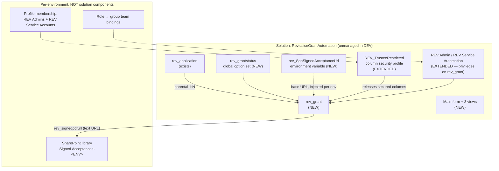

# Technical Architecture Document — Grant Record and Signed-Acceptance Store

**Feature Slug:** `revitalise-grant-record`
**Date:** 2026-08-18
**Status:** DRAFT
**Approved SDD:** `docs/plans/revitalise-grant-record-plan.md` (APPROVED 2026-08-18)
**Parent TAD:** `docs/architecture/revitalise-grant-automation-architecture.md` (APPROVED) — this
document **extends** it for one entity and does not restate it.
**Tier:** `strategic` — `escalate_to_strategic_when`: regulated data (Tier 4 personal + financial)
**and** custom security controls (column security + a SharePoint ACL boundary).
**WBS:** `0.4` (remainder). Unblocks `3.2`, `3.4`, `3.7`, `6.6`, `7.2`, `8.4`.

---

## 1. Architecture Overview

One Dataverse table, `rev_grant`, parented to `rev_application`, plus one SharePoint document
library holding signed acceptance PDFs and referenced by URL from the Grant row. No flows, no
connectors, no app changes.

The design is deliberately the smallest thing that unblocks Phase 1. Everything the acceptance
automation will need — status values, the signed-PDF URL column, the manual-acceptance route, the
retention trigger date — exists after this slice; nothing that needs DocuSign is built.

Three properties of this slice are worth stating because they set the shape of the work:

1. **It is the first new entity authored since the self-learning gates existed.** Five of the
   digest's recorded defects (`IMP-0001`, `IMP-0006`, `IMP-0013`, `IMP-0015`, `IMP-0019`) are
   entity-creation defects. The design below fixes the shape by copying from artefacts the
   platform has already accepted, rather than from documentation.
2. **One document type leaves Dataverse**, so one control leaves Dataverse with it. Column
   security cannot protect a file in SharePoint; library membership is the whole control.
3. **The security posture is deny-by-default**, per the reviewer's OQ-G06 answer. That interacts
   with an existing build gate in a way §6 resolves explicitly rather than discovering at build.

---

## 2. Component Diagram



Everything in the lower box is `C-TECH-050` territory: the deploy mechanism cannot *create* it,
only update it. It is listed in §12.1 with its script and its gate.

---

## 3. Data Model

### Entities

`rev_grant` — **Tier 4, Restricted** (personal + financial). Classification inherited from parent
TAD §3.1, not re-derived. Retention: cascade with Application, six years from
`rev_finalpaymentdate` (`knowledge/domain/regulations.md` → retention schedule).

Primary name column is an **autonumber**, following the pattern already accepted by the platform on
three existing tables:

```xml
<AutoNumberFormat>GR-{DATETIMEUTC:yyyy}-{SEQNUM:5}</AutoNumberFormat>
```

This yields `GR-2026-00001` as the parent TAD §4 specifies. The shape is copied verbatim from
`Entities/rev_application/Entity.xml` line 23, which the platform has accepted — not inferred from
documentation (`IMP-0001`, and `skills/how-to-verify-a-platform-contract.md` §3).

| Column | Type | Secured? | Notes |
|---|---|---|---|
| `rev_name` | Autonumber (nvarchar) | No | `GR-2026-00001`. Pseudonymous reference, safe in lookups and audit summaries (ADR-013 precedent) |
| `rev_applicationid` | Lookup → `rev_application` | No | **Parental.** See Relationships |
| `rev_status` | Picklist → `rev_grantstatus` | No | Needed unsecured so views and lists render. Carries no personal data |
| `rev_amountawarded` | Money | **Yes** | Financial |
| `rev_holidaystart` / `rev_holidayend` | DateTime (date only) | **Yes** | Combined with a location these narrow to an individual |
| `rev_conditions` | nvarchar (multi-line) | **Yes** | **Grant** conditions — the terms of the award, **not** health conditions. Named to avoid the collision the SDD flagged |
| `rev_docusignenvelopeid` | nvarchar | **Yes** | Ships empty; unexercised until WBS `3.2`. OQ-G04 |
| `rev_acceptanceissuedon` / `rev_acceptancesignedon` | DateTime | **Yes** | |
| `rev_signedpdfurl` | nvarchar (URL format) | **Yes** | A link, not a file. See §4 |
| `rev_manualacceptancerecorded` | Two Options | **Yes** | FR-046 print-sign-scan route |
| `rev_manualacceptancenote` | nvarchar (multi-line) | **Yes** | Free text — must be assumed to contain personal data |
| `rev_impactreport` | nvarchar (multi-line) | **Yes** | Applicant's own words after the break |
| `rev_finalpaymentdate` | DateTime (date only) | **Yes** | **Starts the six-year retention clock.** Financial |

**Deliberately absent:** `rev_providerid` — OQ-G03, closed by the reviewer as "leave out". It
arrives with WBS `8.1`. Adding a lookup later is an ordinary additive import; it is **not** the
type-change case that cost three imports in `IMP-0017`, and this document records that explicitly
so the next author does not re-litigate it.

**Every text column's length is set from the parent TAD's field, or, where the parent is silent,
from the shortest value that fits the purpose.** `C-TECH-060` now checks every shipped text value
against the `<MaxLength>` its own schema declares, so an over-long seeded or authored value fails
the build rather than a live write.

### Relationships

`rev_application` **1:N parental** → `rev_grant`, cascading delete. The cascade is what makes
retention and erasure work: deleting one Application removes the whole case (`BR-D02`).

⚠️ **The cardinality disagreement, resolved.** `grant-application-data-model-v0.2.md` says a Grant
is *"one-to-one with its Application"*. Dataverse has no native 1:1 relationship. The parent TAD
declares a parental lookup, which is 1:N. **Decision:** implement the parental 1:N, and enforce
one-grant-per-application with an **alternate key on `rev_applicationid`** so a second Grant for
the same Application fails at the platform rather than in a flow.

That alternate key is a **guess about a platform contract** and is registered as such — see §12.2
`A-G01`. Alternate keys on *string* columns are proven in this solution
(`rev_application.rev_sourcesubmissionid`); on a *lookup* column they are not, in this repo. Two
failed guesses is the signal to stop guessing (`IMP-0011`), so this one is verified before it is
relied on, and the fallback is stated.

### Migration Strategy

None. `rev_grant` is a new table in an environment with no Grant data. There is nothing to migrate
and no backfill. The four existing tables are untouched by this slice except for the
`rev_application` side of the new relationship.

---

## 4. Integration Design

One integration: **SharePoint Online**, outbound write + read, standard connector, service-account
connection. It is not exercised by this slice — no flow writes a PDF yet — but the library and its
addressing must exist and be correct now, because `rev_signedpdfurl` is meaningless without them.

**ADR-014 (parent TAD) is adopted unchanged:** the signed PDF lives in a SharePoint library and the
Grant row holds its **URL**. Dataverse server-based SharePoint integration and document locations
are **not** configured, so `provisioning/dataverse/ensure-document-locations.ps1` is **not** used by
this slice.

### Site and library

The reviewer designated the site at the plan gate (OQ-G01):
`https://revitalise212.sharepoint.com/sites/GrantApplications/` — it exists; no library is
designated yet. **No site collection is created, so no `APPROVE TENANT` gate applies to this
slice.**

⚠️ **Documented deviation from `knowledge/technology/sharepoint.md`.** That file's convention is
*"one site per purpose **per environment** — never point two environments at the same site."* One
site exists and the reviewer has designated it, and creating three site collections is the
tenant-level operation the OQ-G01 answer deliberately avoided.

**Decision:** one **library per environment inside the single designated site**, named
`Signed Acceptances - DEV` / `- TST` / `- PRD`. The environment boundary moves from the site to the
library, and permissions are set per library. Recorded as a deviation with its reason rather than
adopted silently, per `C-TECH-055`'s posture on carrying things quietly.

*Consequences.* Positive: no tenant operation, no new site sprawl, one place for a charity with one
grant process. Negative: the site's own membership is a shared surface — anyone with site-level
access reaches every environment's library, so **library-level permissions must not rely on
inheritance**. Neutral: if Revitalise later wants hard environment separation, splitting the site
is a provisioning change, not a schema change.

**Addressing is an environment variable, never a literal** (`C-TECH-047`):
`rev_SpoSignedAcceptanceUrl`, holding the library's server-relative URL, supplied per environment
by deployment settings. `rev_signedpdfurl` on the row stores the full item URL as written by the
future acceptance flow.

### 4.1 Subject access and erasure positions for this entity

`C-DOM-005` and `C-DOM-006` are verified against this section, so the positions are recorded here
rather than left to the parent TAD.

**Subject access (C-DOM-005, SOFT) — explicit exemption, not a mechanism.** No SAR extract
mechanism exists for this project. It was accepted as a known gap by the reviewer at the parent
architecture gate (parent TAD §4.2, risk A-R22), FR-053 is unmet, and no SAR turnaround SLA exists
in any source (SDD OQ-023). `rev_grant` adds a new place a named individual's data is held —
amount, dates, conditions, impact report — so it **widens** the surface an eventual SAR must cover.
That is recorded here as an exemption carried forward, and it remains a `WARN` at this gate: an
exemption is not a path.

**Erasure (C-DOM-006, SOFT) — partly mechanised, with a legally mandated retention exception.**

| Path | Position for `rev_grant` |
|---|---|
| Dataverse rows | **Implemented by design** — the parental cascade from `rev_application` deletes the Grant with its case (ADR-G02) |
| The signed PDF in SharePoint | ⛔ **Not implemented.** Deleting the Dataverse row leaves the file. The purge belongs to the deferred Retention & Erasure helper flow (FR-049) |
| DocuSign envelope | ⛔ Not implemented; same deferred flow. No envelope exists yet either way |
| **Legal retention exception** | **Six years from `rev_finalpaymentdate`** under the Charities Act 2011 financial-record duty. This is the entity where erasure legitimately cannot complete on request, and FR-052 requires the carve-out to be **reported to the requester**, not silently applied |

The consequence worth stating: after this slice, deleting a Grant row deletes the record but **not
its signed PDF**. That is a real gap for the duration, and it is the reason the retention helper flow
is named in §12 as deferred rather than omitted.

---

## 5. Automation / Workflow Design

**None. Deliberately.**

No flow is created, modified, or wired. The three acceptance flows (`REV | Acceptance | Create
Envelope / Reminders & Escalation / Completion`) remain deferred at WBS `3.2`, `3.3`, `3.4`, blocked
on the DocuSign account, template and UK residency evidence.

Consequences for verification, stated because they are easy to overstate: this slice can reach
**V4** (a named human opens and saves the form) but **cannot reach V5** for any acceptance
behaviour, because no behaviour exists to execute. `C-TECH-053` forbids reporting a level not
executed, and the temptation here is to call a successfully deployed table "working".

---

## 6. Security Design

### The deny-by-default decision, and the gate it collides with

The reviewer's OQ-G06 answer was *"reverse the logic. Don't give access now so that later on we can
give access. At the moment the environment is empty anyway."* That is the correct direction:
retro-fitting column security to a populated table is disruptive, whereas releasing an
already-secured column to a new profile is additive.

Applied literally — *secure the columns and release them to nobody* — it **fails the build**.
`scripts/verify-field-security-coverage.py` reports `UNREADABLE` when a column carries
`IsSecured=1` and no profile releases it, and it is right to: in this project there is deliberately
**no System Administrator among the application personas** (parent TAD §6.5, ADR-019), so an
unreleased secured column is readable by nobody at all — including the process owner and the
service identity. FR-041 requires the acceptance document to be pre-populated with the grant
amount; a `rev_amountawarded` that the service identity cannot read makes that impossible.

**Resolution, and the interpretation it rests on.** The access the reviewer is declining to grant is
the **finance role's and the trustees'**. The process owner and the service identity are not
optional — they are the only personas that make the record usable at all.

| Persona | Grant access after this slice | Mechanism |
|---|---|---|
| **REV Admins** (process owner) | Read/write, incl. all secured columns | Member of `REV_TrusteeRestricted` |
| **REV Service Accounts** | Read/write, incl. all secured columns | Member of `REV_TrusteeRestricted` |
| **Trustees** | **Nothing** — no table privilege, not a profile member, no library access | Non-membership. Not app design |
| **Finance role** | **Nothing.** Does not exist yet | `REV_FinanceOnly` is not built in this slice |

So: **columns are secured now** (the irreversible-if-skipped half of the reviewer's instruction is
honoured), and released only to the two personas that already hold that level of access on
`rev_applicant` and `rev_application`. Nothing new is granted to anyone. If the reviewer intended
literally *nobody*, this slice cannot build, and §11 `R-G03` records that as the open reading.

### Column security

Twelve of fourteen columns carry `IsSecured=1` (§3). `rev_name` and `rev_status` do not: the
reference is pseudonymous and the status carries no personal data, and both are needed unsecured for
a view to render a usable list.

Every secured column is added to `Other/FieldSecurityProfiles.xml` → `REV_TrusteeRestricted`,
granting Allowed(4) on read/update/create, consistent with that file's existing 39 columns. The
profile's own comment states the rule this slice must not break: **every `IsSecured=1` column must
appear there, and nothing else should.**

⚠️ **What no gate can check.** `verify-field-security-coverage.py` proves the two files agree with
each other. It cannot prove the *set* of secured columns is the right set — that is a human
judgement against the access matrix, and `knowledge/domain/compliance-requirements.md` → CR-01 now
says so in as many words. The judgement here: secure anything that carries an amount, a date that
narrows to an individual, free text, or a link to a signed document.

### The SharePoint boundary

Confirmed by the reviewer at the plan gate (OQ-G02): **trustees read Dataverse data only and have
no business with signed PDFs, which belong to the grant administrator.**

This is stronger than ADR-014's original framing of a deny. The trustee group is simply **not a
member** of the library. Permissions are set positively:

| Principal | Library permission |
|---|---|
| `REV Admins` group | Contribute |
| `REV Service Accounts` group | Contribute (the future acceptance flow writes here) |
| Everyone else, including trustees | None. Inheritance from the site is **broken** |

Breaking inheritance is load-bearing, not tidiness: the site is shared across environments by the
§4 decision, so an inherited permission would cross an environment boundary as well as a persona
one.

### 6.2 Privileged actions and elevated authorisation (C-DOM-021)

No application persona holds a privileged action on `rev_grant`. Each privileged action and the
elevated path it requires:

| Privileged action | Who may perform it | Elevated path |
|---|---|---|
| **Delete a Grant row** | Nobody, through the app | `REV Admin` is granted **no Delete privilege** (§6.1). Deletion happens only as a consequence of the retention job or the parental cascade |
| **Bulk delete** | A Dataverse System Administrator | Configured per environment by `ensure-bulk-delete-jobs.ps1`, outside the solution and outside every application role. Runs as a system job, logged as one |
| **Export data** | `REV Admins` only | Inherited from the environment's role configuration; trustees and finance hold no privilege on this table at all |
| **Change column security** | A System Administrator | Profile **membership** is not a solution component; it is applied per environment by `ensure-column-security-profile-members.ps1` (§12.1) and cannot be altered from within the app |
| **Change the retention trigger** | A System Administrator | `rev_finalpaymentdate` is a secured column, writable only by `REV Admins` and the service identity |

The pattern throughout: the app personas can *use* the record, and the operations that would destroy
or expose it sit outside the app entirely. This project deliberately has no System Administrator
among its application personas (parent TAD §6.5, ADR-019), which is what makes that separation real
rather than nominal.

### 6.1 Security Role & Group Mapping

| Role | Change | Privileges on `rev_grant` |
|---|---|---|
| `REV Admin` | Extended | Create, Read, Write, Append, AppendTo at **user/organisation depth per the parent TAD §6 pattern**; **no Delete** — deletion is the retention job's, not a person's |
| `REV Service Automation` | Extended | Create, Read, Write, Append, AppendTo |
| `REV Trustee` | **Not created** | n/a — Phase 3 (WBS `6.1`) |
| `REV Finance` | **Not created** | n/a — Phase 4 (WBS `8.2`) |

Role **definitions** ship in the solution. Role **bindings to group teams** and **profile
membership** do not — both are §12.1 items.

---

## 7. Non-Functional Decisions

| NFR | Decision |
|---|---|
| NFR-009 UK residency | The library inherits the site's region. ⚠️ The site's region is **unverified** — §12.1 makes evidencing it a prerequisite step, not an assumption (DPIA action A5, still open) |
| NFR-010 retention | `rev_finalpaymentdate` is the trigger date; the parental cascade is the scope. The **job itself is not built** — this slice ships the trigger, not the enforcement |
| NFR-011 backup window | No decision needed; the Grant inherits the environment's position |
| NFR-013 minimisation | Column list is the parent TAD §4's exactly, minus `rev_providerid`. Nothing added |
| NFR-014 auditing | Auditing enabled on `rev_grant` and on every secured column, via `provisioning/dataverse/ensure-auditing.ps1` (§12.1) |
| NFR-012 / NFR-016 no PII in logs | Nothing in this slice writes a log |

---

## 8. Accessibility

The only human surface is the `rev_grant` main form inside the existing model-driven app, used by
the process owner. Model-driven forms inherit the platform's WCAG conformance, so the decisions that
remain are content decisions, and they are the ones `IMP-0015` was about:

- **Every form label is the attribute's own authored wording**, not a humanised schema name.
  `IMP-0015` shipped eleven fields labelled "Wellbeing Answer 1" while the real survey question sat
  in the attribute's own description. No test asserts label text; this is a review item at V4.
- Field grouping follows the record's real lifecycle — award, acceptance, impact, payment — so a
  screen-reader user meets the fields in the order the process uses them.
- `rev_signedpdfurl` is rendered as a URL with a meaningful link text, not a bare address.

---

## 9. Deployment Topology

Unchanged from the parent TAD §9 and ADR-007: GitHub Actions validates, builds and stages to DEV;
Power Platform Pipelines owns DEV → TST/ACC → PRD.

This slice deploys to **DEV only**. TST/ACC and PRD remain blocked by an item this slice does not
touch: the service account's unattended-sign-in Conditional Access exception is still outstanding
with Wanstor (Dev Summary §7.4).

Verification ladder for this slice, with what each stage may claim (`C-TECH-053`):

| Level | Reached by | What it proves here |
|---|---|---|
| V1 well-formed | `source-validate` | XML/JSON parse |
| V2 packaged | `pack-managed` / `pack-unmanaged` | The packer accepted the layout. **Says nothing about the form or views existing** — `IMP-0006` |
| V3 accepted | DEV import, re-run once | The table, option set, form, views and profile rows exist. Verified by querying **every declared component type by name from a list derived from source** — `IMP-0013`, where `savedquery` and `systemform` were absent from a hand-written list |
| V4 usable | **A named human** opens the `rev_grant` form and saves a record | The form is openable and saveable, and its labels read correctly |
| V5 executed | **Not reachable** | No behaviour exists to execute. Do not claim it |

---

## 10. Architecture Decision Records

### ADR-G01: One library per environment inside the single designated site
**Status:** `Adopted` · **Date:** 2026-08-18
**Context:** `knowledge/technology/sharepoint.md` requires one site per purpose per environment. One
site exists and the reviewer designated it; creating more is a tenant operation.
**Decision:** One library per environment inside `…/sites/GrantApplications/`, inheritance broken,
addressed by environment variable.
**Consequences:** No tenant gate; the site becomes a shared surface, so library ACLs cannot rely on
inheritance. Splitting later is a provisioning change, not a schema change. **Recorded as a
deviation from the knowledge file, not a silent exception.**

### ADR-G02: Parental 1:N with an alternate key, not a modelled 1:1
**Status:** `Adopted` · **Date:** 2026-08-18
**Context:** The data model says one-to-one; Dataverse has no native 1:1; the parent TAD declares a
parental lookup.
**Decision:** Parental 1:N with cascade, plus an alternate key on `rev_applicationid` to enforce
uniqueness at the platform.
**Consequences:** The cascade retention behaviour is native. The alternate key is an unverified
platform contract (`A-G01`); if it cannot be created on a lookup, the fallback is a Dataverse
duplicate-detection rule plus a guard in the future finalise flow — **weaker, and it must be
recorded as such rather than quietly accepted.**

### ADR-G03: Secure now, release to the existing two personas only
**Status:** `Adopted` · **Date:** 2026-08-18
**Context:** The reviewer's deny-by-default instruction, against a gate that fails on a secured
column no profile releases, in a project with no System Administrator persona.
**Decision:** `IsSecured=1` on twelve columns; released to `REV Admins` and `REV Service Accounts`
via the existing profile; nothing granted to trustees or finance.
**Consequences:** The reviewer's intent is honoured for the two personas it concerned, and the
record remains usable by the two that must use it. **If the intent was literally nobody, this is
wrong and §11 R-G03 is the open item.**

### ADR-G04: `rev_docusignenvelopeid` ships empty
**Status:** `Adopted` · **Date:** 2026-08-18 · **Closes OQ-G04**
**Decision:** Ship the column now, empty and unexercised.
**Consequences:** Avoids a second schema pass on a live table for a column whose type is not in
doubt. It is recorded as **unexercised until WBS `3.2`**, which is a different claim from "working".

---

## 11. Risks & Mitigations

| # | Risk | L | I | Mitigation |
|---|---|---|---|---|
| R-G01 | The form and views pack to nothing — `Entity.xml` lacks the `<FormXml />` / `<SavedQueries />` markers. **0 warnings, 0 errors, 0 components** | **Med** | High | `forms-and-views-reachable` build gate, which exists because this happened (`IMP-0006`). This is the single most likely failure in this slice |
| R-G02 | The `rev_grantstatus` option values are wrong at first import, and orphans survive every later one | Med | Med | Get the four values right now. Import relabels matching values but **never deletes omitted ones** (`IMP-0019`), and the cleanup call is refused by this environment (`IMP-0021`) — so a mistake here needs the reviewer in the maker portal |
| R-G03 | **The OQ-G06 reading is wrong** and the reviewer meant release to nobody | Low | High | Stated plainly in §6 and ADR-G03. One sentence at this gate settles it. Building the wrong reading means a table nobody can read |
| R-G04 | The alternate key cannot be created on a lookup column | Med | Low | `A-G01` in §12.2, with a named fallback. Verified before it is relied on |
| R-G05 | Library permissions inherit from the shared site, exposing one environment's PDFs to another | Med | **High** | Inheritance broken explicitly; `provisioning/sharepoint/verify-sharepoint.ps1` asserts it. This is the risk ADR-G01 creates and must therefore own |
| R-G06 | The site's UK region is assumed rather than evidenced | Med | High | §12.1 prerequisite step; DPIA action A5 is already open and this slice must not widen it |
| R-G07 | Form labels are structurally perfect and semantically wrong | **Med** | Low | V4 review item; no gate asserts label text (`IMP-0015`) |

---

## 12. Provisioning & External Dependencies

| Component | Tool / script | Scope | Gate |
|---|---|---|---|
| SharePoint library + broken inheritance + ACLs | `provisioning/sharepoint/ensure-site.ps1` (scoped to library) + PnP template | **Site-level, not tenant** | None — no `APPROVE TENANT` (OQ-G01) |
| Column-security profile **membership** | `provisioning/dataverse/ensure-column-security-profile-members.ps1` | Per environment | Stage 0.5 |
| Role → group-team bindings | `provisioning/dataverse/bind-roles-to-groups.ps1`, `verify-role-bindings.ps1` | Per environment | Stage 0.5 |
| Auditing on the new table and columns | `provisioning/dataverse/ensure-auditing.ps1` | Per environment | Stage 0.5 |
| Retention bulk-delete job keyed on `rev_finalpaymentdate` | `provisioning/dataverse/ensure-bulk-delete-jobs.ps1` | Per environment | **Deferred** — the job belongs with the retention work, and this slice must not claim it |

### 12.1 Environment Prerequisites — before the FIRST deploy into any environment

Everything the import mechanism cannot *create*, only update (`C-TECH-050`). These run again for
every environment: DEV being ready says nothing about TST/ACC or PRD.

1. **Entity, attributes and the global option set** exist — `provisioning/dataverse/ensure-schema.ps1`.
   `C-TECH-050`: Entities/Attributes and Global OptionSets are created via the Web API, never
   assumed creatable by a first solution import.
2. **The alternate key** on `rev_applicationid` — created via the Web API after the entity exists.
3. **SharePoint library** exists inside the designated site, inheritance broken, ACLs set.
4. **Region evidence** for that site captured as a deployment-summary artefact (NFR-009, DPIA A5).
5. **Column-security profile membership** — `REV Admins`, `REV Service Accounts`, and nothing else.
6. **Role bindings** to group teams.
7. **Auditing** enabled on the table and every secured column.
8. **Environment variable** `rev_SpoSignedAcceptanceUrl` has a value for the target environment.

### 12.2 Platform Contract Verification Plan

For every component authored ahead of a live environment: how ground truth is obtained, and which
values the platform assigns rather than accepts (`C-TECH-051`, `C-TECH-052`).

| Contract | How it is ground-truthed | Status |
|---|---|---|
| Entity/attribute file layout | Copied from `Entities/rev_errorlog/` and `rev_application/`, both accepted by this platform | ✅ Verified — no guess |
| `<AutoNumberFormat>` element and syntax | Copied verbatim from `rev_application` line 23, live in DEV | ✅ Verified — no guess |
| Global option-set file shape | Copied from `OptionSets/rev_applicationstatus.xml`, live in DEV | ✅ Verified — no guess |
| `<FormXml />` / `<SavedQueries />` markers | The mechanism `IMP-0006` established; asserted by a build gate | ✅ Verified |
| Field-security-profile row shape | Copied from the existing 39 rows in `Other/FieldSecurityProfiles.xml` | ✅ Verified |
| Parental relationship + cascade on a new child table | Pattern exists (`rev_application` → `rev_applicant`) | ✅ Verified |
| **`A-G01` — alternate key on a LOOKUP column** | **GUESS.** String alternate keys are proven here; lookup keys are not. Create it via the Web API in DEV and observe. **Fallback:** duplicate-detection rule + a guard in the future finalise flow, recorded as weaker | ⛔ **OPEN — must close before deploy** (`C-TECH-058`) |
| Library ACL behaviour with broken inheritance | Set and then **read back** with `verify-sharepoint.ps1`; do not trust the set call's exit code (`IMP-0013`'s class) | ⛔ To verify in DEV |

`A-G01` carries an `A-nnn` comment at the point of the guess in source, per `C-TECH-052`. It is
`OPEN`, and `C-TECH-058` blocks the DEV deploy until it is closed or explicitly overridden with
`OVERRIDE A-G01` and a reason — which is exactly the mechanism `IMP-0014` exists to enforce, after
an `OPEN` assumption shipped and reached the reviewer as three empty dropdowns.

---

## Approval

**Reviewed by:** ___________  **Date:** ___________  **Response:** `APPROVED`
