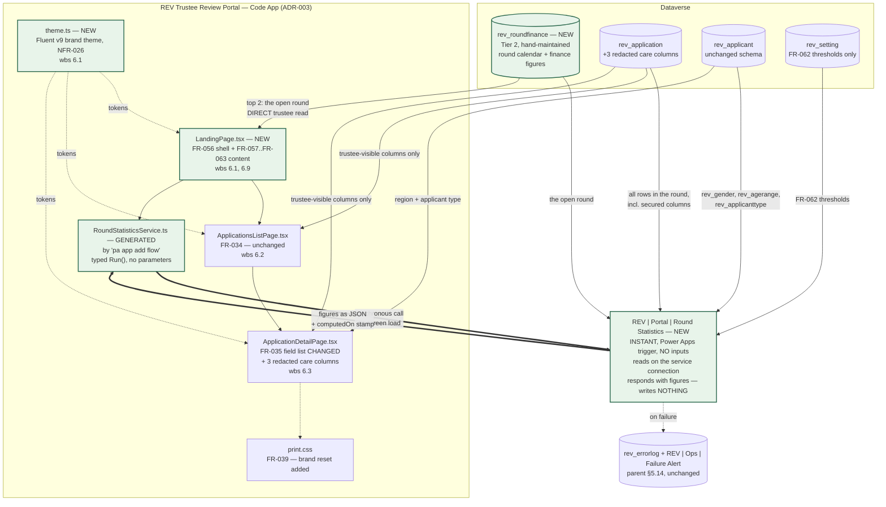
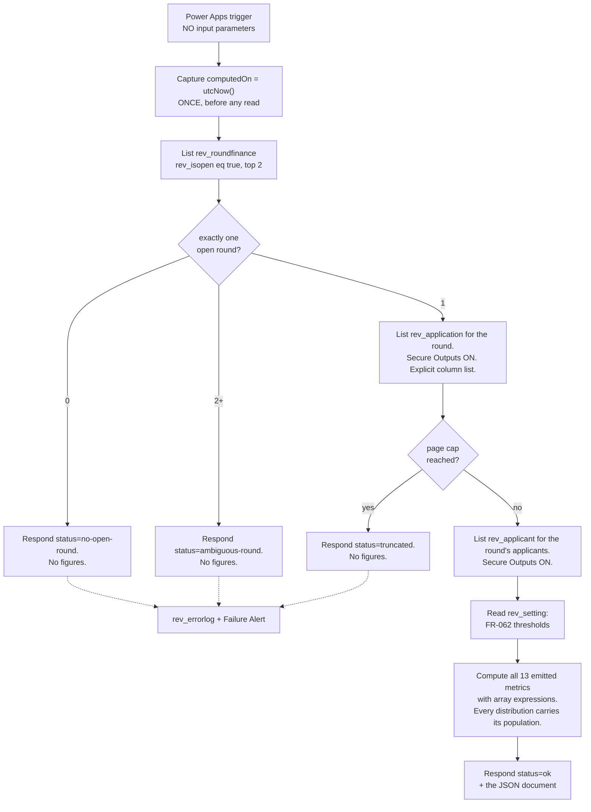

# Technical Architecture Document — Trustee Portal Visual Refresh and Round-Statistics Landing Screen

**Feature Slug:** `trustee-portal-visual-refresh`
**SDD Reference:** `docs/plans/revitalise-grant-automation-plan.md` — **Amendment A-02** (APPROVED 2026-08-24,
`wbs:6.1,6.3,6.5`) and **Amendment A-03** (APPROVED 2026-08-25, `wbs:6.9`), including A-03's
**Resolution (continued)** of the same date, which rewords FR-061. The originally approved body of that SDD
is otherwise unchanged and is not re-derived here.
**Parent TAD:** `docs/architecture/revitalise-grant-automation-architecture.md` (APPROVED 2026-08-10, amended
since). **This document is a delta.** Every section states whether it *changes*, *extends*, or leaves
*unchanged* the corresponding parent-TAD section, and does not restate what the parent already settled.
**Date:** 2026-08-25
**Status:** DRAFT — **Revision 2**
**WBS:** `6.1`, `6.3`, `6.5` (accepted tasks, `contract/wbs.json`) and `6.9` (created by
`contract/change-orders/CO-001.md`, resized by `contract/change-orders/CO-001-A1.md`; **not yet present in
`contract/wbs.json`** — see §0.3). Also serves `feature:trustee-portal-landing-page`, which is the feature
label CO-001 and Amendment A-03 use for the `6.9` half.

**Model tier:** `strategic`, escalated from `standard` under `config/models.yml` →
`agents.architect-agent.escalate_to_strategic_when`. Two conditions are met, not one:

1. *Feature touches regulated data.* The landing screen aggregates over UK GDPR Art. 9 special-category
   columns (`rev_careprovidedtype`, the condition profiles, the wellbeing set) and over one column the
   trustee is deliberately denied at value level (`rev_applicant.rev_gender`).
2. *Custom security controls.* This design introduces a **second, privileged read path** whose output
   reaches a persona that cannot read its inputs. That is a new disclosure mechanism, not a new screen,
   and §6.3 is where it is resolved.

**Amendment A-01 is PROPOSED, not approved.** Nothing here designs against its FR-013 replacement wording.
The originally approved FR-013 stands. A-01's evidence is nonetheless load-bearing for **FR-062** in one
narrow way, recorded at §5.2.

---

## 0. What changed in Revision 2, what this pass decides, and what it deliberately does not

### 0.1 Revision 2 — the reviewer's four inputs and where each landed

Revision 1 went to the gate on 2026-08-25 and came back with three pieces of feedback plus one upstream
requirement change. This section is the audit trail; the design sections below are already revised.

| # | Reviewer input | Where it landed |
|---|---|---|
| **1** | **ADR-025 rejected as written.** *"no the landing screen should show the actual numbers. It can grab that directly from dataverse. so no dependency from other systems."* | **ADR-025 is superseded by ADR-030.** The daily batch job, the `rev_roundstatistic` table and the `rev_roundmetric` option set are **all removed**. Figures are computed **at the moment the screen loads**. §1.1, §1.2, §3.3, §5.1 |
| **2** | **Withdrawn-suppression risk acceptance extends to the gender chart.** *"Yes, the gender breakdown being determined automatically makes it even less faulty because it count's the inserted data of the dataverse tables."* | **§6.3 is now CONFIRMED, not an open question.** Risk **A-R27 is accepted and closed**. Applies identically under the live mechanism — §6.3 |
| **3** | **FR-035's care-support description: wire it now, do not defer.** | **ADR-027 amended** from "defer both" to **"ship the columns and the code-app wiring now, populate later"**. Three redacted columns are added to `rev_application` in this pass and bound by the app in this pass. §3.2, §3.2.1 |
| **4** | **FR-061's benchmark clause withdrawn** by plan-agent's amendment (SDD, `docs/plans/revitalise-grant-automation-plan.md` FR-061). *"there is no benchmark dataset. This is personal knowledge of the trustees."* | **All benchmark content removed** — the `rev_benchmarkpercentage` column, Revision 1's §5.3 snapshot mechanism, the `rev_setting` benchmark seed step, the benchmark column and second bar in §8.1, and every OQ-037 reference. OQ-037 is **closed**, not open |

### 0.2 The three decisions this pass makes

**1. NFR-026 (full-width, brand-consistent rendering) is a token substitution inside the app the project
already has — not a new design system.** The portal is already Fluent UI v9 plus CSS Modules. Fluent v9's
theme *is* a token contract, and this app's own stylesheet already reads those tokens
(`var(--colorNeutralBackground1)` and siblings in `src/styles/app.module.css`). So brand adoption is one new
`theme.ts`, one changed line in `main.tsx`, and one changed rule in `app.module.css`. No component changes,
no new dependency, and the WCAG 2.1 AA work in the parent TAD §8 survives intact. **This is the answer to
OQ-033.** ADR-026 — unchanged in Revision 2.

**2. FR-035's care-support free text stays secured, and its redacted counterparts ship now — column and
code-app wiring together, populated later.** Of the four columns Amendment A-02 names, two are structured
and already readable by a trustee, and three further free-text columns sit inside `REV_TrusteeRestricted`.
Releasing that free text would cross exactly the Art. 9 / identity boundary ADR-002 exists to hold. So this
pass adds the three `…redacted` counterparts and binds them in the app **now**, gated by the
`rev_redactionreleased` flag the narrative already uses, so that when Automation #5 begins writing them **no
further code-app deployment is required**. ADR-027, §3.2.

**3. Every round statistic (FR-058–FR-062) is computed live, on demand, at the moment the screen loads —
by one privileged read that never enters the browser, and stored nowhere.** The three obstacles Revision 1
raised are all still true and all still binding, but they force the computation to be **privileged and
server-side**; not one of them forces it to be **stale**. That distinction is the whole of Revision 2.
ADR-030, §1.1, §5.1.

### 0.3 What this pass does not do

- It does not touch the applications list (WBS 6.2 / FR-034), the verdict capture (WBS 6.4 / FR-037), the
  finalise-decisions flow (WBS 6.6 / FR-040), any existing table's relationships, any existing role's table
  privileges beyond the additive grants in §6.1, or the parent TAD's DLP policy, deployment topology or ALM
  route. Those sections are **unchanged and not reproduced**.
- It does not re-open NFR-027. The reviewer withdrew it on 2026-08-25 with a stated reason, and this document
  neither reinstates it nor designs a quiet equivalent. §6.3 records the reviewer's confirmation that the
  same acceptance covers the aggregate path.
- It does not build FR-061's ethnic-group distribution. **There is no column to aggregate.** §3.4, A-R24.
- **It designs no benchmark comparison of any kind.** FR-061's benchmark clause is withdrawn (SDD FR-061,
  Amendment A-03 Resolution continued). Revision 1's benchmark column, seed step and snapshot mechanism are
  deleted rather than parked — there is no dataset and no owner, so parking them would be dead schema.
- It does not price anything. `wbs:6.9`'s hours are `contract/change-orders/CO-001-A1.md`'s; that sizing no
  longer matches this design in either direction, and §11 (A-R28) says how, for `commercial-agent` to act
  on. No figure — old or new — is restated here (`C-COM-008`).
- **`contract/wbs.json` still does not list task `6.9`.** Amendment A-02 flagged this on 2026-08-24 and
  A-03 carried it forward; it is still true. `wbs.json` is `pm-agent`/`commercial-agent`'s generated
  artefact, so this document cites `CO-001` / `CO-001-A1` for that task's existence rather than the WBS
  file, and the reconciliation stays open.

---

## 1. Architecture Overview

### 1.1 Live does not mean client-side: what the three obstacles actually force

This is the decision Revision 2 turns on, so it is argued from ground truth rather than asserted, and one
claim Revision 1 made is corrected rather than repeated.

A Power Apps Code App runs **as the signed-in user**. Its Dataverse reads carry that user's privileges and
that user's column security. The portal's whole anonymisation control (ADR-002) is that the `REV Trustee`
role is **not** a member of `REV_TrusteeRestricted`, so the 51 columns that profile governs come back empty
for a trustee no matter what the app asks for.

| # | Obstacle | Ground truth | What it forces |
|---|---|---|---|
| **A** | **The column-security ceiling.** FR-061 requires a gender distribution. `rev_applicant.rev_gender` is `IsSecured=1` and is one of the 51 field permissions in `REV_TrusteeRestricted`. A trustee reads `null` for every row, so a browser-side tally returns nothing. Dataverse has no "release in aggregate only" mode: column security is per value | `Entities/rev_applicant/Entity.xml`; `Other/FieldSecurityProfiles.xml` | **A privileged identity must do the counting.** Nothing else can. This obstacle alone is decisive |
| **B** | **A population mismatch between FR-058 and FR-038 — and the reason is design, not privilege.** FR-058 asks for *"the current round's total applications received"*; FR-038 restricts a trustee to applications *eligible for review*, and the app's server filter is literally `rev_eligibleforround eq true` (`src/dataverse/repository.ts:48`) | **Correction to Revision 1.** `REV Trustee` holds `prvReadrev_application` at **Global** (`Roles/REV Trustee/REV Trustee.xml:196`), so the platform would *permit* the wider read. Revision 1 described this as something the trustee "cannot" do; the truth is that it must not, and the app deliberately does not | **The wider read must not reach the browser.** That it is technically available makes the case stronger, not weaker: computing FR-058 client-side means putting out-of-remit application rows on the wire to a trustee's device to be counted and discarded. A privileged server-side count never exposes them |
| **C** | **The app's own read cap, and no server-side aggregation to escape it.** The read path caps at 500 rows and raises `TruncatedListError` beyond it (`src/dataverse/client.ts:73`, `MAX_ROWS = 500`). `Round 3 Stats.pptx` reports 434 applications in one round — inside the cap, but not by much. And the escape hatch does not exist: the generated `IGetAllOptions` the typed services accept has `select`, `filter`, `orderBy`, `top`, `skip`, `count` and `skipToken` — **no `apply`**, so OData `$apply` / `groupby` / `aggregate` is not expressible through this app's data layer at all | `src/generated/models/CommonModels.ts` → `IGetAllOptions` | **The row read must happen somewhere with no 500-row ceiling.** A flow's `List rows` has no such cap |

Obstacle C's second half is worth stating plainly because it is the kind of thing that gets assumed either
way: the absence of `apply` is read from the **generator's own output on disk**, which is an artefact the
platform produced, so it is E1 evidence and not a documentation guess
(`skills/how-to-verify-a-platform-contract.md`). The one aggregation affordance that *is* available —
`count?: boolean` — carries its own generated comment saying Dataverse caps it at 5000, and it cannot help
with a distribution over a column the reader is denied.

**What Revision 1 got wrong was not the obstacles — it was the inference.** All three say *who* must
compute: an identity holding `REV Service Automation`, which **is** a profile member and therefore reads
gender, and which reads `rev_application` and `rev_applicant` unfiltered by round eligibility. **None of
them says *when*.** Revision 1 answered "who" correctly and then, without a stated reason, chose a nightly
batch and an intermediate table — which imported staleness, a moving part and a stored copy that no
obstacle required. Revision 2 keeps the privileged reader and deletes the schedule.

### 1.2 The mechanism: one synchronous privileged call, per page load

The code app calls a **solution-aware instant cloud flow using the Power Apps trigger**, which computes
every figure over the open round and returns them in its response. Nothing is written; nothing is stored;
the figures are as old as the page.

**This is a first-party, CLI-generated data source, not a hand-rolled call.** `pa app add flow --flow-id
<id>` downloads the flow's OpenAPI definition, generates a typed TypeScript service with a static `Run`
method, and registers the flow and its connection references in `power.config.json`. The app's installed
`@microsoft/power-apps` is **1.3.0** (`src/code-apps/trustee-review-portal/package.json`), above the
documented **1.1.1** minimum. This matters for a HARD constraint: `C-TECH-048` permits Code App data access
only through a CLI-generated managed data source and forbids hand-rolled token acquisition — an HTTP-trigger
URL with an embedded SAS key, which is how `knowledge/technology/power-automate.md` currently says this is
done, would have violated it. `pa app add flow` complies by construction.

**Why the privileged read stays privileged.** The flow's Dataverse actions execute through the flow's own
connection reference — the service identity's connection — not the invoking trustee's. The trustee supplies
only the act of asking. Two consequences, both designed for rather than discovered:

- **The flow accepts no input parameters at all.** It derives the open round itself from `rev_roundfinance`.
  There is no round key, no filter and no column list a caller could steer, so the privileged read has no
  parameter surface to abuse. A trustee can ask this question and no other.
- **The "run only users" connection setting is the control that makes it work**, and it is environment
  state that solution source cannot express (`C-TECH-064`). If it is ever set to *provided by the run-only
  user*, the flow reads as the trustee, `rev_gender` returns null, and the gender chart renders empty while
  every gate stays green. §12.2 makes that a V5 assertion with a named falsifiable check, and A-R33 carries
  the risk.

**One mechanism for all seven requirements, not a mixed model.** FR-060 and FR-062 *could* be computed
client-side — every column they need is unsecured and inside the trustee's own visible set. A mixed design
was considered and rejected for the same reason as in Revision 1, and it survives the move to live
computation unchanged: **the tiles would have different denominators and nothing would reconcile them.**
FR-058's "applications received" counts the received population; a browser-side FR-060 break-type table
counts the eligible-and-released population. Both numbers would be correct and the screen would be lying —
which is the `hand-maintained-count-drifts-from-source` class this project has already recorded eight times.
One call, one population, one instant.

**What live costs, stated before anyone discovers it.** The landing screen is no longer the cheapest read in
the app; it is a flow invocation that reads the round's rows on every load. Revision 1's design was O(1) at
page load and stale; this one is O(n) at page load and current. The reviewer chose currency, and §7's
NFR-021/NFR-022 rows are rewritten accordingly rather than left claiming Revision 1's performance.

### 1.3 The one design the reviewer's framing would have permitted, and what it costs

Stated because "grab that directly from dataverse" deserves a straight answer rather than a reinterpretation.
There **is** a version of this screen with no server-side hop at all: compute every figure in the browser
over the ≤500 rows a trustee may already see. It requires giving up, in order — the **gender chart entirely**
(obstacle A, and the reviewer's input #2 explicitly wants that chart), **FR-058's received count** (obstacle
B — or else shipping out-of-remit rows to the browser), and **any headroom past 434 applications** (obstacle
C). Two of those three losses are requirements the reviewer has just re-affirmed. So the privileged hop is
kept, and it is now synchronous, unscheduled, un-stored and inside the same solution.

### 1.4 Solution boundary — changes in one respect

No new external system, no new connector, no new app registration, no new tenant dependency. What *is* new
is an **intra-solution invocation path the app did not have before**: the Code App calls a cloud flow. Today
the app's only data path is Dataverse (`power.config.json` declares exactly one connection reference,
`shared_commondataserviceforapps`, and four table data sources). `C-TECH-045` (DLP) therefore needs a
positive statement rather than an "unchanged": §4 gives it.

---

## 2. Component Diagram — extends parent §2.2

Only the changed neighbourhood is drawn. Everything else in the parent's component diagram is unchanged.



**The asymmetry in that diagram is still the design, and it is now the only durable artefact of it.** The
flow reads columns the app never touches and hands back only counts. **No aggregate is stored anywhere** —
which is a privacy improvement over Revision 1 and an auditability loss, both recorded in §6.4.

---

## 3. Data Model — extends parent §3

### 3.0 A gate note that must be honoured in the right order

`scripts/verify-tad-coverage.py` (`C-TECH-066`, HARD, build step `tad-coverage`) reads **§3.1 of the parent
TAD only** — its `--tad` default is `docs/architecture/revitalise-grant-automation-architecture.md`. It
asserts that every column that section names exists in `Entity.xml`, or carries an owned, dated entry in
`contract/tad-deferrals.json`.

So the new table and the three new columns below are specified **here**, and the instruction to
`development-agent` is precise: **add their §3.1 blocks to the parent TAD in the same commit that adds the
`Entity.xml` changes** — not before. Naming them in the parent first turns a HARD gate red for schema
nobody has built yet. If they must be documented in the parent earlier for any reason, each column needs a
`tad-deferrals.json` entry with an owner, a reason, a clearing action and an unexpired date.

Revision 2 makes this note *smaller*, not larger: one new table instead of two, no new global option set, and
three new attributes on an existing table.

### 3.1 Existing columns this feature binds — no schema change

Every column below already exists in solution source. Verified against
`src/solutions/RevitaliseGrantAutomation/Entities/*/Entity.xml` and
`Other/FieldSecurityProfiles.xml` on 2026-08-25.

| Column | Table | Type | Tier | Secured? | Serves | Reachable by a trustee? |
|---|---|---|---|---|---|---|
| `rev_breaktype` | `rev_application` | Choice (5 options) | Tier 3 | No | FR-035, FR-060 | ✅ yes |
| `rev_otherbreaktype` | `rev_application` | Text | Tier 3 | No | FR-035, FR-060 | ✅ yes |
| `rev_breaklocation` | `rev_application` | Text | Tier 3 | No | FR-035 | ✅ yes |
| `rev_breakstart` | `rev_application` | Date | Tier 3 | No | FR-035 | ✅ yes |
| `rev_breakend` | `rev_application` | Date | Tier 3 | No | FR-035 | ✅ yes |
| `rev_amountrequested` | `rev_application` | Money | Tier 3 | No | FR-035, FR-060 | ✅ yes |
| `rev_additionalamountrequested` | `rev_application` | Money | Tier 3 | No | FR-035, FR-059, FR-060 | ✅ yes |
| `rev_exceptionalfundingrequested` | `rev_application` | Boolean | Tier 3 | No | FR-035, FR-059 | ✅ yes |
| `rev_exceptionalcircumstance` | `rev_application` | Choice (4 options) | Tier 3 | No | FR-059 | ✅ yes |
| `rev_costs` | `rev_application` | Money | Tier 3 | No | FR-060 | ✅ yes |
| `rev_careprovidedtype` | `rev_application` | Multi-select Choice (11) | **Tier 4 (Art. 9)** | No — deliberately | FR-035 | ✅ yes, by design |
| `rev_carehoursperweek` | `rev_application` | Choice (5 bands) | Tier 3 | No | FR-035, FR-062 | ✅ yes |
| `rev_feelingscaleanswer` | `rev_application` | Whole number 0–10 | Tier 3 | No | FR-062 | ✅ yes |
| `rev_wellbeinganswer8`, `9`, `10` | `rev_application` | Choice (`rev_agreementresponse`) | Tier 3 | No | FR-062 | ✅ yes |
| `rev_isgrouptrip` | `rev_application` | Boolean | Tier 3 | No | FR-063 | ✅ yes |
| `rev_reviewround` | `rev_application` | Text | Tier 2 | No | FR-057 join key | ✅ yes |
| `rev_redactionreleased` | `rev_application` | Boolean, `IsSecured=0` | Tier 2 | No | FR-035 gate — §3.2.1 | ✅ yes (already bound) |
| `rev_agerange` | `rev_applicant` | Choice (9 options) | Tier 3 | No | FR-061 | ✅ yes |
| `rev_locationarea` | `rev_applicant` | Choice (13 options) | Tier 3 | No | FR-034 (existing) | ✅ yes |
| **`rev_applicanttype`** | `rev_applicant` | **Choice (3 options)** | Tier 3 | **No** | **FR-035, FR-061** | ✅ **yes — see §3.2** |
| `rev_gender` | `rev_applicant` | Choice (5 options) | Tier 3 | **Yes** | FR-061 | ❌ **no — aggregate only, §6.3** |
| `rev_careprovidedexample` | `rev_application` | Multiline (2000) | **Tier 4** | **Yes** | FR-035 | ❌ **no — redacted counterpart, §3.2.1** |
| `rev_caresupportdescription` | `rev_application` | Multiline (2000) | **Tier 4** | **Yes** | FR-035 | ❌ **no — redacted counterpart, §3.2.1** |
| `rev_othercareprovidedtype` | `rev_application` | Multiline (2000) | **Tier 4** | **Yes** | FR-035 | ❌ **no — redacted counterpart, §3.2.1** |
| `rev_otherexceptionalcircumstance` | `rev_application` | Text | **Tier 4** | **Yes** | FR-059 (implied) | ❌ **no — out of scope, §3.2.1** |

**Classification rows Amendment A-02 asked for.** A-02's OQ-032 resolution recorded that SDD §7.1 *"still
names no classification row for the care-support columns — recommend architect-agent add one at TAD stage."*
Here they are, and the split is the point: `rev_careprovidedtype` and `rev_carehoursperweek` are structured
categories describing *caregiving load* — Art. 9 data in the same sense `rev_conditionprofile` is, and
trustee-visible on the same approved basis (*the type and volume of caregiving is what the funding decision
weighs, not anyone's identity*, per that column's own authored description). `rev_careprovidedexample`,
`rev_caresupportdescription` and `rev_othercareprovidedtype` are **free text about a named third party's
care needs** — the `rev_narrativeraw` class exactly — and they are correctly Tier 4 and correctly secured.

Two Money columns above carry a standing platform note rather than a defect: under `C-TECH-070` a Money
column's automatic `_base` twin cannot be secured, so column security can never protect a Money value.
None of these four needs protecting (all are `IsSecured=0` by design and trustee-visible per FR-028), so
this is recorded for completeness, not as an exception. It still drives the type choice in §3.5.

### 3.2 FR-035 — what ships, and the mechanism that closes the gap

**Deliverable now, with no schema change and no security change:** type of break (`rev_breaktype`) plus the
"other" free-text specifier (`rev_otherbreaktype`, which is *not* secured), preferred dates
(`rev_breakstart`, `rev_breakend`), break location
(`rev_breaklocation`), total funding requested for the round (`rev_amountrequested` + `rev_additionalamountrequested`, with the
`rev_exceptionalfundingrequested` flag so the total is explicable rather than just larger), **applicant-type
context** (`rev_applicanttype`), and the **structured** care-support pair (`rev_careprovidedtype` for type of
care provided, `rev_carehoursperweek` for hours of support per week).

**Break location and preferred dates are both resolved, and both were the same shape of gap.** Break location
was recorded first: `rev_breaklocation` already existed on `rev_application` (`Entity.xml`, `nvarchar(250)`,
`IsSecured=0`), and its own description says it is *"TRUSTEE-VISIBLE ON PURPOSE… the board cannot judge a
request without knowing what is being requested"* — the column was simply not yet named in this TAD's §3.1
table or here. That was a documentation gap, not a schema gap, and it was closed first: `rev_breaklocation` is
named in §3.1's `rev_application` table above (Tier 3, unsecured, FR-035) and inline in §3.2 above.

**Preferred dates was recorded at the time as unresolved — "no preferred, holiday or travel date exists
anywhere in this document or the schema it describes" (test-agent, 2026-08-25; recurrence IMP-0326) — and that
finding was itself incomplete, not the schema.** `rev_breakstart` and `rev_breakend` already exist on
`rev_application` (`Entity.xml#L1268-1299`, `datetime`/`DateOnly`, `IsSecured=0`), with descriptions reading
*"The date the applicant would prefer their break to start"* / *"...to end"* respectively — the same
documentation gap as break location, not a schema gap, closed the same way: both columns are named in §3.1's
`rev_application` table above (Tier 3, unsecured, FR-035) and inline in §3.2 above (reviewer resolution,
2026-08-26). `scripts/verify-tad-coverage.py` reports 0 violations against this document.

**One correction to an approved upstream finding, and it is good news.** Amendment A-02, Finding 1 records
of the applicant-type question: *"No column in the generated Dataverse model corresponds cleanly to this
three-way category yet."* **`rev_applicant.rev_applicanttype` exists, is unsecured, and reproduces it
exactly** — its three options are *A disabled person* / *A carer applying on behalf of a disabled person* /
*A carer applying for yourself*, and its own description says *"from the form's 'Are you...' question.
Confirmed against the live form 2026-08-16."* A-02 read the code app's generated model for `rev_application`;
the column lives on `rev_applicant`. The app already reads `rev_applicant` for the region, and the
`REV Trustee` role already holds `prvReadrev_applicant` at Global. So the cost is one more entry in an
existing allow-list.

This also matters because A-02's fallback derivation was **unimplementable**: `rev_supportrecipientname` is
`IsSecured=1` and inside `REV_TrusteeRestricted`, so "whether it is populated" reads as *not populated* for
every application when the reader is a trustee. Had that derivation been built, it would have silently
mis-labelled every case.

**The care-support description: the three ways to close it, and the one that is acceptable.** FR-035 as
approved names *"the care-support description"*. `rev_caresupportdescription` and `rev_careprovidedexample`
are both `IsSecured=1` and both inside `REV_TrusteeRestricted`. A trustee reads `null`.

| Option | Consequence |
|---|---|
| Release the two columns from `REV_TrusteeRestricted` | Puts unredacted free text about a named disabled person in front of the board. Defeats ADR-002, FR-031, FR-036 and NFR-001 directly, and would be blocked mechanically anyway — `no-secured-columns-in-code-app` derives its forbidden set from the profile at check time, and `no-trustee-in-column-security-profile` guards the membership half |
| Bind the secured columns in the app and let column security null them | The screen shows a permanently empty panel. Worse than absent: it reads as *"this applicant provided no description"* |
| **Add redacted counterparts, exactly as the narrative already has** | `…redacted` siblings, written by `REV \| Narrative \| Scrub Free-Text` and released under the same `rev_redactionreleased` gate. Consistent with the mechanism the SDD already approved for the same class of text |

**Decision: the third — and per the reviewer's Revision 2 input #3, the columns and the code-app wiring ship
in this pass, with population following when Automation #5 lands.** ADR-027, amended. §3.2.1 is the concrete
specification.

### 3.2.1 The three new redacted columns — schema, and the interim rendering rule

**Why three and not one.** The reviewer named `rev_caresupportdescriptionredacted`. ADR-027 (Revision 1,
approved in substance and unchallenged on this point) already placed **all three** secured care-support
columns in OQ-011's redaction scope, so all three are already committed to being redacted. Shipping a
redacted column set that matches the redaction scope already declared is what makes the reviewer's own
stated goal true — *when that automation ships later, no further code-app deployment is needed* — for the
whole panel rather than a third of it. The marginal cost is two extra entries in `ensure-schema.ps1` and two
extra names in one select list. `rev_otherexceptionalcircumstance` is **not** included: it belongs to FR-059,
not to FR-035's care-support panel, and no requirement names its free text.

| New column | Table | Type | MaxLength | `IsSecured` | `IsAuditEnabled` | Redacts | Serves |
|---|---|---|---|---|---|---|---|
| `rev_caresupportdescriptionredacted` | `rev_application` | `ntext`, `textarea` | 4000 | **0** | 1 | `rev_caresupportdescription` | FR-035, `wbs:6.3` |
| `rev_careprovidedexampleredacted` | `rev_application` | `ntext`, `textarea` | 4000 | **0** | 1 | `rev_careprovidedexample` | FR-035, `wbs:6.3` |
| `rev_othercareprovidedtyperedacted` | `rev_application` | `ntext`, `textarea` | 4000 | **0** | 1 | `rev_othercareprovidedtype` | FR-035, `wbs:6.3` |

**`IsSecured=0`, and the shape is copied from `rev_narrativeredacted` deliberately** — same `ntext`,
same `textarea` format, same audit flag, and the same 4000 `MaxLength` as `rev_narrativeredacted` rather
than the 2000 of the sources they redact, because a redaction can be longer than its input once names become
placeholders. Each column carries in its own `<Description>` the sentence `rev_narrativeredacted` carries:
*this column's whole purpose is to be safe for a trustee to read; securing it would defeat that purpose*,
plus the fact that **nothing writes to it yet**. `C-DOM-031` is unaffected — these three are not
special-category columns and take no entry in `constraints/domain/special-category-register.yml`; their
*sources* are already registered and already secured.

**Gate: `rev_redactionreleased`, exactly as instructed.** No new release flag. The app reads the three
redacted columns only when `rev_redactionreleased` is affirmatively `true` — `visibility.ts:51`'s
`!== true` test, reused unchanged, so `null`, `false` and a masked value all fall to withheld.

**The interim rendering rule, and why it needs care.** Until Automation #5 writes these columns, the
narrative scrub will set `rev_redactionreleased = true` while the care-support redactions are still empty.
The app's existing narrative pattern would render that as *"No narrative recorded"* — and the care-support
equivalent of that sentence would be **false**: a description exists, it just has not been scrubbed. So the
released-but-empty branch for this panel says something true in both states and claims neither:

> **No redacted care-support description is available for this application.**

That is literally true whether the source is empty or merely unscrubbed, which is the whole requirement.
The pattern is the one `src/domain/format.ts:84` already states in prose for the region column — *"'Not
available' and 'Not recorded' are NOT interchangeable"* — applied to a third state the app has not met
before. It stays correct forever; once Automation #5 is known to populate the column for every non-empty
source, the wording *may* optionally be tightened to distinguish the two, which is a cosmetic change to one
string and is not required for the automation to work.

**What development-agent must not do here:** bind any of the three *source* columns in the app. They are
`IsSecured=1` and `no-secured-columns-in-code-app` would fail the build — correctly. Only the `…redacted`
siblings are bound. §6.2.

### 3.3 The live statistics contract — a response shape, not a table

Revision 1 specified a `rev_roundstatistic` table here. **It is deleted.** Nothing is persisted, so what
needs specifying is the **flow's response contract**: the interface between the flow and the app, which is
now the only thing that has to be agreed between them.

**One text output carrying one JSON document, deliberately.** The `Respond to a Power App or flow` action's
support for structured (array / object) outputs is a platform contract this project has not ground-truthed,
and `C-TECH-051`/`C-TECH-052` exist to stop a design resting on one. A single `Text` output holding JSON
depends on no unverified capability, and the app parses and validates it against a hand-written type guard —
the discipline `src/dataverse/types.ts` already applies to every row it maps. If the structured-output
contract is later verified, moving to it is a change to the flow and the generated service, not to the
screen.

```jsonc
{
  "status": "ok",            // ok | no-open-round | ambiguous-round | truncated | threshold-unset
  "roundKey": "<rev_roundfinance.rev_name>",
  "computedOn": "2026-08-25T13:05:11Z",   // utcNow() captured ONCE, before the first read
  "populationReceived": 434,               // FR-058 — every application in the round, no eligibility filter
  "metrics": {
    "applicationsReceived":        { "count": 434 },
    "applicationsPerDay":          { "value": 14.47, "openedOn": "2026-08-01", "days": 30 },
    "exceptionalCircumstanceMix":  { "population": 434, "categories": [ { "value": 1, "count": 6, "percentage": 1.38 } ] },
    "exceptionalFundingSummary":   { "population": 434, "anyCount": 41, "anyPercentage": 9.45, "averageAmountRequested": 0.0 },
    "breakTypeProfile":            { "population": 434, "rows": [ { "value": 1, "count": 0, "averageCost": 0.0, "averageAmountRequested": 0.0, "percentageOfCost": 0.0 } ], "total": { } },
    "genderDistribution":          { "population": 434, "categories": [ ] },
    "ageRangeDistribution":        { "population": 434, "categories": [ ] },
    "applicantTypeDistribution":   { "population": 434, "categories": [ ] },
    "ethnicGroupDistribution":     null,     // never emitted — §3.4
    "wellbeingLastYear":           { "questions": [ { "column": "rev_wellbeinganswer8", "population": 434, "categories": [ ] } ] },
    "lifeSatisfactionDistribution":{ "population": 434, "categories": [ ] },
    "highHoursCareProportion":     null,     // null until its rev_setting threshold is seeded — §5.2
    "lowLifeSatisfactionProportion": null,
    "unableToTakeBreakProportion": null
  }
}
```

**Five properties of that contract are load-bearing:**

1. **Every distribution carries its own `population`.** A percentage whose denominator is not on the page is
   not auditable. This is the one property of Revision 1's `rev_populationcount` column worth keeping, and
   it survives as a field rather than a column.
2. **Every category carries the source option-set integer `value`, not a label.** The app renders labels from
   its own transcribed map — the pattern `src/dataverse/schema.ts` already uses — and falls back to
   `Unknown (n)`, so option-set drift shows up visibly instead of rendering silently wrong text (`IMP-0019`).
3. **An unavailable metric is `null`, never `0`.** A zero is a finding; a null is an absence. The screen
   renders no section for a null and says why where the reason is known.
4. **`status` is the flow's own verdict on whether its figures are safe to show.** Anything other than `ok`
   means the app renders the diagnostic state and **no figures at all** — never a partial screen. A partial
   set of plausible percentages is worse than none, which is the `exit-zero-does-not-mean-created` instinct
   applied to a read path.
5. **`computedOn` is captured once, before the first read**, and is displayed on the screen. Under the live
   design it will read as seconds old; it stays on screen anyway, because the number that matters to a board
   is *what was true when*, and a printed pack (FR-039) needs it far more than the browser does.

**`ethnicGroupDistribution` is declared in the contract and never emitted.** Declaring it is honest — FR-061
names it and §3.4 explains why no data exists — and it costs one `null`. It is a JSON key, not an option-set
value, so unlike Revision 1's reserved metric 9 it carries no solution-import relabelling risk at all
(`IMP-0019`). That is a small, real benefit of dropping the option set.

### 3.4 FR-061's ethnic-group distribution has no data source

**`rev_ethnicgroup` does not exist.** The parent TAD §3.1 lists it as a planned Tier 4 column on
`rev_applicant`, and it was never built — deliberately. `rev_gender`'s own authored description in
`Entities/rev_applicant/Entity.xml` says so in as many words: *"Ethnic group (column 150) is deliberately
NOT built — see the Dev Summary note on SDD OQ-027."* SDD OQ-027 asks whether ethnic group is captured at
all, and is still open.

So FR-061 is **partially unimplementable as approved**, and the gap is not something architecture can close.
Delivering it needs, in order: a DPO decision to collect an Art. 9 special category the charity may not
currently collect (OQ-027); a new secured column; and intake-flow capture from a form field that may not
exist. That is an SDD and DPIA question, not a TAD one. **Revision 2 removes the fourth item Revision 1
listed here** — a benchmark dataset — because FR-061's benchmark clause is withdrawn.

**Design position:** the other three distributions FR-061 names — gender, age range, applicant type — are
delivered. Ethnicity is `null` in the response contract and the landing screen renders nothing for it. It is
recorded as risk A-R24 and as an open question, not silently dropped, because FR-061 is an approved
requirement and a requirement that quietly ships at three-quarters is how a test report ends up green
against a screen that is missing a section.

### 3.5 New table — `rev_roundfinance` (Tier 2, hand-maintained) — the OQ-036 answer

**Purpose.** The round's calendar and financial position, entered by hand. Serves `wbs:6.9`, FR-057, FR-058
and FR-063. **Unchanged from Revision 1** — the reviewer's feedback did not touch it, and it is now the only
new table in the design. It is read **directly by the trustee**, which is as literal a reading of *"grab
that directly from dataverse"* as this feature contains.

**OQ-036 asked architect-agent to choose between the reviewer's two mechanisms: extend an existing
finance-accessible table, or add a new table Finance fills in. The answer is the second, and the first is
worse than it looks.** The finance-accessible tables are `rev_bankaccount` and `rev_payment`. Both are
Tier 4; every securable column on both sits in `REV_FinanceOnly`; and the `REV Trustee` role holds **no
table privilege on either** — its privilege set is Read on `rev_application`, `rev_applicant`, `rev_grant`,
`rev_review` and `rev_anonymisedstatistic`, plus Write on `rev_review`. Extending either would put a
non-personal, charity-level figure behind a Tier 4 personal-financial control, unreadable by the only
audience that needs it, on a row whose retention clock belongs to a Grant. Every property of that is wrong.

**A related fact that has to be said, because FR-063's write path depends on it: the `REV Finance` role does
not exist in solution source.** `Roles/` holds three roles — `REV Admin`, `REV Service Automation`,
`REV Trustee`. The parent TAD §6.2 specifies four, and §12 records that the Finance persona's Entra group is
*"not created — no Phase 1 table is reachable by this persona."* `REV_FinanceOnly` exists as a profile with
16 field permissions and has no role to release them to. This is a pre-existing gap, not one this feature
creates, and it is why §6.1 grants write access on this table to **`REV Admin` as well as** `REV Finance`:
the process owner can maintain the round record today, and the Finance role picks it up when it is built.
Recorded as A-R25.

| Attribute | Type | Tier | Purpose |
|---|---|---|---|
| `rev_name` | Text (100) | Tier 2 | **The round key itself**, matching `rev_application.rev_reviewround` and the flow's `roundKey`. Alternate key, so a round cannot be entered twice |
| `rev_isopen` | Boolean | Tier 2 | FR-057 — which round the landing screen shows. Read with `top 2`, see §5.4 |
| `rev_roundopenedon` | Date | Tier 2 | **FR-058's "date the round opened".** An administrative fact, entered — not derived. See below |
| `rev_roundclosedon` | Date, nullable | Tier 2 | For the per-day average once a round closes |
| `rev_amountcommitted` | Decimal | Tier 2 | FR-063 — committed or spent to date |
| `rev_peoplesupported` | Whole number | Tier 2 | FR-063 |
| `rev_individualssupported` | Whole number | Tier 2 | FR-063 |
| `rev_peoplereachedbygroupgrants` | Whole number | Tier 2 | FR-063 — the group/multi-person grant reach |
| `rev_grantgivingcapacity` | Decimal | Tier 2 | FR-063 — charity-level, not round-scoped (A-03 Finding 3) |
| `rev_suggestedmaximumspend` | Decimal | Tier 2 | FR-063 |
| `rev_monthlydisbursement` | Decimal | Tier 2 | FR-063 |
| `rev_remaininglegacyfund` | Decimal | Tier 2 | FR-063 — charity-level, not round-scoped |
| `rev_figuresasat` | Date | Tier 2 | **The date the finance figures are current as of.** These are typed by a person on some cadence; a figure without an as-at date invites a trustee to read last month's capacity as today's. **Note the contrast the screen must make honest:** the FR-063 figures are as fresh as `rev_figuresasat`, while the FR-058–FR-062 figures beside them are seconds old. §8.3 |

**Decimal, never Money, for all seven measures.** `C-TECH-070` clause 2 and `IMP-0047`: a Money column
carries an automatic `_base` twin that cannot be secured, and a single-currency organisation gains nothing
from Money. Nothing here needs securing, so the driver is simply not creating a phantom column — but the
precedent is established in this repository and there is no reason to diverge from it.

**`rev_roundopenedon` is entered, not derived, and the distinction is load-bearing.** The tempting
derivation is `MIN(rev_submittedon)` for the round. That is the date of the *first application*, which is
not the date the round *opened* — a round with a quiet first week would report a later open date and a
correspondingly inflated applications-per-day figure. FR-058's own words are *"the date the round opened"*.
It is a calendar fact the charity owns.

**This is not a `Round` entity, and it must not be read as one.** Amendment A-03 Finding 2 established that
no round entity exists and FR-057 needs no selector, and that stands. Trustee data visibility remains
exactly `rev_eligibleforround` + `rev_redactionreleased` per FR-038 and the parent TAD §5.5. This table does
two things: tell the landing screen which round it is looking at, and carry FR-063's figures. It scopes no
applications and grants no access. **No relationship to `rev_application` or to anything else.**

**No column secured**, because the figures are charity-level aggregates with no data subject. Confirmed
against SDD §7.2's new row for this record — *"Not personal data — aggregate charity-level figures (amount
spent, capacity, legacy split); no applicant identity."*

**No currency amount, rate or fee appears in this document** — only the columns that would hold one
(`C-COM-004`, D-3).

### 3.6 Relationships and cascade — no change to the existing graph

| Parent | Child | Cardinality | Type | Delete |
|---|---|---|---|---|
| — | `rev_roundfinance` | — | **None, by design** | Never cascaded |

`rev_roundfinance` does not participate in the Applicant/Application cascade spine. The three new columns in
§3.2.1 are attributes on an existing table and change no relationship. The parent TAD §3.3 table is
otherwise unchanged. **Revision 2 removes a row here** — `rev_roundstatistic` no longer exists.

### 3.7 Retention (`C-DOM-003`)

| Table | Retention | Trigger | Basis |
|---|---|---|---|
| `rev_roundfinance` | **Indefinite** | — | Not personal data. One row per round; a dozen rows a year |
| `rev_application.rev_*redacted` (×3) | **Inherits `rev_application`** | Parent record | Redacted derivatives of columns already on the parent's FR-048 clock. They are deleted with the application, by the existing cascade, with no new rule |

An addition to the parent TAD's §7.6 retention schedule. **Neither goes into the recurring bulk-delete jobs**
that enforce FR-048 — those query `rev_application` by status and date, and the three new columns are already
covered by them because they sit on that table.

**Revision 2 deletes a retention rule and a scheduled job.** Revision 1 needed a 12-month purge of
superseded statistics batches and a Dataverse system job to run it. With nothing persisted, there is nothing
to purge: the aggregate exists only in the response, in the browser tab that asked for it, and — for as long
as the platform keeps it — in the flow's run history (§6.4). That is one fewer provisioning item, one fewer
administrator action per environment, and one fewer place personal-adjacent data could accumulate.

### 3.8 Migration strategy — extends parent §3, two deviations to note

The parent's rules hold: schema is a solution component, forward-only, additive, exported from DEV and
unpacked into source. Two additions specific to this pass:

- **The new table and all three new attributes are created by `provisioning/dataverse/ensure-schema.ps1`,
  not by solution import** (`C-TECH-050`, which names Entities *and* Attributes). §12.1.
- `ensure-schema.ps1` derives nothing from disk: `Get-RevEntityLogicalNames` is a hand-kept list, and an
  entity absent from it is silently never created (`IMP-0038`). **`rev_roundfinance` must be added to that
  list** in the same change as its `Entity.xml`. `rev_application` is already on it, so the three new
  attributes need no list change — but they do need the attribute loop to actually reconcile onto an
  existing table, which is the `C-TECH-042` convergence question, not an idempotency one: a step that
  reports `EXISTS` for `rev_application` and skips must not skip its new attributes. A-R31.

---

## 4. Integration Design — one new intra-solution path

The parent TAD §4's external integration register is **unchanged**: no new external system, no new
connector, no new outbound call, no new app registration. `C-TECH-003` is unaffected — every hop remains a
platform-internal call over TLS the platform enforces.

**What is new, and `C-TECH-045` (HARD, DLP) needs it stated rather than assumed:** the Code App now invokes
a cloud flow. Three facts decide the DLP position:

| Fact | Consequence for `C-TECH-045` |
|---|---|
| The flow's only connector is **Microsoft Dataverse** (`shared_commondataserviceforapps`) — the same connector the app already declares as its single connection reference | No connector joins the solution that is not already in the tenant's business-data group |
| The flow's trigger is the **Power Apps trigger**, and its response is the `Respond to a Power App or flow` action | Both are Power Platform request/response actions rather than a third-party connector. **Whether the tenant's DLP policy classifies them in a group that may combine with Dataverse is a policy fact this document cannot read**, so it is a §12.2 verification row and a pre-deploy check, not an assertion |
| `pa app add flow` writes the flow **and its connection references** into `power.config.json` | The app gains no connector of its own beyond Dataverse. But it does rewrite the file whose binding has broken this app before — A-R34 |

**No `$apply`, and no benchmark dataset.** Revision 1 recorded a possible future simplification via
server-side aggregation and an external benchmark as reference data. Both are gone: §5.1 records the
now-ground-truthed reason aggregation is unavailable in a flow, and FR-061's benchmark clause is withdrawn.

### 4.1 Subject access and erasure — the exemption, and one new store that is not exempt

Stated rather than left to inference, because `C-DOM-005` and `C-DOM-006` both allow a documented exemption
and both would otherwise read as unaddressed for a pass that adds a table.

**`rev_roundfinance` holds no personal data**, so it is out of scope of a subject access request (FR-053) and
an erasure request (FR-051). It holds charity-level financial and calendar figures, matching the row SDD §7.2
already carries for it. It is not added to the erasure locate-step in the parent TAD §5.12, and should not
be: adding a non-personal aggregate to an erasure sweep would delete reporting history in response to an
individual's request.

**The three new redacted columns ARE personal data and are in scope of both** — they sit on
`rev_application`, which the parent TAD §5.12 already locates and erases, so they are covered by the
existing mechanism with no change. They must nonetheless be named in the erasure and SAR field lists when
Automation #5 begins populating them, or a SAR extract will silently omit a disclosed redaction. Recorded
here because that is a downstream obligation this pass creates and does not discharge.

**One genuinely new store, and it is not exempt: the flow's run history.** A flow that reads applicant rows
records those rows in its own run history — a copy of special-category data outside the Dataverse security
model, retained by the platform rather than by this design. §6.4 specifies the control (`Secure Outputs` on
every action that touches applicant or application rows) and states the residual honestly. **Revision 1 had
this identical exposure and did not state it**; the batch flow read the same rows. It is not a cost of going
live.

**The parent TAD's accepted gap on `C-DOM-005` is unchanged by this pass.** FR-053 still has no agreed SAR
mechanism (parent §4.2, risk A-R22, accepted by the reviewer on 2026-08-10). This feature neither closes it
nor worsens it.

---

## 5. Automation / Workflow Design — extends parent §5

### 5.1 `REV | Portal | Round Statistics` — new instant flow

| Property | Value |
|---|---|
| **Serves** | `wbs:6.9` — FR-057, FR-058, FR-059, FR-060, FR-061, FR-062 |
| **Type** | **Solution-aware instant cloud flow, Power Apps trigger.** Required by `pa app add flow`: scheduled flows, automated flows and other instant triggers are not supported for code apps |
| **Trigger inputs** | **None.** No parameter of any kind — §1.2 |
| **Owner / identity** | Runs on the flow's own connection reference, bound to `svc-grantautomation` holding `REV Service Automation`. **Never the run-only user's connection** — §12.1, A-R33 |
| **Reads** | `rev_roundfinance` (the open round), `rev_application` (all rows in the round, **no eligibility filter**), `rev_applicant` (`rev_gender`, `rev_agerange`, `rev_applicanttype`), `rev_setting` (FR-062 thresholds) |
| **Writes** | **Nothing.** No table, no row, no update. The flow is read-only apart from its response |
| **Responds with** | One `Text` output carrying the §3.3 JSON document |
| **On failure** | `rev_errorlog` row + `REV \| Ops \| Failure Alert`, the existing pattern (parent §5.14), **and** a non-`ok` `status` in the response so the screen degrades honestly. **No personal data in either** (NFR-012, `C-DOM-004`) |



**Five properties are deliberate, and each has a reason:**

1. **`computedOn` is captured before any read.** It is the one stamp the whole response shares, which is what
   makes the figures a coherent snapshot rather than a smear across a running computation. Unchanged in
   intent from Revision 1; what changed is that it is now seconds old rather than up to a day.
2. **A partial result is a failure, not a partial success.** Any `status` other than `ok` returns **no
   figures**. Revision 1 protected this with an end-of-batch row-count reconciliation; the live design
   protects it more simply, because there is no batch to half-write — the response is atomic by construction.
   That is a real robustness gain from dropping the table.
3. **The page cap is a hard stop, not a truncation.** `List rows` with pagination will happily return a
   subset, and a subset produces plausible, wrong percentages. The flow's page cap is set above the round
   volumes in evidence (434 in the round for which figures exist) with headroom; crossing it returns
   `status: truncated` and the screen says so.
4. **Zero or two open rounds is a failure, not a guess.** FR-057 is confirmed on the reviewer's own words —
   *"for now its one round at a time. Once a month."* An invariant a requirement asserts should be
   **asserted in code**, not assumed. If the charity ever runs two rounds, this flow says so on the day it
   happens instead of picking one.
5. **`Secure Outputs` is set on both row-reading actions.** §6.4.

**Why the aggregation is done in flow expressions and not by the platform — now settled, and it is a
negative result.** Revision 1 recorded server-side `$apply` in the flow as an unverified possibility worth
checking later. It has now been checked: Microsoft's own *Use lists of rows in flows* page states plainly
that **aggregation queries are not supported by the `List rows` action's FetchXML parameter** (the `distinct`
operator is; `aggregate` is not). So `count` / `groupby` / `avg` are unavailable through the Dataverse
connector at all, and the flow reads the round's rows and tallies them with array expressions
(`length(filter(...))` and equivalents) over the returned collection. At 434 rows that is ordinary work; it
is also the single biggest contributor to the latency §7 now owns, and the mechanism that would remove it —
a Dataverse Custom API doing FetchXML aggregation — is outside this project's declared language palette.
ADR-030 records that rejection rather than leaving it implicit.

### 5.2 FR-062's three headline proportions need three inputs this design cannot supply

FR-062 asks for *"the proportion of carers providing high-hours care, the proportion reporting low life
satisfaction, and the proportion unable to take a break when needed."* All three are computable; none of the
three thresholds is specified anywhere.

| Figure | Column | What is missing |
|---|---|---|
| High-hours care | `rev_carehoursperweek` | **Which bands count as "high".** And the option set's own description records a live-form defect: *"Bands 4 and 5 overlap at 50-59 hours on the live form itself — V-10, unresolved."* A band boundary cannot be chosen without knowing which side of that overlap the charity means |
| Low life satisfaction | `rev_feelingscaleanswer` (0–10) | The cut-off. Nothing in the SDD or the source decks states one |
| Unable to take a break when needed | one of `rev_wellbeinganswer8/9/10` | **Which question, and which answers count.** The three "last year" questions are not individually identified in the SDD |

**Design position:** all three are `rev_setting` keys read by the flow at run time — the mechanism NFR-019
and ADR-010 already establish for every threshold in this solution, so the process owner sets them without a
developer and without a deployment. The **values** are an input from Emily, recorded as OQ-039 and A-R29. An
unset key means the metric is `null` in the response and the section is not rendered, rather than a zero
being computed and displayed as fact.

Two notes the live design adds. The flow reads `rev_setting` on **every invocation**, so a changed threshold
takes effect on the next page load with no batch to wait for — a small, genuine benefit of the reviewer's
decision. And the `REV Trustee` role deliberately holds **no** `prvReadrev_setting`
(`Roles/REV Trustee/REV Trustee.xml:344` records the omission as intentional); the flow reads it on the
service connection, so no privilege grant is needed and none is proposed.

This is the one place Amendment A-01 touches this feature. A-01 establishes on hard evidence that the three
"last year" questions use an **agreement** scale while the seven SWEMWBS items use a **frequency** scale, and
solution source already reflects that — `rev_wellbeinganswer8/9/10` bind `rev_agreementresponse` while 1–7
bind `rev_likertresponse`. FR-062's distribution is over the three agreement-scale questions only, so this
design reads the columns that already carry the right option set and takes no position on A-01's proposed
FR-013 rewording, which is about scoring and is still PROPOSED.

### 5.3 Freshness, caching and what the screen shows while it waits

Revision 1 used this section for FR-061's benchmark snapshot. That content is deleted; the slot now carries
the question the live design actually creates.

| Decision | Value | Why |
|---|---|---|
| **When the flow is called** | On every mount of the landing screen | The instruction is live figures. `@tanstack/react-query` 5.101.4 is already a dependency; `staleTime: 0` with in-flight de-duplication means one call per screen open and no accidental double-fetch, without a stale window |
| **Back-navigation** | Refetches | A trustee returning from a case is opening the screen again. If latency makes this painful in practice, raising `staleTime` to a few minutes is a one-line change with a visible `computedOn` to keep it honest — recorded as the tuning lever, not applied pre-emptively |
| **Explicit refresh** | A visible **Refresh figures** control | The freshness stamp is only useful if the reader can act on it |
| **While waiting** | A skeleton with `role="status"` and `aria-busy`, not a spinner alone | §8.3. A screen-reader trustee must be told the figures are loading, and told again when they arrive |
| **On `status != "ok"` or a failed call** | One diagnostic panel, **no figures, no zeros** | The `StateMessage` pattern `src/components/Panel.tsx:38` already provides, with wording per state: no open round · more than one open round · too many applications to summarise · figures unavailable |
| **Concurrency** | All invocations consume the **service identity's** API budget, not each trustee's | A dozen trustees opening the screen at once is a dozen small flow runs pooled against one identity's service-protection limits. At this scale it is not a constraint; at ten times this scale it would be, and it is the first thing to measure |

### 5.4 What the landing screen actually does — one direct read and one call

| Step | Operation | Detail |
|---|---|---|
| 1 | **Direct Dataverse read** — `rev_roundfinance`, `$filter=rev_isopen eq true`, `top 2` | The trustee's own privileges, through the existing typed-service read path. 1 row expected; **2 rows means the screen says the round is ambiguous** and links to the list, rather than picking one. Serves FR-057, FR-058's open date, FR-063 |
| 2 | **Flow call** — `RoundStatisticsService.Run()` | No arguments. Returns the §3.3 document |
| 3 | **Reconcile** — assert `response.roundKey === financeRow.rev_name` | If they disagree, the finance row changed between the two operations. The screen shows the diagnostic state rather than FR-063 figures from one round beside FR-058–FR-062 figures from another |

**The landing screen never reads `rev_application` at all** — so it cannot leak an application column,
cannot hit the 500-row cap, and does not slow down in the browser as the charity grows. The row-reading
cost moves into the flow, where there is no 500-row ceiling and where the privileges to do it correctly
exist.

`rev_roundfinance` must be registered in the app's `READ_SERVICES` map with its generated per-table
service — `client.ts` throws a named error for an unregistered entity set rather than routing wrong, so this
is a compile-and-run requirement, not a convention. Its **entity set name is platform-assigned and must not
be hand-authored** (§12.2).

### 5.5 Existing flows — one gains scope, none changes behaviour

`REV | Narrative | Scrub Free-Text` gains three source→target column pairs in its redaction scope when
Automation #5 is built (§3.2.1, ADR-027). **The three target columns now exist as of this pass, so that
extension is a change to one flow and to nothing else** — no schema change, no app change, no code-app
deployment. That is precisely the outcome the reviewer's input #3 asked for, and it is worth stating as the
acceptance criterion for it: *when Automation #5 ships, the only artefact that changes is the scrub flow.*

Nothing else in the parent TAD §5 changes. `REV | Portal | Finalise Decisions` is untouched.

---

## 6. Security Design — extends parent §6

| Concern | Change | Where |
|---|---|---|
| Authentication | **No change.** Entra ID, MFA, the signed-in user brokered by the Power Apps host | Parent §6 |
| Authorisation — outer gate | **No change.** Environment security group | Parent §6 |
| Authorisation — inner gate | **Additive read grants, one write grant, and one new privilege class: the right to invoke a flow.** §6.1 | New |
| Authorisation — column level | **No change to either profile's membership or field permissions.** The three new columns are `IsSecured=0` and join no profile; no existing column leaves or joins `REV_TrusteeRestricted` | §6.2 |
| Data at rest / in transit | **No change.** Dataverse platform encryption, UK region, TLS enforced | Parent §6 |
| Audit logging | **`rev_roundfinance` needs table-level auditing enabled per environment.** The three new columns carry `IsAuditEnabled=1` on a table already audited | §6.4, §12.1 |
| Privileged actions | **A privileged read across a whole round, now triggered synchronously by an unprivileged persona.** §6.3 | New |
| **Personal data outside Dataverse** | **New: the flow's run history.** `Secure Outputs` on both row-reading actions | §6.4 |
| Secrets | **None added.** No credential, no endpoint, no token, no SAS URL — `pa app add flow` is why | §1.2 |
| App registrations | **None added.** `C-TECH-043` unaffected | — |

### 6.1 Security Role & Group Mapping — extends parent §6.1

The parent's persona/group/team table is unchanged. Only privileges change, and only additively.
**Revision 2 shrinks this table**: with no `rev_roundstatistic`, three grants disappear — including the
service identity's only write privilege.

| Persona | Group team | Role | New privileges | Why |
|---|---|---|---|---|
| **Trustee** | `REV Trustees` | `REV Trustee` | `prvReadrev_roundfinance` (Global) · **`prvReadWorkflow`** (level per §12.2) | The direct FR-063 read, and the right to invoke the statistics flow. The role holds no `prvReadWorkflow` today — `Roles/REV Trustee/REV Trustee.xml:358` records its absence deliberately — so this is a real, new grant and the one place this feature widens a trustee's platform reach |
| **Service identity** | `REV Service Accounts` | `REV Service Automation` | `prvReadrev_roundfinance` (Global) | The flow's round lookup. **Read only. No Create, no Write, no Delete anywhere in this feature** — the flow persists nothing, so it needs nothing |
| **Process owner** | `REV Admins` | `REV Admin` | Create/Read/Write on `rev_roundfinance` | Maintains the round record. **Interim owner of the finance figures until `REV Finance` exists** — §3.5, A-R25 |
| **Finance staff** | `REV Finance` *(role not built — A-R25)* | `REV Finance` | Create/Read/Write on `rev_roundfinance` | The reviewer's intended owner of the FR-063 figures. Added to the role definition when that role is built; nothing in this feature blocks on it |

**`prvReadWorkflow` is the grant that deserves scrutiny, and it is deliberately the narrowest available
form.** Invoking a solution-aware flow from a code app requires the caller to be authorised to run it;
Microsoft's own limitation note says *"End users need sufficient Dataverse permissions to invoke the flow.
Assign the App Opener security role or an equivalent role."* This design chooses the **equivalent role**
path rather than assigning an out-of-box role, because assigning `App Opener` grants whatever that role
grants now and in every future platform update, which is unreviewable. `REV Trustee` gets `prvReadWorkflow`
and nothing else, plus run-only sharing of this one flow with the `REV Trustees` group team. `C-TECH-046`
is untouched — no out-of-box role is modified. **The exact minimum privilege set is a platform contract this
project has not ground-truthed**, so §12.2 carries it as a V4 row with a named check, and the design states
the candidate rather than asserting it.

`C-TECH-040` holds unchanged: in TST/ACC and PRD these roles bind only through Entra-group-backed group
teams, looked up by name per environment.

### 6.2 The two mechanical gates that already guard this, and why they still pass

Both are HARD build steps and both are directly load-bearing on this feature. Neither needs an exemption,
which is itself the evidence that the design is inside the existing control:

- **`no-secured-columns-in-code-app`** derives its forbidden set from `FieldSecurityProfiles.xml` at check
  time. Every column the app binds — the §3.1 set plus the three new `…redacted` columns — is `IsSecured=0`
  on the table the app queries, so the gate passes. Had ADR-027 gone the other way and bound
  `rev_caresupportdescription` itself, **this gate would have failed the build**, which is the correct
  outcome and the reason the decision was never a close call. **The new risk this pass introduces is the
  mirror image and must be stated:** if any of the three new `…redacted` columns is ever added to
  `REV_TrusteeRestricted`, the gate turns red for a column whose entire purpose is to be readable. Their
  `<Description>` text says so, and §12.1's field-permission verification would catch it.
- **`no-trustee-in-column-security-profile`** guards the membership half. This design changes no profile
  membership at all.

### 6.3 The one genuinely new disclosure path — CONFIRMED by the reviewer, 2026-08-25

**Stated plainly: this design releases to trustees an aggregate computed over a column they are individually
denied.** `rev_applicant.rev_gender` is secured from the trustee role. The flow, running on a connection
whose identity is a profile member, reads it and returns a gender distribution the trustee can see. Nothing
like this exists in the approved design today, and Revision 1 put it to the reviewer as an open question
rather than absorbing it.

**The reviewer's answer, verbatim:** *"Yes, the gender breakdown being determined automatically makes it even
less faulty because it count's the inserted data of the dataverse tables."*

**So the question is closed: the withdrawn-NFR-027 risk acceptance extends to the aggregate path.** The
reviewer's reasoning is recorded because it is the basis, not decoration — a figure counted by a process
reading ground-truth Dataverse rows is *more* reliable than one assembled from a trustee's own restricted
view, not a greater exposure. Risk **A-R27 is accepted and closed**. `C-DOM-021` (privileged actions require
elevated authorisation) is satisfied by the mechanism rather than by a document: the privileged read exists
only inside a flow that takes no parameters and returns only counts, and the elevation lives in a connection
reference no caller can substitute.

**This acceptance is mechanism-independent, which is why Revision 2 does not re-open it.** The disclosure —
an aggregate over a secured column reaching a persona denied it at value level — is identical whether the
count was made last night into a table or a second ago into a response. Two things did change with the live
design, and neither alters the acceptance:

1. **The trustee's own action now triggers the privileged read.** There is nothing to steer: no input
   parameter, no selectable column, no round key. A trustee can cause this one question to be asked and no
   other.
2. **The aggregate is no longer stored.** Revision 1 kept every batch in `rev_roundstatistic`; Revision 2
   keeps none. Strictly less standing disclosure surface, and one fewer table to secure, audit and retain.

**What remains, unchanged and accepted.** A distribution row over a small round can carry a low count —
Amendment A-03 Finding 4 cited a real category of 6 out of 434. Combined with the region and date
information a trustee already sees on the list screen, a low-count row narrows a category. **This document
proposes no control for that**, on the reviewer's decision, twice given. Every row still carries its
denominator (§3.3), so a reader can see what a small number is small against.

**Three properties keep individual attribution impossible, and they are properties of the design rather than
mitigations bolted on:** `rev_gender` stays `IsSecured=1` and stays in `REV_TrusteeRestricted`, so the value
never reaches the app on any application row, on the detail screen, in the print output or through the API;
the response carries **no reference to any application** — no lookup, no reference number, no id — so it is
not joinable back; and no aggregate is persisted anywhere for anyone to correlate later.

### 6.4 Audit, least privilege, and personal data outside Dataverse

- **`C-DOM-010` / `C-DOM-011` / `C-TECH-064` — table auditing.** `rev_roundfinance` carries
  `IsAuditEnabled=1` on every attribute *and* needs the table-level switch set live per environment. The
  attribute flags travel in source; the table switch does not and cannot — entity-level `IsAuditEnabled` is
  absent from every `Entity.xml` here — so `provisioning/dataverse/ensure-auditing.ps1 -Env <env>` runs for
  it before any row is written, and its name is added to `dataverse.auditing.auditedTables` in **every**
  settings file including DEV's. This is the exact sequence `IMP-0085`, `IMP-0178` and `IMP-0271` each
  recorded separately, and `rev_review` sat live and unaudited because of it. The three new columns sit on
  `rev_application`, already audited, and need no new switch — but their `IsAuditEnabled=1` flags must
  actually reach the platform, which is `C-TECH-071`'s question, not `C-DOM-032`'s. §12.1.
- **Personal data in the flow's run history — the one new exposure, and its control.** A flow reading
  applicant rows records those rows in run history, visible to flow owners and environment administrators
  and retained by the platform rather than by this design. Both row-reading actions therefore set **`Secure
  Outputs`**, and the `Respond` action does **not** — so the aggregates stay readable in run history while
  the underlying rows do not. That is deliberate: it is the only remaining audit trail of what a board was
  shown, and it contains no personal data. **Residual, stated because it is not eliminated:** the precise
  storage semantics of `Secure Outputs` (hidden from display versus never persisted) and Power Automate's
  run-history retention period are platform facts this project has not ground-truthed — §12.2 carries both,
  and A-R35 carries the risk. `C-DOM-004` is satisfied for `rev_errorlog` by the existing pattern: the
  failure path writes a run id and a message, never a row.
- **The audit trail Revision 1 had and Revision 2 does not, stated as a loss rather than discovered as one.**
  With no `rev_roundstatistic`, there is **no durable record of the figures a board saw on the night**.
  The underlying rows change as applications arrive, so the screen is not exactly reconstructable after the
  fact. Three things stand in its place: the flow's run history for as long as the platform keeps it; the
  `computedOn` stamp on screen and in the FR-039 print output, which makes a printed pack the durable
  artefact; and the fact that no requirement (FR-057–FR-063) asks for retained statistics. If the reviewer
  wants durability, the cheapest addition is one write per invocation to a small aggregate table — which is
  Revision 1's table returning for a different reason, and is not proposed here.
- **`C-DOM-030` / `C-DOM-031` / `C-DOM-032`.** No new special-category column: `rev_roundfinance` holds
  none, and the three new `…redacted` columns are redactions of registered columns, not new instances of
  them. Neither adds an entry to `constraints/domain/special-category-register.yml`; the `domain-invariants`
  gate is unaffected. FR-016 is untouched — nothing here feeds an automated eligibility or scoring outcome.
- **`C-DOM-020` least privilege.** Five grants, all narrow, and one fewer class than Revision 1 needed: the
  service identity gets **read only** and no write anywhere, because nothing is persisted. The trustee gets
  Read on one table plus the right to invoke one flow. §6.1 states the one grant that widens platform reach
  (`prvReadWorkflow`) and why the out-of-box alternative was refused.
- **`C-DOM-012`, `C-DOM-021`, `C-DOM-013`.** Unchanged — the platform audit store is append-only, audit
  administration stays separated from application administration, and audit retention stays at the
  confirmed 6 years.

---

## 7. Non-Functional Decisions — extends parent §7

| NFR | Decision | Rationale |
|---|---|---|
| **NFR-026** *(new)* | **Full-width fluid shell + a Fluent UI v9 brand theme.** Three changes: `app.module.css`'s `.page` loses `max-width: 1200px` for a fluid container with responsive padding; a new `src/theme.ts` builds a brand theme with Fluent's own `createLightTheme` from a Revitalise brand ramp and a brand `fontFamilyBase`; `main.tsx` passes it to the existing `FluentProvider` in place of `webLightTheme`. **A readable measure is retained on prose blocks only** — the redacted narrative, the new care-support panel and the score breakdown keep a `max-width` around 70–80 characters | Fluent v9's theme is a token contract and this app's stylesheet already reads those tokens, so brand adoption is a substitution, not a rewrite: no component file changes and the parent §8 accessibility work survives. Full-bleed *body text* on a 2560px monitor is a regression, not a feature — WCAG 1.4.8 asks for ≤80 characters — so "full width" applies to the shell, tables and stat tiles, not to paragraphs. **ADR-026 — this is the OQ-033 answer** |
| **NFR-027** | **Withdrawn by the reviewer, 2026-08-25. No suppression or grouping control is designed**, and §6.3 records the reviewer's confirmation that the same acceptance covers the aggregate path | The trail is complete: the proposal, the withdrawal, the reason, and the confirmation that it reaches the mechanism this design uses. `CO-001-A1` prices an "NFR-027 suppression/grouping helper" that this design does not build — a commercial note, §11 A-R28 |
| **NFR-001, NFR-003** | **Unchanged and reinforced.** No secured column is released; no identity reaches any trustee-facing view. §3.2 turned down the one change that would have breached this | The control stays platform-enforced below the app layer, which is the whole of ADR-002 |
| **NFR-013** *(minimisation)* | **Improved twice over Revision 1.** The landing screen reads no application row at all in the browser; and no aggregate is persisted anywhere, so the standing copy Revision 1 created no longer exists | An aggregate computed and discarded is strictly less disclosure than one computed and stored |
| **NFR-015** *(app access logging)* | Unchanged — app-access logging already records portal opens | — |
| **NFR-019** *(no-developer tunables)* | FR-062's three thresholds are `rev_setting` rows, not code, and are re-read on **every** invocation | A changed threshold now takes effect on the next page load rather than the next batch |
| **NFR-021** *(scale)* | **CHANGED from Revision 1, and honestly.** Revision 1 made the landing screen O(1) in application count. This design makes it **O(n) at page load**, with the row read moved into the flow where the 500-row ceiling does not apply. The ceiling that remains is the flow's page cap, set well above the 434 in evidence, and crossing it fails loudly rather than truncating | The reviewer traded page-load cost for currency, deliberately. Recording Revision 1's O(1) claim here would be describing a design that no longer exists |
| **NFR-022** *(performance — still a recorded gap, OQ-020)* | **No target is invented, and no figure is asserted.** Position: the landing screen now costs one flow invocation that reads the round's rows and tallies them in expressions. **This has not been measured and cannot be until DEV has seeded volume** — §12.2 makes it a V5 row with a named method. It is the first screen in this app whose latency is not dominated by a single Dataverse read, and it is the most likely thing about this design to need tuning | Stating an unmeasured latency as a number is how an unverified contract becomes a commitment. `C-TECH-053` applies to performance claims as much as to components |
| **NFR-024** *(accessibility — WCAG 2.1 AA per ADR-020)* | Extended for charts (**table first, chart second**) and for the new asynchronous states (loading, empty, diagnostic). §8 | Automated tooling catches 30–40%; a chart with no text equivalent catches none of a screen-reader trustee's needs, and neither does a silent loading state |

---

## 8. Accessibility — extends parent §8

The parent's standard is unchanged: **WCAG 2.1 Level AA** (ADR-020). The landing screen adds two surface
types the portal has never had — data visualisation, and content that arrives after the page does — and the
brand theme touches every existing surface.

### 8.1 Charts: build the table, then draw the chart from it — ADR-029

FR-061 and FR-062 are the only charting work in this project. The decision is to render **a real data table
as the content**, and an inline SVG bar chart beside it as a decorative-but-informative companion marked
`role="img"` with an `aria-label` that states the headline the chart shows.

| Property | Consequence |
|---|---|
| Table is the accessible content | Satisfies 1.1.1 text alternative and 1.3.1 info and relationships **properly**, not with an `alt` string that paraphrases a picture |
| Chart drawn from the same array | The two can never disagree. A chart and a table with different numbers is a defect class this project would otherwise be inviting |
| Inline SVG, hand-rolled from the response's `count` / `percentage` | **No charting library.** A bar chart of ≤13 categories is a `<rect>` per row |
| Every value present as text | 1.4.1 colour is never the only carrier — the count and percentage are in the table cell, so a colour-blind or monochrome-printing trustee loses nothing |
| **One series per chart** | **Revision 2 removes the second bar and second column.** FR-061's benchmark comparison is withdrawn, so every chart is a single observed distribution. Simpler, and one less contrast pair to verify (§8.2) |

**Why no charting library matters beyond the dependency count.** `C-TECH-020` through `C-TECH-023` were all
retired on the stated basis that no dependency manifest existed; that manifest now exists, and only the
pinning and advisory halves have been reinstated, as `C-TECH-074`. Licence and provenance are still audited
by nothing. Adding a charting library would walk into that gap. Declining to add one avoids it, and
`C-TECH-074`'s `code-app-audit` step covers what remains.

### 8.2 The brand theme must not break contrast, and it must not print

Two obligations that come with ADR-026:

- **Contrast is verified against the brand ramp before it ships, not after.** Every text/background pair
  reaches ≥4.5:1 (≥3:1 for large text and UI graphics), including each chart bar against its background.
  Fluent's generated ramp does not guarantee this for an arbitrary brand colour — the ramp is generated
  from one input and contrast is a property of pairs.
- **`print.css` resets brand surfaces.** FR-039's print path already keys off `data-print` attributes rather
  than hashed CSS-module class names, and already forces `background: #fff` and removes backgrounds in
  several rules. A brand theme that paints a coloured header must not reach the printed page: ink cost,
  contrast, and the fact that the print output is the trustee-accessibility fallback (parent §8) rather than
  a brochure. The existing `data-print` rules are extended to cover the new landing-screen blocks and the
  chart SVGs. **The print output must carry `computedOn`** — under the live design the printed pack is the
  only durable record of the figures (§6.4).

### 8.3 The landing screen's own structure, and its asynchronous states

One `<h1>`, a `<nav>` to the list, section headings forming a logical hierarchy, the existing skip link
reaching `<main id="main">` unchanged, a unique page title set through the existing `usePageTitle` hook,
and the freshness stamp as text — not a tooltip. Stat tiles are not links unless they navigate; a tile that
looks interactive and is not fails 3.2.2 in spirit.

**New in Revision 2, because the figures now arrive after the page does:**

- The statistics region is a live region: `role="status"` with `aria-busy="true"` while the call is in
  flight, so a screen-reader trustee is told the figures are loading and told when they arrive. A visual
  skeleton alone announces nothing.
- The **Refresh figures** control is a real `<button>` with an accessible name that does not change between
  states, and its result is announced through the same live region.
- The diagnostic states (no open round · more than one open round · too many applications · figures
  unavailable) render through the existing `StateMessage` component with `role="note"`, matching the pattern
  `src/components/Panel.tsx:38` already establishes — **not** `role="alert"`, which would interrupt.
- **The two freshness statements sit side by side and must not be confused.** FR-058–FR-062 are seconds old;
  FR-063's figures are as fresh as `rev_figuresasat`. Each block carries its own dated statement, because
  one "as at" line covering both would be wrong about one of them.

---

## 9. Deployment Topology — unchanged in mechanism, one new component type

DEV → TST/ACC → PRD, three environments, Power Platform Pipelines (ADR-006, ADR-007). The parent §9 table
stands unchanged. Three notes specific to this pass:

- **Code App deployment (parent §9.3) is unchanged in mechanism.** A pushed Code App is a solution component
  (componenttype 300, ground-truthed in DEV 2026-08-23) and travels with the managed export. This feature
  rebuilds and re-pushes the app. The parent's stated evidence boundary still applies and is not weakened
  here: *survival of the managed export into TST/ACC has not been observed by anyone yet.*
- **The flow must be solution-aware and must exist before the app is built.** `pa app add flow` reads the
  flow's OpenAPI definition from the environment, so the build order is: create the flow in the solution →
  `pa app list-flows` to read its id → `pa app add flow --flow-id <id>` → `npm run build` → push. This makes
  the flow a **build-time dependency of the app**, which is new for this project and is the ordering most
  likely to be got wrong in a fresh environment. §12.1.
- **The *Power Apps code apps* per-environment product feature remains a human prerequisite** for any
  environment the app is pushed to. Admin-centre only, no CLI verb, no organization attribute. Already
  declared for DEV; still required for TST/ACC and PRD when promotion is permitted.

---

## 10. Architecture Decision Records

Continuing from **ADR-029**, the highest id in use across `docs/architecture/`.

### ADR-025: Round statistics are pre-computed nightly into an aggregate table
**Status:** ❌ **SUPERSEDED by ADR-030, 2026-08-25, by reviewer decision** · **Serves:** *(was)* `wbs:6.9`
**Retained deliberately, not deleted.** An ADR that disappears takes its reasoning with it, and the part of
this one that was right is load-bearing for its replacement.

**What it decided.** All of FR-058–FR-062 served from one append-only aggregate table,
`rev_roundstatistic`, written daily plus on demand by a flow running as `svc-grantautomation`, with a
`rev_roundmetric` global option set and a visible batch stamp.

**Why it was superseded.** The reviewer's decision: *"no the landing screen should show the actual numbers.
It can grab that directly from dataverse. so no dependency from other systems."*

**What was wrong with it, stated as a mechanism rather than a preference.** Its Context correctly established
that three obstacles force the aggregation onto a **privileged identity**. It then chose a **schedule** and
an **intermediate table**, and no stated reason connected the two: none of the three obstacles is about
freshness, and none requires persistence. The conflation of *who computes* with *when it computes* is the
whole error, and it imported staleness, a nightly moving part and a stored copy of aggregate data that no
requirement asked for.

**What survives into ADR-030.** The privileged reader; the single-mechanism argument against a mixed
client/server model (different denominators, nothing reconciles); the denominator-on-every-row rule; the
option-set-integer-not-label rule; and the fail-loudly-on-truncation rule.

### ADR-026: NFR-026 is delivered as a Fluent UI v9 brand theme and a fluid shell — no new design system
**Status:** `Derived` — **this is the answer to SDD OQ-033** · **Date:** 2026-08-25 · **Serves:** `wbs:6.1`
*(Unchanged in Revision 2.)*
**Context.** NFR-026 asks for full-width, brand-consistent rendering and explicitly defers the mechanism to
the architect. The app is on Fluent UI v9 + CSS Modules with `webLightTheme` and a `max-width: 1200px` page.
Four options: theme Fluent; replace it with Tailwind and headless components; add a second component library
alongside it; or hand-roll tokens with no component library.
**Decision.** Theme Fluent. One new `theme.ts` using Fluent's own `createLightTheme`, one changed line in
`main.tsx`, one changed rule in `app.module.css`, plus a brand `fontFamilyBase`. Full width applies to the
shell, tables and tiles; prose keeps a readable measure.
**Consequences.** *Positive* — no component file changes, no new dependency (and therefore no exposure to
the unaudited licence/provenance gap in §8.1), and the tested WCAG behaviours in Fluent's components and in
parent §8 are preserved. *Negative* — the app stays visually Fluent-shaped underneath the brand colours; a
brand that demands a genuinely different component language would need a rethink, and this decision does not
pretend otherwise. *Neutral* — **the brand values themselves are an input this document does not have.** The
public site was fetched on 2026-08-25 and returned no colour, font or logo values in its served markup, and a
charity's brand palette is not something an architect invents. Until the ramp and font stack are supplied,
the app keeps Fluent's default ramp and NFR-026's brand half is unmet. §12.2 names the extraction method;
A-R26 carries the risk.

### ADR-027: FR-035's care-support free text stays secured — and its redacted columns and code-app wiring ship NOW
**Status:** `Derived` — **AMENDED 2026-08-25 by reviewer decision** · **Serves:** `wbs:6.3`, FR-035
**Context.** FR-035 as approved names the care-support description. `rev_caresupportdescription`,
`rev_careprovidedexample` and `rev_othercareprovidedtype` are all `IsSecured=1` and all inside
`REV_TrusteeRestricted`; `rev_careprovidedtype` and `rev_carehoursperweek` are not. Revision 1 decided to
ship the structured pair and **defer both the redacted columns and the app wiring** to Automation #5.
**What the amendment changes.** The reviewer's instruction: add the columns now and wire the code app to
read them now, even though the flow that populates them is not built in this pass, *so that when that
automation ships later, no further code-app deployment is needed*.
**Decision.** Ship the structured pair. Leave the source free text secured. **Add all three `…redacted`
counterparts to `rev_application` in this pass** (`IsSecured=0`, `ntext`, 4000, audited) and **bind them in
the app in this pass**, gated by the existing `rev_redactionreleased` flag exactly as `rev_narrativeredacted`
is. Populate later, from `REV | Narrative | Scrub Free-Text` extended under Automation #5. Three columns
rather than the one named, because Revision 1's ADR-027 already placed all three in OQ-011's redaction
scope, and matching the shipped column set to the declared redaction scope is what makes the reviewer's
"no further deployment" true for the whole panel. §3.2.1.
**Consequences.** *Positive* — ADR-002, FR-031, FR-036 and NFR-001 hold unbroken; the trustee gets the
substance of the care-support context now (what kind of care, how many hours); **and Automation #5 becomes a
change to one flow and nothing else** (§5.5). *Negative* — three columns ship empty, and the screen must say
something true about an empty column that may or may not have a source; §3.2.1's single sentence is that
answer, and getting it wrong would tell a trustee that nothing was recorded when something was. FR-035
remains **partial** until Automation #5 ships, and the test report must record it as partial rather than
passed. *Neutral* — binding the source columns instead would have failed
`no-secured-columns-in-code-app` at build, so that branch was never a close call.

### ADR-028: FR-063's finance figures land in a new hand-maintained table, not on an existing finance table
**Status:** `Derived` — **this narrows and answers SDD OQ-036** · **Date:** 2026-08-25 · **Serves:** `wbs:6.9`, FR-063
*(Unchanged in Revision 2, and now the only new table in the design.)*
**Context.** The reviewer offered two mechanisms: *"Maybe have this land on the finance accessable tables? Or
an extra table that finance fills in these details."*
**Decision.** A new table, `rev_roundfinance`, Tier 2, non-personal, maintained by hand — the reviewer's
second option. The first is rejected on evidence: the finance-accessible tables are `rev_bankaccount` and
`rev_payment`, both Tier 4 with `REV_FinanceOnly` on every securable column, and the `REV Trustee` role holds
no table privilege on either. It would put a non-personal charity-level figure behind a Tier 4 personal-
financial control, unreadable by its only audience, on a row whose retention clock belongs to a Grant.
**Consequences.** *Positive* — the figures are readable by trustees with one narrow Read grant, **directly,
with no flow in the path**; the round's calendar gets a home, which is what FR-058's "date the round opened"
needed; `rev_figuresasat` makes the manual cadence visible instead of implied. *Negative* — a table someone
must keep current, and the `REV Finance` role that should own it does not exist in source yet, so `REV Admin`
is the interim owner (A-R25). *Neutral* — this is not a `Round` entity and scopes no visibility; A-03
Finding 2's conclusion that no round selector is needed is unaffected.

### ADR-029: Charts are a data table plus an inline SVG drawn from the same array — no charting library
**Status:** `Derived` — **amended 2026-08-25: single series, benchmark removed** · **Serves:** `wbs:6.9`, FR-061, FR-062, NFR-024
**Context.** FR-061 and FR-062 are the project's only charting work. WCAG 2.1 AA (ADR-020) applies, the
audience includes trustees who print, and the app's `package.json` is audited for advisories by
`C-TECH-074` but for licences and provenance by nothing.
**Decision.** Render a real data table as the content; draw an inline SVG bar chart from the same array
beside it, `role="img"` with a summarising `aria-label`. No charting dependency. **One series per chart** —
FR-061's benchmark comparison is withdrawn, so the second column and second bar Revision 1 specified are
removed.
**Consequences.** *Positive* — 1.1.1 and 1.3.1 met properly rather than with a paraphrasing `alt`; chart and
table cannot disagree; prints legibly in monochrome; no exposure to the unaudited-licence gap; and one fewer
contrast pair to verify. *Negative* — hand-rolled SVG for each chart type, and anything richer than a bar
or stacked bar would be real work. *Neutral* — a ≤13-category single-series bar chart is one `<rect>` per
row, which is why the trade-off is easy here and might not be elsewhere.

### ADR-030: Round statistics are computed live, per page load, by a no-input privileged flow the app calls synchronously
**Status:** `Derived` — **supersedes ADR-025, on the reviewer's decision** · **Date:** 2026-08-25 · **Serves:** `wbs:6.9`, FR-057–FR-062
**Context.** The reviewer requires live figures read from Dataverse with no scheduled dependency. Three
obstacles remain binding and are unchanged: `rev_gender` is secured from the trustee role (so a browser tally
returns nothing); FR-058's received population is wider than FR-038 lets a trustee *see*, although
`prvReadrev_application` is Global so the platform would permit the read; and the app's typed data layer caps
at 500 rows with no `apply` option. Four mechanisms were considered:

| Mechanism | Verdict |
|---|---|
| **Client-side over the trustee's own ≤500 visible rows** | **Rejected.** Costs the gender chart entirely, FR-058's received count, and all headroom past 434 — two of which the reviewer has just re-affirmed. §1.3 |
| **Dataverse Custom API with a plug-in doing FetchXML aggregation** | **Rejected.** Fastest and cleanest technically — FetchXML `aggregate` would remove the row read altogether — but it needs a C# plug-in assembly, which is outside the declared language palette (`CLAUDE.md`: TypeScript, React, Power Fx, JavaScript) and outside the declared component set, and brings a new build chain and signing. A palette change is a reviewer decision, not an architect's |
| **Nightly batch into an aggregate table (ADR-025)** | **Superseded.** Rejected by the reviewer |
| **Synchronous instant flow, invoked by the app at page load** | **Chosen** |

**Decision.** A **solution-aware instant cloud flow using the Power Apps trigger**, added to the app with
`pa app add flow` and called through the generated typed service on every mount of the landing screen. It
**takes no input parameters**, derives the open round from `rev_roundfinance` itself, reads on its own
connection reference (the service identity, never the run-only user's), computes every metric with array
expressions over the returned rows, and **responds with one JSON document and writes nothing**.
`rev_roundstatistic` and `rev_roundmetric` are deleted from the design. FR-063 and FR-057 are read
**directly** from `rev_roundfinance` by the trustee's own session.
**Consequences.**
*Positive* — the figures are as old as the page; no schedule, no batch job, no purge job, no stored
aggregate, and one fewer table, option set and administrator action per environment; the service identity's
privileges drop to **read-only**; a partial result is impossible because the response is atomic; a changed
`rev_setting` threshold takes effect on the next page load; and `C-TECH-048` is satisfied by a first-party
CLI-generated data source rather than a hand-rolled HTTP call with an embedded key.
*Negative* — the landing screen is now O(n) at page load and its latency is **unmeasured** (NFR-022, A-R36);
the app gains a **build-time dependency on the flow** and a new failure mode if the flow is unavailable;
`power.config.json` is rewritten, which is where this app's connector binding has broken before (A-R34); the
trustee role needs `prvReadWorkflow`, the one privilege this feature adds beyond a table read; the **durable
record of what a board saw is gone** (§6.4); and three platform contracts are now load-bearing and
unverified — flow invocation from this app at this CLI version, the run-only connection identity, and DLP
classification of the Power Apps trigger beside Dataverse (§12.2).
*Neutral* — aggregation happens in flow expressions rather than in the platform, because Microsoft documents
`List rows` as **not supporting aggregate FetchXML**; that is a closed negative result, not an open option.

> **A new open question this pass raises.** **OQ-039** — FR-062's three headline proportions need three
> thresholds nobody has stated: which `rev_carehoursperweek` bands count as high-hours care (complicated by
> the option set's own recorded 50–59 hour overlap defect), the life-satisfaction cut-off for "low", and
> which of the three "last year" questions with which answers means "unable to take a break when needed".
> Owner: Emily. Needed before FR-062's three proportions can be emitted. Non-blocking for the rest of
> `wbs:6.9`. §5.2, A-R29. Recorded here rather than in the SDD because only `plan-agent` writes that
> document.

---

## 11. Risks & Mitigations — extends parent §11

| Risk | Likelihood | Impact | Mitigation |
|---|---|---|---|
| **A-R24** **FR-061's ethnic-group distribution has no data source.** `rev_ethnicgroup` was deliberately never built | **Certain — a present fact, not a risk of one** | Medium | `ethnicGroupDistribution` is `null` in the response contract and the section is absent rather than empty. Closing it needs a DPO decision on collecting an Art. 9 category (OQ-027), a new secured column, and intake capture — an SDD/DPIA path, not a TAD one. §3.4 |
| **A-R25** **The `REV Finance` role does not exist in solution source**, so FR-063's intended write path has no role. `REV_FinanceOnly` has 16 field permissions and no role to release them to | **Certain — present fact** | Medium | `REV Admin` is the interim maintainer of `rev_roundfinance`; the `REV Finance` grant is specified in §6.1 and applies when that role is built. Pre-existing gap, not created here |
| **A-R26** **NFR-026's brand half cannot be met**: no brand colour, font or logo value is available. The public site returned none in its served markup on 2026-08-25 | **Certain — present fact** | Medium | The *mechanism* is decided (ADR-026) and the *values* are an input. §12.2 names the extraction method and the mandatory contrast check. Until supplied, the app keeps Fluent's default ramp and ships NFR-026's full-width half only |
| ~~**A-R27**~~ | — | — | ✅ **ACCEPTED AND CLOSED, 2026-08-25.** An aggregate over a secured column reaching a persona denied that column. The reviewer confirmed the withdrawn-NFR-027 acceptance extends to it, in terms that apply to the live mechanism as much as the batch one. §6.3 |
| **A-R28** **`CO-001-A1`'s sizing no longer matches this design in either direction.** It prices an "NFR-027 suppression/grouping helper" and FR-061 "demographic + benchmark charts", neither of which is built; and this design adds a synchronous flow, a code-app flow data source and three columns it did not size, while removing a table, an option set and a purge job it did | High | Medium | Non-blocking per `C-COM-002`: the task exists, only its sizing basis moved — twice now. Flagged to `commercial-agent` for one re-confirmation against this approved design rather than two. `IMP-0297` already records the withdrawn-scope half. **No figure is restated here** (`C-COM-008`) |
| **A-R29** FR-062's three headline proportions cannot be computed — three thresholds are unstated, one complicated by a live-form band overlap | High | Low | `rev_setting` keys read on every invocation (NFR-019); an unset key emits `null`, never a computed zero. OQ-039, owner Emily |
| **A-R30** `rev_roundfinance` ships live and unaudited. This has happened on this project before — `rev_review` sat live with auditing off while every source-side gate was green | Medium | Medium | `ensure-auditing.ps1 -Env <env>` before any row is written; the name added to `auditedTables` in **every** settings file including DEV's; `IsAuditEnabled` read back live per §12.1. `C-TECH-064` |
| **A-R31** `ensure-schema.ps1` creates neither the table nor the three new attributes — the hand-kept entity list was not updated, or the attribute loop skipped an existing table that reported `EXISTS` | Medium | **High** — the prerequisite step reports success having created nothing | `rev_roundfinance` added to `Get-RevEntityLogicalNames` in the same change as its `Entity.xml` (`IMP-0038`). **The three attributes are the more dangerous half**, because `rev_application` already exists: `C-TECH-042`'s convergence rule applies, and §12.1's verification reads the attribute list back live rather than trusting an `EXISTS` |
| **A-R32** The parent TAD §3.1 gains the new columns before they exist in source, turning the HARD `tad-coverage` gate red | Medium | Low | §3.0's ordering instruction: parent §3.1 blocks land in the **same commit** as the `Entity.xml` changes, or each column carries an owned, dated `contract/tad-deferrals.json` entry |
| **A-R33** **The flow runs on the trustee's own connection instead of the service identity's.** `rev_gender` returns null, the gender chart renders empty or wrong, and every gate stays green | Medium | **High** — a silent wrong answer on the one figure §6.3 exists to govern | The "run only users" connection setting is `C-TECH-064` environment state that source cannot express. §12.2 makes it a **V5** assertion with a falsifiable check: sign in as a real trustee, open the screen, and reconcile the gender distribution against an admin-side tally. **A non-empty chart is not sufficient evidence** — an empty distribution and a genuinely empty column look identical, which is `IMP-0110`'s rule |
| **A-R34** **`pa app add flow` rewrites `power.config.json` and breaks the app's existing Dataverse binding.** This app has already lost a day to `Invalid organization URL 'null'` after a data-source operation | Medium | High | Known class: pass `-u`/`--org-url` explicitly where the verb accepts it, re-run the Dataverse data-source registration if the binding breaks, and treat a clean `tsc` as V2 evidence only. The reproduction and escalation path are already in `logs/known-failure-modes.md`; **read it before running the verb, not after** |
| **A-R35** **The flow's run history holds applicant rows** — special-category data outside the Dataverse security model, retained by the platform | Medium | Medium | `Secure Outputs` on both row-reading actions; the `Respond` action left unsecured so the non-personal aggregates remain the audit trail. **Residual:** the exact storage semantics of `Secure Outputs` and the run-history retention period are unverified — §12.2. Revision 1 carried this identical exposure unstated |
| **A-R36** **The landing screen's latency is unknown and is the most likely thing here to need tuning.** One flow invocation, one round of rows, ~40 array expressions | Medium | Medium | Measured at V5 in DEV against seeded volume (§12.2), not asserted. Tuning levers, in order: raise `staleTime` (§5.3), narrow the flow's column list, then — only if those fail — revisit the Custom API branch ADR-030 rejected, which is a palette decision for the reviewer |
| **A-R37** **Flow invocation from a code app is documented but unproven in this environment.** The design rests on `pa app add flow` working at this CLI and SDK version | Low | **High** — it is the mechanism | E2 documentation evidence, and `@microsoft/power-apps` 1.3.0 is above the documented 1.1.1 minimum. §12.2 makes it the **first** contract verified in DEV, before any other work on `wbs:6.9`. **If it fails, the fallback is ADR-025's table** — which is why ADR-025 is retained as superseded rather than deleted |

Parent risks unchanged and still open: **A-R21** (DPIA/RoPA are concept drafts; OQ-004/005/006 outstanding)
governs this feature exactly as it governs the rest — this design does not proceed past DEV on the
field-level-security basis until those are recorded. **A-R13** (the service account, outstanding with
Wanstor) now gates one more thing: the flow's connection reference needs that identity to exist.

---

## 12. Provisioning & External Dependencies — extends parent §12

Scope `per-env` → `post_deploy`. No `tenant` scope item is added by this feature, so **no `APPROVE TENANT`
gate is triggered**. All scripts idempotent, check-before-create, reporting `CREATED` / `EXISTS` / `FAILED`
(`C-TECH-042`), each numbered step carrying its `# CONVERGENCE:` declaration.

**Revision 2 removes four items** — the statistics table, the global option set, the superseded-batch purge
job and the benchmark seed rows — **and adds three**, all concerning the flow.

| Item | Type | Tool / Script | Scope | WBS | Gate |
|---|---|---|---|---|---|
| `rev_roundfinance` table + 13 attributes | Dataverse entity | `provisioning/dataverse/ensure-schema.ps1` | per-env | 6.9 | `environment_prerequisites` (`C-TECH-050`) |
| **3 new `…redacted` attributes on `rev_application`** | Dataverse attributes | `ensure-schema.ps1` | per-env | 6.3 | `environment_prerequisites` — **on an existing table, so `C-TECH-042` convergence applies** (A-R31) |
| Alternate key on `rev_roundfinance.rev_name` | Entity key | `ensure-schema.ps1` | per-env | 6.9 | `environment_prerequisites` — **wait for `EntityKeyIndexStatus=Active`** before relying on uniqueness (`IMP-0044`) |
| `REV Trustee` + `prvReadrev_roundfinance` + `prvReadWorkflow`; `REV Service Automation` + `prvReadrev_roundfinance`; `REV Admin` + create/read/write | Security role | `ensure-schema.ps1` | per-env | 6.1, 6.9 | `environment_prerequisites` (`C-TECH-050`) |
| Table auditing on `rev_roundfinance`; its name in `auditedTables` in **every** settings file | Dataverse config | `ensure-auditing.ps1` | per-env | 6.9 | `post_deploy` (`C-TECH-064`, A-R30) |
| `rev_setting` seed rows: **FR-062's three thresholds only** | Reference data | `provisioning/dataverse/` idempotent upsert | per-env | 6.9 | `post_deploy` — ⚠️ **values await OQ-039** |
| First `rev_roundfinance` row for the open round (`rev_isopen`, `rev_roundopenedon`) | Reference data | Manual — process owner via the MDA | per-env | 6.9 | `post_deploy` — the landing screen shows nothing without it |
| **`REV \| Portal \| Round Statistics` flow, created *in the solution*** | Cloud flow | Designer, in-solution | per-env | 6.9 | **Before the app is built** — `pa app add flow` reads its definition from the environment (§9) |
| **Flow turned on, and shared run-only with the `REV Trustees` group team** | Flow activation + sharing | Manual | per-env | 6.9 | `post_deploy` — **evidence is an observed invocation, never `statecode`** (`C-TECH-064`) |
| **Flow "run only users" connection set to the service connection — NOT "provided by run-only user"** | Flow config | Manual | per-env | 6.9 | `post_deploy` — **the control that makes the privileged read privileged** (A-R33). Environment state source cannot express |
| **`pa app add flow --flow-id <id>`, then rebuild and push the app** | Code App data source | `pa app add flow` → `npm run build` → push | per-env | 6.1, 6.9 | `post_deploy` — regenerates `power.config.json` (A-R34) |
| Code App rebuild + push; app re-shared to `REV Trustees` | Code App | `npm run build` then push; sharing per parent §12 | per-env | 6.1, 6.5 | `post_deploy` |
| *Power Apps code apps* product feature | Per-env product toggle | **Human — admin centre only.** No CLI verb, no organization attribute | per-env | 6.5 | `prerequisite_id: code-apps-feature` (`C-TECH-065` check 13) |
| **Tenant DLP policy permits the Power Apps trigger beside Dataverse** | DLP policy | **Human — Power Platform admin centre** | per-env | 6.9 | `post_deploy` — `C-TECH-045`; confirm before the first push, not after (§4) |
| **Brand ramp, font stack and logo asset** | External input | Manual — Revitalise supplies; extraction method in §12.2 | — | 6.1 | Reviewer — ⚠️ **NFR-026's brand half is unmet until supplied** (A-R26) |

### 12.1 Environment Prerequisites — before the FIRST deploy into any environment

Per `C-TECH-050`, Entities/Attributes, Global OptionSets, Security Roles and Field Security Profiles cannot
be created from scratch by a solution import. **This runs again for DEV, TST/ACC and PRD.**

| Item | Why a deploy cannot create it | Script | Runs before | Re-run per environment? |
|---|---|---|---|---|
| `rev_roundfinance` and its 13 attributes | Entities/Attributes are documented as not creatable by solution import | `ensure-schema.ps1 -Env <env>` | First solution import carrying the app or the flow | **Yes** |
| The 3 new `rev_application` attributes | Attributes, same reason. **And the table already exists**, so a step that reports `EXISTS` and skips must still add them — `C-TECH-042` convergence, not idempotency | `ensure-schema.ps1 -Env <env>` | Same | **Yes** |
| The role privilege additions, including `prvReadWorkflow` | Security Roles, same reason. Role GUIDs differ per environment, so the role is resolved **by name** in the target | `ensure-schema.ps1 -Env <env>` | Before app sharing and before the first invocation | **Yes** |
| Table-level auditing on `rev_roundfinance` | Entity-level `IsAuditEnabled` is absent from every `Entity.xml` and cannot travel in the solution. Absent means untouched | `ensure-auditing.ps1 -Env <env>` | **Before any row is written** | **Yes** |
| One entry in `Get-RevEntityLogicalNames` | The script derives nothing from disk; an entity absent from that hand-kept list is silently never created (A-R31) | Source change, same commit as `Entity.xml` | Before the first prerequisite run | Once, in source |
| **The flow exists in the solution and is on** | `pa app add flow` reads its OpenAPI definition **from the environment**; there is nothing to read before it exists | Designer | Before `pa app add flow`, therefore before the app build | **Yes** |
| **The flow's run-only connection setting** | Flow sharing configuration lives in no solution file | Manual | Before the first trustee invocation | **Yes** |
| *Power Apps code apps* feature enabled | A per-environment product toggle with no CLI verb and no readable attribute | **Human**, admin centre | First push into that environment | **Yes** |

**Three verifications that are not optional, because a green script is not a created component.** After
`ensure-schema.ps1`: read the entity definition back live and confirm the attribute set matches source —
`EntityDefinitions(LogicalName='rev_roundfinance')/Attributes?$select=LogicalName`, **and the same query
against `rev_application` asserting the three new names are present**, which is the check A-R31 exists for.
After `ensure-auditing.ps1`: `EntityDefinitions(LogicalName='rev_roundfinance')?$select=IsAuditEnabled`.
And `fieldpermissions` confirming **none** of the three new columns has been released into
`REV_TrusteeRestricted` — the mirror-image failure §6.2 names. A run in which every resource reported
`EXISTS` is evidence about convergence only and never that the write path works (`C-TECH-042`, as amended).

### 12.2 Platform Contract Verification Plan

Per `skills/how-to-verify-a-platform-contract.md`. **Every row below whose evidence is not E1 becomes a row
in the Dev Summary §10 Unvalidated Assumptions Register with an `A-nnn` comment at the point of the guess in
source** (`C-TECH-052`), and an `OPEN` row blocks deployment into an environment where it could be closed
(`C-TECH-058`).

| Component / contract | Hand-authored? | Evidence today | Ground-truth method | Platform-assigned values | Verified at |
|---|---|---|---|---|---|
| **A code app can invoke a solution-aware instant flow via `pa app add flow`** — the mechanism ADR-030 rests on | No | **E2** — Microsoft Learn, *Add Power Automate flows to a code app*: Power Apps trigger only, solution-aware only, `@microsoft/power-apps` ≥ 1.1.1. Installed version **1.3.0** is E1 from `package.json` | `pa app list-flows`, then `pa app add flow --flow-id <id>`; confirm the generated service and the `power.config.json` entry, then call `Run()` from the running app | Generated service and model file names | **DEV, FIRST — before any other `wbs:6.9` work** (A-R37) |
| **The flow reads on the service connection, not the invoking trustee's** | No | **GUESS** | **V5 only.** Sign in as a real trustee, open the landing screen, and reconcile the gender distribution against an admin-side tally of the same round. A populated chart alone is insufficient — an empty distribution and an empty column are indistinguishable (`IMP-0110`) | — | DEV, before TST/ACC (A-R33) |
| `List rows` does **not** support aggregate FetchXML | No | **E2, negative** — Microsoft Learn, *Use lists of rows in flows*: *"Aggregation queries aren't currently supported… the distinct operator is supported"* | Closed as a negative. Re-check only if the flow is ever re-designed around it | — | Closed, 2026-08-25 |
| `IGetAllOptions` has no `apply` — server-side `$apply` is not expressible through the app's typed services | No | **E1** — read from the generator's own output on disk, `src/generated/models/CommonModels.ts` | Already ground truth. Re-check after any `@microsoft/power-apps` version bump | — | Closed, 2026-08-25 |
| **`Respond to a Power App or flow` returning a structured object rather than a JSON string** | No — **deliberately not relied on** | GUESS | Only if the response contract is ever simplified. §3.3 chose the JSON-string shape precisely so this row is not on the critical path | — | Not required for this design |
| **The minimum privilege set a trustee needs to invoke the flow** (`prvReadWorkflow` level; whether a connection-reference read is also required) | Yes, in the role XML | **GUESS** — Microsoft's note says only *"the App Opener security role or an equivalent role"* | Grant `prvReadWorkflow` and nothing else, then invoke as a real trustee. Add privileges one at a time until it succeeds, and record the minimum that worked | — | **V4**, DEV |
| **DLP: the Power Apps trigger and Dataverse in one flow, under this tenant's policy** | No | **GUESS** — the policy is not readable from this repository | Read the tenant DLP policy in the admin centre before the first push; a violation disables the flow silently in higher environments | — | Before first push, per environment (`C-TECH-045`) |
| **`Secure Outputs` storage semantics, and run-history retention** | No | **GUESS** | Set `Secure Outputs`, run the flow, and read the run history as an owner: confirm the row data is absent and the response body present. Then confirm the platform's retention period from the admin centre | — | DEV (A-R35) |
| **Landing-screen latency with a realistic round** | n/a | **GUESS — no figure asserted anywhere in this document** | **V5.** Seed DEV to ≥434 applications in one round, open the screen as a trustee, and record wall-clock time to figures over several loads | — | DEV, before TST/ACC (A-R36, NFR-022) |
| `rev_roundfinance` entity **set** name (`rev_roundfinances`?) — Dataverse pluralises, the author does not choose | Yes, in `schema.ts` and `READ_SERVICES` | **GUESS** until read back | `EntityDefinitions(LogicalName='rev_roundfinance')?$select=EntitySetName,PrimaryIdAttribute`, then the CLI data-source verb which echoes the platform's own name | **EntitySetName, PrimaryIdAttribute** | First DEV prerequisite run. **Do not hand-author it** |
| Fluent v9 `createLightTheme` token coverage — does one brand ramp generate every token this app's CSS reads? | Yes, `theme.ts` | E2 | **Read the installed package's own `.d.ts` and theme source under `node_modules/@fluentui/react-components`.** It is already on disk, which makes it E1 and costs a minute | — | Before `theme.ts` is written |
| Code App host container width — does the Power Apps host impose a max width above the app's own CSS? (NFR-026) | n/a | **GUESS** | Publish, open as a real signed-in user at ≥1920px, read the computed width of the app root and of the host's own container in dev tools | — | V4, first push after ADR-026 |
| Brand ramp / font stack / logo | n/a | **Absent.** The public site returned no colour, font or logo value in its served markup on 2026-08-25 | Request the brand guide from Revitalise, or extract from the site's external stylesheets and logo asset directly. **Then run a contrast check on every pair** | — | Before NFR-026's brand half is claimed |
| Alternate key on `rev_roundfinance.rev_name` enforcing uniqueness | Yes | E1 for the pattern — an alternate key on this solution's tables is proven live | `EntityDefinitions(...)?$expand=Keys($select=EntityKeyIndexStatus)`; **`Pending` does not enforce** | Key index status | First DEV prerequisite run |

**If no environment exists for a row above, that row is the development-agent's Unvalidated Assumptions
Register entry and is closed in one sweep when the environment appears — before the first deploy, not one
failure at a time.** The first row is the exception to the sweep: it decides whether the design is buildable
at all, so it is verified first and alone.

---

## Appendix A — Requirement traceability (SDD → this TAD)

| SDD requirement | Element | WBS |
|---|---|---|
| FR-035 *(A-02 wording)* | §3.1 columns; §3.2 + §3.2.1 — **partial**: structured care-support and the three redacted columns ship and are wired now; populated by Automation #5 (ADR-027, amended) | 6.3 |
| FR-039 | §8.2 — print path unchanged in mechanism; brand reset added; **must carry `computedOn`** | 6.5 |
| FR-056 | §2 `LandingPage.tsx` — the navigation shell, unchanged in intent from A-02 | 6.1 |
| FR-057 | §3.5 `rev_roundfinance.rev_isopen`, read **directly** by the trustee; §5.4 step 1 — **no selector**, and the "exactly one round" invariant is asserted in both the app and the flow, not assumed | 6.9 |
| FR-058 | Response `applicationsReceived` / `applicationsPerDay`; `rev_roundopenedon` (§3.5, entered not derived) | 6.9 |
| FR-059 | Response `exceptionalCircumstanceMix` / `exceptionalFundingSummary` | 6.9 |
| FR-060 | Response `breakTypeProfile` + its four measures and total row | 6.9 |
| FR-061 | Response `genderDistribution`, `ageRangeDistribution`, `applicantTypeDistribution` delivered; **`ethnicGroupDistribution` always `null`** — A-R24. **Benchmark comparison withdrawn** by A-03 Resolution (continued) and designed nowhere | 6.9 |
| FR-062 | Response `wellbeingLastYear` / `lifeSatisfactionDistribution` delivered; **the three proportions await OQ-039** — A-R29 | 6.9 |
| FR-063 | §3.5 `rev_roundfinance`, read **directly** by the trustee (ADR-028) | 6.9 |
| NFR-026 | §7, ADR-026 — full-width half deliverable now; **brand half awaits the ramp** (A-R26) | 6.1 |
| NFR-021, NFR-022 | §7 — **rewritten in Revision 2.** O(n) at page load; latency unmeasured and scheduled for V5 (A-R36) | 6.9 |
| ~~NFR-027~~ | Withdrawn. §6.3 records the reviewer's confirmation that the acceptance covers the aggregate path | — |
| NFR-001, NFR-003 | §6.2 — unchanged and reinforced; §3.2 declined the change that would have breached them | — |
| NFR-024 | §8, ADR-029 (single series) + §8.3 asynchronous states | 6.9 |
| **OQ-011** | §3.2.1 — three redacted counterparts now exist; the redaction scope is unchanged | — |
| **OQ-033** | ✅ **ANSWERED** — ADR-026 | 6.1 |
| **OQ-036** | ✅ **ANSWERED** — ADR-028 (new table; the "existing finance table" option rejected on evidence) | 6.9 |
| **OQ-037** | ✅ **CLOSED by the reviewer, 2026-08-25** — no benchmark dataset exists; the clause is withdrawn from FR-061 and all benchmark design is removed from this document | — |
| **OQ-039** *(new)* | §5.2, ADR-030 note | 6.9 |
| OQ-027 | Blocks FR-061's ethnicity half. §3.4, A-R24 | — |

---

## Approval
**Reviewed by:** ___________  **Date:** ___________  **Response:** `APPROVED`
