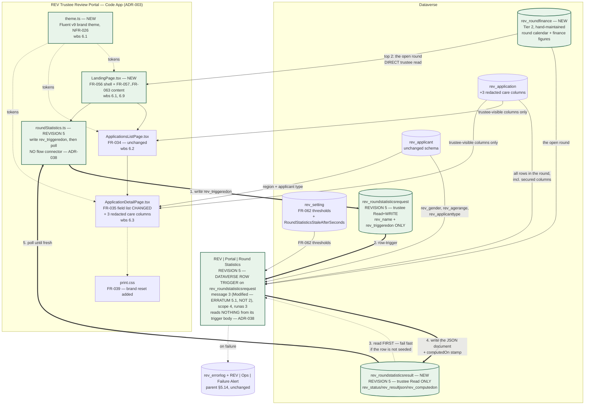
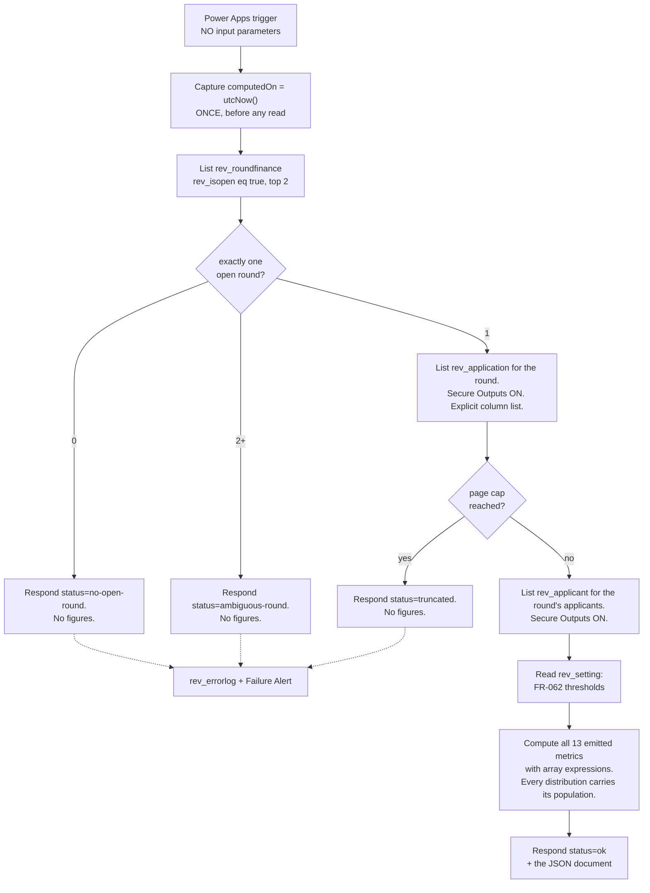

# Technical Architecture Document — Trustee Portal Visual Refresh and Round-Statistics Landing Screen

**Feature Slug:** `trustee-portal-visual-refresh`
**SDD Reference:** `docs/plans/revitalise-grant-automation-plan.md` — **Amendment A-02** (APPROVED 2026-08-24,
`wbs:6.1,6.3,6.5`), **Amendment A-03** (APPROVED 2026-08-25, `wbs:6.9`), including A-03's
**Resolution (continued)** of the same date, which rewords FR-061, and **Amendment A-05**
(APPROVED 2026-08-27, `wbs:6.3`), which reverses A-02's three data-minimisation exclusions on the
trustee detail screen and adds FR-078 and FR-079. The originally approved body of that SDD
is otherwise unchanged and is not re-derived here.
**Parent TAD:** `docs/architecture/revitalise-grant-automation-architecture.md` (APPROVED 2026-08-10, amended
since). **This document is a delta.** Every section states whether it *changes*, *extends*, or leaves
*unchanged* the corresponding parent-TAD section, and does not restate what the parent already settled.
**Date:** 2026-08-25, revised 2026-08-27 (Revisions 3 and 4), revised 2026-08-28 (Revision 5), corrected
2026-08-28 (**Erratum 5.1** — two factual corrections, no design change; §0.6), corrected again
2026-08-28 (**Erratum 5.2** — three factual corrections, no design change; §0.7), corrected again
2026-08-28 (**Erratum 5.3** — three requirement-coverage corrections, no design change and no scope
decision; §0.8), revised 2026-08-30 (**Revision 7** — closes `IMP-0510`; §0.10), revised 2026-08-31
(**Revision 8** — closes A-R24 for DEV build and DEV-only trustee display, by reviewer risk-acceptance;
§0.11), corrected 2026-08-31 (**Erratum 8.1** — one factual correction to ADR-041, no design change;
§0.12)
**Status:** DRAFT — **Revision 8** (releases the `rev_ethnicgroup` field permission and stops the flow
hardcoding `ethnicGroupDistribution` to `null`, both scoped to DEV; corrects a stale `OQ-027` citation to
`OQ-030`; §0.11). Not yet reviewed. Changes no table or column — one field permission (already declared in
source) and one flow expression.
**Erratum 8.1** (corrected 2026-08-31, §0.12) — ADR-041's own arithmetic claim that its 240px `auto-fit`
floor *"typically"* lands at 4 columns on the widths this screen is used at was disproved live: it renders
**6**, not 4, at ~1500px content width (the reviewer's own 6 + 2 report, `IMP-0526`). The CSS has since been
fixed with a container-relative floor (`app.module.css:988`) and a regression test exists for it
(`layout.test.ts`); this erratum corrects the ADR text to match. No design change and no re-opened decision.
Previously APPROVED — **Revision 7** (adds ADR-040, ADR-041, ADR-042; amends ADR-033, ADR-034, ADR-036;
closes OQ-040 with the reviewer's explicit typography override; §0.10). Not yet reviewed at time of
Revision 8. Changes no table, column, role, privilege or connector.
Previously APPROVED — **Revision 6** (adds ADR-039; approved by reviewer Xander Lykopoulos, 2026-08-28,
**with OQ-043 answered at the same gate: minimum group size `k = 5` for the four money-average measures** —
§0.9, §0.9.1). Supersedes nothing and changes no table, column, role, privilege or connector.
Previously APPROVED — **Revision 5 + Erratum 5.1 + Erratum 5.2 + Erratum 5.3** (approved by reviewer
Xander Lykopoulos, 2026-08-28; see `logs/routing.log` entries timestamped 2026-08-28 10:53, 12:24, 13:34
and **17:12**). Erratum 5.2 changes no decision this approval covers — it corrects three statements of
fact that the source contradicts, found by the new `design-doc-claims` build gate. **Erratum 5.3 likewise
changes no decision and takes no scope decision**; it corrects what Appendix A claimed was delivered.
**Erratum 5.3 changes no decision either, and it is the one a reader should not skip.** It corrects
Appendix A, which is the table a phase acceptance reads: three requirements it presented as covered were
**not** covered by what had shipped — FR-058 in part, FR-059 and FR-060 not at all. The design is unchanged
and Erratum 5.3 itself decided nothing about whether the missing figures got built. §0.8.
**SUPERSEDED IN PART, 2026-08-28 — read §0.8.1 with §0.8.** The reviewer then directed the build, and
`development-agent` delivered it under `wbs:6.9` the same day: **FR-058 is now covered in full**, and
**FR-059 and FR-060 are partial**. Only four money-average measures remain `null`, for a ground-truthed
platform reason (no `sum()` over a variable-length array in the workflow definition language), and the
choice of mechanism for them is an open architecture decision — **A-FLOW-08**, §0.8.1.
**REVISION 6, 2026-08-28 — APPROVED, AND OQ-043 IS ANSWERED IN THE SAME BREATH: `k = 5`.**
**ADR-039** decides the summation mechanism (a guarded `xpath(…,'sum(…)')`, §5.1.2) and re-affirms ADR-030's
Custom API rejection on its own unchanged terms. It also found that the four money measures are a
**disclosure shape §6.3's acceptance was not given for** — TAD §6.3.3's own tripwire makes suppression
mandatory for a statistic *within* a break type, while SDD FR-059 stated that *"no minimum-cell-size rule
applies"*. **The reviewer (Xander Lykopoulos) approved this document and set the minimum group size for the
four money-average measures to `k = 5`, 2026-08-28.** So the withholding is no longer pending: a money
measure is emitted where its own population is **≥ 5** and is `null` otherwise. §0.9, §6.3.5, A-R52,
ADR-039. **No table, column, role, privilege or connector changes.**

**What `k = 5` is NOT, stated here because the mis-reading is one sentence away.** It does **not** reinstate
NFR-027, which covered all of FR-059–FR-062 and therefore the *categorical* distributions too. Gender, age
range, applicant type, exceptional-circumstance mix, break-type **counts**, wellbeing and life-satisfaction
remain **unsuppressed**, on the reviewer's twice-given decision, which this revision never re-opened. `k = 5`
binds **four measures only** — FR-059's `averageAmountRequested` and FR-060's `averageCost`,
`averageAmountRequested` and `percentageOfCost` — because those are the only statistics on this screen that
are *conditional means of a money column* rather than one-dimensional marginals.
**WBS:** `6.1`, `6.2`, `6.3`, `6.5` (accepted tasks, `contract/wbs.json`) and `6.9` (created by
`contract/change-orders/CO-001.md`, resized by `contract/change-orders/CO-001-A1.md`; **not yet present in
`contract/wbs.json`** — see §0.3). Also serves `feature:trustee-portal-landing-page`, which is the feature
label CO-001 and Amendment A-03 use for the `6.9` half. **`6.2` is new in Revision 4** — it is an accepted
task in `contract/wbs.json` ("Build applications list screen"), so no change order is required for it to
enter scope, but §0.3 excluded it until now and no revision of this document has designed against it. §2.2
does.

**Model tier:** `strategic`, escalated from `standard` under `config/models.yml` →
`agents.architect-agent.escalate_to_strategic_when`. Two conditions are met, not one, and **both apply to
Revision 4 for the same reasons they applied to Revisions 1–3** — a visual pass over these screens is not a
lower-risk class of change than the data design was:

1. *Feature touches regulated data.* The landing screen aggregates over UK GDPR Art. 9 special-category
   columns (`rev_careprovidedtype`, the condition profiles, the wellbeing set) and over one column the
   trustee is deliberately denied at value level (`rev_applicant.rev_gender`). **Revision 4 restyles the
   surfaces that render those columns' redacted counterparts and the eleven restricted-field rows.** The
   regulated data does not become less regulated because the change is presentational.
2. *Custom security controls.* This design introduces a **second, privileged read path** whose output
   reaches a persona that cannot read its inputs. That is a new disclosure mechanism, not a new screen,
   and §6.3 is where it is resolved. **Revision 4 adds a second reason under this same heading:** two of
   this project's custom controls are *rendering* controls — the three-state redaction rule (§3.2.2) and
   the FR-078 field catalogue (§3.2.3, ADR-032). Both are defeated by a careless component swap without
   any query changing, any gate going red, or any column being unsecured. A control that lives in a
   component's JSX is exactly as load-bearing as one that lives in a `$select`, and considerably easier to
   delete by accident. §8.5 is where each is held.

**Amendment A-01 is PROPOSED, not approved.** Nothing here designs against its FR-013 replacement wording.
The originally approved FR-013 stands. A-01's evidence is nonetheless load-bearing for **FR-062** in one
narrow way, recorded at §5.2.

---

## 0. What changed in each revision, what this pass decides, and what it deliberately does not

**Revision 6 is at §0.9** — ADR-039: the money averages get a summation mechanism, and their disclosure
shape went to the reviewer as OQ-043 rather than being absorbed — **and was answered at the same gate,
`k = 5`, §0.9.1.** §5.1.2 and §6.3.5 are the two sections it adds; A-FLOW-08 closes and A-FLOW-11 opens.
**Erratum 5.1 is at §0.6** — two factual corrections to Revision 5, no design change.
**Erratum 5.2 is at §0.7** — three factual corrections, no design change. **`rev_ethnicgroup` exists**;
this document twice asserted the opposite, and §0.7 retracts both.
**Erratum 5.3 is at §0.8** — three requirement-coverage corrections, no design change. **Appendix A
overstated what shipped.** FR-058 was partial and FR-059 and FR-060 undelivered, all three
presented as covered; the Revision 5 row's *"No requirement gains or loses coverage"* was false of this
document as a whole. §0.8 corrects the rows, adds A-R51, and registers each gap in
`contract/tad-deferrals.json` — and took **no** decision about building the missing figures.
**§0.8.1 is the status update, and §0.8 must not be read without it.** The reviewer directed the build on
2026-08-28; FR-058 is now delivered in full, FR-059 and FR-060 are partial, and the only residue is four
money averages blocked by a platform limit rather than by scope (**A-FLOW-08**).
**Erratum 8.1 is at §0.12** — one factual correction to ADR-041 (Revision 7), no design change. ADR-041's
own comment claimed its 240px `auto-fit` floor *"typically"* lands at 4 columns on the widths this screen is
used at; that arithmetic was never solved and the shipped grid rendered **6 + 2**, not 4 + 4, at ~1500px
(`IMP-0526`). The retained sentence is marked, not deleted, per this document's own erratum convention.

**Revision 5 is summarised at §0.5 and is the second revision to reverse an approved decision of this
document.** It supersedes ADR-030 with **ADR-038**, retires A-R33 and A-R37, splits one table into two, and
redefines what "fresh" means on this screen. Revision 4 is at §0.4 and was the first such reversal
(ADR-026 → ADR-033). Subsection numbering below is left exactly as Revisions 2 and 3 left
it, because `docs/development/trustee-portal-visual-refresh-dev-summary.md` and `logs/routing.log` both cite
these anchors by number and renumbering them would break every citation to save a cosmetic ordering.

### 0.0 Revision 3 — SDD Amendment A-05, and the one thing in it that is a schema decision

**Revision 3 adds exactly one design decision and changes nothing Revision 2 settled.** SDD Amendment
A-05 (APPROVED 2026-08-27) extends FR-035 to show trustees every field of the printed board pack —
27 columns on `rev_application`. Twenty-two of those need no architecture: nine are already
`IsSecured=0` and simply get bound, eleven are `IsSecured=1` and inside `REV_TrusteeRestricted` so the
platform withholds them whatever the app asks, and `rev_narrativeraw`/`rev_narrativeredacted` is
already built and wired. **Five are a schema decision, and it is this revision's only new content:**
five free-text columns whose sources are secured and which have **no redacted counterpart at all**.
**ADR-031** decides them; **§3.2.2** is the specification.

**A-05 changes no column's classification, `IsSecured` value or profile membership**, and this
revision changes none either. It changes only which columns the app asks for, and adds five new
`IsSecured=0` counterparts that nothing writes to yet.

| # | A-05 content | Where it landed |
|---|---|---|
| **1** | **Five free-text columns have no redacted counterpart** (A-05 Finding 2; FR-079). `rev_unabletofundexplanation`, `rev_exceptionalfundingdetail`, `rev_otherexceptionalcircumstance`, `rev_otherconditionraw`, `rev_supportrecipientotherconditionraw` | **ADR-031, §3.2.2.** Five `…redacted` counterparts added to `rev_application`, shape copied from ADR-027's three. This is the only new schema in Revision 3 |
| **2** | **FR-078** — a withheld field renders a named restricted state, not an empty value | **§3.2.2 "the three-state rule"** extends ADR-027's released-but-empty sentence to a third case: *withheld by column security*, which the care-support panel never had to express because it never bound a secured column |
| **3** | **The nine unsecured and eleven secured columns are wiring** | **Not designed here — deliberately.** §3.1 already states the rule that governs them, and A-05 Finding 1 carries the per-column ground truth. Listing 20 column names in a TAD adds a second place for them to drift out of date (`tad-narrative-omits-an-already-existing-column`, x2) |
| **4** | **A-05 Finding 3 — parent §7.1's "never shown to trustees" was already wrong** for the two condition profiles | **Parent TAD §3.1 corrected** in this pass, since the row lives there. The control is unchanged; only its description was inaccurate |

**What Revision 3 does NOT do.** It does not re-open ADR-025/026/027/028/030, does not touch the
round-statistics half (`wbs:6.9`), and does not bind or unbind any secured column. It also does not
resolve `rev_ethnicgroup`'s live provisioning gap — see §12.1, where it is recorded as a pre-existing
out-of-scope finding rather than silently fixed (`C-COM-002`).

### 0.1 Revision 2 — the reviewer's four inputs and where each landed

Revision 1 went to the gate on 2026-08-25 and came back with three pieces of feedback plus one upstream
requirement change. This section is the audit trail; the design sections below are already revised.

| # | Reviewer input | Where it landed |
|---|---|---|
| **1** | **ADR-025 rejected as written.** *"no the landing screen should show the actual numbers. It can grab that directly from dataverse. so no dependency from other systems."* | **ADR-025 is superseded by ADR-030.** The daily batch job, the `rev_roundstatistic` table and the `rev_roundmetric` option set are **all removed**. Figures are computed **at the moment the screen loads**. §1.1, §1.2, §3.3, §5.1 |
| **2** | **Withdrawn-suppression risk acceptance extends to the gender chart.** *"Yes, the gender breakdown being determined automatically makes it even less faulty because it count's the inserted data of the dataverse tables."* | **§6.3 is now CONFIRMED, not an open question.** Risk **A-R27 is accepted and closed**. Applies identically under the live mechanism — §6.3 |
| **3** | **FR-035's care-support description: wire it now, do not defer.** | **ADR-027 amended** from "defer both" to **"ship the columns and the code-app wiring now, populate later"**. Three redacted columns are added to `rev_application` in this pass and bound by the app in this pass. §3.2, §3.2.1 |
| **4** | **FR-061's benchmark clause withdrawn** by plan-agent's amendment (SDD, `docs/plans/revitalise-grant-automation-plan.md` FR-061). *"there is no benchmark dataset. This is personal knowledge of the trustees."* | **All benchmark content removed** — the `rev_benchmarkpercentage` column, Revision 1's §5.3 snapshot mechanism, the `rev_setting` benchmark seed step, the benchmark column and second bar in §8.1, and every OQ-037 reference. OQ-037 is **closed**, not open |

### 0.2 The three decisions this pass makes

**1. NFR-026 (full-width, brand-consistent rendering) is a token substitution inside the app the project
already has — not a new design system.** The portal is already Fluent UI v9 plus CSS Modules. Fluent v9's
theme *is* a token contract, and this app's own stylesheet already reads those tokens
(`var(--colorNeutralBackground1)` and siblings in `src/styles/app.module.css`). So brand adoption is one new
`theme.ts`, one changed line in `main.tsx`, and one changed rule in `app.module.css`. No component changes,
no new dependency, and the WCAG 2.1 AA work in the parent TAD §8 survives intact. **This is the answer to
OQ-033.** ADR-026 — unchanged in Revision 2.

**2. FR-035's care-support free text stays secured, and its redacted counterparts ship now — column and
code-app wiring together, populated later.** Of the four columns Amendment A-02 names, two are structured
and already readable by a trustee, and three further free-text columns sit inside `REV_TrusteeRestricted`.
Releasing that free text would cross exactly the Art. 9 / identity boundary ADR-002 exists to hold. So this
pass adds the three `…redacted` counterparts and binds them in the app **now**, gated by the
`rev_redactionreleased` flag the narrative already uses, so that when Automation #5 begins writing them **no
further code-app deployment is required**. ADR-027, §3.2.

**3. Every round statistic (FR-058–FR-062) is computed live, on demand, at the moment the screen loads —
by one privileged read that never enters the browser, and stored nowhere.** The three obstacles Revision 1
raised are all still true and all still binding, but they force the computation to be **privileged and
server-side**; not one of them forces it to be **stale**. That distinction is the whole of Revision 2.
ADR-030, §1.1, §5.1.

### 0.3 What this pass does not do

- It does not touch the applications list (WBS 6.2 / FR-034), the verdict capture (WBS 6.4 / FR-037), the
  finalise-decisions flow (WBS 6.6 / FR-040), any existing table's relationships, any existing role's table
  privileges beyond the additive grants in §6.1, or the parent TAD's DLP policy, deployment topology or ALM
  route. Those sections are **unchanged and not reproduced**.
- It does not re-open NFR-027. The reviewer withdrew it on 2026-08-25 with a stated reason, and this document
  neither reinstates it nor designs a quiet equivalent. §6.3 records the reviewer's confirmation that the
  same acceptance covers the aggregate path.
- It does not build FR-061's ethnic-group distribution. **The column exists — corrected by Erratum 5.2;
  what is missing is data, a live field permission and DPIA sign-off, and emitting the figure is outside
  `wbs:6.9`.** §3.4, A-R24, §0.7.
- **It designs no benchmark comparison of any kind.** FR-061's benchmark clause is withdrawn (SDD FR-061,
  Amendment A-03 Resolution continued). Revision 1's benchmark column, seed step and snapshot mechanism are
  deleted rather than parked — there is no dataset and no owner, so parking them would be dead schema.
- It does not price anything. `wbs:6.9`'s hours are `contract/change-orders/CO-001-A1.md`'s; that sizing no
  longer matches this design in either direction, and §11 (A-R28) says how, for `commercial-agent` to act
  on. No figure — old or new — is restated here (`C-COM-008`).
- **`contract/wbs.json` still does not list task `6.9`.** Amendment A-02 flagged this on 2026-08-24 and
  A-03 carried it forward; it is still true. `wbs.json` is `pm-agent`/`commercial-agent`'s generated
  artefact, so this document cites `CO-001` / `CO-001-A1` for that task's existence rather than the WBS
  file, and the reconciliation stays open.

### 0.4 Revision 4 — the supplied design system is adopted in full, and ADR-026 is superseded

**What happened.** A design system was supplied at `Designsystem/Revitalise Design System/` — tokens, ten
components, and a five-screen UI kit of which three screens are a redesign of *this* app
(`ui_kits/trustee-review-portal/`). The reviewer was offered two paths: extend the existing Fluent theme's
custom properties (a token-only refresh, no architecture change), or adopt the design system's own components
and screen structures. After being told plainly that the token-only path would **not** visually match the
supplied mockups — the differences are component shapes, not only colours — the reviewer chose **full
adoption**. That reverses ADR-026, whose entire decision was *"theme Fluent … not a new design system"*.

**Revision 4 therefore does five things, and they are separable.**

| # | Decision | Where |
|---|---|---|
| **1** | **The design system is adopted as the app's component and token vocabulary.** ADR-026 is superseded, not amended — its decision and its negative consequence ("the app stays visually Fluent-shaped underneath the brand colours") were both correct, and the reviewer has now accepted the cost ADR-026 declined | **ADR-033**, §2.1 |
| **2** | **The supplied `.jsx` is converted into typed `.tsx` modules with CSS Modules, component by component.** Not consumed as a runtime global, and not ported with its inline `style` objects intact — both of those break things this app already asserts, mechanically and provably | **ADR-034**, §2.1 |
| **3** | **Where the design system's palette and the brand values Revitalise supplied disagree, the supplied values win, and the disagreement is reported rather than absorbed.** The design system was reconstructed from three screenshots and states so itself; the values in `theme.ts` were supplied directly by the charity | **ADR-035**, §8.4 |
| **4** | **The design system's Google Fonts CDN import is not adopted.** It is an external network dependency on a screen rendering Art. 9 data, and its two typefaces are flagged by the design system as guesses at fonts the charity has already told us the names of | **ADR-036**, §8.4 |
| **5** | **Four of the design system's own colour pairings fail WCAG 2.1 AA and are corrected before they ship.** Measured, not assumed — §8.4 carries the arithmetic for every pair, in the form `theme.ts` already established | **ADR-037**, §8.4 |

**WBS 6.2 enters scope for the first time.** §0.3's first bullet excluded the applications list; Revision 4
removes that exclusion, because the supplied UI kit redesigns that screen and the redesign cannot be built
without designing against the screen's real behaviour. `6.2` is an **accepted task** in `contract/wbs.json`
("Build applications list screen": *all eligible applications with score, region, dates, status; sortable and
filterable; reads live secured data*), so this is a scope *addition to this document*, not new work against
the contract, and `C-COM-002` needs no change order for it. §2.2 is its design section. Its sizing basis is
`commercial-agent`'s to re-confirm — see A-R38, and **no figure is restated here** (`C-COM-008`).

**What Revision 4 does NOT do.**

- **It changes no column, no query, no `$select`, no role, no flow and no schema.** Not one. Every
  requirement in §3, §4, §5 and §6 is untouched, and the `Entity.xml` tree is not opened. This is why
  Revision 4 adds no row to §12.1 and no `tad-deferrals.json` entry: there is nothing new for the
  prerequisite script to create.
- **It does not re-open ADR-027, ADR-029, ADR-030, ADR-031 or ADR-032.** ADR-029's table-first chart
  survives intact and §8.5 point 4 says exactly how; ADR-032's field catalogue keeps its build-time
  generator unchanged and §8.5 point 2 says exactly how.
- **It does not treat the supplied UI kit as a specification.** The three reference screens are static
  mockups with hardcoded sample data, no loading state, no error state, no empty state, no sorting, no
  filtering and no live region. They are evidence of **intended visual structure** and of nothing else.
  §8.5 enumerates the eight properties they drop, with a decision for each. Where a mockup and a shipped
  behaviour disagree, the shipped behaviour is the requirement and the mockup is restyled around it.
- **It does not resolve the Dev Summary's open approval.** `docs/development/trustee-portal-visual-refresh-dev-summary.md`
  is at **revision 0.6, status DRAFT** (its `**Status:**` line, and its revision chain's last entry, both
  read from disk 2026-08-27), with the unsigned approval block at its foot awaiting `APPROVED`. It covers
  A-05's three panels and the field catalogue, which Revision 4 designs *over* and does not replace. The two
  are independent. *(This bullet was drafted against a stale premise — "revision 0.5, at a CODE REVIEW
  REQUIRED gate" — carried in this revision's own dispatch brief. Corrected here by reading the file. The
  phrase `CODE REVIEW REQUIRED` appears in that document exactly once, as prose at its line 865 describing
  revision 0.2, and is not its status.)*
- **It writes no code.** No file under `src/code-apps/` is touched by this revision.

### 0.5 Revision 5 — the transport ADR-030 chose does not work on this platform, and the replacement needs a second table

**Revision 5 changes the mechanism, not the requirements.** Every figure FR-057–FR-063 asks for, every
metric name in §3.3's response contract, and every accessibility and visual decision Revisions 3 and 4 made
are unchanged. What changed is *how the app asks the question and how the answer gets back* — and, because
the new transport puts the answer in a Dataverse row rather than in an HTTP response, **who is allowed to
write it.** That second consequence is the one that needs a new table.

**Why it changed, stated as evidence rather than as a preference.** ADR-030 chose a solution-aware instant
flow on the Power Apps trigger, invoked by the Code App through the `shared_logicflows` connector. That
mechanism was built and pushed live, twice, and **crashed the trustee portal's boot both times** — *"The
app didn't start correctly"*, reproduced in a private/incognito session on two independent builds separated
by unrelated code changes. It is not a configuration error anyone has found: the connector is not offered
in the maker portal's Connections gallery at all, so there is no connection for a trustee to create, and
the V1 `kind: "PowerApp"` trigger publishes no *run only users* sharing surface a Code App can bind to. Two
clean reproductions is this project's own stated stop condition, and a third attempt with no new variable
is the pattern `logs/known-failure-modes.md` forbids.

| # | What Revision 5 decides | Where |
|---|---|---|
| **1** | **The flow becomes Dataverse-row-triggered, not Power-Apps-invoked.** The app writes a request row; the flow triggers on that write, computes, and writes its answer to a row the app reads. The trigger shape is copied from the one already proven live in DEV on the scoring flow. **This retires A-R33 and A-R37 and closes the DLP question outright** — the flow's only connector becomes Dataverse | **ADR-038**, §1.5, §5.1.1 |
| **2** | **The request/response slot splits into two tables.** `rev_roundstatisticsrequest` keeps the trustee's ask; a new `rev_roundstatisticsresult` carries the flow's answer, and the trustee holds **Read only** on it. This closes a live defect: today any trustee can overwrite the aggregate every other trustee sees, and `rev_resultjson` carries `IsAuditEnabled=0`, so the overwrite leaves **no audit trail at all** | **ADR-038**, §3.9, §6.1 |
| **3** | **"Fresh" becomes an age bound, not a request identity.** A new `staleAfterSeconds` field in the response contract, driven by a `rev_setting` row, so concurrent asks collapse into **one** privileged read instead of one each | **ADR-038**, §3.3, §5.3 |
| **4** | **The three disclosure properties §6.3 asserted become checkable controls.** No trigger-body read anywhere in the flow; the result document composed from an enumerated field list rather than a serialised row; and one new **accepted residual risk** recorded rather than solved | **ADR-038**, §6.3, A-R48 |

**What Revision 5 does NOT do.**

- **It does not re-open §6.3's risk acceptance, and it does not need to.** The disclosure is identical: an
  aggregate over a column the trustee is denied at value level. The reviewer's 2026-08-25 confirmation was
  mechanism-independent by its own terms and survives a third transport as it survived the second.
- **It does not re-open ADR-025, ADR-027, ADR-029, ADR-031, ADR-032 or ADR-033–ADR-037.** ADR-025 was
  retained as the documented fallback if flow invocation failed; that fallback is **not** what Revision 5
  takes — it keeps live computation and changes only how it is asked for. ADR-025 stays superseded.
- **It changes no metric, no percentage, no denominator and no chart.** §3.3's `metrics` object gains no key
  and loses none. `staleAfterSeconds` sits beside `metrics`, not inside it.
- **It writes no code and no flow JSON.** This revision specifies; `development-agent` builds. The one
  ordering instruction that must not be reversed is in §12.3: the live DEV flow was hand-edited in the
  designer and disagrees with source, so its definition is **captured and reconciled first**, before any
  session authors the new trigger.

### 0.6 Erratum 5.1 — two facts in Revision 5 were wrong, and no decision changes

**This is a correction, not a revision.** Both errors were found by `development-agent` while building
ADR-038, both were measured against live DEV on 2026-08-28, and both have been re-verified against source
here. **No ADR is superseded, no requirement moves, no component is added or removed, and the shipped
artefacts are already correct in the first case.** Recorded as its own subsection because a reader who
approved Revision 5 approved two statements that were false.

| # | What Revision 5 said | What is true | Where it is corrected |
|---|---|---|---|
| 1 | The Dataverse row trigger uses `subscriptionRequest/message: 2`, labelled *(Updated)* | **`message: 3`.** The option set is not `{Create, Update, Delete}` by position: **2 is DELETED, 3 is MODIFIED.** `2` would register a delete webhook on a row nothing ever deletes — a flow that never fires while reporting `Activated`, which is A-R47 reached by a wrong constant | §5.1.1 trigger row + **new requirement 6** · ADR-038 decision part 1 · §12.3 step 2 · new §12.2 row (**closed E1**) · §1.5 diagram · §3.9.1 point 2 |
| 2 | One privilege stays live after this change and needs a manual revoke | **Two do.** `prvReadWorkflow` was removed from `REV Trustee`'s source on 2026-08-27 — one revision earlier, by a different session, for a different reason — and was still bound Global in DEV on 2026-08-28. Revision 5 withdrew it in prose and closed its verification row as moot without ever sequencing its revocation | A-R49 · §6.1.1 (now a two-row table) · §12.1 absence read-back (now two) · §12.3 step 8 (now two `$ref` deletes) · §12.2 (new absence row; "moot" row re-scoped) · two stale §12 grant rows |

**The shipped flow is right; the approved document was wrong.** `development-agent` measured the enumeration
before authoring and built `message: 3`
(`Workflows/REVPortalRoundStatistics-8F1C2A44-1005-4B7A-9E21-0A1B2C3D4E05.json`, whose own trigger
description records the live provenance). So correction 1 costs no rework — it stops a future session
"restoring" the document's value and breaking a working flow.

**Correction 2 is the one with a lesson, and it is not about this privilege.** A-R49 was derived from
ADR-038's own design change rather than from a diff of role source against the live privilege set, so a
removal outside that frame was invisible to it. `scripts/verify-role-privilege-ownership.py` reads source and
passes, because every privilege *in* source is correctly owned; no gate in this repository compares source
against the live set. **A privilege removed from a role's source has not been removed** —
`ensure-schema.ps1` grants through `AddPrivilegesRole` and revokes nothing, as its own step-5 convergence
line at `provisioning/dataverse/ensure-schema.ps1:747-750` states. Every such removal therefore owes a named
`post_deploy` revoke plus an absence read-back that is *expected to fail first*.

**One thing this erratum deliberately does not touch: OQ-042**, the `RoundStatisticsStaleAfterSeconds` value.
It stays open and unseeded, pending the reviewer's own answer, and unseeded remains the fail-safe state
(§12.1, §5.3.1).

### 0.7 Erratum 5.2 — three statements of fact the source contradicts, and no decision changes

**This is a correction, not a revision.** All three errors were found mechanically by
`design-doc-claims`, a new HARD build gate wired at
`config/revitalise-grant-automation-build.yml:1121-1122` by improvement review 33, and each was
re-verified here against source before being changed. **No ADR is superseded, no requirement moves, no
component is added or removed, and no design position changes.** Recorded as its own subsection for the
same reason §0.6 was: a reader who approved Revision 5 approved three statements that were false.

| # | What the document asserted | What source says | Where it is corrected |
|---|---|---|---|
| 1 | §3.4 denied the existence of the `rev_applicant` ethnic-group column outright — "deliberately" — and quoted `rev_gender`'s description as its proof | **The column exists**, as `rev_ethnicgroup`. Built 2026-08-27 by reviewer direction: `Entities/rev_applicant/Entity.xml:336-349`, `OptionSets/rev_ethnicgroup.xml`, `Other/Solution.xml:148`, secured at `Other/FieldSecurityProfiles.xml:198-205`, and **written by the intake flow**. The sentence §3.4 quoted as proof was itself rewritten in that same change and is no longer in source — the proof had expired along with the claim | §3.4 (heading + body, now naming the **three** things actually missing) · §0.3 summary line · §5.1 contract note |
| 2 | A-R24 carried the same denial into the risk register, and prescribed "a new secured column" as part of closing it | Same as 1. The risk is real but **misdiagnosed**: a data, field-permission and sign-off gap, with no new column needed | A-R24 |
| 3 | §8.4.1 gave the `--warning` title's ratio as 3.18 | **3.16** — the WCAG 2.1 formula over `#c47a00` on `#fdf5e6`. The shipped `src/styles/ds-tokens.css:82` and `ds-tokens.test.ts:356` both carry 3.16, so **the document was the wrong copy** | §8.4.1 `--warning` row |

**Corrections 1 and 2 are one defect stated twice, and §12.1 already knew.** Revision 5's own §12.1 note
records the column as existing — verified live in DEV on 2026-08-27 — while §3.4 and A-R24, written
earlier and never revisited, still said it did not. That is `IMP-0379` precisely, and the lesson is not
about ethnicity: **when a later section of a document ground-truths something an earlier section asserted,
the earlier section is not "still roughly right" — it is wrong, and it is the one future readers reach
first.** §3.4 is what a reader consults to ask "can this be built?"; §12.1 is what they consult during a
deploy. The two audiences never overlap.

**The design position survives the correction, which is why this is an erratum and not a revision.**
`ethnicGroupDistribution` stays `null`, the screen still renders no ethnicity section, and the flow is
unchanged — because the column not backfilling makes every closed round empty regardless. The old wording
reached the right answer through a false premise, and a false premise that happens to agree with you is
the most expensive kind: it would have sent the next reader to an SDD reversal that is no longer needed.

**Correction 3 has a narrower lesson: only one figure was wrong, and a global replace would have broken a
correct one.** `3.18` appears twice in §8.4.1. The `--focus-ring` row two lines below states
`3.40 · 3.18 · 2.94 · 2.83 · 2.82`, and **all five recompute exactly** — that `3.18` is `#ec4ea3` on
`--surface-muted` and is right. Each figure was re-derived from the hexes its own row names before
anything was edited.

**Two further instances of correction 1 were found and deliberately NOT fixed here**, both outside this
document and both outside `wbs:6.9`'s scope (`C-COM-002`):

1. **`src/code-apps/trustee-review-portal/src/components/RoundStatistics.tsx:25-26`** states
   `ethnicGroupDistribution` is *"permanently `null`. There is no column and never has been (TAD §3.4,
   A-R24)."* It cites the two sections this erratum just corrected, and "permanently" is now wrong as
   well as "no column". It is a comment, not behaviour — the `null` it describes is still correct — so
   nothing renders differently and no gate reads it. **`development-agent`'s to correct** next time that
   file is opened; changing shipped Code App source from an architecture dispatch would put a rebuild and
   a test cycle inside an erratum.
2. **`docs/plans/revitalise-grant-automation-plan.md:1126`** (SDD FR-061) states *"the ethnic-group
   figure has no source data at all, because the charity has never collected the field"*. The collection
   half is now false. **`plan-agent`'s to correct**, since FR-061's wording is SDD content an amendment
   owns; the same line also carries two stale line-links (`#L363`, `#L924`) that no longer resolve to
   §3.4 or A-R24. **CORRECTED, Revision 8, §0.11: this paragraph's own citation of OQ-027 for "the DPIA
   half" was itself stale.** `OQ-027` (`docs/plans/revitalise-grant-automation-plan.md:2024`) is the
   *capture* question and is **RESOLVED**, 2026-08-27. The DPIA half genuinely still open is `OQ-030`
   (`docs/plans/revitalise-grant-automation-plan.md:2027`), gated "before go-live" — see §0.11 for the
   full correction and what it does and does not authorise.

**One thing this erratum deliberately does not touch: whether `ethnicGroupDistribution` should now be
built.** The column existing changes the cost of FR-061's last quarter from "SDD reversal" to "three
delivery steps", which is a **sizing question for `commercial-agent`** against `wbs:6.9` and A-R28's
already-flagged re-confirmation — not a decision an erratum may take.

---

### 0.8 Erratum 5.3 — Appendix A claimed coverage for three requirements the shipped flow does not supply

**This is a correction, not a revision, and it changes nothing about the design.** No ADR is superseded,
no component is added or removed, no column moves, and **no decision is taken about whether the missing
figures get built**. What changes is that the one table a phase acceptance reads now says what shipped.
Recorded as its own subsection for the same reason §0.6 and §0.7 were: a reader who approved Revision 5
approved a coverage claim that was false.

Found by `test-agent` as defect **D-11**
(`docs/tests/trustee-portal-visual-refresh-test-report-v4.md`), and **re-verified here against the flow
definition before anything was edited** — not accepted on the report's word.

| # | What Appendix A asserted | What the shipped flow composes | Where it is corrected |
|---|---|---|---|
| 1 | **FR-058** — *"Response `applicationsReceived` / `applicationsPerDay`"*, no marker | `applicationsReceived` is real — `length(outputs('List_applications_in_round'))`. **`applicationsPerDay` is a literal `null`.** No action computes an average per day | Appendix A FR-058 row — now **partial**, on the pattern FR-061 and FR-062 already use |
| 2 | **FR-059** — *"Response `exceptionalCircumstanceMix` / `exceptionalFundingSummary`"*, no marker | **Both are literal `null`.** Nothing computes either. FR-059 has **no delivered half at all** | Appendix A FR-059 row — now **undelivered** |
| 3 | **FR-060** — *"Response `breakTypeProfile` + its four measures and total row"*, no marker | **A literal `null`.** No action computes it | Appendix A FR-060 row — now **undelivered** |
| 4 | The **Revision 5** row: *"**No requirement gains or loses coverage**"* | **True of the transport change it describes; false of this document as a whole.** Revision 5 did not cause these gaps — they arrived one revision earlier — but that sentence is what told a reader not to look | Appendix A Revision 5 row — the claim is now scoped to the transport, with a pointer here |

**The gap is one-sided, and saying so is the point.** The *receiving* half of all four metrics is built,
tested and shipped: `roundStatistics.ts` parses each field, `RoundStatistics.tsx` renders each one's
absence, and `BreakTypeTable` exists and draws nothing on a `null`. The moment the flow composes a value,
the screen shows it with **no app change**. So this is not a half-built feature in two places — it is a
complete consumer with no producer, which is exactly why every source-side gate stayed green.

**Why this survived a full test cycle, and it is not that anyone was careless.** The four metrics were
scoped out in dev-summary revision 0.7 and disclosed honestly in
`docs/development/trustee-portal-visual-refresh-dev-summary.md` §7 prose. Appendix A was written earlier
and never revisited. **No gate in this repository reads Appendix A against the artefact that implements
it** — `verify-tad-coverage.py` reads §3.1's column table and the design-doc claim set, so a coverage
claim in Appendix A is checked at no strictness by anything. `IMP-0451` records this and proposes
extending that gate to Appendix A; **that promotion is `improvement-agent`'s, not this erratum's**, and
it is flagged rather than applied.

**The register entry could not go where D-11 asked for it, and this was measured rather than assumed.**
`contract/tad-deferrals.json`'s `deferrals` array is **column-shaped**: every entry is matched against an
absent §3.1 column, and its own `_stale_entries_fail` rule fails an entry that matches none. These three
gaps are keys inside a response document carried by a Memo column that **exists**, so no §3.1 column is
absent for them to match. Adding them to `deferrals` was tried against the real gate and it exits 1 —
*"defers nothing: no absent TAD §3.1 column on `rev_roundstatisticsresult` matches it"* — a HARD
`C-TECH-066` failure that would block every build. They are therefore recorded in a **new
`undelivered_requirements` key** (`UR-001`, `UR-002`, `UR-003`), each with an owner, a clearing action, a
dated expiry and its own `verify_by` command, and **that key states in its own text that no gate reads
it.** An entry in an unread key is a written record, not a control; the things holding it are the
Appendix A rows above and **A-R51**, added to §11 by this erratum.

**One thing this erratum deliberately does not touch: whether the four figures should be built.** Every
column they read already exists in source, and the app already renders them, so the cost is flow work
alone — which is a **sizing question for `commercial-agent`** against `wbs:6.9`, folding into A-R28's
already-flagged re-confirmation rather than opening a fourth one. `wbs:6.9` is a covered id
(`contract/change-orders/CO-001.md`, APPROVED), so **no new change order is needed for the work to
proceed** if that is the answer. **No figure is restated here** (`C-COM-008`, D-3). The alternative
answer — withdrawing FR-059 and FR-060, as FR-061's benchmark clause and NFR-027 were already withdrawn —
is `plan-agent`'s to record in the SDD, not this document's to assume.

**And the reason this matters more than a documentation tidy.** `C-COM-006` records client acceptance only
from a dated `CLIENT ACCEPTED`, which starts a warranty window and fixes a liability cap. An Appendix A
row reading as covered is precisely what would carry a Phase 3 acceptance above its evidence. The
correction is due **before any phase acceptance**, and it does not block the deploy — which is `test-agent`'s
own sequencing of D-11, kept here unchanged.

#### 0.8.1 STATUS UPDATE, 2026-08-28 — the reviewer chose to build, and two of the three gaps are now part-closed

**This subsection is no longer a description of current state. Read it with what follows.** The reviewer
directed the four figures to be built rather than withdrawn, and `development-agent` did so under `wbs:6.9`
the same day. Appendix A's three rows carry the resolved wording; this note exists so a reader arriving at
§0.8 first is not told a gap still stands that does not.

| Requirement | §0.8 said | Now |
|---|---|---|
| **FR-058** | `applicationsPerDay` a literal `null` | **DELIVERED.** Composed from the round's count over whole elapsed days since `rev_roundopenedon`, floored at 1. `UR-001` deleted as satisfied |
| **FR-059** | both fields `null`, no delivered half | **PARTIAL.** `exceptionalCircumstanceMix` delivered in full; `exceptionalFundingSummary` delivered except `averageAmountRequested` |
| **FR-060** | `breakTypeProfile` a literal `null` | **PARTIAL.** Per-type counts and a real total-row count delivered; the three money measures still `null` |

**One new fact changes what "undelivered" means for the remainder, and it is a platform contract, not a
scope choice.** §5.1 recorded that the flow *"reads the round's rows and tallies them with array
expressions (`length(filter(...))` **and equivalents**)"*. There is no equivalent for a sum: the workflow
definition language's math functions are `add, div, max, min, mod, mul, pow, rand, range, sub`, and `add`
takes exactly **two** operands. A sum over a **fixed** operand count is expressible by nesting `add()` —
which is why FR-060's total-row count *is* delivered — and a sum over a **variable-length** array is not
expressible at all. So the four remaining measures are all and only the ones that need a mean over a
filtered subset of the round.

**That makes the remainder an architecture decision, not a development backlog item**, and it is flagged
here rather than resolved: the candidates are an `Apply to each` accumulation (proven mechanics, but it
turns a declarative tally into ~900 sequential action executions and would break §3.3 point 5's *"reads as
seconds old"*), `xpath(xml(...),'sum(...)')` (one action, unverified on this tenant, and a silent `0` on
malformed input would put a **wrong money figure on a board pack**), or reopening ADR-030's rejection of a
Dataverse Custom API. Choosing between them trades a load-bearing property of an approved design against an
unverified platform contract, which is `architect-agent`'s call. ~~Recorded as **A-FLOW-08, OPEN**.~~
→ **A-FLOW-08 is RESOLVED by ADR-039, 2026-08-28. §0.9 and §5.1.2 carry the answer, and one half of the
question turned out not to be an architecture decision at all — see §6.3.5.**

---

### 0.9 Revision 6 — the money averages get a mechanism, and their disclosure shape is not the one §6.3 accepted

**Two decisions, and they are separable on purpose.** A-FLOW-08 asked which mechanism computes a mean over a
variable-length filtered subset. That is answered: **ADR-039** takes `xpath(xml(…),'sum(…)')`, hardened so
that neither of its two failure modes can reach the document. The second decision this pass will **not**
take: building it puts a **conditional mean of a money column** in front of a trustee for the first time, and
§6.3.3's own tripwire says in as many words that suppression *"becomes mandatory the moment any filter,
cross-tabulation or round selector enters this mechanism"* — naming *"within a break type"* — while SDD
FR-059 says, in as many words, *"No minimum-cell-size rule applies."* Two approved documents now disagree
about the same four figures. §6.3.5 argues which is right and why the answer is the reviewer's, not this
document's.

| What | Revision 6 |
|---|---|
| **The summation mechanism** | **DECIDED — ADR-039.** One presence `Filter array`, one `Select`, one `join`, one `xpath` `sum()`, one guarded `div` per measure. ~3 actions per sum, 13 sums, **~40 added actions** |
| **`Apply to each` accumulation** | **REJECTED**, and on arithmetic over documented constants rather than on a latency estimate. §5.1.2 |
| **ADR-030's Custom API rejection** | **RE-EXAMINED AND RE-AFFIRMED.** Its stated basis is unchanged, so it stands on its own terms, and it is still not an architect's to reopen. §5.1.2 |
| **The disclosure shape** | **DECIDED BY THE REVIEWER, 2026-08-28 — `k = 5`.** Raised by this pass as OQ-043 rather than absorbed (§6.3.5); answered at the same gate that approved the document. A money measure is emitted where its own population is **≥ 5**, `null` otherwise. **OQ-043 is ANSWERED**; A-R52's first exposure is closed by the threshold and its second is not, and stays recorded as such |
| **A-FLOW-08** | **RESOLVED.** Replaced by **A-FLOW-11**, which is narrower and genuinely unverified: whether this tenant's `xml()`/`xpath()` behaves as documented over a 434-element array |
| **A-FLOW-09, A-FLOW-10** | **UNCHANGED — both still OPEN, and neither is affected by the `k = 5` answer.** A-FLOW-09 is a charity-reporting definition awaiting one sentence from the reviewer or Emily; A-FLOW-10 is closable only by the first live run, which it now shares with A-FLOW-11. Recorded here so their staying open reads as a decision rather than an oversight |

**Three facts were obtained this pass rather than reasoned from, because the brief for it said so and because
this project's largest recurring failure class is a platform contract assumed rather than ground-truthed.**

1. **`xpath(…,'sum(…)')` is first-party documented, not a serialisation trick.** Microsoft's own function
   reference carries it as Example 7 — `xpath(xml(parameters('items')), 'sum(/produce/item/count)')` → `30`.
   §0.8.1 and the flow's notes both describe it as *"a serialisation trick this project has never
   ground-truthed"*; the first half of that is withdrawn, the second half stands.
2. **The engine is named, so its arithmetic is a standard rather than a mystery.** The same page states that
   *"all function expressions use the .NET XPath library … and support only the expression that the
   underlying .NET library supports."* `System.Xml.XPath` is **XPath 1.0**, whose `sum()` semantics are
   specified, not implementation-defined.
3. **So the dangerous cases were measured, against a conformant XPath 1.0 engine, on the exact XML shapes
   this data produces** — and they are worse than §0.8.1 predicted. `sum()` over an **empty node-set**
   returns **`0`**, indistinguishable from a true zero. `sum()` over a node set containing **one empty
   element** returns **`NaN`** — for the whole sum, not for that element. And `NaN` is not valid JSON, so a
   single blank money value would make `rev_resultjson` unparseable and take **all thirteen metrics** off the
   screen, not just the one.

**And the blank values are certain rather than hypothetical.** All three money columns are `RequiredLevel`
**`None`** in `Entities/rev_application/Entity.xml` — `rev_costs` at line 1391, `rev_amountrequested` at
1316, `rev_additionalamountrequested` at 1599 — so a real round will contain rows with no figure, and the
naive expression *will* meet one. ADR-039 therefore does not merely prefer `xpath`; it removes both failure
modes **at source**, which is the whole of why it is recommendable at all. §5.1.2 is the mechanism and
§12.2 carries the one step that must pass before any figure it produces is trusted.

#### 0.9.1 OQ-043 ANSWERED — `k = 5`, by reviewer decision, 2026-08-28

**The reviewer approved this revision and set the minimum group size in the same response:** *minimum group
size `k = 5` for the money-average figures.* The four measures are therefore no longer withheld pending a
question — they are **emitted where their own population is ≥ 5 and `null` below it**, and
`RoundStatisticsMoneyMeasureMinimumPopulation` is seeded with **5** rather than left unseeded (§12.1). This
subsection is the record of the decision; §6.3.5 carries the reasoning it answers and A-R52 carries what it
does and does not close.

**Four consequences, and the third is the one a later reader will get wrong.**

1. **`k = 5` ≥ 2, so every approved document stays true as written on the point §6.3.5 raised.** The SDD
   data-classification row's premise — *"no single application's data is shown"* — remains **true** of the
   implementation, because a mean is never published over fewer than five applications. The `C-DOM-001`
   alignment concern §6.3.5 identified is therefore **closed by the threshold**, not deferred.
2. **But the same SDD row's *other* sentence is now false, in the opposite direction, and that is `plan-agent`'s
   to correct.** It reads *"⚠️ No minimum-cell-size control is applied"*, and for these four measures one now
   **is**. Likewise FR-059's *"No minimum-cell-size rule applies"*. The correction is narrower than the
   original wording: a control applies to the money averages and to nothing else on this screen.
3. **This is NOT a reinstatement of NFR-027, and reading it as one would silently suppress six charts.**
   NFR-027 proposed suppression across FR-059–FR-062, which sweeps in every categorical distribution. The
   reviewer's 2026-08-25 decision on those stands untouched: gender, age range, applicant type,
   exceptional-circumstance mix, break-type **counts**, wellbeing and life satisfaction are **unsuppressed**,
   and no `k` is applied to any of them. `k` binds *conditional means of a money column*, of which there are
   exactly four.
4. **A-R52's second exposure is unchanged and remains accepted-by-record rather than mitigated.** `k = 5`
   closes the population-of-one case completely. It does **not** bound the two-poll delta, because that
   arithmetic works on differences between whole published sums regardless of how large each population is.
   §6.3.5 and A-R52 both say so, and neither presents the threshold as though it did more.

**Unaffected by this answer, stated so it is not assumed otherwise:** **A-FLOW-08** stays **RESOLVED** by
ADR-039; **A-FLOW-09** (the applications-per-day denominator convention) and **A-FLOW-10** (`ticks()` over a
date-only column) both stay **OPEN**, exactly as this pass left them. Neither is a disclosure question and
neither is touched by `k`. **A-FLOW-11** stays **OPEN** and is still what must pass before any figure this
mechanism produces is trusted (§12.2).

---

### 0.10 Revision 7 — the design-system intake gap (`IMP-0510`) is closed, and the reviewer overrides one written piece of design-system guidance

**Why this revision exists.** `IMP-0510` found that ADR-033's intake of `Designsystem/Revitalise Design
System/` read `components/` and `tokens/` but never enumerated the sibling
`ui_kits/trustee-review-portal/` directory — a dedicated, app-specific reference (`AppFrame.jsx`,
`TrusteePortalApp.jsx`, `RoundOverview.jsx`, `ApplicationsList.jsx`, `ApplicationDetail.jsx`, `README.md`)
created the same day as ADR-033, showing exactly the three screens this feature restyles. That gap shipped
the single most visible requirement wrong: headings in the app's sans stack instead of the display serif the
ui_kit — and the design system's own `tokens/fonts.css` — specifies. This revision reads that folder in full
and amends the design against it, ground-truthed against the `.jsx` source rather than against a description
of it.

**Five things this revision decides, against the ui_kit source named:**

1. **Real page-level navigation** — `AppFrame.jsx` and `TrusteePortalApp.jsx` show a persistent bar of three
   buttons switching between Round overview / Applications list / Application detail, not the shell's
   existing contextual "back" links. This is a new UI structure, not a token change: **ADR-040**.
2. **The stat-tile grid is bigger, at 2 rows of 4** — `RoundOverview.jsx:28` is
   `display: grid; gridTemplateColumns: repeat(4, 1fr)` over 8 tiles. The app's current
   `repeat(auto-fit, minmax(160px, 1fr))` (`app.module.css:761`) was chosen specifically to avoid a fixed
   4-column overflow at 320px (the comment at `app.module.css:754-756` says so). Both requirements are met
   by widening the minimum track and adding an explicit narrow-viewport collapse rather than by adopting the
   fixed `repeat(4, 1fr)` verbatim: **ADR-041**, which also adds the shrink-to-fit rule for a value that still
   does not fit at the larger tile size.
3. **Padding is corrected against the ui_kit's own values** — `AppFrame.jsx:6` uses
   `var(--space-5) var(--space-8)` for the header band and `:10` uses `var(--space-8)` for the page body;
   `RoundOverview.jsx:14` uses `var(--space-6)` for card padding. §0.10.1 grounds the app's current tokens
   against these and corrects the one mismatch found.
4. **Heading typography changes to the serif, heading colour does not — a deliberate reviewer override of
   the design system's own written guidance.** `tokens/fonts.css` maps `--font-display` to Playfair Display;
   `readme.md:75` separately instructs *"never navy"* for headings. **The reviewer has explicitly directed
   adopting the first instruction and overriding the second**, in the same breath: change `--font-display` to
   the Playfair Display stack, keep `--text-heading: #002060`. This is recorded as a deliberate deviation the
   reviewer made with the design system's own guidance in view, not as an unresolved inconsistency or an
   architect's error. It also reopens ADR-036, which rejected the design system's Google Fonts import for
   reasons unrelated to which typeface is used: **ADR-042** carries both the typeface adoption and how the
   ADR-036 objections are actually met, not waived.
5. **The "figures unavailable" notice is unchanged; a new subheading is added for the opposite case.**
   `RoundOverview.jsx:22-24`'s muted `Notice` for the unavailable state matches what `StateMessage`/`ds/Notice`
   already render for `view.statistics.kind === "diagnostic"` (§8.5 point 6) — confirmed correct, no
   amendment. What is missing is the **available** case: today `LandingPage.tsx:293-302` renders
   `<RoundStatistics>` directly under `kind === "figures"` with no heading at all. §0.10.2 adds a plain
   subheading, "Figures of this round", positioned above the statistics content and distinct from
   `RoundStatistics.tsx:347-352`'s `computedOn` freshness line, which stays exactly as it is beneath it.

**What this revision confirms is already built, and is not new scope.** The reviewer described bar/pie
charts against `Round 3`/`Round 4` deck data as still awaited. Reading `RoundStatisticsCharts.tsx` and its
use in `RoundStatistics.tsx` (Fix 3, 2026-08-27 — see that file's own header) shows `CategoryBarChart` and
`CompositionPieChart` already wired for gender, age range, applicant type, each wellbeing question and life
satisfaction, reachable whenever `response.status === "ok"` and the relevant metric is non-null. A live read
of the current DEV `rev_roundstatisticsresult` row (`rev_name=CURRENT`, `computedOn` 2026-08-30T19:52:59Z)
shows real, non-null distributions for exactly those metrics. **This is not a gap this revision closes** —
it is a V4 (live-render) check the reviewer has not yet re-run since the last push, not undelivered
architecture or undelivered code. No ADR is raised for it.

**What this revision deliberately does not do.** It does not reopen ADR-035's colour-authority resolution for
the primary pink (OQ-041 — untouched, still open, unrelated to typography). It does not revisit the
components ADR-033 already converted (`Button`, `Card`, `Input`, `Radio`, `Checkbox`) — the ui_kit uses them
exactly as converted, with no further divergence found on this reading. It does not change a table, column,
role, privilege or connector.

#### 0.10.1 Padding — grounding the app's current tokens against the ui_kit

| Ui_kit value | Where | This app's token today | Where | Verdict |
|---|---|---|---|---|
| `var(--space-5) var(--space-8)` — header band | `AppFrame.jsx:6` | `.header` carries no dedicated block padding of its own; it sits inside `.page`'s `padding: var(--space-4) clamp(var(--space-4), 4vw, var(--space-12))` (`app.module.css:47`) | `app.module.css:42-47` | **Mismatch.** `--space-4` (16px) is one step below the ui_kit's `--space-5` (20px) vertical band padding, and the fluid `clamp()` horizontal value is this app's own considered choice (NFR-026's fluid shell, no `max-width`) rather than the ui_kit's fixed `--space-8`. **ADR-041 corrects the vertical figure to `--space-5`** on the header band specifically, and leaves the fluid horizontal clamp in place — collapsing it to a fixed `--space-8` would reintroduce the 320px overflow the fluid shell was built to avoid |
| `var(--space-8)` — page body | `AppFrame.jsx:10` | `clamp(var(--space-4), 4vw, var(--space-12))` upper bound is `--space-12`, not `--space-8` | `app.module.css:47` | **Not a mismatch requiring a change.** The ui_kit's `--space-8` is a fixed desktop-only figure (no responsive behaviour in a static mockup); this app's `clamp()` already reaches beyond it on wide viewports by design (NFR-026) and narrows below it by design at small ones. No correction |
| `var(--space-6)` — card padding | `RoundOverview.jsx:14` | `.panel` (Round progress / Exceptional circumstances / etc.) already uses `padding: var(--space-6)` | `app.module.css:371` | **Match. No change** |

#### 0.10.2 "Figures of this round" — the subheading for the available case

`LandingPage.tsx`'s statistics region (`:285-303`) renders three mutually exclusive states under
`view.statistics.kind`: `"loading"` (a `Spinner`), `"diagnostic"` (`StateMessage`, unchanged per point 5
above), and `"figures"` (`<RoundStatistics response={...} />`, today with no heading at all above it).

**Decision.** Add a plain `<h2>Figures of this round</h2>` immediately before `<RoundStatistics>` in the
`"figures"` branch only — not inside `RoundStatistics.tsx`, and not replacing anything, because nothing
occupies that position today. It sits **above** the tile grid and charts and **above**
`RoundStatistics.tsx:347`'s own `<p className={styles.freshness}>` "Round figures computed on…" line, which
is unconditionally the first thing `RoundStatistics` itself renders — the two remain visually and
structurally distinct exactly as TAD §8.3 already requires of the two freshness statements elsewhere on this
screen. `<h2>`, not `<h3>` or a styled `<p>`, because §8.3's heading hierarchy already reserves `<h2>` for
this screen's sections (`Round progress`, `Exceptional circumstances`, etc., rendered as `Panel heading=`)
and this is a section header of the same rank, one level above them. Typeset with the same
`--font-display`/`--text-heading` rule as every other `<h2>` on this screen (ADR-042) — no new type rule is
introduced for one heading.

### 0.11 Revision 8 — A-R24 closed for DEV build and DEV-only trustee display; TST/ACC/PRD stay gated on OQ-030

**Why this revision exists.** The reviewer (Xander Lykopoulos) risk-accepted closing A-R24 now rather than
holding it, 2026-08-31 (`logs/routing.log`, 17:48 entry), in these words: *"Ethnic group is on the applicant
table right now. I already approved that last week somewhere. It's captured right now too. and the
statistics show a percentage in relation to the total number of applications in that round. So already less
easy to deduct back to a person. So please, include."* This is a build-order decision on an
already-identified, already-priced risk (A-R24, §3.4, §11), not a new architecture decision — no table,
column, role or connector changes, and `wbs:6.9`/`CO-001-A2` already price the ethnic-group chart as
in-scope chart-visualisation work (`contract/change-orders/CO-001-A2.md`, FR-057–063 scope), so **no new
change order is needed.**

**What the reviewer's instruction actually resolves, and what it does not.** §3.4 named three things keeping
`ethnicGroupDistribution` at `null`: no data, an unreleased field permission, and open DPIA sign-off. The
reviewer's instruction speaks to the *disclosure* concern only — the same percentage-of-population reasoning
already accepted for gender, age range and applicant type (OQ-035, §11 A-R48) — and to confirming the field
is genuinely captured. It does not, and cannot, stand in for the DPO's own sign-off step:

1. **Capture is resolved, and was resolved before this instruction.** `docs/plans/revitalise-grant-automation-plan.md:2024`
   — `OQ-027` (*"is ethnic group actually captured?"*) is **RESOLVED 2026-08-27**, reviewer's own words on
   record, `rev_ethnicgroup` exists on `rev_applicant`, secured under `REV_TrusteeRestricted` exactly like
   `rev_gender`. This revision's reviewer quote above reconfirms the same fact in different words — it is
   not a second, independent resolution of `OQ-027`.
2. **The field permission is this dispatch's to release**, not a pre-existing gap merely noted. §12.1
   already recorded it live-verified 2026-08-27: 51 permissions live against 52 in source, and
   `rev_ethnicgroup` is the missing one — confirmed against `Entities/rev_applicant/Entity.xml:336-349` and
   `Other/FieldSecurityProfiles.xml:198-205`, the same source cited at §3.4. That note previously read the
   release as **out of `wbs:6.9`'s scope**; Revision 8 brings it **into** scope, released by the same
   `ensure-schema.ps1` run §12.1 already names, because the permission is declared in source already — no
   script change, one provisioning run. §12.1 is amended below.
3. **`OQ-030`, not `OQ-027`, is the item that stays open, and it gates go-live, not this build.**
   `docs/plans/revitalise-grant-automation-plan.md:2027` — `OQ-030` (*"the DPIA outcome and residual-risk
   acceptance are not recorded… When will the DPIA be formally concluded?"*) is gated **"Before go-live
   (Art. 35)"**, not before DEV build or DEV-only trustee use. §3.4 point 3 and the A-R24 row (§11) both
   cited **`OQ-027`'s DPIA sign-off** — that citation was already stale the day it was written (`OQ-027` is
   the *capture* question and was never the DPIA question) and is corrected below to `OQ-030` rather than
   carried forward. Nothing about this correction reopens `OQ-027`.

**Decision — three changes, DEV-scoped:**

1. **Release the `rev_ethnicgroup` field permission**, per §12.1's existing (and now in-scope) prerequisite
   run. `identity-agent`/provisioning work, `ensure-schema.ps1 -Env dev`; verify with the same
   `fieldpermissions` read-back §12.1 already specifies, now expected to show **52/52** in DEV.
2. **The flow stops hardcoding `ethnicGroupDistribution` to `null`.** `REVPortalRoundStatistics`
   (`Workflows/REVPortalRoundStatistics-8F1C2A44-1005-4B7A-9E21-0A1B2C3D4E05.json:1360`) builds its response
   with a literal `'"ethnicGroupDistribution":null'` segment, alongside `Compose_gender_categories`,
   `Compose_agerange_categories` and `Compose_applicanttype_categories`, each of which **is** computed and
   fed into its own `…Distribution.categories` array on the same line. Add a `Compose_ethnicgroup_categories`
   action on the same pattern — grouping `List_applications_in_round`'s rows by `rev_applicant/rev_ethnicgroup`
   and expressing each group as a percentage of `populationReceived`, exactly as the three delivered
   distributions already do — and replace the literal `null` with
   `{"population":<count>,"categories":<Compose_ethnicgroup_categories output>}`. The option-set labels are
   already ground-truthed against `Round 3 Stats.pptx`'s own "Ethnic Group" chart (§3.4: six categories
   summing to exactly 1.0), so no new label-mapping decision is needed — this is the same shape of work as
   FR-061's other three distributions, not a new mechanism. `automation-agent`'s to build.
3. **Explicit scope: DEV build and DEV-only trustee display only.** Promotion to TST/ACC or PRD still
   requires `OQ-030` (DPIA sign-off) closed first. This is the same shape as `EX-003`
   (`contract/known-exceptions.json`) — a reviewer-directed build-ahead-of-sign-off, scoped to DEV, with an
   explicit `clears_when` condition rather than a silent promotion path. Unlike `EX-003`, this is not itself
   a gate exception this document can record — `contract/known-exceptions.json` is owned per `C-COM-010`,
   and no build or deploy gate currently matches on "ethnic-group data present in a non-DEV environment" the
   way `wbs-ready-set` matches `EX-003`'s DPO-sign-off gap. **Recorded here as a TAD-level scope boundary,
   flagged to `commercial-agent`/`lead-agent` for whether a companion `contract/known-exceptions.json` entry
   (`EX-005`, on the `EX-003` shape: `owner`, `clears_when: OQ-030 closed`, a dated `expires`) should be
   opened alongside this revision** — this document does not open that file itself.

**What this revision does not do.** It does not release any other field permission, does not touch the
`REV_TrusteeRestricted` profile beyond the one column already declared in source, does not change
`rev_ethnicgroup`'s data classification (§7.1 is unchanged), and does not close `OQ-030` — that remains
Emily/DPO's own step, unaffected by this decision, and this design still renders nothing for
`ethnicGroupDistribution` in any environment where the flow has not been changed or the permission has not
been released.

### 0.12 Erratum 8.1 — ADR-041's own column-count arithmetic was wrong, and this corrects the text, not the design

**This is an erratum, not a revision: it changes no decision, no table, no column, no role, no privilege and
no connector.** It corrects one disproved sentence inside ADR-041 (§10) to match the fix that has already
shipped elsewhere.

**What was wrong.** ADR-041 (Revision 7, §0.10 point 2) raised `.statTiles`'s `auto-fit`/`minmax` floor from
160px to 240px and its own decision text asserted this lands at *"typically 4, matching the ui_kit, on the
widths this screen is used at today."* That arithmetic was never solved: `auto-fit` fits as many tracks as
the stated floor allows, and an absolute 240px floor can only move where the grid **reflows**, never cap how
many columns it **tops out at**. At the ~1500px content width this portal is actually used at, 240px admits
**six** columns, not four — the reviewer measured the shipped screen live and reported eight tiles laid out
**6 + 2**, on both the FR-063 financial panel and the "Round progress" row, not the 4 + 4 the ADR predicted.

**The retained sentence, per this document's own erratum convention (§0.7, Erratum 5.2).** ADR-041's
disproved sentence is left in place at §10 rather than deleted, and marked inline at the point it occurs —
consistent with how §3.4 handles `rev_ethnicgroup`'s now-corrected, false "does not exist" claim: retained
and marked as disproved, not silently rewritten.

**What actually fixes the column count, and already shipped.** `app.module.css:985-994` no longer states a
purely absolute floor. The floor is now `max(240px, (100% - 3 * var(--space-4)) / 4)` — container-relative as
well as absolute, so a track can never be narrower than a quarter of the row and a fifth column cannot fit at
any width. The grid tops out at exactly 4 and lands 8 tiles as **4 + 4**; below ~1000px the 240px absolute
half of the `max()` takes over again and `auto-fit` collapses to 3, then 2, then 1 exactly as ADR-041 already
required, so the WCAG 1.4.10 guarantee (`app.module.css:754-756`, unchanged) is unaffected. A regression test
for this arithmetic exists at
`src/code-apps/trustee-review-portal/src/styles/layout.test.ts`.

**Why this is now a gate, not only a fix.** `C-TECH-076` was broadened to the general class — a `repeat(
auto-fit|auto-fill, minmax(<floor>, …))` floor stated in purely absolute units sets a minimum track WIDTH and
can never cap a column COUNT — and now names `architect-agent` in its Applies-To column
(`constraints/technology/technology-constraints.md:146`). `scripts/verify-css-arithmetic.py` (build step
`css-arithmetic`) checks this mechanically; the fix above satisfies it because its floor carries a
container-relative term.

**What this erratum does not do.** It does not reopen ADR-041's decision to widen the floor from 160px to
240px, its shrink-to-fit clamp rule, or its flagged, still-unresolved §12.2 container-query platform-contract
verification row — all three stand exactly as Revision 7 left them. It does not touch §0.11, A-R24 or
`rev_ethnicgroup`. It takes no scope or sizing decision and restates no figure (`C-COM-008`).

---

## 1. Architecture Overview

### 1.1 Live does not mean client-side: what the three obstacles actually force

This is the decision Revision 2 turns on, so it is argued from ground truth rather than asserted, and one
claim Revision 1 made is corrected rather than repeated.

A Power Apps Code App runs **as the signed-in user**. Its Dataverse reads carry that user's privileges and
that user's column security. The portal's whole anonymisation control (ADR-002) is that the `REV Trustee`
role is **not** a member of `REV_TrusteeRestricted`, so the 51 columns that profile governs come back empty
for a trustee no matter what the app asks for.

| # | Obstacle | Ground truth | What it forces |
|---|---|---|---|
| **A** | **The column-security ceiling.** FR-061 requires a gender distribution. `rev_applicant.rev_gender` is `IsSecured=1` and is one of the 51 field permissions in `REV_TrusteeRestricted`. A trustee reads `null` for every row, so a browser-side tally returns nothing. Dataverse has no "release in aggregate only" mode: column security is per value | `Entities/rev_applicant/Entity.xml`; `Other/FieldSecurityProfiles.xml` | **A privileged identity must do the counting.** Nothing else can. This obstacle alone is decisive |
| **B** | **A population mismatch between FR-058 and FR-038 — and the reason is design, not privilege.** FR-058 asks for *"the current round's total applications received"*; FR-038 restricts a trustee to applications *eligible for review*, and the app's server filter is literally `rev_eligibleforround eq true` (`src/dataverse/repository.ts:48`) | **Correction to Revision 1.** `REV Trustee` holds `prvReadrev_application` at **Global** (`Roles/REV Trustee/REV Trustee.xml:196`), so the platform would *permit* the wider read. Revision 1 described this as something the trustee "cannot" do; the truth is that it must not, and the app deliberately does not | **The wider read must not reach the browser.** That it is technically available makes the case stronger, not weaker: computing FR-058 client-side means putting out-of-remit application rows on the wire to a trustee's device to be counted and discarded. A privileged server-side count never exposes them |
| **C** | **The app's own read cap, and no server-side aggregation to escape it.** The read path caps at 500 rows and raises `TruncatedListError` beyond it (`src/dataverse/client.ts:73`, `MAX_ROWS = 500`). `Round 3 Stats.pptx` reports 434 applications in one round — inside the cap, but not by much. And the escape hatch does not exist: the generated `IGetAllOptions` the typed services accept has `select`, `filter`, `orderBy`, `top`, `skip`, `count` and `skipToken` — **no `apply`**, so OData `$apply` / `groupby` / `aggregate` is not expressible through this app's data layer at all | `src/generated/models/CommonModels.ts` → `IGetAllOptions` | **The row read must happen somewhere with no 500-row ceiling.** A flow's `List rows` has no such cap |

Obstacle C's second half is worth stating plainly because it is the kind of thing that gets assumed either
way: the absence of `apply` is read from the **generator's own output on disk**, which is an artefact the
platform produced, so it is E1 evidence and not a documentation guess
(`skills/how-to-verify-a-platform-contract.md`). The one aggregation affordance that *is* available —
`count?: boolean` — carries its own generated comment saying Dataverse caps it at 5000, and it cannot help
with a distribution over a column the reader is denied.

**What Revision 1 got wrong was not the obstacles — it was the inference.** All three say *who* must
compute: an identity holding `REV Service Automation`, which **is** a profile member and therefore reads
gender, and which reads `rev_application` and `rev_applicant` unfiltered by round eligibility. **None of
them says *when*.** Revision 1 answered "who" correctly and then, without a stated reason, chose a nightly
batch and an intermediate table — which imported staleness, a moving part and a stored copy that no
obstacle required. Revision 2 keeps the privileged reader and deletes the schedule.

### 1.2 The mechanism: one synchronous privileged call, per page load

> ⚠️ **SUPERSEDED IN ITS TRANSPORT HALF by §1.5 and ADR-038, 2026-08-28.** The two paragraphs about
> `pa app add flow`, the `shared_logicflows` connector and the *"run only users"* connection setting
> describe a mechanism that was built, pushed live twice and crashed the app's boot both times. **The two
> bulleted properties below survive intact and are the reason ADR-038 is a transport change and not a
> redesign:** the flow still accepts no input of any kind, and the privileged read still happens on the
> flow's own identity rather than the caller's. §1.5 says how each is delivered now. Retained rather than
> rewritten, on ADR-025's and ADR-026's precedent — the argument was correct on the evidence it had, and the
> record of what was tried is what stops a third attempt.

The code app calls a **solution-aware instant cloud flow using the Power Apps trigger**, which computes
every figure over the open round and returns them in its response. Nothing is written; nothing is stored;
the figures are as old as the page.

**This is a first-party, CLI-generated data source, not a hand-rolled call.** `pa app add flow --flow-id
<id>` downloads the flow's OpenAPI definition, generates a typed TypeScript service with a static `Run`
method, and registers the flow and its connection references in `power.config.json`. The app's installed
`@microsoft/power-apps` is **1.3.0** (`src/code-apps/trustee-review-portal/package.json`), above the
documented **1.1.1** minimum. This matters for a HARD constraint: `C-TECH-048` permits Code App data access
only through a CLI-generated managed data source and forbids hand-rolled token acquisition — an HTTP-trigger
URL with an embedded SAS key, which is how `knowledge/technology/power-automate.md` currently says this is
done, would have violated it. `pa app add flow` complies by construction.

**Why the privileged read stays privileged.** The flow's Dataverse actions execute through the flow's own
connection reference — the service identity's connection — not the invoking trustee's. The trustee supplies
only the act of asking. Two consequences, both designed for rather than discovered:

- **The flow accepts no input parameters at all.** It derives the open round itself from `rev_roundfinance`.
  There is no round key, no filter and no column list a caller could steer, so the privileged read has no
  parameter surface to abuse. A trustee can ask this question and no other.
- **The "run only users" connection setting is the control that makes it work**, and it is environment
  state that solution source cannot express (`C-TECH-064`). If it is ever set to *provided by the run-only
  user*, the flow reads as the trustee, `rev_gender` returns null, and the gender chart renders empty while
  every gate stays green. §12.2 makes that a V5 assertion with a named falsifiable check, and A-R33 carries
  the risk.

**One mechanism for all seven requirements, not a mixed model.** FR-060 and FR-062 *could* be computed
client-side — every column they need is unsecured and inside the trustee's own visible set. A mixed design
was considered and rejected for the same reason as in Revision 1, and it survives the move to live
computation unchanged: **the tiles would have different denominators and nothing would reconcile them.**
FR-058's "applications received" counts the received population; a browser-side FR-060 break-type table
counts the eligible-and-released population. Both numbers would be correct and the screen would be lying —
which is the `hand-maintained-count-drifts-from-source` class this project has already recorded eight times.
One call, one population, one instant.

**What live costs, stated before anyone discovers it.** The landing screen is no longer the cheapest read in
the app; it is a flow invocation that reads the round's rows on every load. Revision 1's design was O(1) at
page load and stale; this one is O(n) at page load and current. The reviewer chose currency, and §7's
NFR-021/NFR-022 rows are rewritten accordingly rather than left claiming Revision 1's performance.

### 1.3 The one design the reviewer's framing would have permitted, and what it costs

Stated because "grab that directly from dataverse" deserves a straight answer rather than a reinterpretation.
There **is** a version of this screen with no server-side hop at all: compute every figure in the browser
over the ≤500 rows a trustee may already see. It requires giving up, in order — the **gender chart entirely**
(obstacle A, and the reviewer's input #2 explicitly wants that chart), **FR-058's received count** (obstacle
B — or else shipping out-of-remit rows to the browser), and **any headroom past 434 applications** (obstacle
C). Two of those three losses are requirements the reviewer has just re-affirmed. So the privileged hop is
kept, and it is now synchronous, unscheduled, un-stored and inside the same solution.

### 1.4 Solution boundary — changes in one respect

No new external system, no new connector, no new app registration, no new tenant dependency. What *is* new
is an **intra-solution invocation path the app did not have before**: the Code App calls a cloud flow. Today
the app's only data path is Dataverse (`power.config.json` declares exactly one connection reference,
`shared_commondataserviceforapps`, and four table data sources). `C-TECH-045` (DLP) therefore needs a
positive statement rather than an "unchanged": §4 gives it.

### 1.5 The mechanism, Revision 5 — the app asks in a row and reads the answer in a row (ADR-038)

**Supersedes §1.2's transport half.** Nothing invokes anything. The app **writes** one datetime onto one
row; a Dataverse row-trigger starts the flow; the flow computes and **writes** the §3.3 document onto a
*different* row; the app reads that row. Four properties, and the order matters because each one closes
something the previous mechanism left open:

1. **The app's only connector stays Dataverse.** `power.config.json` gains one further *table* data source
   on the connection reference it already declares — `shared_commondataserviceforapps` — and no second
   connector type. That distinction is the whole of why this design is expected to boot: adding a new
   connector type is the operation that crashed this app twice; adding a table on the connector already
   there was performed on this app on 2026-08-27 without incident.
2. **The flow's only connector is also Dataverse.** Its trigger is `OpenApiConnectionWebhook` on
   `shared_commondataserviceforapps`, and so is its write-back. `C-TECH-045` therefore has nothing left to
   verify: there is no second connector group to mix with, and the DLP question §4 carried as a policy fact
   this document cannot read is **closed by removing the connector that raised it**, not by reading the
   policy.
3. **The privileged read stays privileged, and its control moves from environment state into source.** The
   flow's identity comes from `subscriptionRequest/runas: 3` — *flow owner* — the same value already proven
   live on `REV | Scoring | Calculate & Flag`. This is a **better** position than §1.2's: *"run only users"*
   was configuration no solution file could express, which is exactly why A-R33 existed. `runas` travels in
   the workflow JSON and is diffable. **What does not change is the check**: `runas: 4` packs, imports and
   reports Activated while registering no webhook at all, so the assertion is still an observed effect and
   still the gender reconciliation — see A-R45, which replaces A-R33 rather than deleting its question.
4. **The flow still takes no input of any kind, and now that is a property of the design rather than a
   promise about it.** §1.2's claim was *"no round key, no filter, no column list a caller could steer."*
   Under a row trigger the flow is *handed* a trigger body containing the row and its modifier, so the
   claim needs teeth: **the flow reads nothing from its trigger body.** No `triggerBody()`,
   `triggerOutputs()` or `@triggerBody` reference anywhere in its definition; it re-reads what it needs by
   its own queries. That is checkable by inspecting one file, and §6.3 makes it a build assertion.

**What the app gives up, stated before anyone discovers it.** §1.2's call was synchronous — one request, one
response, one round trip. This one is not: the app writes, then polls, and a computation that outruns the
poll bound returns `status: "pending"` rather than figures. The screen is honest about it and the wording
already exists, but a trustee can now press **Refresh figures** and be told *"still working"*, which was not
possible before. §5.3 is where that is bounded and §5.3's freshness rule is what stops it becoming common.

---

## 2. Component Diagram — extends parent §2.2

Only the changed neighbourhood is drawn. Everything else in the parent's component diagram is unchanged.



**The asymmetry in that diagram is still the design.** The flow reads columns the app never touches and
hands back only counts.

**Two claims in this diagram's original caption are corrected by Revision 5, not softened.** *"No aggregate
is stored anywhere"* is no longer true: the current aggregate is stored, in `rev_roundstatisticsresult`, as
one row overwritten on every computation. What that costs and what it buys is settled at §6.4 — it is a
single-row store, not the history ADR-025 proposed, so the privacy position sits between Revision 1's and
Revision 2's rather than at either end. And the arrow between the app and the flow is gone in both
directions: they now communicate only through two rows, which is why the boot failure that killed ADR-030
cannot recur here.

**The asymmetry that carries the security decision is the pair of table nodes.** The app writes the
*request* table and only reads the *result* table. The flow reads the request table and only writes the
result table. Neither ever writes what the other writes, and neither writes the table it triggers on.
§3.9 is the schema, §6.1 the privileges, and §6.3 why the split is a control rather than tidiness.

*(The two subsections below are new in Revision 4. They are this document's own §2.1 and §2.2; the parent
TAD's §2.2, which §2 as a whole extends, is a different section in a different file.)*

### 2.1 The design-system component layer — ADR-033, ADR-034 (Revision 4)

**Serves:** `wbs:6.1` (the visual pass), and every screen under `6.2`, `6.3`, `6.9` as a consumer.

#### 2.1.1 What was actually supplied, read rather than assumed

The design system is a **browser-prototype kit, not a library.** Ground truth, read from disk 2026-08-27:

| Fact | Evidence |
|---|---|
| Components are registered on a global namespace and consumed by destructuring it | `_ds_bundle.js:5` — `const __ds_ns = (window.RevitaliseDesignSystem_a4dff3 = window.RevitaliseDesignSystem_a4dff3 \|\| {});` and e.g. `ui_kits/trustee-review-portal/RoundOverview.jsx:1` — `const { Button, Notice, StatTile } = window.RevitaliseDesignSystem_a4dff3;` |
| Screens register themselves the same way | `RoundOverview.jsx:42` `window.RoundOverview = RoundOverview;`, and the same line in `ApplicationsList.jsx:66`, `ApplicationDetail.jsx:77`, `AppFrame.jsx:14` |
| React itself is a global, not an import | `ui_kits/trustee-review-portal/TrusteePortalApp.jsx:1` — `const { useState } = React;` |
| It is compiled by Babel **in the browser**, from `<script type="text/babel">` | `ui_kits/trustee-review-portal/index.html:11-15` |
| React, ReactDOM and Babel come from a public CDN | `ui_kits/trustee-review-portal/index.html:4-6` — three `unpkg.com` `<script>` tags |
| Every component styles itself with inline `style={{…}}` objects reading CSS custom properties | `components/core/Button.jsx:6-24`, `components/content/Card.jsx:5-10`, `components/content/StatTile.jsx:5-7`, `components/feedback/Notice.jsx:12-14`, `components/forms/Input.jsx:5-18` |
| Its token vocabulary does not overlap the app's | `tokens/colors.css`, `tokens/spacing.css`, `tokens/typography.css` declare `--brand-primary`, `--space-6`, `--text-heading`, `--border-default`, `--radius-md` and siblings. The app's stylesheets read `--colorNeutralBackground1` and siblings from Fluent, plus three `--rev-*` properties from `src/styles/brand.css`. **Not one name is shared.** |
| Typed prop contracts *are* supplied, per component | `components/core/Button.d.ts`, `components/content/StatTile.d.ts`, `components/feedback/Notice.d.ts`, `components/forms/{Input,Radio,Checkbox}.d.ts` |

**Five reasons this cannot be dropped into the app's source as-is.** Each is mechanical, and each would fail
or silently degrade something the repository already enforces:

1. **A `.jsx` file is invisible to this app's typecheck.** `tsconfig.json` sets neither `allowJs` nor
   `checkJs`, so `npm run typecheck` — which is also the first half of `npm run build` — would ignore every
   supplied file entirely. `vite build` would still bundle them. A file that ships without being
   typechecked, in an app whose build config runs `code-app-typecheck` as a HARD step, is the worst of both.
2. **A `.jsx` file is unlintable here.** `eslint.config.js:19` applies `tseslint.configs.recommendedTypeChecked`
   with `projectService: true` and no `files:` restriction, so a `.jsx` file in no tsconfig program is the
   familiar "file was not found by the project service" error. There are zero `.js`/`.jsx` files under the
   app's `src/` today.
3. **The runtime-global pattern has no equivalent in a Vite ES-module build**, and manufacturing one — a
   `<script>` tag in `index.html`, a `window` cast, browser Babel — would add an unpinned CDN dependency and
   an un-typechecked compile step to an app whose dependencies are all exact-pinned and audited
   (`C-TECH-074`, build step `code-app-audit`).
4. **Inline `style` objects silently defeat `print.css`.** This is the sharpest of the five.
   `src/styles/print.css` carries exactly **one** `!important` — `print.css:22`, the `display: none` that
   hides chrome. Every other declaration is plain, including the background resets at `print.css:30`
   (`background: #fff`), `:62`, `:84` and `:94` (`background: none`). An inline `style` attribute outranks
   every plain author-stylesheet rule regardless of selector specificity, so a component carrying
   `style={{ background: 'var(--surface-muted)' }}` **prints its screen background**, and `print.test.ts`
   would not catch it: that test reads `print.css` off disk as text (`print.test.ts:17`) and asserts what the
   stylesheet *says*, never what wins in the cascade. FR-039's print path is the trustee-accessibility
   fallback (parent §8) and the only durable record of the live figures (§6.4). It is not allowed to depend
   on the reviewer noticing a grey box on paper.
5. **It violates this project's own stated standard.** `knowledge/technology/code-apps.md:527` —
   *"No inline styles except for dynamic/computed values."* The app honours this today: exactly two inline
   styles exist in 87 source files, and both are computed (`src/components/Panel.tsx:58`
   `display: "contents"` for the `<dl>` grid; `src/components/RoundStatisticsCharts.tsx:78` a legend swatch
   whose colour comes from `CHART_PALETTE`).

**One further note, recorded because it changes how much the supplied `.d.ts` files can be trusted.** The
design system ships its own adherence lint, `_adherence.oxlintrc.json`, which forbids raw hex colours and raw
`px` literals — and its own `Button.jsx:4` (`'10px 20px'`, `'13px 28px'`), `Input.jsx:13`, `Radio.jsx:6` and
`Checkbox.jsx:10` all violate it. The kit is a prototype held to prototype standards. Its **prop contracts**
are still the right starting point for the conversion (§2.1.3); its **implementations** are a reference, not
a source of truth.

#### 2.1.2 The decision: convert to typed `.tsx` + CSS Modules, component by component

**ADR-034.** Each adopted component becomes a real, importable, typed module under
`src/components/ds/`, with its visual rules moved out of the inline `style` object and into the app's
existing CSS-Modules architecture. Nothing is generated, vendored or imported from the
`Designsystem/` directory at build time — that directory is a **design reference that stays outside the app's
`src/`**, exactly as the brand guide is. The conversion is one-way and auditable: the supplied file is the
specification, the `.tsx` file is the artefact, and the two are compared by eye at review, not by a script.

| Concern | Decision |
|---|---|
| **Where the files live** | `src/components/ds/` — a new directory, sibling to `src/components/`. One file per component, named as the design system names it (`Button.tsx`, `Notice.tsx`, `StatTile.tsx`, `Card.tsx`, `Input.tsx`, `Radio.tsx`, `Checkbox.tsx`), plus `src/components/ds/index.ts` re-exporting them. The design system's own lint asks for exactly this (`_adherence.oxlintrc.json` → *"Import design-system components from 'index.js', not component internals"*) and it costs one file |
| **Where the tokens live** | One new global stylesheet, `src/styles/ds-tokens.css`, holding the design system's `:root` custom properties — the merge of `tokens/colors.css`, `spacing.css`, `typography.css`, `effects.css`, **with the corrections in §8.4 applied and each correction commented at the value it changes.** Side-effect imported from `src/main.tsx` beside `brand.css` and `print.css`, which is where the app's two existing global stylesheets already are (`main.tsx:23-24`). **It is not a copy:** where a design-system token and a supplied brand value disagree, the file carries the supplied value and says so (ADR-035) |
| **Where the component styles live** | `src/styles/ds.module.css` — a second CSS Module beside `app.module.css`, holding one class per component variant. **A second module rather than 60 more classes in the existing 575-line file**, because the design-system classes have a different lifecycle: they are a conversion of an external artefact and will be re-diffed against it, whereas `app.module.css` is this app's own layout. Both are hashed by Vite identically, so nothing about the print path or the class-name contract changes |
| **Inline styles** | Removed. The only inline styles that survive the conversion are ones whose value is computed at runtime, per `code-apps.md:527` — the same bar the app's existing two clear |
| **Prop types** | Taken from the supplied `.d.ts` files as the **starting** shape, then widened to the real DOM contract. Each converted component's props extend the matching `React.*HTMLAttributes` interface, because the app needs attributes the supplied contracts omit and the supplied JSX already spreads (`Button.jsx:3` takes `...rest`, `:26` spreads it). §2.1.3 is specific about this — it is the one place a verbatim port would fail typecheck on day one |
| **`data-print` attributes** | Every converted component accepts and forwards `data-print`. This is not incidental: it is how §8.5 point 7 is satisfied |
| **What is NOT converted** | `Accordion`, `Badge`, `Navbar`, `Footer`, `CookieBanner`, `NewsletterForm`. No screen in this app uses an accordion, a social icon, a marketing navbar, a site footer, a cookie banner or a newsletter form, and converting a component nothing renders is dead code that still has to be maintained and audited. If a later pass needs one, the conversion procedure is here and unchanged |

#### 2.1.3 The prop-widening rule, stated concretely because a verbatim port fails immediately

`components/core/Button.d.ts` declares exactly six props: `variant`, `size`, `disabled`, `icon`, `children`,
`onClick`. The app's buttons need more than that **today**, in shipped code:

- `type="button"` — `src/components/VerdictForm.tsx` renders a real form; a `<button>` with no `type`
  defaults to `submit`, and the supplied `Button.jsx:26` sets none.
- `className` — the app's 44×44px minimum target is delivered by `styles.tallTarget`
  (`app.module.css:171`), and the sort control by `styles.sortButton` (`app.module.css:355-356`).
- `aria-*` — `aria-sort` is on the `<th>`, but the sort control's own accessible name and the
  **Refresh figures** button's stable accessible name (§8.3) are attribute-carried.
- `data-print` — the verdict action bars and the nav are hidden on paper by `data-print="hide"`.

So each converted component's props are declared as its design-system shape **intersected with** the DOM
interface for the element it renders — `React.ButtonHTMLAttributes<HTMLButtonElement>` for `Button`,
`React.InputHTMLAttributes<HTMLInputElement>` for `Input`/`Radio`/`Checkbox`,
`React.HTMLAttributes<HTMLDivElement>` for `Card`/`Notice`/`StatTile` — and the rest is spread onto the
element. `tsconfig.json` sets `verbatimModuleSyntax: true` and `noUncheckedIndexedAccess: true`, so the
supplied `Button.jsx:26`'s `styles[variant]` lookup does not typecheck as written either; the variant map is
declared as a `Record<Variant, string>` of CSS-Module class names.

#### 2.1.4 Coexistence with Fluent UI v9 — the boundary, and why it is not "replace everything"

`FluentProvider` **stays**, and so does `src/theme.ts`. This is the decision most likely to be read as
half-hearted, so here is the reason stated as a mechanism rather than a preference: **the design system ships
no answer for four of the five component categories this app actually depends on for correctness.** It has no
spinner, no dialog, no toast, no select, and no accessible table or chart. Those are precisely the components
whose value is focus management, ARIA wiring and keyboard behaviour — the parts a prototype kit reconstructed
from screenshots does not have, and the parts that are expensive and risky to hand-roll.

The complete Fluent surface in the app today, read from disk:

| Fluent import site | What it takes | Revision 4 |
|---|---|---|
| `src/main.tsx:11`, `src/test/harness.tsx:11` | `FluentProvider` | **Stays.** It is what publishes `theme.ts`'s tokens as CSS custom properties, and `app.module.css` reads twelve of them |
| `src/theme.ts:134-135` | `createLightTheme`, `BrandVariants`, `Theme` | **Stays**, with its ramp re-derived only if ADR-035's palette question is answered in the design system's favour |
| `src/components/ApplicationsTable.tsx:15`, `src/pages/LandingPage.tsx:51`, `src/pages/ApplicationDetailPage.tsx:15`, `src/pages/ApplicationsListPage.tsx:8`, `src/components/VerdictForm.tsx` | `Button` | **Replaced** by `ds/Button` |
| `src/components/ApplicationFilters.tsx:14` | `Button`, `Input`, `Label`, `Select` | `Button` and `Input` **replaced**; `Label` and `Select` **stay** — the design system has no `Select`, and the mockup's own substitute (`ApplicationsList.jsx:11-20`) is a bare `<select>` with one hardcoded option and no state |
| `src/components/VerdictForm.tsx` | `Button`, `Field`, `Label`, `Radio`, `RadioGroup`, `Textarea` | `Button` and `Radio` **replaced**; `Field`, `Label`, `RadioGroup` and `Textarea` **stay**. `RadioGroup` carries the roving-tabindex and arrow-key behaviour of a radio group; the design system's `Radio.jsx` is a bare `<input type="radio">` with an `accentColor`, and the mockup wires three of them with no group semantics at all (`ApplicationDetail.jsx:64-66`) |
| `src/components/VerdictSection.tsx:14`, and the four pages above | `Spinner` | **Stays.** No design-system equivalent exists |
| `src/components/VerdictDialog.tsx:21` | `Dialog`, `DialogActions`, `DialogBody`, `DialogContent`, `DialogSurface`, `DialogTitle` | **Stays.** A dialog is focus-trap, restore-focus, `aria-modal` and Escape handling. Hand-rolling one to match a mockup that contains no dialog would be the single largest accessibility regression available in this pass |
| `src/app/toast.tsx:16` | `Toast`, `ToastBody`, `ToastTitle`, `Toaster`, `useToastController` | **Stays.** No design-system equivalent, and the toast is half of the error contract at `ApplicationsListPage.tsx:57-59` |

`src/components/Panel.tsx`'s five primitives — `Panel`, `StateMessage`, `Definitions`, `StatTileRow`,
`MultilineText` — **are not replaced, they are restyled.** They import no Fluent component at all today; they
are this app's own semantic vocabulary, and each of the five carries a property §8.5 holds:
`Panel` is the `<section aria-labelledby>` + `<h2>` landmark, `StateMessage` is the `role="note"` withheld
state, `Definitions` is the `<dl>/<dt>/<dd>` that makes a restricted row read as a value.
`StatTileRow` is the one where the design system genuinely improves on what exists, and it is re-implemented
over `ds/StatTile` while keeping its `{ label, value }[]` contract and its `<dl>` element — see §8.5 point 3
for why the element matters and §8.4 for why the design system's own label colour cannot be used.

**Net dependency change: zero.** No npm package is added or removed, so `C-TECH-074`'s `code-app-audit` and
`code-app-install` steps are unaffected, and the licence/provenance gap §8.1 declines to walk into stays
unwalked-into. The conversion is source this project owns.

### 2.2 WBS 6.2 — the applications list screen, brought into scope (Revision 4)

**Serves:** `wbs:6.2` (accepted, `contract/wbs.json`), FR-034. **Supersedes §0.3's first-bullet exclusion.**

`contract/wbs.json` task `6.2` reads: *"App screen: all eligible applications with score, region, dates,
status; sortable and filterable; reads live secured data."* Every clause of that is built and tested today.
Revision 4's job is to restyle it **without weakening any clause**, and the supplied mockup
(`ui_kits/trustee-review-portal/ApplicationsList.jsx`, 66 lines, five hardcoded rows) satisfies none of them.

#### 2.2.1 The behaviour that must survive, and where it lives

| Behaviour | Where it is today | What Revision 4 does |
|---|---|---|
| **Filtering and sorting are client-side over the COMPLETE round** — never server-paged. SDD US-013 AC-2 requires the ordering and filtering to apply to all applications under review; a server-paged sort applies to a page, which is a different and wrong behaviour | `src/domain/listView.ts:1-9` states the rule; `src/pages/ApplicationsListPage.tsx:46-50` memoises `deriveRounds`/`deriveStatuses`/`deriveRegions`/`projectRows` over `applications.data` | **Unchanged. Not touched.** The restyle is confined to the rendering of `rows`; `projectRows` and every function in `listView.ts` keep their signatures. There is **no paging control** in the redesign, because there is no paging |
| **Sort controls are real `<button>`s inside their `<th>`, and the sort state is carried by `aria-sort`, not by a glyph** | `src/components/ApplicationsTable.tsx:29-35` (five sortable columns + a sixth non-sortable "Decision"); `listView.ts:186-189` `ariaSortFor` | **Kept exactly.** The mockup's header row is a plain `<th>` with no `scope`, no button and no sort (`ApplicationsList.jsx:44-48`) — it is restyling a table that does not sort. The redesign takes the mockup's **type and rule treatment** and keeps the app's markup |
| **The 500-row cap fails loudly rather than truncating** | `src/dataverse/client.ts:82` `MAX_ROWS = 500`, requesting `MAX_ROWS + 1` at `:310` and detecting at `:332-335`; `TruncatedListError` at `src/dataverse/repository.ts:207-217`, thrown at `:320` | **Kept.** It surfaces through the generic error state below, with no special-case branch — so the redesign must not "improve" the error state into something that assumes a retry fixes it. Its message tells the trustee the list is **not complete**, which is the whole point |
| **Loading state** | `ApplicationsListPage.tsx:52-54` — `<Spinner label="Loading the applications under review…" labelPosition="below" />` | **Kept**, Fluent `Spinner` retained per §2.1.4. Restyled only by the token change |
| **Error state, with a retry that is a real button** | `ApplicationsListPage.tsx:56-74` — `styles.errorBox` + `role="alert"` + `<h2>` + `applications.error.message` + a **Try again** button; toast alongside, never a blank screen (`:57-59`) | **Kept.** Rendered through `ds/Notice` **only if** `Notice` carries `role="alert"` here — see §8.5 point 6. The design system's `Notice` has no role at all (`components/feedback/Notice.jsx:11-15`), and an error a screen reader is never told about is worse than an ugly one |
| **TWO distinct empty states** | `ApplicationsListPage.tsx:76-87` "No applications are available to you" (*"…so an empty list is normal between panels"*), and `:126-130` "No applications match these filters" | **Both kept, and kept distinct.** Collapsing them tells a trustee their filters are wrong when in fact the round is empty, or the reverse. The mockup has neither |
| **The live-region count and the caption that changes wording with it** | `ApplicationsListPage.tsx:89-92` (caption switches between *"N applications under review."* and *"M of N applications shown by the current filters."*) and `:109-111` (`<p aria-live="polite" className={styles.srOnly}>`) | **Kept.** The mockup renders a static *"5 applications under review."* in muted text (`ApplicationsList.jsx:40`) with no live region — and in a colour that fails AA (§8.4) |
| **Print control and print path** | `ApplicationsListPage.tsx:113-124`, a `styles.verdictActions` bar with `data-print="hide"` calling `window.print()`; *"The print path renders THIS DOM, resolved through the same repository call — never a wider query"* (`:117-118`) | **Kept**, including the `data-print="hide"` attribute and the comment's invariant |
| **Row navigation is a `<button>`, not a link** | `App.tsx:136-148` and `styles.rowLink` | **Kept.** The mockup navigates with `<a href="#" onClick={e => e.preventDefault()}>` in two places (`ApplicationsList.jsx:26`, `:53`). A fragment anchor that is really a button is a semantics regression and an `href="#"` in a Power Apps host is a navigation risk, not a style choice |

#### 2.2.2 What the restyle actually changes on this screen

Four things, and nothing else: the filter controls become `ds/Input` and keep Fluent `Select` and `Label`
(§2.1.4); the action buttons become `ds/Button` with `variant="secondary"` for **Clear filters** / **Print
this list** and `variant="primary"` for the per-row **Record verdict**; the table's rule, header type and row
padding take the design system's treatment (`ApplicationsList.jsx:42-57` is the visual reference); and the
two state messages plus the error box render through `ds/Notice`, subject to §8.5 point 6.

**One sizing rule is stated here because the mockup gets it wrong.** The mockup uses `size="sm"` for the
per-row **Record verdict** control (`ApplicationsList.jsx:58`) and for four other controls. At the design
system's own `--text-sm` (15px, `tokens/typography.css:3`) with `Button.jsx:4`'s `'10px 20px'` padding and
`:12`'s 2px border, the computed height lands **below** the 44×44px minimum this app guarantees today via
`styles.tallTarget` (`app.module.css:171`), `styles.sortButton` (`:355-356`) and `styles.rowLink` (`:209`).
The converted `ds/Button` therefore carries `min-height: 44px` on **every** size, including `sm`. The design
system's visual intent for a small button is preserved by its padding and type size; its accidental target
size is not inherited.

---

## 3. Data Model — extends parent §3

### 3.0 A gate note that must be honoured in the right order

`scripts/verify-tad-coverage.py` (`C-TECH-066`, HARD, build step `tad-coverage`) reads **§3.1 of the parent
TAD only** for its column-existence and reachability assertions — its `--tad` default is
`docs/architecture/revitalise-grant-automation-architecture.md`. It asserts that every column that section
names exists in `Entity.xml`, or carries an owned, dated entry in `contract/tad-deferrals.json`.

**Corrected in Revision 4 — that is only half the gate's reach, and this document is inside the other half
(A-R44).** The script also takes `--design-docs`, which **defaults to the whole `docs/architecture`
directory**, and its own help text states that the deliverable-now prose claims of *"EVERY `*.md` in it, not
only `--tad`"* are checked: a bolded lead-in ending in a colon, followed by a list naming a backticked
`rev_*` column, must name only columns that exist. So **this delta TAD is scanned too**. The rule for every
future revision of this file: do not write a bolded "ships now / deliverable now" lead-in naming a `rev_*`
column unless that column is on disk. Revision 4 names no column in that shape, and adds no schema at all,
so it cannot trip the gate today — but the note said `--tad` and stopped, and a reader would have concluded
this file was out of scope.

So the new table and the three new columns below are specified **here**, and the instruction to
`development-agent` is precise: **add their §3.1 blocks to the parent TAD in the same commit that adds the
`Entity.xml` changes** — not before. Naming them in the parent first turns a HARD gate red for schema
nobody has built yet. If they must be documented in the parent earlier for any reason, each column needs a
`tad-deferrals.json` entry with an owner, a reason, a clearing action and an unexpired date.

Revision 2 makes this note *smaller*, not larger: one new table instead of two, no new global option set, and
three new attributes on an existing table.

**Revision 5 makes it larger again by one table, and the same ordering instruction applies unchanged.**
`rev_roundstatisticsresult` and its four attributes are specified at §3.9.3, **here, and not in the parent
TAD.** Their §3.1 blocks land in the parent in the **same commit** that adds the `Entity.xml` — not before.
Naming them in the parent first turns `tad-coverage` red for schema nobody has built. If they must appear in
the parent earlier, each column needs a `contract/tad-deferrals.json` entry with an owner, a reason, a
clearing action and an unexpired date. **Revision 5 also honours the second half of this note**: it names no
`rev_*` column inside a bolded *"ships now / deliverable now"* lead-in, so assertion (c) of the gate cannot
trip on it — checked by running `python3 scripts/verify-tad-coverage.py` against this revision rather than
by assuming it (A-R44).

### 3.1 Existing columns this feature binds — no schema change

Every column below already exists in solution source. Verified against
`src/solutions/RevitaliseGrantAutomation/Entities/*/Entity.xml` and
`Other/FieldSecurityProfiles.xml` on 2026-08-25.

| Column | Table | Type | Tier | Secured? | Serves | Reachable by a trustee? |
|---|---|---|---|---|---|---|
| `rev_breaktype` | `rev_application` | Choice (5 options) | Tier 3 | No | FR-035, FR-060 | ✅ yes |
| `rev_otherbreaktype` | `rev_application` | Text | Tier 3 | No | FR-035, FR-060 | ✅ yes |
| `rev_breaklocation` | `rev_application` | Text | Tier 3 | No | FR-035 | ✅ yes |
| `rev_breakstart` | `rev_application` | Date | Tier 3 | No | FR-035 | ✅ yes |
| `rev_breakend` | `rev_application` | Date | Tier 3 | No | FR-035 | ✅ yes |
| `rev_amountrequested` | `rev_application` | Money | Tier 3 | No | FR-035, FR-060 | ✅ yes |
| `rev_additionalamountrequested` | `rev_application` | Money | Tier 3 | No | FR-035, FR-059, FR-060 | ✅ yes |
| `rev_exceptionalfundingrequested` | `rev_application` | Boolean | Tier 3 | No | FR-035, FR-059 | ✅ yes |
| `rev_exceptionalcircumstance` | `rev_application` | Choice (4 options) | Tier 3 | No | FR-059 | ✅ yes |
| `rev_costs` | `rev_application` | Money | Tier 3 | No | FR-060 | ✅ yes |
| `rev_careprovidedtype` | `rev_application` | Multi-select Choice (11) | **Tier 4 (Art. 9)** | No — deliberately | FR-035 | ✅ yes, by design |
| `rev_carehoursperweek` | `rev_application` | Choice (5 bands) | Tier 3 | No | FR-035, FR-062 | ✅ yes |
| `rev_feelingscaleanswer` | `rev_application` | Whole number 0–10 | Tier 3 | No | FR-062 | ✅ yes |
| `rev_wellbeinganswer8`, `9`, `10` | `rev_application` | Choice (`rev_agreementresponse`) | Tier 3 | No | FR-062 | ✅ yes |
| `rev_isgrouptrip` | `rev_application` | Boolean | Tier 3 | No | FR-063 | ✅ yes |
| `rev_reviewround` | `rev_application` | Text | Tier 2 | No | FR-057 join key | ✅ yes |
| `rev_redactionreleased` | `rev_application` | Boolean, `IsSecured=0` | Tier 2 | No | FR-035 gate — §3.2.1 | ✅ yes (already bound) |
| `rev_agerange` | `rev_applicant` | Choice (9 options) | Tier 3 | No | FR-061 | ✅ yes |
| `rev_locationarea` | `rev_applicant` | Choice (13 options) | Tier 3 | No | FR-034 (existing) | ✅ yes |
| **`rev_applicanttype`** | `rev_applicant` | **Choice (3 options)** | Tier 3 | **No** | **FR-035, FR-061** | ✅ **yes — see §3.2** |
| `rev_gender` | `rev_applicant` | Choice (5 options) | Tier 3 | **Yes** | FR-061 | ❌ **no — aggregate only, §6.3** |
| `rev_careprovidedexample` | `rev_application` | Multiline (2000) | **Tier 4** | **Yes** | FR-035 | ❌ **no — redacted counterpart, §3.2.1** |
| `rev_caresupportdescription` | `rev_application` | Multiline (2000) | **Tier 4** | **Yes** | FR-035 | ❌ **no — redacted counterpart, §3.2.1** |
| `rev_othercareprovidedtype` | `rev_application` | Multiline (2000) | **Tier 4** | **Yes** | FR-035 | ❌ **no — redacted counterpart, §3.2.1** |
| `rev_otherexceptionalcircumstance` | `rev_application` | Text | **Tier 4** | **Yes** | FR-059 (implied) | ❌ **no — out of scope, §3.2.1** |

**Classification rows Amendment A-02 asked for.** A-02's OQ-032 resolution recorded that SDD §7.1 *"still
names no classification row for the care-support columns — recommend architect-agent add one at TAD stage."*
Here they are, and the split is the point: `rev_careprovidedtype` and `rev_carehoursperweek` are structured
categories describing *caregiving load* — Art. 9 data in the same sense `rev_conditionprofile` is, and
trustee-visible on the same approved basis (*the type and volume of caregiving is what the funding decision
weighs, not anyone's identity*, per that column's own authored description). `rev_careprovidedexample`,
`rev_caresupportdescription` and `rev_othercareprovidedtype` are **free text about a named third party's
care needs** — the `rev_narrativeraw` class exactly — and they are correctly Tier 4 and correctly secured.

Two Money columns above carry a standing platform note rather than a defect: under `C-TECH-070` a Money
column's automatic `_base` twin cannot be secured, so column security can never protect a Money value.
None of these four needs protecting (all are `IsSecured=0` by design and trustee-visible per FR-028), so
this is recorded for completeness, not as an exception. It still drives the type choice in §3.5.

### 3.2 FR-035 — what ships, and the mechanism that closes the gap

**Deliverable now, with no schema change and no security change:** type of break (`rev_breaktype`) plus the
"other" free-text specifier (`rev_otherbreaktype`, which is *not* secured), preferred dates
(`rev_breakstart`, `rev_breakend`), break location
(`rev_breaklocation`), total funding requested for the round (`rev_amountrequested` + `rev_additionalamountrequested`, with the
`rev_exceptionalfundingrequested` flag so the total is explicable rather than just larger), **applicant-type
context** (`rev_applicanttype`), and the **structured** care-support pair (`rev_careprovidedtype` for type of
care provided, `rev_carehoursperweek` for hours of support per week).

**Break location and preferred dates are both resolved, and both were the same shape of gap.** Break location
was recorded first: `rev_breaklocation` already existed on `rev_application` (`Entity.xml`, `nvarchar(250)`,
`IsSecured=0`), and its own description says it is *"TRUSTEE-VISIBLE ON PURPOSE… the board cannot judge a
request without knowing what is being requested"* — the column was simply not yet named in this TAD's §3.1
table or here. That was a documentation gap, not a schema gap, and it was closed first: `rev_breaklocation` is
named in §3.1's `rev_application` table above (Tier 3, unsecured, FR-035) and inline in §3.2 above.

**Preferred dates was recorded at the time as unresolved — "no preferred, holiday or travel date exists
anywhere in this document or the schema it describes" (test-agent, 2026-08-25; recurrence IMP-0326) — and that
finding was itself incomplete, not the schema.** `rev_breakstart` and `rev_breakend` already exist on
`rev_application` (`Entity.xml#L1268-1299`, `datetime`/`DateOnly`, `IsSecured=0`), with descriptions reading
*"The date the applicant would prefer their break to start"* / *"...to end"* respectively — the same
documentation gap as break location, not a schema gap, closed the same way: both columns are named in §3.1's
`rev_application` table above (Tier 3, unsecured, FR-035) and inline in §3.2 above (reviewer resolution,
2026-08-26). `scripts/verify-tad-coverage.py` reports 0 violations against this document.

**One correction to an approved upstream finding, and it is good news.** Amendment A-02, Finding 1 records
of the applicant-type question: *"No column in the generated Dataverse model corresponds cleanly to this
three-way category yet."* **`rev_applicant.rev_applicanttype` exists, is unsecured, and reproduces it
exactly** — its three options are *A disabled person* / *A carer applying on behalf of a disabled person* /
*A carer applying for yourself*, and its own description says *"from the form's 'Are you...' question.
Confirmed against the live form 2026-08-16."* A-02 read the code app's generated model for `rev_application`;
the column lives on `rev_applicant`. The app already reads `rev_applicant` for the region, and the
`REV Trustee` role already holds `prvReadrev_applicant` at Global. So the cost is one more entry in an
existing allow-list.

This also matters because A-02's fallback derivation was **unimplementable**: `rev_supportrecipientname` is
`IsSecured=1` and inside `REV_TrusteeRestricted`, so "whether it is populated" reads as *not populated* for
every application when the reader is a trustee. Had that derivation been built, it would have silently
mis-labelled every case.

**The care-support description: the three ways to close it, and the one that is acceptable.** FR-035 as
approved names *"the care-support description"*. `rev_caresupportdescription` and `rev_careprovidedexample`
are both `IsSecured=1` and both inside `REV_TrusteeRestricted`. A trustee reads `null`.

| Option | Consequence |
|---|---|
| Release the two columns from `REV_TrusteeRestricted` | Puts unredacted free text about a named disabled person in front of the board. Defeats ADR-002, FR-031, FR-036 and NFR-001 directly, and would be blocked mechanically anyway — `no-secured-columns-in-code-app` derives its forbidden set from the profile at check time, and `no-trustee-in-column-security-profile` guards the membership half |
| Bind the secured columns in the app and let column security null them | The screen shows a permanently empty panel. Worse than absent: it reads as *"this applicant provided no description"* |
| **Add redacted counterparts, exactly as the narrative already has** | `…redacted` siblings, written by `REV \| Narrative \| Scrub Free-Text` and released under the same `rev_redactionreleased` gate. Consistent with the mechanism the SDD already approved for the same class of text |

**Decision: the third — and per the reviewer's Revision 2 input #3, the columns and the code-app wiring ship
in this pass, with population following when Automation #5 lands.** ADR-027, amended. §3.2.1 is the concrete
specification.

### 3.2.1 The three new redacted columns — schema, and the interim rendering rule

**Why three and not one.** The reviewer named `rev_caresupportdescriptionredacted`. ADR-027 (Revision 1,
approved in substance and unchallenged on this point) already placed **all three** secured care-support
columns in OQ-011's redaction scope, so all three are already committed to being redacted. Shipping a
redacted column set that matches the redaction scope already declared is what makes the reviewer's own
stated goal true — *when that automation ships later, no further code-app deployment is needed* — for the
whole panel rather than a third of it. The marginal cost is two extra entries in `ensure-schema.ps1` and two
extra names in one select list. `rev_otherexceptionalcircumstance` is **not** included: it belongs to FR-059,
not to FR-035's care-support panel, and no requirement names its free text.

| New column | Table | Type | MaxLength | `IsSecured` | `IsAuditEnabled` | Redacts | Serves |
|---|---|---|---|---|---|---|---|
| `rev_caresupportdescriptionredacted` | `rev_application` | `ntext`, `textarea` | 4000 | **0** | 1 | `rev_caresupportdescription` | FR-035, `wbs:6.3` |
| `rev_careprovidedexampleredacted` | `rev_application` | `ntext`, `textarea` | 4000 | **0** | 1 | `rev_careprovidedexample` | FR-035, `wbs:6.3` |
| `rev_othercareprovidedtyperedacted` | `rev_application` | `ntext`, `textarea` | 4000 | **0** | 1 | `rev_othercareprovidedtype` | FR-035, `wbs:6.3` |

**`IsSecured=0`, and the shape is copied from `rev_narrativeredacted` deliberately** — same `ntext`,
same `textarea` format, same audit flag, and the same 4000 `MaxLength` as `rev_narrativeredacted` rather
than the 2000 of the sources they redact, because a redaction can be longer than its input once names become
placeholders. Each column carries in its own `<Description>` the sentence `rev_narrativeredacted` carries:
*this column's whole purpose is to be safe for a trustee to read; securing it would defeat that purpose*,
plus the fact that **nothing writes to it yet**. `C-DOM-031` is unaffected — these three are not
special-category columns and take no entry in `constraints/domain/special-category-register.yml`; their
*sources* are already registered and already secured.

**Gate: `rev_redactionreleased`, exactly as instructed.** No new release flag. The app reads the three
redacted columns only when `rev_redactionreleased` is affirmatively `true` — `visibility.ts:51`'s
`!== true` test, reused unchanged, so `null`, `false` and a masked value all fall to withheld.

**The interim rendering rule, and why it needs care.** Until Automation #5 writes these columns, the
narrative scrub will set `rev_redactionreleased = true` while the care-support redactions are still empty.
The app's existing narrative pattern would render that as *"No narrative recorded"* — and the care-support
equivalent of that sentence would be **false**: a description exists, it just has not been scrubbed. So the
released-but-empty branch for this panel says something true in both states and claims neither:

> **No redacted care-support description is available for this application.**

That is literally true whether the source is empty or merely unscrubbed, which is the whole requirement.
The pattern is the one `src/domain/format.ts:84` already states in prose for the region column — *"'Not
available' and 'Not recorded' are NOT interchangeable"* — applied to a third state the app has not met
before. It stays correct forever; once Automation #5 is known to populate the column for every non-empty
source, the wording *may* optionally be tightened to distinguish the two, which is a cosmetic change to one
string and is not required for the automation to work.

**What development-agent must not do here:** bind any of the three *source* columns in the app. They are
`IsSecured=1` and `no-secured-columns-in-code-app` would fail the build — correctly. Only the `…redacted`
siblings are bound. §6.2.

### 3.2.2 The five further redacted columns (Revision 3, A-05 / FR-079) — schema, naming, and the three-state rule

**The same decision as §3.2.1, applied to five more columns, and for the same reason.** A-05 extends
FR-035 across the whole board pack. Five of the columns it names are free text whose source is
`IsSecured=1` and inside `REV_TrusteeRestricted`, with no `…redacted` counterpart in existence.
For these five — and only these five — *"add the field"* cannot be satisfied by binding a column.
ADR-031.

| New column | Redacts | Source `MaxLength` / `Format` | Source Art. | Serves |
|---|---|---|---|---|
| `rev_unabletofundexplanationredacted` | `rev_unabletofundexplanation` | 2000 / `textarea` | **6** (secured financial free text) | FR-035, FR-079, `wbs:6.3` |
| `rev_exceptionalfundingdetailredacted` | `rev_exceptionalfundingdetail` | 2000 / `textarea` | 9 | FR-035, FR-079, `wbs:6.3` |
| `rev_otherexceptionalcircumstanceredacted` | `rev_otherexceptionalcircumstance` | **200 / `text`** | 9 | FR-035, FR-079, `wbs:6.3` |
| `rev_otherconditionredacted` | `rev_otherconditionraw` | 2000 / `textarea` | 9 | FR-035, FR-079, `wbs:6.3` |
| `rev_supportrecipientotherconditionredacted` | `rev_supportrecipientotherconditionraw` | 2000 / `textarea` | 9 (third party) | FR-035, FR-079, `wbs:6.3` |

**Every one of the five is `ntext`, `textarea`, `MaxLength` 4000, `IsAuditEnabled=1`, `IsSecured=0`** —
identical to `rev_narrativeredacted` and to §3.2.1's three, deliberately. 4000 rather than the source's
2000 for the same reason ADR-027 gave: a redaction can be **longer** than its input once names become
placeholders. `rev_otherexceptionalcircumstanceredacted` gets the same 4000 `ntext` shape even though its
source is a 200-character single-line `text` column, because a uniform counterpart shape is what lets
Automation #5 treat all five identically, and 4000 cannot truncate a 200-character input.

**Naming — two conventions, because the sources use two.** Four sources take the suffix directly
(`rev_exceptionalfundingdetail` → `…detailredacted`). Two end in `raw`, and there the suffix is
**replaced, not appended** — `rev_otherconditionraw` → `rev_otherconditionredacted` — exactly as the
already-shipped `rev_narrativeraw` / `rev_narrativeredacted` pair does. Appending would have produced
`rev_otherconditionrawredacted`, which reads as a redaction of a raw thing rather than the redacted
counterpart of a column.

**Length is within the platform's limit, and this was measured rather than assumed** (`C-TECH-051`).
The longest new name, `rev_supportrecipientotherconditionredacted`, is **42 characters**. Microsoft
documents the `LogicalName` metadata column as `MaxLength` 128 and describes `SchemaName`'s own limit
only as *"different length requirements depending on its use"* — not a usable number, which is why this
was checked against the environment instead: **REV-GrantApplications-DEV holds attribute logical names up
to 56 characters**, and the longest custom-derived name already there is 40
(`rev_supportrecipientconditionprofilename`, a platform-generated lookup companion). 42 sits under both,
and under the 50 the maker UI enforces. **Residual, stated because it was not reached (`C-TECH-053`):**
no *create* call at 42 characters has been executed in this org — the 56 is a name the platform itself
created. Recorded as assumption **A-RED-1**, cleared by the first `ensure-schema.ps1` run.

**The three-state rule — FR-078 and FR-079 together, and why this panel needs a state ADR-027's did
not.** §3.2.1 had to distinguish two states, because the care-support panel binds only unsecured
counterparts. A-05's screen binds secured columns *directly* for the first time, so a third state
appears, and the three must not collapse into one another:

| State | What is true | What the screen says |
|---|---|---|
| **Withheld by column security** (FR-078) | The platform returned no value because the signed-in user is not a member of `REV_TrusteeRestricted`. Applies to the eleven secured non-text columns | A named restricted state — the field is **named**, and said to be restricted. Never an empty value, never an omitted row |
| **Not yet redacted** (FR-079) | `rev_redactionreleased` is not `true`, or the counterpart is empty. Applies to all five columns here, on every row, today | *No redacted … is available for this application.* — §3.2.1's sentence, which is true whether the source is empty or merely unscrubbed |
| **Not recorded** | The applicant gave no answer, and the column is one the trustee may read | *Not recorded* |

The distinction between the first two is the one that matters and the one that is easy to lose: *"you
may not see this"* and *"this has not been scrubbed yet"* are different facts about different causes,
and rendering either as blank tells the trustee something false. This is `src/domain/format.ts:84`'s
existing rule — *"'Not available' and 'Not recorded' are NOT interchangeable"* — extended to a third
case. **A trustee sees no free text from any of these five on the day this ships**, because
`rev_redactionreleased` is `false` on every row and Automation #5 is deferred (`EX-003`).

**Nothing writes to the five yet, and the register is deliberately not touched.** They stay empty until
`REV | Narrative | Scrub Free-Text` is extended (Automation #5, `wbs:5.2`, DEFERRED). No entry is added
to `constraints/domain/special-category-register.yml`: four of the five *sources* are registered there
already and the fifth (`rev_unabletofundexplanation`) is correctly absent as Article 6 rather than
Article 9, but a **counterpart** is never registered — the register's own note at its
`rev_narrativeredacted` entry records that such a column *"is designed to no longer BE special-category
data at all"*, and registering one would make `C-DOM-031` demand `IsSecured=1` on a column whose entire
purpose is to be readable.

**What development-agent must not do here:** bind any of the five *source* columns in the app. They are
`IsSecured=1` and `no-secured-columns-in-code-app` would fail the build — correctly. Only the
`…redacted` siblings are bound, gated on `rev_redactionreleased !== true` via the existing
`visibility.ts` test, reused unchanged.

**The same prohibition covers A-05's eleven secured Group B columns, and that is ADR-032 — the one
place this revision does not do what A-05 describes.** A-05 Finding 1 concludes that binding them is
safe *"because the platform returns no value to a trustee whatever the app asks for."* That is true for
a trustee and **not true for every user of this app**: parent TAD §6.1 grants the process owner
`trustee portal (read)`, and the process owner's `REV Admins` group team **is** an intended member of
`REV_TrusteeRestricted`. The same query therefore returns populated helper names, referee contacts,
emergency contacts, benefit status and employment status when *she* opens the screen. FR-078's restricted
state is delivered instead from the app's own field catalogue, with **no `$select` naming a secured
column at all** — which satisfies FR-078 exactly as written, keeps the HARD gate green with no change to
it, and makes the screen render identically for every persona. §3.2.3, ADR-032.

### 3.2.3 FR-078 without binding the column — the field catalogue

**FR-078 asks for a rendering, not a query.** Its wording is *"render a field whose value is withheld
from the signed-in user by column security as an explicit restricted state that names the field."*
Naming a field and marking it restricted requires knowing **that the field exists and is restricted** —
which is static, solution-level knowledge — not its value.

So the eleven Group B fields are declared in the app as a **field catalogue**: label, group
(Financial eligibility · Condition and circumstance · Helper, referee and emergency contact), and a
`restricted: true` marker. The detail screen renders each in its proper place showing the restricted
state. No column is added to any `$select`; nothing is fetched; there is nothing for column security to
withhold, because nothing was asked for.

| Property | Binding the secured columns (A-05's stated mechanism) | The field catalogue (ADR-032) |
|---|---|---|
| What a **trustee** sees | Restricted state — the platform returned nothing | Restricted state — identical |
| What the **process owner** sees | **The real values**, on a screen designed to be anonymous | Restricted state — identical |
| `no-secured-columns-in-code-app` | **FAILS** — the gate's forbidden set is derived from the profile at check time | Passes unchanged |
| Depends on | Runtime column security behaving correctly for every persona | Nothing at runtime |
| If the profile membership is ever changed | Silently starts disclosing | Unaffected |

The catalogue is a small amount of static data that must stay in step with the profile. **That is a real
cost and it is the reason this is an ADR rather than a footnote**: a column later removed from
`REV_TrusteeRestricted` would keep rendering as restricted until someone edits the catalogue. It is the
same class of hand-maintained list this repository has been bitten by seventeen times, so the catalogue
is to be **derived at build time from `FieldSecurityProfiles.xml`** — the identical technique
`no-secured-columns-in-code-app` already uses for its own forbidden set — rather than hand-typed.
Development-agent owns that mechanism; the requirement here is only that it not be a transcribed list.

**This does not weaken A-05.** Every field A-05 names still appears on the screen, in its board-pack
group, correctly labelled, with an honest statement of why it has no value. What changes is that the
honesty is produced by the design rather than by a runtime control behaving as predicted for one of the
two personas that open this app.

### 3.3 The live statistics contract — a response shape, not a table

Revision 1 specified a `rev_roundstatistic` table here. **It is deleted.** Nothing is persisted, so what
needs specifying is the **flow's response contract**: the interface between the flow and the app, which is
now the only thing that has to be agreed between them.

**One text output carrying one JSON document, deliberately.** The `Respond to a Power App or flow` action's
support for structured (array / object) outputs is a platform contract this project has not ground-truthed,
and `C-TECH-051`/`C-TECH-052` exist to stop a design resting on one. A single `Text` output holding JSON
depends on no unverified capability, and the app parses and validates it against a hand-written type guard —
the discipline `src/dataverse/types.ts` already applies to every row it maps. If the structured-output
contract is later verified, moving to it is a change to the flow and the generated service, not to the
screen.

> **REVISION 5 — the transport moved and the choice above got stronger, not weaker (ADR-038).** The document
> no longer travels in a `Respond` output; it travels in `rev_roundstatisticsresult.rev_resultjson`, an
> `ntext` column. A Dataverse text column can hold **nothing but text**, so "one JSON string" stops being a
> deliberate conservatism and becomes the only available shape. Two consequences: §12.2's structured-output
> verification row is **closed as moot** rather than carried, and the app's type guard — the one thing
> standing between a malformed document and a wrong figure on a board pack — is doing exactly the same job
> as before, over exactly the same bytes. **The contract below is unchanged except for one added top-level
> field.**

```jsonc
{
  "status": "ok",            // ok | no-open-round | ambiguous-round | truncated | threshold-unset
  "roundKey": "<rev_roundfinance.rev_name>",
  "computedOn": "2026-08-25T13:05:11Z",   // utcNow() captured ONCE, before the first read
  "staleAfterSeconds": 120,                // REVISION 5, ADR-038 — the age at which this document stops
                                           // counting as current. From rev_setting; null = always recompute
  "populationReceived": 434,               // FR-058 — every application in the round, no eligibility filter
  "metrics": {
    "applicationsReceived":        { "count": 434 },
    // ERRATUM 5.3, UPDATED 2026-08-28 (§0.8.1) — the next four were a literal `null` for every one
    // of them. Three are now composed from real figures. REVISION 6 (ADR-039, §5.1.2) gives the four
    // MONEY AVERAGES a mechanism, and changes their SHAPE: each is now an OBJECT carrying its own
    // denominator, because a money column is nullable (RequiredLevel None) and so a mean over it has
    // a population that DIFFERS from the surrounding `count`. An average whose denominator is not on
    // the page is not auditable — property 1, applied to a measure rather than to a distribution.
    // Each is `null` — object and all — when unavailable, and "unavailable" now has a THRESHOLD:
    // OQ-043 is ANSWERED, k = 5 (reviewer, 2026-08-28), so a money measure is emitted only where
    // its own `population` is >= 5 and is `null` below it. That rule applies to THESE FOUR FIELDS
    // ONLY — every categorical distribution below stays unsuppressed (S0.9.1 point 3). A-FLOW-08
    // is resolved; A-FLOW-11 is the one thing still standing between these figures and a screen.
    // UR-002/UR-003 amended, not deleted. FR-058's UR-001 is closed.
    "applicationsPerDay":          { "value": 14.47, "openedOn": "2026-08-01", "days": 30 },   // DELIVERED
    "exceptionalCircumstanceMix":  { "population": 434, "categories": [ { "value": 1, "count": 6, "percentage": 1.38 } ] },   // DELIVERED
    // The money `value`s below are STRUCTURAL PLACEHOLDERS, not figures — round synthetic numbers
    // chosen so nothing here can be mistaken for a real charity amount, and no amount of any kind
    // is asserted by this document (CLAUDE.md hours-only rule, D-3). Only the SHAPE is normative.
    "exceptionalFundingSummary":   { "population": 434, "anyCount": 41, "anyPercentage": 9.45,
                                     "averageAmountRequested": { "value": 1000.00, "population": 39 } },   // ADR-039 shape; emitted because population >= 5
    "breakTypeProfile":            { "population": 434,
                                     "rows": [ { "value": 1, "count": 96,
                                                 "averageCost":            { "value": 2000.00, "population": 94 },
                                                 "averageAmountRequested": { "value": 1000.00, "population": 95 },
                                                 "percentageOfCost":       { "value": 50.0,    "population": 93 } },
                                               // A row below the k=5 threshold: the COUNT is still
                                               // published, all three money measures are null. This is
                                               // the shape the app must render, and it is not an error.
                                               { "value": 4, "count": 3,
                                                 "averageCost":            null,
                                                 "averageAmountRequested": null,
                                                 "percentageOfCost":       null } ],
                                     "total": { } },   // count + total.count DELIVERED; the 3 money measures ADR-039 shape, gated on k=5
    "genderDistribution":          { "population": 434, "categories": [ ] },
    "ageRangeDistribution":        { "population": 434, "categories": [ ] },
    "applicantTypeDistribution":   { "population": 434, "categories": [ ] },
    "ethnicGroupDistribution":     null,     // never emitted — §3.4
    "wellbeingLastYear":           { "questions": [ { "column": "rev_wellbeinganswer8", "population": 434, "categories": [ ] } ] },
    "lifeSatisfactionDistribution":{ "population": 434, "categories": [ ] },
    "highHoursCareProportion":     null,     // null until its rev_setting threshold is seeded — §5.2
    "lowLifeSatisfactionProportion": null,
    "unableToTakeBreakProportion": null
  }
}
```

**Eight properties of that contract are load-bearing** — five from Revision 2, two added by ADR-038, one by
ADR-039:

1. **Every distribution carries its own `population`.** A percentage whose denominator is not on the page is
   not auditable. This is the one property of Revision 1's `rev_populationcount` column worth keeping, and
   it survives as a field rather than a column.
2. **Every category carries the source option-set integer `value`, not a label.** The app renders labels from
   its own transcribed map — the pattern `src/dataverse/schema.ts` already uses — and falls back to
   `Unknown (n)`, so option-set drift shows up visibly instead of rendering silently wrong text (`IMP-0019`).
3. **An unavailable metric is `null`, never `0`.** A zero is a finding; a null is an absence. The screen
   renders no section for a null and says why where the reason is known.
4. **`status` is the flow's own verdict on whether its figures are safe to show.** Anything other than `ok`
   means the app renders the diagnostic state and **no figures at all** — never a partial screen. A partial
   set of plausible percentages is worse than none, which is the `exit-zero-does-not-mean-created` instinct
   applied to a read path.
5. **`computedOn` is captured once, before the first read**, and is displayed on the screen. Under the live
   design it will read as seconds old; it stays on screen anyway, because the number that matters to a board
   is *what was true when*, and a printed pack (FR-039) needs it far more than the browser does.
6. **The document is composed from an enumerated field list, never from a serialised row object** *(ADR-038)*.
   Every key above is written by name; no action anywhere in the flow puts a `List rows` item — or any object
   derived from one — into `rev_resultjson` wholesale. This is what makes §6.3's *"aggregate only, no
   identity, no free text"* a **control** rather than an intention: a wholesale serialisation is one careless
   expression away from putting an applicant row in a column a trustee reads, and no gate in this repository
   would see it, because nothing there is a secured column *on the table the app queries*. §6.3 states the
   two checks — one over source, one over the live document.
7. **`staleAfterSeconds` is a freshness bound, and `null` means *always recompute*** *(ADR-038)*. It is the
   only field in this contract where `null` does **not** mean "absent, render nothing" — point 3's rule is
   about *metrics*, and this is a tunable. An unseeded `rev_setting` row therefore makes the screen behave
   exactly as Revision 2's did: every mount asks for a fresh computation. That is the fail-safe direction,
   it makes the setting optional rather than blocking, and it is stated here because the opposite default —
   treating an unbounded age as fresh — would put a figure of unknown age in front of a board. §5.3 is the
   mechanism; the value is OQ-042.
8. **Every money measure carries its own denominator, and that denominator is not the surrounding `count`**
   *(ADR-039)*. All three money columns are `RequiredLevel` `None`, so a row can sit inside a break type and
   contribute nothing to a mean over it. Property 1 said a percentage whose denominator is not on the page is
   not auditable; the same is true of a mean, and here it is *more* true, because the reader's natural
   assumption — that `averageCost` is the mean over the `count` beside it — is the one thing that will
   silently be false. `percentageOfCost` is a ratio of two sums and carries a third population, of rows where
   **both** columns are present: computing it from two differently-populated sums is the *"different
   denominators and nothing reconciles them"* failure §1.2 rejected a mixed client/server model over, in
   miniature and inside a single table row.

**Why `staleAfterSeconds` travels in the response rather than being read by the app.** The app *cannot* read
it: `REV Trustee` deliberately holds no `prvReadrev_setting`, recorded as intentional at
`Roles/REV Trustee/REV Trustee.xml:344`, and §5.2's design position depends on that staying true. So the
flow — which does hold the privilege — hands the bound over with the document it bounds. That also removes a
drift surface by construction: a bound read from a different place than the timestamp it is compared against
is two facts that can disagree, and this is one fact. On a first-ever mount, or after a failed computation,
there is no parseable document and therefore no bound, and the app treats the result as stale — which is the
same fail-safe as point 7.

**`ethnicGroupDistribution` is declared in the contract and never emitted *in this revision*.** Declaring it
is honest — FR-061 names it and §3.4 explains why no data exists **yet** — and it costs one `null`. It is a
JSON key, not an option-set value, so unlike Revision 1's reserved metric 9 it carries no solution-import
relabelling risk at all (`IMP-0019`). That is a small, real benefit of dropping the option set. **Erratum
5.2 makes this the load-bearing sentence it was already meant to be:** because the key is already in the
contract and the column now exists, the day the three §3.4 preconditions are met the flow starts emitting a
real value and no consumer changes — the same forward-compatibility argument ADR-027 used for the redacted
columns.

### 3.4 FR-061's ethnic-group distribution has no data *yet* — the column now exists

> **⚠ CORRECTED BY ERRATUM 5.2 (2026-08-28). This section previously stated that `rev_ethnicgroup`
> "does not exist" and "was never built — deliberately". Both statements were false when written, and
> §12.1 of this same document already contradicted them.** The column was built on 2026-08-27 by
> reviewer direction, one revision before Revision 5. What is missing is *data and a released field
> permission* — not the column. §0.7 records the correction; the design position below is unchanged.

**`rev_ethnicgroup` exists.** It is declared at `Entities/rev_applicant/Entity.xml:336-349` as a Picklist
over `OptionSets/rev_ethnicgroup.xml`, registered at `Other/Solution.xml:148`, secured behind
`REV_TrusteeRestricted` at `Other/FieldSecurityProfiles.xml:198-205`, and **written by the intake flow**
at `Workflows/REVIntakeWordPressToDataverse-…-0A1B2C3D4E01.json:1053`. Its own authored description records
the provenance: *"Building this column resolves SDD OQ-027 (reviewer direction, 2026-08-27); formal DPIA
sign-off remains a separate step for Emily/DPO."* `rev_gender`'s neighbouring description was updated in the
same change and now reads *"Ethnic group (column 150) is now built as `rev_ethnicgroup`, immediately
below"* — so the sentence Revision 2 quoted here to prove absence **no longer exists in source**.

**Three things are nonetheless still missing, and they are why the figure stays `null`.** This is the
substantive point the old wording got right for the wrong reason:

1. **No data.** The column does not backfill — its own description says so. Every application in every
   round that closed before 2026-08-27 carries no value here, so an aggregate over the current round
   would report a population of zero however it was computed.
2. **The field permission is not live.** §12.1 records it verified against DEV on 2026-08-27: 51 live
   permissions against 52 in source, and `rev_ethnicgroup` is the missing one. Until the next
   `ensure-schema.ps1` run releases it, the column is readable by system administrators only.
3. **`OQ-030`'s DPIA half is still open — corrected from `OQ-027` in Revision 8, §0.11.** The *collection*
   decision (`OQ-027`) was taken by reviewer direction and is **RESOLVED**
   (`docs/plans/revitalise-grant-automation-plan.md:2024`). The item that stays open is `OQ-030`, the
   formal DPIA sign-off, still open against Emily/DPO and gated **"Before go-live"**
   (`docs/plans/revitalise-grant-automation-plan.md:2027`) — not before DEV build or DEV-only trustee use.
   This paragraph previously cited `OQ-027` for this gate; that was already a stale identifier when written,
   since `OQ-027` is the capture question, not the DPIA question. Emitting an Art. 9 aggregate into TST/ACC
   or PRD ahead of `OQ-030`'s sign-off is not a TAD decision; emitting it in DEV, to trustees, is — and
   Revision 8 (§0.11) takes that decision, by reviewer risk-acceptance.

So FR-061 remains **partially unimplemented outside DEV**, but it is no longer *unimplementable*, and the
path is now two remaining steps (§0.11) rather than an SDD reversal. **Revision 2 removed a fourth item
Revision 1 listed here** — a benchmark dataset — because FR-061's benchmark clause is withdrawn.

**Design position — updated by Revision 8, §0.11.** The other three distributions FR-061 names — gender,
age range, applicant type — are delivered. Ethnicity was `null` in the response contract through Revision 7
because of reasons 1 (no data, now moot — forward data exists from 2026-08-27) and 2 (permission not yet
released) above; Revision 8 closes reason 2 in DEV and directs the flow change that closes reason 1's
consequence. **Outside DEV, the distribution stays `null` and A-R24 stays open** until `OQ-030` closes —
FR-061 is an approved requirement, and a requirement that quietly ships at three-quarters in TST/ACC or PRD
is how a test report ends up green against a screen that is missing a section (or, worse here, missing a
sign-off).

### 3.5 New table — `rev_roundfinance` (Tier 2, hand-maintained) — the OQ-036 answer

**Purpose.** The round's calendar and financial position, entered by hand. Serves `wbs:6.9`, FR-057, FR-058
and FR-063. **Unchanged from Revision 1** — the reviewer's feedback did not touch it, and it is now the only
new table in the design. It is read **directly by the trustee**, which is as literal a reading of *"grab
that directly from dataverse"* as this feature contains.

**OQ-036 asked architect-agent to choose between the reviewer's two mechanisms: extend an existing
finance-accessible table, or add a new table Finance fills in. The answer is the second, and the first is
worse than it looks.** The finance-accessible tables are `rev_bankaccount` and `rev_payment`. Both are
Tier 4; every securable column on both sits in `REV_FinanceOnly`; and the `REV Trustee` role holds **no
table privilege on either** — its privilege set is Read on `rev_application`, `rev_applicant`, `rev_grant`,
`rev_review` and `rev_anonymisedstatistic`, plus Write on `rev_review`. Extending either would put a
non-personal, charity-level figure behind a Tier 4 personal-financial control, unreadable by the only
audience that needs it, on a row whose retention clock belongs to a Grant. Every property of that is wrong.

**A related fact that has to be said, because FR-063's write path depends on it: the `REV Finance` role does
not exist in solution source.** `Roles/` holds three roles — `REV Admin`, `REV Service Automation`,
`REV Trustee`. The parent TAD §6.2 specifies four, and §12 records that the Finance persona's Entra group is
*"not created — no Phase 1 table is reachable by this persona."* `REV_FinanceOnly` exists as a profile with
16 field permissions and has no role to release them to. This is a pre-existing gap, not one this feature
creates, and it is why §6.1 grants write access on this table to **`REV Admin` as well as** `REV Finance`:
the process owner can maintain the round record today, and the Finance role picks it up when it is built.
Recorded as A-R25.

| Attribute | Type | Tier | Purpose |
|---|---|---|---|
| `rev_name` | Text (100) | Tier 2 | **The round key itself**, matching `rev_application.rev_reviewround` and the flow's `roundKey`. Alternate key, so a round cannot be entered twice |
| `rev_isopen` | Boolean | Tier 2 | FR-057 — which round the landing screen shows. Read with `top 2`, see §5.4 |
| `rev_roundopenedon` | Date | Tier 2 | **FR-058's "date the round opened".** An administrative fact, entered — not derived. See below |
| `rev_roundclosedon` | Date, nullable | Tier 2 | For the per-day average once a round closes |
| `rev_amountcommitted` | Decimal | Tier 2 | FR-063 — committed or spent to date |
| `rev_peoplesupported` | Whole number | Tier 2 | FR-063 |
| `rev_individualssupported` | Whole number | Tier 2 | FR-063 |
| `rev_peoplereachedbygroupgrants` | Whole number | Tier 2 | FR-063 — the group/multi-person grant reach |
| `rev_grantgivingcapacity` | Decimal | Tier 2 | FR-063 — charity-level, not round-scoped (A-03 Finding 3) |
| `rev_suggestedmaximumspend` | Decimal | Tier 2 | FR-063 |
| `rev_monthlydisbursement` | Decimal | Tier 2 | FR-063 |
| `rev_remaininglegacyfund` | Decimal | Tier 2 | FR-063 — charity-level, not round-scoped |
| `rev_figuresasat` | Date | Tier 2 | **The date the finance figures are current as of.** These are typed by a person on some cadence; a figure without an as-at date invites a trustee to read last month's capacity as today's. **Note the contrast the screen must make honest:** the FR-063 figures are as fresh as `rev_figuresasat`, while the FR-058–FR-062 figures beside them are seconds old. §8.3 |

**Decimal, never Money, for all seven measures.** `C-TECH-070` clause 2 and `IMP-0047`: a Money column
carries an automatic `_base` twin that cannot be secured, and a single-currency organisation gains nothing
from Money. Nothing here needs securing, so the driver is simply not creating a phantom column — but the
precedent is established in this repository and there is no reason to diverge from it.

**`rev_roundopenedon` is entered, not derived, and the distinction is load-bearing.** The tempting
derivation is `MIN(rev_submittedon)` for the round. That is the date of the *first application*, which is
not the date the round *opened* — a round with a quiet first week would report a later open date and a
correspondingly inflated applications-per-day figure. FR-058's own words are *"the date the round opened"*.
It is a calendar fact the charity owns.

**This is not a `Round` entity, and it must not be read as one.** Amendment A-03 Finding 2 established that
no round entity exists and FR-057 needs no selector, and that stands. Trustee data visibility remains
exactly `rev_eligibleforround` + `rev_redactionreleased` per FR-038 and the parent TAD §5.5. This table does
two things: tell the landing screen which round it is looking at, and carry FR-063's figures. It scopes no
applications and grants no access. **No relationship to `rev_application` or to anything else.**

**No column secured**, because the figures are charity-level aggregates with no data subject. Confirmed
against SDD §7.2's new row for this record — *"Not personal data — aggregate charity-level figures (amount
spent, capacity, legacy split); no applicant identity."*

**No currency amount, rate or fee appears in this document** — only the columns that would hold one
(`C-COM-004`, D-3).

### 3.6 Relationships and cascade — no change to the existing graph

| Parent | Child | Cardinality | Type | Delete |
|---|---|---|---|---|
| — | `rev_roundfinance` | — | **None, by design** | Never cascaded |

`rev_roundfinance` does not participate in the Applicant/Application cascade spine. The three new columns in
§3.2.1 are attributes on an existing table and change no relationship. The parent TAD §3.3 table is
otherwise unchanged. **Revision 2 removes a row here** — `rev_roundstatistic` no longer exists.

### 3.7 Retention (`C-DOM-003`)

| Table | Retention | Trigger | Basis |
|---|---|---|---|
| `rev_roundfinance` | **Indefinite** | — | Not personal data. One row per round; a dozen rows a year |
| `rev_application.rev_*redacted` (×3) | **Inherits `rev_application`** | Parent record | Redacted derivatives of columns already on the parent's FR-048 clock. They are deleted with the application, by the existing cascade, with no new rule |

An addition to the parent TAD's §7.6 retention schedule. **Neither goes into the recurring bulk-delete jobs**
that enforce FR-048 — those query `rev_application` by status and date, and the three new columns are already
covered by them because they sit on that table.

**Revision 2 deletes a retention rule and a scheduled job.** Revision 1 needed a 12-month purge of
superseded statistics batches and a Dataverse system job to run it. With nothing persisted, there is nothing
to purge: the aggregate exists only in the response, in the browser tab that asked for it, and — for as long
as the platform keeps it — in the flow's run history (§6.4). That is one fewer provisioning item, one fewer
administrator action per environment, and one fewer place personal-adjacent data could accumulate.

### 3.8 Migration strategy — extends parent §3, two deviations to note

The parent's rules hold: schema is a solution component, forward-only, additive, exported from DEV and
unpacked into source. Two additions specific to this pass:

- **The new table and all three new attributes are created by `provisioning/dataverse/ensure-schema.ps1`,
  not by solution import** (`C-TECH-050`, which names Entities *and* Attributes). §12.1.
- `ensure-schema.ps1` derives nothing from disk: `Get-RevEntityLogicalNames` is a hand-kept list, and an
  entity absent from it is silently never created (`IMP-0038`). **`rev_roundfinance` must be added to that
  list** in the same change as its `Entity.xml`. `rev_application` is already on it, so the three new
  attributes need no list change — but they do need the attribute loop to actually reconcile onto an
  existing table, which is the `C-TECH-042` convergence question, not an idempotency one: a step that
  reports `EXISTS` for `rev_application` and skips must not skip its new attributes. A-R31.

### 3.9 The request/result split — one table becomes two (Revision 5, ADR-038)

**Serves:** `wbs:6.9`. **Supersedes** the single-table shape created on 2026-08-27 and live in
REV-GrantApplications-DEV since that date.

#### 3.9.1 The defect this closes, read from source rather than argued

`rev_roundstatisticsrequest` today carries five columns — the trustee's ask (`rev_name`,
`rev_triggeredon`) and the flow's answer (`rev_status`, `rev_resultjson`, `rev_computedon`) — on **one
Organization-owned row**, and `REV Trustee` holds `prvWriterev_roundstatisticsrequest` at **Global**
(`Roles/REV Trustee/REV Trustee.xml:252`). Three consequences follow, and the third is the one that decides
this section:

1. **Any trustee can overwrite the aggregate every other trustee sees.** One row, Organization-owned, Global
   Write: there is no per-trustee blast radius to contain it. A trustee could put any JSON at all into
   `rev_resultjson` and the next reader's screen would render it, because the app's type guard checks
   *shape*, not *provenance* — correctly, since until now nothing but the flow could write there.
2. **The flow writes the table it triggers on.** A `message: 3` *(Modified)* row-trigger on
   `rev_roundstatisticsrequest` fires on the flow's own write-back, which is a self-trigger loop unless
   `filteringattributes` or a guard condition prevents it. Neither is in solution source, because **no
   Dataverse trigger is in solution source at all** — the live trigger was hand-edited in the designer
   (§12.3). Whether the live flow is currently looping, or is prevented from looping by something the
   designer session configured, is not knowable from this repository and is the first thing §12.3's
   reconciliation reads.
3. **`rev_resultjson` carries `IsAuditEnabled=0`**
   (`Entities/rev_roundstatisticsrequest/Entity.xml:111`), for the entirely defensible reason its own
   `<Description>` gives — it is a re-derivable snapshot, not a fact to keep history for. But combined with
   point 1 that means **the one overwrite that matters leaves no audit trail.** `rev_computedon`'s change
   would be recorded; the substitution of the document itself would not. This is the sharpest form of the
   defect and it is why the fix is a table boundary rather than a stricter description.

**Column-level write control cannot fix this, and the reason is specific rather than general.** Dataverse
*does* have column-level write control — `<CanUpdate>` is a real `FieldPermission` element and this
solution already authors it, at `Other/FieldSecurityProfiles.xml:113`. It applies only to columns marked
`IsSecured=1`, and that is where the route closes, twice over:

- A secured column is readable by **nobody** until a field security profile releases it, and releasing it to
  a trustee means adding the trustee group team to a profile. `no-trustee-in-column-security-profile` (HARD,
  `scripts/verify-column-security-membership.py`) exists to forbid exactly that, and non-membership is the
  entire substance of ADR-002. So a trustee-readable secured column is unreachable by design, not by
  omission.
- Independently, `no-secured-columns-in-code-app` (HARD, `scripts/verify-code-app-column-bindings.py`)
  derives its forbidden set as *every secured (table, column) pair, minus the columns unsecured on tables
  the app queries*. Securing `rev_resultjson` on a table the app queries puts it straight into that set and
  **fails the build**.

Two HARD gates, pointing the same way, both correct. The mechanism Dataverse offers for column-level write
control is therefore unavailable *for this column set specifically* — not absent from the platform. A table
boundary is the only remaining control, and it is the better one anyway: it is enforced by a table
privilege, which is the coarsest and least bypassable thing in this security model.

#### 3.9.2 `rev_roundstatisticsrequest` — reduced to the ask

| Attribute | Type | Revision 5 |
|---|---|---|
| `rev_name` | Text (100), `ApplicationRequired`, alternate key | **Unchanged.** The fixed key `CURRENT`, seeded once |
| `rev_triggeredon` | DateTime, `UserLocal` | **Unchanged.** Written by the trustee's **Refresh figures**; the column the row trigger fires on |
| `rev_status` | Choice (`rev_roundstatisticsrequeststatus`) | **UNUSED from Revision 5.** Stays declared in source with a superseding `<Description>` |
| `rev_resultjson` | Memo (100000) | **UNUSED from Revision 5.** Stays declared in source with a superseding `<Description>` |
| `rev_computedon` | DateTime, `UserLocal` | **UNUSED from Revision 5.** Stays declared in source with a superseding `<Description>` |

**Those three columns are live in DEV — created 2026-08-27, confirmed by that day's own prerequisite run
(`logs/pipeline.log:31`) — and they are not deleted.** Stated plainly because "unused" is the kind of word a
later reader treats as "removable":

- **A live metadata delete has hazards this project has already paid for.** `IMP-0017` records a Dataverse
  column delete blocked by any form referencing it, needing a transitional import to strip the control
  first. Nothing here has a form, so that specific block does not apply — but the general shape does: a
  metadata delete is irreversible, is performed by no script in `provisioning/`, and would be the first one
  this project has ever executed. Trading a live irreversible operation for three unread columns on a
  one-row table is a bad trade.
- **`rev_status` is bound to the global option set `rev_roundstatisticsrequeststatus`**, which the result
  table now uses instead. Deleting the column and keeping the option set is fine; deleting both would be a
  second live metadata operation for no gain, and solution import **relabels matching option values and
  never deletes omitted ones** (`IMP-0019`), so an orphaned set is a known, harmless residue.
- **The option set keeps its `…request…` name while living on the result table.** A cosmetic mismatch,
  recorded rather than fixed: renaming a global option set live is a third metadata operation, and the name
  is never rendered to a trustee. Its `<Description>` says so.

The superseding descriptions are not decoration — they are the only signal a future session gets. Each must
say: *unused from Revision 5 (ADR-038); the live column of this name is on `rev_roundstatisticsresult`;
written by nothing and read by nothing; retained rather than deleted, see TAD §3.9.2.*

#### 3.9.3 `rev_roundstatisticsresult` — new table, Tier 2, one row

**Shape copied from `rev_roundstatisticsrequest`**, which is itself copied from `rev_roundfinance`:
`OrganizationOwned`, entity-level `IsAuditEnabled=1`, `PrimaryNameAttribute` = `rev_name`, the D-018
empty `<FormXml />` / `<SavedQueries />` markers (`IMP-0006`), and an alternate key on `rev_name` so a
second row is impossible rather than merely unlikely. No relationship to anything — it participates in no
cascade, exactly as `rev_roundfinance` does not (§3.6).

| Attribute | Type | Tier | Audited | Purpose |
|---|---|---|---|---|
| `rev_name` | Text (100), `ApplicationRequired` | Tier 2 | Yes | The fixed key `CURRENT`. Alternate key `rev_roundstatisticsresult_name`. **Never secured** — a primary name attribute cannot be (`C-TECH-070` clause 1, `IMP-0249`), and nothing here needs securing |
| `rev_status` | Choice, global `rev_roundstatisticsrequeststatus`, `DefaultValue=2` | Tier 2 | Yes | The flow's own verdict. Same option set as before — **no new global option set**, so no new relabelling risk on import (`IMP-0019`) |
| `rev_resultjson` | Memo (100000), `textarea` | Tier 2 | **No** | §3.3's document. `MaxLength` copied from the value **proven live**: 1048576 (the documented ceiling) failed with `0x80040216`, and 100000 succeeded, both on 2026-08-27 — `Entities/rev_roundstatisticsrequest/Entity.xml:100-109` carries the measurement. Not audited, for the reason that column's own description gives: a re-derivable snapshot regenerated on every trigger |
| `rev_computedon` | DateTime, `UserLocal` | Tier 2 | Yes | Written by the flow the instant it finishes. The **only** input to the freshness decision (§5.3) |

**Not personal data**, and that is a real classification rather than a convenience: the row holds
charity-level counts with no data subject, no application reference, no applicant reference and no free
text — which is property 6 of §3.3 stated as a schema fact. Same class as `rev_setting` and
`rev_roundfinance`. `C-DOM-001` is satisfied by this table's row here; `C-DOM-030`/`031`/`032` add no
register entry, because no special-category column is created.

**Retention: indefinite, and there is nothing to purge.** One row, overwritten in place. It is not added to
the FR-048 bulk-delete jobs and must not be — those query `rev_application` by status and date, and this
row has no data subject to erase (§4.1's reasoning for `rev_roundfinance`, unchanged). `C-DOM-003` is
satisfied by *"one row, no growth, no personal data"* rather than by a schedule, which is the same answer
§3.7 gives for `rev_roundfinance`.

#### 3.9.4 Provisioning, and the hand-kept list that has now caught three tables in a row

`rev_roundstatisticsresult` is created by `provisioning/dataverse/ensure-schema.ps1`, not by solution import
(`C-TECH-050`), and **its logical name must be added to `Get-RevEntityLogicalNames` in
`provisioning/dataverse/ensure-schema-helpers.psm1:111-112` in the same commit as its `Entity.xml`.**

This is the third consecutive table to depend on that hand-kept list, and the second to be predicted in
advance and missed anyway: `IMP-0038` named the risk while adding `rev_roundfinance` and said in as many
words that it was *"left as a standing risk for the next table this project adds"*; the next table was
`rev_roundstatisticsrequest`, and it was omitted, and the live run printed **neither `EXISTS` nor `CREATED`
nor `FAILED`** — the table was silently skipped and all four dependent role-privilege grants then failed
downstream. So the instruction here is not "remember": **run
`pwsh -NoProfile -Command "Invoke-Pester -Path src/tests/provisioning/EnsureSchema.Tests.ps1"` before
handing anyone a live `ensure-schema.ps1` command.** It needs no credentials and it would have caught the
last one. Recorded as A-R46.

The row itself is seeded by a provisioning script on the pattern of
`provisioning/dataverse/seed-round-statistics-request.ps1` — one row, key `CURRENT`, check-before-create,
`CREATED`/`EXISTS`/`FAILED` per `C-TECH-042`, with a `# CONVERGENCE:` declaration. **The result row must
exist before the first trigger fires**, because the flow updates it and neither the flow nor the app holds
a Create privilege on any table. §5.1.1 makes the flow read that row *first* so a missing row fails fast
instead of after a full privileged read.

---

## 4. Integration Design — one new intra-solution path

The parent TAD §4's external integration register is **unchanged**: no new external system, no new
connector, no new outbound call, no new app registration. `C-TECH-003` is unaffected — every hop remains a
platform-internal call over TLS the platform enforces.

**What is new, and `C-TECH-045` (HARD, DLP) needs it stated rather than assumed:** the Code App now invokes
a cloud flow. Three facts decide the DLP position:

| Fact | Consequence for `C-TECH-045` |
|---|---|
| The flow's only connector is **Microsoft Dataverse** (`shared_commondataserviceforapps`) — the same connector the app already declares as its single connection reference | No connector joins the solution that is not already in the tenant's business-data group |
| The flow's trigger is the **Power Apps trigger**, and its response is the `Respond to a Power App or flow` action | Both are Power Platform request/response actions rather than a third-party connector. **Whether the tenant's DLP policy classifies them in a group that may combine with Dataverse is a policy fact this document cannot read**, so it is a §12.2 verification row and a pre-deploy check, not an assertion |
| `pa app add flow` writes the flow **and its connection references** into `power.config.json` | The app gains no connector of its own beyond Dataverse. But it does rewrite the file whose binding has broken this app before — A-R34 |

> ⚠️ **REVISION 5 CLOSES THIS TABLE'S ONLY OPEN ITEM (ADR-038).** All three rows above describe a
> mechanism that no longer exists. The Code App invokes no flow, so it acquires no connector of its own
> beyond Dataverse; `pa app add flow` is not run, so `power.config.json` is not rewritten by it and **A-R34
> is retired**; and there is no Power Apps trigger for a DLP policy to classify beside Dataverse, so
> **`C-TECH-045` becomes a positive statement with nothing pending** — every connector in this feature, on
> both sides, is `shared_commondataserviceforapps`, which is in the tenant's business-data group by
> definition. §12.2's DLP row is closed, not carried. What replaces the invocation is two Dataverse table
> data sources on the connection reference the app already holds, which is not a new connector and is the
> distinction §1.5 point 1 turns on.

**No `$apply`, and no benchmark dataset.** Revision 1 recorded a possible future simplification via
server-side aggregation and an external benchmark as reference data. Both are gone: §5.1 records the
now-ground-truthed reason aggregation is unavailable in a flow, and FR-061's benchmark clause is withdrawn.

### 4.1 Subject access and erasure — the exemption, and one new store that is not exempt

Stated rather than left to inference, because `C-DOM-005` and `C-DOM-006` both allow a documented exemption
and both would otherwise read as unaddressed for a pass that adds a table.

**`rev_roundfinance` holds no personal data**, so it is out of scope of a subject access request (FR-053) and
an erasure request (FR-051). It holds charity-level financial and calendar figures, matching the row SDD §7.2
already carries for it. It is not added to the erasure locate-step in the parent TAD §5.12, and should not
be: adding a non-personal aggregate to an erasure sweep would delete reporting history in response to an
individual's request.

**The three new redacted columns ARE personal data and are in scope of both** — they sit on
`rev_application`, which the parent TAD §5.12 already locates and erases, so they are covered by the
existing mechanism with no change. They must nonetheless be named in the erasure and SAR field lists when
Automation #5 begins populating them, or a SAR extract will silently omit a disclosed redaction. Recorded
here because that is a downstream obligation this pass creates and does not discharge.

**One genuinely new store, and it is not exempt: the flow's run history.** A flow that reads applicant rows
records those rows in its own run history — a copy of special-category data outside the Dataverse security
model, retained by the platform rather than by this design. §6.4 specifies the control (`Secure Outputs` on
every action that touches applicant or application rows) and states the residual honestly. **Revision 1 had
this identical exposure and did not state it**; the batch flow read the same rows. It is not a cost of going
live.

**Revision 5 adds one store and it is exempt on the same basis as `rev_roundfinance`.**
`rev_roundstatisticsresult` holds one row of charity-level counts with no data subject, no application or
applicant reference and no free text — which is §3.3 property 6 restated as a schema fact (§3.9.3). It is
out of scope of FR-053 and FR-051 and is **not** added to the parent TAD §5.12 erasure locate-step, for the
same reason `rev_roundfinance` is not: putting a non-personal aggregate into an erasure sweep deletes
reporting state in response to an individual's request. `rev_roundstatisticsrequest`, reduced to a key and a
timestamp, holds even less.

**The parent TAD's accepted gap on `C-DOM-005` is unchanged by this pass.** FR-053 still has no agreed SAR
mechanism (parent §4.2, risk A-R22, accepted by the reviewer on 2026-08-10). This feature neither closes it
nor worsens it.

---

## 5. Automation / Workflow Design — extends parent §5

### 5.1 `REV | Portal | Round Statistics` — new instant flow

> ⚠️ **THE FIRST FOUR ROWS AND THE LAST TWO ARE SUPERSEDED BY §5.1.1 AND ADR-038, 2026-08-28.** The flow's
> **type, trigger, identity control, write set and response** all change. Its **reads**, its five deliberate
> properties, and the whole negative result about `List rows` and aggregate FetchXML are **unchanged** — the
> computation is untouched, which is why this is a transport ADR. Retained for the record, on the same
> precedent as §1.2.

| Property | Value |
|---|---|
| **Serves** | `wbs:6.9` — FR-057, FR-058, FR-059, FR-060, FR-061, FR-062 |
| **Type** | **Solution-aware instant cloud flow, Power Apps trigger.** Required by `pa app add flow`: scheduled flows, automated flows and other instant triggers are not supported for code apps |
| **Trigger inputs** | **None.** No parameter of any kind — §1.2 |
| **Owner / identity** | Runs on the flow's own connection reference, bound to `svc-grantautomation` holding `REV Service Automation`. **Never the run-only user's connection** — §12.1, A-R33 |
| **Reads** | `rev_roundfinance` (the open round), `rev_application` (all rows in the round, **no eligibility filter**), `rev_applicant` (`rev_gender`, `rev_agerange`, `rev_applicanttype`), `rev_setting` (FR-062 thresholds) |
| **Writes** | **Nothing.** No table, no row, no update. The flow is read-only apart from its response |
| **Responds with** | One `Text` output carrying the §3.3 JSON document |
| **On failure** | `rev_errorlog` row + `REV \| Ops \| Failure Alert`, the existing pattern (parent §5.14), **and** a non-`ok` `status` in the response so the screen degrades honestly. **No personal data in either** (NFR-012, `C-DOM-004`) |



**Five properties are deliberate, and each has a reason:**

1. **`computedOn` is captured before any read.** It is the one stamp the whole response shares, which is what
   makes the figures a coherent snapshot rather than a smear across a running computation. Unchanged in
   intent from Revision 1; what changed is that it is now seconds old rather than up to a day.
2. **A partial result is a failure, not a partial success.** Any `status` other than `ok` returns **no
   figures**. Revision 1 protected this with an end-of-batch row-count reconciliation; the live design
   protects it more simply, because there is no batch to half-write — the response is atomic by construction.
   That is a real robustness gain from dropping the table.
3. **The page cap is a hard stop, not a truncation.** `List rows` with pagination will happily return a
   subset, and a subset produces plausible, wrong percentages. The flow's page cap is set above the round
   volumes in evidence (434 in the round for which figures exist) with headroom; crossing it returns
   `status: truncated` and the screen says so.
4. **Zero or two open rounds is a failure, not a guess.** FR-057 is confirmed on the reviewer's own words —
   *"for now its one round at a time. Once a month."* An invariant a requirement asserts should be
   **asserted in code**, not assumed. If the charity ever runs two rounds, this flow says so on the day it
   happens instead of picking one.
5. **`Secure Outputs` is set on both row-reading actions.** §6.4.

**Why the aggregation is done in flow expressions and not by the platform — now settled, and it is a
negative result.** Revision 1 recorded server-side `$apply` in the flow as an unverified possibility worth
checking later. It has now been checked: Microsoft's own *Use lists of rows in flows* page states plainly
that **aggregation queries are not supported by the `List rows` action's FetchXML parameter** (the `distinct`
operator is; `aggregate` is not). So `count` / `groupby` / `avg` are unavailable through the Dataverse
connector at all, and the flow reads the round's rows and tallies them with array expressions
(`length(filter(...))` and equivalents) over the returned collection. At 434 rows that is ordinary work; it
is also the single biggest contributor to the latency §7 now owns, and the mechanism that would remove it —
a Dataverse Custom API doing FetchXML aggregation — is outside this project's declared language palette.
ADR-030 records that rejection rather than leaving it implicit.

#### 5.1.1 The flow, Revision 5 — a Dataverse row trigger and a write-back (ADR-038)

**Supersedes §5.1's type, trigger, identity, write and response rows. Everything else in §5.1 stands.**

| Property | Value |
|---|---|
| **Type** | **Solution-aware automated cloud flow, Dataverse row trigger.** `OpenApiConnectionWebhook` on `shared_commondataserviceforapps`, `SubscribeWebhookTrigger` |
| **Trigger parameters** | `subscriptionRequest/message`: **3** *(Modified)* — **ERRATUM 5.1, was `2` in Revision 5** · `entityname`: `rev_roundstatisticsrequest` · `scope`: **4** *(Organization)* · `runas`: **3** *(flow owner)*. **Copied verbatim from the shape proven live in DEV** on `Workflows/REVScoringCalculateAndFlag-8F1C2A44-1002-4B7A-9E21-0A1B2C3D4E02.json:64-67` (trigger at `:54`), changing only `message` (1 → 3) and `entityname` |
| **Trigger inputs actually consumed** | **NONE.** No `triggerBody()`, no `triggerOutputs()`, no `@triggerBody` anywhere in the definition. §6.3 makes this a checked assertion, not a claim |
| **Owner / identity** | The flow's own connection reference, `svc-grantautomation` holding `REV Service Automation`. Delivered by `runas: 3`, which **travels in the workflow JSON** — no per-environment connection setting is involved, which is the whole of why A-R33 retires |
| **Reads** | `rev_roundstatisticsresult` (**first**, see below) · then §5.1's read set, unchanged · `rev_setting` also supplies `RoundStatisticsStaleAfterSeconds` |
| **Writes** | `rev_roundstatisticsresult` — `rev_status`, `rev_resultjson`, `rev_computedon`. **One row, one update, no create, no delete, and never the table it triggers on** |
| **Responds with** | Nothing. There is no response action and no caller waiting on one |

**Six mechanical requirements, each of which this project has already been bitten by.** None is a
preference; each names the finding that makes it non-negotiable.

1. **`runas` is 3, and 4 is silently fatal.** `subscriptionRequest/runas: 4` **packs, imports and reports
   `statecode = Activated` while creating no webhook subscription at all** — so the flow never fires, no run
   is attempted, and run history is empty because there is nothing to show. The correct value is already in
   source on the scoring flow; copy it, do not re-derive it.
2. **The result row is resolved by `List rows`, never by `Get a row by ID` on the alternate key.** The
   Dataverse connector **rejects an alternate key in a `Get a row by ID` Row ID** — proven here by the
   scoring flow failing on all eleven of its first live runs, and the intake flow was rewritten to the
   working shape for the same reason. So: `List rows` on `rev_roundstatisticsresults` filtered
   `rev_name eq 'CURRENT'` with `top 2`, a **row-count guard** (`List rows` returns a short array where
   `Get a row by ID` returned 404), then `Update a row` by the id that call returned.
3. **`Update a row`'s columns are flattened to `item/<column>`, never nested under an `item` object.** The
   connector is asymmetric: `CreateRecord` accepts a nested `"item": { … }`, `UpdateRecord` does **not**. A
   nested `item` on an update shows in the designer as an action with *no properties configured* and
   **writes nothing while succeeding** — a green run, an empty column, no error and no `rev_errorlog` row.
   That failure mode would make this entire design silently do nothing, with every gate green, and it is the
   single most likely way for this flow to be declared working when it is not.
4. **The result row is read FIRST, before the privileged read.** A missing or unseeded row is then
   diagnosed as *"not provisioned"* in one cheap call, instead of after tallying a whole round to no effect.
   The flow holds no Create privilege on that table by design, so a missing row is a hard failure that
   writes `rev_errorlog` and raises the existing `REV | Ops | Failure Alert` — the parent §5.14 pattern,
   unchanged.
5. **No expression anywhere serialises a row object into `rev_resultjson`.** §3.3 property 6. Every key is
   composed by name.
6. **`message` is 3, and 2 fails in exactly the way requirement 1 describes — ERRATUM 5.1.** The option set
   is **not** `{1 Create, 2 Update, 3 Delete}`. Read live from `stringmap` in REV-GrantApplications-DEV on
   2026-08-28: **1 Added · 2 DELETED · 3 MODIFIED · 4 Added or Modified · 5 Added or Deleted · 6 Modified or
   Deleted · 7 Added or Modified or Deleted.** Revision 5 specified `2` and labelled it *(Updated)*; `2`
   registers a **delete** webhook on a row nothing ever deletes, so the flow never fires — and it packs,
   imports and reports `statecode = Activated` while doing so, which is `runas: 4`'s failure signature
   exactly. This is A-R47 word for word, reached by a wrong constant rather than by a lost registration. The
   parameter passes straight through to `callbackregistration.message`, so that column's **formatted value**
   read back after the flow is turned on is the cheapest confirmation available — and it is the *only* thing
   a `callbackregistration` row may be used for, since its existence, `createdon`, `scope` and `runas` are
   all inadmissible as evidence that a trigger fires (`C-TECH-064` clause (a), requirement 1, step 7 of
   §12.3). Corroborated in both directions on this tenant: the scoring flow's `message: 1` reads **Added**
   live, and the round-statistics flow authored with `message: 3` reads **Modified** live.

**`filteringattributes` is deliberately not used, and the split is why.** A row trigger narrowed to
`rev_triggeredon` would be the conventional way to stop a "modified" trigger firing on unrelated writes —
but `subscriptionRequest/filteringattributes` appears in no flow in this solution, so it is an unverified
connector parameter, and this design does not need it: after §3.9.2 the **only mutable column left on the
trigger table is `rev_triggeredon` itself**, and the flow writes a different table entirely. The filter
would narrow a set that is already a single element. Recorded here so a later session does not add an
unproven parameter to solve a problem the schema already solved. If it is ever wanted, it is a §12.2
verification row first.

**What happens to `status`, and one honest gap.** §3.3's five `status` values are unchanged and still
decided inside the flow. What changes is that a *failure to reach the flow at all* now looks different: with
a synchronous call, an unavailable flow was an error the app could see; with a row trigger, an unregistered
webhook is **indistinguishable from a slow computation** — the app writes, polls, times out, and reports
`status: "pending"`. So `pending` now covers two very different worlds, and the screen cannot tell them
apart. This is A-R47, and its mitigation is the deploy-time assertion in §12.3 rather than anything the
screen can do: a trigger that has never been proven to fire by an observed effect is not a trigger.

#### 5.1.2 The summation mechanism — one `Select`, one `join`, one `xpath` (ADR-039)

**This closes A-FLOW-08.** §5.1's negative result stands and is not re-opened: the workflow definition
language's math functions are `add, div, max, min, mod, mul, pow, rand, range, sub`, `add` is strictly binary,
and `List rows` does not accept aggregate FetchXML. What §0.8.1 left open was which of three mechanisms
supplies the missing sum. Each was costed rather than ranked by description, and two are rejected for reasons
that are arithmetic over documented constants rather than estimates.

**Candidate 1 — `Apply to each` + `Increment variable`. Rejected, and not because it is "slow".**

| Why | The constant it rests on |
|---|---|
| **It cannot be parallelised, so the loop count *is* the sequence length.** Concurrency on `Apply to each` is settable 1–50, but Microsoft documents `Increment variable` and `Append to variable` as returning **unpredictable results** inside a concurrently-running loop, and states that variables cannot be scoped per iteration. An accumulator is exactly the pattern the warning names, so the degree of parallelism available to this design is **1** | *Store and manage values in variables*; *Add loops to repeat actions*, consideration 3 |
| **~950 added action executions per computation, against ~105 today.** Two money sums over the round's 434 rows for the break-type table, plus one over the ~41-row exceptional-funding subset. Batching all ten break-type accumulators into a single pass over 434 rows makes it *worse*, not better — a `Switch` plus two increments per row is ~1,300 | The shipped definition is 105 actions (`Workflows/REVPortalRoundStatistics-…json`) |
| **Every one of those is a billable platform request, and they land on one identity.** Microsoft counts *"built-in actions from initializing variables to a simple compose action"*, and *"both successful and failed actions count"*. The flow runs as `svc-grantautomation` via `runas: 3`, and request capacity *"can't be pooled at any other level"*. At the documented 40,000 requests per 24 hours that is **~42 computations per day for the entire trustee body** — and §3.3 property 7's documented default, an unseeded `staleAfterSeconds`, makes **every mount** recompute | *Requests limits and allocations* — what counts as a request; the 40,000/24h licensed-user figure |
| **It defeats the screen outright under that same default, rather than merely making it slow.** The poll bound is **12 s** — `POLL_INTERVAL_MS = 2000` × `MAX_POLLS = 6` (`src/code-apps/trustee-review-portal/src/dataverse/roundStatistics.ts:352-353`). **No latency figure is asserted here** (`C-TECH-053`); what is asserted is a bound, and the bound is enough: even at an optimistic 20 sequential iterations per second the loop alone is ~45 s, ~4× over. §3.3 point 4 then renders `pending` and **no figures at all**, on every first mount, for ever | Microsoft's own published sequential figure is far worse — 4 array items with concurrency off, **21 seconds** |

So candidate 1 does not trade freshness for correctness. It makes the landing screen structurally unable to
reach `status: ok` under the freshness default this document already chose, while multiplying the flow's
request consumption tenfold. That is a rejection, not a trade-off.

**Candidate 3 — reopening ADR-030's Custom API rejection. Re-examined, and it stands unchanged.** Its basis
was never that the mechanism is technically inferior — ADR-030 calls it *"fastest and cleanest technically"*
— but that a C# plug-in assembly is outside the declared language palette (`CLAUDE.md`: TypeScript, React,
Power Fx, JavaScript), outside the declared component set, and brings a new build chain and signing; and that
*"a palette change is a reviewer decision, not an architect's"*. Every clause of that is still true: the
palette line is unchanged, and nothing about a nullable money column bears on it. **A rejected design is not
reopened by needing it**, so this pass records the re-examination and leaves the rejection where it is. It
remains the right answer to a *different* question — A-R36's tuning ladder already names it as the last
resort if latency fails — and that route is the reviewer's to open.

**Candidate 2 — chosen, hardened. `xpath(xml(…),'sum(…)')`, with both failure modes removed at source.**

§0.9 carries the three ground-truth findings: the pattern is first-party documented (function reference,
Example 7), the engine is the .NET XPath library and therefore XPath 1.0, and XPath 1.0 `sum()` returns
**`0`** over an empty node-set and **`NaN`** over a node set containing any non-numeric leaf — measured
against a conformant engine on the exact shapes this data produces. Neither is tolerable and neither is
tolerated. **Four properties, and each removes one specific way this goes wrong:**

1. **The XML is built explicitly with `join()`, never inferred by `xml(json(…))`.** The documented
   JSON→XML route works, but it is a second contract to trust, and its output shape for an array of *scalars*
   is not what the reference's example shows. `xml('<string>')` over a string this design composed itself is
   the function's primary documented signature and one hop fewer to verify.
2. **A presence `Filter array` runs first, so no empty element can ever enter the XML** — which is the only
   way `NaN` arises. Its `length()` is then the measure's own denominator, and that is not a convenience: it
   is the *correct* arithmetic. Coercing a blank cost to `0` while still counting the row in the denominator
   would bias the mean downward and put a **wrong** money figure on a board pack, which is the exact harm
   this whole section exists to avoid. A blank figure is an unknown, not a zero.
3. **The empty case is guarded explicitly, so the `0` never reaches the document.** `if(empty(<presence
   subset>), null, …)` — §3.3 point 3, *"an unavailable metric is `null`, never `0`"*, enforced at the one
   place the platform would otherwise volunteer a plausible zero.
4. **`percentageOfCost` is computed from two sums over a single both-present subset**, never from the two
   independently-filtered sums, and it carries that third population (§3.3 property 8).

The shape, per measure — five actions, no loop, no new connector, no new component type:

```
Filter_<m>_present   Query        @and(<subset predicate>, not(equals(item()?['<money column>'], null)))
Select_<m>_values    Select       from: body('Filter_<m>_present')   value: string(item()?['<money column>'])
Compose_<m>_sum      Compose      xpath(xml(concat('<r><v>', join(body('Select_<m>_values'), '</v><v>'), '</v></r>')), 'sum(/r/v)')
Compose_<m>_average  Compose      if(empty(body('Filter_<m>_present')), null,
                                     div(outputs('Compose_<m>_sum'), length(body('Filter_<m>_present'))))
```

**Cost, stated as a count rather than a duration.** Thirteen sums are needed — five break-type rows × two
money columns, the total row × two, and the exceptional-funding subset × one — at ~3 net new actions each,
so **~40 added actions**, taking the flow from 105 to roughly 145. `percentageOfCost` adds no sum; it is a
`div` over two the design already has, plus its own presence filter. Against candidate 1's ~950 this is a
factor of ~24, and it stays comfortably inside one poll interval by construction because nothing iterates.

**Two things development-agent must not infer from the above.** The `Select` **action** is not the
non-existent `select(` **expression** `verify-flow-definition-language.py` check 1 rejects — that gate's own
docstring records the distinction (`IMP-0124`), and a `body('Select_…')` reference does not match its regex.
And the response shape **changes**, so `parseBreakTypeRow`, `parseBreakTypeTotal` and
`parseExceptionalFundingSummary` in `src/code-apps/trustee-review-portal/src/dataverse/roundStatistics.ts`
each need to read `{ value, population }` where they currently read a bare number or `null`. The tolerate-null
behaviour those parsers already have is what makes the `k = 5` threshold renderable without further work: a
break type with fewer than five costed applications arrives as *count present, all three money measures
`null`*, which is a shape they already tolerate. **What they must not do is render that row as an error or as
a zero** — it is a deliberate suppression, and §8.3's absence wording covers it.

**What is still unverified, stated precisely because the brief for this pass asked for exactly this.** The
JSON-free XML construction, `xml()` over a ~5 KB hand-built string, and `xpath()` returning a number a `div`
will accept have **never executed on this tenant**. XPath 1.0's semantics are a standard and were measured;
the Logic Apps wrapper around them was not, and a conformant local engine is a model of the runtime, not the
runtime — the same limitation the local evaluator that closed the count metrics carries. This is **A-FLOW-11,
OPEN**, it is `V1` after this document, and §12.2 names the single step that closes it. It is a **fail-loud**
residual: an expression that throws fails `Compute_statistics`, writes `rev_errorlog` and raises
`REV | Ops | Failure Alert` on the existing parent §5.14 path. Nothing about it can produce a plausible wrong
number, which is the property that made it recommendable where the unguarded form was not.

**A-FLOW-11's register row is `development-agent`'s to add, and not before the marker exists.** `C-TECH-052`
puts it in Dev Summary §10 with an `A-FLOW-11` comment at the point of the guess in source, and
`verify-assumption-markers.py` resolves every OPEN row's `Where` target and requires the id to appear in it —
so a row added *ahead* of the expressions it describes fails the gate rather than documenting anything. It
lands in the same change that writes `Compose_<m>_sum`. This document names the assumption; it deliberately
does not pre-register it.

### 5.2 FR-062's three headline proportions need three inputs this design cannot supply

FR-062 asks for *"the proportion of carers providing high-hours care, the proportion reporting low life
satisfaction, and the proportion unable to take a break when needed."* All three are computable; none of the
three thresholds is specified anywhere.

| Figure | Column | What is missing |
|---|---|---|
| High-hours care | `rev_carehoursperweek` | **Which bands count as "high".** And the option set's own description records a live-form defect: *"Bands 4 and 5 overlap at 50-59 hours on the live form itself — V-10, unresolved."* A band boundary cannot be chosen without knowing which side of that overlap the charity means |
| Low life satisfaction | `rev_feelingscaleanswer` (0–10) | The cut-off. Nothing in the SDD or the source decks states one |
| Unable to take a break when needed | one of `rev_wellbeinganswer8/9/10` | **Which question, and which answers count.** The three "last year" questions are not individually identified in the SDD |

**Design position:** all three are `rev_setting` keys read by the flow at run time — the mechanism NFR-019
and ADR-010 already establish for every threshold in this solution, so the process owner sets them without a
developer and without a deployment. The **values** are an input from Emily, recorded as OQ-039 and A-R29. An
unset key means the metric is `null` in the response and the section is not rendered, rather than a zero
being computed and displayed as fact.

Two notes the live design adds. The flow reads `rev_setting` on **every invocation**, so a changed threshold
takes effect on the next page load with no batch to wait for — a small, genuine benefit of the reviewer's
decision. And the `REV Trustee` role deliberately holds **no** `prvReadrev_setting`
(`Roles/REV Trustee/REV Trustee.xml:344` records the omission as intentional); the flow reads it on the
service connection, so no privilege grant is needed and none is proposed.

This is the one place Amendment A-01 touches this feature. A-01 establishes on hard evidence that the three
"last year" questions use an **agreement** scale while the seven SWEMWBS items use a **frequency** scale, and
solution source already reflects that — `rev_wellbeinganswer8/9/10` bind `rev_agreementresponse` while 1–7
bind `rev_likertresponse`. FR-062's distribution is over the three agreement-scale questions only, so this
design reads the columns that already carry the right option set and takes no position on A-01's proposed
FR-013 rewording, which is about scoring and is still PROPOSED.

### 5.3 Freshness, caching and what the screen shows while it waits

Revision 1 used this section for FR-061's benchmark snapshot. That content is deleted; the slot now carries
the question the live design actually creates.

| Decision | Value | Why |
|---|---|---|
| **When the flow is called** | On every mount of the landing screen | The instruction is live figures. `@tanstack/react-query` 5.101.4 is already a dependency; `staleTime: 0` with in-flight de-duplication means one call per screen open and no accidental double-fetch, without a stale window |
| **Back-navigation** | Refetches | A trustee returning from a case is opening the screen again. If latency makes this painful in practice, raising `staleTime` to a few minutes is a one-line change with a visible `computedOn` to keep it honest — recorded as the tuning lever, not applied pre-emptively |
| **Explicit refresh** | A visible **Refresh figures** control | The freshness stamp is only useful if the reader can act on it |
| **While waiting** | A skeleton with `role="status"` and `aria-busy`, not a spinner alone | §8.3. A screen-reader trustee must be told the figures are loading, and told again when they arrive |
| **On `status != "ok"` or a failed call** | One diagnostic panel, **no figures, no zeros** | The `StateMessage` pattern `src/components/Panel.tsx:38` already provides, with wording per state: no open round · more than one open round · too many applications to summarise · figures unavailable |
| **Concurrency** | All invocations consume the **service identity's** API budget, not each trustee's | A dozen trustees opening the screen at once is a dozen small flow runs pooled against one identity's service-protection limits. At this scale it is not a constraint; at ten times this scale it would be, and it is the first thing to measure |

#### 5.3.1 Freshness is an age bound, not a request identity (Revision 5, ADR-038)

**Supersedes the first two rows of the table above and amends the fifth.** The mechanism the working tree
implements today asks *"is there a result newer than the write **I** just made?"* — request identity. ADR-038
replaces that with *"is there a result younger than `staleAfterSeconds`?"* — an age bound. Let **S** be
`staleAfterSeconds` from the document on the row (§3.3 property 7), and `null` mean *no bound*.

| Step | Behaviour |
|---|---|
| **1. On mount** | Read `rev_roundstatisticsresult`. If `rev_computedon` is non-null **and** `now − rev_computedon ≤ S`, render that document. **Write nothing. Trigger nothing.** No flow run, no privileged read |
| **2. Otherwise** | Write `rev_triggeredon` on `rev_roundstatisticsrequest`, then poll |
| **3. Accept** | The first read where `rev_computedon` is non-null **and** `now − rev_computedon ≤ S` — **whoever caused it.** A computation another trustee's click started, finishing inside the window, satisfies this poll |
| **4. Timeout** | `status: "pending"`, as today. Never a stale document presented as current |

**Three things this buys, and one it costs.**

- **Concurrent asks collapse into one privileged read instead of one each.** Twelve trustees opening the
  screen in the same minute cause **one** computation over the round, not twelve. That is the direct answer
  to the concurrency row above, and it is a privacy improvement as well as a load one: one traverse of the
  Art. 9 columns rather than twelve, and one run-history record rather than twelve (§6.4).
- **It removes the null-check trap by construction, rather than guarding against it.** The working tree's
  own first draft of the poll loop tested `computedOn !== null` alone and would have shown a stale document
  as current the moment a poll timed out over an older non-null timestamp; it was fixed with an explicit
  freshness flag. An age comparison **cannot** express that bug — `null` fails the test and an old timestamp
  fails the test, for the same reason and in the same expression.
- **It makes "fresh" a property of the data rather than of the requester**, which is what lets §6.3 answer
  the cross-request question with a design property instead of an assurance. There is no request identity
  anywhere in the mechanism to contaminate.
- **The cost: pressing Refresh figures may return without a new computation.** Inside the window the button
  is honest but inert. §8.3's freshness stamp is what makes that legible — `computedOn` is on screen, so a
  trustee can see that the figures are eleven seconds old and that nothing needed recomputing. The wording
  of that control and its `aria-live` announcement must say *"figures are current as at …"* rather than
  implying a recomputation happened. This is the one screen-level change Revision 5 requires.

**`S` is the only lever on the residual risk A-R48 records, and it is not a mitigation for it.** A larger `S`
bounds how often a trustee can sample the population to at most once per `S`; it does not stop the sampling.
§6.3 states this plainly rather than presenting the window as a control.

**The value of `S` is OQ-042 and nothing blocks on it.** Two boundaries frame it rather than a
recommendation dressed as a fact: below roughly the poll bound (12 s at today's settings) the collapse
achieves nothing, because no second ask arrives inside the window; above the length of a board discussion
the **Refresh figures** control stops refreshing anything within a meeting. **Default if unanswered: leave
the `rev_setting` row unseeded**, which makes `S` null and reproduces Revision 2's behaviour exactly — every
mount recomputes. Safe, and it means the setting can be introduced after go-live without a deployment
(NFR-019).

### 5.4 What the landing screen actually does — one direct read and one call

| Step | Operation | Detail |
|---|---|---|
| 1 | **Direct Dataverse read** — `rev_roundfinance`, `$filter=rev_isopen eq true`, `top 2` | The trustee's own privileges, through the existing typed-service read path. 1 row expected; **2 rows means the screen says the round is ambiguous** and links to the list, rather than picking one. Serves FR-057, FR-058's open date, FR-063 |
| 2 | **Flow call** — `RoundStatisticsService.Run()` | No arguments. Returns the §3.3 document |
| 3 | **Reconcile** — assert `response.roundKey === financeRow.rev_name` | If they disagree, the finance row changed between the two operations. The screen shows the diagnostic state rather than FR-063 figures from one round beside FR-058–FR-062 figures from another |

> ⚠️ **STEP 2 IS SUPERSEDED BY §5.3.1 AND ADR-038.** There is no `RoundStatisticsService` and no `Run()`.
> Step 2 becomes: read `rev_roundstatisticsresult`; if the document on it is younger than
> `staleAfterSeconds`, use it; otherwise write `rev_triggeredon` on `rev_roundstatisticsrequest` and poll
> that same result row. **Steps 1 and 3 are unchanged**, and step 3 matters more now, not less: with a
> shared result row the document a trustee reads may have been computed for someone else's ask, so the
> `roundKey` reconciliation is the only thing that catches a finance row that changed in between.
>
> **Two table data sources, not one.** Both `rev_roundstatisticsrequest` and `rev_roundstatisticsresult`
> must be registered in the app's `READ_SERVICES` map with their generated per-table services, and both
> entity **set** names are platform-assigned and must not be hand-authored (§12.2) — `client.ts` throws a
> named error for an unregistered entity set rather than routing wrong. The write to `rev_triggeredon` goes
> through the **generic-connector** `UpdateOnlyRecordWithOrganization` path, which is the path already
> proven for Save Verdict; the reads go through the **typed per-table** path every other screen uses. Those
> two paths live under different keys in `dataSourcesInfo.ts` and one can work while the other is broken,
> so a fix to either is evidence only about the key the call site actually uses.

**The landing screen never reads `rev_application` at all** — so it cannot leak an application column,
cannot hit the 500-row cap, and does not slow down in the browser as the charity grows. The row-reading
cost moves into the flow, where there is no 500-row ceiling and where the privileges to do it correctly
exist.

`rev_roundfinance` must be registered in the app's `READ_SERVICES` map with its generated per-table
service — `client.ts` throws a named error for an unregistered entity set rather than routing wrong, so this
is a compile-and-run requirement, not a convention. Its **entity set name is platform-assigned and must not
be hand-authored** (§12.2).

### 5.5 Existing flows — one gains scope, none changes behaviour

`REV | Narrative | Scrub Free-Text` gains three source→target column pairs in its redaction scope when
Automation #5 is built (§3.2.1, ADR-027). **The three target columns now exist as of this pass, so that
extension is a change to one flow and to nothing else** — no schema change, no app change, no code-app
deployment. That is precisely the outcome the reviewer's input #3 asked for, and it is worth stating as the
acceptance criterion for it: *when Automation #5 ships, the only artefact that changes is the scrub flow.*

Nothing else in the parent TAD §5 changes. `REV | Portal | Finalise Decisions` is untouched.

---

## 6. Security Design — extends parent §6

| Concern | Change | Where |
|---|---|---|
| Authentication | **No change.** Entra ID, MFA, the signed-in user brokered by the Power Apps host | Parent §6 |
| Authorisation — outer gate | **No change.** Environment security group | Parent §6 |
| Authorisation — inner gate | **Additive read grants, one write grant, and one new privilege class: the right to invoke a flow.** §6.1 | New |
| Authorisation — column level | **No change to either profile's membership or field permissions.** The three new columns are `IsSecured=0` and join no profile; no existing column leaves or joins `REV_TrusteeRestricted` | §6.2 |
| Data at rest / in transit | **No change.** Dataverse platform encryption, UK region, TLS enforced | Parent §6 |
| Audit logging | **`rev_roundfinance` needs table-level auditing enabled per environment.** The three new columns carry `IsAuditEnabled=1` on a table already audited | §6.4, §12.1 |
| Privileged actions | **A privileged read across a whole round, now triggered synchronously by an unprivileged persona.** §6.3 | New |
| **Personal data outside Dataverse** | **New: the flow's run history.** `Secure Outputs` on both row-reading actions | §6.4 |
| Secrets | **None added.** No credential, no endpoint, no token, no SAS URL — `pa app add flow` is why | §1.2 |
| App registrations | **None added.** `C-TECH-043` unaffected | — |

### 6.1 Security Role & Group Mapping — extends parent §6.1

The parent's persona/group/team table is unchanged. Only privileges change, and only additively.
**Revision 2 shrinks this table**: with no `rev_roundstatistic`, three grants disappear — including the
service identity's only write privilege.

| Persona | Group team | Role | New privileges | Why |
|---|---|---|---|---|
| **Trustee** | `REV Trustees` | `REV Trustee` | `prvReadrev_roundfinance` (Global) · **`prvReadWorkflow`** (level per §12.2) | The direct FR-063 read, and the right to invoke the statistics flow. The role holds no `prvReadWorkflow` today — `Roles/REV Trustee/REV Trustee.xml:358` records its absence deliberately — so this is a real, new grant and the one place this feature widens a trustee's platform reach |
| **Service identity** | `REV Service Accounts` | `REV Service Automation` | `prvReadrev_roundfinance` (Global) | The flow's round lookup. **Read only. No Create, no Write, no Delete anywhere in this feature** — the flow persists nothing, so it needs nothing |
| **Process owner** | `REV Admins` | `REV Admin` | Create/Read/Write on `rev_roundfinance` | Maintains the round record. **Interim owner of the finance figures until `REV Finance` exists** — §3.5, A-R25 |
| **Finance staff** | `REV Finance` *(role not built — A-R25)* | `REV Finance` | Create/Read/Write on `rev_roundfinance` | The reviewer's intended owner of the FR-063 figures. Added to the role definition when that role is built; nothing in this feature blocks on it |

**`prvReadWorkflow` is the grant that deserves scrutiny, and it is deliberately the narrowest available
form.** Invoking a solution-aware flow from a code app requires the caller to be authorised to run it;
Microsoft's own limitation note says *"End users need sufficient Dataverse permissions to invoke the flow.
Assign the App Opener security role or an equivalent role."* This design chooses the **equivalent role**
path rather than assigning an out-of-box role, because assigning `App Opener` grants whatever that role
grants now and in every future platform update, which is unreviewable. `REV Trustee` gets `prvReadWorkflow`
and nothing else, plus run-only sharing of this one flow with the `REV Trustees` group team. `C-TECH-046`
is untouched — no out-of-box role is modified. **The exact minimum privilege set is a platform contract this
project has not ground-truthed**, so §12.2 carries it as a V4 row with a named check, and the design states
the candidate rather than asserting it.

`C-TECH-040` holds unchanged: in TST/ACC and PRD these roles bind only through Entra-group-backed group
teams, looked up by name per environment.

#### 6.1.1 Privileges, Revision 5 — the split, and one grant withdrawn (ADR-038)

**Supersedes the `prvReadWorkflow` half of the table above and adds four table grants.** The
`rev_roundfinance` and `REV Admin` rows are unchanged.

| Persona | Role | `rev_roundstatisticsrequest` | `rev_roundstatisticsresult` | Why |
|---|---|---|---|---|
| **Trustee** | `REV Trustee` | **Read + Write** (Global) | **Read only** (Global) | Write is the ask and nothing else — one datetime on one row. Read-only on the result is the whole control: a trustee can request a computation and can never author one |
| **Service identity** | `REV Service Automation` | **Read** (Global) | **Read + Write** (Global) | Read on the request table so the trigger can fire and the flow can see the row it fired on. Write **only** on the result table. **The existing `prvWriterev_roundstatisticsrequest` grant is withdrawn** — the flow no longer writes that table |
| Either | — | **No Create, no Delete** | **No Create, no Delete** | Provisioning seeds one row per table; nothing else ever creates or removes one. The app has no create path to any table |

**`prvReadWorkflow` is withdrawn from `REV Trustee`, and that is the largest security simplification in this
revision.** §6.1 called it *"the one place this feature widens a trustee's platform reach"*, and it was
needed only because a Code App invoking a solution-aware flow requires the caller to be authorised to run
it. **Nothing invokes a flow any more.** The trustee's entire interaction with the statistics mechanism is
now table reads and one table write, indistinguishable in privilege terms from Save Verdict. So:

- The role's platform reach returns to *tables only* — no workflow privilege, no run-only flow sharing, and
  no *App Opener* equivalence argument to make. **In source. Not yet in DEV** — the grant is still bound
  there and stays bound until §12.3 step 8 removes it by hand (ERRATUM 5.1, table above, row 2).
- **§12.2's "minimum privilege set a trustee needs to invoke the flow" row is closed as moot**, not carried
  as a `GUESS`. It was a V4 row whose method was *"add privileges one at a time until it succeeds"*, which is
  now a question with no subject. **Moot is not the same as revoked, and ERRATUM 5.1 exists because Revision 5
  ran the two together:** the *design question* has no subject, while the *environment* still holds the
  privilege. Closing the row does not remove the grant, and §12.2 now carries a separate absence read-back
  for it.
- `C-DOM-020` gets strictly stronger than §6.4 recorded: five narrow grants become four, one of them
  read-only, and the one class that widened platform reach is gone.
- `C-TECH-046` stays untouched — no out-of-box role is modified, and now none is even considered.

**TWO grants are withdrawn rather than added, and this project cannot currently withdraw either — ERRATUM
5.1.** Not a suspicion — `provisioning/dataverse/ensure-schema.ps1:747-750` declares it, in its own step-5
convergence line: *"UNRESOLVED — owner: development-agent, privileges are added through `AddPrivilegesRole`
and nothing here REVOKES one. A privilege removed from a role's source no longer reaches the environment."*
So on the current tooling **both** of the following stay live in DEV after this change ships, and in each case
the boundary is narrower in source than in the environment — the exact shape of `C-TECH-042`'s amended clause
and of `IMP-0259`'s blocker:

| # | Privilege | Role | Removed from source | Live state, read 2026-08-28 |
|---|---|---|---|---|
| 1 | `prvWriterev_roundstatisticsrequest` | `REV Service Automation` | This revision — the flow no longer writes that table (`Roles/REV Service Automation/REV Service Automation.xml:166`) | Bound. Latent Global Write on a table a trustee also writes |
| 2 | **`prvReadWorkflow`** | **`REV Trustee`** | **2026-08-27, one revision earlier** — the `shared_logicflows` transport it existed for was abandoned (`Roles/REV Trustee/REV Trustee.xml:237`) | **Bound at `privilegedepthmask` 8 (Global).** The one privilege that widened a trustee's reach beyond a table read |

**Revision 5 named only the first, and that was the defect in this section.** It reasoned from its own design
change — the request/result split — rather than from a diff of role source against the live privilege set, so
a removal made one revision earlier by a different session for a different reason fell outside the frame,
even though it is the same mechanism, the same script gap, the same role file and the same environment. The
lesson generalises past this feature: **when a privilege is removed from a role's source in this repository,
the removal has not happened.** `scripts/verify-role-privilege-ownership.py` reads source and passes, because
every privilege *in* source is correctly owned; no gate here compares source against the live set, and none
can without live access. That is precisely why each removal owes a named `post_deploy` revoke **and** a
read-back that asserts absence — and why that read-back must be expected to fail on its first run.

Two honest positions, and this design takes the second:

1. Treat the stale grants as acceptable, because neither is exercised by any current definition — the flow no
   longer writes the request table, and nothing in this design invokes a flow at all. **Rejected, for both.**
   An unexercised Global Write on a table a trustee also writes, and an unexercised workflow-read privilege on
   a role whose entire remaining interaction is table reads and one table write, are precisely the kind of
   latent grants that a later, unrelated change turns into a live path. §6.3's whole argument is that the
   boundary is **enforced** rather than intended, and a privilege the environment still holds is not enforced
   by a document that says it was withdrawn.
2. **Revoke both by hand, once per environment, as named `post_deploy` items with a live read-back.** **Two**
   `roleprivileges_association` `$ref` deletes against **two** roles in one environment. §12.1 carries them
   and §12.3 step 8 sequences them; A-R49 carries the risk that either is skipped, which is the likelier
   failure than that either goes wrong.

**Do not fix the script as part of this feature.** A general revoke path in step 5 is a change to a shared
provisioning script that runs against every role and every environment, and its blast radius is every
privilege this solution has ever granted. That is an improvement-log finding and a separate dispatch, not a
line item inside `wbs:6.9`.

### 6.2 The two mechanical gates that already guard this, and why they still pass

Both are HARD build steps and both are directly load-bearing on this feature. Neither needs an exemption,
which is itself the evidence that the design is inside the existing control:

- **`no-secured-columns-in-code-app`** derives its forbidden set from `FieldSecurityProfiles.xml` at check
  time. Every column the app binds — the §3.1 set plus the three new `…redacted` columns — is `IsSecured=0`
  on the table the app queries, so the gate passes. Had ADR-027 gone the other way and bound
  `rev_caresupportdescription` itself, **this gate would have failed the build**, which is the correct
  outcome and the reason the decision was never a close call. **The new risk this pass introduces is the
  mirror image and must be stated:** if any of the three new `…redacted` columns is ever added to
  `REV_TrusteeRestricted`, the gate turns red for a column whose entire purpose is to be readable. Their
  `<Description>` text says so, and §12.1's field-permission verification would catch it.
- **`no-trustee-in-column-security-profile`** guards the membership half. This design changes no profile
  membership at all.

### 6.3 The one genuinely new disclosure path — CONFIRMED by the reviewer, 2026-08-25

**Stated plainly: this design releases to trustees an aggregate computed over a column they are individually
denied.** `rev_applicant.rev_gender` is secured from the trustee role. The flow, running on a connection
whose identity is a profile member, reads it and returns a gender distribution the trustee can see. Nothing
like this exists in the approved design today, and Revision 1 put it to the reviewer as an open question
rather than absorbing it.

**The reviewer's answer, verbatim:** *"Yes, the gender breakdown being determined automatically makes it even
less faulty because it count's the inserted data of the dataverse tables."*

**So the question is closed: the withdrawn-NFR-027 risk acceptance extends to the aggregate path.** The
reviewer's reasoning is recorded because it is the basis, not decoration — a figure counted by a process
reading ground-truth Dataverse rows is *more* reliable than one assembled from a trustee's own restricted
view, not a greater exposure. Risk **A-R27 is accepted and closed**. `C-DOM-021` (privileged actions require
elevated authorisation) is satisfied by the mechanism rather than by a document: the privileged read exists
only inside a flow that takes no parameters and returns only counts, and the elevation lives in a connection
reference no caller can substitute.

**This acceptance is mechanism-independent, which is why Revision 2 does not re-open it.** The disclosure —
an aggregate over a secured column reaching a persona denied it at value level — is identical whether the
count was made last night into a table or a second ago into a response. Two things did change with the live
design, and neither alters the acceptance:

1. **The trustee's own action now triggers the privileged read.** There is nothing to steer: no input
   parameter, no selectable column, no round key. A trustee can cause this one question to be asked and no
   other.
2. **The aggregate is no longer stored.** Revision 1 kept every batch in `rev_roundstatistic`; Revision 2
   keeps none. Strictly less standing disclosure surface, and one fewer table to secure, audit and retain.

**What remains, unchanged and accepted.** A distribution row over a small round can carry a low count —
Amendment A-03 Finding 4 cited a real category of 6 out of 434. Combined with the region and date
information a trustee already sees on the list screen, a low-count row narrows a category. **This document
proposes no control for that**, on the reviewer's decision, twice given. Every row still carries its
denominator (§3.3), so a reader can see what a small number is small against.

**Three properties keep individual attribution impossible, and they are properties of the design rather than
mitigations bolted on:** `rev_gender` stays `IsSecured=1` and stays in `REV_TrusteeRestricted`, so the value
never reaches the app on any application row, on the detail screen, in the print output or through the API;
the response carries **no reference to any application** — no lookup, no reference number, no id — so it is
not joinable back; and no aggregate is persisted anywhere for anyone to correlate later.

> ⚠️ **The third property is no longer true, and §6.3.1 replaces it rather than restating it.** Under
> ADR-038 the current aggregate **is** persisted, as one overwritten row in `rev_roundstatisticsresult`. The
> first two properties are unchanged and remain the substance of the acceptance.

**Revision 5, ADR-038 — three questions the new transport raises, and one residual it adds.** The
reviewer's acceptance above is not re-opened. These are the questions the *change of mechanism* creates, and
each is answered by turning a stated property into a checkable one rather than by restating it.

#### 6.3.1 Cross-request contamination — not a real risk, and made unfalsifiable rather than asserted

**The question.** With a shared request row and a shared result row, could one trustee's ask influence what
another trustee is shown, or steer what the privileged read looks at?

**The answer is no, and the reason is that the computation takes no input at all.** It is a pure function of
Dataverse state at compute time: the open round comes from `rev_roundfinance`, the thresholds from
`rev_setting`, the population from the round. Nothing a caller can write is read as an instruction. But
"takes no input" was already §1.2's claim under the old transport, and a row trigger *hands the flow a
trigger body containing the row and its modifier* — so the claim needs to stop being a claim:

| The property | How it is enforced | How it is checked |
|---|---|---|
| **The flow reads nothing from its trigger body** | No `triggerBody()`, `triggerOutputs()` or `@triggerBody` reference anywhere in the definition; no reference to the trigger's own action name in any action's inputs. The flow re-reads what it needs by its own queries | **One grep over one file.** Specified as a build step below |
| **No caller-supplied value reaches a query** | `rev_triggeredon` is written by the app and read by **nobody** — not the flow, not the app. It exists only as a change to fire on, which is exactly what its `<Description>` already says | The same grep: the column name must not appear in the flow definition at all |
| **Freshness is an age, not an identity** | §5.3.1. There is no per-request state anywhere in the mechanism for a request to contaminate | The absence of a request id in the §3.3 contract |

**The build step this needs, with its own obligation stated.** A HARD `flow-reads-no-trigger-body` step
grepping the workflow JSON for those four tokens, wired into `config/<slug>-build.yml`. `C-TECH-057` applies
to it like any other gate: it needs a known-bad fixture under `src/tests/fixtures/known-bad/` and a negative
test asserting a non-zero exit, or `verify-build-config.py` will refuse it. That is the whole cost — one
grep, one fixture, one test — and it converts the sentence this document has repeated since Revision 2 into
something a build can fail on. **Whether the rule should also become a general constraint row is not this
agent's call:** it is proposed in the improvement log and the ladder in
`skills/how-to-promote-a-finding.md` decides the altitude.

#### 6.3.2 The write boundary — why this needed a second table and not a stricter rule

**The question.** The flow's answer now lands in a column a trustee can read. Who is allowed to write it?

**Under the single-table shape: any trustee, with no audit trail.** §3.9.1 carries the reading from source —
one Organization-owned row, `prvWriterev_roundstatisticsrequest` at Global on `REV Trustee`, and
`IsAuditEnabled=0` on `rev_resultjson`. That is not a theoretical exposure; it is the live state of DEV as
of 2026-08-27, and it is the defect this revision closes.

**Column-level write control is the obvious fix and it is unreachable here.** Dataverse has it — `CanUpdate`
is a real `FieldPermission` element, authored in this very solution at
`Other/FieldSecurityProfiles.xml:113` — but it governs only `IsSecured=1` columns, and securing a column the
trustee must *read* requires the trustee team to be a profile member, which
`no-trustee-in-column-security-profile` forbids and which is the entire substance of ADR-002. Independently,
securing a column the app selects fails `no-secured-columns-in-code-app`. §3.9.1 states both gates and why
each points the same way.

**So the control is a table boundary**, and it is the stronger control anyway:

- Enforced by a **table privilege** — the coarsest and least bypassable thing in this security model. No
  profile membership, no column flag, no per-environment state.
- **Removes the re-entrancy hazard by construction.** The flow never writes the table it triggers on, so
  there is no self-trigger loop to prevent and no `filteringattributes` to verify (§5.1.1).
- **Legible in one sentence to whoever writes the next role:** the trustee writes the ask, the service
  identity writes the answer, and neither writes the other's table.

#### 6.3.3 Aggregate-only content — from an intention to two assertions

**The question.** §3.3's contract is already aggregate-only — one-dimensional marginals, no row id, no free
text. What stops it drifting?

**Two checks, one now and one live.** The contract being right is not the same claim as the flow producing
it, and a wholesale row serialisation is one careless expression away in a flow this document does not
write:

1. **Source, buildable now:** no action in the flow definition serialises a `List rows` item — or any object
   derived from one — into `rev_resultjson`. Every key is composed by name (§3.3 property 6). This rides on
   the same one-file inspection as §6.3.1's grep.
2. **Live, V5:** after a real run in DEV, read `rev_roundstatisticsresult.rev_resultjson` and assert that its
   **key set equals §3.3's enumerated key set** and that every leaf is a number, `null`, or a string matching
   an ISO-8601 timestamp or a round key — **no free text, no id-shaped value, no unexpected key.** This is
   `test-agent`'s assertion and it is the only one that reads what the flow actually produced rather than
   what it was specified to produce. §12.2.

**Small-cell suppression stays out of scope, with a named tripwire.** The reviewer's §6.3 decision, twice
given, stands and Revision 5 does not re-open it. But the reasoning behind it is specific to the shape of
this screen — **one-dimensional marginals over a whole round, each carrying its own denominator** — and it
does not survive a change to that shape. So the tripwire, stated once, plainly: **suppression becomes
mandatory the moment any filter, cross-tabulation or round selector enters this mechanism.** A gender
distribution *within a region*, or *within a break type*, or over a caller-chosen round is a different
disclosure question with different arithmetic, and it would arrive as a small feature request. Whoever
receives that request reads this paragraph first.

#### 6.3.4 One accepted residual risk, recorded rather than solved

**The exposure.** The aggregate is recomputable on demand over a population that grows as applications
arrive. A trustee who reads the figures, waits for a single new application, and reads them again can
attribute that applicant's gender — and age range, and applicant type — from the delta between two
distributions.

**Why it is narrow.** It needs deliberate, repeated polling; it needs a sparse arrival stream, so that the
delta isolates one applicant rather than several; and it needs the trustee to know an application arrived,
which the list screen only shows once it is eligible for review. It yields one special-category value about
one unidentified applicant, not a name and not a record.

**Why the freshness window is a lever and not a mitigation.** `staleAfterSeconds` bounds the *sampling rate*
to at most one observation per `S`, which coarsens the attack — a determined trustee simply waits `S`. Two
polls `S` seconds apart still bracket every arrival in between. **This document does not present the window
as a control for this risk**, because presenting a rate limit as a confidentiality boundary is how an
accepted risk quietly stops being reviewed.

**Design position: accept it, on the same reasoning the reviewer applied to the aggregate path itself** —
the figure is counted by a process reading ground-truth Dataverse rows, the trustee sees no identity, and the
alternative is withdrawing a chart the reviewer has re-affirmed twice. **It is recorded as an accepted
residual risk (A-R48) and not as a mitigated one.** The lever, if the reviewer ever wants the exposure
reduced, is a large `S` — that is the closest thing this design has to ADR-025's once-a-night coarsening, and
it is the one thing that can be changed without a deployment. Suppression would not help: the delta is
between two *whole* distributions, and suppressing small cells in each does not stop their difference being
one.

#### 6.3.5 The four money measures are a different disclosure shape, and §6.3's acceptance does not reach them (Revision 6)

**The question this subsection exists to answer, put to it by the dispatch that produced ADR-039.** Building
the money averages widens the privileged read to `rev_costs`, `rev_amountrequested` and
`rev_additionalamountrequested` for the first time. Is a per-break-type conditional mean the same
*"one-dimensional marginal"* the no-suppression decision (§6.3.3, §6.3.4) was reasoned about?

**No. And §6.3.3's own tripwire is what says so**, which is the strongest form this answer could take —
the approved document anticipated this and wrote down what to do about it: *"suppression becomes mandatory
the moment any filter, cross-tabulation or round selector enters this mechanism. A gender distribution
within a region, or **within a break type**, or over a caller-chosen round is a different disclosure question
with different arithmetic … Whoever receives that request reads this paragraph first."* This is that reader.

**Where the line falls, precisely, because the counts that shipped yesterday are on the other side of it.**
A per-break-type **count** is still a one-dimensional marginal — it is the distribution *of* break type, and
the tripwire does not fire on it. A per-break-type **mean of a money column** is a statistic *within* break
type. That is the conditioning structure the tripwire names, and it arrives for the first time with these
four figures and not before.

**Two ways the arithmetic is genuinely different, neither of which the categorical decision faced.**

1. **A mean times its own count is a sum, so at a population of one the "aggregate" is an individual's
   record.** Where a break type has one application with a cost, `averageCost` **is that applicant's exact
   holiday cost** and `averageAmountRequested` **is their exact grant ask**. Nothing is being aggregated. And
   the population is the *received* set, wider than FR-038 lets a trustee review — so the figure can belong
   to an application that trustee is not entitled to see at all (obstacle B, §1.1). A count of 1 discloses
   "one applicant is in this category"; a mean over 1 discloses a precise financial fact about a person.
2. **It sharpens A-R48's delta attack from a category to a near-unique value.** §6.3.4 accepted the two-poll
   delta because it *"yields one special-category value about one unidentified applicant, not a name and not a
   record."* With a money mean the delta yields sum₂ − sum₁ — **the new applicant's exact cost and exact
   request** — which is a continuous, near-unique quantity rather than one of five genders or five break
   types, and it is joinable with the region and date the list screen already shows. §6.3.4's own observation
   that suppression *"would not help"* against deltas remains true, so a minimum-population rule addresses
   exposure 1 and **not** exposure 2. Both are stated so neither is mistaken for the other.

**And the decisive point, which is not about risk appetite at all: the acceptance's stated basis does not
exist for these three columns.** The reviewer's reason for withdrawing NFR-027 is on the record — *"no
minimum group size. The whole point of the code app is for trustees to review items and **the column security
profile scrubs away personal information**."* The control that sentence names is real and load-bearing for
gender: `rev_applicant.rev_gender` is `IsSecured=1` and sits in `REV_TrusteeRestricted`. It is **absent** for
the money columns — all three are `IsSecured=0` and none is a field permission in that profile
(`Entities/rev_application/Entity.xml`; `Other/FieldSecurityProfiles.xml`). So extending the acceptance to
them is not applying the reviewer's decision; it is applying a decision whose premise has been removed. That
is why this needs a fresh answer rather than an inherited one.

**And the obvious counter-proposal — "then secure the money columns" — is not available on this platform, so
it must not be reached for.** `C-TECH-070` clause (2) is the reason, and it is measured rather than argued:
a **Money** column's automatic `<name>_base` twin has `CanBeSecuredForRead=False`, so marking `rev_costs`
`IsSecured=1` would hide `rev_costs` and leave `rev_costs_base` readable to anyone holding table Read.
`verify-field-security-coverage.py` warns about exactly this today on `rev_grant.rev_amountawarded` —
*"column security is not the control here, the TABLE PRIVILEGE is"* — and that constraint's own remedy for a
**new** restricted amount is to use `Decimal` instead, which these three columns are not and cannot become
without a schema migration nothing here justifies. Two further gates point the same way and are already
quoted at §3.9.1: `no-trustee-in-column-security-profile` and `no-secured-columns-in-code-app`. So for these
three columns the platform offers **no column-level control at all**, and the trustee already holds
`prvReadrev_application` at Global. The only controls that exist are what the flow chooses to *emit* and
what the app chooses to *ask for* — which is precisely why the decision below is a release decision rather
than a permissions one, and why it cannot be delegated to the security model.

**So two approved documents now disagree, and an architect may not pick between them.** TAD §6.3.3 makes
suppression **mandatory** for this shape. SDD FR-059 states *"No minimum-cell-size rule applies — see
NFR-027, withdrawn by reviewer decision"*, and NFR-027's withdrawal is scoped explicitly to *"FR-059–FR-062"*.
The SDD is more explicit still than that: its **data-classification table** puts *"cost and funding
averages"* in the *Round-level aggregate* tier **by name**, and records *"⚠️ No minimum-cell-size control is
applied."* So this was not overlooked in the SDD — it was enumerated. Resolving the disagreement was the
reviewer's to decide and `plan-agent`'s to record (`OQ-043`), on the same principle that keeps ADR-030's
palette rejection closed to me. **✅ Decided 2026-08-28: `k = 5`** — the SDD's position does not reach a
conditional mean of a money column (§0.9.1). The argument below is retained as the basis of that decision
rather than rewritten, on the same precedent as §1.2 and §5.1.

**And that same classification row is why this is not merely a preference, but a `C-DOM-001` question.** The
row justifies the tier on a stated premise: *"Materially lower restriction than the Pseudonymised detail
screen above — **no single application's data is shown**."* For every other figure on this screen that
premise is true. For a mean over a population of **one** it is **false** — the figure *is* one application's
data, to the penny. `C-DOM-001` (HARD) requires that *"the classification must match the access control the
solution actually implements"*, so emitting these measures without either a minimum population or an amended
classification would put the two out of alignment. **Withholding is what keeps that constraint satisfied**,
which is the second, independent reason this document does not simply emit them and record a risk.

**How this was answered, and the asymmetry that was put in front of the decision.** The two available
answers did not cost the same, which is why this section presented both rather than defaulting: `k = 1`
would have reinstated the SDD's *"no minimum-cell-size"* position exactly **and** made the classification
row's *"no single application's data is shown"* premise false as written, requiring `plan-agent` to amend it;
`k ≥ 2` leaves that premise true. **The reviewer answered `k = 5` on 2026-08-28** (§0.9.1), which takes the
second branch: the premise stays true, and the `C-DOM-001` alignment question is closed by the threshold
rather than by a document edit. What *does* still need `plan-agent` is the opposite correction — the same
row's *"⚠️ No minimum-cell-size control is applied"*, and FR-059's *"No minimum-cell-size rule applies"*, are
now false **for these four measures**, because one is applied. Narrower than the original wording, and in the
other direction.

**What this document does instead, so that nothing is absorbed and nothing is blocked.** The measures are
**computed and not emitted**, on the mechanism §5.2 already uses for FR-062's three proportions and the
reviewer already approved: a `rev_setting` key the flow reads on every invocation, where unseeded means the
metric is `null` and the section is not rendered.

| | |
|---|---|
| **Key** | `RoundStatisticsMoneyMeasureMinimumPopulation` — **k**, and **`k = 5` by reviewer decision, 2026-08-28** (§0.9.1) |
| **Rule** | A money measure is emitted only where **its own population** (§3.3 property 8) is **≥ 5**. Otherwise `null`, and the cell renders as an absence while the row's `count` is still published |
| **Scope** | **These four measures only.** Every categorical distribution on this screen stays unsuppressed on the reviewer's 2026-08-25 decision, which this revision never re-opened. `k` is not a revival of NFR-027 — §0.9.1 point 3 |
| **Seeded, not unseeded** | `provisioning` seeds **5** (§12.1). The unseeded state remains defined and remains fail-safe in the withholding direction — if the row is ever absent, the four measures are `null` and every other figure is unaffected |
| **What `k = 5` closes** | **Exposure 1, completely.** No mean is ever published over fewer than five applications, so the population-of-one case — where the "average" is one applicant's exact figure — cannot arise. This also keeps the SDD classification row's *"no single application's data is shown"* premise true of the implementation, so the `C-DOM-001` alignment question above is **closed by the threshold** |
| **What it does not close** | **Exposure 2.** A larger k does not bound the delta — that arithmetic works on differences between whole published sums however large each population is — and presenting it as though it did is the failure mode §6.3.4 named: *"presenting a rate limit as a confidentiality boundary is how an accepted risk quietly stops being reviewed."* Recorded in **A-R52** as accepted-by-record, not as mitigated |

**This was a deliberate departure from SDD FR-059's stated position, flagged rather than absorbed — and the
reviewer settled it rather than waving it through.** The withholding went exactly as far as *"do not render
until answered"* and no further, because the alternative — emitting the figures under an acceptance whose
stated basis is absent — was the one option that could not be undone: a board pack that has been read cannot
be unread. **`k = 5` is now the settled position** (§0.9.1). The departure is closed, the SDD wording is
`plan-agent`'s to reconcile in the narrower direction described above, and the mechanism ADR-039 specifies is
unchanged by the answer — `k` is one comparison inside an expression that was going to be written either way.

### 6.4 Audit, least privilege, and personal data outside Dataverse

- **`C-DOM-010` / `C-DOM-011` / `C-TECH-064` — table auditing.** `rev_roundfinance` carries
  `IsAuditEnabled=1` on every attribute *and* needs the table-level switch set live per environment. The
  attribute flags travel in source; the table switch does not and cannot — entity-level `IsAuditEnabled` is
  absent from every `Entity.xml` here — so `provisioning/dataverse/ensure-auditing.ps1 -Env <env>` runs for
  it before any row is written, and its name is added to `dataverse.auditing.auditedTables` in **every**
  settings file including DEV's. This is the exact sequence `IMP-0085`, `IMP-0178` and `IMP-0271` each
  recorded separately, and `rev_review` sat live and unaudited because of it. The three new columns sit on
  `rev_application`, already audited, and need no new switch — but their `IsAuditEnabled=1` flags must
  actually reach the platform, which is `C-TECH-071`'s question, not `C-DOM-032`'s. §12.1.
- **Personal data in the flow's run history — the one new exposure, and its control.** A flow reading
  applicant rows records those rows in run history, visible to flow owners and environment administrators
  and retained by the platform rather than by this design. Both row-reading actions therefore set **`Secure
  Outputs`**, and the `Respond` action does **not** — so the aggregates stay readable in run history while
  the underlying rows do not. That is deliberate: it is the only remaining audit trail of what a board was
  shown, and it contains no personal data. **Residual, stated because it is not eliminated:** the precise
  storage semantics of `Secure Outputs` (hidden from display versus never persisted) and Power Automate's
  run-history retention period are platform facts this project has not ground-truthed — §12.2 carries both,
  and A-R35 carries the risk. `C-DOM-004` is satisfied for `rev_errorlog` by the existing pattern: the
  failure path writes a run id and a message, never a row.
- **The audit trail Revision 1 had and Revision 2 does not, stated as a loss rather than discovered as one.**
  With no `rev_roundstatistic`, there is **no durable record of the figures a board saw on the night**.
  The underlying rows change as applications arrive, so the screen is not exactly reconstructable after the
  fact. Three things stand in its place: the flow's run history for as long as the platform keeps it; the
  `computedOn` stamp on screen and in the FR-039 print output, which makes a printed pack the durable
  artefact; and the fact that no requirement (FR-057–FR-063) asks for retained statistics. If the reviewer
  wants durability, the cheapest addition is one write per invocation to a small aggregate table — which is
  Revision 1's table returning for a different reason, and is not proposed here.
- **`C-DOM-030` / `C-DOM-031` / `C-DOM-032`.** No new special-category column: `rev_roundfinance` holds
  none, and the three new `…redacted` columns are redactions of registered columns, not new instances of
  them. Neither adds an entry to `constraints/domain/special-category-register.yml`; the `domain-invariants`
  gate is unaffected. FR-016 is untouched — nothing here feeds an automated eligibility or scoring outcome.
- **`C-DOM-020` least privilege.** Five grants, all narrow, and one fewer class than Revision 1 needed: the
  service identity gets **read only** and no write anywhere, because nothing is persisted. The trustee gets
  Read on one table plus the right to invoke one flow. §6.1 states the one grant that widens platform reach
  (`prvReadWorkflow`) and why the out-of-box alternative was refused.
- **`C-DOM-012`, `C-DOM-021`, `C-DOM-013`.** Unchanged — the platform audit store is append-only, audit
  administration stays separated from application administration, and audit retention stays at the
  confirmed 6 years.

#### 6.4.1 Audit, Revision 5 — one new table to switch on, and the durability bullet corrected (ADR-038)

**The third bullet above is now wrong and is corrected rather than left to be discovered.** It says *"with no
`rev_roundstatistic`, there is no durable record of the figures a board saw on the night."* Under
ADR-038 the **current** figures are durable — one row in `rev_roundstatisticsresult`, `rev_computedon`
stamped, `rev_status` audited. What is still absent is **history**: the row is overwritten on every
computation, so last month's board pack is not reconstructable from it. The position is therefore between
Revision 1's (every batch retained) and Revision 2's (nothing retained), and the three things standing in for
history are unchanged: the flow's run history for as long as the platform keeps it, the `computedOn` stamp in
the FR-039 print output, and the fact that no requirement FR-057–FR-063 asks for retained statistics.

**Auditing on the new table, and the sequence that has failed three times on this project.**
`rev_roundstatisticsresult` carries `IsAuditEnabled=1` on three of its four attributes *and* needs the
**table-level** switch set live, per environment. The attribute flags travel in source; the table switch
cannot — entity-level `IsAuditEnabled` is absent from every `Entity.xml` here. So
`provisioning/dataverse/ensure-auditing.ps1 -Env <env>` runs for it **before any row is written**, and its
logical name is added to `dataverse.auditing.auditedTables` in **every** settings file including DEV's. This
is the identical sequence three separate findings each recorded on their own, and `rev_review` sat live and
unaudited in DEV because of it. A-R30's mitigation, applied to a second table.

**`rev_resultjson` stays unaudited, deliberately, and that is now a documented decision rather than a
default.** The `domain-invariants` gate already prints it — *"auditing is off — `rev_roundstatisticsrequest`
`.rev_resultjson`"* — alongside the two pre-existing exclusions, which is the gate working as designed: an
exclusion should be visible, not silent. The reason stands: the column holds a re-derivable snapshot,
regenerated on every trigger, and auditing a 100 000-character document rewritten on every board-screen
mount would produce a large audit volume about a value that is never a fact anyone needs to reconstruct.
**What makes that acceptable is the write boundary, not the description** — after §3.9 the only identity that
can write it is the service identity, so "who changed this" has exactly one possible answer. Under the
single-table shape it had as many answers as there are trustees, which is why the same flag was a defect
yesterday and is a decision today.

**Run history is unchanged.** The flow still reads applicant rows and still records them in its own run
history; `Secure Outputs` still goes on both row-reading actions and **not** on the write-back, so the
non-personal aggregate stays readable there as the audit trail of what a board was shown. A-R35's residual —
the exact storage semantics of `Secure Outputs` and the platform's run-history retention period — is
unchanged and still unverified.

---

## 7. Non-Functional Decisions — extends parent §7

| NFR | Decision | Rationale |
|---|---|---|
| **NFR-026** *(new)* | **Full-width fluid shell + a Fluent UI v9 brand theme.** Three changes: `app.module.css`'s `.page` loses `max-width: 1200px` for a fluid container with responsive padding; a new `src/theme.ts` builds a brand theme with Fluent's own `createLightTheme` from a Revitalise brand ramp and a brand `fontFamilyBase`; `main.tsx` passes it to the existing `FluentProvider` in place of `webLightTheme`. **A readable measure is retained on prose blocks only** — the redacted narrative, the new care-support panel and the score breakdown keep a `max-width` around 70–80 characters | Fluent v9's theme is a token contract and this app's stylesheet already reads those tokens, so brand adoption is a substitution, not a rewrite: no component file changes and the parent §8 accessibility work survives. Full-bleed *body text* on a 2560px monitor is a regression, not a feature — WCAG 1.4.8 asks for ≤80 characters — so "full width" applies to the shell, tables and stat tiles, not to paragraphs. **ADR-026 — this is the OQ-033 answer** |
| **NFR-027** | **Withdrawn by the reviewer, 2026-08-25. No suppression or grouping control is designed**, and §6.3 records the reviewer's confirmation that the same acceptance covers the aggregate path | The trail is complete: the proposal, the withdrawal, the reason, and the confirmation that it reaches the mechanism this design uses. `CO-001-A1` prices an "NFR-027 suppression/grouping helper" that this design does not build — a commercial note, §11 A-R28 |
| **NFR-001, NFR-003** | **Unchanged and reinforced.** No secured column is released; no identity reaches any trustee-facing view. §3.2 turned down the one change that would have breached this | The control stays platform-enforced below the app layer, which is the whole of ADR-002 |
| **NFR-013** *(minimisation)* | **Improved twice over Revision 1.** The landing screen reads no application row at all in the browser; and no aggregate is persisted anywhere, so the standing copy Revision 1 created no longer exists | An aggregate computed and discarded is strictly less disclosure than one computed and stored |
| **NFR-015** *(app access logging)* | Unchanged — app-access logging already records portal opens | — |
| **NFR-019** *(no-developer tunables)* | FR-062's three thresholds are `rev_setting` rows, not code, and are re-read on **every** invocation | A changed threshold now takes effect on the next page load rather than the next batch |
| **NFR-021** *(scale)* | **CHANGED from Revision 1, and honestly.** Revision 1 made the landing screen O(1) in application count. This design makes it **O(n) at page load**, with the row read moved into the flow where the 500-row ceiling does not apply. The ceiling that remains is the flow's page cap, set well above the 434 in evidence, and crossing it fails loudly rather than truncating | The reviewer traded page-load cost for currency, deliberately. Recording Revision 1's O(1) claim here would be describing a design that no longer exists |
| **NFR-022** *(performance — still a recorded gap, OQ-020)* | **No target is invented, and no figure is asserted.** Position: the landing screen now costs one flow invocation that reads the round's rows and tallies them in expressions. **This has not been measured and cannot be until DEV has seeded volume** — §12.2 makes it a V5 row with a named method. It is the first screen in this app whose latency is not dominated by a single Dataverse read, and it is the most likely thing about this design to need tuning | Stating an unmeasured latency as a number is how an unverified contract becomes a commitment. `C-TECH-053` applies to performance claims as much as to components |
| **NFR-024** *(accessibility — WCAG 2.1 AA per ADR-020)* | Extended for charts (**table first, chart second**) and for the new asynchronous states (loading, empty, diagnostic). §8. **Extended again in Revision 4:** the second token vocabulary gets the same pair-by-pair contrast check the first one got, and it **failed four pairings** — §8.4 carries the arithmetic and ADR-037 the five corrections | Automated tooling catches 30–40%; a chart with no text equivalent catches none of a screen-reader trustee's needs, and neither does a silent loading state. A supplied palette is not an audited palette: the one that arrived removes a focus indicator outright (`components/forms/Input.jsx:17`) |
| **NFR-013** *(Revision 5 — supersedes the row above, ADR-038)* | **One of the two improvements is withdrawn; the other gets better.** The landing screen still reads no application row in the browser. But an aggregate **is** now persisted — one overwritten row in `rev_roundstatisticsresult` — so Revision 2's *"nothing is stored"* no longer holds. Against that, `staleAfterSeconds` means concurrent asks cause **one** traverse of the Art. 9 columns rather than one each | A single overwritten row of denominators and counts is a smaller standing surface than ADR-025's retained batches and a larger one than nothing. Stated as a trade rather than a win. §3.9.3, §6.4.1 |
| **NFR-019** *(Revision 5 — extends the row above)* | A fourth tunable joins FR-062's three: `RoundStatisticsStaleAfterSeconds`, read by the flow on every invocation and handed to the app in the response. **Unseeded means "recompute every time"** — the fail-safe direction | The process owner can tighten or loosen the freshness window without a developer and without a deployment, which is what NFR-019 is for. §3.3 property 7, §5.3.1, OQ-042 |
| **NFR-021, NFR-022** *(Revision 5 — amends both rows above, ADR-038)* | **The work is unchanged; its latency profile is not, in both directions.** Worse: the answer is no longer synchronous — the app writes, then polls, and a computation slower than the poll bound reports `pending` rather than figures. Better: inside the freshness window a mount costs **one row read and nothing else** — no flow run, no round traverse — which is the cheapest this screen has ever been in any revision. **No figure is asserted for either case**; both remain V5 measurements (A-R36) | An unmeasured latency stated as a number is how an unverified contract becomes a commitment (`C-TECH-053`). What can be said without measuring is the *shape*: two costs now, a cache hit and a cache miss, where Revision 2 had one |
| **NFR-026** *(Revision 4 — supersedes the row above)* | **Full adoption of the supplied design system, converted into the app's own idiom.** Seven components become typed `.tsx` under `src/components/ds/`; the design system's spacing, radius, type, shadow, neutral and surface tokens become `src/styles/ds-tokens.css` with five contrast corrections applied; component styles become `src/styles/ds.module.css`; `Panel.tsx`'s five semantic primitives are **restyled, not replaced**; `FluentProvider`, `theme.ts` and Fluent's `Spinner`/`Dialog`/`Toast`/`Select`/`RadioGroup`/`Textarea` all stay. **Zero npm dependencies added.** The fluid-shell half of NFR-026 is unaffected and the readable-measure rule on prose blocks is unchanged | The reviewer chose an exact visual match over the lower-risk token refresh, having been told plainly that the token refresh would not deliver one. §2.1 is the mechanism, §8.4 the compliance, §8.5 the eight properties that must survive it. **ADR-033 — this supersedes ADR-026's answer to OQ-033**, and ADR-034/035/036/037 qualify it |

---

## 8. Accessibility — extends parent §8

The parent's standard is unchanged: **WCAG 2.1 Level AA** (ADR-020). The landing screen adds two surface
types the portal has never had — data visualisation, and content that arrives after the page does — and the
brand theme touches every existing surface.

### 8.1 Charts: build the table, then draw the chart from it — ADR-029

FR-061 and FR-062 are the only charting work in this project. The decision is to render **a real data table
as the content**, and an inline SVG bar chart beside it as a decorative-but-informative companion marked
`role="img"` with an `aria-label` that states the headline the chart shows.

| Property | Consequence |
|---|---|
| Table is the accessible content | Satisfies 1.1.1 text alternative and 1.3.1 info and relationships **properly**, not with an `alt` string that paraphrases a picture |
| Chart drawn from the same array | The two can never disagree. A chart and a table with different numbers is a defect class this project would otherwise be inviting |
| Inline SVG, hand-rolled from the response's `count` / `percentage` | **No charting library.** A bar chart of ≤13 categories is a `<rect>` per row |
| Every value present as text | 1.4.1 colour is never the only carrier — the count and percentage are in the table cell, so a colour-blind or monochrome-printing trustee loses nothing |
| **One series per chart** | **Revision 2 removes the second bar and second column.** FR-061's benchmark comparison is withdrawn, so every chart is a single observed distribution. Simpler, and one less contrast pair to verify (§8.2) |

**Why no charting library matters beyond the dependency count.** `C-TECH-020` through `C-TECH-023` were all
retired on the stated basis that no dependency manifest existed; that manifest now exists, and only the
pinning and advisory halves have been reinstated, as `C-TECH-074`. Licence and provenance are still audited
by nothing. Adding a charting library would walk into that gap. Declining to add one avoids it, and
`C-TECH-074`'s `code-app-audit` step covers what remains.

### 8.2 The brand theme must not break contrast, and it must not print

Two obligations that come with ADR-026:

- **Contrast is verified against the brand ramp before it ships, not after.** Every text/background pair
  reaches ≥4.5:1 (≥3:1 for large text and UI graphics), including each chart bar against its background.
  Fluent's generated ramp does not guarantee this for an arbitrary brand colour — the ramp is generated
  from one input and contrast is a property of pairs.
- **`print.css` resets brand surfaces.** FR-039's print path already keys off `data-print` attributes rather
  than hashed CSS-module class names, and already forces `background: #fff` and removes backgrounds in
  several rules. A brand theme that paints a coloured header must not reach the printed page: ink cost,
  contrast, and the fact that the print output is the trustee-accessibility fallback (parent §8) rather than
  a brochure. The existing `data-print` rules are extended to cover the new landing-screen blocks and the
  chart SVGs. **The print output must carry `computedOn`** — under the live design the printed pack is the
  only durable record of the figures (§6.4).

### 8.3 The landing screen's own structure, and its asynchronous states

One `<h1>`, a `<nav>` to the list, section headings forming a logical hierarchy, the existing skip link
reaching `<main id="main">` unchanged, a unique page title set through the existing `usePageTitle` hook,
and the freshness stamp as text — not a tooltip. Stat tiles are not links unless they navigate; a tile that
looks interactive and is not fails 3.2.2 in spirit.

**New in Revision 2, because the figures now arrive after the page does:**

- The statistics region is a live region: `role="status"` with `aria-busy="true"` while the call is in
  flight, so a screen-reader trustee is told the figures are loading and told when they arrive. A visual
  skeleton alone announces nothing.
- The **Refresh figures** control is a real `<button>` with an accessible name that does not change between
  states, and its result is announced through the same live region.
- The diagnostic states (no open round · more than one open round · too many applications · figures
  unavailable) render through the existing `StateMessage` component with `role="note"`, matching the pattern
  `src/components/Panel.tsx:38` already establishes — **not** `role="alert"`, which would interrupt.
- **The two freshness statements sit side by side and must not be confused.** FR-058–FR-062 are seconds old;
  FR-063's figures are as fresh as `rev_figuresasat`. Each block carries its own dated statement, because
  one "as at" line covering both would be wrong about one of them.
- **REVISION 5 (ADR-038) — Refresh figures may legitimately return without recomputing, and the announcement
  must say so.** Inside the freshness window (§5.3.1) the control finds a document younger than
  `staleAfterSeconds` and renders it without triggering anything. So the live-region announcement states the
  **stamp**, not the action — *"Figures are current as at 13:05:11."* — never *"Figures refreshed"*, which
  would be false in the common case. A trustee who wants to know whether anything changed reads
  `computedOn`, which is why §3.3 property 5 keeps it on screen and in the print output. The one wording this
  screen must not use is any phrase implying the button always causes work; it is the same honesty rule the
  two "as at" lines above already follow. And **`pending` is a diagnostic state, not an error state** — it
  joins the four in the bullet above, rendered through `StateMessage` with `role="note"`, because a
  computation still running is not something to interrupt a screen reader about.

### 8.4 The design system's own contrast, measured — ADR-035, ADR-036, ADR-037 (Revision 4)

**The design system's palette was not AA-clean when it arrived. Four pairings fail and one control removes
the focus indicator outright.** Every ratio below was computed from the hex values in
`Designsystem/Revitalise Design System/tokens/colors.css` using the WCAG 2.1 relative-luminance formula, to
the same standard and in the same form `src/theme.ts` already established for the supplied ramp — including
its practice of **checking each pair rather than trusting a general rule**, which is what found the two
corrections recorded in that file's header. §8.2's first obligation ("contrast is verified against the ramp
**before** it ships, not after") is what this section discharges for the second ramp.

#### 8.4.1 What fails, and what it is used for

| Pair | Ratio | Floor | Where the design system uses it |
|---|---|---|---|
| `--text-on-brand` white on `--brand-primary` `#e6027f` | **4.49** | 4.5 normal text | **Every primary button's label.** `components/core/Button.jsx:21`. Misses by 0.01 — and 0.01 is still a fail |
| `--link-default` `#e6027f` on `--surface-page` white | **4.49** | 4.5 normal text | Every link. `tokens/effects.css:15` sets `a{color:var(--link-default)}` |
| `--brand-primary` `#e6027f` on white | **4.49** | 4.5 normal text | **`Button variant="secondary"`'s label** (`Button.jsx:22`) — the variant the design system's own notes propose for **Refresh figures** and **Back to the list** |
| `--text-muted` `#8a8a8a` on white | **3.45** | 4.5 normal text | `StatTile`'s **label** at `--text-xs` 13px (`components/content/StatTile.jsx:6`); the list screen's row count (`ui_kits/…/ApplicationsList.jsx:40`); the finance panel's "as at" line (`RoundOverview.jsx:27`); the signed-in-as line (`AppFrame.jsx:8`). On `--surface-muted` 3.23, and on `--surface-band` `#ede8f1` **2.86 — below even the 3:1 floor** |
| `--warning` `#c47a00` on `#fdf5e6` | **3.16** *(Erratum 5.2 — this row said 3.18)* | 4.5 normal text | `Notice tone="warning"`'s title at `--text-base` 17px (`components/feedback/Notice.jsx:6, 13`) |
| `--success` `#3a8a52` on white | **4.25** | 4.5 normal text | Declared in `tokens/colors.css:20`; no component uses it yet, so this is a latent failure rather than a shipped one |
| `--focus-ring` `#ec4ea3` vs adjacent surface | **3.40** white · **3.18** `--surface-muted` · **2.94** `--grey-100` · **2.83** `--brand-tint` · **2.82** `--surface-band` | 3.0 (1.4.11) | Declared at `tokens/colors.css:40` and **used by no component at all**. It fails on three of the six surfaces the design system itself defines |
| `--border-default` `#e0dede` vs white | **1.34** | 3.0 for a control boundary | `Input`'s border (`components/forms/Input.jsx:15`), and `Card`/`StatTile`'s (`Card.jsx:5`, `StatTile.jsx:5`) |
| **`outline: 'none'` with no replacement** | — | 2.4.7 outright | `components/forms/Input.jsx:17`. This is not a contrast miss, it is the removal of the visible focus indicator |

#### 8.4.2 What passes, and is adopted unchanged

| Pair | Ratio |
|---|---|
| `--text-heading` `#2b2b2b` on white · `--surface-muted` · `--grey-100` · `--surface-band` · `--brand-tint` | **14.16** · 13.24 · 12.25 · 11.74 · 11.80 — PASS on every surface |
| `--text-body` `#5a5a5a` on white · `--surface-muted` · `--grey-100` · `--surface-band` · `--brand-tint` | **6.90** · 6.45 · 5.97 · 5.72 · 5.75 — PASS |
| `--ink-700` `#4b4b4b` on white — `Notice`'s body colour for the `info` and `warning` tones | **8.72** PASS; on `--pink-50` 7.94 PASS |
| `--pink-700` `#c4006c` on white | **5.89** PASS — and this is the fix for three of the four failures above |
| `--pink-800` `#9e0057` on white | **8.10** PASS |
| `--brand-primary` `#e6027f` vs white **as a UI graphic** (1.4.11, 3:1) | **4.49** PASS — so the pink is fine for a chart bar or a border; it is only text on it, or it as text, that fails |
| `--border-strong` `#8a8a8a` vs white **as a control boundary** | **3.45** PASS |
| `Notice tone="muted"` — `--text-heading` title and `--text-body` body on `--surface-muted` | 13.24 and 6.45 — PASS. **The tone this app actually needs is the one that is already compliant** |

#### 8.4.3 The five corrections — ADR-037

Stated as `theme.ts`'s header states its own two, because the point of writing them down is that a later
change cannot quietly undo them:

1. **The primary button's rest state moves down the ramp, exactly as it already did once on this project.**
   White on `--brand-primary` is 4.49:1 and fails. This is the *same defect, in the same component, for the
   same reason* as the one `theme.ts:66-88` records against Fluent's defaults — where white on `brand[80]`
   measured 4.22:1 and the whole state ladder was shifted one step so that rest passed and hover stayed
   visibly distinct. **The resolution here is not to invent a darker pink.** The supplied brand ramp already
   has sixteen shades and an AA-clean, contrast-tested ladder: rest `#cc0078` **5.47**, hover `#ac0064`
   **7.15**, pressed `#51002c` **15.15**, with step sizes 1.310 and 2.120 (`theme.ts:211-217`, pinned by
   `theme.test.ts:98`). The design system's own three-shade ramp cannot supply an equivalent: moving rest to
   `--pink-700` leaves hover at `--pink-800` (step 1.380) and **no shade at all for the active state** —
   `--pink-800` is the end of its ramp. So: **the design system supplies the button's *form* — pill radius,
   padding, weight, type size — and the supplied ramp supplies its *colour*.** `--pink-700` `#c4006c` and
   the supplied `brand[70]` `#cc0078` differ by a contrast ratio of 1.080, i.e. they are visually
   indistinguishable, so nothing is lost visually by taking the one that has a proven ladder behind it.
2. **`--text-muted` never carries text.** It is retained as a token for non-text purposes and every text use
   is remapped to `--text-body` `#5a5a5a` (6.90:1). This bites hardest on `StatTile`, whose *label* is
   muted — and the label is the half that says what the number means. §8.5 point 3 is where that matters
   most: a metric's name is not decoration.
3. **The focus ring is the app's existing one, not the design system's.** `--colorStrokeFocus2` `#000000`
   measures 17.41–21.00:1 against all six design-system surfaces; `--focus-ring` `#ec4ea3` measures
   2.82–3.40 and fails three of them. The app never removes an outline today (`app.module.css:45`, `:195`),
   and `Input.jsx:17`'s `outline: 'none'` is dropped in conversion rather than carried.
4. **`--border-default` is not load-bearing on a form control.** It stays as the *card* border, where the
   boundary is decorative and the content carries the meaning (1.4.11 governs boundaries that are the only
   way to perceive a control). On `Input`, `Textarea` and `Select` the boundary becomes `--border-strong`
   `#8a8a8a` (3.45:1). A trustee who cannot see where the notes box starts cannot use the notes box.
5. **`Notice tone="warning"` is not used, and `--success` is not introduced.** The app's designed states are
   `role="note"` neutral statements and one `role="alert"` error, and the `muted` tone is compliant.
   Adopting a warning tone whose title fails AA, for a state this app does not have, would be importing a
   defect for no delivered requirement.

#### 8.4.4 Token mapping — one vocabulary, and where the two disagree, the supplied value wins (ADR-035)

`src/styles/ds-tokens.css` publishes the design system's token **names** — that is what makes the converted
components readable against their source — with the corrections above applied and, where a token is a
restatement of a value Revitalise supplied directly, the supplied value behind it:

| Design-system token | Value published | Why |
|---|---|---|
| `--brand-primary` / `-hover` / `-active` | The supplied ramp's `brand[70]` / `[60]` / `[30]` | Correction 1. Keeps `theme.test.ts`'s pinned ladder intact and gives the active state a shade to use |
| `--link-default` / `--link-hover` | `--colorBrandForegroundLink` (`brand[70]`, 5.47) / `brand[60]` | The app's `.rowLink` already uses this and already passes (`app.module.css:217`) |
| `--focus-ring` | `--colorStrokeFocus2` `#000000` | Correction 3 |
| `--text-muted` | Unchanged `#8a8a8a`, **restricted to non-text use** | Correction 2 |
| `--space-*`, `--radius-*`, `--text-*`, `--leading-*`, `--weight-*`, `--shadow-*`, `--container-*` | Adopted **verbatim** | These are the design system's real contribution and they conflict with nothing. `tokens/spacing.css`, `tokens/typography.css`, `tokens/effects.css` |
| `--surface-*`, `--border-*`, `--ink-*`, `--grey-*`, `--pink-*`, `--lavender-*` | Adopted verbatim, with `--border-default` used per correction 4 | §8.4.2 shows the neutrals and surfaces pass on every pairing this app needs |
| `--text-heading` | ✅ **CLOSED, Revision 7, ADR-042 — `#002060`, the supplied navy**, by explicit reviewer instruction. Below | Below |

**Two conflicts this document will not resolve by itself, because both are brand-authority questions rather
than technical ones.** The design system states plainly that it was *"built from screenshots and the strategy
deck only"* and that its visual values are *"best-effort reconstructions, not pixel-exact extraction"*
(`Designsystem/Revitalise Design System/readme.md:18`). The values in `theme.ts` were **supplied by
Revitalise directly** (`theme.ts:12-15`). Where a reconstruction disagrees with the thing it reconstructs,
the source wins — that is ADR-035 — but the reviewer owns the brand relationship and may know something this
document does not:

**OQ-040 — the heading colour.** The design system's own redesign notes say the app *"sets bold navy-blue
sans-serif headings; the brand has no navy in its palette and always sets headings in the display serif …
never navy"* (`readme.md:75`). But `#002060` is *the supplied font colour* (`theme.ts:185`), applied to
fourteen neutral-foreground tokens (`theme.ts:232-247`). Both pass contrast comfortably — supplied navy
15.27:1, design-system near-black 14.16:1 — so this is purely a question of which source is authoritative,
not a compliance question. **Default if unanswered: keep `#002060`,** because it was supplied and the
design system's claim is an inference from three screenshots.

**✅ CLOSED, 2026-08-30, Revision 7 (ADR-042).** The default above is the answer: `#002060`. The reviewer gave
this instruction explicitly and with `readme.md:75`'s "never navy" text already in view — while separately
directing the adoption of the same paragraph's *other* instruction, the Playfair Display serif for
`--font-display`. ADR-042 records both moves and why accepting one half of a source's guidance while
declining the other is not an inconsistency: the reviewer owns the brand relationship judgement either way.

**OQ-041 — the primary pink.** Supplied `#ED008C` versus reconstructed `#E6027F`. The contrast between the
two is **1.060** — they are, to the eye, the same colour. Neither is usable behind white normal-size text
(4.22 and 4.49 respectively), which is why correction 1 exists either way. **Default if unanswered: keep
`#ED008C`,** on the same authority argument, and note that nothing in the app pairs it with text — it is
reachable only through the ramp, and `theme.test.ts:325-328` asserts no stylesheet can create that pairing
by hand.

#### 8.4.5 Fonts — the design system's webfont import is not adopted (ADR-036); the typeface it names is adopted anyway, self-hosted (ADR-042, Revision 7)

**Read this section with ADR-042.** ADR-036 below rejects one specific mechanism — an unauthenticated,
hotlinked `@import` of Google Fonts — for reasons that have nothing to do with which typeface is drawn.
Revision 7 does not reopen any of those four reasons: the reviewer asked for the Playfair Display *typeface*,
and ADR-042 delivers it self-hosted, under `src/assets/fonts/`, with no external request added. Every
objection below stands exactly as written.

`Designsystem/Revitalise Design System/tokens/fonts.css:2` is a single line that would, if adopted, change
this app's risk profile more than every other line in the design system combined:

```css
@import url('https://fonts.googleapis.com/css2?family=Playfair+Display:…&family=Nunito+Sans:…');
```

Four reasons it does not ship, in descending order of seriousness:

1. **It sends every trustee's IP address to a third party from a screen rendering Art. 9 special-category
   data.** A hotlinked webfont is an outbound request from the trustee's browser on every page load. This
   app's whole design premise is that the special-category boundary is platform-enforced below the app layer
   (ADR-002, NFR-001/003); adding an unnecessary third-party request to the pages that render redacted
   Art. 9 counterparts is a data-protection question for the DPO, and it arrives with the DPIA still a
   concept draft (**A-R21**, parent §11). There is no requirement it serves.
2. **The two typefaces are the design system's own flagged guesses at fonts the charity has already named.**
   `readme.md:41-45`: *"No webfont files were included in any source. The real site fonts could not be
   identified with certainty from screenshots alone … **Please share the real brand font files.**"*
   `SKILL.md:11` repeats it. Meanwhile Revitalise supplied **Aptos** and **Aptos Display** by name, which is
   what `theme.ts:192-195` ships. Replacing supplied font names with acknowledged substitutes for them is
   ADR-035 backwards.
3. **Whether the Power Apps Code App host permits it is an unverified platform contract.** No CSP, network
   or offline behaviour of that host has been ground-truthed by this project. §12.2 carries the row; it is
   not a thing to discover in front of a trustee.
4. **`theme.test.ts:317-323` asserts there is no `@font-face` and no font file in this app**, and
   `theme.test.ts:289-300` pins the heading stack family-by-family. Adopting the import means deliberately
   rewriting a passing guard — which is allowed, but only as a decision, never as a side effect.

**What ships instead.** The supplied Aptos / Aptos Display stack is unchanged (`theme.ts:192-195`,
`brand.css:38-39`), and the design system's **type scale, weights and line heights** are adopted verbatim
from `tokens/typography.css` — which is the part of its typography that is a measured design decision rather
than a guess at a typeface. If the reviewer wants the serif display face, the path is: obtain the real files
or licence, **self-host them** in `src/assets/fonts/` with a local `@font-face`, and amend
`theme.test.ts`'s no-font-file assertion in the same change. That is a decision, not a default.

### 8.5 The eight properties the redesign must not drop — one decision each (Revision 4)

Every item below is a behaviour that is **asserted by a test today** and that the supplied mockups do not
have. A restyle that quietly removes one would leave every gate green. That is the risk this section exists
to close, and it is why §8.5 is a design section rather than a review checklist.

**1 — The three-state redaction rendering. KEPT, and the state machines are not opened.**

The three states are produced by `src/domain/visibility.ts` returning a discriminated union — `withheld`
(the gate is `detail.redactionReleased !== true`, at `visibility.ts:51`, `:117`, `:158`, `:206`),
`released-empty`, and `released` — and consumed by **four** panels with the identical two-branch shape:
`CasePanels.tsx:57-68` (`NarrativePanel`), `:134-145` (`CareSupportPanel`), `:181-188`
(`FinancialEligibilityPanel`), `:221-234` (`ConditionProfilePanel`). A fourth, orthogonal state —
withheld by **column-level security** — is the field catalogue's `RESTRICTED_VALUE_TEXT`
(`src/domain/fieldCatalogue.ts:17-18`). So a trustee can read four distinct strings in a value position, and
`visibility.ts:98-106` records why `released-empty` is not the same fact as "nothing recorded".

**Decision.** No file under `src/domain/` is touched. The restyle changes only what `StateMessage` *looks
like*, and `StateMessage` keeps `role="note"` and `data-print="state"`. The design system's `Notice` is
adopted as the **visual treatment** of `StateMessage`, not as a replacement for it: `Notice` is a plain
`<div>` with no role (`components/feedback/Notice.jsx:11-15`), and `Panel.tsx:35-37` records that
`role="note"` is deliberate and that `role="alert"` would interrupt a screen-reader trustee on every
navigation. **Two visually distinct `Notice` tones are wired to the two withheld/empty states** so that
"withheld" and "no text recorded" do not become one grey box — `withheld` takes the `muted` tone, and
`released-empty` takes a visually lighter treatment. Collapsing them asserts something false about Art. 9
data, which is why `CasePanels.test.tsx:166` asserts the exact `released-empty` sentence and
`:178-181` asserts that sentence does **not** contain the word "withheld".

**2 — The FR-078 restricted-field catalogue. KEPT, generator unchanged, `<dl>` unchanged.**

`scripts/generate-trustee-field-catalogue.py` reads `FieldSecurityProfiles.xml` at build time and emits
`src/generated/trusteeRestrictedFieldCatalogue.ts` (11 entries); it is wired as the HARD build step
`trustee-field-catalogue`, ordered before `no-secured-columns-in-code-app` and before typecheck. Rendering is
three rows in `FinancialEligibilityPanel` (`CasePanels.tsx:170`, `:178`) and eight in
`HelperRefereeContactPanel` (`:252-254`, `:269`), spread into the **same** `Definitions` list as real values
because *"a restricted row and a real value read the same way to a screen reader"* (`CasePanels.tsx:159-163`).

**Decision.** The generator, its build step and its output are untouched — Revision 4 changes no column, so
there is nothing for it to re-derive. **`Definitions` keeps its `<dl>`/`<dt>`/`<dd>` markup**
(`Panel.tsx:54-65`). This is the one place the supplied mockup must be *refused* rather than adapted:
`ui_kits/…/ApplicationDetail.jsx:11-18` renders each field as `<div><strong>label</strong><span>value</span></div>`,
which is not a programmatic label-value association at all (WCAG 1.3.1) and would destroy exactly the
property FR-078 depends on. The mockup's **visual** treatment of that row — the two-column measure, the
label weight — is taken; its markup is not. `fieldCatalogue.test.ts` and `CasePanels.test.tsx:282-286` /
`:417-419` (which assert `toHaveLength(3)` and `toHaveLength(8)`) stay green unmodified, and that is the
check that this decision was honoured.

**3 — The live round-statistics response contract and its null handling. KEPT, and this is where the design
system's `StatTile` needs the most care.**

`RoundStatistics.tsx:10-13` states the governing rule: ***"A `null` metric renders as nothing at all. Not a
zero, not an error, and not a heading with an empty body."*** It is implemented by the local `present()`
helper (`:91-93`) and asserted, not merely intended, in `LandingPage.test.tsx`. `formatPercentage` renders a
null as words rather than `0%` because *"on this screen a zero is a finding and an absence is an absence"*
(`src/domain/format.ts:99-113`).

**Decision.** `StatTileRow` is re-implemented over `ds/StatTile` and keeps three things: its
`{ label, value }[]` contract, its `<dl>` element (`Panel.tsx:80-91`), and the two **opposite** null
behaviours the two screens deliberately have — `RoundFinancePanel` renders all eight rows even when a figure
is null (`RoundFinancePanel.tsx:8-22`, `:66-93`), while the statistics blocks render nothing at all. The
design system's `StatTile` sets the **value** in `--font-display` at `--text-2xl` 32px
(`StatTile.jsx:7`), which would render the literal `"Not recorded"` as a 32px display figure — reading as a
value where an absence is meant. So the converted `StatTile` takes an optional `absent` state that renders
the same words in the body type and colour, and `--text-muted` does not carry the label (§8.4.3 correction 2).
A metric whose *name* is at 3.45:1 is a metric a partially-sighted trustee cannot identify.

**4 — ADR-029's accessible, no-library, table-first bar chart. RESTYLED IN PLACE. Explicitly not replaced.**

`DistributionChart.tsx` emits a real `<table>` (`<caption>`, three `<th scope="col">`, a `<th scope="row">`
per row) **and** an inline `<svg role="img" aria-label={chartSummary(…)} focusable="false">`
(`:131-133`), drawn from the same `series.rows` array the table maps (`:101` and `:137`) — so *"they are
structurally incapable of disagreeing"* (`:8-11`), a property asserted as arithmetic at
`DistributionChart.test.tsx:69-81`. A null percentage renders as the words `"Not recorded"`, never `0%`
(`:110-114`, with the test's comment: *"A 0% here would be a fabricated figure"*).

**Decision. The design system ships no chart component of any kind, and the supplied `RoundOverview.jsx`
mockup contains no chart at all** — so there is nothing here to adopt, and the honest answer is to say so
rather than invent one. `DistributionChart.tsx`'s markup, ARIA and geometry are **unchanged**. Exactly two
things change: the `.chartBar` fill and the section chrome (heading type, spacing, the rule around the
block). The fill stays `var(--colorCompoundBrandBackground)` — `brand[80]` `#ed008c` at **4.22:1** against
white, which clears the 3:1 UI-graphic floor and is the figure `app.module.css:481-499` already records; and
`print.css:169-171` still forces `rect { fill: #000 }` on paper. Adopting a charting library to match a
mockup that has no chart would walk into the unaudited licence/provenance gap §8.1 exists to avoid.

**5 — WCAG 2.1 AA generally. §8.4 is the answer, and it found four failures plus one removed focus ring.**

**Decision.** The design system's palette is **not** adopted as-supplied. §8.4.1 lists what fails with the
arithmetic, §8.4.3 lists the five corrections, and the corrections are commented at the values they change
in `src/styles/ds-tokens.css` so a later edit cannot undo them silently — the mechanism `theme.ts` uses for
its own two corrections, and that `theme.test.ts` then pins. **`theme.test.ts`'s existing 329 lines survive
unmodified**, because correction 1 routes the button ladder through the supplied ramp the file already pins
rather than introducing a second pink. Two things development-agent must add rather than inherit: a
contrast test over `ds-tokens.css` in the shape of `theme.test.ts`'s existing disk-read drift guard
(`theme.test.ts:266-329`), and the 44px minimum target on every `ds/Button` size (§2.2.2).

**6 — The applications list's real data wiring. KEPT IN FULL. §2.2 is the section; the mockup has none of it.**

**Decision.** §2.2.1 is the itemised answer — client-side filter and sort over the complete round with no
paging, the 500-row truncation error, the loading state, the error state with its retry, **two** distinct
empty states, and the live-region count with its wording-switching caption. The mockup
(`ui_kits/…/ApplicationsList.jsx`) has five hardcoded rows and not one of those states. **One sub-decision
is recorded here because it is easy to get wrong:** where a state message renders through `ds/Notice`, the
error state keeps `role="alert"` and the two empty states keep `role="note"`. The design system's `Notice`
supplies neither, so the role is passed in by the call site and the converted component forwards it. An
error a screen reader is never told about is a worse outcome than an unstyled one.

**7 — The print path. KEPT, and the `data-print` vocabulary is what makes the conversion safe.**

`print.css` targets `data-print` attributes and never class names, *"because CSS Module class names are hashed
at build time"* (`print.css:15-16`). The vocabulary in use is `hide | page | block | state | brand | stamp |
chart`, and `print.test.ts` reads the stylesheet off disk (`:17`) to assert that every rule is inside
`@media print`, that nothing reveals what the screen hides, that bars print black (`:77`), that both
freshness stamps print, and that the logo prints bounded (`:89`).

**Decision.** The attribute vocabulary is unchanged and every converted component forwards `data-print`
(§2.1.2). **This is the reason inline styles are removed rather than ported** — §2.1.1 point 4: an inline
`style` attribute outranks every plain rule in `print.css`, only one of which is `!important`, and
`print.test.ts` asserts the stylesheet's text rather than the cascade's outcome, so it would not catch the
regression. The introduction of `ds.module.css` changes nothing about the print path precisely because the
print path never reads a class name.

**8 — `schema.test.ts`'s disclosure gate, and the build gate beside it. Both apply to every new file.**

Two independent checks scan the app for secured column names: the in-app test at `schema.test.ts:113-177`,
which reads solution XML off disk and asserts no secured column is named in any query, type, comment or
stylesheet across `.ts/.tsx/.css/.json/.md/.html/.js` (`:72`, `:129`); and the HARD build step
`no-secured-columns-in-code-app` (`scripts/verify-code-app-column-bindings.py`), whose scanned extension set
is `{.ts, .tsx, .js, .jsx, .json, .html, .css, .md}` at line 110 of that script.

**Decision, and it is a note to development-agent rather than a design choice.** `src/styles/ds-tokens.css`
and `src/styles/ds.module.css` are **both** `.css` and therefore both inside both scanners' scope, as is
every new `.tsx` under `src/components/ds/`. Neither should ever name a Dataverse column, so this is
unlikely — but the gate is real, build-blocking, and the failure mode is a build going red for a stylesheet
comment. The design system's own directory is outside `src/code-apps/`, so it is not scanned; nothing that is
copied out of it should carry a column name with it.

---

## 9. Deployment Topology — unchanged in mechanism, one new component type

DEV → TST/ACC → PRD, three environments, Power Platform Pipelines (ADR-006, ADR-007). The parent §9 table
stands unchanged. Three notes specific to this pass:

- **Code App deployment (parent §9.3) is unchanged in mechanism.** A pushed Code App is a solution component
  (componenttype 300, ground-truthed in DEV 2026-08-23) and travels with the managed export. This feature
  rebuilds and re-pushes the app. The parent's stated evidence boundary still applies and is not weakened
  here: *survival of the managed export into TST/ACC has not been observed by anyone yet.*
- **The flow must be solution-aware and must exist before the app is built.** `pa app add flow` reads the
  flow's OpenAPI definition from the environment, so the build order is: create the flow in the solution →
  `pa app list-flows` to read its id → `pa app add flow --flow-id <id>` → `npm run build` → push. This makes
  the flow a **build-time dependency of the app**, which is new for this project and is the ordering most
  likely to be got wrong in a fresh environment. §12.1.
- **The *Power Apps code apps* per-environment product feature remains a human prerequisite** for any
  environment the app is pushed to. Admin-centre only, no CLI verb, no organization attribute. Already
  declared for DEV; still required for TST/ACC and PRD when promotion is permitted.

---

## 10. Architecture Decision Records

**Revision 6 adds ADR-039 and supersedes nothing.** `ADR-038` was the highest id in use across
`docs/architecture/` before this revision — confirmed by enumerating every `ADR-0nn` occurrence in that
directory, as the paragraph below instructs, rather than by trusting the previous sentence.

**Revision 5 added ADR-038 and superseded ADR-030.** `ADR-037` was the highest id in use before *that*
revision — confirmed the same way, rather than by reading the sentence below, which had by then been stale
twice.

Revision 4 continued from **ADR-032** and added **ADR-033** through **ADR-037**, superseding **ADR-026**.
*(That line read "continuing from ADR-029" until Revision 4 — correct when Revision 2 wrote it, stale from
the moment Revision 3 added ADR-031 and ADR-032, and left uncorrected because nothing reads it
mechanically. It is a running counter maintained by hand in a document nothing counts, so **the next author
greps the directory** rather than trusting this paragraph.)*

### ADR-025: Round statistics are pre-computed nightly into an aggregate table
**Status:** ❌ **SUPERSEDED by ADR-030, 2026-08-25, by reviewer decision** · **Serves:** *(was)* `wbs:6.9`
**Retained deliberately, not deleted.** An ADR that disappears takes its reasoning with it, and the part of
this one that was right is load-bearing for its replacement.

**What it decided.** All of FR-058–FR-062 served from one append-only aggregate table,
`rev_roundstatistic`, written daily plus on demand by a flow running as `svc-grantautomation`, with a
`rev_roundmetric` global option set and a visible batch stamp.

**Why it was superseded.** The reviewer's decision: *"no the landing screen should show the actual numbers.
It can grab that directly from dataverse. so no dependency from other systems."*

**What was wrong with it, stated as a mechanism rather than a preference.** Its Context correctly established
that three obstacles force the aggregation onto a **privileged identity**. It then chose a **schedule** and
an **intermediate table**, and no stated reason connected the two: none of the three obstacles is about
freshness, and none requires persistence. The conflation of *who computes* with *when it computes* is the
whole error, and it imported staleness, a nightly moving part and a stored copy of aggregate data that no
requirement asked for.

**What survives into ADR-030.** The privileged reader; the single-mechanism argument against a mixed
client/server model (different denominators, nothing reconciles); the denominator-on-every-row rule; the
option-set-integer-not-label rule; and the fail-loudly-on-truncation rule.

### ADR-026: NFR-026 is delivered as a Fluent UI v9 brand theme and a fluid shell — no new design system
**Status:** ❌ **SUPERSEDED by ADR-033, 2026-08-27, by reviewer decision** · *(was: `Derived` — the answer
to SDD OQ-033)* · **Date:** 2026-08-25 · **Serves:** *(was)* `wbs:6.1`
**Retained deliberately, not deleted**, on ADR-025's precedent: this decision was correct on the evidence it
had, it shipped and is on disk, and its Negative consequence is the exact thing the reviewer has now chosen
to pay. Deleting it would take the reasoning with it.

**Why it was superseded.** A design system was supplied after this ADR was written
(`Designsystem/Revitalise Design System/`), including a three-screen redesign of this very app. Offered a
token-only refresh or full adoption, and told plainly that the token-only path would not visually match the
supplied mockups because the differences are component shapes rather than colours, the reviewer chose full
adoption. §0.4.

**What was right about it, and is not being disowned.** Its Consequences section said, in as many words:
*"the app stays visually Fluent-shaped underneath the brand colours; **a brand that demands a genuinely
different component language would need a rethink**, and this decision does not pretend otherwise."* That
sentence predicted this revision. ADR-026 was not wrong; its precondition changed. Its Neutral clause — *"the
brand values themselves are an input this document does not have"* — is also still the governing principle,
and ADR-035 is that principle applied to a second, weaker source of the same input.

**What survives into ADR-033.** `FluentProvider` and `theme.ts` themselves (§2.1.4); the token-contract
mechanism, which is what lets a second token vocabulary be published the same way; the fluid-shell half of
NFR-026, which is unaffected; the readable-measure rule on prose blocks; and the whole of the contrast
discipline, which ADR-037 now applies to the design system's palette exactly as `theme.ts` applied it to the
supplied ramp.

*(Unchanged in Revision 2. Superseded in Revision 4.)*
**Context.** NFR-026 asks for full-width, brand-consistent rendering and explicitly defers the mechanism to
the architect. The app is on Fluent UI v9 + CSS Modules with `webLightTheme` and a `max-width: 1200px` page.
Four options: theme Fluent; replace it with Tailwind and headless components; add a second component library
alongside it; or hand-roll tokens with no component library.
**Decision.** Theme Fluent. One new `theme.ts` using Fluent's own `createLightTheme`, one changed line in
`main.tsx`, one changed rule in `app.module.css`, plus a brand `fontFamilyBase`. Full width applies to the
shell, tables and tiles; prose keeps a readable measure.
**Consequences.** *Positive* — no component file changes, no new dependency (and therefore no exposure to
the unaudited licence/provenance gap in §8.1), and the tested WCAG behaviours in Fluent's components and in
parent §8 are preserved. *Negative* — the app stays visually Fluent-shaped underneath the brand colours; a
brand that demands a genuinely different component language would need a rethink, and this decision does not
pretend otherwise. *Neutral* — **the brand values themselves are an input this document does not have.** The
public site was fetched on 2026-08-25 and returned no colour, font or logo values in its served markup, and a
charity's brand palette is not something an architect invents. Until the ramp and font stack are supplied,
the app keeps Fluent's default ramp and NFR-026's brand half is unmet. §12.2 names the extraction method;
A-R26 carries the risk.

### ADR-027: FR-035's care-support free text stays secured — and its redacted columns and code-app wiring ship NOW
**Status:** `Derived` — **AMENDED 2026-08-25 by reviewer decision** · **Serves:** `wbs:6.3`, FR-035
**Context.** FR-035 as approved names the care-support description. `rev_caresupportdescription`,
`rev_careprovidedexample` and `rev_othercareprovidedtype` are all `IsSecured=1` and all inside
`REV_TrusteeRestricted`; `rev_careprovidedtype` and `rev_carehoursperweek` are not. Revision 1 decided to
ship the structured pair and **defer both the redacted columns and the app wiring** to Automation #5.
**What the amendment changes.** The reviewer's instruction: add the columns now and wire the code app to
read them now, even though the flow that populates them is not built in this pass, *so that when that
automation ships later, no further code-app deployment is needed*.
**Decision.** Ship the structured pair. Leave the source free text secured. **Add all three `…redacted`
counterparts to `rev_application` in this pass** (`IsSecured=0`, `ntext`, 4000, audited) and **bind them in
the app in this pass**, gated by the existing `rev_redactionreleased` flag exactly as `rev_narrativeredacted`
is. Populate later, from `REV | Narrative | Scrub Free-Text` extended under Automation #5. Three columns
rather than the one named, because Revision 1's ADR-027 already placed all three in OQ-011's redaction
scope, and matching the shipped column set to the declared redaction scope is what makes the reviewer's
"no further deployment" true for the whole panel. §3.2.1.
**Consequences.** *Positive* — ADR-002, FR-031, FR-036 and NFR-001 hold unbroken; the trustee gets the
substance of the care-support context now (what kind of care, how many hours); **and Automation #5 becomes a
change to one flow and nothing else** (§5.5). *Negative* — three columns ship empty, and the screen must say
something true about an empty column that may or may not have a source; §3.2.1's single sentence is that
answer, and getting it wrong would tell a trustee that nothing was recorded when something was. FR-035
remains **partial** until Automation #5 ships, and the test report must record it as partial rather than
passed. *Neutral* — binding the source columns instead would have failed
`no-secured-columns-in-code-app` at build, so that branch was never a close call.

### ADR-028: FR-063's finance figures land in a new hand-maintained table, not on an existing finance table
**Status:** `Derived` — **this narrows and answers SDD OQ-036** · **Date:** 2026-08-25 · **Serves:** `wbs:6.9`, FR-063
*(Unchanged in Revision 2, and now the only new table in the design.)*
**Context.** The reviewer offered two mechanisms: *"Maybe have this land on the finance accessable tables? Or
an extra table that finance fills in these details."*
**Decision.** A new table, `rev_roundfinance`, Tier 2, non-personal, maintained by hand — the reviewer's
second option. The first is rejected on evidence: the finance-accessible tables are `rev_bankaccount` and
`rev_payment`, both Tier 4 with `REV_FinanceOnly` on every securable column, and the `REV Trustee` role holds
no table privilege on either. It would put a non-personal charity-level figure behind a Tier 4 personal-
financial control, unreadable by its only audience, on a row whose retention clock belongs to a Grant.
**Consequences.** *Positive* — the figures are readable by trustees with one narrow Read grant, **directly,
with no flow in the path**; the round's calendar gets a home, which is what FR-058's "date the round opened"
needed; `rev_figuresasat` makes the manual cadence visible instead of implied. *Negative* — a table someone
must keep current, and the `REV Finance` role that should own it does not exist in source yet, so `REV Admin`
is the interim owner (A-R25). *Neutral* — this is not a `Round` entity and scopes no visibility; A-03
Finding 2's conclusion that no round selector is needed is unaffected.

### ADR-029: Charts are a data table plus an inline SVG drawn from the same array — no charting library
**Status:** `Derived` — **amended 2026-08-25: single series, benchmark removed** · **Serves:** `wbs:6.9`, FR-061, FR-062, NFR-024
**Context.** FR-061 and FR-062 are the project's only charting work. WCAG 2.1 AA (ADR-020) applies, the
audience includes trustees who print, and the app's `package.json` is audited for advisories by
`C-TECH-074` but for licences and provenance by nothing.
**Decision.** Render a real data table as the content; draw an inline SVG bar chart from the same array
beside it, `role="img"` with a summarising `aria-label`. No charting dependency. **One series per chart** —
FR-061's benchmark comparison is withdrawn, so the second column and second bar Revision 1 specified are
removed.
**Consequences.** *Positive* — 1.1.1 and 1.3.1 met properly rather than with a paraphrasing `alt`; chart and
table cannot disagree; prints legibly in monochrome; no exposure to the unaudited-licence gap; and one fewer
contrast pair to verify. *Negative* — hand-rolled SVG for each chart type, and anything richer than a bar
or stacked bar would be real work. *Neutral* — a ≤13-category single-series bar chart is one `<rect>` per
row, which is why the trade-off is easy here and might not be elsewhere.

### ADR-030: Round statistics are computed live, per page load, by a no-input privileged flow the app calls synchronously
**Status:** ❌ **SUPERSEDED by ADR-038, 2026-08-28, on live evidence** · *(was: `Derived` — supersedes ADR-025, on the reviewer's decision)* · **Date:** 2026-08-25 · **Serves:** *(was)* `wbs:6.9`, FR-057–FR-062

> **Superseded in its transport only, and retained on ADR-025's and ADR-026's precedent.** ADR-030's
> **decision about who computes and when** — a privileged identity, live, per screen open, no schedule, no
> stored history, no caller-steerable parameter — is entirely intact and is what ADR-038 delivers by another
> route. What failed is the single clause *"added to the app with `pa app add flow` and called through the
> generated typed service"*: that mechanism was built, pushed live and **crashed the trustee portal's boot
> twice**, independently reproduced in private/incognito sessions. This ADR is the record of what was tried,
> which is what stops a third attempt; its four-mechanism comparison table is still the right comparison and
> ADR-038 adds a fifth row to it rather than rewriting it.
**Context.** The reviewer requires live figures read from Dataverse with no scheduled dependency. Three
obstacles remain binding and are unchanged: `rev_gender` is secured from the trustee role (so a browser tally
returns nothing); FR-058's received population is wider than FR-038 lets a trustee *see*, although
`prvReadrev_application` is Global so the platform would permit the read; and the app's typed data layer caps
at 500 rows with no `apply` option. Four mechanisms were considered:

| Mechanism | Verdict |
|---|---|
| **Client-side over the trustee's own ≤500 visible rows** | **Rejected.** Costs the gender chart entirely, FR-058's received count, and all headroom past 434 — two of which the reviewer has just re-affirmed. §1.3 |
| **Dataverse Custom API with a plug-in doing FetchXML aggregation** | **Rejected.** Fastest and cleanest technically — FetchXML `aggregate` would remove the row read altogether — but it needs a C# plug-in assembly, which is outside the declared language palette (`CLAUDE.md`: TypeScript, React, Power Fx, JavaScript) and outside the declared component set, and brings a new build chain and signing. A palette change is a reviewer decision, not an architect's |
| **Nightly batch into an aggregate table (ADR-025)** | **Superseded.** Rejected by the reviewer |
| **Synchronous instant flow, invoked by the app at page load** | **Chosen** |

**Decision.** A **solution-aware instant cloud flow using the Power Apps trigger**, added to the app with
`pa app add flow` and called through the generated typed service on every mount of the landing screen. It
**takes no input parameters**, derives the open round from `rev_roundfinance` itself, reads on its own
connection reference (the service identity, never the run-only user's), computes every metric with array
expressions over the returned rows, and **responds with one JSON document and writes nothing**.
`rev_roundstatistic` and `rev_roundmetric` are deleted from the design. FR-063 and FR-057 are read
**directly** from `rev_roundfinance` by the trustee's own session.
**Consequences.**
*Positive* — the figures are as old as the page; no schedule, no batch job, no purge job, no stored
aggregate, and one fewer table, option set and administrator action per environment; the service identity's
privileges drop to **read-only**; a partial result is impossible because the response is atomic; a changed
`rev_setting` threshold takes effect on the next page load; and `C-TECH-048` is satisfied by a first-party
CLI-generated data source rather than a hand-rolled HTTP call with an embedded key.
*Negative* — the landing screen is now O(n) at page load and its latency is **unmeasured** (NFR-022, A-R36);
the app gains a **build-time dependency on the flow** and a new failure mode if the flow is unavailable;
`power.config.json` is rewritten, which is where this app's connector binding has broken before (A-R34); the
trustee role needs `prvReadWorkflow`, the one privilege this feature adds beyond a table read; the **durable
record of what a board saw is gone** (§6.4); and three platform contracts are now load-bearing and
unverified — flow invocation from this app at this CLI version, the run-only connection identity, and DLP
classification of the Power Apps trigger beside Dataverse (§12.2).
*Neutral* — aggregation happens in flow expressions rather than in the platform, because Microsoft documents
`List rows` as **not supporting aggregate FetchXML**; that is a closed negative result, not an open option.

> **A new open question this pass raises.** **OQ-039** — FR-062's three headline proportions need three
> thresholds nobody has stated: which `rev_carehoursperweek` bands count as high-hours care (complicated by
> the option set's own recorded 50–59 hour overlap defect), the life-satisfaction cut-off for "low", and
> which of the three "last year" questions with which answers means "unable to take a break when needed".
> Owner: Emily. Needed before FR-062's three proportions can be emitted. Non-blocking for the rest of
> `wbs:6.9`. §5.2, A-R29. Recorded here rather than in the SDD because only `plan-agent` writes that
> document.

### ADR-031: A-05's five uncounterparted free-text columns get `…redacted` siblings, on ADR-027's pattern
**Status:** `Derived` — **Revision 3, 2026-08-27** · **Serves:** `wbs:6.3`, FR-035, FR-079
**Context.** SDD Amendment A-05 extends FR-035 across the whole printed board pack, and the reviewer's
stated basis is that *"all fields with free text data will be scrubbed with AI."* That pipeline exists in
pattern but not in schema for five columns: `rev_unabletofundexplanation`, `rev_exceptionalfundingdetail`,
`rev_otherexceptionalcircumstance`, `rev_otherconditionraw` and `rev_supportrecipientotherconditionraw`.
All five are `IsSecured=1` and inside `REV_TrusteeRestricted` — **verified live in DEV**, not inferred from
source — so nothing leaks today; a trustee simply sees nothing. But *"add all fields"* cannot be delivered
for them by binding a column.
**Options.** Release them from the profile (defeats ADR-002/FR-031/FR-036/NFR-001 and is blocked
mechanically); bind the sources and let column security null them (fails the build gate, and shows the
process owner unredacted Article 9 free text on an anonymous screen); **add counterparts**.
**Decision.** The third, identically to ADR-027. Five `…redacted` columns on `rev_application`
(`ntext`, `textarea`, `MaxLength` 4000, `IsAuditEnabled=1`, `IsSecured=0`), gated by the existing
`rev_redactionreleased` flag, populated later by `REV | Narrative | Scrub Free-Text` under Automation #5.
Naming follows the shipped convention, including the `raw`-suffix **replacement** for the two sources that
carry it. No entry is added to the special-category register, for the reason that file already records for
`rev_narrativeredacted`. §3.2.2.
**Consequences.** *Positive* — ADR-002, FR-031, FR-036 and NFR-001 hold unbroken; Automation #5 remains a
change to one flow and nothing else, now for the whole board pack rather than one panel; the count of
secured columns and field permissions is unchanged, so `field-security-coverage` and the 68/68 assertions
in `EnsureSchema.Tests.ps1` are unaffected. *Negative* — five more columns ship empty, and **FR-035 and
FR-079 both remain `partial` until Automation #5 ships**; the test report must record them as partial, not
passed. *Neutral* — the columns cost one `ensure-schema.ps1` run per environment, which the deploy already
owes for `rev_ethnicgroup`.

### ADR-032: FR-078's restricted state is rendered from a field catalogue — the app never selects a secured column
**Status:** `Derived` — **Revision 3, 2026-08-27. This is the one point on which this TAD does not
implement A-05's stated mechanism, and the reviewer should read it as such** · **Serves:** `wbs:6.3`, FR-035, FR-078
**Context.** A-05 Finding 1 concludes that the app may bind the eleven `REV_TrusteeRestricted` columns
because *"the platform returns no value to a trustee whatever the app asks for"* — describing it as a
second line of defence. The premise is correct for a trustee and **incomplete for this app**. Parent TAD
§6.1 gives the **process owner** `trustee portal (read)`, and her `REV Admins` group team is an intended
member of that profile. The same query returns real helper names, referee contacts, emergency contacts,
benefit status and employment status when she opens the screen. Independently, the HARD build gate
`no-secured-columns-in-code-app` derives its forbidden set from `FieldSecurityProfiles.xml` at check time
and **fails on any secured column the app references** — so A-05's mechanism does not reach a build.
**Options.** Bind and weaken the gate (removes the project's defence-in-depth on its central privacy claim,
and leaves the process-owner divergence in place); bind and add an exception (a deny-list a human must
maintain — the shape `known-exceptions.json`'s own `_why` warns against); **render from a catalogue.**
**Decision.** The third. The eleven fields are declared statically — label, board-pack group,
`restricted: true` — and rendered in place as an explicit restricted state naming the field. **No
`$select` anywhere in the app names a secured column.** The catalogue is derived at build time from
`FieldSecurityProfiles.xml`, the same technique the gate itself uses, never hand-transcribed. §3.2.3.
**Consequences.** *Positive* — FR-078 is satisfied exactly as worded; the gate stays HARD and unmodified;
the screen renders identically for every persona, which is a stronger property than A-05 assumed it had;
and the design stops depending on a runtime control behaving as predicted for a persona nobody checked.
*Negative* — a second artefact must track the profile; the mitigation is to derive it, and if a future pass
hand-types that list this ADR is the thing it violated. *Neutral* — a trustee's experience is byte-for-byte
what A-05 describes, so nothing the reviewer asked to see is missing.

---

### ADR-033: The supplied design system is adopted in full, as the app's component and token vocabulary
**Status:** `Derived` — **supersedes ADR-026, on the reviewer's decision** · **Date:** 2026-08-27 ·
**Serves:** `wbs:6.1`, and every screen under `6.2`, `6.3`, `6.9` as a consumer · NFR-026

**Context.** ADR-026 delivered NFR-026 as a Fluent v9 theme substitution and explicitly declined to
introduce a new design system, on the reasoning that the app's stylesheet already read Fluent's tokens so
brand adoption was a substitution rather than a rewrite. That was true, and it shipped: `src/theme.ts` is on
disk with real supplied brand values, a sixteen-shade ramp, and a contrast-tested state ladder. Then a design
system was supplied — `Designsystem/Revitalise Design System/`: five token files, ten components, and a
five-screen UI kit of which three screens (`ui_kits/trustee-review-portal/`) are a redesign of this app.

The reviewer was given two options and the trade-off between them stated plainly: a **token-only refresh**
(extend the existing theme's custom properties — low risk, no architecture change, and *will not visually
match the mockups*, because what differs is component shape: pill buttons, flat tinted notices, bordered stat
tiles, a display serif for headings), or **full adoption** of the design system's components and screen
structures (an exact visual match, at the cost of reversing an approved and already-implemented decision).
The reviewer chose full adoption, and confirmed proceeding.

**Decision.** Adopt it in full, as ADR-034 through ADR-037 qualify. Concretely: seven components are
converted into typed `.tsx` modules under `src/components/ds/`; the design system's spacing, radius, type,
shadow and neutral tokens are published as `src/styles/ds-tokens.css`; `Panel.tsx`'s five semantic primitives
are restyled rather than replaced; `FluentProvider` and `theme.ts` stay; and the applications list enters
scope so that the third supplied screen can be built (§2.2).

**Options considered.**

| Option | Verdict |
|---|---|
| **Token-only refresh** (ADR-026 extended) | **Rejected by the reviewer**, on an accurate statement of what it would and would not deliver. It remains the lower-risk option and this ADR does not pretend otherwise |
| **Full adoption, converting the supplied source into the app's own idiom** | **Chosen.** ADR-034 |
| **Full adoption by consuming the supplied kit as-is** (runtime global, browser Babel, CDN React) | **Rejected on mechanism, not taste** — §2.1.1's five reasons. It would ship un-typechecked, unlintable source and silently defeat the print stylesheet |
| **Replace Fluent UI v9 entirely** | **Rejected.** The design system has no spinner, dialog, toast, select, table or chart — precisely the components whose value is focus management and ARIA wiring. §2.1.4 |

**Consequences.** *Positive* — the app matches the brand the charity actually has, on the reviewer's
judgement that this matters; the conversion adds **zero npm dependencies**, so `C-TECH-074`'s advisory
surface and §8.1's unaudited-provenance gap are both unchanged; and the design system's spacing and type
scales are a real improvement on ad-hoc values. *Negative* — this is a **second** visual pass over screens
whose **first** visual pass has never been rendered in a browser (§12.2; the Dev Summary records ADR-026's
theme at V2, local only, with no live Code App push ever performed), so two unverified visual layers now
stack; the conversion is hand-work that must be diffed against a moving external artefact; and seven new
component files enter the coverage denominator the moment they land, which is a build-gate consideration
(A-R41). *Neutral* — the `Designsystem/` directory stays outside `src/` as a design reference, and nothing in
the build reads it.

### ADR-034: The supplied `.jsx` is converted to typed `.tsx` with CSS Modules — not consumed, not ported verbatim
**Status:** `Derived` · **Date:** 2026-08-27 · **Serves:** `wbs:6.1` · **Depends on:** ADR-033

**Context.** The supplied components are browser-prototype source: registered on
`window.RevitaliseDesignSystem_a4dff3` and destructured off it (`_ds_bundle.js:5`; e.g.
`ui_kits/trustee-review-portal/RoundOverview.jsx:1`), compiled by Babel in the browser from
`<script type="text/babel">` (`ui_kits/…/index.html:11-15`), with React as a global
(`TrusteePortalApp.jsx:1`) loaded from a public CDN (`index.html:4-6`), and styled entirely with inline
`style={{…}}` objects.

**Decision.** Convert, component by component, into `src/components/ds/*.tsx` with the visual rules moved
into `src/styles/ds.module.css` and the tokens into `src/styles/ds-tokens.css`. Prop types start from the
supplied `.d.ts` files and are **intersected with the DOM interface** for the element rendered, because the
app already passes `type`, `className`, `aria-*` and `data-print` and the supplied contracts declare none of
them (§2.1.3). Inline styles survive only where the value is computed at runtime.

**Why not port the inline styles.** Four independent reasons, of which the fourth is the one that would have
caused a live defect: `.jsx` is invisible to `npm run typecheck` (no `allowJs`); `.jsx` is unlintable under
`eslint.config.js:19`'s `projectService`; `knowledge/technology/code-apps.md:527` forbids non-computed inline
styles and the app honours it in 87 files; and **an inline `style` attribute outranks every plain rule in
`print.css`, of which only `print.css:22` is `!important`** — so a component carrying its own background
prints it, and `print.test.ts` cannot see that because it asserts the stylesheet's text rather than the
cascade's outcome. FR-039's print output is the trustee-accessibility fallback and the only durable record of
the live figures (§6.4).

**Consequences.** *Positive* — the converted components are typechecked, linted, testable and covered by
every existing gate; the print path is provably unaffected; no dependency is added. *Negative* — the
conversion is manual and the supplied artefact may be revised, so the two can drift; there is no script that
proves the `.tsx` matches its `.jsx` source, and this ADR does not invent one (a generated converter for
seven small components would be more machinery than the thing it generates). *Neutral* — `src/components/ds/`
is a new artefact type in this app, which per this project's own learning means `config/models.yml`'s
`frontend-agent` escalation conditions should be re-read in the same change that creates it.

### ADR-035: Where the design system and the supplied brand values disagree, the supplied values win
**Status:** `Derived` · **Date:** 2026-08-27 · **Serves:** `wbs:6.1` · **Two open questions: OQ-040, OQ-041**

**Context.** The app now has **two** sources for the same brand facts. `src/theme.ts` carries values
Revitalise **supplied directly** — primary, secondary, secondary-faded and accent colours, the font colour,
two font names, title and body sizes, and the logo file (`theme.ts:12-15`). The design system carries values
**reconstructed from three screenshots and a strategy deck**, and says so itself: *"screenshots are lossy, so
visual values here (exact spacing, radii, hover states) are best-effort reconstructions, not pixel-exact
extraction"* (`readme.md:18`), with *"If a real codebase or Figma file for revitalise.org.uk becomes
available, re-derive tokens from it."* They disagree in two places: the primary pink (`#ED008C` supplied
versus `#E6027F` reconstructed) and the heading colour (supplied `#002060` versus the design system's
explicit instruction to use near-black and *"never navy"*, `readme.md:75`).

**Decision.** The supplied value wins, and the disagreement is **reported rather than absorbed**. Where a
design-system token restates a supplied fact, `ds-tokens.css` publishes the token *name* with the supplied
*value* behind it (§8.4.4). Where the design system contributes something the supplied brand does not
speak to at all — the spacing scale, the radius scale, the type scale, the neutral ramp, the surfaces, the
shadows — it is adopted verbatim, because there is nothing to conflict with.

**Why this is not merely deference to whoever spoke first.** A reconstruction cannot be more accurate than
its source, and this one names its own error bars. The primary-pink disagreement is measurable: the two
colours differ by a contrast ratio of **1.060**, i.e. they are indistinguishable in use, so adopting the
reconstruction would trade a supplied value for a guess and gain nothing visible.

**Consequences.** *Positive* — one authoritative source per brand fact, and `theme.test.ts`'s pinned values
stay true. *Negative* — the app will differ from the supplied mockups in two respects, and if the reviewer
prefers the mockups' appearance that is a legitimate answer this ADR does not pre-empt: **OQ-040** (heading
colour) and **OQ-041** (primary pink) are put to the reviewer with a stated default and the arithmetic for
both options in §8.4.4. *Neutral* — the reviewer owns the brand relationship and may hold information this
document does not; either answer is implementable, and neither changes a contrast outcome.

### ADR-036: The design system's Google Fonts import is not adopted; the supplied font stack stays
**Status:** `Derived` · **Date:** 2026-08-27 · **Serves:** `wbs:6.1`, NFR-026 · **Depends on:** ADR-035

**Context.** `tokens/fonts.css:2` fetches Playfair Display and Nunito Sans from
`fonts.googleapis.com` at page load. The design system flags both as **substitutions** for typefaces it could
not identify — *"Please share the real brand font files"* (`readme.md:41-45`, repeated at `SKILL.md:11`).
Revitalise supplied **Aptos** and **Aptos Display** by name, which `theme.ts:192-195` ships as a font stack
with no bundled file and no `@font-face` (`theme.ts:189-191`).

**Decision.** Do not adopt the import. Keep the supplied Aptos stack. Adopt the design system's **type scale,
weights and line heights** from `tokens/typography.css` verbatim, since those are measured design decisions
rather than guesses at a typeface.

**Reasoning, in descending order of seriousness.** (1) A hotlinked webfont transmits every trustee's IP
address to a third party on every load of a screen that renders Art. 9 special-category counterparts, with
the DPIA still a concept draft (A-R21) — and it serves no requirement. (2) It would replace *supplied* font
names with *acknowledged substitutes for those very names*, which is ADR-035 inverted. (3) Whether the Power
Apps Code App host permits an external stylesheet fetch at all is an unverified platform contract (§12.2) —
not a thing to discover in front of a trustee. (4) `theme.test.ts:317-323` asserts this app has no
`@font-face` and no font file; adopting the import means deliberately rewriting a passing guard.

**Consequences.** *Positive* — no third-party request is added to a regulated screen, no unverified host
behaviour is depended on, and the supplied brand's own typefaces are honoured. *Negative* — headings will not
be set in a display serif, which is a visible difference from the mockups and the design system's most
distinctive typographic move. **The route to having it is stated rather than closed off:** obtain the real
files or a licence, self-host under `src/assets/fonts/` with a local `@font-face`, and amend
`theme.test.ts`'s assertion in the same change. That is available on request and is a decision, not a
default. *Neutral* — `theme.ts:53-64` already records a licence finding on the Aptos stack; that finding is
unchanged by this ADR.

### ADR-037: Five contrast corrections are applied to the design system's palette before it ships
**Status:** `Derived` · **Date:** 2026-08-27 · **Serves:** `wbs:6.1`, NFR-024 (WCAG 2.1 AA per ADR-020)

**Context.** §8.2's first obligation is that contrast is verified against the ramp **before** it ships. That
obligation was written for the supplied ramp and applies identically to a second one. Measured against
`tokens/colors.css`: **four text pairings fail the 4.5:1 floor**, one declared colour fails it latently, the
declared focus ring fails the 3:1 floor on three of the design system's own six surfaces, the default border
is 1.34:1 against white while being used as a form-control boundary, and `components/forms/Input.jsx:17` sets
`outline: 'none'` with no replacement. Full arithmetic: §8.4.1 and §8.4.2.

**Decision.** Ship the five corrections in §8.4.3, each commented at the value it changes in
`ds-tokens.css`: (1) the button state ladder is routed through the **supplied** sixteen-shade ramp rather
than the design system's three-shade one — because moving rest to `--pink-700` leaves no shade at all for the
active state, and inventing a `--pink-900` would be inventing a brand value nobody supplied, which
`theme.ts:227-230` already refuses to do for greys; (2) `--text-muted` never carries text; (3) the focus ring
stays the app's `#000000` at 17.41–21.00:1; (4) `--border-default` is not load-bearing on a form control;
(5) the failing warning tone and the unused `--success` are not introduced.

**Why correction 1 is the same fix twice.** White on `--brand-primary` is 4.49:1. White on Fluent's default
`brand[80]` was 4.22:1. Same component, same floor, same failure — and `theme.ts:66-88` already solved it by
shifting the whole ladder one step down a ramp long enough to absorb the shift, preserving the step *size*
and not just the compliance. Reusing that solution costs nothing visually (`--pink-700` and the supplied
`brand[70]` differ by 1.080) and has the side benefit that **`theme.test.ts`'s 329 lines and its pinned
`5.47` survive unmodified**.

**Consequences.** *Positive* — AA is met by measurement rather than assumption, and the mechanism that
records *why* each value is what it is travels with the value. *Negative* — the shipped palette is not
byte-identical to the supplied tokens, so a future re-supply of the design system must be re-diffed against
these five corrections rather than dropped in; that is what the comments are for. *Neutral* — every
correction is a value change in one stylesheet; none changes a component's markup, and none is visible as a
layout difference.

---

### ADR-038: The statistics flow becomes Dataverse-row-triggered over a split request/result pair, and freshness becomes an age bound
**Status:** `Derived` — **supersedes ADR-030, on live evidence** · **Date:** 2026-08-28 ·
**Serves:** `wbs:6.9` (created by `contract/change-orders/CO-001.md`, APPROVED), FR-057–FR-063, NFR-013,
NFR-019, NFR-021, NFR-022

**Context — three things are true at once, and the decision follows from all three.**

*First, ADR-030's transport does not work on this platform.* Its chosen mechanism — a solution-aware instant
flow on the Power Apps trigger, bound to the Code App with `pa app add flow` over the `shared_logicflows`
connector — was built, verified locally, and pushed live **twice**. Both times the app failed at the host
level: *"The app didn't start correctly. Check that you are online, and try refreshing your browser."* Both
reproductions were confirmed in a private/incognito session, on two builds separated by unrelated code
changes, with the trustee's `prvReadWorkflow` grant already in place on the second. Two facts closed the
diagnosis: `shared_logicflows` **is not offered in the maker portal's Connections gallery at all**, so
"create the connection" was never an available fix; and the flow's trigger is the legacy V1
`kind: "PowerApp"`, which publishes no *run only users* sharing surface a Code App can bind to. A third
attempt with no new variable is the pattern `logs/known-failure-modes.md` forbids, and this project's stop
condition — two clean reproductions — was met.

*Second, a redesign had already been built and shipped without an ADR.* The working tree carries a
write-then-poll design against a new `rev_roundstatisticsrequest` table, live in DEV since 2026-08-27, with
its schema, seed script, role grants and app-side poll loop all in place — and **the flow's own trigger
changed by hand in the Power Automate designer**, because no CLI verb exists for either that or the response
action. Solution source still carries the V1 PowerApps trigger and a `Respond` action, so source and
environment disagree. A blocker-severity finding recorded that the gap *"needs an architecture decision
(ADR-030 superseded or amended) before any session hand-authors the flow's new trigger shape."* This ADR is
that decision, and it does not merely ratify what was built.

*Third, moving the answer into a Dataverse row changes who can write it, and that is a security question the
built design does not answer.* Under ADR-030 the aggregate travelled in an HTTP response nobody but the flow
could author. In a table it is a row, and `REV Trustee` holds Global Write on the only table it sits on —
with `IsAuditEnabled=0` on the document itself.

**Mechanisms considered — a fifth row on ADR-030's own table.**

| Mechanism | Verdict |
|---|---|
| Client-side over the trustee's own ≤500 visible rows | **Rejected**, unchanged. Costs the gender chart, FR-058's received count, and all headroom past 434 |
| Dataverse Custom API + plug-in doing FetchXML aggregation | **Rejected**, unchanged. Outside the declared language palette; a palette change is a reviewer decision |
| Nightly batch into an aggregate table (ADR-025) | **Still superseded.** ADR-030 retained it as the fallback *if flow invocation failed*, and invocation did fail — but the fallback is not taken: it re-imports staleness, a schedule, a purge job and retained history to solve a problem that has a live-preserving answer |
| Synchronous instant flow on the Power Apps trigger (ADR-030) | **Superseded.** Reproducibly crashes this app's boot; no fix found; not to be re-attempted without a new variable |
| **Dataverse row trigger over a split request/result pair** | **Chosen** |
| Same, over the **single** table already live | **Rejected.** It is the built design, and it leaves a trustee able to overwrite the aggregate every trustee sees, with no audit trail. Rejecting it is the one place this ADR departs from what was shipped |

**Decision — four parts.**

1. **Transport.** `REV | Portal | Round Statistics` becomes a Dataverse-row-triggered automated flow:
   `OpenApiConnectionWebhook` on `shared_commondataserviceforapps`, **`message: 3` *(Modified)* — ERRATUM
   5.1, this decision originally read `2` *(Updated)*, and `2` is DELETED** (§5.1.1 requirement 6),
   `entityname: rev_roundstatisticsrequest`, `scope: 4`, `runas: 3` — the shape already proven live on the
   scoring flow, changing only the message and the table. The app writes `rev_triggeredon` through the
   generic-connector update path proven for Save Verdict, and reads the answer through the typed per-table
   path every other screen uses. **No connector is added to the app or to the flow.** §5.1.1.
2. **Split.** `rev_roundstatisticsrequest` keeps `rev_name` + `rev_triggeredon` (trustee Read **and**
   Write). A new `rev_roundstatisticsresult` carries `rev_status`, `rev_resultjson`, `rev_computedon`
   (trustee Read **only**; service identity Read and Write). Neither party writes the other's table, and
   the flow never writes the table it triggers on. The three superseded columns on the request table are
   **retained in source with superseding descriptions, not deleted** — they are live in DEV and a live
   metadata delete has hazards this project has already paid for. §3.9.
3. **Freshness.** A new top-level `staleAfterSeconds` in §3.3's contract, from a `rev_setting` row, handed
   to the app in the response because the trustee role deliberately cannot read `rev_setting`. A document
   younger than that bound is used as-is with no computation triggered; concurrent asks therefore collapse
   into **one** privileged read. `null` means *always recompute* — the fail-safe direction, and the default.
   §5.3.1.
4. **Three asserted properties become checked ones.** The flow reads nothing from its trigger body (one
   grep, wired as a build step with its `C-TECH-057` fixture); the result document is composed from an
   enumerated field list rather than a serialised row (same grep, plus a V5 assertion over the live
   document's key set and leaf types); and the delta-attribution exposure is recorded as an **accepted
   residual risk** rather than presented as mitigated. §6.3.1–§6.3.4.

**Consequences.**

*Positive* — the boot failure that killed ADR-030 cannot recur, because no second connector type reaches
`power.config.json`. **`C-TECH-045` becomes a positive statement with nothing pending** and §12.2's DLP row
closes. **`prvReadWorkflow` is withdrawn from `REV Trustee`** — the one privilege this feature added beyond a
table read — and the "minimum privilege to invoke a flow" verification row closes as moot. *(**ERRATUM 5.1:**
withdrawn **in source**. It was still bound Global in DEV when measured on 2026-08-28, and its revocation is
now a named step — §12.3 step 8, A-R49. This sentence previously implied the environment had followed.)*
**A-R33, A-R34 and
A-R37 all retire**, and A-R33's environment-state control (*run only users*, expressible in no solution
file) is replaced by `runas: 3`, which travels in source and is diffable. The privileged-read boundary
becomes a table privilege, the coarsest control in this model. A live defect is closed: no trustee can author
the aggregate any trustee reads. The freshness window makes twelve simultaneous board-screen opens cost one
traverse of the Art. 9 columns rather than twelve. And inside that window a mount is one row read — the
cheapest this screen has been in any revision.

*Negative* — **the answer is no longer synchronous.** The app writes and polls, and a computation slower than
the poll bound reports `pending`; worse, an *unregistered trigger* and a *slow computation* are
indistinguishable from the screen (A-R47), so the deploy-time observed-effect assertion is now load-bearing
rather than good practice. **An aggregate is persisted again** — one overwritten row — so NFR-013's
*"nothing is stored"* is withdrawn and §6.4.1 states the trade. **A second table, a second seed row, a second
auditing switch and a second entry in the hand-kept entity list** — that list has now caught two of the last
three tables this project added. **One privilege must be revoked by hand**, because
`ensure-schema.ps1` grants and never revokes, by its own declared convergence gap. **Three flow-authoring
traps are now on the critical path**, each already recorded live here: `runas: 4` registers no webhook while
reporting Activated; an alternate key in a `Get a row by ID` Row ID is rejected by the connector; and a
nested `item` on an update **writes nothing while succeeding**. The last of those would make this entire
design silently do nothing with every gate green.

*Neutral* — no metric, percentage, denominator or chart changes; §3.3's `metrics` object gains no key and
loses none. The reviewer's §6.3 risk acceptance is mechanism-independent by its own terms and is not
re-opened. ADR-025 stays superseded: invocation failed, but its fallback is not what was taken.

> **A new open question this pass raises.** **OQ-042** — the value of `staleAfterSeconds`. Two boundaries
> frame it: below roughly the poll bound (12 s today) the collapse achieves nothing; above the length of a
> board discussion the **Refresh figures** control stops refreshing within a meeting. **Default if
> unanswered: leave the `rev_setting` row unseeded**, which makes the bound null and reproduces Revision 2's
> behaviour exactly. Non-blocking, and introducible after go-live with no deployment (NFR-019). Owner:
> Emily, with the reviewer. §5.3.1.

### ADR-039: The four money averages are summed with a guarded `xpath(...,'sum(...)')`, and are withheld until their disclosure shape is ruled on

**Status:** ✅ **APPROVED** — **Revision 6, 2026-08-28**, by reviewer Xander Lykopoulos, **with OQ-043
answered at the same gate: `k = 5`**. Resolves A-FLOW-08 · **Serves:** `wbs:6.9`, FR-059, FR-060
**Amends:** ADR-030's mechanism table (a sixth row) and ADR-038's response contract (§3.3 property 8). Supersedes nothing.

**Context.** `development-agent` delivered FR-058 in full and FR-059/FR-060 in part on 2026-08-28, and
ground-truthed why the rest could not follow: the workflow definition language has no `sum()` over a
variable-length array and `add()` is strictly binary, so a mean over a filtered subset of the round is not
composable the way the counts were. Four measures remain — FR-059's `averageAmountRequested` and FR-060's
`averageCost`, `averageAmountRequested` and `percentageOfCost`. Three mechanisms were named and each was
costed rather than ranked by description (§5.1.2).

| Mechanism | Verdict |
|---|---|
| **`Apply to each` + `Increment variable`** | **Rejected on documented constants, not on an estimate.** Cannot be parallelised — Microsoft documents accumulator actions as returning *unpredictable results* in a concurrent loop — so ~950 added actions are ~950 sequential ones. Every one is a billable platform request landing on a single unpoolable identity, giving **~42 computations per 24 hours** at the documented 40,000 limit; and against the **12 s** poll bound (`roundStatistics.ts:352-353`) it makes `status: ok` unreachable on every mount under §3.3 property 7's own unseeded default. It does not slow the screen down, it stops it working |
| **`xpath(xml(…),'sum(…)')`, guarded** | **Chosen.** First-party documented (function reference, Example 7); the engine is named as the .NET XPath library, hence XPath 1.0. Its two failure modes — `0` over an empty node-set, `NaN` over any non-numeric leaf — were **measured against a conformant XPath 1.0 engine** and are removed at source by a presence filter and an explicit empty guard, not tolerated. ~40 added actions, no loop, no new connector, no new component type |
| **Dataverse Custom API + plug-in doing FetchXML aggregation** | **Rejected, unchanged and re-examined.** ADR-030's basis was never technical merit — it calls this route *"fastest and cleanest technically"* — but the declared language palette, the declared component set, and a new build chain and signing, with *"a palette change is a reviewer decision, not an architect's"*. Every clause still holds; `CLAUDE.md`'s language line is unchanged. Needing a mechanism is not a reason to reopen a rejection. Still A-R36's last-resort tuning lever, and still the reviewer's to open |
| **Nightly batch into an aggregate table (ADR-025)** | **Still superseded**, for the reasons ADR-038 gave |

**Decision, in two parts, and the second is not a mechanism choice.**

**(1) The sum.** Per measure: a presence `Filter array` excluding rows whose money column is null; a `Select`
projecting each to `string(...)`; a `Compose` building the XML with `join()` and summing it with
`xpath(xml(concat(...)), 'sum(/r/v)')`; and a `Compose` dividing by the presence subset's `length()` behind an
`if(empty(...), null, ...)` guard. The XML is built explicitly rather than through `xml(json(...))` so that
one unverified contract is removed rather than trusted. **Each measure emits `{ value, population }`** — its
denominator is the presence subset, which differs from the surrounding `count` whenever any figure is blank,
and all three money columns are `RequiredLevel` `None`. `percentageOfCost` is a ratio of two sums over a
single both-present subset, never over two independently-filtered ones.

**(2) The release — `k = 5`.** A money measure is emitted only where **its own population is ≥ 5**, and is
`null` below it while the row's `count` is still published. The threshold lives in the `rev_setting` key
`RoundStatisticsMoneyMeasureMinimumPopulation`, seeded with **5** (§12.1), on the same no-developer mechanism
as FR-062's three thresholds (§5.2, NFR-019); an absent row remains defined and remains fail-safe in the
withholding direction. **This part of the decision was raised by this ADR and taken by the reviewer**, not by
the architect: §6.3.3's tripwire makes suppression mandatory for a statistic *within* a break type while SDD
FR-059 said none applies, and a disagreement between two approved documents is not an architect's to settle.
It was put as **OQ-043** and answered `k = 5` on 2026-08-28 (§0.9.1). **`k` binds these four measures only** —
it is not a revival of NFR-027, and every categorical distribution stays unsuppressed. §6.3.5 carries the
argument and what the threshold does and does not close.

**Consequences.**
*Positive* — FR-059 and FR-060 become fully composable with ~40 actions and no new component type, connector,
palette change or per-environment state; the flow stays declarative and stays inside one poll interval by
construction; the two ways this could have produced a wrong money figure are eliminated at source rather than
watched for; every average becomes auditable because its denominator travels with it; and the disclosure
question reaches the reviewer as one setting row rather than as a rebuilt flow.

*Negative* — the response contract changes shape, so three app-side parsers must read `{ value, population }`
and must render a below-threshold row as *count present, money absent* (§5.1.2, §3.3); the flow grows ~40
actions and its per-computation request cost rises accordingly, though by a factor of ~24 less than the
rejected candidate; **one platform contract is load-bearing and unverified** — `xml()` over a hand-built
string and `xpath()` returning a divisible number, on this tenant, at this array size (**A-FLOW-11**, §12.2);
**a break type with fewer than five costed applications shows no money figures at all**, which is the
intended behaviour and not a defect, and the screen must say so rather than rendering a blank; and `UR-002`
and `UR-003` stay open until the flow composes the measures, so `C-COM-006` exposure on a Phase 3 acceptance
is unchanged in kind until then (A-R51, A-R52).

*Neutral* — no table, column, role, privilege, connector or trigger changes. §5.1's negative result about
`List rows` and aggregate FetchXML is re-affirmed, not revisited. The reviewer's §6.3 acceptance of the
aggregate path over a secured column is **not** re-opened; §6.3.5 is about a shape that acceptance never
covered.

> **The open question this ADR raised, and its answer.** **OQ-043** asked for the value of **k**, and with it
> whether SDD FR-059's *"no minimum-cell-size rule applies"* was intended to reach a **conditional mean of a
> money column** as well as the categorical distributions it was written about — the reviewer's own stated
> basis for withdrawing NFR-027, *"the column security profile scrubs away personal information"*, being
> factually absent for `rev_costs`, `rev_amountrequested` and `rev_additionalamountrequested`, all three
> `IsSecured=0` and none securable in full (`C-TECH-070`). **✅ ANSWERED 2026-08-28 by the reviewer: `k = 5`.**
> It was not intended to reach them. The threshold binds those four measures and nothing else; NFR-027 stays
> withdrawn for every categorical distribution. Because `5 ≥ 2`, the SDD classification row's *"no single
> application's data is shown"* premise stays true and the `C-DOM-001` alignment question closes on the
> threshold; what `plan-agent` now reconciles is the narrower opposite — that a minimum-cell-size control
> **is** applied to the money averages, where two SDD sentences currently say none is. §0.9.1, §6.3.5, A-R52.

---

### ADR-040: A persistent view-switching bar replaces contextual "back" navigation
**Status:** `Derived` · **Date:** 2026-08-30 · **Serves:** `wbs:6.1`, `6.2`, `6.9` · **Depends on:** ADR-033,
ADR-034 · Raised by `IMP-0510`, §0.10 point 1

**Context.** `App.tsx` today carries view state (`View = "landing" | "list" | "detail"`) with no persistent
navigation surface: the `list` view gets one contextual `<button>`, "Back to the round overview"
(`App.tsx:158-170`), and the `detail` view gets its own "back to the list" inside
`ApplicationDetailPage`. There is no control anywhere that names all three screens or shows which one is
current. `AppFrame.jsx`/`TrusteePortalApp.jsx` show a different structure entirely: a fixed header
(`AppFrame`) wrapping a persistent row of three labelled buttons — *"Round overview"*, *"Applications list"*,
*"Application detail"* — that both switch screens and indicate the current one (`TrusteePortalApp.jsx:8-13`,
`background: screen === s ? 'var(--brand-primary)' : 'var(--grey-100)'`).

**Decision.** Add a persistent navigation bar to `App.tsx`'s shell, rendered on every view, with one control
per screen (Round overview / Applications list / Application detail), the current view indicated by
`aria-current="page"` and a visual treatment matching the ui_kit's selected/unselected contrast. It replaces
the `list` view's existing contextual "Back to the round overview" `<button>` (`App.tsx:158-170`) — that
control becomes redundant once every screen is one click away at all times — but does **not** replace
`ApplicationDetailPage`'s own "back to the list" control, which stays as a second, faster route back from the
one screen deepest in the flow.

**Why a `<button>` row, not the ui_kit's own markup, and not a router.** Two things the previous revision's
navigation decision already settled (Revision 4 header comment, `App.tsx:10-30`) apply again, unchanged:

1. **Every control here is a real `<button type="button">`, never `TrusteePortalApp.jsx:10`'s pattern
   ported as-is** — that pattern is itself already a plain `<button>` (not the `<a href="#">` regression
   `ApplicationsList.jsx` uses elsewhere), so no semantics correction is needed here; it is adopted as
   markup, not merely as visual reference.
2. **Still no router.** `hooks/usePageTitle.ts`'s documented reasoning for in-app view state over a router
   is untouched by adding a persistent bar — the bar changes which `View` is active exactly as the existing
   contextual controls do, through the same `setView` calls already in `App.tsx`. `TrusteePortalApp.jsx`
   itself uses `useState('overview')`, not a router, so the ui_kit's own mechanism and this app's are the
   same shape.

**The one behaviour this decision must not weaken.** The `detail` view carries application-specific state
(`view.application`, `caseId` equivalent) that a plain three-way tab bar has no slot for. Clicking
"Applications list" from the detail screen returns to the list, exactly as the existing "back to the list"
already does; clicking "Application detail" while no application is selected must **not** be an available
control — the ui_kit's own `TrusteePortalApp.jsx:17` sidesteps this by defaulting to a hardcoded
`'REV-2026-1057'`, which is prototype convenience, not a decision this app inherits. **This app's nav bar
therefore disables (not hides — a disabled control is legible; an appearing/disappearing one is not) the
"Application detail" control whenever `view.name !== "detail"`, i.e. whenever no application is already
selected**, with an accessible reason (`aria-disabled` plus a visible caption) rather than silently doing
nothing on click.

**Consequences.** *Positive* — every screen is reachable from every other screen in one action, matching
FR-056's "clear starting point" intent extended to lateral movement, not only the landing→list→detail
forward chain; the current-view indication gives a trustee a persistent orientation cue the contextual links
never provided. *Negative* — one more interactive region on every screen, one more element `print.css` must
hide (`data-print="hide"`, the same attribute the existing contextual nav already carries); the detail tab's
disabled-state wiring is new logic with its own test. *Neutral* — no change to `View`'s shape or to which
component owns which page's content; `App.tsx` still owns the view state and the transitions between the
three pages, unchanged in this decision.

### ADR-041: The stat-tile grid widens to match the ui_kit's roomier layout, without reintroducing the 320px overflow it was built to avoid — and gains a shrink-to-fit rule
**Status:** `Derived` · **Date:** 2026-08-30 · **Serves:** `wbs:6.1`, `6.9` · **Depends on:** ADR-033, ADR-034
· Raised by `IMP-0510`, §0.10 point 2

**Context.** `app.module.css:759-764`'s own comment already recorded the trade-off it made: *"`auto-fit`/
`minmax` rather than the mockup's fixed `repeat(4, 1fr)` (`RoundOverview.jsx:30`): four fixed columns of
eight financial measures overflow a 320px viewport, which WCAG 1.4.10 does not allow."* That reasoning is
correct and this ADR does not overturn it — a literal `repeat(4, 1fr)` still overflows a 320px viewport with
eight tiles at any usable minimum width. What the reviewer asked for, compared directly against
`RoundOverview.jsx:28`, is bigger, roomier tiles landing at 2 rows of 4 **on the viewport sizes this portal is
actually used at** — not literally the fixed track list at every width, which was never the accessibility
question in the first place.

**Decision.** Two changes to `.statTiles` (`app.module.css:759-764`):

1. **Raise the `minmax` floor from `160px` to `240px`**, which is the tile width `RoundOverview.jsx`'s own
   4-column layout implies at typical desktop content widths and is wide enough that a currency value like
   `£550,000.00` at the current `--text-2xl` (32px) display size fits on one line in the common case — bigger
   and roomier, matching the reviewer's description, while `auto-fit` still reflows to fewer columns as the
   viewport narrows and to one column under 320px, so **the WCAG 1.4.10 guarantee `app.module.css:754-756`
   already established is unchanged in kind**, only the desktop column count changes (typically 4, matching
   the ui_kit, on the widths this screen is used at today).
   > **⚠ CORRECTED BY ERRATUM 8.1 (2026-08-31, §0.12). The parenthetical above is disproved and retained
   > only for the record, not as guidance.** `auto-fit` fits as many tracks as the stated floor allows, and
   > an absolute 240px floor can only move where the grid reflows — it cannot cap the column count. At the
   > ~1500px content width this portal is used at, 240px admits **six** columns, not four; the shipped grid
   > rendered eight tiles as **6 + 2**, not 4 + 4. The column-count cap this ADR intended is delivered by a
   > later, container-relative floor — `app.module.css:985-994`'s `max(240px, (100% - 3 * var(--space-4)) /
   > 4)` — verified by `layout.test.ts` and gated by `C-TECH-076` check B. §0.12 records the correction; the
   > decision to widen the floor to 240px and the shrink-to-fit rule in point 2 below are unchanged.
2. **Add `line-height`-safe shrink-to-fit for a value that still does not fit at 240px.** IMP-0509 already
   fixed the wrapped-value overlap with `line-height: var(--leading-tight)` on `.statTileValue`
   (`ds.module.css:348-357`) — that fix stays and is not touched. This ADR adds a **second, independent**
   rule for the case a wider tile does not fully solve: a very long value (e.g. a five-figure currency
   amount) still overflowing its line. `.statTileValue` gains
   `font-size: clamp(var(--text-lg), 6cqi, var(--text-2xl))` under `container-type: inline-size` set on
   `.statTile` (`ds.module.css:289-295`) — a CSS container query, not a script: the value's font size is a
   function of its own tile's rendered width rather than of the viewport, so a tile made narrower by more
   columns fitting on a wide screen shrinks its own value type before wrapping, and a tile at its full 240px+
   width renders at the existing 32px. `--leading-tight` from IMP-0509 already gives correct line spacing at
   any size this clamp produces, because it is a ratio, not a fixed pixel value.

**Platform contract flagged, not assumed (§12.2).** CSS container queries (`container-type`, `cqi` units)
are broadly supported in evergreen Chromium/Edge/WebKit since 2023, and this Code App's WebView2 host is
Chromium-based — but no platform contract in this document has yet verified container-query support inside
the specific WebView2 build the Power Apps Code App host embeds. **This is a new §12.2 verification row**
(below), not an assumption: if the host's WebView2 predates container-query support, `.statTileValue` falls
back to its unclamped `var(--text-2xl)` (the `clamp()` declaration is simply unsupported, not an error), which
is exactly today's behaviour plus IMP-0509's wrap/line-height fix — a safe, silent degrade, not a broken
render.

**Consequences.** *Positive* — matches the reviewer's explicit comparison to `RoundOverview.jsx` on both
axes (bigger tiles, 2-row-of-4 desktop layout) without relitigating or weakening the WCAG 1.4.10 guarantee
the previous revision measured and documented; the shrink-to-fit rule is CSS-only, adds no script, and
degrades safely if unsupported. *Negative* — one unverified platform contract (container-query support in
this host's WebView2) joins §12.2's list; `ds.module.css`'s own IMP-0509 comment block needs one addition
noting the clamp is independent of, not a replacement for, the line-height fix, so a future reader does not
delete one while touching the other. *Neutral* — `RoundFinancePanel.tsx` and `Panel.tsx`'s `StatTileRow` are
unchanged; both already render through `ds/StatTile`, so this is a pure `ds.module.css`/`app.module.css`
token-and-rule change with no component API change.

### ADR-042: The heading typeface adopts the design system's Playfair Display serif, self-hosted — the heading colour does not follow the design system's own "never navy" instruction, on explicit reviewer direction
**Status:** `Derived` · **Date:** 2026-08-30 · **Serves:** `wbs:6.1`, NFR-026 · **Depends on:** ADR-035,
ADR-036 · **Amends ADR-036 in part; does not reopen its Google Fonts hotlink rejection** · Closes **OQ-040**
· Raised by `IMP-0510`, §0.10 point 4

**Context.** Two things are true at once and this ADR is careful not to let the reviewer's direction on one
be read as reopening the other.

`readme.md:75` instructs, in the design system's own words, that headings should never be navy and should
always be the display serif — and `tokens/fonts.css:2` fetches that serif, Playfair Display, from
`fonts.googleapis.com` at page load. **ADR-036 already rejected adopting that import**, for four reasons
unrelated to which typeface is chosen: a hotlinked webfont transmits every trustee's IP address to a third
party on every load of a screen rendering Art. 9 special-category counterparts, with the DPIA still a concept
draft (A-R21); it substitutes an *acknowledged substitute* for the real named brand fonts (Aptos/Aptos
Display), which is ADR-035 inverted; the Power Apps Code App host's tolerance for an external stylesheet
fetch is an unverified platform contract (§12.2); and `theme.test.ts:317-323` asserts no `@font-face` and no
font file exist. **None of those four reasons is about typeface choice, and none is answered by a reviewer
preference.** ADR-036 itself named the route around all four: *"obtain the real files or a licence, self-host
under `src/assets/fonts/` with a local `@font-face`, and amend `theme.test.ts`'s assertion in the same
change"* — and the external-dependencies table already anticipated this exact moment: *"If the reviewer wants
the display serif, the real font files or a licence are a further external input (ADR-036)"*
(§12, external-dependencies row).

Separately, `OQ-040` asked which source is authoritative for `--text-heading`: the supplied `#002060` navy
(`theme.ts:185`) or the design system's own instruction to use near-black and never navy. Its default,
recorded at Revision 4, was already **"keep `#002060`"** — supplied values win under ADR-035 absent a reviewer
instruction otherwise.

**Decision.** Two independent moves, not one:

1. **Adopt the typeface, self-hosted — this is the part that changes.** `--font-display` becomes the
   Playfair Display stack. It is **not** fetched from Google Fonts: the real font files (or a licence
   permitting redistribution) are a required external input, obtained from the reviewer and placed under
   `src/assets/fonts/` with a local `@font-face` rule, exactly as ADR-036 already specified as its own
   named exit route. This closes all four of ADR-036's objections without reopening them: no third-party
   request is added (objection 1 stands satisfied, not waived), the real named files are used rather than
   an acknowledged substitute once supplied (objection 2 is resolved by supplying what was missing, not by
   ignoring it), no external fetch is depended on so §12.2's platform-contract question does not arise for
   this path (objection 3 is moot for a self-hosted file), and `theme.test.ts:317-323`'s assertion is amended
   in the same change that adds the font file, per ADR-036's own instruction (objection 4). **A-BRAND-1's
   pattern is the precedent**: that finding already established that this Code App host does not resolve
   Vite's runtime `import.meta.url` asset construction the way a plain static host does, so the font file
   should be bundled the same inline-safe way the logo was (`?inline`, or an equivalent base64 embed), not
   assumed to load from a relative path at runtime.
2. **`--text-heading` does not change — OQ-040 is CLOSED, answer `#002060`, by explicit reviewer
   instruction given with `readme.md:75`'s "never navy" guidance in view.** This is recorded as the reviewer
   knowingly overriding one piece of the design system's own written guidance, not as an unresolved
   disagreement this document defers again: the reviewer has now seen the design system's stated reason for
   avoiding navy and chosen to keep it anyway. ADR-035's authority rule (a reconstruction does not outrank a
   supplied fact) already reached this same answer as its stated default; this ADR upgrades it from a default
   to an instructed decision and closes the open question the default was standing in for.

**Consequences.** *Positive* — the app's headings visually match the ui_kit and the design system's most
distinctive typographic move, while every regulated-data privacy concern ADR-036 raised is met rather than
waived; OQ-040 is closed rather than carried forward a further revision; `--text-heading` needs no code
change at all — only `--font-display` in `ds-tokens.css` and the new `@font-face`/asset addition. *Negative*
— a new external dependency (the real Playfair Display files or a redistribution licence) blocks this ADR's
own implementation exactly as the external-dependencies table already flagged; `theme.test.ts`'s no-font-file
assertion must be amended in the same change, or the build's own test gate catches an inconsistent state
correctly. *Neutral* — the design system's `Nunito Sans` body-face substitute is not addressed by this ADR
and is out of scope: ADR-036's decision to keep the supplied Aptos body stack is untouched; only the display
face for headings moves.

---

## 11. Risks & Mitigations — extends parent §11

| Risk | Likelihood | Impact | Mitigation |
|---|---|---|---|
| **A-R24** *(REVISION 8, §0.11 — CLOSED for DEV build and DEV-only trustee display; ERRATUM 5.2 before that — this risk said the column "was deliberately never built" and it EXISTS)* **FR-061's ethnic-group distribution — DEV: closed by reviewer risk-acceptance 2026-08-31; TST/ACC/PRD: still open on `OQ-030`.** `rev_ethnicgroup` is declared at `Entities/rev_applicant/Entity.xml:336-349` and written by the intake flow since 2026-08-27 | **DEV: not a risk, a directed build.** TST/ACC/PRD: **Certain — a present fact, not a risk of one** | Low in DEV; Medium outside it | **DEV — three steps, all this revision's:** (1) the field permission released by `ensure-schema.ps1` (§12.1 — 51 live against 52 in source, now in-scope); (2) the flow (`REVPortalRoundStatistics`) stops hardcoding `ethnicGroupDistribution` to `null` and computes it the same way gender/age-range/applicant-type are computed (§0.11 point 2); (3) forward data only — the column does not backfill, so every pre-2026-08-27 round is still empty. **TST/ACC/PRD — unchanged and still gated:** `OQ-030`'s formal DPIA sign-off, still open against Emily/DPO, gated "before go-live" — corrected from a stale `OQ-027` citation in this same row (§0.11 point 3, §3.4). No new `wbs:6.9` sizing decision needed — `CO-001-A2` already prices this chart. §3.4, §0.7, §0.11 |
| **A-R25** **The `REV Finance` role does not exist in solution source**, so FR-063's intended write path has no role. `REV_FinanceOnly` has 16 field permissions and no role to release them to | **Certain — present fact** | Medium | `REV Admin` is the interim maintainer of `rev_roundfinance`; the `REV Finance` grant is specified in §6.1 and applies when that role is built. Pre-existing gap, not created here |
| ~~**A-R26**~~ | — | — | ✅ **CLOSED 2026-08-26, and this row was stale for a day.** NFR-026's brand half was unmeetable for want of values; Revitalise then supplied the primary, secondary, secondary-faded and accent colours, the font colour, both font names, the title and body sizes, and the logo. `src/theme.ts` ships all of them — `theme.ts:1-2` states *"A-R26 is CLOSED by this file"* and `theme.ts:12-15` states *"Nothing in this file is a placeholder any more."* The mandatory contrast check this row demanded was run and is recorded verbatim at `theme.ts:90-132`, including **two corrections to the supplied guidance** that checking each pair rather than trusting the general rule turned up. **Corrected in Revision 4 on reading the file.** Two documents still describe the placeholder state and are `development-agent`'s to correct: `docs/development/trustee-portal-visual-refresh-dev-summary.md` (lines 690 and 951 — *"theme.ts ships Fluent's own default ramp as an explicit placeholder"*) and the §12.2 "Brand ramp / font stack / logo" row, superseded below |
| ~~**A-R27**~~ | — | — | ✅ **ACCEPTED AND CLOSED, 2026-08-25.** An aggregate over a secured column reaching a persona denied that column. The reviewer confirmed the withdrawn-NFR-027 acceptance extends to it, in terms that apply to the live mechanism as much as the batch one. §6.3 |
| **A-R28** **`CO-001-A1`'s sizing no longer matches this design in either direction.** It prices an "NFR-027 suppression/grouping helper" and FR-061 "demographic + benchmark charts", neither of which is built; and this design adds a synchronous flow, a code-app flow data source and three columns it did not size, while removing a table, an option set and a purge job it did | High | Medium | Non-blocking per `C-COM-002`: the task exists, only its sizing basis moved — **three times now.** Flagged to `commercial-agent` for one re-confirmation against this approved design rather than three. **Revision 5 moved it again:** the synchronous flow and the code-app flow data source both priced by `CO-001-A1` are not built, and in their place sit a second table, a second seed script, a second auditing switch, a manual privilege revoke and a poll loop. `wbs:6.9` remains a covered id (`contract/change-orders/CO-001.md`, APPROVED) so **no new change order is needed for the work to proceed** — this is a sizing question, not a scope one. **No figure is restated here** (`C-COM-008`, D-3) |
| **A-R29** FR-062's three headline proportions cannot be computed — three thresholds are unstated, one complicated by a live-form band overlap | High | Low | `rev_setting` keys read on every invocation (NFR-019); an unset key emits `null`, never a computed zero. OQ-039, owner Emily |
| **A-R30** `rev_roundfinance` ships live and unaudited. This has happened on this project before — `rev_review` sat live with auditing off while every source-side gate was green | Medium | Medium | `ensure-auditing.ps1 -Env <env>` before any row is written; the name added to `auditedTables` in **every** settings file including DEV's; `IsAuditEnabled` read back live per §12.1. `C-TECH-064` |
| **A-R31** `ensure-schema.ps1` creates neither the table nor the three new attributes — the hand-kept entity list was not updated, or the attribute loop skipped an existing table that reported `EXISTS` | Medium | **High** — the prerequisite step reports success having created nothing | `rev_roundfinance` added to `Get-RevEntityLogicalNames` in the same change as its `Entity.xml` (`IMP-0038`). **The three attributes are the more dangerous half**, because `rev_application` already exists: `C-TECH-042`'s convergence rule applies, and §12.1's verification reads the attribute list back live rather than trusting an `EXISTS` |
| **A-R32** The parent TAD §3.1 gains the new columns before they exist in source, turning the HARD `tad-coverage` gate red | Medium | Low | §3.0's ordering instruction: parent §3.1 blocks land in the **same commit** as the `Entity.xml` changes, or each column carries an owned, dated `contract/tad-deferrals.json` entry |
| ~~**A-R33**~~ | — | — | ✅ **RETIRED 2026-08-28 by ADR-038 — the setting is gone, and the CHECK IS NOT.** This row named the *"run only users"* connection setting: environment state no solution file could express, hence the risk. A Dataverse-row-triggered flow has no such setting at all; its identity comes from `subscriptionRequest/runas: 3`, which travels in the workflow JSON and is diffable. **The falsifiable check survives verbatim as A-R45** — sign in as a real trustee and reconcile the gender distribution against an admin-side tally — because what needed proving was never the setting, it was *"a privileged identity did the counting."* Retiring the row without carrying the check forward would be closing the question by deleting it |
| ~~**A-R34**~~ | — | — | ✅ **RETIRED 2026-08-28 by ADR-038.** `pa app add flow` is not run, so it cannot rewrite `power.config.json`. What replaces it is `pa app add data-source --table rev_roundstatisticsresult` on the connection reference the app already holds — the same verb, on the same connector, already performed on this app for `rev_roundstatisticsrequest` on 2026-08-27 without incident. **The org-url-null class it warned about is not retired**, only this trigger for it: any data-source operation on this app still carries it, and the two call paths (`typed per-table` vs `generic connector`) can still break independently — §5.4's Revision 5 note is where that is stated |
| **A-R35** **The flow's run history holds applicant rows** — special-category data outside the Dataverse security model, retained by the platform | Medium | Medium | `Secure Outputs` on both row-reading actions; the `Respond` action left unsecured so the non-personal aggregates remain the audit trail. **Residual:** the exact storage semantics of `Secure Outputs` and the run-history retention period are unverified — §12.2. Revision 1 carried this identical exposure unstated |
| **A-R36** **The landing screen's latency is unknown and is the most likely thing here to need tuning.** One flow invocation, one round of rows, ~40 array expressions | Medium | Medium | Measured at V5 in DEV against seeded volume (§12.2), not asserted. Tuning levers, in order: raise `staleTime` (§5.3), narrow the flow's column list, then — only if those fail — revisit the Custom API branch ADR-030 rejected, which is a palette decision for the reviewer |
| ~~**A-R37**~~ | — | — | ✅ **RETIRED 2026-08-28 by ADR-038 — and it retires as SUPERSEDED, not as unproven.** This row's own text is now wrong about the world: it rated the mechanism *Low* likelihood on E2 documentation evidence, and predicted that *"if it fails, the fallback is ADR-025's table."* It was then exercised for real, **twice**, and failed both times — the app's boot, not the CLI: `pa app add flow` itself worked (it surfaced a separate `pac` interop defect on the way), and the connector it registered crashed the host. So the risk did not fail to materialise; it materialised at High and the design changed. **The fallback was NOT taken:** ADR-038 keeps live computation and changes only how it is asked for, so ADR-025 stays superseded. Retained rather than deleted, because a row that predicted the right failure at the wrong likelihood is worth reading before the next *"documented but unproven"* rating |

**New in Revision 4 (ADR-033 – ADR-037):**

| Risk | Likelihood | Impact | Mitigation |
|---|---|---|---|
| **A-R38** **The test harness does not load global stylesheets, so every converted component would be tested against tokens that resolve to nothing.** `src/main.tsx:23-24` side-effect imports `brand.css` and `print.css`; `src/test/harness.tsx` does not, and the existing tests work around it by reading those files off disk as text (`theme.test.ts:270`, `print.test.ts:17`). `ds-tokens.css` imported only from `main.tsx` inherits exactly that gap — every `var(--space-6)`, `var(--radius-pill)` and `var(--text-heading)` in a converted component resolves to empty in jsdom | **High — it is the default outcome** | **High.** 460 passing tests would assert markup the app never produces, and a broken token would be invisible | This project has already recorded the general form of it: *a test harness must compose the same providers and the same theme object the composition root composes.* So: **`harness.tsx` imports `ds-tokens.css` in the same change that creates it**, and the drift guard is a disk-read contrast test over that file in the shape of `theme.test.ts:266-329`. Not optional, and not deferrable to the first failure |
| **A-R39** **Two unverified visual layers now stack.** ADR-026's brand theme is at **V2 — local typecheck/lint/test only, with no live Code App push ever performed** (Dev Summary §11). Revision 4 puts a second visual pass on top of a first that no human has ever seen rendered | **Certain — present fact** | Medium | `C-TECH-053`: V2 is not evidence of a rendered screen, and neither is a green test suite over jsdom. §12.2 makes **one V4 sign-in as a real trustee** the gate on the whole visual pass, covering both layers at once — which is cheaper than verifying them separately and is the only order that makes sense now. **And it is verified in a private/incognito window:** this app has already reported old behaviour as live through two push-verify cycles because a normal session served a stale JS bundle |
| **A-R40** **The supplied reference screens are already stale against the app on disk.** `ui_kits/…/ApplicationDetail.jsx` shows **five** panels; `src/pages/ApplicationDetailPage.tsx:96-103` renders **eight**. The three A-05 panels (`FinancialEligibilityPanel`, `ConditionProfilePanel`, `HelperRefereeContactPanel`) and the eleven field-catalogue rows appear in no mockup at all | **Certain — present fact** | **High** — a developer building to the mockup would silently omit three panels and the whole FR-078 surface | §8.5 points 1 and 2 name all eight panels and both catalogue call sites explicitly, and §0.4 states the governing rule: **where a mockup and a shipped behaviour disagree, the shipped behaviour is the requirement.** The mockups are evidence of intended visual structure and of nothing else |
| **A-R41** **Seven new component files enter the coverage denominator the moment they land.** `code-app-unit-tests` runs `npm run coverage`, and `vitest.config.ts:61-64` sets `statements: 80` / `lines: 80` — so the suite can go greener by test count while the constraint goes red | Medium | Medium — a red build over untested new files, not a defect in them | Check the **coverage figure, not the pass count** (this project has recorded the exact trap). Current headroom is large — 98.37% statements over 24 files — but seven untested files is the wrong way to spend it. Each converted component ships with a test asserting the properties §8.5 depends on: the forwarded `data-print`, the forwarded `role`, and the 44px minimum target |
| **A-R42** **The conversion can drift from the artefact it was converted from**, and no script proves a `.tsx` still matches its `.jsx` source. The design system's own readme invites re-derivation *"if a real codebase or Figma file becomes available"* | Medium | Low–Medium | ADR-034 accepts this deliberately rather than building a generator for seven small components. The mitigation is locational and cheap: `Designsystem/` stays outside `src/`, each converted file names its source path in a header comment, and ADR-037's five corrections are commented at the values they change so a re-supply is re-diffed rather than dropped in |
| **A-R43** **WBS 6.2's accepted hours were quoted to *build* the list screen, not to restyle it.** Revision 4 brings an already-built, already-tested screen back into scope for visual rework | **Certain — present fact** | Low | Non-blocking per `C-COM-002`: `6.2` is an accepted task in `contract/wbs.json`, so no change order is needed for it to be worked. Whether a restyle of a delivered screen sits inside its original sizing is `commercial-agent`'s call, flagged here alongside **A-R28** so both land in one re-confirmation. **No figure is restated** (`C-COM-004`, `C-COM-008`) |
| **A-R44** **§3.0's gate note is now incomplete, and this document is inside the gap.** It records that `verify-tad-coverage.py` reads *"§3.1 of the parent TAD only"* via `--tad`. That was true when written. The script also takes `--design-docs`, defaulting to the whole `docs/architecture` directory, and its own help text says the deliverable-now prose claims of **every `*.md` in it** are checked — this file included | Medium | Low — a red build over a document edit, which is a confusing failure to diagnose | Revision 4 **names no `rev_*` column in any bolded lead-in**, so it cannot trip assertion (d) today; the exposure is a future revision's. §3.0 is amended to record both arguments rather than one, so the next author reads the true scope of the gate. Logged as an improvement finding rather than fixed in the script, which is not this agent's file |

**New in Revision 5 (ADR-038):**

| Risk | Likelihood | Impact | Mitigation |
|---|---|---|---|
| **A-R45** **The gender distribution is computed by the trustee's own identity rather than the service identity, and reads null.** *Replaces A-R33 — same check, different cause.* Under a row trigger the cause is `subscriptionRequest/runas`, not a connection setting | Low — the value travels in source and is diffable | **High** — a silent wrong answer on the one figure §6.3 exists to govern | **The check is unchanged and is still V5:** sign in as a real trustee, open the screen, and reconcile the gender distribution against an admin-side tally of the same round. **A non-empty chart is not sufficient evidence** — an empty distribution and a genuinely empty column look identical (`IMP-0110`). Likelihood drops because `runas: 3` is reviewable in a diff where the old setting was not; impact does not |
| **A-R46** **`ensure-schema.ps1` creates neither `rev_roundstatisticsresult` nor its alternate key, because the hand-kept entity list was not updated** | **Medium — this has now happened to two of the last three tables** | **High** — the step reports success having created nothing, then every dependent role-privilege grant fails downstream with *"the privilege does not exist"* | `rev_roundstatisticsresult` added to `Get-RevEntityLogicalNames` (`provisioning/dataverse/ensure-schema-helpers.psm1:111-112`) in the **same commit** as its `Entity.xml`. And the check that would have caught the last one, run before any live command: `pwsh -NoProfile -Command "Invoke-Pester -Path src/tests/provisioning/EnsureSchema.Tests.ps1"` — no credentials needed. The previous instance printed **neither `EXISTS` nor `CREATED` nor `FAILED`**, which is why "the script ran clean" is not evidence here |
| **A-R47** **An unregistered trigger and a slow computation are indistinguishable from the screen.** Both render `status: "pending"` | Medium | **High** — a permanently dead feature that reports "still working" to every trustee, forever, with every source-side gate green | This cannot be fixed in the app, so it is fixed at deploy: **§12.3's observed-effect assertion is mandatory and is not substitutable.** Write `rev_triggeredon`, wait, assert `rev_computedon` on the *result* row changed. `statecode`, the existence of a `callbackregistration`, its `createdon`, `subscriptionRequest/scope` and `runas` are **all inadmissible** as evidence — `C-TECH-064` clause (a), where six successive findings each added one more field to that list and each was defeated by the next incident |
| **A-R48** **ACCEPTED RESIDUAL — delta attribution across two polls.** A trustee who reads the figures, waits for one new application, and reads them again can attribute that applicant's gender, age range and applicant type from the difference between two distributions | Low — needs deliberate repeated polling **and** a sparse arrival stream **and** knowing an application arrived | Medium — one special-category value about one unidentified applicant | **Accepted, not mitigated**, on the same reasoning the reviewer applied to the aggregate path itself (§6.3). `staleAfterSeconds` is a **lever, not a control**: it bounds the sampling rate to one observation per `S` and does not close the delta, and this document declines to present a rate limit as a confidentiality boundary. Small-cell suppression would not help — the delta is between two *whole* distributions. §6.3.4. **Reviewer decision required: accept, or set `S` large.** · **REVISION 6: this row's "one special-category value about one unidentified applicant" impact assessment covers the CATEGORICAL distributions only.** Applied to a money mean the same delta yields an exact figure rather than a category — a materially different exposure, carried separately as **A-R52** rather than folded in here, precisely so this row's accepted status does not silently extend to it (§6.3.5) |
| **A-R49** *(ERRATUM 5.1 — this risk named ONE privilege and there are TWO)* **Every privilege this feature removed from role source stays live in the environment**, because `ensure-schema.ps1` grants privileges and revokes none. Both instances: **(1)** `prvWriterev_roundstatisticsrequest` on `REV Service Automation`, removed this revision; **(2)** **`prvReadWorkflow` on `REV Trustee`**, removed 2026-08-27 with the `shared_logicflows` transport and confirmed still bound at `privilegedepthmask` 8 (Global) on 2026-08-28 | **Certain unless done by hand** — `provisioning/dataverse/ensure-schema.ps1:747-750` declares the gap in its own convergence line | Medium, and the second instance is the wider of the two — a latent Global Write on a table a trustee also writes, plus the one privilege that widened a trustee's reach beyond a table read. Both unexercised today, both one unrelated change from being a live path | **Two** named `post_deploy` revoke steps per environment (§12.1), **two** `roleprivileges_association` `$ref` deletes against **two** roles, with the live privilege set read back after **each**. **Do not fix the script inside this feature** — a general revoke path in step 5 has every privilege this solution grants in its blast radius; that is a separate dispatch. The likelier failure is that a manual step is skipped, which is what the read-backs catch. **And the generalisation, which is why this erratum exists:** the count was wrong because the risk was derived from this ADR's own design change instead of from a diff of role source against the live privilege set. Before shipping any role-source removal, diff **every** role the feature touched — `roleprivileges` joined to `privilege` by name — and turn each difference into its own named revoke plus absence read-back |
| **A-R50** **The live DEV flow's hand-edits are overwritten by the first import of the newly authored source, losing something nobody recorded.** A designer save can silently change a trigger's scope — `4` Organization to `1` User has happened on this project — and the two known hand-edits may not be the only ones | **Medium** | Medium — a working live flow replaced by one that differs in an unrecorded way | §12.3 step 1: **capture the live definition and diff it against source before authoring anything.** Read `workflow.clientdata` from the environment, unpack, and reconcile every difference deliberately — including the ones nobody expected. This is the one step in the rollout whose order cannot be changed |

| **A-R51** *(ERRATUM 5.3)* **Three requirements this document traces to a response field have no producer, and the only record of that is prose no gate reads.** FR-058 in part (`applicationsPerDay`), FR-059 in full (`exceptionalCircumstanceMix`, `exceptionalFundingSummary`) and FR-060 in full (`breakTypeProfile`) are literal `null` in the shipped flow. Appendix A presented all three as covered until §0.8 | **Certain — present fact**, verified against the flow definition 2026-08-28 | **Medium, and it is a commercial exposure rather than a technical one.** Nothing malfunctions and no trustee sees a wrong number — the screen renders each absence correctly. The exposure is `C-COM-006`: a Phase 3 acceptance taken against an Appendix A that reads as covered would be **above its evidence**, and it starts a warranty window and fixes a liability cap | Three things, and the third is the weak one by construction. **(1)** Appendix A's three rows now state the gap, and the Revision 5 row's *"no requirement gains or loses coverage"* is scoped to the transport (§0.8). **(2)** `contract/tad-deferrals.json` → `undelivered_requirements` `UR-001`/`UR-002`/`UR-003`, each owned, dated 2026-09-18, with a `verify_by` command. **(3)** **That key is read by NO gate** — `verify-tad-coverage.py` matches only absent §3.1 columns, and these are keys inside a Memo column that exists; adding them to `deferrals` was measured and fails `C-TECH-066` HARD. So the control here is a dated register plus this row, not a gate. `IMP-0451` proposes extending the gate to Appendix A and is **`improvement-agent`'s to promote** — flagged, deliberately not applied from an erratum. **Resolution is a sizing question for `commercial-agent`** against `wbs:6.9`, folded into A-R28 rather than opening a fourth re-confirmation; the alternative is `plan-agent` withdrawing FR-059/FR-060 the way FR-061's benchmark clause already was. **No figure is restated** (`C-COM-008`, D-3) · **UPDATE 2026-08-28 (development-agent, `wbs:6.9`): LARGELY DISCHARGED — see §0.8.1.** The reviewer directed the build. FR-058 is now **delivered in full** and `UR-001` is deleted; FR-059 and FR-060 are **partial** and `UR-002`/`UR-003` are amended rather than deleted. What remains is **narrower and differently caused**: four money-average measures that need a mean over a filtered subset, which the workflow definition language **cannot express** — there is no `sum()` over a variable-length array, and `add()` takes two operands. So the residual is no longer "nothing was built"; it is one bounded mechanism decision, carried as **A-FLOW-08** and routed to `architect-agent` · **UPDATE 2026-08-28 (architect-agent, Revision 6): the mechanism decision is TAKEN — ADR-039.** The four measures are now composable. What keeps `UR-002`/`UR-003` open is no longer a platform limit but **OQ-043**, a disclosure question §6.3.5 argues the reviewer must answer, and the `C-COM-006` exposure this row names is unchanged in kind until it is |
| **A-R52** *(Revision 6, ADR-039)* **The four money measures are a disclosure shape §6.3's acceptance was not given for, and the delta half of it cannot be fixed by any setting.** Two exposures: at a population of one, `averageCost` **is** that applicant's exact holiday cost, over the *received* population a trustee may not be entitled to review; and A-R48's two-poll delta yields the new applicant's **exact** cost and request rather than one of five categories — a continuous, near-unique value, joinable with the region and date the list screen already shows | **Certain for exposure 1** wherever a break type has one costed application, which a five-category split over one round makes likely. **Low for exposure 2**, on A-R48's own reasoning — deliberate repeated polling, a sparse arrival stream | **Medium-to-high, and higher than A-R48.** Not because the data is special-category — the three money columns are Tier 3, `IsSecured=0` — but because a precise money figure is a far stronger quasi-identifier than a gender or a break type, and because the control the reviewer's acceptance rests on (*"the column security profile scrubs away personal information"*) **does not exist for these columns** | **Split by exposure, and only one half is closed. Routed, and answered.** OQ-043 was put to the reviewer rather than absorbed, and answered **`k = 5`** on 2026-08-28: `RoundStatisticsMoneyMeasureMinimumPopulation` is seeded with **5**, and a money measure is emitted only where its own population is ≥ 5 (§0.9.1, §6.3.5). **Exposure 1 is CLOSED by the threshold** — no mean is ever published over fewer than five applications, so the population-of-one case cannot arise, and the SDD classification row's *"no single application's data is shown"* premise stays true of the implementation (`C-DOM-001` alignment closed on the threshold, not deferred). **Exposure 2 is NOT closed and is not presented as though it were** — a threshold does not bound a delta between two whole published sums at any value of k, which is §6.3.4's own reasoning about `staleAfterSeconds` applied to `k`. It stands as **accepted by record**, alongside A-R48, and the lever remains a large `S`. `k` binds these four measures only and is **not** a revival of NFR-027 (§0.9.1 point 3) |

**New in Revision 7 (`IMP-0510`, ADR-040, ADR-041, ADR-042):**

| Risk | Likelihood | Impact | Mitigation |
|---|---|---|---|
| **A-R53** **The Playfair Display font files (or a redistribution licence) are an unmet external dependency, and ADR-042 cannot ship without them.** ADR-036 already named this as the route around its own objections; Revision 7 is the point that route is actually taken, and the files have not arrived | Certain until supplied | Low — blocks one ADR's implementation, not the release; every other Revision 7 decision (ADR-040, ADR-041) is independent of it | §12 external-dependencies row (Revision 7). `theme.test.ts:317-323`'s no-`@font-face`/no-font-file assertion is amended in the **same change** that adds the font file, per ADR-036's own instruction — not before, and not left stale after |
| **A-R54** **The stat-tile shrink-to-fit rule depends on a CSS feature (`container-type`, `cqi` units) this project has never verified against the Code App host's WebView2 build** | Low — broadly supported in evergreen Chromium since 2023, and the host is Chromium-based | Low — the declared failure mode is a safe, silent degrade to the unclamped `--text-2xl`, which is today's IMP-0509-fixed behaviour, not a broken render | §12.2's new container-query row. **V4**: inspect a long-value tile's computed `font-size` at two different column counts; if it does not vary, the fallback is already active and no further action is needed |
| **A-R55** **The persistent navigation bar's "Application detail" control needs disabled-state logic with no direct precedent in this app** — every existing navigation control here is either always enabled or conditionally rendered, never conditionally disabled | Medium — new logic, straightforward condition (`view.name !== "detail"`) | Low — the failure mode is a control that does nothing on click rather than one that navigates somewhere wrong, because `view.application` is what the detail screen renders from and there is no default to fall back to | ADR-040's own decision: `aria-disabled` plus a visible caption, asserted by a test exercising both states — enabled after opening a case, disabled before one is ever opened in the session |

Parent risks unchanged and still open: **A-R21** (DPIA/RoPA are concept drafts; OQ-004/005/006 outstanding)
governs this feature exactly as it governs the rest — this design does not proceed past DEV on the
field-level-security basis until those are recorded. **A-R13** (the service account, outstanding with
Wanstor) now gates one more thing: the flow's connection reference needs that identity to exist.

---

## 12. Provisioning & External Dependencies — extends parent §12

Scope `per-env` → `post_deploy`. No `tenant` scope item is added by this feature, so **no `APPROVE TENANT`
gate is triggered**. All scripts idempotent, check-before-create, reporting `CREATED` / `EXISTS` / `FAILED`
(`C-TECH-042`), each numbered step carrying its `# CONVERGENCE:` declaration.

**Revision 2 removes four items** — the statistics table, the global option set, the superseded-batch purge
job and the benchmark seed rows — **and adds three**, all concerning the flow.

| Item | Type | Tool / Script | Scope | WBS | Gate |
|---|---|---|---|---|---|
| `rev_roundfinance` table + 13 attributes | Dataverse entity | `provisioning/dataverse/ensure-schema.ps1` | per-env | 6.9 | `environment_prerequisites` (`C-TECH-050`) |
| **3 new `…redacted` attributes on `rev_application`** | Dataverse attributes | `ensure-schema.ps1` | per-env | 6.3 | `environment_prerequisites` — **on an existing table, so `C-TECH-042` convergence applies** (A-R31) |
| Alternate key on `rev_roundfinance.rev_name` | Entity key | `ensure-schema.ps1` | per-env | 6.9 | `environment_prerequisites` — **wait for `EntityKeyIndexStatus=Active`** before relying on uniqueness (`IMP-0044`) |
| `REV Trustee` + `prvReadrev_roundfinance` ~~+ `prvReadWorkflow`~~ *(**ERRATUM 5.1: `prvReadWorkflow` is NOT granted** — withdrawn 2026-08-27, §6.1.1. No re-grant occurs: `ensure-schema.ps1` builds its `AddPrivilegesRole` payload from the role XML on disk (`ensure-schema-helpers.psm1:887-905`), and the privilege is no longer in it. Do **not** add it by hand)*; `REV Service Automation` + `prvReadrev_roundfinance`; `REV Admin` + create/read/write | Security role | `ensure-schema.ps1` | per-env | 6.1, 6.9 | `environment_prerequisites` (`C-TECH-050`) |
| Table auditing on `rev_roundfinance`; its name in `auditedTables` in **every** settings file | Dataverse config | `ensure-auditing.ps1` | per-env | 6.9 | `post_deploy` (`C-TECH-064`, A-R30) |
| `rev_setting` seed rows: **FR-062's three thresholds only** | Reference data | `provisioning/dataverse/` idempotent upsert | per-env | 6.9 | `post_deploy` — ⚠️ **values await OQ-039** |
| First `rev_roundfinance` row for the open round (`rev_isopen`, `rev_roundopenedon`) | Reference data | Manual — process owner via the MDA | per-env | 6.9 | `post_deploy` — the landing screen shows nothing without it |
| **`REV \| Portal \| Round Statistics` flow, created *in the solution*** | Cloud flow | Designer, in-solution | per-env | 6.9 | **Before the app is built** — `pa app add flow` reads its definition from the environment (§9) |
| **Flow turned on, and shared run-only with the `REV Trustees` group team** | Flow activation + sharing | Manual | per-env | 6.9 | `post_deploy` — **evidence is an observed invocation, never `statecode`** (`C-TECH-064`) |
| **Flow "run only users" connection set to the service connection — NOT "provided by run-only user"** | Flow config | Manual | per-env | 6.9 | `post_deploy` — **the control that makes the privileged read privileged** (A-R33). Environment state source cannot express |
| **`pa app add flow --flow-id <id>`, then rebuild and push the app** | Code App data source | `pa app add flow` → `npm run build` → push | per-env | 6.1, 6.9 | `post_deploy` — regenerates `power.config.json` (A-R34) |
| Code App rebuild + push; app re-shared to `REV Trustees` | Code App | `npm run build` then push; sharing per parent §12 | per-env | 6.1, 6.5 | `post_deploy` |
| *Power Apps code apps* product feature | Per-env product toggle | **Human — admin centre only.** No CLI verb, no organization attribute | per-env | 6.5 | `prerequisite_id: code-apps-feature` (`C-TECH-065` check 13) |
| **Tenant DLP policy permits the Power Apps trigger beside Dataverse** | DLP policy | **Human — Power Platform admin centre** | per-env | 6.9 | `post_deploy` — `C-TECH-045`; confirm before the first push, not after (§4) |
| **REVISION 5 (ADR-038) — the seven rows below REPLACE five rows above.** The flow-creation-in-solution, flow-sharing-run-only, run-only-connection, `pa app add flow` and tenant-DLP rows all describe a mechanism that no longer exists. The `rev_roundfinance`, redacted-attribute, alternate-key, `rev_roundfinance`-auditing, FR-062-threshold, first-finance-row, Code-App-rebuild, code-apps-feature and design-system rows are all **unchanged** | — | — | — | 6.9 | **See §12.3 for the order, which is deliberately not the order of this table** |
| **`rev_roundstatisticsresult` table + 4 attributes + alternate key**, and its logical name in `Get-RevEntityLogicalNames` | Dataverse entity | `ensure-schema.ps1` | per-env | 6.9 | `environment_prerequisites` (`C-TECH-050`). **Wait for `EntityKeyIndexStatus=Active`** before relying on uniqueness (`IMP-0044`). A-R46 |
| **Role privileges: `REV Trustee` Read on the result table; `REV Service Automation` Read+Write on it. Plus TWO WITHDRAWALS — `prvWriterev_roundstatisticsrequest` from `REV Service Automation`, and `prvReadWorkflow` from `REV Trustee` (ERRATUM 5.1; this row named only the first)** | Security role | `ensure-schema.ps1` for the grants; **two manual `$ref` deletes for the withdrawals** | per-env | 6.9 | `environment_prerequisites` for the grants; `post_deploy` for **both** withdrawals — **the script revokes nothing** (A-R49, §12.3 step 8) |
| **Table auditing on `rev_roundstatisticsresult`; its name in `auditedTables` in EVERY settings file including DEV's** | Dataverse config | `ensure-auditing.ps1` | per-env | 6.9 | `post_deploy` (`C-TECH-064`) — **before any row is written.** A-R30's sequence, second table |
| **One seeded row on `rev_roundstatisticsresult`, key `CURRENT`** | Reference data | New script on the pattern of `seed-round-statistics-request.ps1` | per-env | 6.9 | `post_deploy` — **before the first trigger fires.** Neither flow nor app holds Create; a missing row is a hard failure (§5.1.1 point 4) |
| **`rev_setting` row `RoundStatisticsStaleAfterSeconds`** *(Whole Number)* | Reference data | `seed-settings.ps1` | per-env | 6.9 | `post_deploy` — ⚠️ **value awaits OQ-042. Unseeded is a valid, fail-safe state**: the screen recomputes on every mount |
| **`rev_setting` row `RoundStatisticsMoneyMeasureMinimumPopulation`** *(Whole Number)* *(Revision 6, ADR-039)* | Reference data | `seed-settings.ps1` | per-env | 6.9 | `post_deploy` — ✅ **value is `5`, set by reviewer decision 2026-08-28 (OQ-043, §0.9.1).** Seed it in **every** environment: an absent row withholds the four money measures, which is fail-safe but is **not** the approved behaviour, and a DEV/TST divergence here would make the same round render differently in two environments. **This value is a disclosure control, not a tunable** — changing it is a reviewer decision, unlike the three FR-062 thresholds and `staleAfterSeconds` above, which the process owner may set freely (§6.3.5) |
| **The flow's Dataverse trigger registration, RECREATED after the import** | Flow activation | **Manual, designer only** | per-env | 6.9 | `post_deploy` — **turn the flow off, confirm the `callbackregistration` row disappears, turn it on from the DESIGNER.** Never by toggling `statecode` and never via the Web API. Evidence is an **observed effect**, never a metadata read (`C-TECH-064` clause (a), A-R47). §12.3 |
| **`pa app add data-source --table rev_roundstatisticsresult`, then rebuild and push** | Code App data source | `pa app add data-source` → `npm run build` → `pac code push` | per-env | 6.1, 6.9 | `post_deploy` — **not `pa app add flow`.** Same connector, one more table; the operation already performed on this app for the request table without incident |
| ~~**Brand ramp, font stack and logo asset**~~ | External input | ✅ **SUPPLIED AND SHIPPED, 2026-08-26.** All values are in `src/theme.ts`; the logo is base64-inlined at build time (`src/App.tsx:30`) after a relative URL failed to resolve in the host | — | 6.1 | Closed — **A-R26 closed.** Superseded in Revision 4 |
| **The supplied design system** — `Designsystem/Revitalise Design System/` | External input | ✅ **SUPPLIED, 2026-08-27; RE-READ IN FULL, 2026-08-30 (Revision 7, `IMP-0510`).** Received as a directory in the repository rather than through `docs/Import/`. Read, and its palette measured (§8.4); adopted per ADR-033–ADR-037. **The 2026-08-27 read never enumerated the sibling `ui_kits/trustee-review-portal/` directory** — an app-specific reference for the exact three screens this feature restyles, created the same day. Revision 7 reads it and amends the design at §0.10, ADR-040, ADR-041, ADR-042 | Nothing — it is a design reference outside `src/`, read by no build step | 6.1, 6.2, 6.3, 6.9 | Reviewer. **One brand-authority conflict remains open: OQ-041** (the primary pink). **OQ-040 is CLOSED, 2026-08-30, ADR-042** — answer `#002060`, by explicit reviewer instruction given with the design system's own "never navy" guidance in view |
| **Playfair Display font files, or a licence permitting redistribution** *(Revision 7, ADR-042)* | External input | ⏳ **NOT YET SUPPLIED.** Required before `--font-display` can be self-hosted per ADR-042; blocks that ADR's implementation until received | `src/assets/fonts/`, bundled `?inline` on the `A-BRAND-1` precedent, with a local `@font-face` | 6.1, 6.9 | Reviewer. **Blocking for ADR-042 only** — every other Revision 7 decision (ADR-040, ADR-041) is unaffected |
| **`rev_ethnicgroup` `FieldPermission` released in `REV_TrusteeRestricted`** *(Revision 8, §0.11)* | Field permission | `ensure-schema.ps1 -Env <env>` — already declared in source, no script change | per-env, **DEV only per this reviewer decision; TST/ACC/PRD wait on `OQ-030`** | 6.9 | `environment_prerequisites` (`C-TECH-050`) for the run; verify with the §12.1 `fieldpermissions` read-back, expect **52/52** in DEV |
| **`REVPortalRoundStatistics` — `Compose_ethnicgroup_categories` action added, `ethnicGroupDistribution` literal `null` replaced** *(Revision 8, §0.11)* | Cloud flow | Designer, in-solution — same pattern as `Compose_gender_categories`/`Compose_agerange_categories`/`Compose_applicanttype_categories` | per-env | 6.9 | `post_deploy` — `automation-agent`'s build; DEV-only per this reviewer decision until `OQ-030` closes |

### 12.1 Environment Prerequisites — before the FIRST deploy into any environment

Per `C-TECH-050`, Entities/Attributes, Global OptionSets, Security Roles and Field Security Profiles cannot
be created from scratch by a solution import. **This runs again for DEV, TST/ACC and PRD.**

| Item | Why a deploy cannot create it | Script | Runs before | Re-run per environment? |
|---|---|---|---|---|
| `rev_roundfinance` and its 13 attributes | Entities/Attributes are documented as not creatable by solution import | `ensure-schema.ps1 -Env <env>` | First solution import carrying the app or the flow | **Yes** |
| The **8** new `rev_application` attributes — ADR-027's 3, plus ADR-031's 5 (Revision 3) | Attributes, same reason. **And the table already exists**, so a step that reports `EXISTS` and skips must still add them — `C-TECH-042` convergence, not idempotency. `ensure-schema.ps1` parses `Entity.xml` at run time, so **no script edit is needed to pick the five up** — but the run itself is not optional (`IMP-0122`: adding a column is two deployments) | `ensure-schema.ps1 -Env <env>` | Same | **Yes** |
| The role privilege additions ~~including `prvReadWorkflow`~~ — **ERRATUM 5.1: `prvReadWorkflow` is no longer among them**, and there is no "first invocation" to be before, because nothing invokes a flow (ADR-038) | Security Roles, same reason. Role GUIDs differ per environment, so the role is resolved **by name** in the target. The privilege *set* comes from the role XML on disk, so a privilege removed from source is simply never granted — but it is also never **revoked** where it is already bound (A-R49, §12.3 step 8) | `ensure-schema.ps1 -Env <env>` | Before app sharing | **Yes** |
| Table-level auditing on `rev_roundfinance` | Entity-level `IsAuditEnabled` is absent from every `Entity.xml` and cannot travel in the solution. Absent means untouched | `ensure-auditing.ps1 -Env <env>` | **Before any row is written** | **Yes** |
| One entry in `Get-RevEntityLogicalNames` | The script derives nothing from disk; an entity absent from that hand-kept list is silently never created (A-R31) | Source change, same commit as `Entity.xml` | Before the first prerequisite run | Once, in source |
| **The flow exists in the solution and is on** | `pa app add flow` reads its OpenAPI definition **from the environment**; there is nothing to read before it exists | Designer | Before `pa app add flow`, therefore before the app build | **Yes** |
| **The flow's run-only connection setting** | Flow sharing configuration lives in no solution file | Manual | Before the first trustee invocation | **Yes** |
| *Power Apps code apps* feature enabled | A per-environment product toggle with no CLI verb and no readable attribute | **Human**, admin centre | First push into that environment | **Yes** |

**Three verifications that are not optional, because a green script is not a created component.** After
`ensure-schema.ps1`: read the entity definition back live and confirm the attribute set matches source —
`EntityDefinitions(LogicalName='rev_roundfinance')/Attributes?$select=LogicalName`, **and the same query
against `rev_application` asserting the three new names are present**, which is the check A-R31 exists for.
After `ensure-auditing.ps1`: `EntityDefinitions(LogicalName='rev_roundfinance')?$select=IsAuditEnabled`.
And `fieldpermissions` confirming **none** of the **eight** new columns has been released into
`REV_TrusteeRestricted` — the mirror-image failure §6.2 names. A run in which every resource reported
`EXISTS` is evidence about convergence only and never that the write path works (`C-TECH-042`, as amended).

> **⚠ A pre-existing, live provisioning gap this pass found and did NOT fix — `rev_ethnicgroup`.**
> Verified live in REV-GrantApplications-DEV on 2026-08-27 while ground-truthing A-05: the attribute
> `rev_applicant.rev_ethnicgroup` **exists**, and its `FieldPermission` in `REV_TrusteeRestricted`
> **does not** — 51 permissions live against 52 in source, and `rev_ethnicgroup` is the one missing.
> This is the half-applied state `IMP-0259` warns is hardest to notice: not *absent*, and not *correct*,
> but **present-but-incomplete**, which every "does it exist?" check reads as success.
>
> **REVISION 8 (§0.11): this release is now in `wbs:6.9`'s scope, by reviewer risk-acceptance, DEV only.**
> Through Revision 7 this was recorded as out of scope — `rev_ethnicgroup`'s release was SDD `OQ-027` work,
> already flagged as unquoted, and fixing it here would have been building first and reconciling later
> (`C-COM-002`). The reviewer's 2026-08-31 instruction (§0.11) resolves that: `CO-001-A2` already prices the
> ethnic-group chart as in-scope chart-visualisation work, so releasing the one field permission that chart
> depends on needs no new change order. The same `ensure-schema.ps1` run this revision already requires
> closes it, because the permission is declared in source already — **verify it in the same post-run
> sweep**, not as a separate errand, and expect **52/52** afterward. This remains DEV-scoped: releasing the
> permission in TST/ACC or PRD still waits on `OQ-030` (§0.11 point 3).
>
> The direction of the gap is the safe one: a secured column with no field permission is readable by
> system administrators only, so this is fail-closed. But it means the intended grant to the admin and
> service teams is not in place, and the intake flow's write of that column has not been proven.

**Revision 5 adds two prerequisite rows and one verification (ADR-038).**

| Item | Why a deploy cannot create it | Script | Runs before | Re-run per environment? |
|---|---|---|---|---|
| `rev_roundstatisticsresult` and its 4 attributes and alternate key | Entities/Attributes are not creatable by solution import (`C-TECH-050`) | `ensure-schema.ps1 -Env <env>` | The import carrying the flow, and the app push | **Yes** |
| Its logical name in `Get-RevEntityLogicalNames` | The script derives nothing from disk; an entity absent from that hand-kept list is **silently never created** — no `EXISTS`, no `CREATED`, no `FAILED` (A-R46) | Source change, same commit as `Entity.xml` | The first prerequisite run | Once, in source |
| Table auditing on `rev_roundstatisticsresult` | Entity-level `IsAuditEnabled` is absent from every `Entity.xml` and cannot travel in the solution | `ensure-auditing.ps1 -Env <env>` | **Before any row is written** | **Yes** |

**A fourth verification, and it is a read-back of an absence rather than of a presence — TWO absences,
ERRATUM 5.1.** After `ensure-schema.ps1`, read the live privilege set for both roles —
`roles(<id>)/roleprivileges_association?$select=privilegeid` resolved through the `privileges` entity set —
and confirm **both** of the following:

1. **`prvWriterev_roundstatisticsrequest` is NOT bound to `REV Service Automation`** — removed from source
   this revision.
2. **`prvReadWorkflow` is NOT bound to `REV Trustee`** — removed from source on 2026-08-27, and **confirmed
   still bound at `privilegedepthmask` 8 (Global) on 2026-08-28**. Revision 5 withdrew this grant in prose and
   closed its §12.2 row as moot without ever sequencing its revocation; this row is that omission corrected.

The script grants and never revokes (`provisioning/dataverse/ensure-schema.ps1:747-750`), so **both** are
expected to **fail on the first run** and to pass only after their manual `$ref` deletes. That is the point: a
verification that cannot fail proves nothing, and these are the only signals that the privilege boundary in
source is the privilege boundary in the environment. **Read the set back for every role the feature touched,
not only for the privileges this document happened to reason about** — that is exactly how the second one was
missed. A-R49.

### 12.2 Platform Contract Verification Plan

Per `skills/how-to-verify-a-platform-contract.md`. **Every row below whose evidence is not E1 becomes a row
in the Dev Summary §10 Unvalidated Assumptions Register with an `A-nnn` comment at the point of the guess in
source** (`C-TECH-052`), and an `OPEN` row blocks deployment into an environment where it could be closed
(`C-TECH-058`).

| Component / contract | Hand-authored? | Evidence today | Ground-truth method | Platform-assigned values | Verified at |
|---|---|---|---|---|---|
| ~~**A code app can invoke a solution-aware instant flow via `pa app add flow`**~~ | — | ❌ **CLOSED NEGATIVE, 2026-08-28, at V4 — and it is the strongest evidence in this table.** The verb works; the connector it registers **crashes this app's boot**, reproduced twice in private/incognito sessions. `shared_logicflows` is not offered in the maker portal's Connections gallery, and the V1 `kind: "PowerApp"` trigger publishes no run-only sharing surface a Code App can bind to | **Do not re-attempt without a genuinely new variable** (a flow rebuilt on a `PowerAppsV2` trigger, never tried) or a Microsoft support confirmation. ADR-038 removes the dependency instead | — | Closed. **A-R37 retired** |
| ~~**The flow reads on the service connection, not the invoking trustee's**~~ | — | ✅ **SUPERSEDED as a CONTRACT, 2026-08-28 — the CHECK is carried forward unchanged.** A Dataverse-row-triggered flow has no *run only users* connection setting; identity comes from `subscriptionRequest/runas: 3`, which travels in source | **The V5 check is unchanged and moves to the row below.** Retiring the contract does not retire the assertion | — | **A-R33 retired → A-R45** |
| **The flow's Dataverse trigger actually fires, and the aggregate was read by the SERVICE identity** *(Revision 5)* | Yes, in the workflow JSON | **GUESS** — `runas: 3` is copied from a shape proven live on another table, which is E1 for the *shape* and says nothing about this instance | **Two assertions, both required.** (1) **Observed effect** (`C-TECH-064`): write `rev_triggeredon`, wait, assert `rev_computedon` on the **result** row changed. `statecode`, a `callbackregistration`'s existence or `createdon`, `scope` and `runas` are all inadmissible, and so is a **Resubmit**. (2) **V5:** sign in as a real trustee and reconcile the gender distribution against an admin-side tally. A populated chart alone is insufficient — an empty distribution and an empty column are indistinguishable (`IMP-0110`) | — | **DEV, FIRST — before any other `wbs:6.9` work** (A-R45, A-R47) |
| **`subscriptionRequest/message`: which integer means "fires when a row is updated"** *(ERRATUM 5.1)* | Yes, in the workflow JSON | ✅ **E1, READ LIVE — and it closes a wrong value that was in the APPROVED text.** Read from `stringmap` in REV-GrantApplications-DEV, 2026-08-28: **1 Added · 2 DELETED · 3 MODIFIED · 4 Added or Modified · 5 Added or Deleted · 6 Modified or Deleted · 7 Added or Modified or Deleted.** Revision 5 specified **2** and called it *(Updated)*, inferring `{Create, Update, Delete}` from position; the platform does not use that order | Closed. The value is **3**. Corroborated in both directions on this tenant — the scoring flow's `message: 1` reads **Added** live, the round-statistics flow's `message: 3` reads **Modified** live — which also establishes that the connector parameter passes straight through to `callbackregistration.message`. **That formatted value is the one and only fact a `callbackregistration` row is admissible for** (`C-TECH-064` clause (a)); it still does not prove the trigger fires, so step 7 of §12.3 is unchanged and undiminished | — | **Closed E1, 2026-08-28** (§5.1.1 requirement 6) |
| **`subscriptionRequest/filteringattributes` is accepted by this connector** *(Revision 5)* | Would be, in the workflow JSON | **GUESS** — the parameter appears in no flow in this solution | **Not required for this design.** §3.9.2 leaves `rev_triggeredon` as the only mutable column on the trigger table, and the flow writes a different table, so the filter would narrow a single-element set. Verify only if a later pass wants it | — | Not required (§5.1.1) |
| **`Update a row` writes when its columns are flattened to `item/<column>`** *(Revision 5)* | Yes, in the workflow JSON | **E1, negative-proven on this project.** The Dataverse connector is asymmetric: `CreateRecord` accepts a nested `"item": { … }`, `UpdateRecord` does not — a nested `item` renders as an action with *no properties configured* and **writes nothing while succeeding** | Already ground truth for the shape. For **this instance**: after the first observed effect, read `rev_resultjson` and confirm it is non-empty. **A green run with an empty column is the signature of the nested form** | — | DEV, with the observed-effect assertion |
| **The result row is resolvable by `List rows` on its alternate key, not by `Get a row by ID`** *(Revision 5)* | Yes, in the workflow JSON | **E1, negative-proven on this project.** The connector rejects an alternate key in a `Get a row by ID` Row ID — the scoring flow failed on all eleven of its first live runs, and the intake flow was rewritten to `List rows` + a row-count guard for the same reason | Already ground truth. Confirm the flow uses the `List rows` shape by inspection before the first import | — | Source review, before step 5 of §12.3 |
| **The live DEV flow definition matches source after reconciliation** *(Revision 5)* | The whole file | **GUESS — and the gap is known to exist, not suspected.** Two hand-edits are recorded; a designer save has silently changed a trigger's `scope` on this project before | Read `workflow.clientdata` from DEV, unpack, diff against the source JSON, and account for **every** difference. §12.3 step 1 | Nothing — the definition is author-chosen | **DEV, before anything is authored** (A-R50) |
| **`prvWriterev_roundstatisticsrequest` is NOT bound to `REV Service Automation` after the change** *(Revision 5)* | The role XML declares the absence | **E1 that it will FAIL on the first run** — `provisioning/dataverse/ensure-schema.ps1:747-750` declares that step 5 revokes nothing | Read the live privilege set back: `roles(<id>)/roleprivileges_association?$select=privilegeid` against the `privileges` entity set. Expected red until the manual `$ref` delete, then green. **A verification that cannot fail proves nothing** | — | DEV, after §12.3 step 8 (A-R49) |
| **`prvReadWorkflow` is NOT bound to `REV Trustee` after the change** *(ERRATUM 5.1 — the row Revision 5 owed and did not write)* | The role XML declares the absence, and has since 2026-08-27 (`Roles/REV Trustee/REV Trustee.xml:237`) | ❌ **MEASURED FAILING, not predicted.** Queried live 2026-08-28: still bound at `privilegedepthmask` 8 (Global). Revision 5 withdrew this grant in prose, closed the row below as moot, and sequenced no revocation — so the source removal has stood unconverged for a full revision | Same read-back as the row above, against `REV Trustee`. Expected red until the manual `$ref` delete, then green. **Do this diff for every role the feature touched** — `roleprivileges` joined to `privilege` by name — rather than only for the privileges this document reasoned about, which is how this one was missed | — | DEV, after §12.3 step 8 (A-R49) |
| `List rows` does **not** support aggregate FetchXML | No | **E2, negative** — Microsoft Learn, *Use lists of rows in flows*: *"Aggregation queries aren't currently supported… the distinct operator is supported"* | Closed as a negative. Re-check only if the flow is ever re-designed around it | — | Closed, 2026-08-25 |
| `IGetAllOptions` has no `apply` — server-side `$apply` is not expressible through the app's typed services | No | **E1** — read from the generator's own output on disk, `src/generated/models/CommonModels.ts` | Already ground truth. Re-check after any `@microsoft/power-apps` version bump | — | Closed, 2026-08-25 |
| **`xml()` over a hand-built string and `xpath(…,'sum(…)')` returning a number `div` accepts, on this tenant, over a ~434-element node set** *(Revision 6, ADR-039)* | Yes, in the workflow JSON | **E2, and the halves are deliberately separated.** The *pattern* is E1-adjacent — first-party documented, function reference Example 7 — and the *arithmetic* is E2: Microsoft names the engine as the .NET XPath library, so XPath 1.0 governs, and its two dangerous cases were **measured against a conformant XPath 1.0 engine** (empty node-set → `0`; any non-numeric leaf → `NaN` for the whole sum). What is **not** evidence for anything is the Logic Apps wrapper: no flow in this solution has ever called `xml()` or `xpath()`, and a conformant local engine is a model of the runtime, not the runtime — the same limitation the local evaluator that closed the count metrics carries | **Three shapes, asserted independently, and a designer save is not sufficient.** (1) **V2** — designer save without a validation error (§12.3 step 6). (2) **V4/V5** — one live run against a round seeded so that **one break type has zero applications**, **one has every `rev_costs` blank**, and **one has a deliberate mix of blank and populated**. Then read `rev_resultjson` and assert: `null` for the first two, and for the third a `value` reconciling to a **hand-computed** mean over those same rows and a `population` **lower than the row's `count`**. (3) The `NaN` case is the one that must be *provoked*, not waited for: a document containing `NaN` is unparseable, so the falsifiable check is that the app still renders every other figure. **A populated average alone proves nothing** — it is the shape a naive unguarded expression also produces on data that happens to be complete | Nothing — every value is author-composed | **DEV, with the first observed-effect run (A-FLOW-11)** |
| ~~**`Respond to a Power App or flow` returning a structured object rather than a JSON string**~~ | — | ✅ **CLOSED AS MOOT, 2026-08-28.** There is no `Respond` action. The document travels in an `ntext` column, which can hold nothing but text, so §3.3's JSON-string shape stops being a conservatism and becomes the only available shape | Nothing to verify | — | Closed (ADR-038) |
| ~~**The minimum privilege set a trustee needs to invoke the flow**~~ | — | ✅ **CLOSED AS MOOT, 2026-08-28.** Nothing invokes a flow. **`prvReadWorkflow` is withdrawn from `REV Trustee`** and the *App Opener equivalence* argument has no subject. The trustee's interaction is table reads and one table write | **The design question has nothing to verify. The environment does — and ERRATUM 5.1 exists because Revision 5 treated those as the same thing.** *Withdrawn in source* is not *revoked in DEV*: the grant was measured still bound Global on 2026-08-28. The absence read-back is the row two above; this row stays closed, that one is open | — | Closed as a design question (ADR-038, §6.1.1). **Revocation open — §12.3 step 8, A-R49** |
| ~~**DLP: the Power Apps trigger and Dataverse in one flow, under this tenant's policy**~~ | — | ✅ **CLOSED BY REMOVING THE CONNECTOR THAT RAISED IT, 2026-08-28** — not by reading the policy. Every connector in this feature, on both sides, is `shared_commondataserviceforapps`, which is in the tenant's business-data group by definition. There is no second group to mix with | Nothing to verify. **`C-TECH-045` becomes a positive statement with nothing pending** | — | Closed (ADR-038, §4) |
| **`Secure Outputs` storage semantics, and run-history retention** | No | **GUESS** | Set `Secure Outputs`, run the flow, and read the run history as an owner: confirm the row data is absent and the response body present. Then confirm the platform's retention period from the admin centre | — | DEV (A-R35) |
| **Landing-screen latency with a realistic round** | n/a | **GUESS — no figure asserted anywhere in this document** | **V5.** Seed DEV to ≥434 applications in one round, open the screen as a trustee, and record wall-clock time to figures over several loads | — | DEV, before TST/ACC (A-R36, NFR-022) |
| `rev_roundfinance` entity **set** name (`rev_roundfinances`?) — Dataverse pluralises, the author does not choose | Yes, in `schema.ts` and `READ_SERVICES` | **GUESS** until read back | `EntityDefinitions(LogicalName='rev_roundfinance')?$select=EntitySetName,PrimaryIdAttribute`, then the CLI data-source verb which echoes the platform's own name | **EntitySetName, PrimaryIdAttribute** | First DEV prerequisite run. **Do not hand-author it** |
| `rev_roundstatisticsresult` entity **set** name and primary id *(Revision 5)* | Yes, in `schema.ts` and `READ_SERVICES` | **GUESS** until read back. The sibling table's own comment records that its set name was taken from the CLI verb's echo rather than authored, which is the pattern to repeat | `EntityDefinitions(LogicalName='rev_roundstatisticsresult')?$select=EntitySetName,PrimaryIdAttribute`, then `pa app add data-source --table rev_roundstatisticsresult`, which echoes the platform's own name | **EntitySetName, PrimaryIdAttribute** | First DEV prerequisite run. **Do not hand-author it** |
| **The live `rev_resultjson` document matches §3.3's contract — key set and leaf types** *(Revision 5)* | No — the flow produces it | **GUESS.** The contract is specified and the app's type guard checks *shape*; nothing checks that the flow produced only what the contract names | **V5, `test-agent`.** After a real run, read `rev_roundstatisticsresult.rev_resultjson` and assert its key set **equals** §3.3's enumerated key set, and that every leaf is a number, `null`, or a string matching an ISO-8601 timestamp or a round key — **no free text, no id-shaped value, no unexpected key.** This is the live half of §6.3.3; the source half is the build grep | — | **DEV, before TST/ACC** (§6.3.3) |
| Fluent v9 `createLightTheme` token coverage — does one brand ramp generate every token this app's CSS reads? | Yes, `theme.ts` | E2 | **Read the installed package's own `.d.ts` and theme source under `node_modules/@fluentui/react-components`.** It is already on disk, which makes it E1 and costs a minute | — | Before `theme.ts` is written |
| Code App host container width — does the Power Apps host impose a max width above the app's own CSS? (NFR-026) | n/a | **GUESS** | Publish, open as a real signed-in user at ≥1920px, read the computed width of the app root and of the host's own container in dev tools | — | V4, first push after ADR-026 |
| ~~Brand ramp / font stack / logo~~ | n/a | ✅ **CLOSED 2026-08-26 — superseded, and this row was stale.** Revitalise supplied every value; `src/theme.ts` ships them (`theme.ts:12-15`) and the mandatory contrast check was run and recorded at `theme.ts:90-132`, finding two corrections to the supplied guidance. **The logo half was closed the harder way:** a relative asset URL did not resolve in the Code App host and the logo failed to render for a real trustee, fixed by `?inline` base64 at build time (`src/App.tsx:30`) — V4 evidence, obtained live | Closed. Re-open only if the charity re-issues its brand | — | Closed |
| **The design system's own palette meets WCAG 2.1 AA** — the premise ADR-033 would rest on if unchecked | n/a | ✅ **E1, computed 2026-08-27 from `Designsystem/Revitalise Design System/tokens/colors.css`.** It does **not**. Four text pairings fail 4.5:1, `--success` fails latently, `--focus-ring` fails 3:1 on three of the design system's own six surfaces, `--border-default` is 1.34:1 while serving as a form-control boundary, and `Input.jsx:17` sets `outline: 'none'` | Closed by measurement. §8.4.1/§8.4.2 carry every ratio; ADR-037 carries the five corrections. **Re-run the same computation against any re-supplied `tokens/colors.css`** — the design system's own readme invites re-derivation | — | **Closed, 2026-08-27** |
| ~~**The Power Apps Code App host permits an external stylesheet / webfont fetch**~~ (`fonts.googleapis.com`) — the contract ADR-036's rejected option would have rested on | No | ✅ **CLOSED AS MOOT, 2026-08-30 (ADR-042).** The reviewer did ask for the display serif — this row's own predicted outcome — and the answer taken is exactly the one this row named in advance: **self-host**, not fetch. No external stylesheet request is added, so this host's tolerance for one is never exercised | Nothing to verify for this path. Re-open only if a future revision proposes the hotlink after all | — | Closed (ADR-042) |
| **CSS `container-type: inline-size` and `cqi` units render as intended in this Code App host's WebView2** *(Revision 7, ADR-041)* | Yes, `ds.module.css` | **GUESS.** Broadly supported in evergreen Chromium/Edge/WebKit since 2023; this project has never ground-truthed which WebView2 build the Power Apps Code App host embeds | Publish, open as a real signed-in trustee, and inspect `.statTileValue`'s computed `font-size` on a tile holding a long currency value at a narrow column count versus a wide one — if the value scales with the tile's own width, the container query is live. **A safe negative, not a broken one**: if unsupported, the declaration is inert and `--text-2xl` applies unclamped, which is today's IMP-0509 behaviour | — | V4, with the row above (ADR-041) |
| **The converted `ds/*` components render as intended in the real host** — the whole of ADR-033's visible outcome | Yes, `src/components/ds/*.tsx` | **GUESS.** Nothing in this feature's visual work has ever been seen rendered: ADR-026's theme is at **V2, local only, with no live Code App push performed** (Dev Summary §11) | **V4, one sign-in covering both visual layers at once.** Push, open as a real signed-in trustee at ≥1920px, and walk landing → list → detail: confirm the eight detail panels are all present, that a withheld state and a released-but-empty state look **different**, that the eleven restricted rows read as ordinary values, that focus is visible on every control, that targets are ≥44px, and that Ctrl+P produces the print layout with no screen backgrounds. **In a private/incognito window** — a normal session has already served this app a stale bundle through two push-verify cycles | — | **V4, DEV, before TST/ACC** (A-R39) |
| **Contrast survives in the browser, not only in the arithmetic** | n/a | **E1 for the ratios (computed), GUESS for the composition** — a token can pass in isolation and still be applied to the wrong surface | Spot-check the four corrected values with the browser's own contrast tool on the rendered screen, and confirm `--text-muted` carries no text anywhere. The computed half is `theme.test.ts`-shaped and belongs in a disk-read test over `ds-tokens.css` (A-R38) | — | V4, with the row above |
| Alternate key on `rev_roundfinance.rev_name` enforcing uniqueness | Yes | E1 for the pattern — an alternate key on this solution's tables is proven live | `EntityDefinitions(...)?$expand=Keys($select=EntityKeyIndexStatus)`; **`Pending` does not enforce** | Key index status | First DEV prerequisite run |
| **`A-RED-1` — a 42-character attribute logical name is accepted by `CreateAttribute`** (`rev_supportrecipientotherconditionredacted`, ADR-031) | Yes, in `Entity.xml` | **E2, measured not assumed.** Microsoft documents `LogicalName` as `MaxLength` 128 and `SchemaName`'s limit only as *"different length requirements depending on its use"*. Measured live 2026-08-27: this org **stores** attribute logical names to **56** chars, longest custom-derived is **40**. 42 is under both, and under the 50 the maker UI enforces | `EntityDefinitions(LogicalName='rev_application')/Attributes?$select=LogicalName` after the prerequisite run; confirm all five names present and unmodified | Nothing — the name is author-chosen and echoed back | First DEV prerequisite run. **Residual (`C-TECH-053`): the 56 is a name the PLATFORM created; no custom create call at 42 has been executed in this org, so this is stored-proven, not create-proven** |
| **The 5 new counterpart columns' shape** (`ntext`/`textarea`/4000/`IsSecured=0`) | Yes, in `Entity.xml` | **E1** — the identical shape is proven live: `rev_narrativeredacted` and ADR-027's three counterparts all exist in DEV, confirmed by query 2026-08-27 | Already ground truth. Re-confirm the five by name in the post-run sweep | Attribute ids | Closed on the pattern; the five instances at first DEV prerequisite run |
| **The eleven Group B columns are withheld from a trustee and populated for the process owner** — the premise ADR-032 turns on | No | **E1 for the membership half**, live 2026-08-27: `REV_TrusteeRestricted` (id `5fd58153-…`, matching source exactly) has exactly one team member, `REV-PP-GrantApplications-Service-DEV`; `REV-PP-GrantApplications-Trustees-DEV` is **not** a member. **GUESS for the process-owner half** — `REV Admins` has no group team in DEV yet | Add the admin group team, then read the same screen as both personas. ADR-032 makes this **non-blocking**: the app selects no secured column either way, so the screen is identical regardless of the answer | — | Not required for this design — which is the point of ADR-032 |

**If no environment exists for a row above, that row is the development-agent's Unvalidated Assumptions
Register entry and is closed in one sweep when the environment appears — before the first deploy, not one
failure at a time.** One row is the exception to the sweep, and Revision 5 moves which one: it used to be
*"a code app can invoke a solution-aware instant flow"*, which is now closed negative. It is now **"the
flow's Dataverse trigger actually fires"** — it decides whether the design works at all, so it is verified
first and alone, by observed effect, before any other `wbs:6.9` verification is attempted.

**Four rows closed by Revision 5 are closed for three different reasons, and the distinction matters to
whoever reads this table next.** One is **closed negative** — the contract was tested and does not hold, and
the design changed. Two are **closed as moot** — the contract has no subject any more, because the mechanism
that needed it is gone. One is **superseded with its check carried forward** — the contract changed but the
underlying assertion did not, so the row moved rather than closing. Only the last of those three leaves work
to do, which is why it is the one written as a new row rather than a strikethrough.

### 12.3 Rollout sequence — Revision 5, and the order is the deliverable (ADR-038)

**The live DEV flow and solution source disagree, and the reconciliation comes first.** The flow's trigger
and its final action were changed by hand in the Power Automate designer on 2026-08-27 — no CLI verb exists
for either — while source still carries the V1 PowerApps trigger and a `Respond` action. Authoring the new
trigger in source and importing it would **overwrite whatever else that designer session changed**, and a
designer save has silently altered a trigger's `scope` on this project before (`4` Organization → `1` User).
So:

| # | Step | Why it is here and not later |
|---|---|---|
| **1** | **Capture the live DEV definition and reconcile every difference deliberately.** Read `workflow.clientdata` from the environment (or export and unpack the solution), diff against `Workflows/REVPortalRoundStatistics-8F1C2A44-1005-4B7A-9E21-0A1B2C3D4E05.json`, and account for **every** difference — not only the two that are known. Record the reconciliation; it is the only artefact of what that session did | **A-R50.** This is the one step whose order cannot change. Everything downstream overwrites the live definition |
| **2** | **Author the Dataverse trigger and the write-back in source.** Trigger parameters copied from the scoring flow (§5.1.1) — **`message: 3` (Modified), NOT 2 (Deleted): ERRATUM 5.1**, `scope: 4`, `runas: 3`; result row resolved by `List rows` + row-count guard, never `Get a row by ID` on the alternate key; `Update a row` columns **flattened to `item/<column>`** | **Four** live-proven traps, all in §5.1.1. Two of them — the wrong `message` and the wrong `runas` — pack, import and report `Activated` while registering nothing that fires. The flattening one writes nothing while succeeding. All must be right **before** the first import, not after the first "successful" run |
| **3** | **Schema and privileges, before the import.** `ensure-schema.ps1 -Env dev` — the new table, its alternate key, the four grants. Run `Invoke-Pester src/tests/provisioning/EnsureSchema.Tests.ps1` **first**, locally, with no credentials | `C-TECH-050`: import can neither create the table nor the privileges. A-R46: the last two tables were caught by the hand-kept list, and one live run was spent finding out |
| **4** | **Auditing, then seed both rows.** `ensure-auditing.ps1 -Env dev`, then the request row (already seeded) and the **new result row** | Auditing before any row is written (A-R30). The result row before the first trigger, because the flow updates it and holds no Create |
| **5** | **Import the solution.** | Nothing before this point depends on it, and everything after does |
| **6** | **Recreate the trigger registration — designer only.** Turn the flow **off**, confirm the `callbackregistration` row for `rev_roundstatisticsrequest` **disappears**, turn it **on from the designer**, confirm a row with a **new `createdon`** appears | A registration surviving an import pins `logicappsversion` to a definition version that no longer exists, and Dataverse then delivers events into nothing — no run, no error, empty run history. **Never by toggling `statecode` and never via the Web API** |
| **7** | **Verify by observed effect — and nothing else counts.** Write `rev_triggeredon` on the request row, wait, then assert **`rev_computedon` on the RESULT row changed.** A `statecode`, a `callbackregistration`'s existence or `createdon`, a matching `subscriptionRequest/scope` or `runas` — **all inadmissible** | `C-TECH-064` clause (a). Six successive findings each added one more metadata field to that checklist and each was defeated by the next incident; the terminal case passed every one of them and did not fire for 12 rows in 9 minutes. Also inadmissible: a run reached by **Resubmit**, which replays the original payload and never touches the subscription path |
| **8** | **Revoke the stale privileges — TWO of them, ERRATUM 5.1 — then read the privilege set back for both roles.** (a) One `roleprivileges_association` `$ref` delete removing `prvWriterev_roundstatisticsrequest` from `REV Service Automation`. (b) One removing **`prvReadWorkflow` from `REV Trustee`** — removed from source 2026-08-27, still bound Global on 2026-08-28 | The script does not revoke (A-R49). **Both** are expected to fail the §12.1 read-back until done. This step read *one* privilege in Revision 5; the second was withdrawn in prose one revision earlier and never sequenced anywhere |
| **9** | **App side: `pa app add data-source --table rev_roundstatisticsresult`, rebuild, push, verify signed in.** In a **private/incognito window** | A normal session has already served this app a stale bundle through **two** full push-and-verify cycles and reported old behaviour as live. A verbatim match between a "live" report and old source is itself the tell |

**Two things this sequence deliberately does not do.** It does not delete the three superseded columns or
the option set (§3.9.2), and it does not fix `ensure-schema.ps1`'s revoke gap (§6.1.1). Both are live
operations with blast radius beyond `wbs:6.9`, and both are recorded rather than folded in.

---

## Appendix A — Requirement traceability (SDD → this TAD)

| SDD requirement | Element | WBS |
|---|---|---|
| FR-035 *(A-02 wording)* | §3.1 columns; §3.2 + §3.2.1 — **partial**: structured care-support and the three redacted columns ship and are wired now; populated by Automation #5 (ADR-027, amended) | 6.3 |
| FR-035 *(A-05 wording, Revision 3)* | §3.2.2 (5 new redacted columns, ADR-031) + §3.2.3 (the 11 restricted fields, ADR-032). The 9 unsecured columns are wiring under §3.1's existing rule — **partial**: every field appears, no free text has a value until Automation #5 | 6.3 |
| FR-078 *(A-05, Revision 3)* | §3.2.3, ADR-032 — satisfied by a build-derived field catalogue, with **no secured column in any `$select`**. Not by binding the columns, which is the one place this TAD departs from A-05's stated mechanism | 6.3 |
| FR-079 *(A-05, Revision 3)* | §3.2.2, ADR-031 — the five counterpart columns, gated by `rev_redactionreleased`. **Partial** until Automation #5 (`wbs:5.2`, DEFERRED, `EX-003`) | 6.3 |
| FR-039 | §8.2 — print path unchanged in mechanism; brand reset added; **must carry `computedOn`** | 6.5 |
| FR-056 | §2 `LandingPage.tsx` — the navigation shell, unchanged in intent from A-02 | 6.1 |
| FR-057 | §3.5 `rev_roundfinance.rev_isopen`, read **directly** by the trustee; §5.4 step 1 — **no selector**, and the "exactly one round" invariant is asserted in both the app and the flow, not assumed | 6.9 |
| FR-058 *(ERRATUM 5.3 → **RESOLVED 2026-08-28**, development-agent, `wbs:6.9`)* | **DELIVERED in full.** Response `applicationsReceived` **delivered**; `rev_roundopenedon` (§3.5, entered not derived) **delivered**; **`applicationsPerDay` is now composed from a real figure** — `Compose_applications_per_day` divides the round's application count by whole elapsed days since the open date, floored at 1. `UR-001` deleted from `contract/tad-deferrals.json` as satisfied. **Verified V1 only** (definition-level: JSON valid, document simulated, 35-assertion regression test); no run has produced this figure. The denominator convention is **A-FLOW-09, OPEN** | 6.9 |
| FR-059 *(ERRATUM 5.3 → **PARTLY RESOLVED 2026-08-28**, development-agent, `wbs:6.9`)* | **PARTIAL, and the split is exact.** `exceptionalCircumstanceMix` is **DELIVERED** — four `Filter array` actions on `rev_exceptionalcircumstance` (values 1–4, read from `OptionSets/`), composed on FR-061's proven pattern. `exceptionalFundingSummary` is **three-quarters delivered**: `population`, `anyCount` and `anyPercentage` are real; **`averageAmountRequested` remains a literal `null`**, so FR-059's third ask — *"the average exceptional-funding amount requested"* — is **NOT delivered**. Cause is mechanical, not scope: **the workflow definition language has no `sum()` over a variable-length array**, ground-truthed this dispatch against Microsoft's own function reference. `UR-002` **amended, not deleted**, per its own `verify_by`. ~~**A-FLOW-08, OPEN**, and the mechanism choice is an architecture decision (§0.8.1)~~ → **REVISION 6: the mechanism is DECIDED (ADR-039, §5.1.2) and A-FLOW-08 is RESOLVED.** `averageAmountRequested` becomes composable as `{ value, population }` over the exceptional-funding subset with a blank-`rev_additionalamountrequested` presence filter. **Still not delivered, and the reason has changed twice:** the platform limit is gone, **OQ-043 is ANSWERED (`k = 5`, §0.9.1)**, and what now stands between this field and the screen is **the build plus A-FLOW-11** (one unverified platform contract, §12.2). Emitted where the exceptional-funding subset has **≥ 5** applications carrying a `rev_additionalamountrequested`; `null` below that. `UR-002` stays open until the flow composes it, and its `clears_when` no longer needs a seeding clause — `k` is settled · **UPDATE 2026-08-28 (development-agent, `wbs:6.9`): DELIVERED IN FULL, and `UR-002` is DELETED from `contract/tad-deferrals.json` as satisfied.** `averageAmountRequested` is composed by `Compose_exceptionalfunding_average_amount` as `{ value, population }` over the rows that requested exceptional funding **and** carry a `rev_additionalamountrequested` figure — a population that is deliberately **not** the `anyCount` printed beside it, because a row can ask and record no figure (§3.3 property 8). Emitted where that population is ≥ 5, the JSON literal `null` below it. **Verified V1 only** (definition-level: JSON valid, the document simulated over a synthetic round in six scenarios including `k` unseeded and `k` mistyped, 47-assertion regression test, four mutations reproduced); **no run has produced this figure** and `xml()`/`xpath()` have never executed on this tenant — **A-FLOW-11, OPEN**, marker at every `Compose_*_sum` | 6.9 |
| FR-060 *(ERRATUM 5.3 → **PARTLY RESOLVED 2026-08-28**, development-agent, `wbs:6.9`)* | **PARTIAL, and mostly still open.** Of FR-060's four measures, **one is delivered**: the per-break-type **application count**, from five `Filter array` actions on `rev_breaktype` (values 1–5, read from `OptionSets/`), plus a **real total-row count** (five operands, so nestable `add()`). **Three remain literal `null`** — `averageCost`, `averageAmountRequested`, `percentageOfCost` — for the same missing-`sum()` reason as FR-059. `BreakTypeTable` now draws rows with counts and blank money columns. **A-LAND-4 is now partly closable**: the total row has one real field, so its shape is observable, but its money fields are not. `UR-003` **amended, not deleted**. ~~**A-FLOW-08, OPEN**~~ → **REVISION 6: the mechanism is DECIDED (ADR-039, §5.1.2) and A-FLOW-08 is RESOLVED.** All three become composable as `{ value, population }`, and `percentageOfCost` is a ratio of two sums over a **both-present** subset rather than over two independently-filtered ones — otherwise it mixes denominators inside a single table row (§3.3 property 8). **Still not delivered:** **A-FLOW-11** (§12.2) now stands where the platform limit did, and **OQ-043 is ANSWERED (`k = 5`, §0.9.1)**. This is the row where §6.3.3's suppression tripwire fired for the first time — the per-break-type **count** is a marginal, the per-break-type **mean** is a statistic *within* break type — and the tripwire was honoured: each of the three money measures is emitted only where its own population is **≥ 5**, so a break type with fewer than five costed applications publishes its **count** and no money figures. That is intended behaviour, not a gap · **UPDATE 2026-08-28 (development-agent, `wbs:6.9`): DELIVERED IN FULL, and `UR-003` is DELETED from `contract/tad-deferrals.json` as satisfied.** All three money measures are composed on every one of the five rows and on the total row, each as `{ value, population }` carrying its **own** denominator: `averageCost` over the `rev_costs`-present subset, `averageAmountRequested` over `rev_amountrequested` **plus** `rev_additionalamountrequested` per row (SDD FR-060's *"including exceptional funding"*, and §3.1's own column mapping — a reading, carried as **A-FLOW-12, OPEN**), and `percentageOfCost` as a ratio of two sums over a single **both-present** subset with a third population. The total row's three measures are derived from the five per-type subsets rather than re-filtering the round, so `total.population` equals the sum of the rows'. §6.3.3's tripwire is honoured by `k = 5` from `rev_setting`, seeded in all three environments: a break type with fewer than five costed applications publishes its **count** and no money figures. **Verified V1 only** — definition-level, as for FR-059 above; **no run has produced any of these figures** (**A-FLOW-11, OPEN**) | 6.9 |
| FR-061 | Response `genderDistribution`, `ageRangeDistribution`, `applicantTypeDistribution` delivered. **`ethnicGroupDistribution` — DEV: delivered once §0.11's two build steps land (field permission release, flow change); TST/ACC/PRD: still `null` pending `OQ-030` — A-R24, closed for DEV only, Revision 8.** **Benchmark comparison withdrawn** by A-03 Resolution (continued) and designed nowhere | 6.9 |
| FR-062 | Response `wellbeingLastYear` / `lifeSatisfactionDistribution` delivered; **the three proportions await OQ-039** — A-R29 | 6.9 |
| FR-063 | §3.5 `rev_roundfinance`, read **directly** by the trustee (ADR-028) | 6.9 |
| **FR-034** *(Revision 4 — in scope for the first time)* | **§2.2.** The screen is built and tested; Revision 4 restyles it and designs against its **real** behaviour — client-side filter and sort over the complete round with no paging, the 500-row truncation error, loading, error-with-retry, **two** distinct empty states, and the live-region count. §8.5 point 6. The supplied mockup has none of those and is a visual reference only (A-R40) | **6.2** |
| NFR-026 | **§7 and §2.1, ADR-033** *(supersedes ADR-026)* — full adoption of the supplied design system, converted to typed `.tsx` + CSS Modules. Fluid-shell half unchanged. **Brand values are supplied and shipped — A-R26 is closed** (`src/theme.ts`); **one** brand-authority conflict with the design system's reconstructed palette is open as OQ-041. **Revision 7 (§0.10, ADR-040/041/042):** adds a persistent navigation bar, widens the stat-tile grid with a container-query shrink-to-fit, and moves `--font-display` to the self-hosted Playfair Display stack while keeping `--text-heading` navy — closing **OQ-040** | 6.1 |
| NFR-021, NFR-022 | §7 — **rewritten in Revision 2.** O(n) at page load; latency unmeasured and scheduled for V5 (A-R36) | 6.9 |
| ~~NFR-027~~ | Withdrawn. §6.3 records the reviewer's confirmation that the acceptance covers the aggregate path | — |
| NFR-001, NFR-003 | §6.2 — unchanged and reinforced; §3.2 declined the change that would have breached them | — |
| NFR-024 | §8, ADR-029 (single series) + §8.3 asynchronous states. **Revision 4 adds §8.4** — the design system's palette measured pair by pair; **four text pairings failed** and are corrected by ADR-037 — **and §8.5**, the eight asserted properties the restyle must not drop | 6.9, **6.1**, **6.2**, 6.3 |
| **OQ-011** | §3.2.1 — three redacted counterparts now exist; the redaction scope is unchanged | — |
| **OQ-033** | ✅ **ANSWERED, then RE-ANSWERED.** ADR-026 answered it 2026-08-25; **ADR-033 supersedes that answer** on the reviewer's 2026-08-27 decision to adopt the supplied design system in full | 6.1 |
| **OQ-036** | ✅ **ANSWERED** — ADR-028 (new table; the "existing finance table" option rejected on evidence) | 6.9 |
| **OQ-037** | ✅ **CLOSED by the reviewer, 2026-08-25** — no benchmark dataset exists; the clause is withdrawn from FR-061 and all benchmark design is removed from this document | — |
| **OQ-039** *(new)* | §5.2, ADR-030 note | 6.9 |
| ~~**OQ-040**~~ *(new, Revision 4)* | ✅ **CLOSED, 2026-08-30, Revision 7, ADR-042.** The heading colour. Supplied `#002060` (15.27:1) versus the design system's near-black `#2b2b2b` (14.16:1) and its instruction to use *"never navy"*. Both pass AA — this was always which source is authoritative, not a compliance question. §8.4.4. **Answer: `#002060`, by explicit reviewer instruction given with the design system's "never navy" guidance in view** — the reviewer adopts the design system's serif display face (ADR-042) while deliberately not adopting its heading-colour guidance | 6.1 |
| **FR-057 – FR-063** *(Revision 5 — transport only; **claim corrected by ERRATUM 5.3**)* | **§1.5, §3.9, §5.1.1, §5.3.1, ADR-038.** Every figure, denominator and chart above is unchanged. What changed is that the app asks by writing `rev_roundstatisticsrequest.rev_triggeredon` and reads the answer from `rev_roundstatisticsresult`, instead of invoking a flow. ~~**No requirement gains or loses coverage**~~ → **NO REQUIREMENT'S COVERAGE IS CHANGED BY *THIS TRANSPORT CHANGE*, which is all this row may claim.** The original wording read as a statement about the document as a whole and **was false as such**: FR-058 is partial and FR-059/FR-060 are undelivered — see the three rows above, §0.8 and A-R51. Those gaps predate Revision 5 and are not caused by it; this row's sentence is what told a reader not to check. **STATUS 2026-08-28: FR-058 is now delivered in full, FR-059 and FR-060 are partial — §0.8.1.** The scoping of this row's claim to the transport is unchanged and still correct | 6.9 |
| **NFR-013, NFR-019, NFR-021, NFR-022** *(Revision 5)* | **§7's four Revision 5 rows, ADR-038.** NFR-013's *"nothing is stored"* half is **withdrawn** — one overwritten row is persisted (§6.4.1); its browser-side half stands. NFR-019 gains a fourth tunable. NFR-021/NFR-022 gain a second cost profile (cache hit vs. miss) and **still assert no figure** | 6.9 |
| **OQ-042** *(new, Revision 5)* | **The freshness window.** The value of `staleAfterSeconds`. §5.3.1 frames it with two boundaries rather than a recommendation. **Default if unanswered: leave the `rev_setting` row unseeded**, which reproduces Revision 2's behaviour exactly. Non-blocking, and introducible after go-live with no deployment (NFR-019). Owner: Emily, with the reviewer | 6.9 |
| **OQ-043** *(Revision 6)* | ✅ **ANSWERED 2026-08-28 by the reviewer — `k = 5`.** The question was whether SDD FR-059's *"no minimum-cell-size rule applies"* reaches a **conditional mean of a money column** as well as the categorical distributions NFR-027 was withdrawn over. **It does not.** A money measure is emitted only where its own population is ≥ 5; `RoundStatisticsMoneyMeasureMinimumPopulation` is seeded with **5** (§12.1). Because `5 ≥ 2`, the SDD classification row's *"no single application's data is shown"* premise stays true and the `C-DOM-001` alignment question closes on the threshold. **Still `plan-agent`'s to reconcile, in the narrower opposite direction:** FR-059's *"No minimum-cell-size rule applies"* and the classification row's *"⚠️ No minimum-cell-size control is applied"* are now false **for these four measures**. **`k` is not a revival of NFR-027** — every categorical distribution stays unsuppressed (§0.9.1 point 3). §6.3.5, A-R52, ADR-039 | 6.9 |
| **OQ-041** *(new, Revision 4)* | **The primary pink.** Supplied `#ED008C` versus the design system's reconstructed `#E6027F`. The two differ by a contrast ratio of 1.060 — indistinguishable in use — and **neither** is usable behind white normal-size text, which is why ADR-037's correction 1 exists either way. §8.4.4. **Default if unanswered: keep the supplied value** | 6.1 |
| ~~OQ-027~~ | ✅ **RESOLVED 2026-08-27** (`docs/plans/revitalise-grant-automation-plan.md:2024`) — ethnic group is captured; `rev_ethnicgroup` built, secured under `REV_TrusteeRestricted`. Does **not** block FR-061's ethnicity half by itself — see `OQ-030` below and §0.11 (Revision 8) | — |
| **OQ-030** | Blocks FR-061's ethnicity half **outside DEV only, as of Revision 8, §0.11.** Formal DPIA sign-off, open against Emily/DPO, gated "before go-live" (`docs/plans/revitalise-grant-automation-plan.md:2027`) — not before DEV build or DEV-only trustee display, which the reviewer risk-accepted 2026-08-31. §3.4, A-R24, §0.11 | — |

---

## Approval
**Reviewed by:** ___________  **Date:** ___________  **Response:** `APPROVED`
