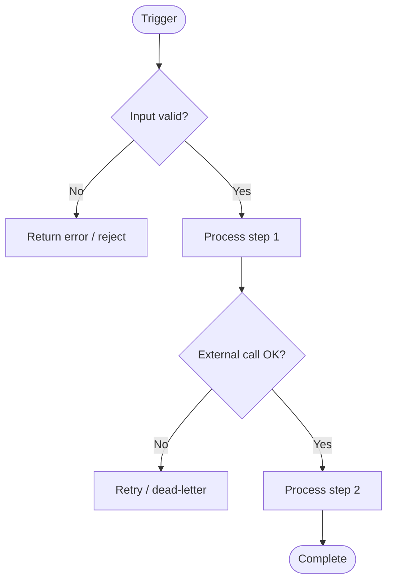

# Skill: How to Design a Workflow / Automation

Used by: `architect-agent`, `development-agent` (automation-agent)

---

## Trigger Taxonomy

Every automated workflow is initiated by one of:

| Trigger Type | Examples | Key Design Question |
|---|---|---|
| **Event-driven** | Record created/updated, message on a queue, webhook | Is the event source reliable? Can events be missed? |
| **Scheduled** | Cron job, daily batch | What happens if the schedule slips or runs twice? |
| **User-initiated** | Button press, API call, form submit | Is synchronous response required, or can it be async? |
| **Threshold / condition** | Alert when value crosses a limit | How is the threshold checked — polling or reactive? |

---

## Design Checklist

For every workflow:

- [ ] Trigger type identified and documented
- [ ] Input validated before processing begins
- [ ] Idempotency: can the workflow run twice safely? If not, document the guard
- [ ] Error handling: what happens at each failure point?
- [ ] Retry strategy: exponential back-off with a max retry cap
- [ ] Dead-letter: where do unprocessable messages go?
- [ ] Timeout: every external call has a defined timeout
- [ ] Logging: entry, exit, and error states are logged
- [ ] Alerts: on-failure notification to ops/on-call
- [ ] Data sensitivity: are credentials / PII handled safely (not logged, encrypted in transit)?

---

## Diagramming

Document every non-trivial workflow as a flowchart:

Include the diagram in the TAD (Section 5).

---

## Long-Running Processes

If a workflow runs longer than ~30 seconds:
- Make it **asynchronous** — return an accepted/queued response immediately
- Track status with a job/task record in the database
- Expose a status-check endpoint or mechanism
- Send a notification on completion or failure

---

## Compensation / Rollback

For workflows that modify multiple systems:
- Define the rollback action for each step
- Consider the Saga pattern for distributed transactions
- Prefer eventual consistency over distributed locks where possible

---

## Testing Workflows

| Test Scenario | How |
|---|---|
| Happy path | Provide valid input; assert expected outcome |
| Invalid input | Provide each bad input variant; assert rejection |
| External service failure | Mock the service returning 5xx / timeout |
| Duplicate trigger | Run the workflow twice; assert idempotent outcome |
| Timeout | Mock slow external call; assert timeout handling |
| Retry exhaustion | Exhaust retries; assert dead-letter behaviour |
