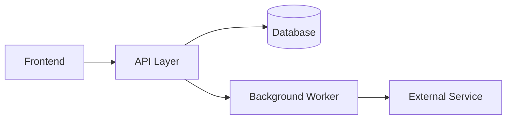

# Skill: How to Document Architecture

Used by: `architect-agent`

---

## Principles

A good TAD answers three questions for any reader:
1. **What** does the system do?
2. **How** is it structured and connected?
3. **Why** were these choices made?

Architecture documentation is a decision record, not a description of code.

---

## Diagrams

Include at least two diagram types:

### 1. Context Diagram (C4 Level 1)
Shows the system in relation to users and external systems.
Use Mermaid or ASCII art. No internal detail.

```
[User] → [This System] → [External API]
                       → [Database]
```

### 2. Component Diagram (C4 Level 2)
Shows internal components and how they communicate.



Add a sequence diagram for any non-obvious interaction flow.

---

## Data Model Documentation

For each entity:

```markdown
### <EntityName>
**Purpose:** <one sentence>
**Storage:** <table name / collection / index>
**Key Fields:**
| Field | Type | Constraints | Notes |
|---|---|---|---|
| id | UUID | PK, not null | System-generated |
| created_at | DateTime | not null, indexed | Set on insert |
```

Document all foreign keys and cascade behaviour explicitly.

---

## Decision Records

For every significant architectural choice, write an Architecture Decision Record (ADR):

```markdown
## ADR-<nnn>: <Short Title>

**Date:** <YYYY-MM-DD>
**Status:** Proposed | Accepted | Deprecated | Superseded

**Context:**
<What is the problem or situation that requires a decision?>

**Decision:**
<What was decided?>

**Consequences:**
- Positive: <benefits>
- Negative: <trade-offs or risks>
- Neutral: <things that are neither good nor bad but worth noting>
```

---

## Security Design Documentation

Document every security control with:
- **What** the control is (e.g. "JWT authentication on all API routes")
- **Where** it is applied (e.g. "API Gateway middleware")
- **Why** it was chosen (e.g. "stateless; scales horizontally")
- **How** it will be tested (e.g. "integration test: unauthenticated request → 401")

Never leave a security control undocumented or marked "TBD".

### A privilege named anywhere carries its ROLE and its source line

`IMP-0418`. **The role is the half that compression swaps.** A dispatch brief restated two
privilege facts instead of citing them and got both wrong in the same sentence: it named the wrong
role for a stale grant, and described a privilege as "still bound in source" when it had been
removed from source the day before and was bound only in the live environment — which was the
entire mechanism of the finding it was summarising. Had it been followed, one privilege every
trustee needs would have been revoked, breaking their Refresh Figures.

So: `prv<Verb><table>` **+ the role + the file:line that grants or withholds it**, every time.
A restated fact has no line to check it against, which makes an error in the restatement
undetectable at the point of reading — the mechanism `C-COM-008` already forbids for baseline
figures, and it is not a commercial rule. It holds for any fact a document or a handoff carries.

---

## Withdrawing an identifier is a whole-document grep — and EXECUTABLE sections are checked separately

`IMP-0419`, the 16th instance of `approved-document-internally-inconsistent`. One revision
withdrew a privilege in the sections that **argue** — the ADR's consequences, the security section,
the verification row closed as moot — and left it granted in two section 12 prerequisite rows that
an **operator executes**, one of which also still referred to a "first invocation" under a design
where nothing invokes anything.

The cause is structural, not carelessness: **prerequisite and rollout tables restate the privilege
set as a literal list instead of citing the section that decides it, so they cannot follow a change
made upstream.** The consequence propagated along the axis the author was thinking on
(security argument → risk → verification) and not along the axis a reader executes from
(prerequisites → rollout steps).

Three rules follow:

1. **An executable section CITES the section that decides, rather than restating it.** Prerequisites
   and rollout steps point at the privilege/column/connector table; they do not copy it.
2. **Withdrawing an identifier is a grep of the whole document for that identifier**, and the
   sections that EXECUTE are checked separately from the sections that ARGUE. They will not follow
   a change made upstream, because they restate rather than cite.
3. **Say where the residual risk actually lands.** Here no automatic re-grant occurs —
   `ensure-schema.ps1` builds its `AddPrivilegesRole` payload from the role XML on disk, and the
   privilege is no longer in it — so the exposure is a **human hand-applying a stale prerequisite
   row, per environment**, which is worst in the environments where the grant is not yet bound at
   all.

No gate is proposed for this, and the reason is measured rather than principled: a document-internal
privilege check was built two ways and scored **24 raw findings with at best one true positive**.
Every false positive had the same shape — a negation the pattern could not read, or superseded text
a delta TAD deliberately RETAINS with a supersession note. Four measured attempts across two reviews
now say a prose-proximity check cannot tell an assertion from its own retraction in this
repository's documentation style. **Assert on values, not on phrases.**

---

## What to Avoid

- Do not copy-paste code into the TAD
- Do not document implementation detail (method names, variable names)
- Do not omit trade-offs — a TAD that only describes the chosen approach is incomplete
- Do not use "TBD" for security or compliance controls
