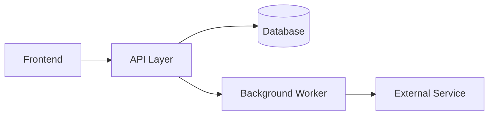

# Skill: How to Document Architecture

Used by: `architect-agent`

---

## Principles

A good TAD answers three questions for any reader:
1. **What** does the system do?
2. **How** is it structured and connected?
3. **Why** were these choices made?

Architecture documentation is a decision record, not a description of code.

---

## Diagrams

Include at least two diagram types:

### 1. Context Diagram (C4 Level 1)
Shows the system in relation to users and external systems.
Use Mermaid or ASCII art. No internal detail.

```
[User] → [This System] → [External API]
                       → [Database]
```

### 2. Component Diagram (C4 Level 2)
Shows internal components and how they communicate.



Add a sequence diagram for any non-obvious interaction flow.

---

## Data Model Documentation

For each entity:

```markdown
### <EntityName>
**Purpose:** <one sentence>
**Storage:** <table name / collection / index>
**Key Fields:**
| Field | Type | Constraints | Notes |
|---|---|---|---|
| id | UUID | PK, not null | System-generated |
| created_at | DateTime | not null, indexed | Set on insert |
```

Document all foreign keys and cascade behaviour explicitly.

---

## Decision Records

For every significant architectural choice, write an Architecture Decision Record (ADR):

```markdown
## ADR-<nnn>: <Short Title>

**Date:** <YYYY-MM-DD>
**Status:** Proposed | Accepted | Deprecated | Superseded

**Context:**
<What is the problem or situation that requires a decision?>

**Decision:**
<What was decided?>

**Consequences:**
- Positive: <benefits>
- Negative: <trade-offs or risks>
- Neutral: <things that are neither good nor bad but worth noting>
```

---

## Security Design Documentation

Document every security control with:
- **What** the control is (e.g. "JWT authentication on all API routes")
- **Where** it is applied (e.g. "API Gateway middleware")
- **Why** it was chosen (e.g. "stateless; scales horizontally")
- **How** it will be tested (e.g. "integration test: unauthenticated request → 401")

Never leave a security control undocumented or marked "TBD".

---

## What to Avoid

- Do not copy-paste code into the TAD
- Do not document implementation detail (method names, variable names)
- Do not omit trade-offs — a TAD that only describes the chosen approach is incomplete
- Do not use "TBD" for security or compliance controls
