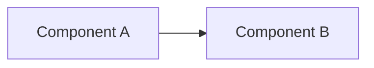

# Technical Architecture Document — <Feature Name>

**Feature Slug:** <slug>
**SDD Reference:** docs/plans/<slug>-plan.md
**Date:** <YYYY-MM-DD>
**Status:** DRAFT | APPROVED

---

## 1. Architecture Overview
<!-- High-level approach. Why this design? What alternatives were rejected? -->

## 2. Component Diagram
<!-- Load skills/how-to-document-architecture.md before completing §2–§3 -->
<!-- Use Mermaid or ASCII. Minimum: context diagram + component diagram -->

## 3. Data Model
<!-- Load skills/how-to-model-a-data-schema.md and skills/data-classification.md -->

### Entities
| Entity | Purpose | Classification |
|---|---|---|

### Relationships
<!-- FK references, cardinality, cascade behaviour -->

### Migration Strategy
<!-- How schema changes are applied across environments -->

## 4. Integration Design
| Integration | Direction | Protocol | Auth Method |
|---|---|---|---|

## 5. Automation / Workflow Design
<!-- Load skills/how-to-design-a-workflow.md -->
<!-- Describe async processes, triggers, scheduled jobs. Include flowchart. -->

## 6. Security Design
<!-- Load skills/compliance-checklist.md §1.2 and §1.3 -->
<!-- Load knowledge/technology/security-model.md for role/team/group design -->

| Concern | Control | Where Applied |
|---|---|---|
| Authentication | | |
| Authorisation | | |
| Data at rest | | |
| Data in transit | | |
| Audit logging | | |
| App registrations / API permissions | | |

### 6.1 Security Role & Group Mapping
<!-- Mandatory for any feature touching security. One row per persona (C-TECH-040). -->

| Persona | Entra Security Group | Dataverse Group Team | Security Role(s) | App Access |
|---|---|---|---|---|

## 7. Non-Functional Decisions
| NFR ID | Decision | Rationale |
|---|---|---|

## 8. Accessibility
<!-- Load skills/accessibility-checklist.md for any UI components -->

## 9. Deployment Topology
| Environment | Method | Notes |
|---|---|---|
| Dev | | |
| Test | | |
| Acc | | |
| Prd | | |

## 10. Architecture Decision Records
<!-- One ADR per significant choice. Format: Context / Decision / Consequences -->

### ADR-001: <Title>
**Context:** …  **Decision:** …  **Consequences:** …

## 11. Risks & Mitigations
| Risk | Likelihood | Impact | Mitigation |
|---|---|---|---|

## 12. Provisioning & External Dependencies
<!-- Every component that CANNOT ship in the solution: app registrations, admin consent,
     security groups, SPO sites, teams, Teams app catalog entries, group-team role
     bindings, app sharing. Each row maps to a script in provisioning/ and a block in
     config/<slug>-pipeline.yml. Scope: "tenant" → tenant_prerequisites (APPROVE TENANT);
     "per-env" → post_deploy. All scripts idempotent (C-TECH-042). -->

| Item | Type | Tool / Script | Scope | Gate |
|---|---|---|---|---|

---

## Approval
**Reviewed by:** ___________  **Date:** ___________  **Response:** `APPROVED`
